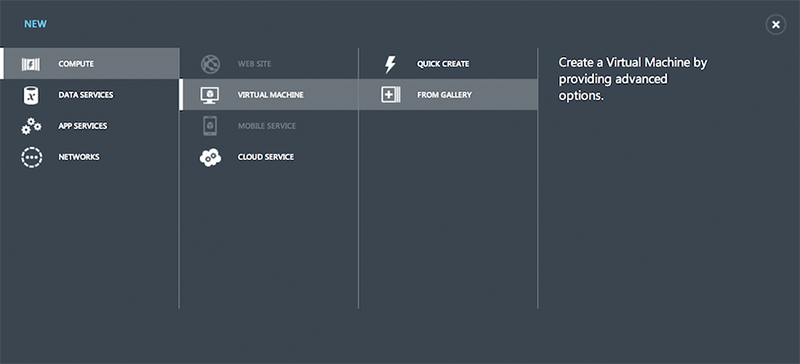

## What is Riak?

Riak is a distributed database designed to deliver maximum data availability by distributing data across multiple servers. As long as your client can reach *one* Riak server, it should be able to write data. In most failure scenarios, the data you want to read should be available, although it may not be the most up-to-date version of that data.

This fundamental tradeoff---high availability in exchange for possibly outdated information---informs the key architectural decisions behind Riak. This idea of "eventual consistency" is a common one in distributed systems, with DNS and web caches as two notable examples.


### Basho's goals for Riak

Goal | Description
-------|-------
**Availability** | Riak writes to and reads from multiple servers to offer data availability even when hardware or the network itself are experiencing failure conditions
**Operational simplicity** | Easily add new machines to your Riak cluster without incurring a larger operational burden
**Scalability** | Riak automatically distributes data around the cluster and yields a near-linear performance increase as you add capacity
**Masterless** | Your requests are not held hostage to a specific server in the cluster that may or may not be available


### When Riak makes sense

If your data does not fit on a single server and demands a distributed database architecture, then you should absolutely take a close look at Riak as a potential solution to your data availability issues. Getting distributed databases right is **very** difficult, and Riak was built to address data availability issues with as few trade-offs and downsides as possible.

In essence, Riak's focus on availability makes it a good fit whenever downtime is unacceptable. No one can promise 100% uptime, but Riak is designed to survive network partitions and hardware failures that would significantly disrupt most databases.

A less-heralded feature of Riak is its predictable latency. Because its fundamental operations---read, write, and delete---do not involve complex data joins or locks, it services those requests promptly. Thanks to this capability Riak is often selected as a data storage backend for other data management software from a variety of paradigms.

### When Riak is Less of a Good Fit

Basho recommends that you run no fewer than 5 data servers in a cluster. This means that Riak can be overkill for small databases. If you're not already sure that you will need a distributed database, there's a good chance that you won't need Riak.

Nonetheless, if explosive growth is a possibility, you are always highly advised to prepare for that in advance. Scaling at Internet speeds is sometimes compared to overhauling an airplane mid-flight. If you feel that such a transition might be necessary in the future, then you might want to consider Riak.

Riak's simple data model, consisting of keys and values as its atomic elements, means that your data must be denormalized if your system is to be reasonably performant. For most applications this is not a serious hurdle. But if your data simply cannot be effectively managed as keys and values Riak will most likely not be the best fit for you.

On a related note: while Riak offers ways to find values that match certain criteria, if your application demands a high query load by any means other than the keys---e.g. SQL-style `SELECT * FROM table` operations---Riak will not be as efficient as other databases. If you wish to compare Riak with other data technologies, Basho offers a tool called **basho_bench** to help measure its performance so that you can decide whether the availability and operational benefits of Riak outweigh its disadvantages.

## How Does a Riak Cluster Work?

### What is a Riak Node?

A Riak node is not quite the same as a server, but in a production environment the two should be equivalent. A developer may run multiple nodes on a single laptop, but this would never be advisable in a real production cluster.

Each node in a Riak cluster is equivalent, containing a complete, independent copy of the whole Riak package. There is no "master." No node has more responsibilities than others, and no node has special tasks not performed by other nodes. This uniformity provides the basis for Riak's fault tolerance and scalability.

Each node is responsible for multiple data partitions as discussed below.

### Riak Automatically Re-Distributes Data When Capacity is Added

When you add (or remove) machines, data is rebalanced automatically with no downtime. New machines claim data until ownership is equally spread around the cluster, with the resulting cluster status updates shared to every node via a gossip protocol and used to route requests. This is what makes it possible for any node in the cluster to receive requests. The end result is that developers don't need to deal with the underlying complexity of where data lives.

### Consistent Hashing

Data is distributed across nodes using consistent hashing. Consistent hashing ensures that data is evenly distributed around the cluster and makes possible the automatic redistribution of data as the cluster scales.

How does consistent hashing work? Riak stores data using a simple key/value scheme. These keys are associated with a namespace called a **bucket**. When you perform key/value operations in Riak, the bucket and key combination is hashed. The resulting hash maps onto a 160-bit integer space. You can think of this integer space as a ring used to determine what data to put on which physical machines.

How is this determination made? Riak divides the integer space into equally-sized partitions. Each partition owns a range of values on the ring, and is responsible for all buckets and keys that, when hashed, fall into that range. Each partition is managed by a process called a virtual node (or **vnode***). Physical machines evenly divide responsibility for vnodes. Let's say that you have a 4-node cluster with 32 partitions managed by 32 vnode processes. Each of the four physical machines claim eight vnodes (as illustrated below). Each physical machine thus becomes responsible for all keys represented by its eight vnodes.


### Intelligent Replication

Riak's replication scheme ensures that you can still read, write, and update data if nodes go down. Riak allows you to set a replication variable, _n_. An _n_ value of 3 (the default) means that each object is replicated 3 times. When an object's key is mapped onto a given partition, Riak won't stop there: it will automatically replicate the data onto the next two partitions as well.


## When Things Go Wrong

Riak retains fault tolerance, data integrity, and availability even in failure conditions such as hardware failure and network partitions. Riak has a number of means of addressing these scenarios and other bumps in the road, like version conflicts in data.

### Hinted Handoff

Hinted handoff enables Riak to handle node failure. If a node goes down, a neighboring node will take over its storage operations. When the failed node returns, the updates received by the neighboring node are handed back to it. This ensures availability for writes and updates and happens automatically, minimizing the operational burden of failure conditions.

### Version Conflicts

In any system that replicates data, conflicts can arise, for example when two clients update the same object at the exact same time or when not all updates have yet reached hardware that is experiencing lag. Furthermore, in Riak, replicas are "eventually consistent," meaning that while data is always available, not all replicas may have the most recent update at the exact same time, causing brief periods---generally on the order of milliseconds---of inconsistency while all state changes are synchronized.

How is this divergence addressed? When you make a read request, Riak looks up all replicas for that object. By default, Riak will return the most recently updated version, determined by looking at the object's vector clock. Vector clocks are metadata attached to each replica when it is created. They are extended each time a replica is updated to keep track of versions. You can also allow clients to resolve conflicts themselves if that is a better fit for your use case.

### Read Repair
When an outdated replica is returned as part of a read request, Riak will automatically update the out-of-sync replica to make it consistent. Read repair, a self-healing property of the database, will even update a replica that returns a `not_found` in the event that a node loses the data due to physical failure.

### Reading and Writing Data in Failure Conditions
In Riak, you can set an _r_ value for reads and a _w_ value for writes. These values give you control over how many replicas must respond to a request for it to succeed. Let's say that you have an _n_ value of 3, but one of the physical nodes responsible for a replica is down. With an r=2 setting, only 2 replicas must return results for read to be deemed successful. This allows Riak to provide read availability even when nodes are down or laggy. The same applies for the _w_ in writes. If this value is not specified, Riak defaults to **quorum**, according to which the majority of nodes must respond. There is more on [[Replication Properties]] elsewhere in the documentation.
---
title: Riak Compared to Cassandra
project: riak
version: 1.1.0+
document: appendix
toc: true
index: true
keywords: [comparisons, cassandra]
moved: {
  '1.4.0-': '/references/appendices/comparisons/Riak-Compared-to-Cassandra'
}
---

This is intended to be a brief, objective and technical comparison of Riak and Cassandra.  The Cassandra version described is 1.2.x. The Riak version described is Riak 1.2.x. If you feel this comparison is unfaithful at all for whatever reason, please [fix it](https://github.com/basho/basho_docs/issues/new) or send an email to **docs@basho.com**.


## At A Very High Level

* Both Riak and Cassandra are Apache 2.0 licensed databases based on Amazon’s Dynamo paper.
* Riak is a faithful implementation of Dynamo, with the addition of functionality like links, MapReduce, indexes, full-text Search. Cassandra departs from the Dynamo paper slightly by omitting vector clocks and moving from partition-based consistent hashing to key ranges, while adding functionality like order-preserving partitioners and range queries.
* Riak is written primarily in Erlang with some bits in C. Cassandra is written in Java.

## Feature/Capability Comparison

The table below gives a high level comparison of Riak and Cassandra features/capabilities.  To keep this page relevant in the face of rapid development on both sides, low level details are found in links to Riak and Cassandra online documentation.

<table>
    <tr>
        <th WIDTH="15%">Feature/Capability</th>
        <th WIDTH="42%">Riak</th>
        <th WIDTH="43%">Cassandra</th>
    </tr>
    <tr>
        <td>Data Model</td>
        <td>Riak stores key/value pairs in a higher level namespace called a bucket.
            <ul>
              <li>[[Buckets, Keys, and Values|Concepts#Buckets-Keys-and-Values]] </li>
            </ul>
        </td>
        <td>Cassandra's data model resembles column storage, and consists of Keyspaces, Column Families, and several other parameters.
            <ul>
              <li>[[Cassandra Data Model|http://www.datastax.com/docs/0.7/data_model/index]] </li>
            </ul>
        </td>
    </tr>
    <tr>
        <td>Storage Model</td>
        <td>Riak has a modular, extensible local storage system which lets you plug-in a backend store of your choice to suit your use case. The default backend is Bitcask.
            <ul>
              <li>[[Riak Supported Storage Backends|Choosing a Backend]]</li>
            </ul>

        You can also write you own storage backend for Riak using our [[backend API|Backend API]].
     </td>
        <td> Cassandra's write path starts with a write to a commit log followed by a subsequent write to an in-memory structure called a memtable. Writes are then batched to a persistent table structure called a sorted string table (SST).
            <ul>
              <li><a href="http://wiki.apache.org/cassandra/ArchitectureCommitLog">Commit Log</a></li>
            <li><a href="http://wiki.apache.org/cassandra/MemtableSSTable">Memtable</a></li>
            <li><a href="http://wiki.apache.org/cassandra/ArchitectureSSTable">SSTable Overview</a></li>
            <li><a href="http://www.datastax.com/docs/1.1/dml/about_writes">About Writes</a></li>
            <li><a href="http://www.datastax.com/docs/1.1/dml/about_reads">About Reads</a></li>
            </ul>
        </td>
    </tr>
    <tr>
        <td>Data Access and APIs</td>
        <td>Riak offers two primary interfaces (in addition to raw Erlang access):
			<ul>
			  <li>[[HTTP|HTTP API]]</li>
			<li>[[Protocol Buffers|PBC API]]</li>
			</ul>
			Riak Client libraries are wrappers around these APIs, and client support exists for dozens of languages. 
			<ul>
			  <li>[[Client Libraries]]</li>
			  <li>[[Community Projects]] </li>
			</ul>
			</td>
        <td>Cassandra provides various access methods including a Thrift API, CQL (Cassandra Query Language), and CLI. 
			<ul>
			  <li><a href="http://www.datastax.com/docs/1.1/dml/about_clients">Cassandra Client APIs</a></li>
			</ul>		
	 </td>
    </tr>
    <tr>
        <td>Query Types and Query-ability</td>
        <td>There are currently four ways to query data in Riak
            <ul>
            <li>Primary key operations (GET, PUT, DELETE, UPDATE)</li>
            <li>[[MapReduce|Using MapReduce]]</li>
            <li>[[Using Secondary Indexes]]</li>
            <li>[[Using Search]]</li>
            </ul>

    </td>
        <td>Cassandra offers various ways to query data:
                <ul>
                <li><a href="http://www.datastax.com/docs/0.7/data_model/keyspaces">Keyspaces</a></li>
                <li><a href="http://www.datastax.com/docs/0.7/data_model/cfs_as_indexes">Column Family Operations</a></li>
                <li><a href="http://www.datastax.com/docs/1.0/dml/using_cql">CQL</a></li>
                <li><a href="http://www.datastax.com/docs/0.7/data_model/secondary_indexes">Secondary Indexes</a></li>
                <li><a href="http://wiki.apache.org/cassandra/HadoopSupport#ClusterConfig">Hadoop Support</a></li>
            <ul>

    </td>
    </tr>
    <tr>
        <td>Data Versioning and Consistency</td>
        <td> Riak uses a data structure called a vector clock to reason about causality and staleness of stored values. Vector clocks enable clients to always write to the database in exchange for consistency conflicts being resolved at read time by either application or client code. Vector clocks can be configured to store copies of a given datum based on size and age of said datum.   There is also an option to disable vector clocks and fall back to simple time-stamp based "last-write-wins".
            <ul>
              <li>[[Vector Clocks]]</li>
              <li>[[Why Vector Clocks Are Easy|http://basho.com/blog/technical/2010/01/29/why-vector-clocks-are-easy/]]</li>
              <li>[[Why Vector Clocks Are Hard|http://basho.com/blog/technical/2010/04/05/why-vector-clocks-are-hard/]]</li>
            </ul>
         </td>

        <td>Cassandra uses timestamps at the column family level to determine the most-recent value when doing read requests. There is no built-in way to do versioning of data.
            <ul>
              <li>[[About Read Consistency|http://www.datastax.com/docs/1.1/dml/data_consistency#about-read-consistency]]</li>
            </ul>
     </td>
    </tr>
        </tr>
            <td>Concurrency</td>
            <td>In Riak, any node in the cluster can coordinate a read/write operation for any other node. Riak stresses availability for writes and reads, and puts the burden of resolution on the client at read time.
            </td>

            <td>All nodes in Cassandra are peers. A client read or write request can go to any node in the cluster. When a client connects to a node and issues a read or write request, that node serves as the coordinator for that particular client operation.
                <ul>
                    <li>[[About Client Requests|http://www.datastax.com/docs/1.0/cluster_architecture/about_client_requests]]
                </ul>
         </td>
        </tr>
    <tr>
        <td>Replication</td>
        <td>Riak's replication system is heavily influenced by the Dynamo Paper and Dr. Eric Brewer's CAP Theorem. Riak uses consistent hashing to replicate and distribute N copies of each value around a Riak cluster composed of any number of physical machines. Under the hood, Riak uses virtual nodes to handle the distribution and dynamic rebalancing of data, thus decoupling the data distribution from physical assets.
            <ul>
              <li>[[Replication]]</li>
              <li>[[Clustering|Concepts#Clustering]]</li>
            </ul>

            The Riak APIs expose tunable consistency and availability parameters that let you select which level configuration is best for your use case. Replication is configurable at the bucket level when first storing data in Riak. Subsequent reads and writes to that data can have request-level parameters.
                <ul>
                    <li>[[Reading, Writing, and Updating Data|Concepts#Reading-Writing-and-Updating-Data]]</li>
                </ul>

     </td>
        <td>Replication in Cassandra starts when a user chooses a partitioner. Partitioners include Random Partitioner (which also relies on consistent hashing for data storage) and various Ordered Partitioner options. Under the hood, physical nodes are assigned tokens which determine a nodes's position on the ring and the range of data for which it's responsible.
            <ul>
              <li>[[Replication|http://www.datastax.com/docs/1.0/cluster_architecture/replication]]</li>
            </ul>

            Like in Riak, Cassandra lets developers configure the consistency and availability requirements at the request level via various APIs.
            <ul>
                <li><a href="http://www.datastax.com/docs/1.1/dml/data_consistency#tunable-consistency">Tunable Consistency</a>
            </ul>

     </td>
    </tr>
    <tr>
        <td>Scaling Out and In</td>
        <td>Riak allows you to elastically grow and shrink your cluster while evenly balancing the load on each machine. No node in Riak is special or has any particular role. In other words, all nodes are masterless. When you add a physical machine to Riak, the cluster is made aware of its membership via gossiping of ring state. Once it's a member of the ring, it's assigned an equal percentage of the partitions and subsequently takes ownership of the data belonging to those partitions. The process for removing a machine is the inverse of this. Riak also ships with a comprehensive suite of command line tools to help make node operations simple and straightforward.

    <ul>
        <li>[[Adding and Removing Nodes]]</li>
        <li>[[Command Line Tools]]</li>
    </ul>

        <td>Cassandra allows you to add new nodes dynamically with the exception of manually calculating a node's token (though users can elect to let Cassandra calculate this). It's recommended that you double the size of your cluster to add capacity. If this isn't feasible, you can elect to either add a number of nodes (which requires token recalculation for all existing nodes), or to add one node at a time, which means leaving the initial token blank and "will probably not result in a perfectly balanced ring but it will alleviate hot spots".
            <ul>
              <li>[[Adding Capacity to an Existing Cluster|http://www.datastax.com/docs/1.1/operations/cluster_management#adding-capacity-to-an-existing-cluster]]</li>
            </ul>
    </td>
    </tr>
    <tr>
        <td>Multi-Datacenter Replication</td>

        <td>Riak features two distinct types of replication. Users can replicate to any number of nodes in one cluster (which is usually contained within one datacenter over a LAN) using the Apache 2.0 database. Riak Enterprise, Basho's commercial extension to Riak, is required for Multi-Datacenter deployments (meaning the ability to run active Riak clusters in N datacenters).

        <ul>
            <li><a href="http://basho.com/products/riak-enterprise/">Riak Enterprise</a></li>
        <ul>

        <td>Cassandra has the ability to spread nodes over multiple datacenters via various configuration parameters.
            <ul>
              <li>[[Multiple Datacenters|http://www.datastax.com/docs/1.1/initialize/cluster_init_multi_dc]]</li>
            </ul>

    </td>
    </tr>
    <tr>
        <td>Graphical Monitoring/Admin Console</td>
        <td>Riak ships with Riak Control, an open source graphical console for monitoring and managing Riak clusters.
            <ul>
                <li>[[Riak Control]]</li>
                <li>[[Introducing Riak Control|http://basho.com/blog/technical/2012/02/22/Riak-Control/]]
            </ul>
    </td>
        <td>Datastax distributes the DataStax OpsCenter, a graphical user interface for monitoring and administering Cassandra clusters. This includes a free version available for production use, as well as a for-pay version with additional features.
            <ul>
                <li>[[DataStax OpsCenter|http://www.datastax.com/products/opscenter]]</li>
            </ul>
     </td>
    </tr>
</table>
---
title: Riak Compared to Couchbase
project: riak
version: 1.1.0+
document: appendix
toc: true
index: true
keywords: [comparisons, couchbase]
moved: {
  '1.4.0-': '/references/appendices/comparisons/Riak-Compared-to-Couchbase'
}
---

This is intended to be a brief, objective and technical comparison of Riak and Couchbase (i.e. Couchbase Server).  The Couchbase version described is 2.0. The Riak version described is Riak 1.2.x. If you feel this comparison is unfaithful at all for whatever reason, please [fix it](https://github.com/basho/basho_docs/issues/new) or send an email to **docs@basho.com**.

## At A Very High Level

* Riak is Apache 2.0 licensed; According to Couchbase, they have two free versions: Couchbase open source is Apache 2.0 licensed; Couchbase Server Community Edition (free version) is licensed under a [community agreement](http://www.couchbase.com/agreement/community)
* Riak is written primarily in Erlang with some bits in C; Couchbase is written in Erlang and C/C++

<div class="note"><div class="title">Couchbase vs CouchDB</div>Keep in mind that Couchbase and CouchDB are two separate database projects.  CouchDB is a document database providing replication, MapReduce and an HTTP API.  Couchbase uses CouchDB as its backend, "wrapping" it with advanced features like caching, and is designed to be clustered.</div>

<div class="note"><div class="title">Couchbase 2.0</div>As of the time of this writing, Couchbase 2.0 is still in developer preview, so some of these points may change between now and the final release. <i>Caveat emptor</i></div>

## Feature/Capability Comparison

The table below gives a high level comparison of Riak and Couchbase features/capabilities.  To keep this page relevant in the face of rapid development on both sides, low level details are found in links to Riak and Couchbase online documentation.

<table>
    <tr>

        <th WIDTH="15%">Feature/Capability</th>
        <th WIDTH="42%">Riak</th>
        <th WIDTH="43%">Couchbase</th>
    </tr>
    <tr>
        <td>Data Model</td>
        <td>Riak stores key/value pairs in a higher level namespace called a bucket.
            <ul>
              <li>[[Buckets, Keys, and Values|Concepts#Buckets-Keys-and-Values]] </li>
            </ul>
        </td>
        <td>Couchbase is a JSON-based document datastore. Like other document datastores, records have no intrinsic relationships, and are stored in buckets. Value size is limited to 20Mbyte.
            <ul>
                <li>[[How Should I Store an Object?|http://www.couchbase.com/docs/couchbase-manual-2.0/couchbase-developing-bestpractices-objectstorage-how.html]]</li>
            </ul>
        </td>
    </tr>
    <tr>
        <td>Storage Model</td>
        <td>Riak has a modular, extensible local storage system which lets you plug-in a backend store of your choice to suit your use case. The default backend is Bitcask.
            <ul>
              <li>[[Riak Supported Storage Backends|Choosing a Backend]]</li>
            </ul>

        You can also write your own storage backend for Riak using our [[backend API|Backend API]].
     </td>
        <td>Couchbase 2.0 is largely memory-based, asynchronously persisting data using a CouchDB fork and C library "couchstore" (prior versions of Couchbase use the SQLite storage engine).
            <ul>
            <li>[[Persistence|http://www.couchbase.com/docs/couchbase-manual-2.0/couchbase-architecture-persistencedesign.html]]</li>
            <li>[[Couchbase File Format|https://github.com/couchbaselabs/couchstore/wiki/Format]]</li>
            </ul>
        </td>
    </tr>
    <tr>
        <td>Data Access and APIs</td>
        <td>Riak offers two primary interfaces (in addition to raw Erlang access):
			<ul>
			<li>[[HTTP|HTTP API]]</li>
			<li>[[Protocol Buffers|PBC API]]</li>
			</ul>
			Riak Client libraries are wrappers around these APIs, and client support exists for dozens of languages. 
			<ul>
			<li>[[Client Libraries]]</li>
			<li>[[Community Projects]]</li>
			</ul>
			</td>
        <td>Couchbase provides drivers in several languages to access data through its binary memcached protocol. Couchbase also provides a REST API to monitor and manage a cluster (though it is not used to directly manage stored data).
            <ul>
                <li>[[Client Interface|http://www.couchbase.com/docs/couchbase-manual-2.0/couchbase-introduction-architecture-clientinterface.html]]</li>
                <li>[[Client-Libraries|http://www.couchbase.com/develop]]</li>
                <li>[[Management REST API|http://www.couchbase.com/docs/couchbase-manual-2.0/couchbase-admin-restapi.html]]</li>
            </ul>
     </td>
    </tr>
    <tr>
        <td>Query Types and Query-ability</td>
        <td>There are currently four ways to query data in Riak
            <ul>
            <li>Primary key operations (GET, PUT, DELETE, UPDATE)</li>
            <li>[[Using MapReduce]]</li>
            <li>[[Using Secondary Indexes]]</li>
            <li>[[Using Search]]</li>
            </ul>
    </td>
        <td>Couchbase also provides four query options
            <ul>
            <li>[[ID lookups|http://www.couchbase.com/docs/couchbase-manual-2.0/couchbase-developing-bestpractices-multiget.html]]</li>
            <li>[[MapReduce Views|http://www.couchbase.com/docs/couchbase-manual-2.0/couchbase-views-basics.html]]</li>
            <li>[[UnQL|http://www.couchbase.com/press-releases/unql-query-language]]</li>
            </ul>
            Hadoop support is also possible through a plugin that streams data to a Hadoop Distributed File System (HDFS) or Hive for processing.
            <ul>
            <li>[[Hadoop Connector|http://www.couchbase.com/develop/connectors/hadoop]]</li>
            <ul>
    </td>
    </tr>
    <tr>
        <td>Data Versioning and Consistency</td>
        <td> Riak uses a data structure called a vector clock to reason about causality and staleness of stored values. Vector clocks enable clients to always write to the database in exchange for consistency conflicts being resolved at read time by either application or client code. Vector clocks can be configured to store copies of a given datum based on size and age of said datum.   There is also an option to disable vector clocks and fall back to simple time-stamp based "last-write-wins".
            <ul>
              <li>[[Vector Clocks]]</li>
              <li>[[Why Vector Clocks Are Easy|http://basho.com/blog/technical/2010/01/29/why-vector-clocks-are-easy/]]</li>
              <li>[[Why Vector Clocks Are Hard|http://basho.com/blog/technical/2010/04/05/why-vector-clocks-are-hard/]]</li>
            </ul>
         </td>

        <td>Couchbase is strongly consistent within a datacenter, replicating data between nodes in a cluster for failover. Inter-datacenter replication follows an eventually consistent CouchDB replication model.

            Via CouchDB, documents are internally revisioned (stored in a "_rev" value). However, prior revisions will be removed on a file compaction operation, making them unreliable.

        <ul>
        <li>[[Couchbase Architecture|http://www.couchbase.com/docs/couchbase-manual-2.0/couchbase-architecture.html]]</li>
        <li>[[Internal Version Field|http://www.couchbase.com/docs/couchbase-manual-2.0/couchbase-views-datastore-fields.html]]</li>
        </ul>
    </tr>
        <td>Concurrency</td>
        <td> In Riak, any node in the cluster can coordinate a read/write operation for any other node. Riak stresses availability for writes and reads, and puts the burden of resolution on the client at read time.
         </td>

        <td>Couchbase claims to be ACID-compliant on a per-item basis, but has no multi-operation transactions. Couchbase clients connect to a server list (or via a proxy) where keys are sharded across the nodes. Couchbase nodes inherit memcached's default (and recommended) connection limit of 10k.

        <ul>
        <li>[[Transaction and concurrency|http://www.couchbase.com/forums/thread/transaction-and-concurency]]</li>
        <li>[[Cluster Design|http://www.couchbase.com/docs/couchbase-manual-2.0/couchbase-architecture-clusterdesign.html]]</li>
        <li>[[Client-side Proxy|http://www.couchbase.com/docs/couchbase-manual-2.0/couchbase-deployment-standaloneproxy.html]]</li>
        </ul>

     </td>
    </tr>
    <tr>
        <td>Replication</td>
        <td>Riak's replication system is heavily influenced by the Dynamo Paper and Dr. Eric Brewer's CAP Theorem. Riak uses consistent hashing to replicate and distribute N copies of each value around a Riak cluster composed of any number of physical machines. Under the hood, Riak uses virtual nodes to handle the distribution and dynamic rebalancing of data, thus decoupling the data distribution from physical assets.
            <ul>
              <li>[[Replication]]</li>
              <li>[[Clustering|Concepts#Clustering]]</li>
            </ul>

            The Riak APIs expose tunable consistency and availability parameters that let you select which level configuration is best for your use case. Replication is configurable at the bucket level when first storing data in Riak. Subsequent reads and writes to that data can have request-level parameters.
                <ul>
                    <li>[[Reading, Writing, and Updating Data|Concepts#Reading-Writing-and-Updating-Data]]</li>
                </ul>

     </td>
     <td>Couchbase supports two types of replication.  For intra-datacenter clusters, Couchbase uses membase-style replication, which favors immediate consistency in the face of a network partition.  For multi-datacenter deployments, CouchDB's master-master replication is used.

            <ul>
            <li>[[CouchDB Replication|http://wiki.apache.org/couchdb/Replication]]</li>
            <li>[[Memcache Tap|http://code.google.com/p/memcached/wiki/Tap]]</li>
            <li>[[CouchDB, Couchbase, Membase|http://www.infoq.com/news/2012/05/couchdb-vs-couchbase-membase]]</li>

            </ul>
     </td>
    </tr>
    <tr>
        <td>Scaling Out and In</td>
        <td>Riak allows you to elastically grow and shrink your cluster while evenly balancing the load on each machine. No node in Riak is special or has any particular role. In other words, all nodes are masterless. When you add a physical machine to Riak, the cluster is made aware of its membership via gossiping of ring state. Once it's a member of the ring, it's assigned an equal percentage of the partitions and subsequently takes ownership of the data belonging to those partitions. The process for removing a machine is the inverse of this. Riak also ships with a comprehensive suite of command line tools to help make node operations simple and straightforward.

    <ul>
        <li>[[Adding and Removing Nodes]]</li>
        <li>[[Command Line Tools]]</li>
    </ul>
        </td>
        <td>Couchbase scales elastically by auto-sharding. They can be rebalanced to grow or shrink through the administrative interface.

        <ul>
        <li>[[Rebalancing|http://www.couchbase.com/docs/couchbase-manual-2.0/couchbase-admin-tasks-addremove.html]]</li>
        <li>[[Clone to Grow with Auto Sharding|http://www.couchbase.com/couchbase-server/features#clone_to_grow]]</li>
        </ul>
    </td>
    </tr>
    <tr>
        <td>Multi-Datacenter Replication and Awareness</td>

        <td>Riak features two distinct types of replication. Users can replicate to any number of nodes in one cluster (which is usually contained within one datacenter over a LAN) using the Apache 2.0 licensed database. Riak Enterprise, Basho's commercial extension to Riak, is required for Multi-Datacenter deployments (meaning the ability to run active Riak clusters in N datacenters).

        <ul>
            <li><a href="http://basho.com/products/riak-enterprise/">Riak Enterprise</a></li>
        </ul>

        </td>
        <td>Couchbase 2.0 supports cross-datacenter replication (XDCR).

        <ul>
        <li>[[Stabilizing Couchbase Server 2.0|http://blog.couchbase.com/stabilizing-couchbase-server-2-dot-0]]</li>
        </ul>
    </td>
    </tr>
    <tr>
        <td>Graphical Monitoring/Admin Console</td>
        <td>Riak ships with Riak Control, an open source graphical console for monitoring and managing Riak clusters.
            <ul>
                <li>[[Riak Control]]</li>
                <li>[[Introducing Riak Control|http://basho.com/blog/technical/2012/02/22/Riak-Control/]]
            </ul>
    </td>
        <td>Couchbase provides a web-based monitoring/admin console.
            <ul>
                <li>[[Admin Wed Console|http://www.couchbase.com/docs/couchbase-manual-2.0/couchbase-admin-web-console.html]]</li>
                <li>[[Monitoring Couchbase|http://www.couchbase.com/docs/couchbase-manual-2.0/couchbase-monitoring.html]]</li>
            </ul>

     </td>
    </tr>
</table>
---
title: Riak Compared to CouchDB
project: riak
version: 1.1.0+
document: appendix
toc: true
index: true
keywords: [comparisons, couchdb]
moved: {
  '1.4.0-': '/references/appendices/comparisons/Riak-Compared-to-CouchDB'
}
---

This is intended to be a brief, objective and technical comparison of Riak and CouchDB.  The CouchDB version described is 1.2.x. The Riak version described is Riak 1.2.x. If you feel this comparison is unfaithful at all for whatever reason, please [fix it](https://github.com/basho/basho_docs/issues/new) or send an email to **docs@basho.com**.

## At A Very High Level

* Riak and CouchDB are both Apache 2.0 licensed
* Riak is written primarily in Erlang with some bits in C; CouchDB is written in Erlang

## Feature/Capability Comparison

The table below gives a high level comparison of Riak and CouchDB features/capabilities.  To keep this page relevant in the face of rapid development on both sides, low level details are found in links to Riak and CouchDB online documentation.

<table>
    <tr>

        <th WIDTH="15%">Feature/Capability</th>
        <th WIDTH="42%">Riak</th>
        <th WIDTH="43%">CouchDB</th>
    </tr>
    <tr>
        <td>Data Model</td>
        <td>Riak stores key/value pairs in a higher level namespace called a bucket.
            <ul>
              <li>[[Buckets, Keys, and Values|Concepts#Buckets-Keys-and-Values]] </li>
            </ul>
        </td>
        <td>CouchDB's data format is JSON stored as documents (self-contained records with no intrinsic relationships), grouped into "database" namespaces.
            <ul>
                <li>[[Document API|http://wiki.apache.org/couchdb/HTTP_Document_API]]</li>
            </ul>
        </td>
    </tr>
    <tr>
        <td>Storage Model</td>
        <td>Riak has a modular, extensible local storage system which lets you plug-in a backend store of your choice to suit your use case. The default backend is Bitcask.
            <ul>
              <li>[[Riak Supported Storage Backends|Choosing a Backend]]</li>
            </ul>

        You can also write your own storage backend for Riak using our [[backend API|Backend API]].
     </td>
        <td>CouchDB stores data to disk by "append-only" files. As the files continue to grow, they require occasional compaction.
            <ul>
             <li>[[Indexes and File|http://guide.couchdb.org/draft/btree.html]]</li>
            </ul>
        </td>
    </tr>
    <tr>
        <td>Data Access and APIs</td>
        <td>Riak offers two primary interfaces (in addition to raw Erlang access):
			<ul>
			  <li>[[HTTP|HTTP API]]</li>
			<li>[[Protocol Buffers|PBC API]]</li>
			</ul>
			Riak Client libraries are wrappers around these APIs, and client support exists for dozens of languages. 
			<ul>
			<li>[[Client Libraries]]</li>
			<li>[[Community Projects]]</li>
			</ul>
			</td>
        <td>CouchDB provides an HTTP API for both data access and administration.

                <ul>
                <li>[[Document API|http://wiki.apache.org/couchdb/HTTP_Document_API]]</li>
                <li>[[View API|http://wiki.apache.org/couchdb/HTTP_view_API]]</a></li>
                <li>[[DB API|http://wiki.apache.org/couchdb/HTTP_database_API]]</a></li>
                </ul>

            The CouchDB community supports many client libraries.
            <ul>
              <li>[[Client-Libraries|http://wiki.apache.org/couchdb/Related_Projects/#Libraries]]</li>
            </ul>
     </td>
    </tr>
    <tr>
        <td>Query Types and Query-ability</td>
        <td>There are currently four ways to query data in Riak
            <ul>
            <li>Primary key operations (GET, PUT, DELETE, UPDATE)</li>
            <li>[[MapReduce|Using MapReduce]]</li>
            <li>[[Using Secondary Indexes]]</li>
            <li>[[Using Search]]</li>
            </ul>

    </td>
        <td>CouchDB is generally queried by direct ID lookups, or by creating MapReduce "views" that CouchDB runs to create a queryable index for querying by or computing other attributes. In addition, the ChangesAPI shows documents in the order they were last modified. Finally, there exist some community plugins to expand CouchDB's queryability, such as the CouchDB-Lucene full-text search plugin.

            <ul>
            <li>[[Views|http://wiki.apache.org/couchdb/HTTP_view_API]]</li>
            <li>[[Changes Notifications|http://guide.couchdb.org/draft/notifications.html]]</li>
            <li>[[Lucene Plugin|https://github.com/rnewson/couchdb-lucene/]]</li>
            <ul>
    </td>
    </tr>
    <tr>
        <td>Data Versioning and Consistency</td>
        <td> Riak uses a data structure called a vector clock to reason about causality and staleness of stored values. Vector clocks enable clients to always write to the database in exchange for consistency conflicts being resolved at read time by either application or client code. Vector clocks can be configured to store copies of a given datum based on size and age of said datum.   There is also an option to disable vector clocks and fall back to simple time-stamp based "last-write-wins".
            <ul>
              <li>[[Vector Clocks]]</li>
              <li>[[Why Vector Clocks Are Easy|http://basho.com/blog/technical/2010/01/29/why-vector-clocks-are-easy/]]</li>
              <li>[[Why Vector Clocks Are Hard|http://basho.com/blog/technical/2010/04/05/why-vector-clocks-are-hard/]]</li>
            </ul>
         </td>

        <td>CouchDB replicates newer document versions between nodes, making it an eventually consistent system. CouchDB uses Multi-Version Concurrency Control (MVCC) to avoid locking the database file during writes. Conflicts are left to the application to resolve at write time. Older document versions (called revisions) may be lost when the append-only database file is compacted.
            <ul>
              <li>[[Eventual Consistency|http://guide.couchdb.org/draft/consistency.html]]</li>
            </ul>
     </td>
    </tr>
        <td>Concurrency</td>
        <td> In Riak, any node in the cluster can coordinate a read/write operation for any other node. Riak stresses availability for writes and reads, and puts the burden of resolution on the client at read time.
         </td>

        <td>Because of CouchDB's append-only value mutation, individual instances will not lock. When distributed, CouchDB won't allow updating similarly keyed document without a preceding version number, and conflicts must be manually resolved before concluding a write.

            <ul>
                <li>[[No Locking|http://guide.couchdb.org/draft/consistency.html#locking]]</li>
                <li>[[Conflict Management|http://guide.couchdb.org/draft/conflicts.html]]</li>
            </ul>
     </td>
    </tr>
    <tr>
        <td>Replication</td>
        <td>Riak's replication system is heavily influenced by the Dynamo Paper and Dr. Eric Brewer's CAP Theorem. Riak uses consistent hashing to replicate and distribute N copies of each value around a Riak cluster composed of any number of physical machines. Under the hood, Riak uses virtual nodes to handle the distribution and dynamic rebalancing of data, thus decoupling the data distribution from physical assets.
            <ul>
              <li>[[Replication]]</li>
              <li>[[Clustering|Concepts#Clustering]]</li>
            </ul>

            The Riak APIs expose tunable consistency and availability parameters that let you select which level configuration is best for your use case. Replication is configurable at the bucket level when first storing data in Riak. Subsequent reads and writes to that data can have request-level parameters.
                <ul>
                    <li>[[Reading, Writing, and Updating Data|Concepts#Reading-Writing-and-Updating-Data]]</li>
                </ul>

     </td>
        <td>CouchDB incrementally replicates document changes between nodes. It can be deployed with master/master or master/slave replication. Replication can be finely controlled by way of replication filters.

            <ul>
            <li>[[Replication|http://wiki.apache.org/couchdb/Replication]]</li>
            </ul>
     </td>
    </tr>
    <tr>
        <td>Scaling Out and In</td>
        <td>Riak allows you to elastically grow and shrink your cluster while evenly balancing the load on each machine. No node in Riak is special or has any particular role. In other words, all nodes are masterless. When you add a physical machine to Riak, the cluster is made aware of its membership via gossiping of ring state. Once it's a member of the ring, it's assigned an equal percentage of the partitions and subsequently takes ownership of the data belonging to those partitions. The process for removing a machine is the inverse of this. Riak also ships with a comprehensive suite of command line tools to help make node operations simple and straightforward.

    <ul>
        <li>[[Adding and Removing Nodes]]</li>
        <li>[[Command Line Tools]]</li>
    </ul>
        </td>
        <td>Out of the box, CouchDB is focused on a master-master replication of values (using MVCC to help with conflict resolution). There are external projects that help manage a CouchDB cluster, such as BigCouch (also Apache 2.0 licensed), that shards values across multiple nodes.

            <ul>
                <li>[[BigCouch|http://bigcouch.cloudant.com/]]</li>
                <li>[[Sharding (on Wikipedia)|http://en.wikipedia.org/wiki/Sharding]]</li>
            </ul>
    </td>
    </tr>
    <tr>
        <td>Multi-Datacenter Replication and Awareness</td>

        <td>Riak features two distinct types of replication. Users can replicate to any number of nodes in one cluster (which is usually contained within one datacenter over a LAN) using the Apache 2.0 licensed database. Riak Enterprise, Basho's commercial extension to Riak, is required for Multi-Datacenter deployments (meaning the ability to run active Riak clusters in N datacenters).

        <ul>
            <li><a href="http://basho.com/products/riak-enterprise/">Riak Enterprise</a></li>
        </ul>

        </td>
        <td>CouchDB can be configured to run in multiple datacenters. Robust awareness will generally require a third part solution, or by developing replication filters.

            <ul>
            <li>[[Filtered Replication|http://wiki.apache.org/couchdb/Replication#Filtered_Replication]]</li>
            <li>[[The Split Brain|http://guide.couchdb.org/draft/conflicts.html#brain]]</li>
            </ul>

    </td>
    </tr>
    <tr>
        <td>Graphical Monitoring/Admin Console</td>
        <td>Riak ships with Riak Control, an open source graphical console for monitoring and managing Riak clusters.
            <ul>
                <li>[[Riak Control]]</li>
                <li>[[Introducing Riak Control|http://basho.com/blog/technical/2012/02/22/Riak-Control/]]
            </ul>
    </td>
        <td>CouchDB ships with a graphical interface called Futon.

            <ul>
                <li>[[Welcome to Futon|http://guide.couchdb.org/draft/tour.html#welcome]]</li>
            </ul>
     </td>
    </tr>
</table>
---
title: Riak Compared to DynamoDB
project: riak
version: 1.3.0+
document: appendix
toc: true
index: true
keywords: [comparisons, dynamodb]
moved: {
  '1.4.0-': '/references/appendices/comparisons/Riak-Compared-to-DynamoDB'
}
---

This is intended to be a brief, objective, and technical comparison of Riak and Amazon DynamoDB.  The DynamoDB version described is API Version 2011-12-05. The Riak version described is Riak 1.3.x. If you feel this comparison is unfaithful at all for whatever reason, please [fix it](https://github.com/basho/basho_docs/issues/new) or send an email to **docs@basho.com**.

## At A Very High Level

* Riak is an Apache 2.0 open source licensed project. DynamoDB is a fully managed NoSQL database service that is provided by Amazon as part of Amazon Web Services.
* Because DynamoDB is a database service, its implementation details (language, architecture, etc.) cannot be verified.

## Feature/Capability Comparison

The table below gives a high level comparison of Riak and DynamoDB features/capabilities.  To keep this page relevant in the face of rapid development on both sides, low level details are found in links to Riak and DynamoDB's online documentation.

<table>
    <tr>
        <th WIDTH="15%">Feature/Capability</th>
        <th WIDTH="42%">Riak</th>
        <th WIDTH="43%">DynamoDB</th>
    </tr>
    <tr>
        <td>Data Model</td>
        <td>Riak stores key/value pairs in a higher level namespsace called a bucket.
            <ul>
              <li>[[Buckets, Keys, and Values|Concepts#Buckets-Keys-and-Values]] </li>
            </ul>
        </td>
        <td>DynamoDB's data model contains tables, items, and attributes. A database is a collection of tables. A table is a collection of items and each item is a collection of attributes.
            <ul>
              <li>[[DynamoDB Data Model|http://docs.aws.amazon.com/amazondynamodb/latest/developerguide/DataModel.html]]</li>
            </ul>
        </td>
    </tr>
    <tr>
        <td>Storage Model</td>
        <td>Riak has a modular, extensible local storage system which lets you plug-in a backend store of your choice to suit your use case. The default backend is Bitcask.
            <ul>
              <li>[[Riak Supported Storage Backends|Choosing a Backend]]</li>
            </ul>

        You can also write you own storage backend for Riak using our [[backend API|Backend API]].
     </td>
        <td>All data items are stored on Solid State Disks (SSDs) and replicated across multiple [[Availability Zones|http://docs.aws.amazon.com/AWSEC2/latest/UserGuide/using-regions-availability-zones.html]] within a [[Region|http://docs.aws.amazon.com/AWSEC2/latest/UserGuide/using-regions-availability-zones.html]].
        </td>
    </tr>
    <tr>
        <td>Data Access and APIs</td>
        <td>Riak offers two primary interfaces (in addition to raw Erlang access):
			<ul>
			  <li>[[HTTP|HTTP API]]</li>
			<li>[[Protocol Buffers|PBC API]]</li>
			</ul>
			Riak Client libraries are wrappers around these APIs, and client support exists for dozens of languages.
			<ul>
			  <li>[[Client Libraries]]</li>
			  <li>[[Community Projects]] </li>
			</ul>
			</td>
        <td>DynamoDB is a web service that uses HTTP as a transport and JavaScript Object Notation (JSON) as a message serialization format. Alternatively, you can use AWS SDKs that wrap the DynamoDB API calls.
            <ul>
              <li>[[API Reference for DynamoDB|http://docs.aws.amazon.com/amazondynamodb/latest/developerguide/API.html]]</li>
        <li>[[Using the AWS SDKs with DynamoDB|http://docs.aws.amazon.com/amazondynamodb/latest/developerguide/UsingAWSSDK.html]]</li>
            </ul>
     </td>
    </tr>
    <tr>
        <td>Query Types and Query-ability</td>
        <td>There are currently four ways to query data in Riak
            <ul>
            <li>Primary key operations (GET, PUT, DELETE, UPDATE)</li>
            <li>[[MapReduce|Using MapReduce]]</li>
            <li>[[Using Secondary Indexes]]</li>
            <li>[[Using Search]]</li>
            </ul>

    </td>
        <td>DynamoDB offers three approaches to query data:
                <ul>
          <li>Primary key operations (GET, PUT, DELETE, UPDATE)</li>
          <li>[[Query|http://docs.aws.amazon.com/amazondynamodb/latest/developerguide/queryingdynamodb.html]]</li>
          <li>[[Scan|http://docs.aws.amazon.com/amazondynamodb/latest/developerguide/scandynamodb.html]]</li>
          <li>[[Local Secondary Indexes|http://docs.aws.amazon.com/amazondynamodb/latest/developerguide/LSI.html]]</li>
            <ul>
    </td>
    </tr>
    <tr>
        <td>Data Versioning and Consistency</td>
        <td> Riak uses a data structure called a vector clock to reason about causality and staleness of stored values. Vector clocks enable clients to always write to the database in exchange for consistency conflicts being resolved at read time by either application or client code. Vector clocks can be configured to store copies of a given datum based on size and age of said datum.   There is also an option to disable vector clocks and fall back to simple time-stamp based "last-write-wins".
            <ul>
              <li>[[Vector Clocks]]</li>
              <li>[[Why Vector Clocks Are Easy|http://basho.com/blog/technical/2010/01/29/why-vector-clocks-are-easy/]]</li>
              <li>[[Why Vector Clocks Are Hard|http://basho.com/blog/technical/2010/04/05/why-vector-clocks-are-hard/]]</li>
            </ul>
         </td>

        <td>DynamoDB data is eventually consistent, meaning that your read request immediately after a write operation might not show the latest change. However, it also offers you the option to request the most up-to-date version of the data.
            <ul>
              <li>[[Data Read and Consistency Considerations|http://docs.aws.amazon.com/amazondynamodb/latest/developerguide/APISummary.html]]</li>
            </ul>
     </td>
    </tr>
        </tr>
            <td>Concurrency</td>
            <td>In Riak, any node in the cluster can coordinate a read/write operation for any other node. Riak stresses availability for writes and reads, and puts the burden of resolution on the client at read time.
            </td>

            <td>Dedicated resources are allocated to your table (tunable via API) to meet performance requirements, and data is automatically partitioned over a number of servers to meet request capacity.
                <ul>
                    <li>[[Provisioned Throughput|http://docs.aws.amazon.com/amazondynamodb/latest/developerguide/ProvisionedThroughputIntro.html]]
                </ul>
        Read and write capacity unit requirements are set at table creation time. When requests such as get, update or delete are issued, capacity units set for the table are consumed.

        <ul>
          <li>[[Capacity Units Calculations|http://docs.aws.amazon.com/amazondynamodb/latest/developerguide/WorkingWithDDTables.html#CapacityUnitCalculations]]</li>
        </ul>
         </td>
        </tr>
    <tr>
        <td>Replication</td>
        <td>Riak's replication system is heavily influenced by the Dynamo Paper and Dr. Eric Brewer's CAP Theorem. Riak uses consistent hashing to replicate and distribute N copies of each value around a Riak cluster composed of any number of physical machines. Under the hood, Riak uses virtual nodes to handle the distribution and dynamic rebalancing of data, thus decoupling the data distribution from physical assets.
            <ul>
              <li>[[Replication]]</li>
              <li>[[Clustering|Concepts#Clustering]]</li>
            </ul>

            The Riak APIs expose tunable consistency and availability parameters that let you select which level configuration is best for your use case. Replication is configurable at the bucket level when first storing data in Riak. Subsequent reads and writes to that data can have request-level parameters.
                <ul>
                    <li>[[Reading, Writing, and Updating Data|Concepts#Reading-Writing-and-Updating-Data]]</li>
                </ul>

     </td>
        <td>DynamoDB synchronously replicates your data across multiple [[Availability Zones|http://docs.aws.amazon.com/AWSEC2/latest/UserGuide/using-regions-availability-zones.html]] within a [[Region|http://docs.aws.amazon.com/AWSEC2/latest/UserGuide/using-regions-availability-zones.html]] to help protect data against individual machine or facility failures.
     </td>
    </tr>
    <tr>
        <td>Scaling Out and In</td>
        <td>Riak allows you to elastically grow and shrink your cluster while evenly balancing the load on each machine. No node in Riak is special or has any particular role. In other words, all nodes are masterless. When you add a physical machine to Riak, the cluster is made aware of its membership via gossiping of ring state. Once it's a member of the ring, it's assigned an equal percentage of the partitions and subsequently takes ownership of the data belonging to those partitions. The process for removing a machine is the inverse of this. Riak also ships with a comprehensive suite of command line tools to help make node operations simple and straightforward.

         <ul>
          <li>[[Adding and Removing Nodes]]</li>
          <li>[[Command Line Tools]]</li>
        </ul>

        <td>DynamoDB requires that you specify your required read and write throughput values when you create a table – throughput values can be increased and decreased later as access requirements change. This is used to reserve sufficient hardware resources and appropriately partitions your data over multiple servers to meet your throughput requirements.
          <ul>
            <li>[[Provisioned Throughput|http://docs.aws.amazon.com/amazondynamodb/latest/developerguide/ProvisionedThroughputIntro.html]]
            </ul>
          </td>
    </tr>
    <tr>
        <td>Multi-Datacenter Replication</td>

        <td>Riak features two distinct types of replication. Users can replicate to any number of nodes in one cluster (which is usually contained within one datacenter over a LAN) using the Apache 2.0 database. Riak Enterprise, Basho's commercial extension to Riak, is required for Multi-Datacenter deployments (meaning the ability to run active Riak clusters in N datacenters).

        <ul>
            <li><a href="http://basho.com/products/riak-enterprise/">Riak Enterprise</a></li>
        <ul>

        <td>DynamoDB has the ability to spread instances over multiple [[Availability Zones|http://docs.aws.amazon.com/AWSEC2/latest/UserGuide/using-regions-availability-zones.html]] within a Region, but not across multiple [[Regions|http://docs.aws.amazon.com/AWSEC2/latest/UserGuide/using-regions-availability-zones.html]]. Availability Zones are not geographically dispersed.
        </td>
    </tr>
    <tr>
        <td>Graphical Monitoring/Admin Console</td>
        <td>Riak ships with Riak Control, an open source graphical console for monitoring and managing Riak clusters.
            <ul>
                <li>[[Riak Control]]</li>
                <li>[[Introducing Riak Control|http://basho.com/blog/technical/2012/02/22/Riak-Control/]]
            </ul>
    </td>
        <td>DynamoDB and [[CloudWatch|http://aws.amazon.com/cloudwatch/]] are integrated, which allows you to monitor a variety of metrics.
            <ul>
                <li>[[Monitoring Amazon DynamoDB|http://docs.aws.amazon.com/amazondynamodb/latest/developerguide/MonitoringDynamoDB.html]]</li>
            </ul>
     </td>
    </tr>
</table>
---
title: Riak Compared to HBase
project: riak
version: 1.1.0+
document: appendix
toc: true
index: true
keywords: [comparisons, hbase]
moved: {
  '1.4.0-': '/references/appendices/comparisons/Riak-Compared-to-HBase'
}
---

This is intended to be a brief, objective and technical comparison of Riak and HBase. The HBase version described is 0.94.x. The Riak version described is Riak 1.2.x. If you feel this comparison is unfaithful at all for whatever reason, please [fix it](https://github.com/basho/basho_docs/issues/new) or send an email to **docs@basho.com**.

## At A Very High Level

* Riak and HBase are both Apache 2.0 licensed
* Riak is based on Amazon's Dynamo paper; HBase is based on Google's BigTable
* Riak is written primarily in Erlang with some C; HBase is written in Java

## Feature/Capability Comparison

The table below gives a high level comparison of Riak and HBase features and capabilities. To keep this page relevant in the face of rapid development on both sides, low level details are found in links to Riak and HBase online documentation.

<table>
    <tr>
        <th WIDTH="15%">Feature/Capability</th>
        <th WIDTH="42%">Riak</th>
        <th WIDTH="43%">HBase</th>
    </tr>
    <tr>
        <td>Data Model</td>
        <td>Riak stores key/value pairs in a higher level namespace called a bucket.
            <ul>
              <li>[[Buckets, Keys, and Values|Concepts#Buckets, Keys, and Values]] </li>
            </ul>
        </td>
        <td>HBase stores data in a pre-defined column family format (each grouping of data has a key, and any number of column attributes which may be versioned individually). Data in HBase is sorted, sparse, and physically grouped by column family (rather than by row, as in a relational database). HBase calls their groupings "tables".
            <ul>
                <li>[[HBase Data Model|http://hbase.apache.org/book/datamodel.html]]</li>
                <li>[[Supported Data Types|http://hbase.apache.org/book/supported.datatypes.html]]</li>
            </ul>
        </td>
    </tr>
    <tr>
        <td>Storage Model</td>
        <td>Riak has a modular, extensible local storage system which features pluggable backend stores designed to fit a variety of use cases. The default Riak backend store is Bitcask.
            <ul>
              <li>[[Riak Supported Storage Backends|Choosing a Backend]]</li>
            </ul>
        You can also write your own storage backend for Riak using our [[backend API|Backend API]].
     </td>
        <td>Hadoop Distributed File System (HDFS) is the storage system used by HBase. Data is stored in MemStores and StoreFiles, where data is streamed to disk (implemented via HFiles, a format based on BigTable's SSTable). Implementations generally use the native JVM-managed I/O file stream.
            <ul>
             <li>[[HDFS|http://en.wikipedia.org/wiki/Apache_Hadoop#Hadoop_Distributed_File_System]]</li>
             <li>[[Hadoop Uses HDFS|http://hbase.apache.org/book/arch.hdfs.html]]</li>
            </ul>
        </td>
    </tr>
    <tr>
        <td>Data Access and Application Programming Interfaces (APIs)</td>
        <td>In addition to raw Erlang access, Riak offers two primary APIs:
			<ul>
				<li>[[HTTP|HTTP API]]</li>
				<li>[[Protocol Buffers|PBC API]]</li>
			</ul>
			Riak Client libraries are wrappers around these APIs, and client support exists for dozens of languages.
			<ul>
				<li>[[Client Libraries]]</li><li>[[Community Projects]]</li>
			</ul>
			</td>
        <td>HBase communicates primarily through code that runs on the JVM (Java, Jython, Groovy, etc.). Alternatively, HBase provides external protocols; either REST or Thrift (a cross-language data service format).
            <ul>
                <li>[[Java Interface|http://hbase.apache.org/book/architecture.html]]</li>
                <li>[[REST|http://wiki.apache.org/hadoop/Hbase/Stargate]]</li>
                <li>[[Thrift|http://thrift.apache.org/]]</li>
            </ul>
     </td>
    </tr>
    <tr>
        <td>Query Types and Query-ability</td>
        <td>There are currently four ways to query Riak.
            <ul>
            <li>Primary key operations (GET, PUT, DELETE, UPDATE)</li>
            <li>[[MapReduce|Using MapReduce]]</li>
            <li>[[Using Secondary Indexes]]</li>
            <li>[[Using Search]]</li>
            </ul>

    </td>
        <td>HBase has two query options: looking up values by getting/scanning through ordered keys (optionally filtering out values or using a secondary index), or by using Hadoop to perform MapReduce.
            <ul>
                <li>[[Scanning|http://hbase.apache.org/book/client.filter.html]]</li>
                <li>[[MapReduce|http://hbase.apache.org/book/mapreduce.html]]</li>
                <li>[[Secondary Indexes|http://hbase.apache.org/book/secondary.indexes.html]]</li>
            </ul>
    </td>
    </tr>
    <tr>
        <td>Data Versioning and Consistency</td>
        <td>Riak uses a data structure called a vector clock to reason about causality and staleness of stored values. Vector clocks enable clients to always write to the database in exchange for consistency conflicts being resolved at read time by either application or client code. Vector clocks can be configured to store copies of a given datum based on size and age of said datum. There is also an option to disable vector clocks and fall back to simple time-stamp based "last-write-wins".
            <ul>
              <li>[[Vector Clocks]]</li>
              <li>[[Why Vector Clocks Are Easy|http://basho.com/blog/technical/2010/01/29/why-vector-clocks-are-easy/]]</li>
              <li>[[Why Vector Clocks Are Hard|http://basho.com/blog/technical/2010/04/05/why-vector-clocks-are-hard/]]</li>
            </ul>
         </td>
        <td>HBase has strongly consistent reads/writes. Data may be autosharded across regions and redistributed as data changes.

        Column families may contain an unbounded number of versions, with optional TTL.
            <ul>
                <li>[[Consistent Architecture|http://hbase.apache.org/book/architecture.html#arch.overview.nosql]]</li><li>[[Time to Live|http://hbase.apache.org/book/ttl.html]]</li>
            </ul>
     </td>
    </tr>
        <td>Concurrency</td>
        <td> In Riak, any node in the cluster can coordinate a read/write operation for any other node. Riak stresses availability for writes and reads, and puts the burden of resolution on the client at read time.
         </td>

        <td>HBase guarantees write atomicity and locks per row. HBase has also recently added multi-action and multi-row local transactions (though you cannot mix read/write actions).
            <ul>
                <li>[[Consistency Guarantees|http://hbase.apache.org/acid-semantics.html]]</li>
                <li>[[http://hadoop-hbase.blogspot.com/2012/03/acid-in-hbase.html]]</li>
            </ul>
     </td>
    </tr>
    <tr>
        <td>Replication</td>
        <td>Riak's replication system is heavily influenced by the Dynamo Paper and Dr. Eric Brewer's CAP Theorem. Riak uses consistent hashing to replicate and distribute N copies of each value around a Riak cluster composed of any number of physical machines. Under the hood, Riak uses virtual nodes to handle the distribution and dynamic rebalancing of data, thus decoupling the data distribution from physical assets.
            <ul>
              <li>[[Replication]]</li>
              <li>[[Clustering|Concepts#Clustering]]</li>
            </ul>

            The Riak APIs expose tunable consistency and availability parameters that let you select which level of configuration is best for your use case. Replication is configurable at the bucket level when first storing data in Riak. Subsequent reads and writes to that data can have request-level parameters.
                <ul>
                    <li>[[Reading, Writing, and Updating Data|Concepts#Reading, Writing, and Updating Data]]</li>
                </ul>
     </td>
        <td>HBase supports in-cluster and between-cluster replication. In-cluster replication is handled by HDFS and replicates underlying data files according to Hadoop's settings. Between-cluster replicates by an eventually consistent master/slave push, or more recently added (experimental) master/master and cyclic (where each node plays the role of master and slave) replication.
        <ul>
        <li>[[Replication|http://hbase.apache.org/replication.html]]</li>
        </ul>
     </td>
    </tr>
    <tr>
        <td>Scaling Out and In</td>
        <td>Riak allows you to elastically grow and shrink your cluster while evenly balancing the load on each machine. No node in Riak is special or has any particular role. In other words, all nodes are masterless. When you add a physical machine to Riak, the cluster is made aware of its membership via gossiping of ring state. Once it's a member of the ring, it's assigned an equal percentage of the partitions and subsequently takes ownership of the data belonging to those partitions. The process for removing a machine is the inverse of this. Riak also ships with a comprehensive suite of command line tools to help make node operations simple and straightforward.
    <ul>
        <li>[[Adding and Removing Nodes]]</li>
        <li>[[Command Line Tools]]</li>
    </ul>
        </td>
        <td>HBase shards by way or regions, that automatically split and redistribute growing data. A crash on a region requires crash recovery. HBase can be made to scale in with some intervention on the part of the developer or DBA.
            <ul>
                <li>[[Regions|http://hbase.apache.org/book/regions.arch.html]]</li>
                <li>[[Node Management|http://hbase.apache.org/book/node.management.html]]</li>
                <li>[[HBase Architecture|http://hbase.apache.org/book/architecture.html]]</li>
            </ul>
    </td>
    </tr>
    <tr>
        <td>Multi-Datacenter Replication and Awareness</td>

        <td>Riak features two distinct types of replication. Users can replicate to any number of nodes in one cluster (which is usually contained within one datacenter over a LAN) using the Apache 2.0 licensed database. Riak Enterprise, Basho's commercial extension to Riak, is required for Multi-Datacenter deployments (meaning the ability to run active Riak clusters in N datacenters).
        <ul>
            <li><a href="http://basho.com/products/riak-enterprise/">Riak Enterprise</a></li>
        </ul>

        </td>
        <td>HBase shards by way of regions, that themselves may be replicated across multiple datacenters.
            <ul>
              <li>[[Node Management|http://hbase.apache.org/replication.html]]</li>
            </ul>
    </td>
    </tr>
    <tr>
        <td>Graphical Monitoring/Admin Console</td>
        <td>Riak ships with Riak Control, an open source graphical console for monitoring and managing Riak clusters.
            <ul>
                <li>[[Riak Control]]</li>
                <li>[[Introducing Riak Control|http://basho.com/blog/technical/2012/02/22/Riak-Control/]]
            </ul>
    </td>
        <td>HBase has a few community supported graphical tools, and a command-line admin console.
        <ul>
        <li>[[Admin Console Tools|http://hbase.apache.org/book/ops_mgt.html#tools]]</li>
        <li>[[Eclipse Dev Plugin|http://wiki.apache.org/hadoop/Hbase/EclipseEnvironment]]</li>
        <li>[[HBase Manager|http://sourceforge.net/projects/hbasemanagergui/]]</li>
        <li>[[GUI Admin|https://github.com/zaharije/hbase-gui-admin]]</li>
        </ul>
     </td>
    </tr>
</table>
---
title: Riak Comparisons
project: riak
version: 0.10.0+
document: appendix
toc: true
index: true
keywords: [comparisons]
moved: {
  '1.4.0-': '/references/appendices/comparisons'
}
---

The NoSQL space, as well as the database space in general, is growing ever-crowded. Because of this, we often find ourselves answering very high-level questions from developers, prospects, and customers along the lines of, "How does Riak compare to this database?" or "What is the main difference between your replication strategy and this NoSQL Database?" So, we thought it would be a worthwhile exercise to make available very brief and objective comparisons to as many databases as possible. (The list below will be growing as soon as we have the time to grow it.)

* [[Riak Compared to Cassandra]]
* [[Riak Compared to Couchbase]]
* [[Riak Compared to CouchDB]]
* [[Riak Compared to HBase]]
* [[Riak Compared to MongoDB]]
* [[Riak Compared to Neo4j]]
* [[Riak Compared to DynamoDB]]

_Disclaimer: We tried to get this right, but software is complicated, and it changes rapidly. If you think we have made an error, please kindly correct us, and we will be happy to make the change._

## Slide Decks

This is a sample of the slide decks used in presentations given by Riak Core Developers and Developer Advocates, and members of the Riak Community at conferences, meetups, and various other events worldwide. *(If you have a Slide Deck to add, please fork the [Riak Docs Repo on GitHub](https://github.com/basho/basho_docs) and do so.)*


* [[Choosing The Right NoSQL Database - 4Developers|http://www.slideshare.net/juokaz/choosing-the-right-nosql-database-4developers]] - A whirlwind tour of a few NoSQL solutions, learning the very different ways they represent data and seeing their unique strengths and weaknesses in various kinds of applications. Along the way, we'll learn why new technologies must be introduced to address today's scaling challenges, and what compromises we'll have to make if we want to abandon the databases of our youth.
* [[Rolling With Riak|http://www.slideshare.net/johnthethird/rolling-with-riak]] - Overview of Riak's NoSQL distributed key/value data store by John Lynch from Rigel Group.
* [[How does Riak compare to Cassandra?|http://www.slideshare.net/ukd1/how-does-riak-compare-to-cassandra-cassandra-london-user-group-july-2011]] - A presentation about Riak and quick comparison to Cassandra. Presented originally at the Cassandra London User Group in July 2011.
---
title: Riak Compared to MongoDB
project: riak
version: 1.1.0+
document: appendix
toc: true
index: true
keywords: [comparisons, mongodb]
moved: {
  '1.4.0-': '/references/appendices/comparisons/Riak-Compared-to-MongoDB'
}
---

This is intended to be a brief, objective and technical comparison of Riak and MongoDB.  The MongoDB version described is 2.2.x. The Riak version described is Riak 1.2.x. If you feel this comparison is unfaithful at all for whatever reason, please [fix it](https://github.com/basho/basho_docs/issues/new) or send an email to **docs@basho.com**.

## At A Very High Level

* Riak is Apache 2.0 licensed; MongoDB is distributed under the AGPL
* Riak is written primarily in Erlang with some bits in C; MongoDB is written in C++

## Feature/Capability Comparison

The table below gives a high level comparison of Riak and MongoDB features/capabilities.  To keep this page relevant in the face of rapid development on both sides, low level details are found in links to Riak and MongoDB online documentation.

<table>
    <tr>

        <th WIDTH="15%">Feature/Capability</th>
        <th WIDTH="42%">Riak</th>
        <th WIDTH="43%">MongoDB</th>
    </tr>
    <tr>
        <td>Data Model</td>
        <td>Riak stores key/value pairs in a higher level namespace called a bucket.
            <ul>
              <li>[[Buckets, Keys, and Values|Concepts#Buckets-Keys-and-Values]] </li>
            </ul>
        </td>
        <td>MongoDB's data format is BSON (binary equivalent to JSON) stored as documents (self-contained records with no intrinsic relationships). Documents in MongoDB may store any of the defined BSON types and are grouped in collections.
            <ul>
                <li>[[Documents|http://www.mongodb.org/display/DOCS/Documents]]</li>
                <li>[[Data Types and Conventions|http://www.mongodb.org/display/DOCS/Data+Types+and+Conventions]]</li>

            </ul>
        </td>
    </tr>
    <tr>
        <td>Storage Model</td>
        <td>Riak has a modular, extensible local storage system which lets you plug-in a backend store of your choice to suit your use case. The default backend is Bitcask.
            <ul>
              <li>[[Riak Supported Storage Backends|Choosing a Backend]]</li>
            </ul>

        You can also write your own storage backend for Riak using our [[backend API|Backend API]].
     </td>
        <td> MongoDB's default storage system is the Memory-Mapped Storage Engine. It uses memory mapped files for all disk I/O.  It is the responsibility of the OS to manage flushing data to disk and paging data in and out.
            <ul>
             <li>[[Caching|http://www.mongodb.org/display/DOCS/Caching]]</li>
            </ul>
        </td>
    </tr>
    <tr>
        <td>Data Access and APIs</td>
        <td>Riak offers two primary interfaces (in addition to raw Erlang access):
			<ul>
			  <li>[[HTTP|HTTP API]]</li>
			<li>[[Protocol Buffers|PBC API]]</li>
			</ul>
			Riak Client libraries are wrappers around these APIs, and client support exists for dozens of languages. 
			<ul>
			  <li>[[Client Libraries]]</li>
			  <li>[[Community Projects]]</li>
			</ul>
			</td>
        <td> MongoDB uses a custom, socket-based wire protocol with BSON as the interchange format. 
	
			<ul>
				<li><a href="http://www.mongodb.org/display/DOCS/Mongo+Wire+Protocol">Mongo Wire Protocol</a></li>
			</ul>
			
			10Gen and the Mongo community support many client libraries.
			<ul>	
			  <li>[[Client-Libraries|http://www.mongodb.org/display/DOCS/Drivers]]</li>
			</ul>
	 </td>
    </tr>
    <tr>
        <td>Query Types and Query-ability</td>
        <td>There are currently four ways to query data in Riak
            <ul>
            <li>Primary key operations (GET, PUT, DELETE, UPDATE)</li>
            <li>[[MapReduce|Using MapReduce]]</li>
            <li>[[Using Secondary Indexes]]</li>
            <li>[[Using Search]]</li>
            </ul>

    </td>
        <td>MongoDB has a query interface that has some similarities to relational databases, including secondary indexes that can be derived from the stored documents. MongoDB also has facilities for performing MapReduce queries and ad-hoc queries on documents. Hadoop support is available, too.
                <ul>
                <li>[[Querying|http://www.mongodb.org/display/DOCS/Querying]]</li>
                <li>[[Indexes|http://www.mongodb.org/display/DOCS/Indexes]]</li>
                <li>[[MapReduce|http://www.mongodb.org/display/DOCS/MapReduce]]</li>
                <li>[[MongoDB Hadoop Adapter|https://github.com/mongodb/mongo-hadoop]]</li>
            <ul>
    </td>
    </tr>
    <tr>
        <td>Data Versioning and Consistency</td>
        <td> Riak uses a data structure called a vector clock to reason about causality and staleness of stored values. Vector clocks enable clients to always write to the database in exchange for consistency conflicts being resolved at read time by either application or client code. Vector clocks can be configured to store copies of a given datum based on size and age of said datum.   There is also an option to disable vector clocks and fall back to simple time-stamp based "last-write-wins".
            <ul>
              <li>[[Vector Clocks]]</li>
              <li>[[Why Vector Clocks Are Easy|http://basho.com/blog/technical/2010/01/29/why-vector-clocks-are-easy/]]</li>
              <li>[[Why Vector Clocks Are Hard|http://basho.com/blog/technical/2010/04/05/why-vector-clocks-are-hard/]]</li>
            </ul>
         </td>

        <td>MongoDB exhibits strong consistency.  Eventually consistent reads can be accomplished via secondaries.  A MongoDB  cluster (with auto-sharding and replication) has a master server at a given point in time for each shard.
            <ul>
              <li>[[On Distributed Consistency|http://blog.mongodb.org/post/475279604/on-distributed-consistency-part-1]]</li>
            </ul>
     </td>
    </tr>
        <td>Concurrency</td>
        <td> In Riak, any node in the cluster can coordinate a read/write operation for any other node. Riak stresses availability for writes and reads, and puts the burden of resolution on the client at read time.
         </td>

        <td>MongoDB relies on locks for consistency. As of version 2.2, MongoDB has a DB Level Lock for all operations.
            <ul>
                <li>[[Locks|http://docs.mongodb.org/manual/administration/monitoring/#locks]]</li>
                <li>[[DB Level Locking|https://jira.mongodb.org/browse/SERVER-4328]]</li>
                <li>[[How Does Concurrency Work?|http://www.mongodb.org/display/DOCS/How+does+concurrency+work]]</li>
            </ul>
     </td>
    </tr>
    <tr>
        <td>Replication</td>
        <td>Riak's replication system is heavily influenced by the Dynamo Paper and Dr. Eric Brewer's CAP Theorem. Riak uses consistent hashing to replicate and distribute N copies of each value around a Riak cluster composed of any number of physical machines. Under the hood, Riak uses virtual nodes to handle the distribution and dynamic rebalancing of data, thus decoupling the data distribution from physical assets.
            <ul>
              <li>[[Replication]]</li>
              <li>[[Clustering|Concepts#Clustering]]</li>
            </ul>

            The Riak APIs expose tunable consistency and availability parameters that let you select which level configuration is best for your use case. Replication is configurable at the bucket level when first storing data in Riak. Subsequent reads and writes to that data can have request-level parameters.
                <ul>
                    <li>[[Reading, Writing, and Updating Data|Concepts#Reading-Writing-and-Updating-Data]]</li>
                </ul>

     </td>
        <td>Mongo manages replication via replica sets, a form of asynchronous master/slave replication. Traditional master/slave replication is available but not recommended.
            <ul>
            <li>[[Replication|http://www.mongodb.org/display/DOCS/Replication]]</li>
            <li>[[Replica Sets|http://www.mongodb.org/display/DOCS/Replica+Sets]]</li>
            <li>[[Master/Slave|http://www.mongodb.org/display/DOCS/Master+Slave]]</li>
            </ul>
     </td>
    </tr>
    <tr>
        <td>Scaling Out and In</td>
        <td>Riak allows you to elastically grow and shrink your cluster while evenly balancing the load on each machine. No node in Riak is special or has any particular role. In other words, all nodes are masterless. When you add a physical machine to Riak, the cluster is made aware of its membership via gossiping of ring state. Once it's a member of the ring, it's assigned an equal percentage of the partitions and subsequently takes ownership of the data belonging to those partitions. The process for removing a machine is the inverse of this. Riak also ships with a comprehensive suite of command line tools to help make node operations simple and straightforward.

    <ul>
        <li>[[Adding and Removing Nodes]]</li>
        <li>[[Command Line Tools]]</li>
    </ul>
        </td>
        <td>Mongo relies on sharding for scaling out. This involves designating a certain server to hold certain chunks of the data as the data set grows.

            <ul>
                <li>[[Sharding in MongoDB|http://www.mongodb.org/display/DOCS/Sharding]]</li>
                <li>[[Sharding Introduction|http://www.mongodb.org/display/DOCS/Sharding+Introduction]]</li>
                <li>[[Sharding (on Wikipedia)|http://en.wikipedia.org/wiki/Sharding]]</li>

            </ul>

            To scale in, MongoDB has support for removing shards from your database.
            <ul>
                <li>[[Removing Shards|http://docs.mongodb.org/manual/administration/sharding/#remove-a-shard-from-a-cluster]]</li>
            </ul>

    </td>
    </tr>
    <tr>
        <td>Multi-Datacenter Replication and Awareness</td>

        <td>Riak features two distinct types of replication. Users can replicate to any number of nodes in one cluster (which is usually contained within one datacenter over a LAN) using the Apache 2.0 licensed database. Riak Enterprise, Basho's commercial extension to Riak, is required for Multi-Datacenter deployments (meaning the ability to run active Riak clusters in N datacenters).

        <ul>
            <li><a href="http://basho.com/products/riak-enterprise/">Riak Enterprise</a></li>
        </ul>

        </td>
        <td>MongoDB can be configured to run in multiple datacenters via various options.

            <ul>
                    <li><a href="http://www.mongodb.org/display/DOCS/Data+Center+Awareness">Datacenter Awareness</a></li>
            </ul>

    </td>
    </tr>
    <tr>
        <td>Graphical Monitoring/Admin Console</td>
        <td>Riak ships with Riak Control, an open source graphical console for monitoring and managing Riak clusters.
            <ul>
                <li>[[Riak Control]]</li>
                <li>[[Introducing Riak Control|http://basho.com/blog/technical/2012/02/22/Riak-Control/]]
            </ul>
    </td>
        <td>MongoDB does not ship with a graphical monitoring/admin console.  However, several community projects have developed graphical monitoring/admin programs.
            <ul>
                <li>[[Monitoring and Diagnostics|http://www.mongodb.org/display/DOCS/Monitoring+and+Diagnostics]]</li>
                <li>[[Admin UIs|http://www.mongodb.org/display/DOCS/Admin+UIs]]</li>
            </ul>

            10Gen offers a hosted monitoring service.

            <ul>
            <li><a href="http://www.10gen.com/mongodb-monitoring-service">Mongo Monitoring Service</a></li>
            </ul>
     </td>
    </tr>
</table>
---
title: Riak Compared to Neo4j
project: riak
version: 1.1.0+
document: appendix
toc: true
index: true
keywords: [comparisons, neo4j]
moved: {
  '1.4.0-': '/references/appendices/comparisons/Riak-Compared-to-Neo4j'
}
---

This is intended to be a brief, objective and technical comparison of Riak and Neo4j.

## High Level Differences

Riak and Neo4j are meant for storing fundamentally different types of data:

* Riak is a document database and key/value store, designed to store semi-structured documents or objects of varying sizes.
* Neo4j is a graph database, designed to store and traverse a network of related information. (e.g. Social Networks)

In most cases, the needs of your application will clearly dictate whether you should use a key/value store or a graph database. And in many cases, it may make sense to combine the two. An application like Facebook, for example, might store user profile information, wall posts, and images in a key/value or document database, and store the network of friends and associations in a graph database.

## Scalability

Riak was built to scale elastically, meaning that you can scale your cluster from one node to 100 nodes and beyond simply and easily. As you add nodes to your cluster, Riak automatically takes care of redistributing an equal share of the load to each server in your cluster. Likewise, if you scale your cluster down in size, Riak takes care of re-apportioning the data from the removed node evenly to the remaining nodes.

[[Adding Nodes to Riak|Basic Configuration]]

In contrast, Neo4j was designed to run on one machine and contains no built-in support to scale to multiple machines. That's not to say that you can't scale to multiple machines, it just mean that your application must create its own sharding layer, and be smart enough to cleanly divide the data, which is a challenge, as graph databases generally store randomly connected webs of data. If data is not cleanly shardable, and instead is duplicated across multiple machines, then the sharding layer must be smart enough to coordinate Neo4j transactions, as Neo4j transactions are currently bound to a single machine.

_[[http://lists.neo4j.org/pipermail/user/2009-January/000997.html]]_
_[[http://en.wikipedia.org/wiki/Six_degrees_of_separation]]_


## Data Model

Riak allows you to store semi-structured documents or objects of varying sizes. Riak is equally adept at storing a user profile, an image, an .mp3, a purchase order, or session information for a website.

[[Data Storage in Riak|Concepts#DataStorage]]

In contrast, Neo4j stores data using nodes, relationships (imagine a line connecting the nodes), and properties. You can associate a list of properties on the node and the relationship. Properties are limited to Java primitives (int, byte, float, etc.), Strings, or an array of primitives and Strings. Relationships are typed, allowing you to express things like "PersonA KNOWS PersonB" and "PersonA IS_RELATED_TO PersonC".


[[http://api.neo4j.org/current/org/neo4j/graphdb/PropertyContainer.html]]

## Conflicting Writes

Riak can detect when two processes try to update the same data with conflicting information by means of a vector clock. In a distributed environment, this happens more often than you would think: a client may update a cached version of an object, or a network split may have caused a client to delay its write. Riak can detect both of these cases, and uses the vector clock to determine which update should win, or to bubble the conflicting versions (called siblings) up to the client, where the application can choose which version wins, often with input from the user. (Think of what happens when two people edit a Wiki at the same time.)

[[Vector Clocks]]

In contrast, Neo4j supports configurable ACID transactions, similar to a traditional RDBMS. This allows a client to update a section of the graph in an isolated environment, hiding changes from other processes until the transaction is committed. If multiple transactions try to modify the same data, the Neo4j kernel will try to synchronize them. If interdependencies between the transactions would cause a deadlock, this will be detected and a corresponding exception will be thrown.

* [[http://docs.neo4j.org/chunked/milestone/transactions.html]]

Riak's approach ensures that the datastore is always write-available, and that writes always succeed, even in the face of a network split or hardware failure, so long as the client can reach at least one node in the cluster. The tradeoff is that the client performing the read must do a little extra work to resolve the conflict, or can optionally choose to take the latest version of the object (this is the default setting.)

Neo4j's approach prevents conflicts from happening in the first place. The tradeoff is that client performing the write must do a little extra work to detect and retry a failed transaction, and, as previously mentioned, the transaction can only affect data on a single machine.

## Querying

Riak allows you to access your data using a simple key/value model. In addition, Riak supports links and Javascript-based MapReduce:

With links, you create lightweight pointers between your data, for example, from 'projects' to 'milestones' to 'tasks', and then select data along that hierarchy using simple client API commands. (In a pinch, this can substitute as a lightweight graph database, as long as the number of links is kept reasonably low; think dozens, not thousands.)

With Javascript-based MapReduce you can define a MapReduce operation with multiple map and reduce phases, and then pass the operation to a Riak cluster along with a set of starting keys. Riak works like a mini-Hadoop, running the MapReduce operation in real time and returning the results. Any data processing happens in parallel across all machines, and any operations that run on a specific piece of data run on the machine that holds that data.

* [[MapReduce in Riak|Using MapReduce]]

Neo4j, on the other hand, excels at querying networks of information. Again, drawing from Facebook, a graph database would make short work of finding all of the people who are friends of your friends. In relational parlance, if your queries start on a single row and explode into thousands of rows via recursive joins, then those relations should likely be stored in a graph database.

Neo4J requires you to provide a starting node before you can perform any queries or traversals. The starting node can be the result of a previous traversal, or may be retrieved by using the integer ID of the node generated by Neo4j. In this latter case, an application needs some way to map a real world value, such as a username, to a node ID. Neo4j currently supports tight integration with Lucene for this purpose, with support for ACID transactions on operations that touch both Neo4j and Lucene. Other than Lucene, any JTA compliant XA resource can participate in Neo4j transactions.

* [[Neo4j Manual|http://docs.neo4j.org/]]
* [[http://highscalability.com/neo4j-graph-database-kicks-buttox]]
---
title: Buckets
project: riak
version: 0.10.0+
document: appendix
audience: intermediate
keywords: [appendix, concepts]
moved: {
  '1.4.0-': '/references/appendices/concepts/Buckets'
}
---

Buckets are used to define a virtual keyspace and provide the ability to define
isolated non-default configuration. Buckets might be compared to tables or
folders in relational databases or file systems, respectively. Buckets with
default configuration are essentially free, while non-default configuration will
be gossiped around the ring.

## Configuration

For each bucket a number of configuration properties can be selectively defined,
overriding the defaults.

### n_val

*integer* (default: `3`). Specifies the number of copies of each object to be
stored in the cluster. See [[Replication]].

### allow_mult

*boolean* (default: `false`). Determines whether sibling values can be created.
See [[Siblings|Vector Clocks#Siblings]].

### last_write_wins

*boolean* (default: `false`). Indicates if an object's vector clocks will be
used to decide the canonical write based on time of write in the case of a
conflict. See [[Conflict resolution|Concepts#Conflict-resolution]].

### r, pr, w, dw, pw, rw

`all`, `quorum`, `one`, or an *integer* (default: `quorum`). Sets for reads and
writes the number of responses required before an operation is considered
successful. See [[Reading Data|Concepts#Reading-Writing-and-Updating-Data]] and [[Writing and
Updating Data|Concepts#Reading-Writing-and-Updating-Data]].

### precommit

A list of erlang or javascript functions to be executed before writing an
object. See [[Pre-Commit Hooks|Using Commit Hooks#Pre-Commit-Hooks]].

### postcommit

A list of erlang functions to be executed after writing an object. See
[[Post-Commit Hooks|Using Commit Hooks#Post-Commit-Hooks]].

For more details on setting bucket properties see [[Configuration
Files|Configuration Files#default_bucket_props]],
[[HTTP Set Bucket Properties]], or the documentation for your client driver.

### backend
Specify which named backend to use for the bucket when using `riak_kv_multi_backend`.
---
title: Capability Negotiation
project: riak
version: 1.4.8+
document: appendix
audience: advanced
keywords: [appendix, concepts, capability]
---

In versions of Riak prior to 1.2.0, [[rolling upgrades]] from an older version of Riak to a newer involved (a) disabling all new features associated with the newer version, and then (b) re-enabling those features once all nodes in the cluster were upgraded.

This process has been simplified in versions 1.2.0. Rolling upgrades no longer require you to disable and then re-enable features, as Riak versions 1.2.0 and later now feature a **capability negotiation** subsytem that automatically manages the addition of new features. Using this subsystem, nodes negotiate with each other to automatically determine which versions are supported on which nodes, which allows clusters to maintain normal operations even when divergent versions of Riak are present in the cluster.

<div class="note">
<div class="title">Note on mixed versions</div>
The capability negotiation subsystem is used to manage mixed versions of Riak within a cluster <em>solely</em> during rolling upgrades. We strongly recommend not running mixed versions during normal operations.
</div>

## Configuration Changes

With the addition of automatic capability negotiation, there are some configuration settings that applied to versions of Riak prior to 1.2.0 that no longer need to be set if you are upgrading to a version later than 1.2.0. You can safely remove the following settings from each node's `app.config`, as they will be ignored in newer versions of Riak:

Setting | Description
:-------|:-----------
`riak_core/legacy_vnode_routing` | Uses the newer <a href="/theory/concepts/glossary/#vnode">vnode</a> routing layer when supported; otherwise defaults to the legacy routing protocol
`riak_kv/legacy_keylisting` | Uses coverage-based keylisting (introduced in Riak 1.0) when supported; otherwise defaults to the legacy keylisting behavior
`riak_kv/listkeys_backpressure` | Enables listkeys backpressure (introduced in Riak 1.1) when supported
`riak_kv/mapred_2i_pipe` | Use parallel secondary-index input to <a href="/riak/latest/dev/using/mapreduce">MapReduce</a> jobs (introduced in Riak 1.1) when supported
`riak_kv/mapred_system` | Use `riak_pipe` for <a href="/riak/latest/dev/using/mapreduce">MapReduce</a> jobs (introduced in Riak 1.0) when supported; otherwise default to the legacy `luke` system

Although is not recommended, you can override capability negotiation if you wish. This must be done on a per-component basis in each node's `app.config`. You can either instruct Riak not to use capability negotiation for a specific component by setting `use` to `false` as in this example, which turns off capability negotiation for the `listkeys_backpressure` setting:

```appconfig
[{override_capability,
    [{listkeys_backpressure, [{use, false}]
}]
```

The following setting would both override the `listkeys_backpressure` setting, as in the example above, _and_ override the `mapreduce_system` setting to use `legacy` if all nodes in the cluster support `legacy`. Otherwise, the built-in default setting will be used:

```appconfig
[{override_capability,
    [{listkeys_backpressure, [{use, false}]},
     {mapred_system,         [{prefer, legacy}]}]
}]
```
---
title: Clusters
project: riak
version: 0.10.0+
document: appendix
audience: intermediate
keywords: [appendix, concepts]
moved: {
  '1.4.0-': '/references/appendices/concepts/Clusters'
}
---

Riak's default mode of operation is in a cluster. A Riak cluster is
generally run on a set of well-connected physical hosts.  Each host in
the cluster runs one Riak node.  Each Riak node runs a set of virtual
nodes, or "vnodes", that are each responsible for storing a separate
portion of the key space.

Nodes are not clones of each other, nor do they all participate in
fulfilling every request.  The extent to which data is replicated, and
when, and with what merge strategy and failure model, is configurable
at runtime.

## The Ring

Much of this section is discussed in the Dynamo paper, but it's a good
summary of how Riak implements the necessities.

Riak's client interface speaks of [[buckets|Buckets]] and
[[keys|Keys and Objects]].  Internally, Riak computes a 160-bit binary
hash of the bucket/key pair, and maps this value to a position on an
ordered "ring" of all such values. This ring is divided into
partitions.  Each Riak vnode is responsible for a partition (we say
that it "claims" that partition).

The nodes of a Riak cluster each attempt to run roughly an equal
number of vnodes.  In the general case, this means that each node in
the cluster is responsible for 1/(number of nodes) of the ring, or
(number of partitions)/(number of nodes) vnodes.  For example, if two
nodes define a 16-partition cluster, then each node will run 8
vnodes. Nodes attempt to claim their partitions at intervals around
the ring such that there is even distribution amongst the member nodes
and that no node is responsible for more than one replica of a key.

When a value is being stored in the cluster, any node may participate
as the coordinator for the request.  The coordinating node consults
the ring state to determine which vnode owns the partition in which
the value's key belongs, then sends the "put" request to that vnode,
as well as the vnodes responsible for the next N-1 partitions in the
ring, where N is a bucket-configurable parameter that describes how
many copies of the value to store.  The put request may also specify
that at least W (=< N) of those vnodes reply with success, and that DW
(=< W) reply with success only after durably storing the value.

A fetch, or "get", request operates similarly, sending requests to the
vnode that "claims" the partition in which the key resides, as well as
to the next N-1 partitions.  The request also specifies R (=< N), the
number of vnodes that must reply before a response is returned.

## Gossiping

The ring state is shared around the cluster by means of a "gossip
protocol".  Whenever a node changes its claim on the ring, it
announces its change via this protocol.  It also periodically
re-announces what it knows about the ring, in case any nodes missed
previous updates.
---
title: Eventual Consistency
project: riak
version: 0.10.0+
document: appendix
toc: true
audience: intermediate
keywords: [appendix, concepts]
moved: {
  '1.4.0-': '/references/appendices/concepts/Eventual-Consistency'
}
---

An introduction to eventual consistency and what it means in terms of handling data with Riak.

In a distributed and fault-tolerant environment like Riak, server and
network failures are expected. Riak is designed to respond to requests
even when servers are offline or the cluster is experiencing a network
partition.

This has two notable consequences:

* Requests can (and should) be tuned based on data model and business needs.
* Data can be inconsistent across a cluster.

<div class="note">
Data inconsistencies can best be mitigated by
immutability. Conflicting data is impossible in the absence of
updates.
</div>

## Replication properties and request tuning

There are a variety of configuration options which will influence
Riak's behavior when responding to write and read
requests.

The parameters that we're concerned with here:

<table>
<thead><tr><th>Parameter</th><th>Often referred to as</th><th>Default value</th><th>Summary</th></tr></thead>
<tbody>
<tr><th><pre>n_val</pre></th><td><pre>N</pre></td><td>3</td><td>Replication factor</td></tr>
<tr><th><pre>r</pre></th><td><pre>R</pre></td><td>quorum</td><td>Number of servers that must respond to a read request</td></tr>
<tr><th><pre>w</pre></th><td><pre>W</pre></td><td>quorum</td><td>Number of servers that must respond to a write request</td></tr>
<tr><th><pre>pr</pre></th><td><pre>PR</pre></td><td>0</td><td>Number of <b>primary</b> servers that must respond to a read request</td></tr>
<tr><th><pre>pw</pre></th><td><pre>PW</pre></td><td>0</td><td>Number of <b>primary</b> servers that must respond to a write request</td></tr>
</tbody>
</table>

A value of `quorum` indicates a majority of the `N` value (`N/2+1`, or
2 for the default `N` value of 3).

There are additional configuration items that are closely related to
the above which are not covered in this document: `notfound_ok`,
`basic_quorum` and `dw`. See the
[Understanding Riak's Configurable Behaviors blog series](http://basho.com/understanding-riaks-configurable-behaviors-part-1/)
for more on all of these parameters.

See also [[Vector Clocks]] for a discussion of key configuration
options that impact conflict resolution.


## A simple example of eventual consistency

*Unless specified otherwise, assume that all configuration values are
 left at their default.*

Let's assume for the moment that a server in a Riak cluster has
recently recovered from failure and has an old copy of the key
`manchester-manager`, with value "Alex Ferguson." The current value of
that key on the other servers in the cluster is "David Moyes."

Shortly after the server comes back online and other cluster members
recognize that it is available, a read request for
`manchester-manager` arrives.

Such a request would have an `R` value of 2, meaning that while the
request will be sent to all `N` (3) servers responsible for the data,
2 must reply with a value before the client is informed of its value.

Regardless of which order the responses arrive to the server that is
coordinating this request, "David Moyes" will be returned as the value
to the client, because "Alex Ferguson" is recognized as an older value.

Behind the scenes, after "David Moyes" is sent to the client, a read
repair mechanism will occur on the cluster to fix the older value on
the server that just came back online.

### R=1

If we keep all of the above scenario the same but tweak the request
slightly with `R=1`, perhaps to allow for a faster response to the
client, it **is** possible that the client will be fed "Alex Ferguson"
as the response, if the recently-recovered server is the first to
reply.

However, the read repair mechanism will kick in and fix the value, so
next time someone asks, "David Moyes" will indeed be the answer.

### R=1, sloppy quorum

Let's take the scenario back in time to the point where our unlucky
server originally failed. At that point, all 3 servers had "Alex
Ferguson" as the value for `manchester-manager`.

When a server fails, Riak's *sloppy quorum* feature kicks in, and
another server takes responsibility for serving its requests.

The first time we issue a read request after the failure, if `R` is
set to 1, we run a significant risk of receiving a *not found*
response from Riak. The server that has assumed responsibility for
that data won't have a copy of `manchester-manager` yet, and it's much
faster to verify a missing key than to pull a copy of the value from
disk, so that server will likely respond fastest.

If `R` is left to its default value of 2, there wouldn't be a problem,
because 1 of the servers that still had a copy of "Alex Ferguson"
would also respond before the client got its result. In either case,
read repair will step in after the request has been completed and make
certain that the value is propagated to all the servers that need it.

### PR, PW, sloppy quorum

Thus far, we've discussed settings that permit sloppy quorums, in the
interest of allowing Riak to maintain as high a level of availability
as possible in the presence of server or network failure.

It is possible to configure requests to ignore sloppy quorums in order
to limit the possibility of older data being returned to a client. The
tradeoff, of course, is that if failover servers are not permitted to
serve requests, there is an increased risk of request failures.

For example, in our scenario we've been discussing the possibility of
a server for the `manchester-manager` key having failed, but to be
more precise, we've been talking about a *primary* server, one that
when the cluster is perfectly healthy would bear responsibility for
that key.

When that server failed, using `R=2` as we've discussed or even `R=3`
for a read request would still work properly: a failover server
(sloppy quorum again) would be tasks to take responsibility for that
key, and when it receives a request for it, it would reply that it
doesn't have any such key, but the two surviving primary servers still
know who the `manchester-manager` is.

However, if the `PR` (primary read) value is specified, only the two
surviving primary servers are considered valid sources for that data.

So, setting `PR` to 2 works fine, because there are still 2 such
servers, but a read request with `PR=3` would fail because the 3rd
primary server is offline, and no failover server can take its place
*as a primary*.

The same is true of writes: `W=2` or `W=3` will work fine with the
primary server offline, as will `PW=2` (primary write), but `PW=3`
will result in an error.

<div class="note"><div class="title">Errors and failures</div>It is
important to understand the difference between an error and a failure.
<br/><br/>
The <code>PW=3</code> request in this scenario will result in an error, <b>but the
value will still be written to the two surviving primary servers</b>.
<br/><br/>
By specifying <code>PW=3</code> the client indicated that 3 primary servers must
respond for the operation to be considered successful, which it
wasn't, but there's no way to tell without performing another read
whether the operation truly failed.</div>


## Further Reading

* [Understanding Riak's Configurable Behaviors blog series](http://basho.com/understanding-riaks-configurable-behaviors-part-1/)
* Werner Vogels, et. al.: [Eventually Consistent - Revisited](http://www.allthingsdistributed.com/2008/12/eventually_consistent.html)
---
title: Riak Glossary
project: riak
version: 0.10.0+
document: appendix
toc: true
audience: intermediate
keywords: [appendix, concepts]
moved: {
  '1.4.0-': '/references/appendices/concepts/Riak-Glossary'
}
---

Below is a list of terms and their applicability within the context of
Riak, along with links to pages that cover them in much more detail.

You should also visit our [[Concepts]] page for an overview of many of
these ideas.

## Active Anti-Entropy (AAE)

A continuous background process that compares and repairs any divergent,
missing, or corrupted replicas. Unlike [[read repair|Replication#Read-Repair]],
which is only triggered when data is read, the active anti-entropy system
ensures the integrity of all data stored in Riak. This is particularly useful in
clusters containing “cold data”: data that may not be read for long periods of
time, potentially years. Furthermore, unlike the repair command, active anti-
entropy is an automatic process, requiring no user intervention and is enabled
by default in Riak 1.3.

* [[Replication|Replication#Active-Anti-Entropy-AAE-]]

## Basho Bench

Basho Bench is a benchmarking tool created to conduct accurate and
repeatable performance tests and stress tests, and produce performance
graphs.

* [[Basho Bench]]
* [[GitHub repository|http://github.com/basho/basho_bench/]]

## Bucket

A Bucket is a container and keyspace for data stored in Riak, with a set of common properties for its contents (the number of replicas, or *n_val*, for instance).  Buckets are accessed at the top of the URL hierarchy under "riak", e.g. `/riak/bucket`.

* [[Buckets]]
* [[HTTP Bucket Operations|HTTP API#Bucket-Operations]]

## Cluster

A Riak cluster is a 160-bit integer space which is divided into equally-sized partitions. Each vnode in the Riak Ring is responsible for one of these partitions.

* [[Clusters]]
* [[Dynamo]]

## Consistent Hashing

Consistent hashing is a technique used to limit the reshuffling of keys when a hash-table data structure is rebalanced (when slots are added or removed). Riak uses consistent hashing to organize its data storage and replication. Specifically, the vnodes in the Riak Ring responsible for storing each object are determined using the consistent hashing technique.

* [[Clusters]]
* [[Dynamo]]
* [[Wikipedia:Consistent Hashing|http://en.wikipedia.org/wiki/Consistent_hashing]]

## Eventual Consistency

A consistency model that informally guarantees that if no new updates are made to a given data item, all reads on that item will eventually return the last updated value. Details about what this means in Riak can be found in the document below.

* [[Eventual Consistency]]

## Gossiping

Riak uses a "gossip protocol" to share and communicate ring state and bucket properties around the cluster.  Whenever a node changes its claim on the ring, it announces its change via this protocol.  Each node also periodically sends its current view of the ring state to a randomly-selected peer, in case any nodes missed previous updates.

* [[Clusters]]
* [[Adding and Removing Nodes|Adding and Removing Nodes#The-Node-Join-Process]]

## Hinted Handoff

Hinted handoff is a technique for dealing with node failure in the Riak cluster in which neighboring nodes temporarily take over storage operations for the failed node.  When the failed node returns to the cluster, the updates received by the neighboring nodes are handed off to it.

Hinted handoff allows Riak to ensure database availability.  When a node fails, Riak can continue to handle requests as if the node were still there.

* [[Recovering a Failed Node]]

## Key

Keys are unique object identifiers in Riak and are scoped within buckets.

* [[Keys and Objects]]
* [[Developer Basics|The Basics]]

## Lager

[[Lager|https://github.com/basho/lager]] is an Erlang/OTP framework that ships as Riak's default logger.

## Links

Links are metadata attached to objects in Riak. These links make establishing relationships between objects in Riak as simple as adding a Link header to the request when storing the object.

* [[Links]]

## MapReduce

Riak's MapReduce gives developers the capability to perform more powerful queries over the data stored in their key/value data.

* [[Using MapReduce]]
* [[Advanced MapReduce]]

## Node

A node is analogous to a physical server. Nodes run a certain number of vnodes, each of which claims a partition in the Riak Ring key space.

* [[Clusters]]
* [[Adding and Removing Nodes]]

## Object

An object is another name for a value.

* [[Keys and Objects]]
* [[Developer Basics|The Basics]]

## Partition

Partitions are the spaces into which a Riak cluster is divided. Each vnode in Riak is responsible for a partition. Data are stored on a set number of partitions determined by the *n_val* setting, with the target partitions chosen statically by applying consistent hashing to an object's key.

* [[Clusters]]
* [[Eventual Consistency]]
* [[Cluster Capacity Planning|Cluster Capacity Planning#Ring-Size-Number-of-Partitions]]

## Quorum

Quorum in Riak has two meanings:

* The quantity of replicas that must respond to a read or write request before it is considered successful. This is defined as a bucket property or as one of the relevant parameters to a single request (R,W,DW,RW).
* A symbolic quantity for the above, `quorum`, which is equivalent to `n_val / 2 + 1`. With Riak's default settings, this is `2`.

* [[Eventual Consistency]]
* [[Replication Properties]]
* [[Understanding Riak's Configurable Behaviors: Part 2|http://basho.com/riaks-config-behaviors-part-2/]]

## Sloppy Quorum

During failure scenarios, in which available nodes < total nodes, sloppy quorum is used to ensure that Riak is still available to take writes. When a primary node is unavailable, another node will accept its write requests. When the node returns, data is transferred to the primary node via the [[Hinted Handoff|Riak Glossary#Hinted-Handoff]] process.

## Read Repair

Read repair is an anti-entropy mechanism Riak uses to optimistically update stale replicas when they reply to a read request with stale data.

* [[More about Read Repair|Replication]]

## Replica

Replicas are copies of data stored in Riak. The number of replicas required for both successful reads and writes is configurable in Riak and should be set based on your application's consistency and availability requirements.

* [[Eventual Consistency]]
* [[Understanding Riak's Configurable Behaviors: Part 2|http://basho.com/riaks-config-behaviors-part-2/]]

## Riak Core

Riak Core is the modular distributed systems framework that serves as the foundation for Riak's scalable architecture.

* [[Riak Core|https://github.com/basho/riak_core]]
* [[Where To Start With Riak Core|http://basho.com/where-to-start-with-riak-core/]]

## Riak KV

Riak KV is the key/value datastore for Riak.

* [[Riak KV|https://github.com/basho/riak_kv]]

## Riak Pipe

Riak Pipe is the processing layer that powers Riak's MapReduce. It's best described as "UNIX pipes for Riak."

* [[Riak Pipe|https://github.com/basho/riak_pipe]]
* [[Riak Pipe - the New MapReduce Power|http://basho.com/riak-pipe-the-new-mapreduce-power/]]
* [[Riak Pipe - Riak's Distributed Processing Framework|http://vimeo.com/53910999]]

## Riak Search

Riak Search is a distributed, scalable, failure-tolerant, realtime, full-text search engine built around Riak Core and tightly integrated with Riak KV.

* [[Using Search]]
* [[Advanced Search]]

## Ring

The Riak Ring is a 160-bit integer space. This space is equally divided into partitions, each of which is claimed by a vnode, which themselves reside on actual physical server nodes.

* [[Clusters]]
* [[Dynamo]]
* [[Cluster Capacity Planning|Cluster Capacity Planning#Ring-Size-Number-of-Partitions]]

## Secondary Indexing (2i)

Secondary Indexing in Riak gives developers the ability to tag an object stored in Riak with one or more values which can then be queried.

* [[Using Secondary Indexes]]
* [[Advanced Secondary Indexes]]
* [[Repairing Indexes]]

## Value

Riak is most-easily described as a key/value store. In Riak, "values" are opaque BLOBS (binary large objects), identified with a unique key, that can be any type of data, though some programming advantages are gained by using JSON.

* [[Keys and Objects]]
* [[Developer Basics|The Basics]]

## Vector Clock

Riak utilizes vector clocks (or _vclock_) to handle version control. Since any node in a Riak cluster is able to handle a request, and not all nodes need to participate, data versioning is required to keep track of a current value. When a value is stored in Riak, it is tagged with a vector clock and establishes the initial version. When it is updated, the client provides the vector clock of the object being modified so that this vector clock can be extended to reflect the update.  Riak can then compare vector clocks on different versions of the object and determine certain attributes of the data.

* [[Vector clocks]]

## Vnode

Vnodes, or "virtual nodes" are responsible for claiming a partition in the Riak Ring, and they coordinate requests for these partitions. Vnodes reside on physical nodes in a Riak cluster, and the number of vnodes per physical node is determined by the total number of vnodes and the number of active physical nodes in the cluster. Riak balances the assignment of vnodes across the active physical nodes.

* [[Clusters]]
* [[Dynamo]]
---
title: Concepts
project: riak
version: 0.10.0+
document: appendix
toc: true
audience: intermediate
keywords: [appendix, concepts]
moved: {
  '1.4.0-': '/references/appendices/concepts'
}
---

This section is a high level overview of concepts, technology choices,
and implementation details that are at work in Riak.

What is Riak
------------

Simply put, Riak is a distributed, scalable, open source key/value
store. We like to say that Riak is the most powerful open-source,
distributed database you’ll ever put into production. Riak scales
predictably and easily and simplifies development by giving users the
ability to quickly prototype, test, and deploy their applications.

Basics and History
------------------

Riak is based on technology originally developed by [[Basho
Technologies|http://basho.com]] to run a Salesforce automation business.
There was more interest in the datastore technology than the
applications built on it so Basho decided to build a business around
Riak itself.

Riak is heavily influenced by Dr. Eric Brewer’s [[CAP Theorem|http://en.wikipedia.org/wiki/CAP_theorem]] and [[Amazon’s Dynamo Paper|Dynamo]].
Most of the core team comes from Akamai which informed Riak’s focus on operational ease and fault tolerance.

The Riak APIs
-------------

The team that wrote Riak is also responsible for the Erlang REST
framework [Webmachine](http://webmachine.basho.com), so it’s not surprising Riak uses [[a REST
API|HTTP API]] for one of the two ways you can access data in Riak.
Storage operations use HTTP PUTs or POSTs and fetches use HTTP GETs.
Storage operations are submitted to a pre-defined URL which defaults to
‘/riak’.

In addition to HTTP, Riak also ships with a fully-featured [[Protocol
Buffers API|PBC-API]]. This is a simple binary protocol based on the
library Google’s open source project of the same name.

Client Libraries
----------------

Basho and the Riak community support and develop a wide variety of
client libraries that connect to Riak.

Currently Basho [[supports libraries|Client Libraries]] for Ruby, Java, Erlang, Python, PHP, and C/C++.

The Riak Community writes and supports [[client libraries]] for languages and frameworks like Node.js, Go, Groovy,
Haskell, and much more.

Buckets, Keys, and Values
-------------------------

[[Buckets]] and [[keys|Keys and Objects]] are the only way to organize
data inside of Riak. Data is stored and referenced by bucket/key pairs.
Each key is attached to a unique value that can be any data type.

Clustering
----------

Central to any Riak cluster is a 160-bit integer space which is divided
into equally-sized partitions.

Physical servers, referred to in the cluster as "nodes," run a certain
number of virtual nodes, or "vnodes". Each vnode will claim a partition
on the ring. The number of active vnodes is determined by the number of
physical nodes in the cluster at any given time.

As a rule, each node in the cluster is responsible for 1/(total number
of physical nodes) of the ring. You can determine the number of vnodes
on each node by calculating (number of partitions)/(number of nodes).
More simply put, a ring with 32 partitions, composed of four physical
nodes, will have approximately eight vnodes per node. This setup is
represented in the diagram below.


Nodes can be added and removed from the cluster dynamically and Riak
will redistribute the data accordingly.

Riak is designed, from the ground up, to run in a distributed
environment. Core operations, such as read/writing data and executing
MapReduce jobs, actually become faster when more Riak nodes are added
to a cluster.

### No master node

All nodes in a Riak cluster are equal. Each node is fully capable of
serving any client request. This is possible due to the way Riak uses
consistent hashing to distribute data around the cluster.

### Storage implications

Riak communicates bucket information around the cluster using a [[gossip
protocol|Riak-Glossary#Gossiping]]. In general, large numbers of
buckets within a Riak cluster is not a problem. In practice, there are
two potential restrictions on the maximum number of buckets a Riak
cluster can handle.

First, buckets which use a non-standard set of properties will force
Riak to gossip more data around the cluster. The additional data can
slow processing and place an upper limit on performance. Second, some
backends store each bucket as a separate entity. This
can cause a node to run out of resources such as file handles. These
resource restrictions might not impact performance but they can
represent another limit on the maximum number of buckets.

Replication
-----------

[[Replication]] is built into the core of Riak’s architecture. Riak
controls how many replicas of a datum are stored via a setting called
the "N value". This value has a per-node default but can be overridden
on each bucket. Riak objects inherit the N value of their parent bucket.
All nodes in the same cluster should agree on and use the same N value.

For example, here is a depiction of what happens when n\_val = 3 (This
is the default setting). When you store a datum in a bucket with an N
value of three, the datum will replicated to three separate partitions
on the Riak Ring.


Riak uses a technique called ‘hinted handoff’ to compensate for failed
nodes in a cluster. Neighbors of a failed node will pick up the slack
and perform the work of the failed node allowing the cluster to continue
processing as usual. This can be considered a form of self-healing.

Reading, Writing, and Updating Data
-----------------------------------

Using the Riak APIs, Riak objects can be fetched directly if the client
knows the bucket and key. This is the fastest way to get data out of
Riak.

### R Value

Riak allows the client to supply an "R value" on each direct fetch. The
R value represents the number of Riak nodes which must return results
for a read before the read is considered successful. This allows Riak to
provide read availability even when nodes are down or laggy.

### Read Failure Tolerance

Subtracting R from N will tell you the number of down or laggy nodes a
Riak cluster can tolerate before becoming unavailable for reads. For
example, an 8 node cluster with an N of 8 and a R of 1 will be able to
tolerate up to 7 nodes being down before becoming unavailable for reads.

### Link Walking

Riak can also return objects based on links stored on the object. Link
walking can be used to return a set of related objects from a single
request.

### Vector Clocks

Each update to a Riak object is tracked by a [[vector clock|vector clocks]]. Vector clocks allow
Riak to determine causal ordering and detect conflicts in a distributed
system.

### Conflict Resolution

Riak has two ways of resolving update conflicts on Riak objects. Riak
can allow the last update to automatically "win" or Riak can return both
versions of the object to the client. This gives the client the
opportunity to resolve the conflict on its own.

### W Value

Riak’s API allows the client to supply a "W value" on each update. The W
value represents the number of Riak nodes which must report success
before an update is considered complete. This allows Riak to provide
write availability even when nodes are down or laggy.

### Write Failure Tolerance

Subtracting W from N will tell you the number of down or laggy nodes a
Riak cluster can tolerate before becoming unavailable for writes. For
example, an 8 node cluster with an N of 8 and a W of 2 will be able to
tolerate up to 6 nodes being down before becoming unavailable for
writes.

Local Disk Storage and Pluggable Backends
-----------------------------------------

Riak uses a [[backend API]] to interact with its storage subsystem. The
API allows Riak to support multiple backends which can be selected based
on use-cases. See [[Choosing a backend]] for a full list of what we
currently support. The two most heavily-used backend are Bitcask and
LevelDB.

As of the 0.12 release, [[Bitcask]] is the default backend for Riak.
Bitcask is a simple yet powerful local key/value store that serves as
Riak’s low latency, high throughput storage back end.

<div class="info">
<div class="title">More on Bitcask</div>

* [[Hello, Bitcask (from the Basho Blog)|http://blog.basho.com/2010/04/27/hello-bitcask/]]
* [[An Architectural Overview of Bitcask (PDF)|http://downloads.basho.com/papers/bitcask-intro.pdf]]

</div>

[[LevelDB]] is an open source library release by Google. It has
different production properties than Bitcask and is required if you’re
planning to use Riak’s [[Using Secondary Indexes]] functionality.

MapReduce
---------

[[MapReduce|Using MapReduce]] in Riak allows you to process your data in real time in
parallel utilizing the hardware resources of your entire cluster.
MapReduce jobs are described in JSON using a set of nested hashes
describing the inputs, phases, and timeout for a job. A job can consist
of an arbitrary number of Map and Reduce phases. For this reason,
MapReduce in Riak can be thought of as a real time "mini-Hadoop". A job
is submitted via HTTP and the results are returned in JSON-encoded form.
(A Protocol Buffers interface is also supported.)

Secondary Indexes
-----------------

Version 1.0 of Riak added support for [[Using Secondary Indexes]]. This
feature allows a developer to tag a Riak value with one or more
field/value pairs. The object is indexed under these field/value pairs,
and the application can later query the index to retrieve a list of
matching keys.

Indexes are set on an object-by-object basis, there is no schema. The
indexes are defined at the time the object is written. To change the
indexes for an object, simply write the object with a different set of
indexes.

Indexing is real time and atomic; the results show up in queries
immediately after the write operation completes, and all indexing occurs
on the partition where the object lives, so the object and its indexes
stay in sync.

Indexes can be stored and queried via the HTTP interface or the Protocol
Buffers interface. Additionally, index results can feed directly into a
MapReduce operation, allowing further filtering and processing of index
query results.

Riak Search
-----------

[[Using Search]] is a distributed, easily-scalable, failure-tolerant,
realtime, full-text search engine built around Riak Core and tightly
integrated with Riak KV.

Riak Search allows you to find and retrieve your Riak objects using the
objects’ values. When a Riak KV bucket has been enabled for Search
integration (by installing the Search pre-commit hook), any objects
stored in that bucket are also indexed seamlessly in Riak Search.

Commit Hooks
------------

[[Commit Hooks|Using Commit Hooks]] are invoked before or after a value is persisted and
can greatly enhance the functionality of any application. Commit hooks
can:

-   allow a write to occur with an unmodified object
-   modify the object
-   Fail the update and prevent any modifications

Post-commit hooks are notified after the fact and should not modify the
riak\_object. Updating riak\_objects in post-commit hooks can cause
nasty feedback loops which will wedge the hook into an infinite cycle
unless the hook functions are carefully written to detect and
short-circuit such cycles.

[[Pre- and post-commit hooks|Using Commit Hooks]] are defined on a per-bucket basis and are
stored in the target bucket’s properties. They are run once per
successful response to the client.

Links and Link Walking
----------------------

[[Links]] are metadata that establish one-way relationships between
objects in Riak. They can be used to loosely model graph like
relationships between objects in Riak.
---
title: Keys and Objects
project: riak
version: 0.10.0+
document: appendix
audience: intermediate
keywords: [appendix, concepts]
moved: {
  '1.4.0-': '/references/appendices/concepts/Keys-and-Objects'
}
---

# Keys and Objects

In an RDBMS, data is organized by tables that are individually
identifiable entities. Within those tables exist rows of a data
organized into columns. It is possible to retrieve or update entire
tables, individual rows, or a group of columns within a set of
rows. In contrast, Riak has a simpler data model in which the Object
(explained below) is both the largest and smallest data element. When
performing any fetch or update operation in Riak, the entire Riak
Object must be retrieved or modified; there are no partial fetches or
updates.

## Keys

Keys in Riak are simply binary values (or strings) used to identify
Objects. From the perspective of a client interacting with Riak,
each bucket appears to represent a separate keyspace. It is important
to understand that Riak treats the bucket-key pair as a single entity
when performing fetch and store operations (see: [[Buckets]]).

## Objects

Objects are the only unit of data storage in Riak. Riak Objects are
essentially structs identified by bucket and key and composed of the
following parts: a bucket, key, vector clock, and a list of
metadata-value pairs. Normally, objects have only one metadata-value
pair, but when there are more than one, the object is said to have
"siblings". These siblings may occur both within a single node and
across multiple nodes, and do occur when either more than one actor
updates an object, a network partition occurs, or a stale vector clock
is submitted when updating an object (see: [[Vector Clocks]]).
---
title: Links
project: riak
version: 0.10.0+
document: appendix
toc: true
audience: intermediate
keywords: [appendix, concepts]
moved: {
  '1.4.0-': '/references/appendices/concepts/Links'
}
---

Links are metadata that establish one-way relationships between objects
in Riak. They can be used to loosely model graph like relationships
between objects in Riak.

The Link Header
---------------

The way to read and modify links via the [[HTTP API]] is the HTTP Link
header. This header emulates the purpose of &lt;link&gt; tags in HTML,
that is, establishing relationships to other HTTP resources. The format
that Riak uses is like so:

```bash
Link: </riak/bucket/key>; riaktag="tag"
```

Inside the angle-brackets (&lt;,&gt;) is a relative URL to another object in
Riak. The "tag" portion in double-quotes is any string identifier that
has a meaning relevant to your application.

Objects can have multiple links by separating them with commas. For
example, if an object was a participant in a doubly-linked list of
objects, it might look like this:

```bash
Link: </riak/list/1>; riaktag="previous", </riak/list/3>; riaktag="next"
```

<div class="info">There is no artificial limit to the number of links an object can
have. But, as adding links to an object does increase that object’s
size, the same guidelines that apply to your data should also apply to
your links: strike a balance between size and usability.</div>

Links in the Erlang API
-----------------------

Links in the Erlang API are stored as tuples in the object metadata of
this form:

```bash
{{<<"bucket">>,<<"key">>},<<"tag">>}
```

To access the links, use "riak\_object:get\_metadata/1" to retrieve the
metadata "dict", and then retrieve the `<<"Links">>` key from that dict.
Example:

```bash
1> {ok, Object} = Client:get(<<"list">>,<<"2">>,1).
2> Meta = riak_object:get_metadata(Object).
3> Links = dict:fetch(<<"Links">>, Meta).
[{{<<"list">>,<<"1">>},<<"previous">>},{{<<"list">>,<<"3">>},<<"next">>}]
```

To store links back in the object, update the dict, update the object
metadata, and put the object:

```bash
4> NewMeta = dict:store(<<"Links">>, [{{<<"list">>,<<"0">>},<<"first">>}|Links], Meta).
5> NewObject = riak_object:update_metadata(Object, NewMeta).
6> Client:put(NewObject,2).
```

Link-walking
------------

Link-walking (traversal) is a special case of
[[MapReduce|Advanced MapReduce]] querying, and can be accessed
through the [[HTTP Link Walking]]. Link-walks start at a single input
object and follow links on that object to find other objects that match
the submitted specifications. More than one traversal may be specified
in a single request, with any number of the intermediate results
returned. The final traversal in a link-walking request always returns
results.

-   [[Link-walking by
    Example|http://basho.com/link-walking-by-example/]]
    on the Basho Blog
---
title: Replication
project: riak
version: 0.10.0+
document: appendix
toc: true
audience: intermediate
keywords: [appendix, concepts]
moved: {
  '1.4.0-': '/references/appendices/concepts/Replication'
}
---

Replication is fundamental and automatic in Riak, providing security that your data will still be there if a node in your Riak cluster goes down. All data stored in Riak will be replicated to a number of nodes in the cluster according to the n_val property set on the bucket.

<div class="note">
You can read more about Riak's [[Multi Data Center Replication: Architecture]].
</div>

## Selecting an N value (n_val)
By default, Riak chooses an n_val of 3 for you. This means that data stored in the bucket will be replicated to 3 different nodes. For this to be effective, you need at least 3 nodes in your cluster.

How to choose an N value depends largely on the application and the shape of the data. If your data is very transient and can be reconstructed easily by the application, choosing a lower N value will give you greater performance. If you need high assurance that data is available even after node failure, increasing the N value will help protect against loss. How many nodes do you expect will fail at any one time? Choose an N value larger than that and your data will still be accessible when they go down.

The N value also affects the behavior of read (GET) and write (PUT) requests. The tunable parameters you can submit with requests are bound by the N value. For example, if N=3, the maximum read quorum (known as “R”) you can request is also 3. If some nodes containing the data you are requesting are down, an R value larger than the number of available nodes with the data will cause the read to fail.

## Setting the N value (n_val)
To change the N value for a bucket issue a PUT request to the bucket with the new value:

```bash
curl -XPUT -H "Content-Type: application/json" -d '{"props":{"n_val":5}}' http://riak-host:8098/buckets/<bucket>/props
```

Changing the N value after a bucket has data in it is **not recommended**. If you do change the value, especially increasing it, you might need to force read repair. Overwritten objects and newly stored objects will automatically be replicated to the correct number of nodes.

{{#1.3.0+}}
## Active Anti-Entropy (AAE)

Active anti-entropy (AAE) is a continuous background process that compares and repairs
any divergent, missing, or corrupted replicas. Unlike [[read repair|Replication#Read-Repair]],
which is only triggered when data is read, the active anti-entropy
system ensures the integrity of all data stored in Riak. This is
particularly useful in clusters containing “cold data”: data that may not be
read for long periods of time, potentially years. Furthermore, unlike the repair
command, active anti-entropy is an automatic process, requiring no user
intervention and is enabled by default in Riak 1.3.

Riak’s active anti-entropy feature is based on hash tree exchange, which enables
differences between replicas to be determined with minimal exchange of
information. The amount of information exchanged in the process is
proportional to the differences between two replicas, not the amount of data
that they contain. Approximately the same amount of information is exchanged
when there are 10 differing keys out of 1 million keys as when there are 10
differing keys out of 10 billion keys. This enables Riak to provide continuous
data protection regardless of cluster size.

Additionally, Riak uses persistent, on-disk hash trees rather than purely in-
memory trees, a key difference from similar implementations in other products.
This allows Riak to maintain entropy information for billions of keys with
minimal additional memory usage, as well as allows Riak nodes to be restarted
without losing any anti-entropy information. Furthermore, Riak maintains the
hash trees in real time, updating the tree as new write requests come in. This
reduces the time it takes Riak to detect and repair missing/divergent replicas.
For added protection, Riak periodically (default: once a week) clears and
regenerates all hash trees from the on-disk KV data. This enables Riak to
detect silent data corruption to the on-disk data arising from bad disks and
faulty hardware components.
{{/1.3.0+}}

## Read Repair
Read repair occurs when a successful read occurs — that is, the quorum was met — but not all replicas from which the object was requested agreed on the value. There are two possibilities here for the errant nodes:

  1. The node responded with a “not found” for the object, meaning it doesn't have a copy.
  2. The node responded with a vector clock that is an ancestor of the vector clock of the successful read.

When this situation occurs, Riak will force the errant nodes to update their object values based on the value of the successful read.

### Forcing Read Repair
When you increase the n_val on the bucket, you may start to get failed read operations, especially if the R value you use is larger than the number of replicas that originally stored the object. Forcing read repair will solve this issue.

For each object that fails read (or the whole bucket, if you like), read the object using an R value less than or equal to the original number of replicas. For example, if your original n_val was 3 and you increased it to 5, perform your read operations with R=3 or less. This will cause the nodes that do not have the object(s) yet to respond with “not found”, invoking read repair.

## So what does N=3 really mean?
N=3 simply means that three copies of each piece of data will be stored in the cluster. That is, three different partitions/vnodes will receive copies of the data. **There are no guarantees that the three replicas will go to three separate physical nodes**; however, the built-in functions for determining where replicas go attempts to distribute the data evenly.

As nodes are added and removed from the cluster, the ownership of partitions changes and may result in an uneven distribution of the data. On some rare occasions, Riak will also aggressively reshuffle ownership of the partitions to achieve a more even balance.

For cases where the number of nodes is less than the N value, data will likely be duplicated on some nodes. For example, with N=3 and 2 nodes in the cluster, one node will likely have one replica, and the other node will have two replicas.

## Understanding replication by example
To better understand how data is replicated in Riak let's take a look at a put request for the bucket/key pair <<"my_bucket">>/<<"my_key">>. Specifically we'll focus on two parts of the request, routing an object to a set of partitions and storing an object on a partition.

### Routing an object to a set of partitions

  * Assume we have 3 nodes
  * Assume we store 3 replicas per object (N=3)
  * Assume we have 8 partitions (ring_creation_size=8)

**It is not recommended to use such a small ring size; this is for demonstration purposes only.**

With only 8 partitions our ring will look approximately as follows (response from riak_core_ring_manager:get_my_ring/0 truncated for clarity):

```erlang
(dev1@127.0.0.1)3> {ok,Ring} = riak_core_ring_manager:get_my_ring().
[{0,'dev1@127.0.0.1'},
{182687704666362864775460604089535377456991567872, 'dev2@127.0.0.1'},
{365375409332725729550921208179070754913983135744, 'dev3@127.0.0.1'},
{548063113999088594326381812268606132370974703616, 'dev1@127.0.0.1'},
{730750818665451459101842416358141509827966271488, 'dev2@127.0.0.1'},
{913438523331814323877303020447676887284957839360, 'dev3@127.0.0.1'},
{1096126227998177188652763624537212264741949407232, 'dev1@127.0.0.1'},
{1278813932664540053428224228626747642198940975104, 'dev2@127.0.0.1'}]
```

The node handling this request hashes the Bucket/Key combination:

```erlang
(dev1@127.0.0.1)4> DocIdx = riak_core_util:chash_key({<<"my_bucket">>, <<"my_key">>}).
<<183,28,67,173,80,128,26,94,190,198,65,15,27,243,135,127,121,101,255,96>>
```

The DocIdx hash is a 160 bit integer:

```erlang
(dev1@127.0.0.1)5> <<I:160/integer>> = DocIdx.
<<183,28,67,173,80,128,26,94,190,198,65,15,27,243,135,127,121,101,255,96>>
(dev1@127.0.0.1)6> I.
1045375627425331784151332358177649483819648417632
```

The node looks up the hashed key in the ring which returns a list of “preferred” partitions for the given key.

```erlang
(node1@127.0.0.1)> Preflist = riak_core_ring:preflist(DocIdx, Ring).
[{1096126227998177188652763624537212264741949407232, 'dev1@127.0.0.1'},
{1278813932664540053428224228626747642198940975104, 'dev2@127.0.0.1'},
{0, 'dev1@127.0.0.1'},
{182687704666362864775460604089535377456991567872, 'dev2@127.0.0.1'},
{365375409332725729550921208179070754913983135744, 'dev3@127.0.0.1'},
{548063113999088594326381812268606132370974703616, 'dev1@127.0.0.1'},
{730750818665451459101842416358141509827966271488, 'dev2@127.0.0.1'},
{913438523331814323877303020447676887284957839360, 'dev3@127.0.0.1'}]
```

The node chooses the first N partitions from the list, the remaining partitions of the “preferred” list are retained as fallbacks to use if any of the target partitions are unavailable.

```erlang
(dev1@127.0.0.1)9> {Targets, Fallbacks} = lists:split(N, Preflist).
{[{1096126227998177188652763624537212264741949407232, 'dev1@127.0.0.1'},
{1278813932664540053428224228626747642198940975104, 'dev2@127.0.0.1'},
{0,'dev1@127.0.0.1'}],
[{182687704666362864775460604089535377456991567872, 'dev2@127.0.0.1'},
{365375409332725729550921208179070754913983135744, 'dev3@127.0.0.1'},
{548063113999088594326381812268606132370974703616, 'dev1@127.0.0.1'},
{730750818665451459101842416358141509827966271488, 'dev2@127.0.0.1'},
{913438523331814323877303020447676887284957839360, 'dev3@127.0.0.1'}]}
```

The partition information returned from the ring contains a partition identifier and the parent node of that partition:

```erlang
{1096126227998177188652763624537212264741949407232, 'dev1@127.0.0.1'}
```

The requesting node sends a message to each parent node with the object and partition identifier (pseudo-code for clarity):

```erlang
'dev1@127.0.0.1' ! {put, Object, 1096126227998177188652763624537212264741949407232}
'dev2@127.0.0.1' ! {put, Object, 1278813932664540053428224228626747642198940975104}
'dev1@127.0.0.1' ! {put, Object, 0}
```

If any of the target partitions fail the node sends the object to one of the fallbacks. When the message is sent to the fallback node the message references the object and original partition identifier. For example, if `dev2@127.0.0.1` were unavailable the requesting node would then try each of the fallbacks. The fallbacks in this example are:

```erlang
{182687704666362864775460604089535377456991567872, 'dev2@127.0.0.1'}
{365375409332725729550921208179070754913983135744, 'dev3@127.0.0.1'}
{548063113999088594326381812268606132370974703616, 'dev1@127.0.0.1'}
```

The next available fallback node would be `dev3@127.0.0.1`. The requesting node would send a message to the fallback node with the object and original partition identifier:

```erlang
'dev3@127.0.0.1' ! {put, Object, 1278813932664540053428224228626747642198940975104}
```

Note that the partition identifier in the message is the same that was originally sent to `dev2@127.0.0.1` only this time it is being sent to `dev3@127.0.0.1`. Even though `dev3@127.0.0.1` is not the parent node of that partition, it is smart enough to hold on to the object until `dev2@127.0.0.1` returns to the cluster.

## Processing partition requests
Processing requests per partition is fairly simple. Each node runs a single process (riak_kv_vnode_master) that distributes requests to individual partition processes (riak_kv_vnode). The riak_kv_vnode_master process maintains a list of partition identifiers and corresponding partition processes. If a process does not exist for a given partition identifier a new process is spawned to manage that partition.

The riak_kv_vnode_master process treats all requests the same and spawns partition processes as needed even when nodes receive requests for partitions they do not own. When a partition`s parent node is unavailable, requests are sent to fallback nodes (handoff). The riak_kv_vnode_master process on the fallback node spawns a process to manage the partition even though the partition does not belong to the fallback node.

The individual partition processes perform hometests throughout the life of the process. The hometest checks if the current node (node/0) matches the parent node of the partition as defined in the ring. If the process determines that the partition it is managing belongs on another node (the parent node) it will attempt to contact that node. If that parent node responds the process will handoff any objects it has processed for that partition and shutdown. If that parent node does not respond the process will continue to manage that partition and check the parent node again after a delay. The hometest is also run by partition processes to account for changes in the ring such as the addition or removal of nodes to the cluster.
---
title: Vector Clocks
project: riak
version: 0.10.0+
document: appendix
toc: true
audience: intermediate
keywords: [appendix, concepts]
moved: {
  '1.4.0-': '/references/appendices/concepts/Vector-Clocks'
}
---

## Overview

One of Riak's central goals is high availability. It was built as a multi-node system in which any node is capable of receiving requests without requiring that each node participate in each request. In a system like this, it's important to be able to keep track of which version of a value is the most current. This is where vector clocks come in.

When a value is stored in Riak, it is tagged with a vector clock, establishing its initial version. They are non-human-readable and look something like this:

```
a85hYGBgzGDKBVIcR4M2cgczH7HPYEpkzGNlsP/VfYYvCwA=
```

For each update, the vector clock is extended in such a way that Riak can later compare two versioned replicas of the object and determine the following:

 * Whether one object is a direct descendant of the other
 * Whether the objects are direct descendants of a common parent
 * Whether the objects are unrelated in recent heritage

Using this knowledge, Riak can auto-repair out-of-sync data when feasible or at least provide a client with an opportunity to reconcile divergent changesets in an application-specific manner.

## Siblings

A **sibling** is created when Riak is unable to resolve the canonical version of an object being stored. These scenarios can create siblings inside of a single object, usually under one of the following conditions:

1. **Concurrent writes** --- If two writes occur simultaneously from clients with the same vector clock value, Riak will not be able to determine the correct object to store, and the object will be given two siblings.  These writes could happen to the same node or to different nodes.

2. **Stale Vector Clock** --- Writes from any client using a stale vector clock
value. This is a less likely scenario from a well-behaved client that performs a read (to get the current vector clock) before a write. A situation
may occur, however, in which a write happens from a different client while the read/write cycle is taking place. This would cause the first client to issue the write with an old vector clock value and a sibling to be created. A misbehaving client could continually create siblings if it habitually issued writes with a stale vector clock.

3. **Missing Vector Clock** --- Writes to an existing object without a vector
clock. While the least likely scenario, it can happen when manipulating an
object using a client like `curl` and forgetting to set the `X-Riak-Vclock`
header or using a [[Riak client library|Client Libraries]] and failing to take advantage of vector clock-related functionality.

Riak uses siblings because it is impossible to order events with respect to
time in a distributed system, which means that they must be ordered causally. If `allow_mult` is set to `false` {{#2.0.0-}}on a bucket{{/2.0.0-}}{{#2.0.0+}}in the [[bucket type|Using Bucket Types]] that you are using{{/2.0.0+}}, siblings and vector clocks don't need to be dealt with on the application side because Riak will never return siblings upon read.

If, however, `allow_mult` is set to `true`, Riak will not resolve conflicts for you, and the responsibility for conflict resolution will be delegated to the application, which will have to either select one of the siblings as being more correct or to delete or replace the object.

### Siblings in Action

Let's have a more concrete look at how siblings work in Riak. First, we'll create a {{#2.0.0-}}bucket called `siblings_bucket`{{/2.0.0-}}{{#2.0.0+}}bucket type called `siblings_allowed`{{/2.0.0+}} with `allow_mult` set to `true`:

{{#2.0.0-}}

```curl
curl -XPUT \
  -H "Content-Type: application/json" \
  -d '{"props":{"allow_mult":true}}' \
  http://localhost:8098/buckets/siblings_bucket/props
```
{{/2.0.0-}}
{{#2.0.0+}}

```bash
riak-admin bucket-type create siblings_allowed '{"props":{"allow_mult":true}}'
riak-admin bucket-type activate siblings_allowed
riak-admin bucket-type status siblings_allowed

# If the type has been properly activated, the 'status' command should
# return 'siblings_allowed is active'
```
{{/2.0.0+}}

Now, we'll create two objects and write both of them to the same key without providing a vector clock:

{{#2.0.0-}}

```curl
curl -XPUT \
  -H "Content-Type: text/plain" \
  -d "ren" \
  http://localhost:8098/buckets/siblings_bucket/keys/character

curl -XPUT \
  -H "Content-Type: text/plain" \
  -d "stimpy" \
  http://localhost:8098/buckets/siblings_bucket/keys/character
```
{{/2.0.0-}}
{{#2.0.0+}}

```curl
curl -XPUT \
  -H "Content-Type: text/plain" \
  -d "ren" \
  http://localhost:8098/types/siblings_allowed/buckets/whatever/keys/character

curl -XPUT \
  -H "Content-Type: text/plain" \
  -d "stimpy" \
  http://localhost:8098/types/siblings_allowed/buckets/whatever/keys/character
```
{{/2.0.0+}}

### V-Tags

At this point, multiple objects are stored in the same key. Let's see what happens if you try to read contents of the object:

{{#2.0.0-}}

```curl
curl http://127.0.0.1:8098/buckets/siblings_bucket/keys/character
```
{{/2.0.0-}}
{{#2.0.0+}}

```curl
curl http://localhost:8098/types/siblings_allowed/buckets/whatever/keys/character
```
{{/2.0.0+}}

You should get the response:

```curl
Siblings:
175xDv0I3UFCfGRC7K7U9z
6zY2mUCFPEoL834vYCDmPe
```

As you can see, reading an object with multiple values will result in some form of "multiple choices" response (e.g. `300 Multiple Choices` in HTTP).

You also have the option of viewing all objects currently stored under the `character` key at once:

{{#2.0.0-}}

```curl
curl -H "Accept: multipart/mixed" \
  http://localhost:8098/buckets/siblings_bucket/keys/character
```
{{/2.0.0-}}
{{#2.0.0+}}

```curl
curl -H "Accept: multipart/mixed" \
  http://localhost:8098/types/siblings_allowed/buckets/whatever/keys/character
```
{{/2.0.0+}}

Response (without headers):

```
ren
--WUnzXITIPJFwucNwfdaofMkEG7H

stimpy
--WUnzXITIPJFwucNwfdaofMkEG7H--
```

If you select the first of the two siblings and retrieve its value, you should see `ren` and not `stimpy`.

### Conflict Resolution

Once you are presented with multiple options for a single value, you must
determine the correct value. In an application, this can be done either in an
automatic fashion, using a use case-specific resolver, or by presenting the conflicting objects to the end user. 

To update Riak with the appropriate value you will need the current vector
clock. Right now, there are replicas with two different values: `ren` and `stimpy`. Let's say that we decide that `stimpy` is the correct value on the basis of our application's use case. In order to resolve the conflict, you need to fetch the object's vector clock and then write the correct value to the key _while passing the fetched vector clock to Riak_:

{{#2.0.0-}}

```curl
curl -i http://localhost:8098/buckets/siblings_bucket/keys/character
```
{{/2.0.0-}}
{{#2.0.0+}}

```curl
curl -i http://localhost:8098/types/siblings_allowed/buckets/siblings_bucket/keys/character
```
{{/2.0.0+}}

The vector clock can be found in the `X-Riak-Vclock` header. That will look something like this:

```
X-Riak-Vclock: a85hYGBgzGDKBVIcR4M2cgczH7HPYEpkzGNlsP/VfYYvCwA=
```

Using the vector clock, you can then write the correct value to the `character` key, passing the vector clock to Riak as a header:

{{#2.0.0-}}

```curl
curl -XPUT \
  -H "Content-Type: text/plain" \
  -H "X-Riak-Vclock: a85hYGBgzGDKBVIcR4M2cgczH7HPYEpkzGNlsP/VfYYvCwA=" \
  -d "stimpy" \
  http://localhost:8098/buckets/siblings_bucket/keys/character
```
{{/2.0.0-}}
{{#2.0.0+}}

```curl
curl -XPUT \
  -H "Content-Type: text/plain" \
  -H "X-Riak-Vclock: a85hYGBgzGDKBVIcR4M2cgczH7HPYEpkzGNlsP/VfYYvCwA=" \
  -d "stimpy" \
  http://localhost:8098/types/siblings_allowed/buckets/siblings_bucket/keys/character
```
{{/2.0.0+}}

<div class="note">
<div class="title">Concurrent conflict resolution</div>
It should be noted that if you are trying to resolve conflicts automatically,
you can end up in a condition in which two clients are simultaneously
resolving and creating new conflicts. To avoid a pathological divergence, you
should be sure to limit the number of reconciliations and fail once that limit
has been exceeded.
</div>

### Sibling Explosion

Sibling explosion occurs when an object rapidly collects siblings without being reconciled. This can lead to myriad issues. Having an enormous object in your node can cause reads of that object to crash the entire node. Other issues include increased cluster latency as the object is replicated and out-of-memory errors.

### Vector Clock Explosion

Besides sibling explosion, the vector clock can grow extremely large when a
significant volume of updates are performed on a single object in a small
period of time. While updating a single object _extremely_ frequently is not
recommended, you can tune Riak's vector clock pruning to prevent vector clocks
from growing too large too quickly.

### How does `last_write_wins` affect resolution?

On the surface, it seems like setting `allow_mult` to `false` (the default)
and `last_write_wins` to `true` would result in the same behavior, but
there is a subtle distinction.

Even though both settings return only one value to the client, setting `allow_mult` to `false` still uses vector clocks for resolution, whereas if `last_write_wins` is `true`, Riak reads the timestamp to determine the latest version. Deeper in the system, if `allow_mult` is `false`, Riak will still allow siblings to exist when they are created (via concurrent writes or network partitions), whereas setting `last_write_wins` to `true` means that Riak will overwrite the value with the one that has the later timestamp.

When you don't care about sibling creation, setting `allow_mult` to `false` has the least surprising behavior: you get the latest value, but network partitions are handled gracefully. However, for cases in which keys are rewritten often (and quickly) and the new value isn't necessarily dependent on the old value, `last_write_wins` will provide better performance. Some use cases where you might want to use `last_write_wins` include caching, session storage, and insert-only (no updates).

<div class="note">
The combination of setting both the <tt>allow_mult</tt> and <tt>last_write_wins</tt> properties to <tt>true</tt> leads to undefined behavior and should not be used.
</div>

## Vector Clock Pruning

Riak regularly prunes vector clocks to prevent overgrowth based on four parameters which can be set per bucket:

 * `small_vclock`
 * `big_vclock`
 * `young_vclock`
 * `old_vclock`

The `small_vclock` and `big_vclock` parameters refer to the length of
the vector clock list. If the length of the list is smaller than
`small_vclock` it will not be pruned. If the length is greater than
`big_vclock` it will be pruned.


The `young_vclock` and `old_vclock` parameters refer to a timestamp
stored with each vclock entry. If the list length is between
`small_vclock` and `big_vclock` the age of each entry is checked. If
the entry is younger than `young_vclock` it is not pruned. If the
entry is older than `old_vclock` than it is pruned.

## More Information

Additional background information on vector clocks:

* [[Vector Clocks on Wikipedia|http://en.wikipedia.org/wiki/Vector_clock]]
* [[Why Vector Clocks are Easy|http://blog.basho.com/2010/01/29/why-vector-clocks-are-easy/]]
* [[Why Vector Clocks are Hard|http://blog.basho.com/2010/04/05/why-vector-clocks-are-hard/]]
* The vector clocks used in Riak are based on the [[work of Leslie Lamport|http://portal.acm.org/citation.cfm?id=359563]].
---
title: Reporting Bugs
project: riak
version: 0.10.0+
toc: true
document: appendix
audience: intermediate
keywords: [community, issues]
moved: {
  '1.4.0-': '/references/appendices/community/How-to-Report-a-Bug'
}
---

Bugs happen. The Basho Dev Team does all that it can to ensure our users are kept up to date on critical bugs and issues that may occur. Here's the protocol to follow when you think you might have found something that needs reporting.

## Before You File a Bug or Issue

Before you file a bug or issue, we ask that you put in the necessary time and research to ensure that what you are reporting is in fact a bona fide bug and not the result of some other configuration, operating system, or application problem. To ensure that your bug report is worth filing, please attempt do the following:

* [Riak Critical Issues Mailing List](http://lists.basho.com/mailman/listinfo/riak-critical-issues_lists.basho.com) --- A very *low*-traffic list used to disseminate information about bugs or issues that might negatively impact a production Riak cluster or deal with data integrity. 
* Project Issues are all managed under their respective [Basho Github repos](https://github.com/basho/). A few good repos to pay particular attention to are:
    * [Riak issues](https://github.com/basho/riak/issues)
    * [Riak Core issues](https://github.com/basho/riak_core/issues)
    * [Riak KV issues](https://github.com/basho/riak_kv/issues)
    * [Riak Search issues](https://github.com/basho/riak_search/issues)
    * [Bitcask issues](https://github.com/basho/bitcask/issues)
    * [eLevelDB issues](https://github.com/basho/eleveldb/issues)
* Search the [Riak Mailing List Archives](http://riak.markmail.org/) for similar issues and possible resolution paths. (The [Mailman archives](http://lists.basho.com/pipermail/riak-users_lists.basho.com/) of the list archives can also be accessed)
* Email the [Riak Mailing List](http://lists.basho.com/mailman/listinfo/riak-users_lists.basho.com) with your issue to see if there is a simple path to resolution. 

## Writing and Filing Your Bug Report

<div class="info">
You'll need a GitHub account to file an issue. If you do not have one, you can <a href="https://github.com/signup/free">sign up</a> for a free account.
</div>

* Select the [appropriate GitHub repo](https://github.com/basho/) for your bug. There is a lot of code that makes up Riak, so be sure to try to select the correct repository. For example, if Riak is failing to build due to some specific environment variable, this should be filed against the [Riak repo](https://github.com/basho/riak/issues); if Riak's Search API is failing for a given query, this is an issue with the [riak_search code](https://github.com/basho/riak_search/issues).
* Compose and submit your issue, providing as much detail as possible. Strive to be concise, precise, and clear. Include version numbers, relevant code snippets, steps to reproduce, etc. 

_If at any point you have a question about how to file a bug or think there is something fishy about this process, please use the [Riak Mailing List](http://lists.basho.com/mailman/listinfo/riak-users_lists.basho.com)._
---
title: Riak FAQs
project: riak
version: 1.2+
document: cookbook
toc: false
index: true
audience: beginner
keywords: [faq]
simple: true
versions: false
moved: {
  '1.4.0-': '/cookbooks/faqs'
}
---

# Riak FAQs

* [[Getting Started FAQs|Basic FAQs]]
* [[Developing on Riak FAQs|Developing on Riak FAQs]]
* [[Operating Riak FAQs]]
* [[Log Messages FAQs]]
* [[Riak Community FAQs]]
---
title: Help and Community
project: riak
version: 0.10.0+
document: appendix
toc: true
index: true
keywords: [community]
moved: {
  '1.4.0-': '/references/appendices/community'
}
---

There is a vibrant and fast-growing community forming around Riak. Whether you need help or simply want to get involved, we are easy to contact.

## Help

### Mailing List

The [Riak Users Mailing List](http://lists.basho.com/mailman/listinfo/riak-users_lists.basho.com) is highly trafficked and a great resource for technical discussions, Riak issues and questions, and community events and announcements.

### Code

Basho uses GitHub for the development of [all of our code](http://github.com/basho/) and we also make use of GitHub for the submission and integration of all internal code and community pull requests.

Basho also maintains a frequently updated page of [[community-developed projects|Community Projects]], including GUIs, backup tools, and more.

### Riak on IRC

The #riak IRC room on irc.freenode.net is a great place for realtime help with your Riak issues and questions.

### The Basho Blog

Members of the Basho Team blog frequently on [[The Basho Blog|http://blog.basho.com]].

### The Riak Recap

The Riak Recap is a periodic email to the Riak Users Mailing List to keep list subscribers up-to-date on what’s happening in and around the Riak Community.

### Basho on Twitter

You can follow the [Basho Team List](http://twitter.com/basho/team) on Twitter.

### Riak Function Contrib

Riak Function Contrib is a home for community contributed MapReduce, Pre- and Post-Commit Hook, and utility functions.

* [contrib.basho.com](http://contrib.basho.com)
* [Riak Function Contrib Repo on GitHub](https://github.com/basho/riak_function_contrib)
* [Introducing Riak Function Contrib (from the Basho Blog)](http://blog.basho.com/2010/12/02/introducing-riak-function-contrib/)

### Riak on Facebook

We have a [Facebook Page](http://www.facebook.com/pages/Riak/143599935667217) where you can get involved.

### Riak on LinkedIn

There is also a [Riak Group on LinkedIn](http://www.linkedin.com/groups?mostPopular=&gid=2913983).

### Videos

You can watch all the Riak screencasts and other videos that Basho publishes on the [Basho Vimeo Page](http://vimeo.com/bashotech/videos).

### Meetups

If you're looking for assistance getting a meetup or user group started in your area, or want to tell the community about one that you're starting, email *te@basho.com*.

Here's a list of the current Meetups:

* [San Francisco](http://www.meetup.com/San-Francisco-Riak-Meetup/)
* [New York](http://www.meetup.com/NYC-Riak-Meetup)
* [Los Angeles](http://www.meetup.com/Los-Angeles-Riak-Meetup/)
* [London](http://www.meetup.com/riak-london/)
* [Boston](http://www.meetup.com/Boston-Riak)
* [Silicon Valley](http://www.meetup.com/Silicon-Valley-Riak)
* [Stockholm](http://www.meetup.com/Stockholm-Riak-and-NoSQL-Meetup-Group/)
* [Washington, DC](http://www.meetup.com/Riak-DC/)
* [Philadelphia](http://www.meetup.com/Philly-Riak-Meetup/)
* [Chicago](http://www.meetup.com/Chicago-Riak-Meetup)
* [Portland, OR](http://www.meetup.com/Portland-Riak)
* [Leeds](http://www.meetup.com/Leeds-Riak/)
* [Paris](http://www.meetup.com/Paris-Riak-Meetup/)
* [Manchester, UK](http://www.meetup.com/riak-manchester/)
* [Dublin](http://www.meetup.com/Dublin-Riak/)
* [Amsterdam](http://www.meetup.com/Amsterdam-Riak/)
* [Brazil](http://www.meetup.com/Riak-Brazil)
* [Munich](http://www.meetup.com/Riak-Munchen)
* [Stockholm](http://www.meetup.com/Stockholm-Riak-and-NoSQL-Meetup-Group/)


## Community Processes

* [[Riak Community FAQs]]
* [[Reporting Bugs]]

## Resources

These pages contain videos, slides, and publications from the community and Riak developers. 

* [[Overviews and Introductions]]
* [[Developing with Riak]]
* [[Searching and Accessing]]
* [[Riak Comparisons]]
* [[Community Projects]]

## Professional Support

If you run into an issue you just can't crack, [Basho](http://basho.com) sells support for Riak, as well as licenses for [[Riak Enterprise]]. Please [contact Basho](http://basho.com/contact/) at any time for more information.
---
title: Developing with Riak
project: riak
version: 0.10.0+
toc: true
document: appendix
audience: intermediate
keywords: [community, resources]
moved: {
  '1.4.0-': '/references/appendices/community/Developing-with-Riak'
}
---

This page is a collection of videos, slides, papers, example applications, and other media discussing developing with Riak (general guidelines, using client libraries, etc.).

_If you have a video to add, please fork the [Riak Docs Repo on GitHub](https://github.com/basho/basho_docs) and do so._

## Videos

<table class="vid_table">
	<tr>
	    <td class="vid_td">
	    	<a href="http://player.vimeo.com/video/21099379" target="_blank" title="Riak with node.js Webinar"></a>
	    </td>
	    <td class="vid_td">
	    	<a href="http://player.vimeo.com/video/21099379" target="_blank" title="Riak with node.js Webinar">Riak with node.js Webinar</a><br />Learn how to use Riak from NodeJS applications.
		</td>	    
	</tr>
	<tr>
	    <td class="vid_td">
	    	<a href="http://player.vimeo.com/video/13924929" target="_blank" title="Riak with Rails"></a>
	    </td>
	    <td class="vid_td">
	    	<a href="http://player.vimeo.com/video/13924929" target="_blank" title="Riak with Rails">Riak with Rails</a><br />Using Riak with Ruby on Rails.
		</td>
	</tr>

	<tr>
	    <td class="vid_td">
	    	<a href="http://player.vimeo.com/video/18713269" target="_blank" title="Riak Overview and Schema Design"></a>
	    </td>
	    <td class="vid_td">
	    	<a href="http://player.vimeo.com/video/18713269" target="_blank" title="Riak Overview and Schema Design">Riak Overview and Schema Design</a><br />Basho Hackers Jon Meredith and Dave "Dizzy" Smith give an extensive overview of what Riak is and how you should approach schema design when developing with Riak. (Special thanks to the team at Pivotal Labs Boulder for making this happen.) 
		</td>	    
	</tr>		
	<tr>
	    <td class="vid_td">
	    	<a href="http://player.vimeo.com/video/13554436" target="_blank" title="MapReduce querying in Riak"></a>
	    </td>
	    <td class="vid_td">
	    	<a href="http://player.vimeo.com/video/13554436" target="_blank" title="MapReduce querying in Riak">MapReduce querying in Riak</a><br />Basics and best practices for MapReduce querying in Riak
		</td>
	</tr>
</table>

## Example Application

To showcase the power of indexing in Riak, we created a [Zombie Sample App](http://zombies.samples.basho.com/) that's run on Riak. This app has one million “Zombielepsy” victims loaded into Riak and lets the user locate them using ZIP code as the index value. It supports both Term-Based Inverted Indexes and [[Secondary Indexes]]. In addition to better understanding indexing in Riak, users can:

* Create a Zombie Sighting Report System so that the concentration of live zombies in an area can be quickly determined based on the count and last report date.
* Add a crowd-sourced Inanimate Zombie Reporting System so that members of the non-zombie population can report inanimate zombies.
* Add a correlation feature, utilizing Graph CRDTs, so we can find our way back to Patient Zero.

More information on the app can be found [here](http://basho.com/indexing-the-zombie-apocalypse-with-riak/).

## Slide Decks

This is a sample of the slide decks used in presentations given by Riak Core Developers and Developer Advocates, and members of the Riak Community at conferences, meetups, and various other events worldwide.

_If you have a Slide Deck to add, please fork the [Riak Docs Repo on GitHub](https://github.com/basho/basho_docs) and do so._

* [riak-js: Javascript Turtles All the Way Down](http://www.slideshare.net/seancribbs/riakjs-javascript-turtles-all-the-way-down) --- riak-js is an awesome client driver for the Riak distributed datastore.
* [Building Distributed Systems With Riak and Riak Core](http://www.slideshare.net/argv0/riak-coredevnation) --- My talk from DevNationSF 2010 
* [Configure a Riak Cluster](http://www.slideshare.net/mbbx6spp/link-walking-with-riak) --- Describe how to create, manage and traverse links in Riak KV. 
* [Link Walking with Riak](http://www.slideshare.net/seancribbs/riakjs-javascript-turtles-all-the-way-down) --- riak-js is an awesome client driver for the Riak distributed datastore.
* [Riak with NodeJS](http://www.slideshare.net/seancribbs/riak-with-nodejs) --- Learn how to use Riak with NodeJS applications.
---
title: Overviews and Introductions
project: riak
version: 0.10.0+
document: appendix
toc: true
keywords: [community, resources]
moved: {
  '1.4.0-': '/references/appendices/community/Overviews-and-Introductions'
}
---

This page is a collection of videos, slides, papers, and other media introducing Riak and its features.  

## Videos

<table class="vid_table">
	<tr>
        <td class="vid_td">
            <a href="http://player.vimeo.com/video/43433336" target="_blank" title="Riak Training Workshop Series: Episode 1 "></a>
        </td>
        <td class="vid_td">
            <a href="http://player.vimeo.com/video/43433336" target="_blank" title="Riak Training Workshop Series: Episode 1">Riak Training Workshop Series: Episode 1</a><br />In this classroom-style live workshop, Basho engineer Casey Rosenthal gives an in-depth overview of Riak. Part I provides a high-level overview of Riak, subsequent parts delve deeper into Riak, including key concepts like querying, MapReduce, configuring Riak in production deployments, and more.
		</td>	    
	</tr>
	<tr>
		<td class="vid_td">
            <a href="http://player.vimeo.com/video/40436173" target="_blank" title="Introduction to Riak CS"></a>
        </td>
        <td class="vid_td">
            <a href="http://player.vimeo.com/video/40436173" target="_blank" title="Introduction to Riak CS">Introduction to Riak CS</a><br />Basho Engineers Kelly McLaughlin and Reid Draper explain the basics of [[Riak CS]], why it exists, and what some good use cases are. 
		</td>
	</tr>
	<tr>
        <td class="vid_td">
            <a href="http://player.vimeo.com/video/43235103" target="_blank" title="MDC Webinar"></a>
        </td>
        <td class="vid_td">
            <a href="http://player.vimeo.com/video/43235103" target="_blank" title="MDC Webinar">MDC Webinar</a><br />In this webinar, Basho solutions engineer Jim Rushforth gives a technical overview of Riak Multi-Datacenter Replication. 
		</td>	    
	</tr>
	<tr>
        <td class="vid_td">
            <a href="http://player.vimeo.com/video/38345840" target="_blank" title="Riak Control"></a>
        </td>
        <td class="vid_td">
            <a href="http://player.vimeo.com/video/38345840" target="_blank" title="Riak Control">Riak Control</a><br />An introduction to [[Riak Control]] from Basho Technologies. 
		</td>	    
	</tr>			    			
</table>

## Webinars

* [Intro to Riak](http://info.basho.com/IntrotoRiak_Recorded.html) --- A general, Basho-produced introduction to Riak.

## Slide Decks

This is a sample of the slide decks used in presentations given by Riak Core Developers and Developer Advocates, and members of the Riak Community at conferences, meetups, and various other events worldwide.

* [Riak from Small to Large](http://www.slideshare.net/rklophaus/riak-from-small-to-large) --- [Riak](http://basho.com), a Dynamo-inspired, open-source key/value datastore, was built to scale from a single machine to a 100+ cluster without driving you or your operations team crazy. This presentation points out the characteristics of Riak that become important in small, medium, and large clusters, and then demonstrates the Riak API via the Python client library.
* [Introducing Riak and Ripple](http://www.slideshare.net/seancribbs/introducing-riak-and-ripple) --- This is a great overview of working with Riak and Ripple from Sean Cribbs, the author of Ripple.
* [Getting Started with Riak --- Nosql Live 2010 Boston](http://www.slideshare.net/rklophaus/getting-started-with-riak-nosql-live-2010-boston) --- Delivered by Rusty Klophaus, this is a very high level overview of Riak and includes basic Python code snippets.
* 

## Publications

The following papers give background information on distributed systems and relevant aspects of Riak's architecture.

* [[Amazon's Dynamo Paper|Dynamo]]
* [Relational to Riak](http://basho.com/assets/RelationaltoRiak.pdf)
* [Multi-Datacenter Replication in Riak](http://info.basho.com/RiakMDC_Whitepaper.html)
* [Riak CS Technical Overview](http://info.basho.com/RiakCSTechnicalOverview.html)
* [Distributed Systems: Principles and Paradigms](http://www.amazon.com/Distributed-Systems-Principles-Andrew-Tanenbaum/dp/0130888931)
* [Time, Clocks, and the Ordering of Events in a Distributed System](http://citeseerx.ist.psu.edu/viewdoc/summary?doi=10.1.1.142.3682)
* [Distributed Algorithms](http://www.amazon.com/Distributed-Algorithms-Kaufmann-Management-Systems/dp/1558603484ref=sr_1_1?ie=UTF8&s=books&qid=1273371587&sr=1-1)
* [Elements of Distributed Computing](http://www.amazon.com/Elements-Distributed-Computing-Vijay-Garg/dp/0471036005/ref=pd_bxgy_b_img_c)
* [Towards Robust Distributed Systems](http://www.cs.berkeley.edu/~brewer/cs262b-2004/PODC-keynote.pdf)
* [Brewer's Conjecture and the Feasibility of Consistent Available Partition-Tolerant Web Services](http://citeseerx.ist.psu.edu/viewdoc/summary?doi=10.1.1.20.1495)
* [(White paper) Big Data's Effect on Data Management](http://info.basho.com/DataWP.html)
* [Riak for Gaming](http://info.basho.com/RiakonGaming.html)
* [Riak for Mobile](http://info.basho.com/RiakonMobile.html)
* [Riak for Retail](http://info.basho.com/RiakonRetail.html)
* [Riak for Advertising](http://info.basho.com/RiakonAdvertising.html)

## Articles, Reports, and News

Outside of what has been created by Basho, we think that outside sources can also be a valuable tool when evaluating Riak or Riak CS. Please see our [News Page](http://basho.com/news/) for frequently updated information.

---
title: Operating in Production
project: riak
version: 0.10.0+
document: appendix
toc: true
keywords: [community, resources]
moved: {
  '1.4.0-': '/references/appendices/community/Production-Deployment'
}
---

Comcast, Yammer, Voxer, Boeing, BestBuy, Joyent, Kiip, GitHub, and the Danish Government are just a few of the thousands of [startups and enterprises that have deployed Riak](http://basho.com/company/production-users/).

This page is a collection of videos, slides, papers, and other media detailing various Riak deployments.

## Videos

<table class="vid_table">
    <tr>
        <td class="vid_td">
            <a href="http://player.vimeo.com/video/22448110" target="_blank" title="Riak Operations"></a>
        </td>
        <td class="vid_td">
            <a href="http://player.vimeo.com/video/22448110" target="_blank" title="Riak Operations">Riak Operations</a><br />This is a webinar covering the various operational aspects of running a production Riak cluster. 
        </td>     
    </tr>
	<tr>
        <td class="vid_td">
            <a href="http://player.vimeo.com/video/44498491" target="_blank" title="Riak in Production at Voxer"></a>
        </td>
        <td class="vid_td">
            <a href="http://player.vimeo.com/video/44498491" target="_blank" title="Riak in Production at Voxer">Riak in Production at Voxer</a><br />Voxer relies on Riak as their primary database for various services. They have more than 50 machines dedicated to Riak to support their huge growth and user base, and this has made for an adventure in scaling.
		</td>	    
	</tr>
	<tr>
		<td class="vid_td">
            <a href="http://player.vimeo.com/video/42744689" target="_blank" title="Scaling Riak at Kiip"></a>
        </td>
        <td class="vid_td">
            <a href="http://player.vimeo.com/video/42744689" target="_blank" title="Scaling Riak at Kiip">Scaling Riak at Kiip</a><br />In this talk, recorded at the May 2012 San Francisco Riak Meetup, Armon Dadgar and Mitchell Hashimoto of Kiip give an overview of how and why they are using Riak in production and the road they took to get there.

			You can also get the [[slides|https://speakerdeck.com/u/mitchellh/p/day-at-kiip]].
		</td>
	</tr>	
	<tr>
        <td class="vid_td">
            <a href="http://player.vimeo.com/video/35905739" target="_blank" title="Riak at Posterous"></a>
        </td>
        <td class="vid_td">
            <a href="http://player.vimeo.com/video/35905739" target="_blank" title="Riak at Posterous">Riak at Posterous</a><br />Julio Capote, Backend Engineer at Posterous, talks about their move to Riak to serve as a post cache, and how they went about selecting it over other database technologies like MySQL, MongoDB, and Redis.
		</td>	    
	</tr>		
	<tr>
        <td class="vid_td">
            <a href="http://player.vimeo.com/video/27208328" target="_blank" title="Riak at Formspring"></a>
        </td>
        <td class="vid_td">
            <a href="http://player.vimeo.com/video/27208328" target="_blank" title="Riak at Formspring">Riak at Formspring</a><br />In this talk, Tim Bart of Formspring gives an overview of how and why they are using Riak as the data storage layer for two new features they are rolling out. Tim starts with an overview of what Formpring is all about and then goes into the design of their new features and what they've learned (both good and bad) when working with Riak at scale.
		</td>	    
	</tr>
	<tr>
        <td class="vid_td">
            <a href="http://player.vimeo.com/video/21598799" target="_blank" title="Riak and Scala at Yammer"></a>
        </td>
        <td class="vid_td">
            <a href="http://player.vimeo.com/video/21598799" target="_blank" title="Riak and Scala at Yammer">Riak and Scala at Yammer</a><br />In this talk, Coda Hale and Ryan Kennedy give an overview of "Streamie," the Riak-backed notifications service they recently built and put into production at Yammer.
		</td>	    
	</tr>		
	<tr>
        <td class="vid_td">
            <a href="http://player.vimeo.com/video/13508289" target="_blank" title="Riak in Production - Lexer"></a>
        </td>
        <td class="vid_td">
            <a href="http://player.vimeo.com/video/13508289" target="_blank" title="Riak in Production - Lexer">Riak in Production - Lexer</a><br />In this short clip, Basho's Community Manager Mark Phillips speaks with Andrew Harvey, a developer for Lexer, and gets a few details on how and why they are using Riak in their applications.
		</td>	    
	</tr>	
    <tr>
        <td class="vid_td">
            <a href="http://www.infoq.com/presentations/Case-Study-Riak-on-Drugs" target="_blank" title="Riak on Drugs (and the Other Way Around)"></a>
        </td>
        <td class="vid_td">
            <a href="http://www.infoq.com/presentations/Case-Study-Riak-on-Drugs" target="_blank" title="Riak on Drugs (and the Other Way Around)">Riak on Drugs (and the Other Way Around)</a><br />October 11, 2011 --- Kresten Krab Thorup discusses a MySQL project that was moved to Riak for high availability and scalability and to run in multiple datacenters, sharing experiences, pitfalls, and lessons learned. 
		</td>	    
	</tr>
	<tr>
        <td class="vid_td">
            <a href="http://player.vimeo.com/video/37930578" target="_blank" title="Instant-ish Real Service Architecture"></a>
        </td>
        <td class="vid_td">
            <a href="http://player.vimeo.com/video/37930578" target="_blank" title="Instant-ish Real Service Architecture">Instant-ish Real Service Architecture</a><br />Filmed at BashoChats on February 28, 2012.

            Ted Nyman, Lead Engineer at Simple, talks about the RESTful service-oriented JVM-backed architecture they've built using new libraries and frameworks like Dropwizard which allow for the development of sophisticated services with surprising little development time.
		</td>	    
	</tr>
</table>

## Slide Decks

This is a sample of the slide decks used in presentations given by Riak Core Developers and Developer Advocates, and members of the Riak Community at conferences, meetups, and various other events worldwide. *(If you have a Slide Deck to add, please fork the [Riak Docs Repo on GitHub](https://github.com/basho/basho_docs) and do so.)*

* [Riak at Posterous](http://www.slideshare.net/capotej/riak-at-posterous) --- Posterous recently deployed Riak to serve as their content cache. In this talk, Julio Capote covers why the engineering team chose Riak for the use case. He also shares details on the old post cache and its problems, which solutions were evaluated, and how the team settled on Riak.
* [Scaling with Riak at Showyou](http://www.slideshare.net/jmuellerleile/scaling-with-riak-at-showyou) --- A presentation on how Showyou uses the Riak datastore at Showyou.com, as well as work they've been doing on a custom Riak backend for search and analytics.
* [Riak perf wins](http://www.slideshare.net/flakenstein/riak-perf-wins) --- How the team at Clipboard.com got more than 100x better search performance with some simple changes to Riak Search.
* [Riak Use Cases: Dissecting The Solutions To Hard Problems](http://www.slideshare.net/argv0/riak-use-cases-dissecting-the-solutions-to-hard-problems) --- Basho Chief Architect Andy Gross discusses how Riak can be used in difficult environments.
* [Scaling at Showyou: Operations](http://www.slideshare.net/aphyr_/scaling-at-showyou) --- Architecture/operations slides from the Scaling at Showyou talk. 
* [Riak: A Successful Failure](http://www.slideshare.net/GiltTech/riak-a-successful-failure-11512791) --- Riak in production: Portrait of a successful failure.


## Publications

The following papers give case studies of Riak in production.

* [Auric --- Riak Powers Payment Card Industry Solution](http://media.basho.com/pdf/Auric-Case-Study.pdf)
* [Linkfluence --- Linkfluence Drives Social Media Insight with Riak](http://media.basho.com/pdf/Linkfluence-Case-Study-v2-1.pdf)
* [Trifork --- Basho and Trifork Power Critical Medical Data System for Danish Citizens](http://media.basho.com/pdf/Trifork-Case-Study.pdf)
* [Voxer --- Voxer Drives Meteoric Growth Powered by Riak](http://media.basho.com/pdf/Voxer-Case-Study.pdf)
* [Yammer --- Yammer Powers User Notifications with Riak](http://media.basho.com/pdf/Yammer-Case-Study-v2-1.pdf)

---
title: Searching and Accessing
project: riak
version: 0.14.0+
document: appendix
toc: true
keywords: [community, resources, search]
moved: {
  '1.4.0-': '/references/appendices/community/Searching-and-Accessing-Data'
}
---

This page is a collection of videos, slides, papers, and other media on searching and accessing data in Riak.

## Videos

<table class="vid_table">
	<tr>
	    <td class="vid_td">
	    	<a href="http://player.vimeo.com/video/43437548" target="_blank" title="Riak Training Part 4 of 10 - Basic Querying">
			</a>
		</td>
	    <td class="vid_td">
	    	<a href="http://player.vimeo.com/video/43437548" target="_blank" title="Riak Training Part 4 of 10 - Basic Querying">Riak Training Part 4 of 10 - Basic Querying</a><br />In part 4 of 10 of the <a href="http://player.vimeo.com/video/43433336" target="_blank">Riak Training Workshop Series</a>, Basho engineer Casey Rosenthal overviews basic querying.
		</td>	    
	</tr>
	<tr>
	    <td class="vid_td">
	    	<a href="http://player.vimeo.com/video/43477777" target="_blank" title="Riak Training 9 of 10: MapReduce"></a>
	    </td>
	    <td class="vid_td">
	    	<a href="http://player.vimeo.com/video/43477777" target="_blank" title="Riak Training 9 of 10: MapReduce">Riak Training 9 of 10: MapReduce</a><br />In part 9 of 10 of the <a href="http://player.vimeo.com/video/43433336" target="_blank">Riak Training Workshop Series</a>, Basho engineer Casey Rosenthal overviews MapReduce.
		</td>	    
	</tr>
	<tr>
	    <td class="vid_td">
	    	<a href="http://player.vimeo.com/video/43478183" target="_blank" title="Riak Training 10 of 10: Riak Search"></a>
	    </td>
	    <td class="vid_td">
	    	<a href="http://player.vimeo.com/video/43478183" target="_blank" title="Riak Training 10 of 10: Riak Search">Riak Training 10 of 10: Riak Search</a><br />In part 10 of 10 of the <a href="http://player.vimeo.com/video/43433336" target="_blank">Riak Training Workshop Series</a>, Basho engineer Casey Rosenthal overviews Riak Search.
		</td>	    
	</tr>
	<tr>
		<td class="vid_td">
			<a href="http://player.vimeo.com/video/14563219" target="_blank" title="Links and Link Walking in Riak"></a>
		</td>
		<td class="vid_td">
			<a href="http://player.vimeo.com/video/14563219" target="_blank" title="Links and Link Walking in Riak">Links and Link Walking in Riak</a><br />This 12-minute screencast will take you through basic usage of links in Riak and then show you how they can be used to establish powerful relationships in your data and applications. 
		</td>	    
	</tr>
</table>

## Publications

* [Accessing Data in Riak](http://info.basho.com/WPAccessingDatainRiak_Whitepaper.html)
---
title: Release Notes
project: riak
version: 1.0.0+
document: reference
toc: true
audience: beginner
keywords: [release-notes]
moved: {
  '1.4.0-': '/references/Release-Notes'
}
---

* [Riak 1.4 Release Notes](https://github.com/basho/riak/blob/1.4/RELEASE-NOTES.md)
* [Riak 1.3 Release Notes](https://github.com/basho/riak/blob/1.3/RELEASE-NOTES.md)
* [Riak 1.2 Release Notes](https://github.com/basho/riak/blob/1.2/RELEASE-NOTES.md)
* [Riak 1.1 Release Notes](https://github.com/basho/riak/blob/1.1/RELEASE-NOTES.org)
* [Riak 1.0 Release Notes](https://github.com/basho/riak/blob/1.0/RELEASE-NOTES.org)
* [Riak 0.14.2 Release Notes](https://github.com/basho/riak/blob/riak-0.14/RELEASE-NOTES)
* [Riak 0.14.1 Release Notes](https://github.com/basho/riak/blob/riak-0.14/releasenotes/riak-0.14.1.txt)
* [Riak 0.14 Release Notes](https://github.com/basho/riak/blob/master/releasenotes/riak-0.14.0.txt)
---
title: Riak Images
project: riak
version: 0.10.0+
document: appendix
toc: false
keywords: [community]
moved: {
  '1.4.0-': '/references/appendices/community/Logos'
}
---

Want to tell the world about your Riak usage?


More [Riak images](http://basho.com/design-assets-hub/) can be found on our company site.---
title: Documentation Style Guide
project: riak
version: 1.4.1+
document: appendix
toc: true
index: true
keywords: [community]
---

The adage that no documentation is better than poor quality documentation should always be borne in mind when we write documentation. We should strive to provide accurate and current information in a clear and consistent style that is appropriate for the target audience.

For the sake of delivering clear and consistent documentation, this document provides a common set of writing guidelines, complete with document structures, styles, and conventions that we try to follow.

## Essential Style Concepts

### Audience

Before you begin authoring a document or response, be sure to *accurately identify your intended audience*. This should always be the first thing you
do before even outlining or typing a single word.

Once you've identified your audience, try to keep their needs in mind when
writing. Our audience fortunately consists mainly of highly technical people, but you should still avoid excessive use of jargon and opt to keep language clear and simple wherever possible.

### Voice

We prefer to prove that we're human by using the active voice in our documentation and customer responses. The collective pronouns *we* or *us* are preferred over *I* in most cases, except for when writing in informal communication styles, such as in blog posts.

### Style for Purpose

It should always be asked of a document: is this document primarily descriptive, prescriptive, or explanatory in nature? Our documentation is generally split into two major document types: *guides* and *references*. Once you've identified your audience, the next step is to choose the type of document that you will write from these two primary forms.

#### Guides

A **guide** helps the user through a particular process often by using detailed and stepwise instructions presented in a narrative style.

When writing guides, it is helpful to use ordered lists when presenting a series of steps, examples of the exact commands required to complete those steps, and the expected output from each command. 

#### References

In contraste to a guide, a **reference** is more of a collection of raw knowledge that strives for correctness and completeness. In references, the  focus is on compact explanation of specific features, API methods, and similarly fine-grained domains of knowledge. It is important to include all available information in a reference.

Guides and references are complementary documents and should always exist in separate form. Avoid the temptation to mix the two styles in one document.

### Consistency

Consistency is a key element in authoring technical content. Using the same term for something every single time is very important if you seek to avoid confusing the reader. While a concept may be well grounded in your mind due to frequent use, communicating to a person unfamiliar with the concept is less effective when you use terminology inconsistently.

Even minor inconsistencies, such as the addition of an extra word to a term or an unconventional abbreviation, can confuse the reader. This confusion will ultimately impair their ability to effectively understand your writing and, by extension, our technologies.

## Document Design & Structure

The following pointers will help you structure a document and highlight
important content in a consistent way.

### Chunks and Scanning

Well-written documentation is organized and presented in way that plays to our tendency to rapidly scan content and find the information we need.

To that end, write in small, easily scanned chunks of related information, use common, everyday vocabulary suited for the target audience, and avoid dense paragraphs stuffed with technical terminology whenever possible.
 
### Headings, Lists, & Emphasis

Proper organization and flow in a document helps the reader more quickly locate the information they need. The following section describes document organization methods which facilitate scanning and findability while maintaining logical content ordering.

In general, it's a good idea to use ordered---i.e. numbered---lists to denote stepwise operations and unordered lists for grouping related items, and to introduce both types of list with a complete sentence that ends in a colon (`:`).

This is a sample unordered list:

* Riak
* Riak Enterprise
* Riak CS

#### Headings

Using descriptive headings helps to summarize detailed content within a section of documentation. This also helps the reader scan a document and quickly locate the section of content most appropriate for their needs.

Try to describe document sections with well-worded headings, and keep heading
levels to a minimum to reduce document structure complexity.

When writing headings, use an uppercase initial letter for all nouns, verbs, and adjectives. Use an uppercase initial letter for all conjunctions and
prepositions longer than 4 characters. Use all lowercase letters for conjunctions and prepositions shorter than 4 characters.

When in doubt, there's a web tool that helps with correct [title capitalization](http://titlecapitalization.com/) in headers.

##### Performance and Tuning

### Formatting Conventions

The following describes text formatting conventions useful for all customer-facing product documentation and issue responses.

#### Italics

Use text set in *italics* to introduce new technology terminology, provided that it is followed by a corresponding explanation. It's also good form to italicize non-English words, *exempli gratia*.

#### Bold

Use **bold** text when describing the targets of user interface options or
locations in an interface or system, such as "click **Save**".

#### Fixed Width (Monospace)

Use `fixed-width` text by wrapping items in single backticks (\\`) to indicate
command names, code, filenames, or text strings that a user is expected to actually type in.

Typically, bare fixed-width text will indicate the actual commands and arguments needed. When the placeholder arguments are used in an example and the placeholder arguments should be replaced with actual data, a note should
be made about doing so.

Example:

After modifying `vm.args`, restart the node with `riak restart`.

### Preformatted Text Blocks

Use three backticks (\\`) with an optional language designator to indicate blocks of code, configuration data, or other preformatted text.

Trim line lengths to less than 80 characters, and don't include actual prompts for command line examples, as doing so can be troublesome for readers who copy and paste command line examples.

Erlang code example:

```erlang
length([P || {riak_kv_vnode, P, _} <- riak_core_vnode_manager:all_vnodes()]).
```

Shell commands example:

```bash
riak-admin member-status
riak-admin transfers
```

### Callouts & Notes

Inline notes are formatted in Markdown by wrapping text in single-asterisk
(`*`) characters.

Inline note example:

*Note that when attempting to identify the database...*

For blockstyle callouts in documentation, use an HTML `<div>` element with either *info* or *note* classes. When using the *info* class, an icon is included in the styling of the block for additional visual impact. You can optionally specify a title for the block style note with a second `<div>` element inside the note or info `<div>` with a class of *title*.
  
Block note with title example:

```html
<div class="info"><div class="title">Note on Magic Switch</div>There is a third party switch located on the cabinet. Please do not change the switch setting from **more magic** to **magic** while the machine is in production, as a crash could occur.</div>
```

*Note that Markdown syntax can also be intermixed within the HTML `<div>`
elements as well.*
  
### Grammar, Punctuation & Spelling

Consistent grammar, punctuation, and spelling usage within our documentation
strengthens reader confidence and helps to avoid confusion.

#### Abbreviations

Abbreviation is the shortening of a word form. In writing about time, for example, it is common to abbreviate *ante meridiem* as "am" and *post meridiem* as "pm".

When using abbreviation, avoid creating new forms of abbreviation, as this can cause confusion. It is also unnecessary to explain the meaning of familiar abbreviations (as in the above example).

#### Acronyms

An acronym is the representation of a multi-word term and is usually formed by taking the first letter of each word from the term, capitalizing it, and combining it with the other letters. The acronym for *application programming interface*, for example, is "API".

When you first use an acronym in a document, you should write out the full term and enclose the acronym in parentheses immediately after the term.

Avoid creating new acronyms in an ad-lib manner, as they can cause confusion.

Example:

This guide explains tuning Riak for operating clusters within the Amazon Web Services (AWS) infrastructure.

#### Apostrophe

Use apostrophes primarily for making contractions. In the case of internationalization of documentation, contractions should be avoided.
Pluralization of acronyms is *not* a correct use of apostrophes.

Example:

Don't forget that you cannot easily change the `ring_creation_size` after it has been initially specified.

#### Articles

Avoid using the definite article "the" to begin any of the following:

* Headings
* Document titles
* Section or chapter titles
* Callouts or notes
* Figure or table captions

#### Captions

Captions do not require a period at the end and use the same general rules as headings.

#### Comma

The comma (`,`) should be used in series fashion when using lists of three or more items and after introductory clauses. As a rule, we use the Oxford comma for the sake of clarity.

Example:

The memory, disk, and network utilization are graphed using Graphite.

#### Commands

Avoid using commands as verbs.

#### Colon

Use a colon to introduce sequences or steps in a process or when a command line example is to be shown. Colons should not, however, be used in headings.

Example:

Follow these steps on each node to modify the configuration:

1. Stop the node.
2. Update the `app.config` file.
3. Verify the configuration with `riak chkconfig`.
4. If the configuration is valid, start the node with `riak start`.

#### Hyphen

Hyphens are common in technical documentation, but they are also tricky to use properly. Fundamentally, a hyphen should join two words to form a single concept, but there are other uses for hyphens as well, such as denoting fractional measurements.

Examples:

* two-phase commit
* decision-making tree
* time-sensitive data

When in doubt about correct hyphen usage, consult a [[reference|Documentation Style Guide#References]].

#### Key Names

All keyboard key names should be capitalized and bolded.

Example:

Press **Control**+**Alt**+**Delete** to reboot.

#### Numbers and Numerals

Since this is technical documentation, the normal rules of spelling small numbers don't apply all that much. Most of our usage of numbers are for precision. We'd rather see the sentence:

"You should aim for 8 vnodes per node."

As opposed to the wordy variant:

"You should aim for eight vnodes per node."

Try and avoid starting sentences with numbers.

Examples:

* An 8-core processor
* Roughly 7 million operations per second
* The output consisted of four 25MB log files

#### Parentheses

Use parentheses to encapsulate acronyms on first use and for alternative terms, but do not use them for complete asides or additional explanatory text. Parentheses are also useful for referencing a specific section of a system manual page.

Examples:

* Read about tuning the ZFS Second-Level Adaptive Replacement Cache (L2ARC).
* See the sysctl(8) manual page for more details.

#### Period

The period (`.`) is used to end complete sentences, at the end of each step in a stepwise procedure, and in certain circumstances like acronyms and abbreviations.

Example:

Complete steps 4 through 9 for each node that is a cluster member.

#### Proper Names

Proper names, such as *Java*, *Python*, *Ruby*, and *Justin* should always be capitalized, with the exception of referring to commands of the same name, as in the case of `java`, `python`, and `ruby`.

Example:

Justin typed `python` and pressed **Enter** to start the Python interactive
interpreter.

#### Quotations

Use quotations for emphasizing text from other sources when used verbatim. We prefer quotations in web documents to underlining as an alternate emphasis method beyond bold or italics.

Example:

"Yes, it can silently fail if you don't check the returned error code."

#### Blockquotes

For multiple sentence quotes, consider a blockquote, which is a line started with a less than (>) character.

Example:

> To achieve this level of availability, Dynamo sacrifices consistency under certain failure scenarios. It makes extensive use of object versioning and application-assisted conflict resolution in a manner that provides a novel interface for developers to use.

#### Semicolons

Some people like semicolons, but they can be tricky to use. We recommend avoiding them; unless you really paid attention in English class.

#### Dashes

Unlike semicolons, dashes are hard to use incorrectly. But their overuse can make copy harder to read---use sparingly to separate ideas. You can create a proper [em dash](http://en.wikipedia.org/wiki/Dash#Em_dash) in markdown by typing three [en dashes](http://en.wikipedia.org/wiki/Dash#En_dash) (`---`).

## Terminology

A number of technical terms related to distributed computing environments and specific to Riak are common to our product documentation. Consistent use of these terms is critical to composing accurate documentation that inspires confidence.


### Basho Product-Specific Terminology

#### Erlang

*Erlang* is the primary programming language used to develop Riak and Riak
related products. It should always be capitalized, as there is no `erlang`
command.

#### Fullsync, realtime 

When describing Riak Enterprise replication, eschew hyphens in *fullsync* and *realtime*.

#### MapReduce

*MapReduce* is written as "MapReduce;" avoid the use of incorrect versions of the term, such as "Map/Reduce", "M/R", or any lowercase-only form (e.g., "mapreduce").

#### Multi-Datacenter Replication

One of the features of Riak Enterprise is Multi-Datacenter Replication. It should be capitalized in both headings and sentences.

#### Protocol Buffers

When referring to the Google *Protocol Buffers* data serialization mechanism, refer to it as "Protocol Buffers" or "protocol buffers." Avoid using project
name abbreviations like "protobuffs."

When writing about the Riak Protocol Buffers Client or API, use of the abbreviation "PBC" or "PBC API" is acceptable, provided that the full term is
introduced at an earlier point in the document or response.

#### Riak

*Riak* is a product name and should always be spelled with a capital 'R'.

On the other hand, `riak` is a command name, is case-sensitive, and should always be spelled in all lowercase letters and enclosed in backticks when using Markdown.

#### Riak Enterprise

*Riak Enterprise* is a product name. Avoid references to "Riak EE," "Riak EDS," or just "Enterprise".

### Localized Date Conventions

Should use the date convention for the document audience and avoid abbreviations in date components, such as month names. Time should be expressed in 24-hour format with a note about the specific time zone in use. If in doubt, use ISO 8601: `YYYY-MM-DD`.

## References

1. [A Short Guide to Writing Guides](https://gist.github.com/coderoshi/3729593)
2. [American English grammar rules from the Chicago Manual of Style](http://www.chicagomanualofstyle.org/home.html)
3. [Hyphen Use from the Purdue Online Writing Lab](http://owl.english.purdue.edu/owl/resource/576/01/)
---
title: Advanced Secondary Indexes
project: riak
version: 1.0.0+
document: guide
toc: true
audience: advanced
keywords: [developers, 2i]
moved: {
  '1.4.0-': '/tutorials/querying/Secondary-Indexes'
}
---

## How It Works

Secondary Indexes use *document-based partitioning*, a system in which indexes reside with each document, local to the vnode. This system is also a local index. Secondary indexes are a list of key/value pairs that are similar to HTTP headers. At write time, objects are tagged with index entries consisting of key/value metadata. This metadata can be queried to retrieve the matching keys.


Indexes reside across multiple machines. A covering set of vnodes must be queried and the results merged. Since indexes for an object are stored on the same partition as the object itself, query-time performance issues might arise. When issuing a query, the system must read from a "covering" set of partitions. The system looks at how many replicas of data are stored---the n value or `n_val`---and determines the minimum number of partitions that it must examine (1/n) to retrieve a full set of results, also taking into account any offline nodes.

An application can modify the indexes for an object by reading an object, adding or removing index entries, and then writing the object. Finally, an object is automatically removed from all indexes when it is deleted. The object's value and its indexes should be thought of as a single unit. There is no way to alter the indexes of an object independently from the value of an object, and vice versa. Indexing is atomic, and is updated in real time when writing an object. This means that an object will be present in future index queries as soon as the write operation completes.

Riak stores 3 replicas of all objects by default. The system is capable of generating a full set of results from one third of the system’s partitions as long as it chooses the right set of partitions. The query is sent to each partition, the index data is read, and a list of keys is generated and then sent back to the requesting node.
---
title: Replication Properties
project: riak
version: 0.10.0+
document: tutorial
audience: beginner
keywords: [developers, cap, replication]
interest: [
"[[Installing and Upgrading]]",
"[[Concepts]]",
"[[Planning for a Riak System]]",
"[[Cluster Capacity Planning]]",
"[[Use Cases]]"
]
moved: {
  '1.4.0-': '/tutorials/fast-track/Tunable-CAP-Controls-in-Riak'
}
---

Here, we are going to talk about how Riak distributes your data around the cluster and lets you tune your levels of consistency and availability. This has immense value and implications for your applications and is one of the features that we feel truly differentiates Riak from other technologies.

At the bottom of this page, there is a final screencast that briefly touches on how to adjust your replication levels to match your application and business needs. Before you watch, however, have a quick read of the content below.

## A Primer on N, R, and W

Riak exposes replication controls to the developers in such a way that they can tune, down to the bucket level, how many copies of data they want to store, how many copes they wish to read from at a time, and how many copies must write to be considered a success. We do this using N, R, and W values.

Riak's guiding design principle is Dr. Eric Brewer's [CAP Theorem](http://en.wikipedia.org/wiki/CAP_theorem). The CAP theorem defines distributed systems in terms of three desired properties: consistency, availability, and partition (i.e. failure) tolerance. The theorem states that you can only rely on having two of the three properties at any time.

Riak chooses to focus on the A and P of CAP. This choice puts Riak in the eventually consistent camp. It should be stated, however, that the window for "eventually consistent" is usually in the neighborhood of milliseconds, which can be good enough for many applications.

### N Value and Replication

All data stored in Riak will be replicated to a number of nodes in the cluster according to the N value (`n_val`) property set on the bucket. By default, Riak chooses an `n_val` of 3 for you. This means that data stored in the bucket will be replicated to three different nodes, thus storing three copies. For this to be effective, you need at least three physical nodes in your cluster. The merits of this system can be demonstrated, however, using your local environment.

To change the `n_val` for a bucket (to something different than the default of 3), issue a `PUT` request to the bucket with the new `n_val`. If you still have your three-node Riak cluster running, try this:

```curl
curl -v -XPUT \
  -H "Content-Type: application/json" \
  -d '{"props":{"n_val":2}}' \
  http://127.0.0.1:8091/buckets/another_bucket/props
```

This will change the `n_val` of the bucket `another_bucket` to two, meaning that each piece of data in that bucket will be replicated to two partitions in the cluster.

<div class="note"><div class="title">A Word on Setting the N Value</div><tt>n_val</tt> must be greater than 0 and less than or equal to the number of actual nodes in your cluster to get all the benefits of replication. We advise against modifying the <tt>n_val</tt> of a bucket after its initial creation as this may result in failed reads because the new value may not be replicated to all the appropriate partitions.</div>

### R Value and Read Failure Tolerance

With the last command, we changed the bucket's `n_val` to `2`.

Riak allows the client to supply an *R value* on each direct fetch. The R value represents the number of Riak nodes that must return results for a read before the read is considered successful. This allows Riak to provide read availability even when nodes are down or laggy.

For example, in this HTTP request, the r value is set to 1:

```curl
curl http://127.0.0.1:8091/buckets../source/images/keys/1.png?r=1
```

This means that Riak will return a copy of that data if at least 1 copy is present in your cluster.

### W Value and Write Fault Tolerance

Riak also allows the client to supply a *W value* on each update. The W value represents the number of Riak nodes that must report success before an update is considered complete. This allows Riak to provide write availability even when nodes are down or laggy.

In this `PUT` operation, you can see the `w` value set to `3`.

```curl
curl -v -XPUT \
  -H "Content-type: text/plain" \
  --data-binary @story.txt \
  http://127.0.0.1:8091/buckets/docs/keys/story.txt?w=3
```

### Symbolic Consistency Names

Riak 0.12 introduced "symbolic" consistency options for R and W that can be easier to use and understand. They are:

* *all* --- All replicas must reply. This is the same as setting R or W equal to N.
* *one* --- This is the same as sending 1 as the R or W value.
* *quorum* --- A majority of the replicas must respond, that is, half plus one. For the default N value of 3, this calculates to 2, an N value of 5 calculates to 3, and so on.
* *default* --- Uses whatever the per-bucket consistency property is for R or W, which may be any of the above values, or an integer.

Not submitting an R or W value is the same as sending `default`.

## N, R and W in Action

Here is a brief screencast that shows just how the N, R, and W values function in our running three-node Riak cluster:

<div style="display:none" class="iframe-video" id="http://player.vimeo.com/video/11172656"></div>

<p><a href="http://vimeo.com/11172656">Tuning CAP Controls in Riak</a> from <a href="http://vimeo.com/bashotech">Basho Technologies</a> on <a href="http://vimeo.com">Vimeo</a>.</p>
---
title: Advanced Commit Hooks
project: riak
version: 1.1.0+
document: guide
toc: true
audience: advanced
keywords: [developers, commit-hooks, beam]
moved: {
  '1.4.0-': '/cookbooks/Erlang-Named-Functions'
}
---

Riak supports the use of Erlang named functions in compiled modules for pre-commit hooks, post-commit hooks, and MapReduce operations. This cookbook
explains the process for using your own named functions, including module
compilation, configuration, and installation steps with simple examples
detailed for each use case.

## Pre-Commit Hook Example

For the pre-commit hook example, we'll define a function to validate the JSON content of a key's value before writing the key and value to the bucket that the pre-commit hook is installed into.

Here is our example pre-commit `validate_json` module and its corresponding `validate` function:

```erlang
-module(validate_json).
-export([validate/1]).

validate(Object) ->
  try
    mochijson2:decode(riak_object:get_value(Object)),
    Object
  catch
    throw:invalid_utf8 ->
      {fail, "Invalid JSON: Illegal UTF-8 character"};
    error:Error ->
      {fail, "Invalid JSON: " ++ binary_to_list(list_to_binary(io_lib:format("~p", [Error])))}
  end.
```

Save this file as `validate_json.erl` and proceed to compiling the module.

<div class="info"><div class="title">Note on the Erlang Compiler</div>You
must use the Erlang compiler (<tt>erlc</tt>) associated with the Riak
installation or the version of Erlang used when compiling Riak from source.
For packaged Riak installations, you can consult <strong>Table 1</strong> below for the default location of Riak's <tt>erlc</tt> for each supported platform. If you compiled from source, use the <tt>erlc</tt> from the Erlang version you used to compile Riak.</div>

**Table 1** --- Erlang compiler executable location for packaged Riak installations on supported platforms

Operating System | Path |
:----------------|:-----|
CentOS & RHEL Linux | `/usr/lib64/riak/erts-5.9.1/bin/erlc` |
Debian & Ubuntu Linux | `/usr/lib/riak/erts-5.9.1/bin/erlc` |
FreeBSD | `/usr/local/lib/riak/erts-5.9.1/bin/erlc` |
SmartOS | `/opt/local/lib/riak/erts-5.9.1/bin/erlc` |
Solaris 10 | `/opt/riak/lib/erts-5.9.1/bin/erlc` |

Compiling the module is a straightforward process.

```bash
erlc validate_json.erl
```

Next, you'll need to define a path from which compiled modules can be stored and loaded. For our example we'll use a temporary directory, `/tmp/beams`, but you should choose a directory for production functions based on your own requirements and in such a way that they'll be available where and when they are needed.

<div class="info"><div class="title">Note</div>
Ensure that the directory chosen above can be read by the <tt>riak</tt> user.
</div>

Successful compilation will result in a new `.beam` file, `validate_json.beam`.

Send this file to your operator, or read about [[installing custom code]]
on your Riak nodes.

Once Riak is restarted, all that remains is to install the pre-commit hook into the target bucket(s) on which you wish it to operate. In this example, we have just one bucket, named `messages`, into which we're going to install our
`validate` pre-commit function.

You can use Riak's HTTP interface and the `curl` command line utility to install your named functions into into the relevant bucket(s). For our example, we'll install the `validate_json` module with its `validate` function into our `messages` bucket, like this:

```curl
curl -XPUT \
  -H "Content-Type: application/json" \
  -d '{"props":{"precommit":[{"mod": "validate_json", "fun": "validate"}]}}' \
  http://127.0.0.1:8098/buckets/messages/props
```

Check that the bucket has your pre-commit hook listed in its properties:

```curl
curl http://localhost:8098/buckets/messages/props | jsonpp
```

The output should look like this:

```json
{
  "props": {
    "allow_mult": false,
    "basic_quorum": false,
    "big_vclock": 50,
    "chash_keyfun": {
      "fun": "chash_std_keyfun",
      "mod": "riak_core_util"
    },
    "dw": "quorum",
    "last_write_wins": false,
    "linkfun": {
      "fun": "mapreduce_linkfun",
      "mod": "riak_kv_wm_link_walker"
    },
    "n_val": 3,
    "name": "messages",
    "notfound_ok": true,
    "old_vclock": 86400,
    "postcommit": [],
    "pr": 0,
    "precommit": [
      {
        "fun": "validate_json",
        "mod": "validate"
      }
    ],
    "pw": 0,
    "r": "quorum",
    "rw": "quorum",
    "small_vclock": 50,
    "w": "quorum",
    "young_vclock": 20
  }
}
```

You can see that `precommit` is indeed set to our `validate_json` module and `validate` function. Now you can test the pre-commit hook function by putting some objects with JSON values, including some with invalid JSON.

```curl
curl -XPUT \
  -H "Content-Type: application/json" \
  -d @msg3.json \
  localhost:8098/buckets/messages/keys/1        
```

The response when `msg3.json` contains invalid JSON:
```bash
Invalid JSON: {case_clause,{{const,<<"authorName">>},{decoder,null,160,1,161,comma}}}
```

## Post-Commit Hook Example

For the post-commit example, we'll define a simple function to log the object values to `console.log` after they are successfully written to Riak.

Here is our example post-commit function:

```erlang
-module(log_object).
-export([log/1]).

log(Object) ->
  error_logger:info_msg("OBJECT: ~p~n",[Object]).
```

Save this file as `log_object.erl` and proceed to compiling the module.

<div class="info"><div class="title">Note on the Erlang Compiler</div>You
must use the Erlang compiler (<tt>erlc</tt>) associated with the Riak installation or the version of Erlang used when compiling Riak from source.
For packaged Riak installations, you can consult Table 1 above for the default location of Riak's <tt>erlc</tt> for each supported platform. If you compiled from source, use the <tt>erlc</tt> from the Erlang version you used to compile Riak.</div>

Compiling the module is straightforward:

```bash
erlc log_object.erl
```

Next, you'll need to define a path from which compiled modules can be stored
and loaded.

Just like pre-commit hooks, send this file to your operator or read about [[installing custom code]] on your Riak nodes.

Once Riak is restarted, all that remains is to install the post-commit hook on the target bucket(s) on which you wish it to operate. In this example, we have just one bucket, named `updates`, into which we're going to install our `log` function.

You can use Riak's HTTP interface and the `curl` command line utility to
install your named functions into into the relevant buckets. For our example,
we'll install the `log_object` module and its `log` function into our `messages` bucket, like this:

```curl
curl -XPUT \
  -H "Content-Type: application/json" \
  -d '{"props":{"postcommit":[{"mod": "log_object", "fun": "log"}]}}' \
  http://127.0.0.1:8098/buckets/updates/props
```

Check that the bucket has your post-commit hook listed in its properties.

```curl
curl localhost:8098/buckets/updates/props | jsonpp
```

The output should look like this:

```json
{
  "props": {
    "allow_mult": false,
    "basic_quorum": false,
    "big_vclock": 50,
    "chash_keyfun": {
      "fun": "chash_std_keyfun",
      "mod": "riak_core_util"
    },
    "dw": "quorum",
    "last_write_wins": false,
    "linkfun": {
      "fun": "mapreduce_linkfun",
      "mod": "riak_kv_wm_link_walker"
    },
    "n_val": 3,
    "name": "updates",
    "notfound_ok": true,
    "old_vclock": 86400,
    "postcommit": [
      {
        "fun": "log",
        "mod": "log_object"
      }
    ],
    "pr": 0,
    "precommit": [],
    "pw": 0,
    "r": "quorum",
    "rw": "quorum",
    "small_vclock": 50,
    "w": "quorum",
    "young_vclock": 20
  }
}
```

You can see that `postcommit` is indeed set to our `log_object` module and `log` function. Now you can test the post-commit function by posting an object and viewing `console.log`.

```curl
curl -XPUT \
  -H "Content-Type: application/json" \
  -d @msg2.json \
  localhost:8098/buckets/updates/keys/2
```

You can see the logged value of the object by viewing `console.log`.

```log
2012-12-10 13:14:37.840 [info] <0.2101.0> OBJECT: {r_object,<<"updates">>,<<"2">>,[{r_content,{dict,6,16,16,8,80,48,{[],[],[],
[],[],[],[],[],[],[],[],[],[],[],[],[]},{{[],[],[[<<"Links">>]],[],[],[],[],
[],[],[],[[<<"content-type">>,97,112,112,108,105,99,97,116,105,111,110,47,
106,115,111,110],[<<"X-Riak-VTag">>,52,114,79,84,75,73,90,73,83,105,49,101,
12,53,87,103,106,110,56,71,114,83]],[[<<"index">>]],[],
[[<<"X-Riak-Last-Modified">>|{1355,163277,837883}]],[],
[[<<"X-Riak-Meta">>]]}}},<<"{    \"id\": 1,    \"jsonrpc\": \"2.0\",
\"total\": 1,    \"result\": [        {            \"id\": 1,
\"author\": \"foo@example.com\",            \"authorName\": \"Foo Bar\",
\"text\": \"Home of the example cocktail\"        }
]}">>}],[{<<35,9,254,249,80,193,17,247>>,{1,63522382477}}],{dict,1,16,16,8,
80,48,{[],[],[],[],[],[],[],[],[],[],[],[],[],[],[],[]},{{[],[],[],[],[],[],
[],[],[],[],[],[],[],[],[[clean|true]],[]}}},undefined}
```
---
title: Community Projects
project: riak
version: 0.10.0+
document: reference
toc: true
index: true
audience: intermediate
keywords: [client, drivers]
moved: {
  '1.4.0-': '/references/Community-Developed-Libraries-and-Projects'
}
---

## Monitoring, Management, and GUI Tools

* [riak_node (for Munin)](https://github.com/munin-monitoring/contrib/blob/master/plugins/riak/riak_node) --- Munin plugin for monitoring GET and PUT traffic
* [riak_memory (for Munin)](https://github.com/munin-monitoring/contrib/blob/master/plugins/riak/riak_memory) --- Munin plugin for monitoring memory allocation
* [Nagios Plugins for Riak](https://github.com/xb95/nagios-plugins)
* [Riak-Console](https://github.com/lucaspiller/riak-console) --- An interactive command line interface to Riak 
* [Rekon](https://github.com/basho/rekon) --- Riak Node Data Browser 
* [Gmond Python Modules for Riak](http://github.com/jnewland/gmond_python_modules/tree/master/riak) --- Ganglia Module for connecting to Riak
* [riak-admin](https://github.com/pentium10/riak-admin) --- Admin panel written in PHP (supports delete bucket via keys stream)
* [riak-admin](http://bitbucket.org/harmen/riak-admin/) --- A Java program with GUI to browse and update a Riak database
* [Riak Admin](http://github.com/frank06/riak-admin) --- A Futon-like web interface for Riak
* [riak-session-manager](https://github.com/jbrisbin/riak-session-manager) --- A Riak-backed Tomcat Session Manager
* [app-karyn](https://github.com/tempire/app-karyn) --- Simple command line utility for working with Riak objects
* [Briak](http://github.com/johnthethird/Briak) --- A Sinatra-based web front-end browser for Riak
* [riak_stats](https://gist.github.com/4064937) --- A shell script to ship `riak-admin` statistics to [[Librato|https://metrics.librato.com/]]
* [riak_graphite_stats](https://gist.github.com/4064990) --- A shell script to ship `riak-admin` statistics to [[Graphite|http://graphite.wikidot.com/]]
        
## Backup Tools

* [Brackup](http://code.google.com/p/brackup/) --- A modern net-based backup system that supports de-duplication, intelligent chunking, and [GPG](http://en.wikipedia.org/wiki/GNU_Privacy_Guard)-based-encryption

## `riak_core`

* [Misultin `riak_core` Vnode Dispatcher](https://github.com/jbrisbin/misultin-riak-core-vnode-dispatcher) --- An example of how to dispatch a web request into a `riak_core` vnode
* [ecnty](https://github.com/benmmurphy/ecnty) --- Partitioned counter based on Riak Core 
* [`rebar_riak_core`](https://github.com/websterclay/rebar_riak_core) --- Rebar templates for generating `riak_core` applications
* [Try Try Try](https://github.com/rzezeski/try-try-try/) --- Ryan Zezeski's working blog that explores many aspects of `riak_core` (this is an amazing resource)
* [riak_zab](https://github.com/jtuple/riak_zab) --- An extension for `riak_core` that provides totally ordered atomic broadcast capabilities 
* [riak_zab_example](https://github.com/jtuple/riak_zab_example) --- An example application that allows you to build a multi-node cluster using `riak_zab`


## Riak and RabbitMQ 

* [Riak/RabbitMQ Commit Hook](https://github.com/jbrisbin/riak-rabbitmq-commit-hooks) --- A post-commit hook that sends entries into a RabbitMQ broker using the Erlang AMQP client
* [riak-exchange](https://github.com/jbrisbin/riak-exchange) --- Custom RabbitMQ exchange type for sticking messages in Riak 
* [rabbit_riak_queue](https://github.com/jbrisbin/rabbit_riak_queue) --- Riak-backed RabbitMQ persistent queue implementation
* [msg_store_bitcask_index](https://github.com/videlalvaro/msg_store_bitcask_index) --- RabbitMQ message store index with Bitcask Backend
* [RabbitMQ riak_core Vnode Dispatcher](https://github.com/jbrisbin/rabbitmq-riak_core-vnode-dispatcher) --- An example of how to dispatch a web request into a riak_core Vnode

## lager 

* [Lager AMQP Backend](https://github.com/jbrisbin/lager_amqp_backend) --- AMQP RabbitMQ Lager backend


## Recipes, Cookbooks, and Configurations

* [Scalarium-Riak](https://github.com/roidrage/scalarium-riak) --- Riak Cookbooks for Scalarium Platform
* [Riak Chef Recipe](https://github.com/basho/riak-chef-cookbook) --- Vanilla Chef Recipe for installing and configuring Riak
* [Custom Chef Recipe for running Riak on the Engine Yard AppCloud](https://github.com/engineyard/ey-cloud-recipes/tree/master/cookbooks/riak)
* [RiakAWS](http://github.com/roder/riakaws) --- A simple way to deploy a Riak cluster in the Amazon Cloud
* [Using Nginx as a front-end for Riak](http://rigelgroupllc.com/wp/blog/using-nginx-as-a-front-end-for-riak)
* [Sample HA Proxy Configuration for Protocol Buffers Interface](http://lists.basho.com/pipermail/riak-users_lists.basho.com/2011-May/004387.html) (courtesy of Scott M. Likens)
* [Sample HA Proxy Configuration for Protocol Buffers Interface](http://lists.basho.com/pipermail/riak-users_lists.basho.com/2011-May/004388.html) (courtesy of Bob Feldbauer)
* [Storing Apache Logs in Riak via Fluentd](http://docs.fluentd.org/articles/apache-to-riak)

## Other Tools and Projects

* [riak_mapreduce_utils](http://github.com/whitenode/riak_mapreduce_utils) --- A library of mapreduce utility functions developed in Erlang
* [riakbloom](http://github.com/whitenode/riakbloom) --- A solution allowing Bloom filters to be created and used in MapReduce jobs
* [Qi4j Riak EntityStore](http://qi4j.org/extension-es-riak.html) --- Qi4j EntityStore service backed by a Riak bucket
* [ldapjs-riak](https://github.com/mcavage/node-ldapjs-riak) --- A Riak backend for [ldapjs](http://ldapjs.org)
* [otto](https://github.com/ncode/otto) --- S3 Clone built on top of Cyclone with support for Riak
* [Riaktivity](https://github.com/roidrage/riaktivity) --- A Ruby library for storing timelines in Riak
* [Timak](https://github.com/bretthoerner/timak) --- A Python library for storing timelines (activity streams) in Riak
* [Statebox_Riak](https://github.com/mochi/statebox_riak) --- Convenience library that makes it easier to use [Statebox](https://github.com/mochi/statebox) with Riak. There is a great blog post from the Mochi Team about how this is used in production [here](http://labs.mochimedia.com/archive/2011/05/08/statebox/).
* [bitcask-ruby](https://github.com/aphyr/bitcask-ruby) --- An interface to the Bitcask storage system
* [Riak BTree Backend](https://github.com/krestenkrab/riak_btree_backend) --- Backend for Riak/KV based on couch_btree*
* [Riak Link Index](https://github.com/krestenkrab/riak_link_index) --- Simple Indexer for Riak based on Links
* [rack-rekon](https://github.com/seomoz/rack-rekon) --- A Rack application to serve [[Rekon|https://github.com/adamhunter/rekon/]]
* [ring-session-riak](https://github.com/ossareh/ring-session-riak) --- A Riak implementation for Ring Session
* [Riak to CSV Export](https://github.com/bradfordw/riak_csv) --- A simple way to export your Riak buckets to CSV files
* [Couch to Riak](http://github.com/mattsta/couchdb/tree/couch_file-to-riak)
* [Chimera](http://github.com/benmyles/chimera) --- An object mapper for Riak and Redis
* [Riak_Redis Backend](http://github.com/cstar/riak_redis_backend)
* [Riak Homebrew Formula](http://github.com/roidrage/homebrew)
* [Riak-fuse --- A FUSE Driver for Riak](http://github.com/johnthethird/riak-fuse)
* [riakfuse](http://github.com/crucially/riakfuse) --- A distributed filesystem that uses Riak as its backend store
* [ebot](http://www.redaelli.org/matteo-blog/projects/ebot/) --- A scalable web crawler that supports Riak as a backend
* [riak-jscouch](https://github.com/jimpick/riak-jscouch) --- JSCouch examples done with Riak
* [riak_tokyo_cabinet](http://github.com/jebu/riak_tokyo_cabinet) --- A Tokyo Cabinet backend for Riak
* [Logstash Riak Output](http://logstash.net/docs/1.1.9/outputs/riak) --- An output plugin for Logstash
* [Fluentd plugin for Riak](http://github.com/kuenishi/fluent-plugin-riak) --- An output plugin for [Fluentd](http://fluentd.org)

## Sample Applications

This a collection of sample applications built on Riak and Riak Core.

### Riak 

* [yakriak](http://github.com/seancribbs/yakriak) --- Riak-powered Ajax-polling chatroom
* [riaktant](https://github.com/basho/riaktant) --- A full-blown NodejS app that stores and makes syslog messages searchable in Riak Search
* [selusuh](https://github.com/OJ/selusuh) --- Riak application that presents JSON slide decks (thanks, [OJ](http://twitter.com/thecolonial)!)
* [Rekon](https://github.com/adamhunter/rekon) --- A Riak data browser, built as a totally self-contained Riak application
* [Slideblast](https://github.com/rustyio/SlideBlast) --- Share and control slide presentation for the web
* [riak_php_app](http://github.com/schofield/riak_php_app) --- A small PHP app that shows some basic usage of the Riak PHP library
* [riak-url-shortener](http://github.com/seancribbs/riak-url-shortener) --- A small Ruby app (with Sinatra) that creates short URLs and stores them in Riak
* [wriaki](https://github.com/basho/wriaki) --- A wiki app backed by Riak
* [riagi](https://github.com/basho/riagi) --- A simple imgur.com clone built using Riak, Django, and Riak Search

### Riak Core

_Riak Core (or `riak_core` as it's written in the code) is the distributed systems framework that underpins Riak. For more general information on Riak Core, [start with this blog post](http://blog.basho.com/2011/04/12/Where-To-Start-With-Riak-Core/)._

* [riak_id](https://github.com/seancribbs/riak_id) --- A clone of Twitter's Snowflake, built on riak_core
* [basho_banjo](https://github.com/rustyio/BashoBanjo) --- An application that uses Riak Core to play distributed music
* [riak_zab](https://github.com/jtuple/riak_zab) --- An implementation of the Zookeeper protocol on top of Riak Core
* [try-try-try](https://github.com/rzezeski/try-try-try) --- Ryan Zezeski’s working blog that takes an in-depth look at various aspects of riak_core (and walks you through building an application called "RTS") 
---
title: Advanced MapReduce
project: riak
version: 1.0.0+
document: guide
toc: true
audience: advanced
keywords: [developers, mapreduce]
moved: {
  '1.4.0-': '/references/appendices/MapReduce-Implementation'
}
---

MapReduce, the programming paradigm popularized by [Google](http://research.google.com/archive/mapreduce.html), is provided by Riak to aggregate results as background batch processes. In the first half of this document, we'll explore some examples more advanced than those found in [[Using MapReduce]]; in the second half, we'll dive into how Riak has implemented MapReduce.

## MapReduce

In Riak, MapReduce is the primary method for non-primary-key-based querying. Riak enables you to run MapReduce jobs through both the Erlang API and the HTTP API. For this tutorial, we are going to use the HTTP API.

### Why Do We Use MapReduce for Querying Riak?

Key/value stores like Riak generally have very little functionality beyond simply storing and fetching objects. MapReduce adds the capability to perform more powerful queries over the data stored in Riak. It also fits nicely with the functional programming orientation of Riak's core code and the distributed nature of the data storage.

The main goal of MapReduce is to spread the processing of a query across many systems to take advantage of parallel processing power. This is generally done by dividing the query into several steps, e.g. dividing the dataset into several chunks and then running those step/chunk pairs on separate physical hosts. Riak's MapReduce has an additional goal: increasing data locality. When processing a large dataset, it's often much more efficient to take the computation to the data than it is to bring the data to the computation.

"Map" and "Reduce" are phases in the query process. Map functions take one piece of data as input and produce zero or more results as output. If you're familiar with "mapping over a list" in functional programming style, you're already familiar with "map" steps in a MapReduce query.

## How Riak Spreads Processing

The remainder of this page details how Riak implements MapReduce. It covers how Riak spreads processing across the cluster, the mechanics of how queries are specified and run, how to run MapReduce queries through the HTTP and Erlang APIs, streaming MapReduce, phase functions, and configuration details.

When processing a large dataset, it's often much more efficient to take the computation to the data than it is to bring the data to the computation. In practice, your MapReduce job code is likely less than 10 kilobytes, and so it is far more efficient to send the code to the gigabytes of data being processed than it is to stream gigabytes of data to your 10k of code.

It is Riak's solution to the data locality problem that determines how Riak spreads the processing across the cluster. In the same way that any Riak node can coordinate a read or write by sending requests directly to the other nodes responsible for maintaining that data, any Riak node can also coordinate a MapReduce query by sending a map-step evaluation request directly to the node responsible for maintaining the input data. Map-step results are sent back to the coordinating node, where reduce-step processing can produce a unified result.

Put more simply: Riak runs map-step functions right on the node holding the input data for those functions, and it runs reduce-step functions on the node coordinating the MapReduce query.

<div class="note"><div class="title">R=1</div>One consequence of Riak's processing model is that MapReduce queries have an effective <code>R</code> value of 1. The queries are distributed to a representative sample of the cluster where the data is expected to be found, and if one server lacks a copy of data it's supposed to have, a MapReduce job will not attempt to look for it elsewhere.
</div>

## How Riak's MapReduce Queries Are Specified

MapReduce queries in Riak have two components: a list of inputs and a list of "steps," or "phases."

Each element of the input list is a bucket-key pair. This bucket-key pair may also be annotated with "key-data,"" which will be passed as an argument to a map function, when evaluated on the object stored under that bucket-key pair.

Each element of the phases list is a description of a map function, a reduce function, or a link function. The description includes where to find the code for the phase function (for map and reduce phases), static data passed to the function every time it is executed during that phase, and a flag indicating whether or not to include the results of that phase in the final output of the query.

The phase list describes the chain of operations through which each input will flow. That is, the initial inputs will be fed to the first phase in the list and the output of that phase will be fed as input to the next phase in the list. This stream will continue through the final phase.

## How Phases Work

### Map Phase

The input list to a map phase must be a list of (possibly annotated) bucket-key pairs. For each pair, Riak will send the request to evaluate the map function to the partition that is responsible for storing the data for that bucket-key. The vnode hosting that partition will look up the object stored under that bucket-key and evaluate the map function with the object as an argument. The other arguments to the function will be the annotation, if any is included, with the bucket-key, and the static data for the phase, as specified in the query.

<div class="note"><div class="title">Tombstones</div>Be aware that most Riak clusters will retain deleted objects for some period of time (3 seconds by default), and the MapReduce framework does not conceal these from submitted jobs. These tombstones can be recognized and filtered out by looking for <code>X-Riak-Deleted</code> in the object metadata with a value of <code>true</code>.
</div>

### Reduce Phase

Reduce phases accept any list of data as input, and produce any list of data as output. They also receive a phase-static value, specified in the query definition.

The most important thing to understand is that the function defining the reduce phase may be evaluated multiple times, and the input of later evaluations will include the output of earlier evaluations.

For example, a reduce phase may implement the <a href="http://en.wikipedia.org/wiki/Union_(set_theory)#Definition" target="_blank">`set-union`</a> function. In that case, the first set of inputs might be `[1,2,2,3]`, and the output would be `[1,2,3]`. When the phase receives more inputs, say `[3,4,5]`, the function will be called with the concatenation of the two lists: `[1,2,3,3,4,5]`.

Other systems refer to the second application of the reduce function as a "re-reduce." There are at least a few reduce-query implementation strategies that work with Riak's model.

One strategy is to implement the phase preceding the reduce phase such that its output is "the same shape" as the output of the reduce phase. This is how the examples in this document are written, and the way that we have found produces the cleanest code.

An alternative strategy is to make the output of a reduce phase recognizable such that it can be extracted from the input list on subsequent applications. For example, if inputs from the preceding phase are numbers, outputs from the reduce phase could be objects or strings. This would allow the function to find the previous result and apply new inputs to it.

### How a Link Phase Works in Riak

Link phases find links matching patterns specified in the query definition. The patterns specify which buckets and tags links must have.

"Following a link" means adding it to the output list of this phase. The output of this phase is often most useful as input to a map phase or to another reduce phase.

## HTTP API Examples

Riak supports writing MapReduce query functions in JavaScript and Erlang, as well as specifying query execution over the [[HTTP API]].

<div class="note"><div class="title"><tt>bad encoding</tt> error</div>If you receive an error <tt>bad encoding</tt> from a MapReduce query that includes phases in Javascript, verify that your data does not contain incorrect Unicode escape sequences. Data being transferred into the Javascript VM must be in Unicode format.</div>

### HTTP Example

This example will store several chunks of text in Riak and then compute word counts on the set of documents using MapReduce via the HTTP API.

#### Load data

We will use the Riak HTTP interface to store the texts we want to process:

```curl
curl -XPUT \
  -H "Content-Type: text/plain" \
  http://localhost:8098/buckets/alice/keys/p1 \
  --data-binary @-<<\EOF
Alice was beginning to get very tired of sitting by her sister on the
bank, and of having nothing to do: once or twice she had peeped into the
book her sister was reading, but it had no pictures or conversations in
it, 'and what is the use of a book,' thought Alice 'without pictures or
conversation?'
EOF

curl -XPUT \
  -H "Content-Type: text/plain" \
  http://localhost:8098/buckets/alice/keys/p2 \
  --data-binary @-<<\EOF
So she was considering in her own mind (as well as she could, for the
hot day made her feel very sleepy and stupid), whether the pleasure
of making a daisy-chain would be worth the trouble of getting up and
picking the daisies, when suddenly a White Rabbit with pink eyes ran
close by her.
EOF

$ curl -XPUT \
  -H "Content-Type: text/plain" \
  http://localhost:8098/buckets/alice/keys/p5 \
  --data-binary @-<<\EOF
The rabbit-hole went straight on like a tunnel for some way, and then
dipped suddenly down, so suddenly that Alice had not a moment to think
about stopping herself before she found herself falling down a very deep
well.
EOF
```


#### Run query

With data loaded, we can now run a query:

```curl
$ curl -X POST \
  -H "Content-Type: application/json" \
  http://localhost:8098/mapred \
  --data @-<<\EOF
{"inputs":[["alice","p1"],["alice","p2"],["alice","p5"]]
,"query":[{"map":{"language":"javascript","source":"
function(v) {
  var m = v.values[0].data.toLowerCase().match(/\w*/g);
  var r = [];
  for(var i in m) {
    if(m[i] != '') {
      var o = {};
      o[m[i]] = 1;
      r.push(o);
    }
  }
  return r;
}
"}},{"reduce":{"language":"javascript","source":"
function(v) {
  var r = {};
  for(var i in v) {
    for(var w in v[i]) {
      if(w in r) r[w] += v[i][w];
      else r[w] = v[i][w];
    }
  }
  return [r];
}
"}}]}
EOF
```

And we end up with the word counts for the three documents.

```json
[{"the":8,"rabbit":2,"hole":1,"went":1,"straight":1,"on":2,"like":1,"a":6,"tunnel":1,"for":2,"some":1,"way":1,"and":5,"then":1,"dipped":1,"suddenly":3,"down":2,"so":2,"that":1,"alice":3,"had":3,"not":1,"moment":1,"to":3,"think":1,"about":1,"stopping":1,"herself":2,"before":1,"she":4,"found":1,"falling":1,"very":3,"deep":1,"well":2,"was":3,"considering":1,"in":2,"her":5,"own":1,"mind":1,"as":2,"could":1,"hot":1,"day":1,"made":1,"feel":1,"sleepy":1,"stupid":1,"whether":1,"pleasure":1,"of":5,"making":1,"daisy":1,"chain":1,"would":1,"be":1,"worth":1,"trouble":1,"getting":1,"up":1,"picking":1,"daisies":1,"when":1,"white":1,"with":1,"pink":1,"eyes":1,"ran":1,"close":1,"by":2,"beginning":1,"get":1,"tired":1,"sitting":1,"sister":2,"bank":1,"having":1,"nothing":1,"do":1,"once":1,"or":3,"twice":1,"peeped":1,"into":1,"book":2,"reading":1,"but":1,"it":2,"no":1,"pictures":2,"conversations":1,"what":1,"is":1,"use":1,"thought":1,"without":1,"conversation":1}]
```


#### Explanation

For more details about what each bit of syntax means and other syntax options, read the following sections. As a quick explanation of how this example MapReduce query worked:

* The objects named `p1`, `p2`, and `p5` from the `alice` bucket were given as inputs to the query.
* The map function from the phase was run on each object. The function:

```javascript
function(v) {
  var words = v.values[0].data.toLowerCase().match('\\w*','g');
  var counts = [];
  for(var word in words)
    if (words[word] != '') {
      var count = {};
      count[words[word]] = 1;
      counts.push(count);
    }
  return counts;
}

```

creates a list of JSON objects, one for each word (non-unique) in the text. The object has as a key, the word, and as the value for that key, the integer 1.

* The reduce function from the phase was run on the outputs of the map functions. The function:

```javascript
function(values) {
  var result = {};
  for (var value in values) {
    for(var word in values[value]) {
      if (word in result)
        result[word] += values[value][word];
      else
        result[word] = values[value][word];
    }
  }
  return [result];
}
```

looks at each JSON object in the input list. It steps through each key in each object, and produces a new object. That new object has a key for each key in every other object, the value of that key being the sum of the values of that key in the other objects. It returns this new object in a list, because it may be run a second time on a list including that object and more inputs from the map phase.

* The final output is a list with one element: a JSON object with a key for each word in all of the documents (unique), with the value of that key being the number of times the word appeared in the documents.

### HTTP Query Syntax

MapReduce queries are issued over HTTP via a `POST` to the `/mapred` resource. The body should be `application/json` of the form `{"inputs":[...inputs...],"query":[...query...]}`

MapReduce queries have a default timeout of 60000 milliseconds (60 seconds). The default timeout can be overridden by supplying a different value, in milliseconds, in the JSON document `{"inputs":[...inputs...],"query":[...query...],"timeout": 90000}`.

When the timeout hits, the node coordinating the MapReduce request cancels it and returns an error to the client. When and if you are going to hit the default timeout depends on the size of the data involved and on the general load of your cluster. If you find yourself hitting the timeout regularly, consider increasing it even more or reduce the amount of data required to run the MapReduce request.

#### Inputs

The list of input objects is given as a list of 2-element lists of the form `[Bucket,Key]` or 3-element lists of the form `[Bucket,Key,KeyData]`.

You may also pass just the name of a bucket `({"inputs":"mybucket",...})`, which is equivalent to passing all of the keys in that bucket as inputs (i.e. "a MapReduce across the whole bucket"). You should be aware that this triggers the somewhat expensive "list keys" operation, so you should use it sparingly. A bucket input may also be combined with [[Key Filters|Using Key Filters]] to limit the number of objects processed by the first query phase.

If you're using Riak Search, the list of inputs can also [[reference a search query|Using Search#Querying-Integrated-with-Map-Reduce]] to be used as inputs.

If you've enabled Secondary Indexes, the list of inputs can also [[reference a Secondary Index query|Using Secondary Indexes#Examples]].

#### Query

The query is given as a list of phases, each phase being of the form `{PhaseType:{...spec...}}`. Valid `{PhaseType}` values are `map`, `reduce`, and `link`.

Every phase spec may include a `keep` field, which must have a boolean value: `true` means that the results of this phase should be included in the final result of the MapReduce, `false` means the results of this phase should be used only by the next phase. Omitting the `keep` field accepts its default value, which is `false` for all phases except the final phase (Riak assumes that you were most interested in the results of the last phase of your MapReduce query).

##### Map

Map phases must be told where to find the code for the function to execute and in which language that function is written.

The function source can be specified directly in the query by using the `source` spec field. It can also be loaded from a pre-stored riak object by providing `bucket` and `key` fields in the spec, or a built-in JavaScript function can be used by providing a `name` field. Erlang map functions can be specified using the `module` and `function` fields in the spec.

<div class="info"> Riak comes with some pre-built JavaScript functions. You can check them out at <a href="https://github.com/basho/riak_kv/blob/master/priv/mapred_builtins.js">https://github.com/basho/riak_kv/blob/master/priv/mapred_builtins.js</a>.
</div>

For example:


```json
{"map":{"language":"javascript","source":"function(v) { return [v]; }","keep":true}}
```

would run the JavaScript function given in the spec, and include the results in the final output of the m/r query.

```json
{"map":{"language":"javascript","bucket":"myjs","key":"mymap","keep":false}}
```

would run the JavaScript function declared in the content of the Riak object under *mymap* in the `myjs` bucket, and the results of the function would not be included in the final output of the m/r query.

```json
{"map":{"language":"javascript","name":"Riak.mapValuesJson"}}
```

would run the builtin JavaScript function `mapValuesJson`, if you choose to store your JavaScript functions on disk. Any JS files should live in a directory defined by the `js_source_dir` field in your `app.config` file.

```json
{"map":{"language":"erlang","module":"riak_kv_mapreduce","function":"map_object_value"}}
```

The above would run the Erlang function `riak_kv_mapreduce:map_object_value/3`, whose compiled beam file should be discoverable by each Riak node process (more details can be found under [[advanced commit hooks]]).

Map phases may also be passed static arguments by using the `arg` spec field.

For example, the following map function will perform a regex match on object values using "arg" and return how often "arg" appears in each object:

```json
{"map":
  {"language":"javascript",
  "source":"function(v, keyData, arg) {
    var re = RegExp(arg, \"gi\");
    var m = v.values[0].data.match(re);
    if (m == null) {
      return [{\"key\":v.key, \"count\":0}];
    } else {
      return [{\"key\":v.key, \"count\":m.length}];
    }
  }",
  "arg":"static data used in map function"}
}
```

##### Reduce

Reduce phases look exactly like map phases, but are labeled "reduce".

##### Link

Link phases accept `bucket` and `tag` fields that specify which links match the link query. The string `_` (underscore) in each field means "match all", while any other string means "match exactly this string". If either field is left out, it is considered to be set to `_` (match all).

The following example would follow all links pointing to objects in the `foo` bucket, regardless of their tag:

```json
{"link":{"bucket":"foo","keep":false}}
```

## Protocol Buffers API Examples

Riak also supports describing MapReduce queries in Erlang syntax via the Protocol Buffers API. This section demonstrates how to do so using the Erlang client.

<div class="note"><div class="title">Distributing Erlang MapReduce Code</div>Any modules and functions you use in your Erlang MapReduce calls must be available on all nodes in the cluster. You can add them in Erlang applications by specifying the *-pz* option in [[vm.args|Configuration Files]] or by adding the path to the `add_paths` setting in `app.config`.</div>

### Erlang Example

Before running some MapReduce queries, let's create some objects to run them on.

```erlang
1> {ok, Client} = riakc_pb_socket:start("127.0.0.1", 8087).
2> Mine = riakc_obj:new(<<"groceries">>, <<"mine">>,
                        term_to_binary(["eggs", "bacon"])).
3> Yours = riakc_obj:new(<<"groceries">>, <<"yours">>,
                         term_to_binary(["bread", "bacon"])).
4> riakc_pb_socket:put(Client, Yours, [{w, 1}]).
5> riakc_pb_socket:put(Client, Mine, [{w, 1}]).
```

Now that we have a client and some data, let's run a query and count how many occurrences of groceries.

```erlang
6> Count = fun(G, undefined, none) ->
             [dict:from_list([{I, 1}
              || I <- binary_to_term(riak_object:get_value(G))])]
           end.
7> Merge = fun(Gcounts, none) ->
             [lists:foldl(fun(G, Acc) ->
                            dict:merge(fun(_, X, Y) -> X+Y end,
                                       G, Acc)
                          end,
                          dict:new(),
                          Gcounts)]
           end.
8> {ok, [{1, [R]}]} = riakc_pb_socket:mapred(
                         Client,
                         [{<<"groceries">>, <<"mine">>},
                          {<<"groceries">>, <<"yours">>}],
                         [{map, {qfun, Count}, none, false},
                          {reduce, {qfun, Merge}, none, true}]).
9> L = dict:to_list(R).
```

<div class="note"><div class="title">Riak Object Representations</div>Note how the `riak_object` module is used in the MapReduce function, but the `riakc_obj` module is used on the client. Riak objects are represented differently internally to the cluster than they are externally.</div>

Given the lists of groceries we created, the sequence of commands above would result in L being bound to `[{"bread",1},{"eggs",1},{"bacon",2}]`.

### Erlang Query Syntax

`riakc_pb_socket:mapred/3` takes a client and two lists as arguments.  The first list contains bucket-key pairs, inputs to the MapReduce query.  The second list contains the phases of the query.

#### Inputs

The input objects are given as a list of tuples in the format `{Bucket, Key}` or `{{Bucket, Key}, KeyData}`. `Bucket` and `Key` should be binaries, and `KeyData` can be any Erlang term.  The former form is equivalent to `{{Bucket,Key},undefined}`.

#### Query

The query is given as a list of map, reduce and link phases. Map and reduce phases are each expressed as tuples in the following form:


```erlang
{Type, FunTerm, Arg, Keep}
```

*Type* is an atom, either *map* or *reduce*. *Arg* is a static argument (any Erlang term) to pass to each execution of the phase. *Keep* is either *true* or *false* and determines whether results from the phase will be included in the final value of the query.  Riak assumes the final phase will return results.

*FunTerm* is a reference to the function that the phase will execute and takes any of the following forms:

* `{modfun, Module, Function}` where *Module* and *Function* are atoms that name an Erlang function in a specific module.
* `{qfun,Fun}` where *Fun* is a callable fun term (closure or anonymous function).
* `{jsfun,Name}` where *Name* is a binary that, when evaluated in Javascript, points to a built-in Javascript function.
* `{jsanon, Source}` where *Source* is a binary that, when evaluated in Javascript is an anonymous function.
* `{jsanon, {Bucket, Key}}` where the object at `{Bucket, Key}` contains the source for an anonymous Javascript function.

<div class="info"><div class="title">qfun Note</div>
Using `qfun` can be a fragile operation. Please keep the following points in mind.

1. The module in which the function is defined must be present and **exactly the same version** on both the client and Riak nodes.

2. Any modules and functions used by this function (or any function in the resulting call stack) must also be present on the Riak nodes.

Errors about failures to ensure both 1 and 2 are often surprising, usually seen as opaque **missing-function** or **function-clause** errors. Especially in the case of differing module versions, this can be difficult to diagnose without expecting the issue and knowing of `Module:info/0`.

</div>

Link phases are expressed in the following form:


```erlang
{link, Bucket, Tag, Keep}
```


`Bucket` is either a binary name of a bucket to match, or the atom `_`, which matches any bucket. `Tag` is either a binary tag to match, or the atom `_`, which matches any tag. `Keep` has the same meaning as in map and reduce phases.


<div class="info">There is a small group of prebuilt Erlang MapReduce functions available with Riak. Check them out here: [[https://github.com/basho/riak_kv/blob/master/src/riak_kv_mapreduce.erl|https://github.com/basho/riak_kv/blob/master/src/riak_kv_mapreduce.erl]]</div>


## Bigger Data Examples

### Loading Data

This Erlang script will load historical stock-price data for Google (ticker symbol "GOOG") into your existing Riak cluster so we can use it.  Paste the code below into a file called `load_data.erl` inside the `dev` directory (or download it below).

```erlang
#!/usr/bin/env escript
%% -*- erlang -*-
main([Filename]) ->
    {ok, Data} = file:read_file(Filename),
    Lines = tl(re:split(Data, "\r?\n", [{return, binary},trim])),
    lists:foreach(fun(L) -> LS = re:split(L, ","), format_and_insert(LS) end, Lines).

format_and_insert(Line) ->
    JSON = io_lib:format("{\"Date\":\"~s\",\"Open\":~s,\"High\":~s,\"Low\":~s,\"Close\":~s,\"Volume\":~s,\"Adj. Close\":~s}", Line),
    Command = io_lib:format("curl -XPUT http://127.0.0.1:8091/buckets/goog/keys/~s -d '~s' -H 'content-type: application/json'", [hd(Line),JSON]),
    io:format("Inserting: ~s~n", [hd(Line)]),
    os:cmd(Command).
```

Make the script executable:

```bash
$ chmod +x load_data.erl
```

Download the CSV file of stock data linked below and place it in the "dev" directory where we've been working.

* [goog.csv](https://github.com/basho/basho_docs/raw/master/source/data/goog.csv) - Google historical stock data
* [load_stocks.rb](https://github.com/basho/basho_docs/raw/master/source/data/load_stocks.rb) - Alternative script in Ruby to load the data
* [load_data.erl](https://github.com/basho/basho_docs/raw/master/source/data/load_data.erl) - Erlang script to load data (as shown in snippet)

Now load the data into Riak.

```bash
$ ./load_data.erl goog.csv
```

<div class="info"><div class="title">Submitting MapReduce queries from the shell</div>To run a query from the shell, here's the curl command to use:

<div class="code"><pre>curl -XPOST http://127.0.0.1:8091/mapred -H "Content-Type: application/json" -d @-</pre></div>

After pressing return, paste your job in, for example the one shown below in the section "Complete Job", press return again, and then `Ctrl-D` to submit it. This way of running MapReduce queries is not specific to this tutorial, but it comes in very handy to just run quick fire-and-forget queries from the command line in general. With a client library, most of the dirty work of assembling the JSON that's sent to Riak will be done for you.</div>

### Map: find the days where the high was over $600.00

*Phase Function*

```javascript
function(value, keyData, arg) {
  var data = Riak.mapValuesJson(value)[0];
  if(data.High && data.High > 600.00)
    return [value.key];
  else
    return [];
}
```

*Complete Job*

```json
{"inputs":"goog",
 "query":[{"map":{"language":"javascript",
                  "source":"function(value, keyData, arg) { var data = Riak.mapValuesJson(value)[0]; if(data.High && parseFloat(data.High) > 600.00) return [value.key]; else return [];}",
                  "keep":true}}]
}
```

[sample-highs-over-600.json](https://github.com/basho/basho_docs/raw/master/source/data/sample-highs-over-600.json)

### Map: find the days where the close is lower than open

*Phase Function*

```javascript
function(value, keyData, arg) {
  var data = Riak.mapValuesJson(value)[0];
  if(data.Close < data.Open)
    return [value.key];
  else
    return [];
}
```

*Complete Job*

```json
{"inputs":"goog",
 "query":[{"map":{"language":"javascript",
                  "source":"function(value, keyData, arg) { var data = Riak.mapValuesJson(value)[0]; if(data.Close < data.Open) return [value.key]; else return [];}",
                  "keep":true}}]
}
```

[sample-close-lt-open.json](https://github.com/basho/basho_docs/raw/master/source/data/sample-close-lt-open.json)

### Map and Reduce: find the maximum daily variance in price by month

*Phase functions*

```javascript
/* Map function to compute the daily variance and key it by the month */
function(value, keyData, arg){
  var data = Riak.mapValuesJson(value)[0];
  var month = value.key.split('-').slice(0,2).join('-');
  var obj = {};
  obj[month] = data.High - data.Low;
  return [ obj ];
}

/* Reduce function to find the maximum variance per month */
function(values, arg){
  return [ values.reduce(function(acc, item){
             for(var month in item){
                 if(acc[month]) { acc[month] = (acc[month] < item[month]) ? item[month] : acc[month]; }
                 else { acc[month] = item[month]; }
             }
             return acc;
            })
         ];
}
```

*Complete Job*

```json
{"inputs":"goog",
 "query":[{"map":{"language":"javascript",
                  "source":"function(value, keyData, arg){ var data = Riak.mapValuesJson(value)[0]; var month = value.key.split('-').slice(0,2).join('-'); var obj = {}; obj[month] = data.High - data.Low; return [ obj ];}"}},
         {"reduce":{"language":"javascript",
                    "source":"function(values, arg){ return [ values.reduce(function(acc, item){ for(var month in item){ if(acc[month]) { acc[month] = (acc[month] < item[month]) ? item[month] : acc[month]; } else { acc[month] = item[month]; } } return acc;  }) ];}",
                    "keep":true}}
         ]
}
```

[sample-max-variance-by-month.json](https://github.com/basho/basho_docs/raw/master/source/data/sample-max-variance-by-month.json)

### A MapReduce Challenge

Here is a scenario involving the data you already have loaded up.

MapReduce Challenge: Find the largest day for each month in terms of dollars traded, and subsequently the largest overall day. *Hint: You will need at least one each of map and reduce phases.*

## Erlang Functions

As an example, we'll define a simple module that implements a
map function to return the key value pairs contained and use it in a MapReduce query via Riak's HTTP API.

Here is our example MapReduce function:

```erlang
-module(mr_example).

-export([get_keys/3]).

% Returns bucket and key pairs from a map phase
get_keys(Value,_Keydata,_Arg) ->
  [{riak_object:bucket(Value),riak_object:key(Value)}].
```

Save this file as `mr_example.erl` and proceed to compiling the module.

<div class="info"><div class="title">Note on the Erlang Compiler</div> You
must use the Erlang compiler (<tt>erlc</tt>) associated with the Riak
installation or the version of Erlang used when compiling Riak from source.
For packaged Riak installations, you can consult Table 1 above for the
default location of Riak's <tt>erlc</tt> for each supported platform.
If you compiled from source, use the <tt>erlc</tt> from the Erlang version
you used to compile Riak.</div>


Compiling the module is a straightforward process:

```bash
erlc mr_example.erl
```

Next, you'll need to define a path from which to store and load compiled
modules. For our example, we'll use a temporary directory (`/tmp/beams`),
but you should choose a different directory for production functions
such that they will be available where needed.

<div class="info">Ensure that the directory chosen above can be read by
the <tt>riak</tt> user.</div>

Successful compilation will result in a new `.beam` file:
`mr_example.beam`.

Send this file to your operator, or read about [[installing custom code]]
on your Riak nodes. Once your file has been installed, all that remains
is to try the custom function in a MapReduce query. For example, let's
return keys contained within the **messages** bucket:

```curl
$ curl -XPOST http://localhost:8098/mapred \
   -H 'Content-Type: application/json'   \
   -d '{"inputs":"messages","query":[{"map":{"language":"erlang","module":"mr_example","function":"get_keys"}}]}'
```

The results should look similar to this:

```json
{"messages":"4","messages":"1","messages":"3","messages":"2"}
```

<div class="info">Be sure to install the MapReduce function as described
above on all of the nodes in your cluster to ensure proper operation.</div>


## Phase functions

MapReduce phase functions have the same properties, arguments and return values whether you write them in Javascript or Erlang.

### Map phase functions

*Map functions take three arguments* (in Erlang, arity-3 is required).  Those arguments are:

  1. *Value* : the value found at a key.  This will be a Riak object, which
    in Erlang is defined and manipulated by the *riak_object* module.
    In Javascript, a Riak object looks like this:

    ```
    {
     "bucket":BucketAsString,
     "key":KeyAsString,
     "vclock":VclockAsString,
     "values":[
               {
                "metadata":{
                            "X-Riak-VTag":VtagAsString,
                            "X-Riak-Last-Modified":LastModAsString,
                            "Links":[...List of link objects],
                            ...other metadata...
                           },
                "data":ObjectData
               },
               ...other metadata/data values (siblings)...
              ]
    }
    ```
  2. *KeyData* : key data that was submitted with the inputs to the query or phase.
  3. *Arg* : a static argument for the entire phase that was submitted with the query.

*A map phase should produce a list of results.* You will see errors if the output of your map function is not a list.  Return the empty list if your map function chooses not to produce output. If your map phase is followed by another map phase, the output of the function must be compatible with the input to a map phase - a list of bucket-key pairs or `bucket-key-keydata` triples.

#### Map function examples

These map functions return the value (data) of the object being mapped:

```erlang
fun(Value, _KeyData, _Arg) ->
    [riak_object:get_value(Value)]
end.
```

```javascript
function(value, keydata, arg){
  return [value.values[0].data];
}
```

These map functions filter their inputs based on the arg and return bucket-key pairs for a subsequent map phase:

```erlang
fun(Value, _KeyData, Arg) ->
  Key = riak_object:key(Value),
  Bucket = riak_object:bucket(Value),
  case erlang:byte_size(Key) of
    L when L > Arg ->
      [{Bucket,Key}];
    _ -> []
  end
end.
```

```javascript
function(value, keydata, arg){
  if(value.key.length > arg)
    return [[value.bucket, value.key]] ;
  else
    return [];
}
```

### Reduce phase functions

*Reduce functions take two arguments.* Those arguments are:

1. *ValueList*: the list of values produced by the preceding phase in the MapReduce query.
2. *Arg* : a static argument for the entire phase that was submitted with the query.

*A reduce function should produce a list of values*, but it must also be true that the function is commutative, associative, and idempotent. That is, if the input list `[a,b,c,d]` is valid for a given F, then all of the following must produce the same result:


```erlang
  F([a,b,c,d])
  F([a,d] ++ F([c,b]))
  F([F([a]),F([c]),F([b]),F([d])])
```


#### Reduce function examples

These reduce functions assume the values in the input are numbers and sum them:

```erlang
fun(ValueList, _Arg) ->
  [lists:foldl(fun erlang:'+'/2, 0, List)]
end.
```

```javascript
function(valueList, arg){
  return [valueList.reduce(
   function(acc, value){
      return acc + value;
   }, 0)];
}
```

These reduce functions sort their inputs:

```erlang
fun(ValueList, _Arg) ->
  lists:sort(ValueList)
end.
```

```javascript
function(valueList, arg){
  return valueList.sort();
}
```

### Debugging Javascript MapReduce Phases

There are currently two facilities for debugging MapReduce phases. If there was an exception in the Javascript VM you can view the error in the `log/sasl-error.log` file. In addition to viewing exceptions you can write to a specific log file from your map or reduce phases using the ejsLog function.

```javascript
ejsLog('/tmp/map_reduce.log', JSON.stringify(value))
```

Note that when used from a map phase the ejsLog function will create a file on each node on which the map phase runs. The output of a reduce phase will be located on the node you queried with your MapReduce function.


## Streaming MapReduce

Because Riak distributes the map phases across the cluster to increase data-locality, you can gain access to the results of those individual computations as they finish via streaming.  Streaming can be very helpful when getting access to results from a high latency MapReduce job that only contains map phases.  Streaming of results from reduce phases isn't as useful, but if your map phases return data (keep: true), they will be returned to the client even if the reduce phases haven't executed.  This will let you use streaming with a reduce phase to collect the results of the map phases while the jobs are run and then get the result to the reduce phase at the end.

### Streaming via the HTTP API

You can enable streaming with MapReduce jobs submitted to the `/mapred` resource by adding `?chunked=true` to the url.  The response will be sent using HTTP 1.1 chunked transfer encoding with `Content-Type: multipart/mixed`.  Be aware that if you are streaming a set of serialized objects (like JSON objects), the chunks are not guaranteed to be separated along the same boundaries that your serialized objects are. For example, a chunk may end in the middle of a string representing a JSON object, so you will need to decode and parse your responses appropriately in the client.

### Streaming via the Erlang API

You can use streaming with Erlang via the Riak local client or the Erlang Protocol Buffers API.  In either case, you will provide the call to `mapred_stream` with a `Pid` that will receive the streaming results.

For examples, see:

1. [MapReduce localstream.erl](/data/MapReduce-localstream.erl){{1.3.0-}}
2. [MapReduce pbstream.erl](/data/MapReduce-pbstream.erl)
---
title: Advanced Search Schema
project: riak
version: 0.14.0+
document: cookbook
toc: true
audience: intermediate
keywords: [search, schema]
moved: {
  '1.4.0-': '/cookbooks/Riak-Search---Schema'
}
---

Riak Search was designed to work seamlessly with Riak. As a result, it retains many of the same properties as Riak, including a schema-free design. In other words, you can start adding data to a new index without having to explicitly define the index fields.

That said, Riak Search does provide the ability to define a custom schema. This allows you to specify required fields and custom analyzer factories, among other things.

## The Default Schema

The default schema treats all fields as strings, unless you suffix your field name as follows:

* *FIELDNAME_num* - Numeric field. Uses Integer analyzer. Values are padded to 10 characters.
* *FIELDNAME_int* - Numeric field. Uses Integer analyzer. Values are padded to 10 characters.
* *FIELDNAME_dt* - Date field. Uses No-Op analyzer.
* *FIELDNAME_date* - Date field. Uses No-Op analyzer.
* *FIELDNAME_txt* - Full text field. Uses Standard Analyzer.
* *FIELDNAME_text* - Full text field. Uses Standard Analyzer.
* All other fields use the Whitespace analyzer.

The default field is named *value*.

## Defining a Schema

The schema definition for an index is stored in the Riak bucket `_rs_schema`, with a key of the same name as the index. For example, the schema for the "books" index is stored under `_rs_schema/books`. Writing to the `_rs_schema` bucket is highly discouraged.

Alternatively, you can set or retrieve the schema for an index
using command line tools:


```bash
# Set an index schema.
bin/search-cmd set-schema Index SchemaFile

# View the schema for an Index.
bin/search-cmd show-schema Index
```

Note that changes to the Schema File *will not* affect previously indexed data. It is recommended that if you change field definitions, especially settings such as "type" or "analyzer_factory", that you re-index your documents by listing the appropriate keys, reading and rewriting that document to Riak.

Below is an example schema file. The schema is formatted as an Erlang term. Spacing does not matter, but it is important to match opening and closing brackets and braces, to include commas between all list items, and to include the final period after the last brace:


```erlang
{
    schema,
    [
        {version, "1.1"},
        {default_field, "title"},
        {default_op, "or"},
        {n_val, 3},
        {analyzer_factory, {erlang, text_analyzers, whitespace_analyzer_factory}}
    ],
    [
        %% Don't parse the field, treat it as a single token.
        {field, [
            {name, "id"},
            {analyzer_factory, {erlang, text_analyzers, noop_analyzer_factory}}
        ]},

        %% Parse the field in preparation for full-text searching.
        {field, [
            {name, "title"},
            {required, true},
            {analyzer_factory, {erlang, text_analyzers, standard_analyzer_factory}}
        ]},

        %% Treat the field as a date, which currently uses noop_analyzer_factory.
        {field, [
            {name, "published"},
            {type, date}
        ]},

        %% Treat the field as an integer. Pad it with zeros to 10 places.
        {field, [
            {name, "count"},
            {type, integer},
            {padding_size, 10}
        ]},

        %% Alias a field
        {field, [
            {name, "name"},
            {analyzer_factory, {erlang, text_analyzers, standard_analyzer_factory}},
            {alias, "LastName"},
            {alias, "FirstName"}
        ]},

        %% A dynamic field. Anything ending in "_text" will use the standard_analyzer_factory.
        {dynamic_field, [
            {name, "*_text"},
            {analyzer_factory, {erlang, text_analyzers, standard_analyzer_factory}}
        ]},

        %% A dynamic field. Catches any remaining fields in the
        %% document, and uses the analyzer_factory setting defined
        %% above for the schema.
        {dynamic_field, [
            {name, "*"}
        ]}
    ]
}.
```


## Schema-level Properties

The following properties are defined at a schema level:

* *version* - Required. A version number, currently unused.
* *default_field* - Required. Specify the default field used for searching.
* *default_op* - Optional. Set to "and" or "or" to define the default boolean. Defaults to "or".
* *n_val* - Optional. Set the number of replicas of search data. Defaults to 3.
* *analyzer_factory* - Optional. Defaults to "com.basho.search.analysis.DefaultAnalyzerFactory"

## Fields and Field-Level Properties

Fields can either by static or dynamic. A static field is denoted with `field` at the start of the field definition, whereas a dynamic field is denoted with `dynamic_field` at the start of the field definition.

The difference is that a static field will perform an exact string match on a field name, and a dynamic field will perform a wildcard match on the string name. The wildcard can appear anywhere within the field, but it usually occurs at the beginning or end. (The default schema, described above, uses dynamic fields, allowing you to use fieldname suffixes to create fields of different data types.)


<div class="info">Field matching occurs in the order of appearance in the schema definition. This allows you to create a number of static fields followed by a dynamic field as a "catch all" to match the rest.</div>


The following properties are defined at a field level, and apply to both static and dynamic fields:

* *name* - Required. The name of the field. Dynamic fields can use wildcards. Note that the unique field identifying a document *must* be named "id".
* *required* - Optional. Boolean flag indicating whether this field is required in an incoming search document. If missing, then the document will fail validation. Defaults to false.
* *type* - Optional. The type of field, either "string" or "integer". If "integer" is specified, and no field-level analyzer_factory is defined, then the field will use the Whitespace analyzer. Defaults to "string".
* *analyzer_factory* - Optional. Specify the analyzer factory to use when parsing the field. If not specified, defaults to the analyzer factory for the schema. (Unless the field is an integer type. See above.)
* *skip* - Optional. When "true", the field is stored, but not indexed. Defaults to "false".
* *alias* - Optional. An alias that should be mapped to the current field definition, effectively indexing multiple fields of different names into the same field. You can add as many `alias` settings as you like.
* *padding_size* - Optional. Values are padded up to this size. Defaults to 0 for string types, 10 for integer types.
* *inline* - Optional. Valid values are "true", "false", and "only" (default is "false"). When "only", the field will not be searchable by itself but can be used as a "filter" for searches on other fields. This will enhance the performance of some queries (such as ranges in some cases) but will consume more storage space because the field value is stored "inline" with the indexes for other fields.  When "true", the field will be stored normally in addition to inline. Filtering on inline fields is currently only supported via the [[Solr|Using Search#Query-Interfaces]] interface.

<div class="info"><div class="title">A Note on Aliases</div>

1. You should never attempt to give an alias the same name as a field name. Attempting to do so will cause a field value to be indexed under an undetermined name.
2. Multiple aliases will be concatenated with a space. If Name has two aliases, the value {LastName:"Smith", FirstName:"Dave"} would store as "Smith Dave".
</div>

## Analyzers

Riak Search ships with a number of different analyzer factories:

## Whitespace Analyzer Factory

The Whitespace Analyzer Factory tokenizes a field by splitting the text according to whitespace, including spaces, tabs, newlines, carriage returns, etc.

For example, the text "It's well-known fact that a picture is worth 1000 words." is split into the following tokens: ["It's", "a", "well-known", "fact", "that", "a", "picture", "is", "worth", "1000", "words."]. Notice that capitalization and punctuation is preserved.

To use the whitespace analyzer, set the *analyzer_factory* setting as seen below:

```erlang
{analyzer_factory, {erlang, text_analyzers, whitespace_analyzer_factory}}}
```


## Standard Analyzer Factory

The Standard Analyzer Factory mimics the Java/Lucene Standard Tokenizer. The Standard Analyzer is useful for full-text searches across documents written in English. It tokenizes a field according to the following rules:

1. Split on all punctuation except for periods followed by a character.
2. Lowercase all tokens.
3. Strip out any tokens smaller than 3 characters as well as stopwords (common English words).

The stopwords are defined as: "an", "as", "at", "be", "by", "if", "in", "is", "it", "no", "of", "on", "or", "to", "and", "are", "but", "for", "not", "the", "was", "into", "such", "that", "then", "they", "this", "will""their", "there", "these".

The text "It's well-known fact that a picture is worth 1000 words." will result in the following tokens: ["well", "known", "fact", "picture", "worth", "1000", "words"].

To use the standard analyzer, set the *analyzer_factory* setting as seen below:

```erlang
{analyzer_factory, {erlang, text_analyzers, standard_analyzer_factory}}}
```


## Integer Analyzer Factory

The Integer Analyzer Factory tokenizes a field by finding any integers within the field. An integer is defined as as string of numbers without any punctuation between them, possibly starting with a '-' to indicate a negative number.

For example, the text "It's well-known fact that a picture is worth 1000 words." will result in only one token, "1000".

To use the integer analyzer, set the *analyzer_factory* setting as seen below:

```erlang
{analyzer_factory, {erlang, text_analyzers, integer_analyzer_factory}}}
```

## No-Op Analyzer Factory

The No-Op Analyzer Factory doesn't tokenize a field, it simply returns back the full value of the field. For this reason, it is useful for identity fields.

For example, the text "WPRS10-11#B" will tokenize unchanged into "WPRS10-11#B".

To use the no-op analyzer, set the *analyzer_factory* setting as seen below:

```erlang
{analyzer_factory, {erlang, text_analyzers, noop_analyzer_factory}}}
```

## Custom Analyzers

You can create your own custom analyzers in Erlang.

Some tips:

* Model your custom analyzer after an existing analyzer.  See [[https://github.com/basho/riak_search/blob/master/src/text_analyzers.erl]] for sample code.

* The analyzer should take a string and configuration parameters and return a list of tokens. The order of tokens is important for proximity searching.

* Make sure to put your compiled analyzer on the code path.
---
title: Advanced Search
project: riak
version: 1.0.0+
document: guide
toc: true
audience: advanced
keywords: [developers, search, kv]
moved: {
  '1.4.0-': '/tutorials/querying/Riak-Search'
}
---

## How Search Works

### Architecture, Partitioning and Indexing

When Search is enabled on your Riak cluster, another set of vnodes, equal to the number of KV vnodes, will be started which will be used to handle Search requests. Search is enabled on a per-bucket basis by setting the search property to true. If search is enabled for a bucket, indexes are generated on all objects as they are written to it using the pre-commit hook. Index data stored on Search vnodes is replicated across the cluster using the same general mechanism as Riak KV, but using timestamps rather than vector clocks to increase performance.


Search uses term-based partitioning – also known as a global index. For example, let’s say we have a set of 5 documents with a total of 3 unique words (the set union). In this example, the term “dog” can be found in documents 1 and 2 – or in Riak’s case, keys 1 & 2. The term “and” can be found in documents 1, 2, 3,and 4, etc.


At index time, Riak Search analyzes a document and stores postings in the index. The system consults a schema (defined per-index) to determine required fields, the unique key, the default analyzer, and which analyzer should be used for each field. Custom analyzers can be created in either Java or Erlang. Field aliases (grouping multiple fields into one field) and dynamic fields (wildcard field matching) are supported.

After analyzing a document into an index, the system uses a consistent hash to partition the index entries (called postings) by term across the cluster. This is called term-based partitioning and is a key difference from other commonly used distributed indexes. Term-based partitioning was chosen because it can provide higher query throughput and does currently outperform 2i in that regard. (This can come at the expense of higher-latency queries for especially large result sets.)

### Persistence

For a backing store, the Riak Search team developed merge\_index. The merge\_index store takes inspiration from the Lucene file format, Bitcask (our standard backing store for Riak KV), and SSTables (from Google's BigTable paper), and was designed to have a simple, easily-recoverable data structure, to allow simultaneous reads and writes with no performance degradation, and to be forgiving of write bursts while taking advantage of low-write periods to perform data compactions and optimizations.

### Replication

A search index has an `n_val` setting that determines how many copies of the data exist. Copies are written across different partitions located on different physical nodes.

The underlying data for Riak Search lives in Riak KV and replicates in precisely the same manner. However, the Search index, created from the underlying data, replicates differently for technical reasons.

* Riak Search uses timestamps, rather than vector clocks, to resolve version conflicts. This leads to fewer guarantees about your data (as depending on wall-clock time can cause problems if the clock is wrong) but was a necessary tradeoff for performance reasons.
* Riak Search does not use quorum values when writing (indexing) data. The data is written in a fire and forget model. Riak Search *does* use hinted-handoff to remain write-available when a node goes offline.
* Riak Search does not use quorum values when reading (querying) data. Only one copy of the data is read, and the partition is chosen based on what will create the most efficient query plan overall.

## Major Components

Riak Search is comprised of:

* *Riak Core* -  Dynamo-inspired distributed-systems framework
* *Riak KV* - Distributed Key/Value store inspired by Amazon's Dynamo.
  * *Bitcask* -  Default storage backend used by Riak KV.
* *Riak Search* - Distributed index and full-text search engine.
  * *Merge Index* - Storage backend used by Riak Search. This is a pure Erlang storage format based roughly on ideas borrowed from other storage formats including log structured merge trees, sstables, bitcask, and the Lucene file format.
  * *Riak Solr* - Adds a subset of Solr HTTP interface capabilities to Riak Search.

## Query Scoring

Documents are scored using roughly [these formulas](http://lucene.apache.org/core/old_versioned_docs/versions/3_0_2/api/all/org/apache/lucene/search/Similarity.html)

The key difference is in how Riak Search calculates the Inverse Document Frequency. The equations described on the /Similarity/ page require knowledge of the total number of documents in a collection. Riak Search does not maintain this information for a collection, so instead uses the count of the total number of documents associated with each term in the query.


## Stop Words

Riak Search implements Stop Words, much as you might find in Solr itself:

[[http://wiki.apache.org/solr/AnalyzersTokenizersTokenFilters#solr.StopFilterFactory]]

The source code for Riak Search's "default analyzer factory" can be found here:

[[http://github.com/basho/riak_search/blob/master/src/text_analyzers.erl]]

In short, the following words will be skipped when indexing. The official list is maintained in the source file, linked above:


```erlang
is_stopword(Term) when length(Term) == 2 ->
    ordsets:is_element(Term, ["an", "as", "at", "be", "by", "if", "in", "is", "it", "no", "of", "on", "or", "to"]);
is_stopword(Term) when length(Term) == 3 ->
    ordsets:is_element(Term, ["and", "are", "but", "for", "not", "the", "was"]);
is_stopword(Term) when length(Term) == 4 ->
    ordsets:is_element(Term, ["into", "such", "that", "then", "they", "this", "will"]);
is_stopword(Term) when length(Term) == 5 ->
    ordsets:is_element(Term, ["their", "there", "these"]);
```

If you plan to use these words in an 'exact phrase' query, you may want to use another analyzer factory.  Be aware, however, that these words can quickly clog up your index.  Future analyzers can fill the void, while maintaining some degree of efficiency.

As an example of how this might affect your queries: If you search using the exact phrase:

```bash
?q=\"the dog is\"
```

With the aforementioned stop words enabled, your query is reduced to "dog".  Perhaps not what you had in mind.

## Indexing Search

Indexing a document is the act of:

1. Reading a document.
2. Splitting the document into one or more fields.
3. Splitting the fields into one or more terms.
4. Normalizing the terms in each field.
5. Writing the {Field, Term, DocumentID} postings to an index.

You can find a detailed list of indexing commands in the [[Search Indexing Reference]].

## Search, KV and MapReduce

Riak Search supports indexing and querying of data stored in Riak KV.  Out of the box, simple indexing of plain text, XML, and JSON data can be enabled in an instant.

<div class="info">
<div class="title">Riak Search and MapReduce</div>
Riak Search isn't just able to index data from Riak KV, it can also be used to [[feed data into Riak's MapReduce|Advanced Search#Search, KV and MapReduce]].
</div>

### Setting up Indexing

Riak Search indexing of KV data must be enabled on a per-KV-bucket basis.  To enable indexing for a bucket, simply add the Search precommit hook to that bucket's properties.

Adding the Search precommit hook to a bucket from the command line is easy:

```bash
bin/search-cmd install my_bucket_name
```

Any other method you would normally use to set bucket properties can also be used to enable the Search precommit hook as well.  For example, using curl to install over HTTP:

```curl
$ curl -XPUT -H "content-type:application/json" \
       http://localhost:8098/buckets/demo2/props -d @- << EOF
{"props":{"precommit":[{"mod":"riak_search_kv_hook","fun":"precommit"}]}}
EOF
```

Note, though, that you may want to read the bucket properties first, so you don't clobber any precommit hook already in place.

With the precommit hook installed, Riak Search will index your data each time that data is written.

### Datatypes

Riak Search is able to handle several standard data encodings with zero configuration.  Simply set the Content-Type metadata on your objects to the appropriate mime-type.  Out of the box, XML, JSON, and plain-text encodings are supported.

#### JSON Encoded Data

If your data is in JSON format, set your Content-Type to "application/json", "application/x-javascript", "text/javascript", "text/x-javascript", or "text/x-json".

Specifying that your data is in JSON format will cause Riak Search to use the field names of the JSON object as index field names.  Nested objects will use underscore ('_') as a field name separator. (The underscore was chosen because the character is not currently reserved by Lucene syntax. People have suggested using a period, but we have that reserved for other things.)

For example, storing the following JSON object in a Search-enabled bucket:

```json
{
 "name":"Alyssa P. Hacker",
 "bio":"I'm an engineer, making awesome things.",
 "favorites":{
              "book":"The Moon is a Harsh Mistress",
              "album":"Magical Mystery Tour"
             }
}
```

Would cause four fields to be indexed: "name", "bio", "favorites_book", and "favorites_album".  You could later query this data with queries like, "bio:engineer AND favorites_album:mystery".

#### XML Encoded Data

If your data is in XML format, set your Content-Type to "application/xml" or "text/xml".

Specifying that your data is in plain-text format will cause Riak Search to use tag names as index field names.  Nested tags separate their names with underscores.  Attributes are stored in their own fields, the names of which are created by appending an at symbol ('@') and the attribute name to the tag name.

For example, storing the following XML object in a Search-enabled bucket:

```xml
<?xml version="1.0"?>
<person>
   <name>Alyssa P. Hacker</name>
   <bio>I'm an engineer, making awesome things.</bio>
   <favorites>
      <item type="book">The Moon is a Harsh Mistress</item>
      <item type="album">Magical Mystery Tour</item>
   </favorites>
</person>
```

Would cause four fields to be indexed: "person_name", "person_bio", "person_favorites_item", and "person_favorite_item@type".  The values of the "..._item" and "..._item@type" fields will be the concatenation of the two distinct elements in the object ("The Moon is a Harsh Mistress Magical Mystery Tour" and "book album", respectively).  You could later query this data with queries like, "person_bio:engineer AND person_favorites_item:mystery".

#### Erlang Data

If your object contains Erlang terms, you can set your Content-Type to "application/x-erlang". This expects either an Erlang term that is a proplist or a nested proplist. In the case of a proplist, the key is used as the field name, and the value as the field value. When the object's value is a nested proplist, field names are constructed by concatenating the nested keys together with underscores in between.

#### Plain-text Data

If your data is plain text, set your Content-Type to "text/plain". The plain-text decoder is also used if no Content-Type is found.

Specifying that your data is in plain-text format will cause Riak Search to index all of the text in the object's value under a single field, named "value".  Queries can be explicit about searching this field, as in "value:seven AND value:score", or omit the default field name, as in "seven AND score".

#### Other Data Encodings

If your data is not in JSON, XML, or plain-text, or you would like field name or value extraction to behave differently, you may also write your own extractor.

To set the extractor via HTTP

```curl
$ curl -XPUT -H 'content-type: application/json' \
    http://host:port/buckets/bucket/props \
    -d '{"props":{"search_extractor":{"mod":"my_extractor", "fun":"extract", "arg":"my_arg"}}}'
```

An extractor should export a function `extract` which takes two arguments.  The first is the Riak object to index.  The second is the static argument specified in the `search_extractor` property value or `undefined` if none is given.  The function should return a list of 2-tuples which represent field-name/value pairs.  Both the field-name and value should be of type binary.

```erlang
[
 {<<"field1">>,<<"value1">>},
 {<<"field2">>,<<"value2">>}
]
```

The modules `riak_search_kv_json_extractor`, `riak_search_kv_xml_extractor`, and `riak_search_kv_raw_extractor` should be referred to for examples.

#### Field Types

If you read the "Other Data Encodings" section about writing your own encoder, you may have been surprised to find that all fields should be extracted as strings.  The reason for this is that it's the schema's job to say what the types of the fields are.

If you do not specify a schema, the default will be used.  The default schema indexes all fields as string values, unless they end in "_num" or "_dt", or any of the other dynamic fields defined in the Schema documentation.

You may define your own schema for your KV indexes, in the same manner as you would define a schema for non-KV indexes.  Just make sure the field names match those produced by the extractor in use.
---
title: Blog Posts, Articles and Other Content
project: riak
version: 1.2.0+
document: cookbook
toc: true
audience: intermediate
keywords: [use-cases]
moved: {
  '1.4.0-': '/cookbooks/use-cases/blogs'
}
---

## Simple Case

The simplest way to model blog posts, articles or other content is by creating a bucket in Riak with some unique attribute for logical division of content - perhaps  "blogs" "articles" or something similar. Keys could be unique identifiers for posts - perhaps the article title, a combination of the title and time/date, or perhaps an integer that can be used as part of a URL string. You can store content anyway you want - HTML blobs, plain text, JSON or XML, or another document type. Keep in mind that data in Riak is opaque, so Riak won't "know" about the object unless it is indexed with Riak Search.


## Complex Case

Setting up a data model for content gets more complex based on the querying and search requirements of your application or its various aspects. For example, you may have different kinds of content you want to generate in a view - not just a post, but comments, users and profile information, etc. For many Riak developers, it will make sense to divide out content into different buckets - a bucket for comments, for example, that would be stored in the Riak cluster along with the posts bucket. Comments for a given post could be stored as a document with the same key as the content post - only the bucket/key combination must be unique. Or you could store each comment with its own ID. Loading the full view with comments would mean your application would need to call from the posts and comments bucket to assemble the view. Another common case that is slightly more complex is when you want to perform search and query operations on content beyond just retrieving key/value pairs. Riak Search, our full-text search engine that implements a SOLR-like API and query model, is a great use case for text content, and users like Clipboard have some great work available on how to optimize search performance. For lighter-weight querying, secondary indexes allow you to add additional metadata to objects for querying on exact match or range values. Using secondary indexes, you could tag posts with dates, timestamps, topic areas or others of interest. It's important to make sure that your dataset will be a use case with 2i, as it can be performance-prohibitive in clusters with over 512 partitions.

## Community Examples

<table class="links">
  <tr>
    <td><a href="http://blog.clipboard.com/2012/03/18/0-Milking-Performance-From-Riak-Search" class="vid_img" target="_blank"></a>
    </td>
    <td>Clipboard on <a href="http://blog.clipboard.com/2012/03/18/0-Milking-Performance-From-Riak-Search" target="_blank">storing and searching data in Riak.</a>
  </tr>
  <tr>
    <td><a href="http://media.basho.com/pdf/Linkfluence-Case-Study-v2-1.pdf" class="vid_img" link target="_blank"></a>
    </td>
    <td>Linkfluence case study on using Riak to <a href="http://media.basho.com/pdf/Linkfluence-Case-Study-v2-1.pdf" target="_blank">store social web content</a>.
  </tr>
  <tr>
    <td><a href="http://basho.com/assets/Basho-Case-Study-ideeli.pdf" class="vid_img" link target="_blank"></a>
    </td>
    <td>ideeli case study on <a href="http://basho.com/assets/Basho-Case-Study-ideeli.pdf" target="_blank">serving web pages with Riak</a>.
  </tr>
</table>
---
title: Conditional Summation
project: riak
version: 1.2.0+
document: cookbook
toc: true
audience: intermediate
keywords: [use-cases, sql]
---

Summing all values that optionally adhere to some constraint.
---
title: Counting
project: riak
version: 1.2.0+
document: cookbook
toc: true
audience: intermediate
keywords: [use-cases, sql]
---

Counting all values, or partial values.
---
title: Use Cases
project: riak
version: 1.2.1+
document: cookbook
index: true
toc: false
audience: intermediate
keywords: [use-cases]
moved: {
  '1.4.0-': '/cookbooks/use-cases'
}
---

The examples of data models laid out here are not necessarily right for
your application. This section is designed to illustrate some common
approaches to thinking about and implementing data models in Riak that
fit certain high-level, common application patterns. How you structure
your app to run on Riak should take into account the unique needs of
your application, including access patterns such as read/write distribution,
latency differences between various operations, use of Riak features
including MapReduce, Search and secondary indexes, and more. This guide
is only meant to be illustrative.

## High Read/Write, Simple Applications

*No complex relationships, but need high read/write performance*

* [[Session Storage]]
* [[Serving Advertisements]]
* [[Log Data]]
* [[Sensor Data]]

## Content Management, Social Applications

*Require one-to-many and many-to-many relationships*

* [[User Accounts]]
* [[User Settings & Prefs|User Settings/Preferences]]
* [[User Events & Timelines|User Subscriptions/Events/Timelines]]
* [[Articles & Blog Posts|Blog Posts, Articles and Other Content]]

<!--

## Common SQL Design Patterns

*Reproducing common SQL models/queries in Riak*

* [[Counting]]
* [[Conditional Summation]]

 -->
---
title: Log Data
project: riak
version: 1.2.0+
document: cookbook
toc: true
audience: intermediate
keywords: [use-cases]
moved: {
  '1.4.0-': '/cookbooks/use-cases/log-data'
}
---

## Simple Case

A common use case for Riak is storing large amounts of log data for analysis with MapReduce; or as the primary storage for log data with a secondary analytics cluster used to perform more advanced analytics tasks. For this, you can create a bucket called "logs" (or anything else) and use a unique value - such as a date - for the key. Log files would be the values associated with the unique keys. For storing log data from different systems, you could create a unique bucket for each system and write associated logs to that bucket. In terms of analyzing log data, you could then use Riak's MapReduce for aggregation tasks such as summing the counts of records for a date, or Riak Search for more robust, text-based queries.

## Complex Case

For storing a large amount of log data that is frequently writing data to Riak, some users might consider doing primary storage of logs in a Riak cluster and then replicating data to a secondary cluster to run heavy analytics jobs, either over another Riak cluster or another solution such as Hadoop. Because the access patterns of reading and writing data to Riak is very different from the access pattern of something like a MapReduce job which is iterating over many keys, separating the write workload from the analytics workload will let you maintain higher performance and yield more predictable latency.

## Community Examples

<table class="links">
  <tr>
    <td><a href="http://www.simonbuckle.com/2011/08/27/analyzing-apache-logs-with-riak/" target="_blank" title="Riak at OpenX"></a>
    </td>
    <td>Simon Buckle on <a href="http://www.simonbuckle.com/2011/08/27/analyzing-apache-logs-with-riak/" target="_blank">analyzing Apache logs with Riak.</a>
    </td>
  </tr>
</table>
---
title: Sensor Data
project: riak
version: 1.2.0+
document: cookbook
toc: true
audience: intermediate
keywords: [use-cases]
moved: {
  '1.4.0-': '/cookbooks/use-cases/sensor-data'
}
---

## Simple Case

 Riak's scalable design makes it useful for data sets, like sensor data, that scale rapidly and are subject to heavy read/write loads. Many sensors collect and send data at a given interval. One way to model this in Riak is to create a bucket for each sensor device, and use the interval as a unique key (i.e., a date or combination of date/time), then store update data as the value. You could then query on the interval; or alternatively store a timestamp as a secondary index (piece of queryable metadata attached to the key/value pair) that would allow you to perform queries on specific ranges or perform MapReduce queries against the indexes.

## Complex Case

If you are dealing with thousands or millions of sensors, yet very small data sets, storing all of a single device's updates as unique keys may be overly cumbersome when it comes to reading that device's data. Retrieving it all would mean calling a number of keys. Instead, you could store all of a device's updates in a document with a unique key to identify the device. Stored as a JSON document, you can read and parse all of those updates on the client side. Riak doesn't allow you to append data to a document without reading the object and writing it back to the key, however. This strategy would mean more simplicity and performance on the read side in tradeoff for slightly more work at write time and on the client side. You also have to keep an eye out for the total size of the document as it grows - we tend to recommend a sensible object limit of about 3-4MB in order to avoid performance problems in the cluster.
---
title: Serving Advertisements
project: riak
version: 1.2.0+
document: cookbook
toc: true
audience: intermediate
keywords: [use-cases]
moved: {
  '1.4.0-': '/cookbooks/use-cases/serving-ads'
}
---

## Simple Case

A common use case for Riak is using it as a data store for serving ad content to many different web and mobile users with low latency. In Riak, advertising content - images or text - can be stored with unique keys, or with Riak-generated keys. Users will often make keys based on a campaign ID for easy retrieval.

## Complex Case

In the advertising industry, being able to serve ads quickly to many users and platforms is often the most important factor in selecting and tuning a database. Riak's tunable [[Replication Properties]] can be set to favor fast read performance. By setting the r value to 1, only one of n replicas will need to be returned to complete a read operation, yielding lower read latency than a r value equal to the number of replicas. This is ideal for advertising traffic which is primarily serving reads.

## Community Examples

<table class="links">
  <tr>
    <td><a href="http://player.vimeo.com/video/49775483" target="_blank" title="Riak at OpenX"></a>
    </td>
    <td><a href="http://player.vimeo.com/video/49775483" target="_blank" title="Riak at OpenX">Riak at OpenX</a>
    <br>
    Los Angeles-based OpenX will serve around four trillion ads this year. In this talk, Anthony Molinaro, Engineer at OpenX, goes in-depth on their architecture, how they've built their system, and why/how they are switching to Riak and Riak Core for data storage after using databases like CouchDB and Cassandra in production.
    </td>
  </tr>
</table>
---
title: Session Storage
project: riak
version: 1.2.0+
document: cookbook
toc: true
audience: intermediate
keywords: [use-cases]
moved: {
  '1.4.0-': '/cookbooks/use-cases/serving-ads'
}
---

## Simple Case

Riak was originally created to serve as a highly scalable session store.   This is an ideal use case for Riak, which is a fundamentally a key value store.  Since user/session IDs are usually stored in cookies or otherwise known at lookup time, Riak is able to serve these requests with predictably low latency.  Riak's content-type agnosticism also imposes no restrictions on the value, so session data can be encoded in many ways and can evolve without administrative changes to schemas.


## Complex Case

Riak has other features that enable more complex session storage use cases.  The bitcask storage backend supports automatic expiry of keys, which frees application developers from implementing manual session expiry.  Riak's MapReduce system can also be used to perform analysis on large bodies of session data, for example to compute the average number of active users.  If sessions must be retrieved using multiple keys (e.g. a UUID or email address), Secondary Indexes (2I) provides an easy solution.

## Community Examples

<table class="links">
    <tr>
        <td><a href="https://player.vimeo.com/video/42744689" target="_blank" title="Scaling Riak at Kiip">
           
         </a></td>
        <td><a href="https://player.vimeo.com/video/42744689" target="_blank" title="Riak at OpenX">Scaling Riak at Kiip</a>
        <br>
    In this talk, recorded at the May 2012 San Francisco Riak Meetup, Armon Dadgar and Mitchell Hashimoto of Kiip give an overview of how and why they are using Riak in production, and the road they took to get there. One of the first subsystems they switched over to Riak was Sessions. You can also read the blog post and catch the slides <a href="http://basho.com/blog/technical/2012/05/25/Scaling-Riak-At-Kiip/" class="riak" target="_blank">here.</a>
        </td>
    </tr>
</table>
---
title: User Settings/Preferences
project: riak
version: 1.2.0+
document: cookbook
toc: true
audience: intermediate
keywords: [use-cases]
moved: {
  '1.4.0-': '/cookbooks/use-cases/settings-preferences'
}
---

*Typically one-to-one relationships*

## Simple Case

For user account-related data that is simple, frequently read but rarely changed (such as a privacy setting or theme preference), consider storing it in the user object itself. Another common pattern is to create a companion User Settings type of object, also keyed off of the user id for easy one-read retrieval.


## Complex Case

 If you find your application frequently writing to the user account, or have dynamically growing user related data such as bookmarks, subscriptions or multiple notifications, then a more advanced data model is called for (see the section on social events/subscriptions)
---
title: User Accounts
project: riak
version: 1.2.0+
document: cookbook
toc: true
audience: intermediate
keywords: [use-cases]
moved: {
  '1.4.0-': '/cookbooks/use-cases/user-accounts'
}
---

## Simple Case

User accounts are pretty straight-forward -- the usual practice is to store JSON objects in a 'users' bucket. As far as what to use for a key value, usual app-specific considerations apply. For example, if your application involves user logins, the simplest and most read-efficient way is to use the login username as the object key. Get the username off the login, perform a GET on the user account object and go. There are several drawbacks, however - what if they'll want to change their username or email, later? The most common solution is - use a unique UUID type key for the user, and store their username or email as a Secondary Index, for efficient lookup.


## Complex Case

For simple retrieval of a specific account, a user id (plus perhaps a secondary index on a username/email) is enough. If you foresee the need to make queries on additional user attributes (creation time, user type, region), plan ahead and either set up additional Secondary Indexes, or consider using Riak Search to index the JSON contents of the user account.

## Community Examples

<table class="links">
  <tr>
    <td><a href="https://player.vimeo.com/video/47535803" target="_blank" title="Riak at Braintree"></a>
    </td>
    <td><a href="https://player.vimeo.com/video/47535803" target="_blank" title="Riak at Braintree">Riak at Braintree</a>
    <br>
    Ben Mills, a developer at Braintree, discusses how their backend team came to find and begin to integrate Riak into their production environment. They also cover their model and repository framework for Ruby, Curator. Check out more details and slides on the <a href="http://basho.com/blog/technical/2012/08/14/riak-at-braintree/" target="_blank">Riak blog.</a>
    </td>
  </tr>
</table>
---
title: User Subscriptions/Events/Timelines
project: riak
version: 1.2.0+
document: cookbook
toc: true
audience: intermediate
keywords: [use-cases]
moved: {
  '1.4.0-': '/cookbooks/use-cases/user-events-timelines'
}
---

*Typically one-to-many and many-to-many relationships*

## Simple Case

Sometimes you may want to do more complex or specific kinds of modeling user data. A common example would be storing data for assembling a social network timeline. To create a user timeline, you could make "timeline" a bucket in Riak, and make keys a unique user ID. You would store timeline information as a value - a list of status update IDs which could then be used to retrieve the full information from another bucket, or perhaps containing the full status update. If you want to store additional data - such as a timestamp, category or list properties - turn the list into an array of hashes containing this additional information. Note that in Riak, you cannot append information to an object, so to add events in the timeline, you would have to read the full object, add the new values to the hash, and write it back.

## Community Examples

<table class="links">
    <tr>
        <td><a href="http://player.vimeo.com/video/21598799" target="_blank" title="Riak at Yammer">
           
         </a></td>
        <td><a href="http://player.vimeo.com/video/21598799" target="_blank" title="Riak at Yammer">Riak at Yammer</a>
        <br>
    This video was recorded at the March 2012 San Francisco Riak Meetup and is worth every minute of your time. Coda Hale and Ryan Kennedy of Yammer give an excellent and in depth look into how they built “Streamie”, user notifications, why Riak was the right choice, and the lessons learned in the process. Read more and get the slides in the Riak blog <a href="http://basho.com/blog/technical/2011/03/28/Riak-and-Scala-at-Yammer/" target="_blank">here.</a>
        </td>
    </tr>

    <tr>
        <td><a href="http://player.vimeo.com/video/44498491" target="_blank" title="Riak at Voxer">
           
         </a></td>
        <td><a href="http://player.vimeo.com/video/44498491" target="_blank" title="Riak at Voxer">Riak at Voxer</a>
        <br>
    The team at Voxer has long relied on Riak as their primary data store for various production services. They have put Riak through its paces and have served as one of our more exciting customers and use cases: Riak was in place when they shot to the top of the App Store at the end of 2011. We also love them because they open-sourced their Node.js client. Read more and get the slides in the Riak blog <a href="http://basho.com/blog/technical/2012/06/27/Riak-at-Voxer/" target="_blank">here.</a>
        </td>
    </tr>
</table>
---
title: Backend API
project: riak
version: 1.0.0+
document: appendix
toc: true
keywords: [api, backends]
moved: {
  '1.4.0-': '/references/appendices/Backend-API'
}
---

Riak's storage API uniformly applies to all of the
[[supported backends|Choosing a Backend]]. This page presents the details of
the storage backend API in the form of
[Erlang type specifications](http://www.erlang.org/doc/reference_manual/typespec.html)
(specs).

Specs are used by [dialyzer](http://www.erlang.org/doc/man/dialyzer.html),
an Erlang static analysis tool. It is recommended to copy these specs into any
custom backend modules and use them as a guide for development to
avoid errors and ensure full compatibility with Riak.

Also included below is the function export list that can be pasted directly
into a custom storage backend module.

```erlang
%% Riak Storage Backend API
-export([api_version/0,
         start/2,
         stop/1,
         get/3,
         put/5,
         delete/4,
         drop/1,
         fold_buckets/4,
         fold_keys/4,
         fold_objects/4,
         is_empty/1,
         status/1,
         callback/3]).

%% ===================================================================
%% Public API
%% ===================================================================

%% @doc Return the major version of the
%% current API and a capabilities list.
%% The current valid capabilities are async_fold
%% and indexes.
-spec api_version() -> {integer(), [atom()]}.

%% @doc Start the backend
-spec start(integer(), config()) -> {ok, state()} | {error, term()}.

%% @doc Stop the backend
-spec stop(state()) -> ok.

%% @doc Retrieve an object from the backend
-spec get(riak_object:bucket(), riak_object:key(), state()) ->
                 {ok, any(), state()} |
                 {ok, not_found, state()} |
                 {error, term(), state()}.

%% @doc Insert an object into the backend.
-type index_spec() :: {add, Index, SecondaryKey} | {remove, Index, SecondaryKey}.
-spec put(riak_object:bucket(), riak_object:key(), [index_spec()], binary(), state()) ->
                 {ok, state()} |
                 {error, term(), state()}.

%% @doc Delete an object from the backend
-spec delete(riak_object:bucket(), riak_object:key(), [index_spec()], state()) ->
                    {ok, state()} |
                    {error, term(), state()}.

%% @doc Fold over all the buckets
-spec fold_buckets(riak_kv_backend:fold_buckets_fun(),
                   any(),
                   [],
                   state()) -> {ok, any()} | {async, fun()}.

%% @doc Fold over all the keys for one or all buckets.
-spec fold_keys(riak_kv_backend:fold_keys_fun(),
                any(),
                [{atom(), term()}],
                state()) -> {ok, term()} | {async, fun()}.

%% @doc Fold over all the objects for one or all buckets.
-spec fold_objects(riak_kv_backend:fold_objects_fun(),
                   any(),
                   [{atom(), term()}],
                   state()) -> {ok, any()} | {async, fun()}.

%% @doc Delete all objects from this backend
%% and return a fresh reference.
-spec drop(state()) -> {ok, state()} | {error, term(), state()}.

%% @doc Returns true if this backend contains any
%% non-tombstone values; otherwise returns false.
-spec is_empty(state()) -> boolean() | {error, term()}.

%% @doc Get the status information for this backend
-spec status(state()) -> [{atom(), term()}].

%% @doc Register an asynchronous callback
-spec callback(reference(), any(), state()) -> {ok, state()}.
```
---
title: Bucket References
project: riak
version: 1.3.1+
document: reference
toc: true
audience: advanced
keywords: [developers, reference, bucket]
---

---
title: Client Implementation Guide
project: riak
version: 1.2.0+
document: tutorials
toc: true
audience: advanced
keywords: [interface, client]
moved: {
  '1.4.0-': '/tutorials/Client-Implementation-Guide'
}
---

This section details aspects of the Riak client interfaces and can be
used as a guide for understanding how to interact with Riak and how to
implement a compliant client library or application.  Below are some
high-level recommendations for implementing well-behaved clients.

## Hide Transport Details

Although Riak's two interfaces do not have complete feature-parity,
client libraries should make an effort to hide implementation details
of the protocols from applications, presenting a uniform interface.
This will reduce the amount of code changes needed to select a
different transport mechanism for operational reasons.

## Retry Requests

As described in the [[Eventual Consistency]] section, there are many
scenarios that can result in temporary inconsistency, which may cause
the appearance of stale data or sibling objects.  To react
appropriately to unexpected or unsuccessful results, clients should
retry requests a small number of times before failing to the
caller. For example, when fetching a key that might be inconsistent
among its replicas, this gives [[read repair|Replication#Read-Repair]]
a chance to update the stale copies. Retries also may give the client
an opportunity to reconnect to the Riak node (or a different node in
the cluster) when the original connection is lost for whatever reason.
A number of operations in Riak are idempotent and thus can be retried
without side-effects.

## Sibling Resolution

In order to give applications the opportunity to recover from
conflicting or partitioned writes to a key, Riak can be configured to present the
client multiple versions of the value, also known as
[[siblings|Vector Clocks#Siblings]].  It then becomes the
responsibility of the application to resolve those siblings in a way
that is meaningful to the application domain.  Clients should provide
a way to encapsulate resolution behavior such that it can be run
automatically when sibling values are detected, potentially multiple
times in the course of a fetch or storage operation.  Without sibling
resolution,
[[the number of stored versions will continually grow|Vector Clocks#Siblings]],
resulting in degraded performance across the cluster in the form of
extremely high per-operation latencies or apparent unresponsiveness.

## Read-before-Write & Vector Clocks

Riak will return an encoded [[vector clock|Vector Clocks]] with every
"fetch" or "read" request that does not result in a "not found"
response. This vector clock tells Riak
how to resolve concurrent writes, essentially representing the "last
seen" version of the object to which the client made modifications. In
order to prevent
[[sibling explosion|Vector Clocks#Sibling]], clients should
always use this vector clock when updating an object.
Therefore, it is essential that
keys are fetched before being written (except in the case where Riak
selects the key or there is _a priori_ knowledge that the key is new).
Client libraries that make this automatic will reduce operational
issues by limiting sibling explosion.  Clients may also choose to
perform automatic [[Sibling Resolution|Client Implementation Guide#Sibling-Resolution]] on read.

## Discourage Expensive Operations

A number of operations (e.g. [[HTTP List Keys]]), while useful, are
expensive to run in production. A well-behaved client should expose
all functionality, but warn the developer when they choose to perform
those expensive operations.

## Nagle's Algorithm

In most cases --- especially when using the [[PBC API]], which tends to
use small messages --- clients should set the `TCP_NODELAY` flag on
opened socket connections to Riak, which disables
[Nagle's Algorithm](http://en.wikipedia.org/wiki/Nagle%27s_algorithm). Latency
profiles having a minimum of 40 milliseconds often indicate the
presence of Nagle on either end of the connection.  If the client
application has significant round-trip latency to the Riak cluster,
disabling Nagle will have little effect, but for well-connected
clients it can significantly reduce latency.
---
title: HTTP Counters
project: riak
version: 1.4.0+
document: api
toc: true
audience: advanced
keywords: [api, http]
group_by: "Datatypes"
moved: {
  '1.4.0-': '/references/apis/http/HTTP-Counters'
}
---

Riak counters are a CRDT (convergent replicated data type) that (eventually)
converge to the correct total. You merely increment the counter with some
integer, and any potential conflicts will be automatically resolved by Riak.

## Setup

Riak counters can only be used if the bucket has the `allow_mult` property
set to `true`.

```
curl -XPUT localhost:8098/buckets/BUCKET/props \
  -H "Content-Type: application/json" \
  -d "{\"props\" : {\"allow_mult\": true}}"
```

If you attempt to use counters without setting the above, you'll get this
message:

```
Counters require bucket property 'allow_mult=true'
```

## Request

To insert just POST an integer value using the `/counters` resource. This will
increment that keyed value by the given amount.

```
POST /buckets/BUCKET/counters/KEY
```

To recieve the current value is a GET using `/counters`

```
GET /buckets/BUCKET/counters/KEY
```

## Response

The regular POST/PUT ([[HTTP Store Object]]) and GET ([[HTTP Fetch Object]]) responses apply here.

Caveats: Counters have no support for Secondary Indexes (2i), Links or Custom HTTP Metadata.

## Example

The body must be an integer (positive or negative).

```
curl -XPOST http://localhost:8098/buckets/my_bucket/counters/my_key -d "1"

curl http://localhost:8098/buckets/my_bucket/counters/my_key
1

curl -XPOST http://localhost:8098/buckets/my_bucket/counters/my_key -d "100"

curl http://localhost:8098/buckets/my_bucket/counters/my_key
101

curl -XPOST http://localhost:8098/buckets/my_bucket/counters/my_key -d "-1"
100
```---
title: HTTP Delete Object
project: riak
version: 0.10.0+
document: api
toc: true
audience: advanced
keywords: [api, http]
group_by: "Object/Key Operations"
moved: {
  '1.4.0-': '/references/apis/http/HTTP-Delete-Object'
}
---

Deletes an object from the specified bucket / key.

## Request

```
DELETE /buckets/bucket/keys/key
```

Optional query parameters:

* `rw` - quorum for both operations (get and put) involved in deleting an
object (default is set at the bucket level)
* `r` - (read quorum) how many replicas need to agree when retrieving the object
* `pr` - (primary read quorum) works like `r` but requires that the nodes
read from are not fallback nodes
* `w` - (write quorum) how many replicas must confirm receiving writes before returning a successful response
* `dw` - (durable write quorum) how many replicas to commit to durable storage
before returning a successful response
* `pw` - (primary write quorum) how many replicas to commit to primary nodes
before returning a successful response

## Response

<div class="note"><div class="title">Client ID</div>
<p>All requests to Riak &lt;1.0 or Riak 1.0 without `vnode_vclocks` enabled
should include the `X-Riak-ClientId` header, which can be any string that
uniquely identifies the client, for purposes of tracing object modifications in
the [[vector clock|Vector Clocks]].</p>
</div>

Normal response codes:

* `204 No Content`
* `404 Not Found`

Typical error codes:

* `400 Bad Request` - e.g. when rw parameter is invalid (> N)

`404` responses are "normal" in the sense that DELETE operations are idempotent
and not finding the resource has the same effect as deleting it.

## Example

```curl
$ curl -v -X DELETE http://127.0.0.1:8098/buckets/test/keys/test2
* About to connect() to 127.0.0.1 port 8098 (#0)
*   Trying 127.0.0.1... connected
* Connected to 127.0.0.1 (127.0.0.1) port 8098 (#0)
> DELETE /buckets/test/keys/test2 HTTP/1.1
> User-Agent: curl/7.19.4 (universal-apple-darwin10.0) libcurl/7.19.4 OpenSSL/0.9.8l zlib/1.2.3
> Host: 127.0.0.1:8098
> Accept: */*
>
< HTTP/1.1 204 No Content
< Vary: Accept-Encoding
< Server: MochiWeb/1.1 WebMachine/1.9.0 (participate in the frantic)
< Date: Fri, 30 Sep 2011 15:24:35 GMT
< Content-Type: application/json
< Content-Length: 0
<
* Connection #0 to host 127.0.0.1 left intact
* Closing connection #0
```
---
title: HTTP Fetch Object
project: riak
version: 0.10.0+
document: api
toc: true
audience: advanced
keywords: [api, http]
group_by: "Object/Key Operations"
moved: {
  '1.4.0-': '/references/apis/http/HTTP-Fetch-Object'
}
---

Reads an object from the specified bucket / key.

## Request

```bash
GET /buckets/bucket/keys/key
```

Important headers:

* `Accept` - When `multipart/mixed` is the preferred content-type, objects with
siblings will return all siblings in single request. See [[Siblings examples|HTTP Fetch Object#Siblings-examples]]. See
also RFC 2616 - [[Accept header definition|http://www.w3.org/Protocols/rfc2616/rfc2616-sec14.html#sec14.1]].

Optional headers:

* `If-None-Match` and `If-Modified-Since` invoke conditional request semantics,
matching on the `ETag` and `Last-Modified` of the object, respectively.  If the
object fails one of the tests (that is, if the ETag is equal or the object is
unmodified since the supplied timestamp), Riak will return a `304 Not Modified`
response. See also RFC 2616 - [[304 Not Modified|http://www.w3.org/Protocols/rfc2616/rfc2616-sec10.html#sec10.3.5]].

Optional query parameters:

* `r` - (read quorum) how many replicas need to agree when retrieving the
object ([[default is defined by the bucket|HTTP Set Bucket Properties]])
* `pr` - how many primary replicas need to be online when doing the read
([[default is defined by the bucket|HTTP Set Bucket Properties]])
* `basic_quorum` - whether to return early in some failure cases (eg. when r=1
and you get 2 errors and a success `basic_quorum=true` would return an error)
([[default is defined by the bucket|HTTP Set Bucket Properties]])
* `notfound_ok` - whether to treat notfounds as successful reads for the
purposes of R ([[default is defined by the bucket|HTTP Set Bucket Properties]])
* `vtag` - when accessing an object with siblings, which sibling to retrieve.
Scroll down to the [[Manually requesting siblings|HTTP Fetch Object#Manually requesting siblings]] example for more information.

## Response

Normal response codes:

* `200 OK`
* `300 Multiple Choices`
* `304 Not Modified` (when using conditional request semantics)

Typical error codes:

* `400 Bad Request` - e.g. when r parameter is invalid (> N)
* `404 Not Found` - the object could not be found on enough partitions
* `503 Service Unavailable` - the request timed out internally

Important headers:

* `Content-Type` - the media type/format
* `X-Riak-Vclock` - the opaque vector clock for the object
* `X-Riak-Meta-*` - any user-defined metadata defined when storing the object
* `ETag` - the entity tag for the object, useful for conditional GET operations
and validation-based caching
* `Last-Modified` - a timestamp for when the object was last written, in HTTP
datetime format
* `Link` - user- and system-defined links to other resources. [[Read more about
Links.|Links]]

The body of the response will be the contents of the object except when siblings
are present.

<div class="note"><div class="title">Siblings</div>
<p>When `allow_mult` is set to true in the bucket properties, concurrent updates
are allowed to create "sibling" objects, meaning that the object has any number
of different values that are related to one another by the vector clock.  This
allows your application to use its own conflict resolution technique.</p>

<p>An object with multiple sibling values will result in a `300 Multiple
Choices` response.  If the `Accept` header prefers `multipart/mixed`, all
siblings will be returned in a single request as sections of the
`multipart/mixed` response body.  Otherwise, a list of "vtags" will be given in
a simple text format. You can request individual siblings by adding the `vtag`
query parameter. Scroll down to the 'manually requesting siblings' example below for more information.</p>

<p>To resolve the conflict, store the resolved version with the `X-Riak-Vclock`
given in the response.</p>
</div>

## Simple Example

```curl
$ curl -v http://127.0.0.1:8098/buckets/test/keys/doc2
* About to connect() to 127.0.0.1 port 8098 (#0)
*   Trying 127.0.0.1... connected
* Connected to 127.0.0.1 (127.0.0.1) port 8098 (#0)
> GET /buckets/test/keys/doc2 HTTP/1.1
> User-Agent: curl/7.19.4 (universal-apple-darwin10.0) libcurl/7.19.4 OpenSSL/0.9.8l zlib/1.2.3
> Host: 127.0.0.1:8098
> Accept: */*
>
< HTTP/1.1 200 OK
< X-Riak-Vclock: a85hYGBgzGDKBVIsbLvm1WYwJTLmsTLcjeE5ypcFAA==
< Vary: Accept-Encoding
< Server: MochiWeb/1.1 WebMachine/1.9.0 (participate in the frantic)
< Link: </buckets/test>; rel="up"
< Last-Modified: Wed, 10 Mar 2010 18:11:41 GMT
< ETag: 6dQBm9oYA1mxRSH0e96l5W
< Date: Fri, 30 Sep 2011 15:24:35 GMT
< Content-Type: application/json
< Content-Length: 13
<
* Connection #0 to host 127.0.0.1 left intact
* Closing connection #0
{"foo":"bar"}
```


## Siblings examples

### Manually requesting siblings

```curl
$ curl -v http://127.0.0.1:8098/buckets/test/keys/doc
* About to connect() to 127.0.0.1 port 8098 (#0)
*   Trying 127.0.0.1... connected
* Connected to 127.0.0.1 (127.0.0.1) port 8098 (#0)
> GET /buckets/test/keys/doc HTTP/1.1
> User-Agent: curl/7.19.4 (universal-apple-darwin10.0) libcurl/7.19.4 OpenSSL/0.9.8l zlib/1.2.3
> Host: 127.0.0.1:8098
> Accept: */*
>
< HTTP/1.1 300 Multiple Choices
< X-Riak-Vclock: a85hYGDgyGDKBVIszMk55zKYEhnzWBlKIniO8kGF2TyvHYIKf0cIszUnMTBzHYVKbIhEUl+VK4spDFTPxhHzFyqhEoVQz7wkSAGLMGuz6FSocFIUijE3pt5HlsgCAA==
< Vary: Accept, Accept-Encoding
< Server: MochiWeb/1.1 WebMachine/1.9.0 (participate in the frantic)
< Date: Fri, 30 Sep 2011 15:24:35 GMT
< Content-Type: text/plain
< Content-Length: 102
<
Siblings:
16vic4eU9ny46o4KPiDz1f
4v5xOg4bVwUYZdMkqf0d6I
6nr5tDTmhxnwuAFJDd2s6G
6zRSZFUJlHXZ15o9CG0BYl
* Connection #0 to host 127.0.0.1 left intact
* Closing connection #0
```

```curl
$ curl -v http://127.0.0.1:8098/buckets/test/keys/doc?vtag=16vic4eU9ny46o4KPiDz1f
* About to connect() to 127.0.0.1 port 8098 (#0)
*   Trying 127.0.0.1... connected
* Connected to 127.0.0.1 (127.0.0.1) port 8098 (#0)
> GET /buckets/test/keys/doc?vtag=16vic4eU9ny46o4KPiDz1f HTTP/1.1
> User-Agent: curl/7.19.4 (universal-apple-darwin10.0) libcurl/7.19.4 OpenSSL/0.9.8l zlib/1.2.3
> Host: 127.0.0.1:8098
> Accept: */*
>
< HTTP/1.1 200 OK
< X-Riak-Vclock: a85hYGDgyGDKBVIszMk55zKYEhnzWBlKIniO8kGF2TyvHYIKf0cIszUnMTBzHYVKbIhEUl+VK4spDFTPxhHzFyqhEoVQz7wkSAGLMGuz6FSocFIUijE3pt5HlsgCAA==
< Vary: Accept-Encoding
< Server: MochiWeb/1.1 WebMachine/1.9.0 (participate in the frantic)
< Link: </buckets/test>; rel="up"
< Last-Modified: Wed, 10 Mar 2010 18:01:06 GMT
< ETag: 16vic4eU9ny46o4KPiDz1f
< Date: Fri, 30 Sep 2011 15:24:35 GMT
< Content-Type: application/x-www-form-urlencoded
< Content-Length: 13
<
* Connection #0 to host 127.0.0.1 left intact
* Closing connection #0
{"bar":"baz"}
```

### Get all siblings in one request

```curl
$ curl -v http://127.0.0.1:8098/buckets/test/keys/doc -H "Accept: multipart/mixed"
* About to connect() to 127.0.0.1 port 8098 (#0)
*   Trying 127.0.0.1... connected
* Connected to 127.0.0.1 (127.0.0.1) port 8098 (#0)
> GET /buckets/test/keys/doc HTTP/1.1
> User-Agent: curl/7.19.4 (universal-apple-darwin10.0) libcurl/7.19.4 OpenSSL/0.9.8l zlib/1.2.3
> Host: 127.0.0.1:8098
> Accept: multipart/mixed
>
< HTTP/1.1 300 Multiple Choices
< X-Riak-Vclock: a85hYGDgyGDKBVIszMk55zKYEhnzWBlKIniO8kGF2TyvHYIKf0cIszUnMTBzHYVKbIhEUl+VK4spDFTPxhHzFyqhEoVQz7wkSAGLMGuz6FSocFIUijE3pt5HlsgCAA==
< Vary: Accept, Accept-Encoding
< Server: MochiWeb/1.1 WebMachine/1.9.0 (participate in the frantic)
< Date: Fri, 30 Sep 2011 15:24:35 GMT
< Content-Type: multipart/mixed; boundary=YinLMzyUR9feB17okMytgKsylvh
< Content-Length: 766
<

--YinLMzyUR9feB17okMytgKsylvh
Content-Type: application/x-www-form-urlencoded
Link: </buckets/test>; rel="up"
Etag: 16vic4eU9ny46o4KPiDz1f
Last-Modified: Wed, 10 Mar 2010 18:01:06 GMT

{"bar":"baz"}
--YinLMzyUR9feB17okMytgKsylvh
Content-Type: application/json
Link: </buckets/test>; rel="up"
Etag: 4v5xOg4bVwUYZdMkqf0d6I
Last-Modified: Wed, 10 Mar 2010 18:00:04 GMT

{"bar":"baz"}
--YinLMzyUR9feB17okMytgKsylvh
Content-Type: application/json
Link: </buckets/test>; rel="up"
Etag: 6nr5tDTmhxnwuAFJDd2s6G
Last-Modified: Wed, 10 Mar 2010 17:58:08 GMT

{"bar":"baz"}
--YinLMzyUR9feB17okMytgKsylvh
Content-Type: application/json
Link: </buckets/test>; rel="up"
Etag: 6zRSZFUJlHXZ15o9CG0BYl
Last-Modified: Wed, 10 Mar 2010 17:55:03 GMT

{"foo":"bar"}
--YinLMzyUR9feB17okMytgKsylvh--
* Connection #0 to host 127.0.0.1 left intact
* Closing connection #0
```
---
title: HTTP Get Bucket Properties
project: riak
version: 0.10.0+
document: api
toc: true
audience: advanced
keywords: [api, http]
group_by: "Bucket Operations"
moved: {
  '1.4.0-': '/references/apis/http/HTTP-Get-Bucket-Properties'
}
---

Reads the bucket properties.

## Request

```bash
GET /buckets/bucket/props
```

Optional query parameters (only valid for the old format):

* `props` - whether to return the bucket properties (`true` is the default)
* `keys` - whether to return the keys stored in the bucket. (`false` is the
default). See also [[HTTP List Keys]].

## Response

Normal status codes:

* `200 OK`

Important headers:

* `Content-Type` - `application/json`

The JSON object in the response will contain up to two entries, `"props"` and
`"keys"`, which are present or missing, according to the optional query
parameters.  The default is for only `"props"` to be present.

See [[HTTP Set Bucket Properties]] for more information about the available
bucket properties.

## Example

```curl
$ curl -v http://127.0.0.1:8098/buckets/test/props
* About to connect() to 127.0.0.1 port 8098 (#0)
*   Trying 127.0.0.1... connected
* Connected to 127.0.0.1 (127.0.0.1) port 8098 (#0)
> GET /buckets/test/props HTTP/1.1
> User-Agent: curl/7.19.7 (universal-apple-darwin10.0) libcurl/7.19.7
OpenSSL/0.9.8l zlib/1.2.3
> Host: 127.0.0.1:8098
> Accept: */*
>
< HTTP/1.1 200 OK
< Vary: Accept-Encoding
< Server: MochiWeb/1.1 WebMachine/1.9.0 (participate in the frantic)
< Date: Fri, 30 Sep 2011 15:24:35 GMT
< Content-Type: application/json
< Content-Length: 368
<
* Connection #0 to host 127.0.0.1 left intact
* Closing connection #0
{"props":{"name":"test","n_val":3,"allow_mult":false,"last_write_wins":false,"
precommit":[],"postcommit":[],"chash_keyfun":{"mod":"riak_core_util","fun":"
chash_std_keyfun"},"linkfun":{"mod":"riak_kv_wm_link_walker","fun":"
mapreduce_linkfun"},"old_vclock":86400,"young_vclock":20,"big_vclock":50,"
small_vclock":10,"r":"quorum","w":"quorum","dw":"quorum","rw":"quorum"}}
```
---
title: HTTP API
project: riak
version: 1.0.0+
document: api
toc: true
audience: advanced
keywords: [api, http]
index: true
moved: {
  '1.4.0-': '/references/apis/http'
}
---

Riak has a rich, full-featured HTTP 1.1 API.  This is an overview of the
operations you can perform via HTTP and can be used as a guide for developing a
compliant client.  All URLs assume the default configuration values where
applicable. All examples use `curl` to interact with Riak.

<div class="note"><div class="title">Client ID</div>
<p>All requests to Riak &lt;1.0 or Riak 1.0 without `vnode_vclocks` enabled
should include the `X-Riak-ClientId` header, which can be any string that
uniquely identifies the client, for purposes of tracing object modifications in
the [[vector clock|Vector Clocks]].</p>
</div>

<div class="note"><div class="title">URL Escaping</div>
<p>Buckets, keys, and link specifications may not contain unescaped slashes. Use
a URL-escaping library or replace slashes with `%2F`.</p>
</div>

## Bucket Operations

Buckets in Riak are a virtual concept. They exist primarily as a namespace
mechanism and as a mechanism to isolate specific behavior changes that deviate
from the default bucket settings. For example, you may augment the [[number of
replicas|Replication#Selecting-an-N-value-(n_val)]], the specific storage
backend and [[commit hooks|Using Commit Hooks]] at the bucket level.

<div class="info"><div class="title">How Many Buckets Can I Have?</div>
<p>Currently, buckets come with virtually no cost except for when you modify the
default bucket properties. Modified Bucket properties are gossiped around the
cluster and therefore add to the amount of data sent around the network. In
other words, buckets using the default bucket properties are free.</p>
</div>

<div class="note"><div class="title">Delete Buckets</div>
<p>There is no straightforward way to delete an entire Bucket. To delete all
the keys in a bucket, you'll need to delete them all individually.</P>
</div>

* [[HTTP List Buckets]]
* [[HTTP List Keys]]
* [[HTTP Get Bucket Properties]]
* [[HTTP Set Bucket Properties]]
* [[HTTP Reset Bucket Properties]] {{1.3.0+}}

## Object/Key Operations

The combination of bucket, key, value and metadata are referred to as a "Riak
Object". The operations below affect individual objects in Riak.

* [[HTTP Fetch Object]]
* [[HTTP Store Object]]
* [[HTTP Delete Object]]

{{#1.4.0+}}
## Datatypes

* [[HTTP Counters]]

{{/1.4.0+}}

## Query Operations

* [[HTTP Link Walking]]
* [[HTTP MapReduce]]
* [[HTTP Secondary Indexes]]

## Server Operations

* [[HTTP Ping]]
* [[HTTP Status]]
* [[HTTP List Resources]]
---
title: HTTP Link Walking
project: riak
version: 0.10.0+
document: api
toc: true
audience: advanced
keywords: [api, http]
group_by: "Query Operations"
moved: {
  '1.4.0-': '/references/apis/http/HTTP-Link-Walking'
}
---

Link walking (traversal) finds and returns objects by following links attached
to them, starting from the object specified by the bucket and key portion.  It
is a special case of [[MapReduce|Using MapReduce]], and can be expressed more verbosely as such.
[[Read more about Links|Links]].

## Request

```bash
GET /buckets/bucket/keys/key/[bucket],[tag],[keep]
```

<div class="info"><div class="title">Link filters</div>
<p>A link filter within the request URL is made of three parts, separated by
commas:</p>

<ul>
<li>Bucket - a bucket name to limit the links to</li>
<li>Tag - a "riaktag" to limit the links to</li>
<li>Keep - 0 or 1, whether to return results from this phase</li>
</ul>

<p>Any of the three parts may be replaced with <code>_</code> (underscore),
signifying that any value is valid. Multiple phases of links can be followed by
adding additional path segments to the URL, separating the link filters by
slashes. The final phase in the link-walking query implicitly returns its
results.</p>
</div>

## Response

Normal status codes:

* `200 OK`

Typical error codes:

* `400 Bad Request` - if the format of the query in the URL is invalid
* `404 Not Found` - if the origin object of the walk was missing

Important headers:

* `Content-Type` - always `multipart/mixed`, with a boundary specified

<div class="note"><div class="title">Understanding the response body</div>
<p>The response body will always be <code>multipart/mixed</code>, with each
chunk representing a single phase of the link-walking query. Each phase will
also be encoded in <code>multipart/mixed</code>, with each chunk representing a
single object that was found. If no objects were found or "keep" was not set on
the phase, no chunks will be present in that phase.  Objects inside phase
results will include <code>Location</code> headers that can be used to determine
bucket and key. In fact, you can treat each object-chunk similarly to a complete
response from [[fetching the object|HTTP Fetch Object]], without the status
code.</p>
</div>

## Example

```curl
$ curl -v http://127.0.0.1:8098/riak/test/doc3/test,_,1/_,next,1
* About to connect() to 127.0.0.1 port 8098 (#0)
*   Trying 127.0.0.1... connected
* Connected to 127.0.0.1 (127.0.0.1) port 8098 (#0)
> GET /riak/test/doc3/test,_,1/_,next,1 HTTP/1.1
> User-Agent: curl/7.19.4 (universal-apple-darwin10.0) libcurl/7.19.4 OpenSSL/0.9.8l zlib/1.2.3
> Host: 127.0.0.1:8098
> Accept: */*
>
< HTTP/1.1 200 OK
< Server: MochiWeb/1.1 WebMachine/1.9.0 (participate in the frantic)
< Expires: Wed, 10 Mar 2010 20:24:49 GMT
< Date: Fri, 30 Sep 2011 15:24:35 GMT
< Content-Type: multipart/mixed; boundary=JZi8W8pB0Z3nO3odw11GUB4LQCN
< Content-Length: 970
<

--JZi8W8pB0Z3nO3odw11GUB4LQCN
Content-Type: multipart/mixed; boundary=OjZ8Km9J5vbsmxtcn1p48J91cJP

--OjZ8Km9J5vbsmxtcn1p48J91cJP
X-Riak-Vclock: a85hYGDgymDKBVIszMk55zKYEhnzWBlKIniO8kGF2TyvHYIKf0cIszUnMTBzHYVKbIhEUl+VK4spDFTPxhHzFyqhEoVQz7wkSAGLMGuz6FSocFIUijE3pt7HlGBhnqejARXmq0QyZnnxE6jwVJBwFgA=
Location: /riak/test/doc
Content-Type: application/json
Link: </riak/test>; rel="up", </riak/test/doc2>; riaktag="next"
Etag: 3pvmY35coyWPxh8mh4uBQC
Last-Modified: Wed, 10 Mar 2010 20:14:13 GMT

{"riak":"CAP"}
--OjZ8Km9J5vbsmxtcn1p48J91cJP--

--JZi8W8pB0Z3nO3odw11GUB4LQCN
Content-Type: multipart/mixed; boundary=RJKFlAs9PrdBNfd74HANycvbA8C

--RJKFlAs9PrdBNfd74HANycvbA8C
X-Riak-Vclock: a85hYGBgzGDKBVIsbLvm1WYwJTLmsTLcjeE5ypcFAA==
Location: /riak/test/doc2
Content-Type: application/json
Link: </riak/test>; rel="up"
Etag: 6dQBm9oYA1mxRSH0e96l5W
Last-Modified: Wed, 10 Mar 2010 18:11:41 GMT

{"foo":"bar"}
--RJKFlAs9PrdBNfd74HANycvbA8C--

--JZi8W8pB0Z3nO3odw11GUB4LQCN--
* Connection #0 to host 127.0.0.1 left intact
* Closing connection #0
```
---
title: HTTP List Buckets
project: riak
version: 0.14.0+
document: api
toc: true
audience: advanced
keywords: [api, http]
group_by: "Bucket Operations"
moved: {
  '1.4.0-': '/references/apis/http/HTTP-List-Buckets'
}
---

Lists all known buckets (ones that have keys stored in them).

<div class="note"><div class="title">Not for production use</div>
Similar to the list keys operation, this requires traversing all keys stored
in the cluster and should not be used in production.
</div>

## Request

```bash
GET /buckets?buckets=true
```

Required query parameter:

* **buckets=true** - required to invoke the list-buckets functionality

## Response

Normal status codes:
* 200 OK

Important headers:
* Content-Type - application/json

The JSON object in the response will contain a single entry, "buckets", which
will be an array of bucket names.

## Example

```curl
$ curl -i http://localhost:8098/buckets?buckets=true
HTTP/1.1 200 OK
Vary: Accept-Encoding
Server: MochiWeb/1.1 WebMachine/1.9.0 (participate in the frantic)
Date: Fri, 30 Sep 2011 15:24:35 GMT
Content-Type: application/json
Content-Length: 21

{"buckets":["files"]}
```
---
title: HTTP List Keys
project: riak
version: 0.10.0+
document: api
toc: true
audience: advanced
keywords: [api, http]
group_by: "Bucket Operations"
moved: {
  '1.4.0-': '/references/apis/http/HTTP-List-Keys'
}
---

Lists keys in a bucket.

<div class="note">
<div class="title">Not for production use</div>

This operation requires traversing all keys stored in the cluster and should not be used in production.

</div>

## Request

```bash
GET /buckets/bucket/keys?keys=true    # List all keys
GET /buckets/bucket/keys?keys=stream  # Stream keys to the client
```

Required query parameters:

* `keys` - defaults to `false`. When set to `true` all keys will be returned in
a single payload.  When set to `stream`, keys will be returned in
chunked-encoding.

## Response

Normal response codes:

* `200 OK`

Important headers:

* `Content-Type` - `application/json`
* `Transfer-Encoding` - `chunked` when the `keys` query parameter is set to
`stream`.

The JSON object in the response will contain up to two entries,
`"props"` and `"keys"` which are present or missing according to the
query parameters and format used.  If `keys=stream` in the query
parameters, multiple JSON objects in chunked-encoding will be returned
containing `"keys"` entries.

## Example

```curl
$ curl -i http://localhost:8098/buckets/jsconf/keys?keys=true
HTTP/1.1 200 OK
Vary: Accept-Encoding
Server: MochiWeb/1.1 WebMachine/1.9.0 (participate in the frantic)
Date: Fri, 30 Sep 2011 15:24:35 GMT
Content-Type: application/json
Content-Length: 239

{"keys":["challenge.jpg","puddi.png","basho.gif","puddikid.jpg","yay.png","
thinking.png","victory.gif","slides","joyent.png","seancribbs-small.jpg","
trollface.jpg","riak_logo_animated1.gif","victory.jpg","challenge.png","
team_cribbs.png"]}
```
---
title: HTTP List Resources
project: riak
version: 0.10.0+
document: api
toc: true
audience: advanced
keywords: [api, http]
group_by: "Server Operations"
moved: {
  '1.4.0-': '/references/apis/http/HTTP-List-Resources'
}
---

List available HTTP resources for the Riak node. This can be used by clients to
automatically recognize the location of the resources for specific operations.

The standard resources are:

* `riak_kv_wm_buckets` - [[Bucket Operations|HTTP API#Bucket-Operations]]
* `riak_kv_wm_index` - [[HTTP Secondary Indexes]]
* `riak_kv_wm_link_walker` - [[HTTP Link Walking]]
* `riak_kv_wm_mapred` - [[HTTP MapReduce]]
* `riak_kv_wm_object`- [[Object/Key Operations|HTTP API#Object-Key-Operations]]
* `riak_kv_wm_ping` - [[HTTP Ping]]
* `riak_kv_wm_props` - [[HTTP Set Bucket Properties]]
* `riak_kv_wm_stats` - [[HTTP Status]]

If Search is enabled, the following resources will also be included:

* `riak_solr_searcher_wm` - [[Solr search|Using Search#Querying]]
* `riak_solr_indexer_wm` - [[Solr indexing|Advanced Search#Indexing-using-the-Solr-Interface]]

{{#1.0.0-}}

If Luwak is enabled, the following resource will also be included:

* `luwak_wm_file` - [[Luwak Operations|HTTP API#Luwak Operations (Large Objects)]]

{{/1.0.0-}}

## Request

```bash
GET /
```

Headers:

* `Accept` - `application/json` or `text/html`

## Response

Normal status codes:

* `200 OK`

Important headers:

* `Link` - all resources that are described in the response body, but in Link
form

## Example

Request JSON response

```curl
$ curl -i http://localhost:8098 -H "Accept: application/json"
HTTP/1.1 200 OK
Vary: Accept
Server: MochiWeb/1.1 WebMachine/1.10.0 (never breaks eye contact)
Link: </buckets>; rel="riak_kv_wm_buckets",</riak>; rel="riak_kv_wm_buckets",</buckets>; rel="riak_kv_wm_counter",</buckets>; rel="riak_kv_wm_index",</buckets>; rel="riak_kv_wm_keylist",</buckets>; rel="riak_kv_wm_link_walker",</riak>; rel="riak_kv_wm_link_walker",</mapred>; rel="riak_kv_wm_mapred",</buckets>; rel="riak_kv_wm_object",</riak>; rel="riak_kv_wm_object",</ping>; rel="riak_kv_wm_ping",</buckets>; rel="riak_kv_wm_props",</stats>; rel="riak_kv_wm_stats"
Date: Wed, 27 Nov 2013 20:18:31 GMT
Content-Type: application/json
Content-Length: 398

{"riak_kv_wm_buckets":"/buckets","riak_kv_wm_buckets":"/riak","riak_kv_wm_counter":"/buckets","riak_kv_wm_index":"/buckets","riak_kv_wm_keylist":"/buckets","riak_kv_wm_link_walker":"/buckets","riak_kv_wm_link_walker":"/riak","riak_kv_wm_mapred":"/mapred","riak_kv_wm_object":"/buckets","riak_kv_wm_object":"/riak","riak_kv_wm_ping":"/ping","riak_kv_wm_props":"/buckets","riak_kv_wm_stats":"/stats"}

# Request HTML response
curl -i http://localhost:8098 -H "Accept: text/html"
HTTP/1.1 200 OK
Vary: Accept
Server: MochiWeb/1.1 WebMachine/1.10.0 (never breaks eye contact)
Link: </buckets>; rel="riak_kv_wm_buckets",</riak>; rel="riak_kv_wm_buckets",</buckets>; rel="riak_kv_wm_counter",</buckets>; rel="riak_kv_wm_index",</buckets>; rel="riak_kv_wm_keylist",</buckets>; rel="riak_kv_wm_link_walker",</riak>; rel="riak_kv_wm_link_walker",</mapred>; rel="riak_kv_wm_mapred",</buckets>; rel="riak_kv_wm_object",</riak>; rel="riak_kv_wm_object",</ping>; rel="riak_kv_wm_ping",</buckets>; rel="riak_kv_wm_props",</stats>; rel="riak_kv_wm_stats"
Date: Wed, 27 Nov 2013 20:20:05 GMT
Content-Type: text/html
Content-Length: 666

<html><body><ul><li><a href="/buckets">riak_kv_wm_buckets</a></li><li><a href="/riak">riak_kv_wm_buckets</a></li><li><a href="/buckets">riak_kv_wm_counter</a></li><li><a href="/buckets">riak_kv_wm_index</a></li><li><a href="/buckets">riak_kv_wm_keylist</a></li><li><a href="/buckets">riak_kv_wm_link_walker</a></li><li><a href="/riak">riak_kv_wm_link_walker</a></li><li><a href="/mapred">riak_kv_wm_mapred</a></li><li><a href="/buckets">riak_kv_wm_object</a></li><li><a href="/riak">riak_kv_wm_object</a></li><li><a href="/ping">riak_kv_wm_ping</a></li><li><a href="/buckets">riak_kv_wm_props</a></li><li><a href="/stats">riak_kv_wm_stats</a></li></ul></body></html>
```
---
title: HTTP MapReduce
project: riak
version: 0.10.0+
document: api
toc: true
audience: advanced
keywords: [api, http]
group_by: "Query Operations"
moved: {
  '1.4.0-': '/references/apis/http/HTTP-MapReduce'
}
---

[[MapReduce|Using MapReduce]] is a generic way to query Riak by specifying inputs and constructing a set of map, reduce, and link phases through which data will flow.

## Request

```bash
POST /mapred
```

Important headers:
* `Content-Type` - must always be `application/json`.  The format of the request body is described in detail on the [[MapReduce|Using MapReduce]] page.

Optional query parameters:
* `chunked` - when set to `true`, results will be returned as they are received in `multipart/mixed` format using chunked-encoding.

_+This request must include an entity (body), which is the JSON form of the MapReduce query.+_

## Response

Normal status codes:
* `200 OK`

Typical error codes:
* `400 Bad Request` - if an invalid job is submitted.
* `500 Internal Server Error` - if there was an error in processing a map or reduce function
* `503 Service Unavailable` - if the job timed out before it could complete

Important headers:
* `Content-Type` - `application/json` when `chunked` is not true, otherwise `multipart/mixed` with `application/json` sections.

## Example

```curl
$ curl -v -d '{"inputs":"test", "query":[{"link":{"bucket":"test"}},{"map":{"language":"javascript","name":"Riak.mapValuesJson"}}]}' -H "Content-Type: application/json" http://127.0.0.1:8098/mapred
* About to connect() to 127.0.0.1 port 8098 (#0)
*   Trying 127.0.0.1... connected
* Connected to 127.0.0.1 (127.0.0.1) port 8098 (#0)
> POST /mapred HTTP/1.1
> User-Agent: curl/7.19.4 (universal-apple-darwin10.0) libcurl/7.19.4 OpenSSL/0.9.8l zlib/1.2.3
> Host: 127.0.0.1:8098
> Accept: */*
> Content-Type: application/json
> Content-Length: 117
>
< HTTP/1.1 200 OK
< Server: MochiWeb/1.1 WebMachine/1.9.0 (participate in the frantic)
< Date: Fri, 30 Sep 2011 15:24:35 GMT
< Content-Type: application/json
< Content-Length: 30
<
* Connection #0 to host 127.0.0.1 left intact
* Closing connection #0
[{"foo":"bar"},{"riak":"CAP"}]
```
---
title: HTTP Ping
project: riak
version: 0.10.0+
document: api
toc: true
audience: advanced
keywords: [api, http]
group_by: "Server Operations"
moved: {
  '1.4.0-': '/references/apis/http/HTTP-Ping'
}
---

Checks if the server is alive. This is useful for monitoring tools, load-balancers and automated scripts.

## Request

```bash
GET /ping
```

## Response

Normal status codes:

* `200 OK`

## Example

```curl
$ curl -v http://127.0.0.1:8098/ping
* About to connect() to 127.0.0.1 port 8098 (#0)
*   Trying 127.0.0.1... connected
* Connected to 127.0.0.1 (127.0.0.1) port 8098 (#0)
> GET /ping HTTP/1.1
> User-Agent: curl/7.19.7 (universal-apple-darwin10.0) libcurl/7.19.7 OpenSSL/0.9.8l zlib/1.2.3
> Host: 127.0.0.1:8098
> Accept: */*
>
< HTTP/1.1 200 OK
< Server: MochiWeb/1.1 WebMachine/1.9.0 (participate in the frantic)
< Date: Fri, 30 Sep 2011 15:24:35 GMT
< Content-Type: text/html
< Content-Length: 2
<
* Connection #0 to host 127.0.0.1 left intact
* Closing connection #0
OK
```
---
title: HTTP Reset Bucket Properties
project: riak
version: 1.3+
document: api
toc: true
audience: advanced
keywords: [api, http]
group_by: "Bucket Operations"
moved: {
  '1.4.0-': '/references/apis/http/HTTP-Reset-Bucket-Properties'
}
---

Resets the bucket properties like "n_val" and "allow_mult" back to the default settings.

## Request
```bash
DELETE /buckets/bucket/props
```

Resetting bucket properties is not available via the old API format.

## Response

Normal status codes:

* `204 No Content`

## Example

```curl
$ curl -XDELETE -v localhost:8098/buckets/bucket/props                                                                                                             {13:47}
* About to connect() to localhost port 8098 (#0)
*   Trying 127.0.0.1...
* connected
* Connected to localhost (127.0.0.1) port 8098 (#0)
> DELETE /buckets/bucket/props HTTP/1.1
> User-Agent: curl/7.24.0 (x86_64-apple-darwin12.0) libcurl/7.24.0 OpenSSL/0.9.8r zlib/1.2.5
> Host: localhost:8098
> Accept: */*
>
< HTTP/1.1 204 No Content
< Vary: Accept-Encoding
< Server: MochiWeb/1.1 WebMachine/1.9.2 (someone had painted it blue)
< Date: Tue, 06 Nov 2012 21:56:17 GMT
< Content-Type: application/json
< Content-Length: 0
<
* Connection #0 to host localhost left intact
* Closing connection #0
```
---
title: HTTP Secondary Indexes
project: riak
version: 1.0.0+
document: api
toc: true
audience: advanced
keywords: [api, http]
group_by: "Query Operations"
moved: {
  '1.4.0-': '/references/apis/http/HTTP-Secondary-Indexes'
}
---

[[Secondary Indexes|Using Secondary Indexes]] allows an application to tag a Riak object with one or more field/value pairs. The object is indexed under these field/value pairs, and the application can later query the index to retrieve a list of matching keys.

## Request

### Exact Match

```bash
GET /buckets/mybucket/index/myindex_bin/value
```

### Range Query

```
GET /buckets/mybucket/index/myindex_bin/start/end
```

{{#1.4.0+}}
#### Range query with terms
To see the index values matched by the range, use `return_terms=true`.

```
GET /buckets/mybucket/index/myindex_bin/start/end?return_terms=true
```
{{/1.4.0+}}


{{#1.4.0+}}
### Pagination
Add the parameter `max_results` for pagination. This will limit the results and provide for the next request a `continuation` value.

```
GET /buckets/mybucket/index/myindex_bin/start/end?return_terms=true&max_results=500
GET /buckets/mybucket/index/myindex_bin/start/end?return_terms=true&max_results=500&continuation=g2gCbQAAAAdyaXBqYWtlbQAAABIzNDkyMjA2ODcwNTcxMjk0NzM=
```

{{/1.4.0+}}


{{#1.4.0+}}
### Streaming
```
GET /buckets/mybucket/index/myindex_bin/start/end?stream=true
```

{{/1.4.0+}}

## Response

Normal status codes:

+ `200 OK`

Typical error codes:

+ `400 Bad Request` - if the index name or index value is invalid.
+ `500 Internal Server Error` - if there was an error in processing a map or reduce function, or if indexing is not supported by the system.
+ `503 Service Unavailable` - if the job timed out before it could complete

## Example

```curl
$ curl -v http://localhost:8098/buckets/mybucket/index/field1_bin/val1
* About to connect() to localhost port 8098 (#0)
*   Trying 127.0.0.1... connected
* Connected to localhost (127.0.0.1) port 8098 (#0)
> GET /buckets/mybucket/index/field1_bin/val1 HTTP/1.1
> User-Agent: curl/7.19.7 (universal-apple-darwin10.0) libcurl/7.19.7 OpenSSL/0.9.8r zlib/1.2.3
> Host: localhost:8098
> Accept: */*
>
< HTTP/1.1 200 OK
< Vary: Accept-Encoding
< Server: MochiWeb/1.1 WebMachine/1.9.0 (participate in the frantic)
< Date: Fri, 30 Sep 2011 15:24:35 GMT
< Content-Type: application/json
< Content-Length: 19
<
* Connection #0 to host localhost left intact
* Closing connection #0
{"keys":["mykey1"]}%
```
---
title: HTTP Set Bucket Properties
project: riak
version: 0.10.0+
document: api
toc: true
audience: advanced
keywords: [api, http]
group_by: "Bucket Operations"
moved: {
  '1.4.0-': '/references/apis/http/HTTP-Set-Bucket-Properties'
}
---

Sets bucket properties like "n_val" and "allow_mult".

## Request

```bash
PUT /buckets/bucket/props
```

Important headers:

* `Content-Type` - `application/json`

The body of the request should be a JSON object with a single entry "props".
Unmodified bucket properties may be omitted.

Available properties:

* `n_val` (integer > 0) - the number of replicas for objects in this bucket
* `allow_mult` (true or false) - whether to allow sibling objects to be created
(concurrent updates)
* `last_write_wins` (true or false) - whether to ignore object history (vector
clock) when writing
* `precommit` - [[precommit hooks|Using Commit Hooks]]
* `postcommit` - [[postcommit hooks|Using Commit Hooks]]
* `r, w, dw, rw` - default quorum values for operations on keys in the bucket.
Valid values are:
  * `"all"` - all nodes must respond
  * `"quorum"` - (n_val/2) + 1 nodes must respond. *This is the default.*
  * `"one"` - equivalent to 1
  * *Any integer* - must be less than or equal to n_val
* `backend` - when using `riak_kv_multi_backend`, which named backend to use for
the bucket

Other properties do exist but are not commonly modified.

<div class="note">
<div class="title">Property types</div>
<p>Make sure you use the proper types for attributes like <strong>n_val</strong>
and <strong>allow_mult</strong>. If you use strings instead of integers and
booleans respectively, you may see some odd errors in your logs, saying
something like
<code>"{badarith,[{riak_kv_util,normalize_rw_value,2},]}"</code>.</p>
</div>

## Response

Normal status codes:

* `204 No Content`

Typical error codes:

* `400 Bad Request` - if the submitted JSON is invalid
* `415 Unsupported Media Type` - if the Content-Type was not set to
application/json in the request

If successful, no content will be returned in the response body.

## Example

```curl
$ curl -v -XPUT http://127.0.0.1:8098/buckets/test/props \
       -H "Content-Type: application/json" -d '{"props":{"n_val":5}}'
* About to connect() to 127.0.0.1 port 8098 (#0)
*   Trying 127.0.0.1... connected
* Connected to 127.0.0.1 (127.0.0.1) port 8098 (#0)
> PUT /buckets/test/props HTTP/1.1
> User-Agent: curl/7.19.4 (universal-apple-darwin10.0) libcurl/7.19.4
OpenSSL/0.9.8l zlib/1.2.3
> Host: 127.0.0.1:8098
> Accept: */*
> Content-Type: application/json
> Content-Length: 21
>
< HTTP/1.1 204 No Content
< Vary: Accept-Encoding
< Server: MochiWeb/1.1 WebMachine/1.9.0 (participate in the frantic)
< Date: Fri, 30 Sep 2011 15:24:35 GMT
< Content-Type: application/json
< Content-Length: 0
<
* Connection #0 to host 127.0.0.1 left intact
* Closing connection #0
```
---
title: HTTP Status
project: riak
version: 0.10.0+
document: api
toc: true
audience: advanced
keywords: [api, http]
group_by: "Server Operations"
moved: {
  '1.4.0-': '/references/apis/http/HTTP-Status'
}
---

Reports about the performance and configuration of the Riak node to which it was requested. You must have the `{riak_kv_stat,true}` configuration setting in app.config for this endpoint to be active.

## Performance

{{#1.2.0-1.2.1}}
Requests to the `/stats` endpoint should not be executed more than once
a minute as statistics are recalculated every time the command is
executed.
{{/1.2.0-1.2.1}}

{{#1.3.0+}}
Repeated requests to the `/stats` endpoint do not have a negative
performance impact as the statstics are cached internally in Riak.
{{/1.3.0+}}

## Request

```bash
GET /stats
```

Important headers:

* `Accept` - determines whether the response will be formatted in `application/json` or `text/plain`.

## Response

Normal status codes:
* `200 OK`

Typical error codes:
* `404 Not Found` - if `riak_kv_stat` is not enabled

Important headers:
* `Content-Type` - `application/json` or `text/plain` (JSON with added line-breaks)

## Example

```curl
$ curl -v http://127.0.0.1:8098/stats -H "Accept: text/plain"
* About to connect() to 127.0.0.1 port 8098 (#0)
*   Trying 127.0.0.1... connected
* Connected to 127.0.0.1 (127.0.0.1) port 8098 (#0)
> GET /stats HTTP/1.1
> User-Agent: curl/7.19.7 (universal-apple-darwin10.0) libcurl/7.19.7 OpenSSL/0.9.8l zlib/1.2.3
> Host: 127.0.0.1:8098
> Accept: text/plain
>
< HTTP/1.1 200 OK
< Vary: Accept, Accept-Encoding
< Server: MochiWeb/1.1 WebMachine/1.9.0 (participate in the frantic)
< Date: Fri, 30 Sep 2011 15:24:35 GMT
< Content-Type: text/plain
< Content-Length: 2102
<
{
    "vnode_gets": 0,
    "vnode_puts": 0,
    "read_repairs": 0,
    "vnode_gets_total": 0,
    "vnode_puts_total": 0,
    "node_gets": 0,
    "node_gets_total": 0,
    "node_get_fsm_time_mean": "undefined",
    "node_get_fsm_time_median": "undefined",
    "node_get_fsm_time_95": "undefined",
    "node_get_fsm_time_99": "undefined",
    "node_get_fsm_time_100": "undefined",
    "node_puts": 0,
    "node_puts_total": 0,
    "node_put_fsm_time_mean": "undefined",
    "node_put_fsm_time_median": "undefined",
    "node_put_fsm_time_95": "undefined",
    "node_put_fsm_time_99": "undefined",
    "node_put_fsm_time_100": "undefined",
    "read_repairs_total": 0,
    "cpu_nprocs": 84,
    "cpu_avg1": 251,
    "cpu_avg5": 174,
    "cpu_avg15": 110,
    "mem_total": 7946684000.0,
    "mem_allocated": 4340880000.0,
    "nodename": "riak@127.0.0.1",
    "connected_nodes": [

    ],
    "sys_driver_version": "1.5",
    "sys_global_heaps_size": 0,
    "sys_heap_type": "private",
    "sys_logical_processors": 2,
    "sys_otp_release": "R13B04",
    "sys_process_count": 189,
    "sys_smp_support": true,
    "sys_system_version": "Erlang R13B04 (erts-5.7.5) [[source]] [[64-bit]] [[smp:2:2]] [[rq:2]] [[async-threads:5]] [[hipe]] [[kernel-poll:true]]",
    "sys_system_architecture": "i386-apple-darwin10.3.0",
    "sys_threads_enabled": true,
    "sys_thread_pool_size": 5,
    "sys_wordsize": 8,
    "ring_members": [
        "riak@127.0.0.1"
    ],
    "ring_num_partitions": 64,
    "ring_ownership": "[{'riak@127.0.0.1',64}]",
    "ring_creation_size": 64,
    "storage_backend": "riak_kv_bitcask_backend",
    "pbc_connects_total": 0,
    "pbc_connects": 0,
    "pbc_active": 0,
    "riak_kv_version": "0.11.0",
    "riak_core_version": "0.11.0",
    "bitcask_version": "1.0.1",
    "luke_version": "0.1",
    "webmachine_version": "1.7.1",
    "mochiweb_version": "1.7.1",
    "erlang_js_version": "0.4",
    "runtime_tools_version": "1.8.3",
    "crypto_version": "1.6.4",
    "os_mon_version": "2.2.5",
    "sasl_version": "2.1.9",
    "stdlib_version": "1.16.5",
    "kernel_version": "2.13.5"
}
* Connection #0 to host 127.0.0.1 left intact
* Closing connection #0
```

## Output Explanation

The output of `/stats` contains the output of `riak-admin status` detailed in the [[Inspecting a Node|Inspecting a Node]] doc, plus the below stats generated by the Riak Core application.

Stat                          | Description
------------------------------|---------------------------------------------------
riak_core_stat_ts             | The last time (in Epoch time) Riak Core stats were generated
ignored_gossip_total          | Total number of ignored gossip messages since node was started
rings_reconciled_total        | Total number of ring reconciliation operations since node was started
rings_reconciled              | Number of ring reconciliation operations in the last minute
gossip_received               | Number of gossip messages received in the last minute
rejected_handoffs             | Total number of ownership handoff operations rejected by the node since it was started
handoff_timeouts              | Total number of handoff timeouts encountered by this node since it was started
dropped_vnode_requests_total  | Total number of requests droped by local vnodes since the node was started
converge_delay_min            | Minimum time in milliseconds describing time taken for the ring to converge after ring changes
converge_delay_max            | Maximum time in milliseconds describing time taken for the ring to converge after ring changes
converge_delay_mean           | Mean time in milliseconds describing time taken for the ring to converge after ring changes
converge_delay_last           | Last observed histogram value in milliseconds describing time taken for the ring to converge after ring changes
rebalance_delay_min           | Minimum time in milliseconds taken to calculate partition rebalance during a cluster membership change
rebalance_delay_max           | Maximum time in milliseconds taken to calculate partition rebalance during a cluster membership change
rebalance_delay_mean          | Mean time in milliseconds describing time taken for the ring to converge after ring changes
rebalance_delay_last          | Last observed histogram value in milliseconds describing time taken for the ring to converge after ring changes
riak_kv_vnodes_running        | Number of local Riak KV virtual nodes running
riak_kv_vnodeq_min            | Minimum queue size of all local Riak KV virtual nodes in the last minute
riak_kv_vnodeq_median         | Median queue size of all local Riak KV virtual nodes in the last minute
riak_kv_vnodeq_mean           | Mean queue size of all local Riak KV virtual nodes in the last minute
riak_kv_vnodeq_max            | Max queue size of all local Riak KV virtual nodes in the last minute
riak_kv_vnodeq_total          | Total queue size of all local Riak KV virtual nodes in the last minute
riak_pipe_vnodes_running      | Number of local Riak Pipe virtual nodes running
riak_pipe_vnodeq_min          | Minimum queue size of local Riak Pipe virtual nodes in the last minute
riak_pipe_vnodeq_median       | Median queue size of local Riak Pipe virtual nodes in the last minute
riak_pipe_vnodeq_mean         | Mean queue size of local Riak Pipe virtual nodes in the last minute
riak_pipe_vnodeq_max          | Max queue size of local Riak Pipe virtual nodes in the last minute
riak_pipe_vnodeq_total        | Total queue size of all local Riak Pipe virtual nodes in the last minute
---
title: HTTP Store Object
project: riak
version: 0.10.0+
document: api
toc: true
audience: advanced
keywords: [api, http]
group_by: "Object/Key Operations"
moved: {
  '1.4.0-': '/references/apis/http/HTTP-Store-Object/'
}
---

Stores an object under the specified bucket / key. Storing an object comes in
two forms, depending on whether you want to use a key of your choosing, or let
Riak assign a key to a new object.

## Request

```bash
POST /buckets/bucket/keys       # Riak-defined key
PUT /buckets/bucket/keys/key    # User-defined key
```

For the sake of compatibility with older clients, `POST` is also acceptable in
the form where the key is specified.

Important headers:

* `Content-Type` must be set for the stored object. Set what you expect to
receive back when next requesting it.
* `X-Riak-Vclock` if the object already exists, the vector clock attached to the
object when read.
* `X-Riak-Meta-*` - any additional metadata headers that should be stored with
the object.
* `X-Riak-Index-*` - index entries under which this object should be indexed.
[[Read more about Secondary Indexing.|HTTP Secondary Indexes]]
* `Link` - user and system-defined links to other resources. [[Read more about
Links.|Links]]

Optional headers (only valid on `PUT`):

* `If-None-Match`, `If-Match`, `If-Modified-Since`, and `If-Unmodified-Since`
invoke conditional request semantics, matching on the `ETag` and `Last-Modified`
of the existing object.  These can be used to prevent overwriting a modified
object.  If the test fails, you will receive a `412 Precondition Failed`
response. This does not prevent concurrent writes; it is possible for the
condition to evaluate to true for multiple requests if the requests occur at the
same time.

Optional query parameters:

* `w` (write quorum) how many replicas to write to before returning a successful
response (default is defined by the bucket level)
* `dw` (durable write quorum) how many replicas to commit to durable storage
before returning a successful response (default is defined at the bucket level)
* `pw` how many primary replicas must be online to attempt a write (default is
defined at the bucket level)
* `returnbody=[true|false]` whether to return the contents of the stored object.

*<ins>This request must include a body (entity).</ins>*

## Response

Normal status codes:

* `201 Created` (when submitting without a key)
* `200 OK`
* `204 No Content`
* `300 Multiple Choices`

Typical error codes:

* `400 Bad Request` - e.g. when r, w, or dw parameters are invalid (> N)
* `412 Precondition Failed` if one of the conditional request headers failed to
match (see above)

Important headers:

* `Location` a relative URL to the newly-created object (when submitting without
a key)

If `returnbody=true`, any of the response headers expected from [[HTTP Fetch
Object|HTTP-Fetch-Object]] may be present. Like when fetching the object, `300 Multiple Choices`
may be returned if siblings existed or were created as part of the operation,
and the response can be dealt with similarly.

## Example: Storing Without Key

```curl
$ curl -v http://127.0.0.1:8098/buckets/test/keys \
       -H "Content-Type: text/plain" -d 'this is a test'
* About to connect() to 127.0.0.1 port 8098 (#0)
*   Trying 127.0.0.1... connected
* Connected to 127.0.0.1 (127.0.0.1) port 8098 (#0)
> POST /buckets/test/keys HTTP/1.1
> User-Agent: curl/7.19.4 (universal-apple-darwin10.0) libcurl/7.19.4 OpenSSL/0.9.8l zlib/1.2.3
> Host: 127.0.0.1:8098
> Accept: */*
> Content-Type: text/plain
> Content-Length: 14
>
< HTTP/1.1 201 Created
< Vary: Accept-Encoding
< Server: MochiWeb/1.1 WebMachine/1.9.0 (participate in the frantic)
< Location: /buckets/test/keys/bzPygTesROPtGGVUKfyvp2RR49
< Date: Fri, 30 Sep 2011 15:24:35 GMT
< Content-Type: application/json
< Content-Length: 0
<
* Connection #0 to host 127.0.0.1 left intact
* Closing connection #0
```

## Example: Storing With Key

```curl
$ curl -v -XPUT -d '{"bar":"baz"}' -H "Content-Type: application/json" -H "X-Riak-Vclock: a85hYGBgzGDKBVIszMk55zKYEhnzWBlKIniO8mUBAA==" http://127.0.0.1:8098/buckets/test/keys/doc?returnbody=true
* About to connect() to 127.0.0.1 port 8098 (#0)
*   Trying 127.0.0.1... connected
* Connected to 127.0.0.1 (127.0.0.1) port 8098 (#0)
> PUT /buckets/test/keys/doc?returnbody=true HTTP/1.1
> User-Agent: curl/7.19.4 (universal-apple-darwin10.0) libcurl/7.19.4 OpenSSL/0.9.8l zlib/1.2.3
> Host: 127.0.0.1:8098
> Accept: */*
> Content-Type: application/json
> X-Riak-Vclock: a85hYGBgzGDKBVIszMk55zKYEhnzWBlKIniO8mUBAA==
> Content-Length: 13
>
< HTTP/1.1 200 OK
< X-Riak-Vclock: a85hYGBgymDKBVIszMk55zKYEhnzWBlKIniO8kGF2TyvHYIKfwcJZwEA
< Vary: Accept-Encoding
< Server: MochiWeb/1.1 WebMachine/1.9.0 (participate in the frantic)
< Link: </buckets/test>; rel="up"
< Date: Fri, 30 Sep 2011 15:24:35 GMT
< Content-Type: application/json
< Content-Length: 13
<
* Connection #0 to host 127.0.0.1 left intact
* Closing connection #0
{"bar":"baz"}
```
---
title: Key Filters Reference
project: riak
version: 1.0.0+
document: tutorials
toc: true
audience: beginner
keywords: [developers, mapreduce, keyfilters]
moved: {
  '1.4.0-': '/cookbooks/Key-Filters'
}
---

## Transform functions

Transform key-filter functions manipulate the key so that it can be turned into a format suitable for testing by the [[predicate functions|Using Key Filters#Predicate-functions]].  Each function description is followed by a sample usage in JSON notation.

When using these from Erlang, function names (and key values) are binaries.

### `int_to_string`

Turns an integer (previously extracted with `string_to_int`), into a string.

```json
[["int_to_string"]]
```

### `string_to_int`

Turns a string into an integer.

```json
[["string_to_int"]]
```

### `float_to_string`

Turns a floating point number (previously extracted with `string_to_float`), into a string.

```json
[["float_to_string"]]
```

### `string_to_float`

Turns a string into a floating point number.

```json
[["string_to_float"]]
```

### `to_upper`

Changes all letters to uppercase.

```json
[["to_upper"]]
```

### `to_lower`

Changes all letters to lowercase.

```json
[["to_lower"]]
```

### `tokenize`

Splits the input on the string given as the first argument and returns the nth token specified by the second argument.

```json
[["tokenize", "/", 4]]
```

### `urldecode`

URL-decodes the string.

```json
[["urldecode"]]
```

## Predicate functions

Predicate key-filter functions perform a test on their inputs and return true or false. As such, they should be specified last in a sequence of key-filters and are often preceded by [[transform functions|Using Key Filters#Transform-functions]].

<div class="note"><div class="title">Comparison predicates</div> Predicates like `greater_than`, `less_than_eq`, and `between` follow Erlang's precedence rules for comparisons. Generally this means that numbers will be compared by value (including appropriate coercions) and strings will be compared lexically.</div>

### `greater_than`

Tests that the input is greater than the argument.

```json
[["greater_than", 50]]
```

### `less_than`

Tests that the input is less than the argument.

```json
[["less_than", 10]]
```

### `greater_than_eq`

Tests that the input is greater than or equal to the argument.

```json
[["greater_than_eq", 2000]]
```

### `less_than_eq`

Tests that the input is less than or equal to the argument.

```json
[["less_than_eq", -2]]
```

### `between`

Tests that the input is between the first two arguments.  If the third argument is given, it is whether to treat the range as inclusive. If the third argument is omitted, the range is treated as inclusive.

```json
[["between", 10, 20, false]]
```

### `matches`

Tests that the input matches the regular expression given in the argument.

```json
[["matches", "solutions"]]
```

### `neq`

Tests that the input is not equal to the argument.

```json
[["neq", "foo"]]
```

### `eq`

Tests that the input is equal to the argument.

```json
[["eq", "basho"]]
```

### `set_member`

Tests that the input is contained in the set given as the arguments.

```json
[["set_member", "basho", "google", "yahoo"]]
```

### `similar_to`

Tests that input is within the [[Levenshtein distance|http://en.wikipedia.org/wiki/Levenshtein_distance]] of the first argument given by the second argument.

```json
[["similar_to", "newyork", 3]]
```

### `starts_with`

Tests that the input begins with the argument (a string).

```json
[["starts_with", "closed"]]
```

### `ends_with`

Tests that the input ends with the argument (a string).

```json
[["ends_with", "0603"]]
```

### `and`

Joins two or more key-filter operations with a logical AND operation.

```json
[["and", [["ends_with", "0603"]], [["starts_with", "basho"]]]]
```

### `or`

Joins two or more key-filter operations with a logical OR operation.

```json
[["or", [["eq", "google"]], [["less_than", "g"]]]]
```

### `not`

Negates the result of key-filter operations.

```json
[["not", [["matches", "solution"]]]]
```
---
title: PBC Delete Object
project: riak
version: 0.14.0+
document: api
toc: true
audience: advanced
keywords: [api, protocol-buffer]
group_by: "Object/Key Operations"
moved: {
  '1.4.0-': '/references/apis/protocol-buffers/PBC-Delete-Object'
}
---

Deletes an object from the specified bucket / key.

## Request

```bash
message RpbDelReq {
    required bytes bucket = 1;
    required bytes key = 2;
    optional uint32 rw = 3;
    optional bytes vclock = 4;
    optional uint32 r = 5;
    optional uint32 w = 6;
    optional uint32 pr = 7;
    optional uint32 pw = 8;
    optional uint32 dw = 9;
}
```

Optional Parameters

* **rw** - how many replicas to delete before returning a successful
response; possible values include a special number to denote 'one'
(4294967295-1), 'quorum' (4294967295-2), 'all' (4294967295-3),
'default' (4294967295-4), or any integer <= N
([[default is defined per the bucket|PBC API#Set Bucket Properties]])
* **vclock** - opaque vector clock provided by an earlier RpbGetResp message.
Use to prevent deleting of objects that have been modified since the last get request
* **r** - (read quorum) how many replicas need to agree when retrieving the object; possible values include a special
number to denote 'one' (4294967295-1), 'quorum' (4294967295-2), 'all'
(4294967295-3), 'default' (4294967295-4), or any integer <= N
([[default is defined per the bucket|PBC API#Set Bucket Properties]])
* **w** - (write quorum) how many replicas to write to before returning a successful response; possible values include a special
number to denote 'one' (4294967295-1), 'quorum' (4294967295-2), 'all'
(4294967295-3), 'default' (4294967295-4), or any integer <= N
([[default is defined per the bucket|PBC API#Set Bucket Properties]])
* **pr** - (primary read quorum) how many primary replicas need to be available when retrieving the object; possible values include a special
number to denote 'one' (4294967295-1), 'quorum' (4294967295-2), 'all'
(4294967295-3), 'default' (4294967295-4), or any integer <= N
([[default is defined per the bucket|PBC API#Set Bucket Properties]])
* **pw** - how many primary nodes must be up when the write is attempted; possible values include a special
number to denote 'one' (4294967295-1), 'quorum' (4294967295-2), 'all'
(4294967295-3), 'default' (4294967295-4), or any integer <= N
([[default is defined per the bucket|PBC API#Set Bucket Properties]])
* **dw** - how many replicas to commit to durable storage before returning a successful response; possible values include a special
number to denote 'one' (4294967295-1), 'quorum' (4294967295-2), 'all'
(4294967295-3), 'default' (4294967295-4), or any integer <= N
([[default is defined per the bucket|PBC API#Set Bucket Properties]])

## Response

Only the message code is returned.

## Example

Request

```bash
Hex      00 00 00 12 0D 0A 0A 6E 6F 74 61 62 75 63 6B 65
         74 12 01 6B 18 01
Erlang <<0,0,0,18,13,10,10,110,111,116,97,98,117,99,107,101,116,18,1,107,24,1>>

RpbDelReq protoc decode:
bucket: "notabucket"
key: "k"
rw: 1

```


Response

```bash
Hex      00 00 00 01 0E
Erlang <<0,0,0,1,14>>

RpbDelResp - only message code defined
```
---
title: PBC Fetch Object
project: riak
version: 0.14.0+
document: api
toc: true
audience: advanced
keywords: [api, protocol-buffer]
group_by: "Object/Key Operations"
moved: {
  '1.4.0-': '/references/apis/protocol-buffers/PBC-Fetch-Object'
}
---

Fetch an object from Riak.

## Request


```bash
message RpbGetReq {
    required bytes bucket = 1;
    required bytes key = 2;
    optional uint32 r = 3;
    optional uint32 pr = 4;
    optional bool basic_quorum = 5;
    optional bool notfound_ok = 6;
    optional bytes if_modified = 7;
    optional bool head = 8;
    optional bool deletedvclock = 9;
}
```


Optional Parameters

* **r** - (read quorum) how many replicas need to agree when
retrieving the object; possible values include a special number to
denote 'one' (4294967295-1), 'quorum' (4294967295-2), 'all'
(4294967295-3), 'default' (4294967295-4), or any integer <= N
([[default is defined per the bucket|PBC API#Set Bucket Properties]])
* **pr** - (primary read quorum) how many primary replicas need to be
available when retrieving the object; possible values include a
special number to denote 'one' (4294967295-1), 'quorum'
(4294967295-2), 'all' (4294967295-3), 'default' (4294967295-4), or any
integer <= N
([[default is defined per the bucket|PBC API#Set Bucket Properties]])
* **basic_quorum** - whether to return early in some failure cases (eg. when r=1
and you get 2 errors and a success basic_quorum=true would return an error)
([[default is defined per the bucket|PBC API#Set Bucket Properties]])
* **notfound_ok** - whether to treat notfounds as successful reads for the
purposes of R ([[default is defined per the bucket|PBC API#Set Bucket
Properties]])
* **if_modified** - when a vclock is supplied as this option only return the
object if the vclocks don't match
* **head** - return the object with the value(s) set as empty - allows you to
get the metadata without a potentially large value
* **deletedvclock** - return the tombstone's vclock, if applicable

## Response


```bash
message RpbGetResp {
    repeated RpbContent content = 1;
    optional bytes vclock = 2;
    optional bool unchanged = 3;
}
```


Values

* **content** - value+metadata entries for the object. If there are siblings
there will be more than one entry. If the key is not found, content will be
empty.
* **vclock** - vclock Opaque vector clock that must be included in *RpbPutReq*
to resolve the siblings.
* **unchanged** - if if_modified was specified in the get request but the object
has not been modified, this will be set to true

The content entries hold the object value and any metadata


```bash
// Content message included in get/put responses
message RpbContent {
    required bytes value = 1;
    optional bytes content_type = 2;     // the media type/format
    optional bytes charset = 3;
    optional bytes content_encoding = 4;
    optional bytes vtag = 5;
    repeated RpbLink links = 6;          // links to other resources
    optional uint32 last_mod = 7;
    optional uint32 last_mod_usecs = 8;
    repeated RpbPair usermeta = 9;       // user metadata stored with the object
    repeated RpbPair indexes = 10;
    optional bool deleted = 11;
}
```


Each object can contain user-supplied metadata (X-Riak-Meta-\* in the HTTP
interface) consisting of a key/value pair. (e.g. key=X-Riak-Meta-ACL
value=users:r,administrators:f would allow an application to store access
control information for it to enforce (*not* Riak)).


```bash
// Key/value pair - used for user metadata
message RpbPair {
    required bytes key = 1;
    optional bytes value = 2;
}
```


Links store references to related bucket/keys and can be accessed through link
walking in MapReduce.


```bash
// Link metadata
message RpbLink {
    optional bytes bucket = 1;
    optional bytes key = 2;
    optional bytes tag = 3;
}
```


<div class="note"><div class="title">Missing keys</div>
<p>Remember - if a key is not stored in Riak an RpbGetResp without content and
vclock fields will be returned. This should be mapped to whatever convention the
client language uses to return not found, e.g. the erlang client returns an atom
<code>{error, notfound}</code></p>
</div>


## Example

Request

```bash
Hex      00 00 00 07 09 0A 01 62 12 01 6B
Erlang <<0,0,0,7,9,10,1,98,18,1,107>>

RpbGetReq protoc decode:
bucket: "b"
key: "k"
```


Response

```bash
Hex      00 00 00 4A 0A 0A 26 0A 02 76 32 2A 16 33 53 44
         6C 66 34 49 4E 4B 7A 38 68 4E 64 68 79 49 6D 4B
         49 72 75 38 BB D7 A2 DE 04 40 E0 B9 06 12 1F 6B
         CE 61 60 60 60 CC 60 CA 05 52 2C AC C2 5B 3F 65
         30 25 32 E5 B1 32 EC 56 B7 3D CA 97 05 00
Erlang <<0,0,0,74,10,10,38,10,2,118,50,42,22,51,83,68,108,102,52,73,78,75,122,
         56,104,78,100,104,121,73,109,75,73,114,117,56,187,215,162,222,4,64,
         224,185,6,18,31,107,206,97,96,96,96,204,96,202,5,82,44,172,194,91,63,
         101,48,37,50,229,177,50,236,86,183,61,202,151,5,0>>

RpbGetResp protoc decode:
content {
  value: "v2"
  vtag: "3SDlf4INKz8hNdhyImKIru"
  last_mod: 1271442363
  last_mod_usecs: 105696
}
vclock: "k316a```314`312005R,254302[?e0%23452612354V267=312227005000"
```
---
title: PBC Get Bucket Properties
project: riak
version: 0.14.0+
document: api
toc: true
audience: advanced
keywords: [api, protocol-buffer]
group_by: "Bucket Operations"
moved: {
  '1.4.0-': '/references/apis/protocol-buffers/PBC-Get-Bucket-Properties'
}
---

Get the properties for a bucket

## Request


```bash
message RpbGetBucketReq {
    required bytes bucket = 1;
}
```


Required Parameters

* **bucket** - bucket to retrieve properties for

## Response


```bash
message RpbGetBucketResp {
    required RpbBucketProps props = 1;
}
// Bucket properties
message RpbBucketProps {
    optional uint32 n_val = 1;
    optional bool allow_mult = 2;
}
```


Values

* **n_val** - current n_val for the bucket
* **allow_mult** - set allow_mult to true if conflicts should be returned to
clients

## Example

Request

```bash
Hex      00 00 00 0B 13 0A 08 6D 79 62 75 63 6B 65 74
Erlang <<0,0,0,11,19,10,8,109,121,98,117,99,107,101,116>>

RpbGetBucketReq protoc decode:
bucket: "mybucket"

```


Response

```bash
Hex      00 00 00 07 14 0A 04 08 05 10 01
Erlang <<0,0,0,7,20,10,4,8,5,16,1>>

RpbGetBucketResp protoc decode:
props {
  n_val: 5
  allow_mult: true
}

```
---
title: PBC Get Client ID
project: riak
version: 0.14.0+
document: api
toc: true
audience: advanced
keywords: [api, protocol-buffer]
group_by: "Server Operations"
moved: {
  '1.4.0-': '/references/apis/protocol-buffers/PBC-Get-Client-ID'
}
---

Get the client id used for this connection.  Client ids are used for conflict
resolution and each unique actor in the system should be assigned one.  A client
id is assigned randomly when the socket is connected and can be changed using
[[Set Client ID|PBC Set Client ID]].

<div class="note"><div class="title">Client IDs in 1.0</div>
<p>All requests to Riak &lt;1.0 or Riak 1.0 without <code>vnode_vclocks</code>
enabled should set the Client ID, which can be any string that uniquely
identifies the client, for purposes of tracing object modifications in the
[[vector clock|Vector Clocks]].</p>
</div>

## Request

Just the RpbGetClientIdReq message code. No request message defined.

## Response


```bash
// Get ClientId Request - no message defined, just send RpbGetClientIdReq
message code
message RpbGetClientIdResp {
    required bytes client_id = 1; // Client id in use for this connection
}
```


## Example

Request

```bash
Hex     00 00 00 01 03
Erlang  <<0,0,0,1,3>>
```


Response

```bash
Hex     00 00 00 07 04 0A 04 01 65 01 B5
Erlang <<0,0,0,7,4,10,4,1,101,1,181>>

RpbGetClientIdResp protoc decode:
client_id: "001e001265"

```
---
title: PBC API
project: riak
version: 1.0.0+
document: api
toc: true
audience: advanced
keywords: [api, protocol-buffer]
index: true
moved: {
  '1.4.0-': '/references/apis/protocol-buffers'
}
---

This is an overview of the operations you can perform over the Protocol Buffers
Client (PBC) interface to Riak, and can be used as a guide for developing a
compliant client.

## Protocol

Riak listens on a TCP port (8087 by default) for incoming connections. Once
connected the client can send a stream of requests on the same connection.

Each operation consists of a request message and one or more response messages.
Messages are all encoded the same way
* 32-bit length of message code + Protocol Buffers message in network order
* 8-bit message code to identify the Protocol Buffers message
* N-bytes of Protocol Buffers-encoded message

### Example


```bash
00 00 00 07 09 0A 01 62 12 01 6B
|----Len---|MC|----Message-----|

Len = 0x07
Message Code (MC) = 0x09 = RpbGetReq
RpbGetReq Message = 0x0A 0x01 0x62 0x12 0x01 0x6B

Decoded Message:
bucket: "b"
key: "k"
```


### Message Codes

Code | Message |
:----|:--------|
0 | `RpbErrorResp` |
1 | `RpbPingReq` |
2 | `RpbPingResp` |
3 | `RpbGetClientIdReq` |
4 | `RpbGetClientIdResp` |
5 | `RpbSetClientIdReq` |
6 | `RpbSetClientIdResp` |
7 | `RpbGetServerInfoReq` |
8 | `RpbGetServerInfoResp` |
9 | `RpbGetReq` |
10 | `RpbGetResp` |
11 | `RpbPutReq` |
12 | `RpbPutResp` |
13 | `RpbDelReq` |
14 | `RpbDelResp` |
15 | `RpbListBucketsReq` |
16 | `RpbListBucketsResp` |
17 | `RpbListKeysReq` |
18 | `RpbListKeysResp` |
19 | `RpbGetBucketReq` |
20 | `RpbGetBucketResp` |
21 | `RpbSetBucketReq` |
22 | `RpbSetBucketResp` |
23 | `RpbMapRedReq` |
24 | `RpbMapRedResp` |
25 | `RpbIndexReq` _(new in 1.2+)_ |
26 | `RpbIndexResp` _(new in 1.2+)_ |
27 | `RpbSearchQueryReq` _(new in 1.2+)_ |
28 | `RbpSearchQueryResp` _(new in 1.2+)_ |

<div class="info">
<div class="title">Message Definitions</div>
<p>All Protocol Buffers messages can be found defined in the [[riak.proto|https://github.com/basho/riak_pb/blob/master/src/riak.proto]] and other .proto files in the RiakPB project.</p>
</div>

### Error Response

If the server experiences an error processing a request it will return an
RpbErrorResp message instead of the response expected for the given request
(e.g. RbpGetResp is the expected response to RbpGetReq).  Error messages contain an error string and an error code.

```bash
message RpbErrorResp {
    required bytes errmsg = 1;
    required uint32 errcode = 2;
}
```

Values:

* **errmsg** - a string representation of what went wrong
* **errcode** - a numeric code. Currently only RIAKC_ERR_GENERAL=1 is defined.

## Bucket Operations

* [[PBC List Buckets]]
* [[PBC List Keys]]
* [[PBC Get Bucket Properties]]
* [[PBC Set Bucket Properties]]

## Object/Key Operations

* [[PBC Fetch Object]]
* [[PBC Store Object]]
* [[PBC Delete Object]]

## Query Operations

* [[PBC MapReduce]]
* [[PBC Secondary Indexes]]
* [[PBC Search]]

## Server Operations

* [[PBC Ping]]
* [[PBC Get Client ID]]
* [[PBC Set Client ID]]
* [[PBC Server Info]]---
title: PBC List Buckets
project: riak
version: 0.14.0+
document: api
toc: true
audience: advanced
keywords: [api, protocol-buffer]
group_by: "Bucket Operations"
moved: {
  '1.4.0-': '/references/apis/protocol-buffers/PBC-List-Buckets'
}
---

List all of the bucket names available

<div class="note">
<div class="title">Caution</div>

This call can be expensive for the server - do not use in performance sensitive code

</div>


## Request

Only the message code is required.

## Response


```bash
message RpbListBucketsResp {
    repeated bytes buckets = 1;
}
```


Values

* **buckets** - buckets on the server

## Example

Request

```bash
Hex      00 00 00 01 0F
Erlang <<0,0,0,1,15>>

RpbListBucketsReq - only message code defined
```


Response

```bash
Hex      00 00 00 2A 10 0A 02 62 31 0A 02 62 35 0A 02 62
         34 0A 02 62 38 0A 02 62 33 0A 03 62 31 30 0A 02
         62 39 0A 02 62 32 0A 02 62 36 0A 02 62 37
Erlang <<0,0,0,42,16,10,2,98,49,10,2,98,53,10,2,98,52,10,2,98,56,10,2,98,51,10,
         3,98,49,48,10,2,98,57,10,2,98,50,10,2,98,54,10,2,98,55>>

RpbListBucketsResp protoc decode:
buckets: "b1"
buckets: "b5"
buckets: "b4"
buckets: "b8"
buckets: "b3"
buckets: "b10"
buckets: "b9"
buckets: "b2"
buckets: "b6"
buckets: "b7"

```
---
title: PBC List Keys
project: riak
version: 0.14.0+
document: api
toc: true
audience: advanced
keywords: [api, protocol-buffer]
group_by: "Bucket Operations"
moved: {
  '1.4.0-': '/references/apis/protocol-buffers/PBC-List-Keys'
}
---

List all of the keys in a bucket. This is a streaming call, with multiple response messages sent for each request.

<div class="note"><div class="title">Not for production use</div>
<p>This operation requires traversing all keys stored in the cluster and should
not be used in production.</p>
</div>

## Request


```bash
message RpbListKeysReq {
    required bytes bucket = 1;
}
```


Optional Parameters

* **bucket** - bucket to get keys from

## Response


```bash
message RpbListKeysResp {
    repeated bytes keys = 1;
    optional bool done = 2;
}
```


Values

* **keys** - batch of keys in the bucket.
* **done** - set true on the last response packet

## Example

Request

```bash
Hex      00 00 00 0B 11 0A 08 6C 69 73 74 6B 65 79 73
Erlang <<0,0,0,11,17,10,8,108,105,115,116,107,101,121,115>>

RpbListKeysReq protoc decode:
bucket: "listkeys"

```


Response Pkt 1

```bash
Hex      00 00 00 04 12 0A 01 34
Erlang <<0,0,0,4,18,10,1,52>>

RpbListKeysResp protoc decode:
keys: "4"

```


Response Pkt 2

```bash
Hex      00 00 00 08 12 0A 02 31 30 0A 01 33
Erlang <<0,0,0,8,18,10,2,49,48,10,1,51>>

RpbListKeysResp protoc decode:
keys: "10"
keys: "3"
```


Response Pkt 3

```bash
Hex      00 00 00 03 12 10 01
Erlang <<0,0,0,3,18,16,1>>

RpbListKeysResp protoc decode:
done: true

```
---
title: PBC MapReduce
project: riak
version: 0.14.0+
document: api
toc: true
audience: advanced
keywords: [api, protocol-buffer]
group_by: "Query Operations"
moved: {
  '1.4.0-': '/references/apis/protocol-buffers/PBC-MapReduce'
}
---

Execute a MapReduce job.

## Request


```bash
message RpbMapRedReq {
    required bytes request = 1;
    required bytes content_type = 2;
}
```


Required Parameters

* **request** - MapReduce job
* **content_type** - encoding for MapReduce job

Mapreduce jobs can be encoded in two different ways

* **application/json** - JSON-encoded MapReduce job
* **application/x-erlang-binary** - Erlang external term format

The JSON encoding is the same as [[REST API|Using MapReduce#rest]] and the external
term format is the same as the [[local Erlang API|Advanced MapReduce#erlang]]

## Response

The results of the MapReduce job is returned for each phase that generates a
result, encoded in the same format the job was submitted in. Multiple response
messages will be returned followed by a final message at the end of the job.


```bash
message RpbMapRedResp {
    optional uint32 phase = 1;
    optional bytes response = 2;
    optional bool done = 3;
}
```


Values

* **phase** - phase number of the MapReduce job
* **response** - response encoded with the content_type submitted
* **done** - set true on the last response packet

## Example

Here is how submitting a JSON encoded job to sum up a bucket full of JSON
encoded values.

```bash
{"inputs": "bucket_501653",
 "query":
    [{"map": {"arg": null,
              "name": "Riak.mapValuesJson",
              "language": "javascript",
              "keep": false}},
     {"reduce": {"arg": null,
                   "name": "Riak.reduceSum",
                   "language": "javascript",
                   "keep": true}}]}"
```


Request

```bash
Hex      00 00 00 F8 17 0A E2 01 7B 22 69 6E 70 75 74 73
         22 3A 20 22 62 75 63 6B 65 74 5F 35 30 31 36 35
         33 22 2C 20 22 71 75 65 72 79 22 3A 20 5B 7B 22
         6D 61 70 22 3A 20 7B 22 61 72 67 22 3A 20 6E 75
         6C 6C 2C 20 22 6E 61 6D 65 22 3A 20 22 52 69 61
         6B 2E 6D 61 70 56 61 6C 75 65 73 4A 73 6F 6E 22
         2C 20 22 6C 61 6E 67 75 61 67 65 22 3A 20 22 6A
         61 76 61 73 63 72 69 70 74 22 2C 20 22 6B 65 65
         70 22 3A 20 66 61 6C 73 65 7D 7D 2C 20 7B 22 72
         65 64 75 63 65 22 3A 20 7B 22 61 72 67 22 3A 20
         6E 75 6C 6C 2C 20 22 6E 61 6D 65 22 3A 20 22 52
         69 61 6B 2E 72 65 64 75 63 65 53 75 6D 22 2C 20
         22 6C 61 6E 67 75 61 67 65 22 3A 20 22 6A 61 76
         61 73 63 72 69 70 74 22 2C 20 22 6B 65 65 70 22
         3A 20 74 72 75 65 7D 7D 5D 7D 12 10 61 70 70 6C
         69 63 61 74 69 6F 6E 2F 6A 73 6F 6E
Erlang <<0,0,0,248,23,10,226,1,123,34,105,110,112,117,116,115,34,58,32,34,98,
         117,99,107,101,116,95,53,48,49,54,53,51,34,44,32,34,113,117,101,114,
         121,34,58,32,91,123,34,109,97,112,34,58,32,123,34,97,114,103,34,58,32,
         110,117,108,108,44,32,34,110,97,109,101,34,58,32,34,82,105,97,107,46,
         109,97,112,86,97,108,117,101,115,74,115,111,110,34,44,32,34,108,97,
         110,103,117,97,103,101,34,58,32,34,106,97,118,97,115,99,114,105,112,
         116,34,44,32,34,107,101,101,112,34,58,32,102,97,108,115,101,125,125,
         44,32,123,34,114,101,100,117,99,101,34,58,32,123,34,97,114,103,34,58,
         32,110,117,108,108,44,32,34,110,97,109,101,34,58,32,34,82,105,97,107,
         46,114,101,100,117,99,101,83,117,109,34,44,32,34,108,97,110,103,117,
         97,103,101,34,58,32,34,106,97,118,97,115,99,114,105,112,116,34,44,32,
         34,107,101,101,112,34,58,32,116,114,117,101,125,125,93,125,18,16,97,
         112,112,108,105,99,97,116,105,111,110,47,106,115,111,110>>

RpbMapRedReq protoc decode:
request: "{"inputs": "bucket_501653", "query": [{"map": {"arg": null,
"name": "Riak.mapValuesJson", "language": "javascript", "keep": false}},
 {"reduce": {"arg": null, "name": "Riak.reduceSum", "language":
"javascript", "keep": true}}]}"
content_type: "application/json"

```


Response 1 - result from phase 1

```bash
Hex      00 00 00 08 18 08 01 12 03 5B 39 5D
Erlang <<0,0,0,8,24,8,1,18,3,91,57,93>>

RpbMapRedResp protoc decode:
phase: 1
response: "[[9]]"

```


Response 2 - end of MapReduce job

```bash
Hex      00 00 00 03 18 18 01
Erlang <<0,0,0,3,24,24,1>>

RpbMapRedResp protoc decode:
done: true

```
---
title: PBC Ping
project: riak
version: 0.14.0+
document: api
toc: true
audience: advanced
keywords: [api, protocol-buffer]
group_by: "Server Operations"
moved: {
  '1.4.0-': '/references/apis/protocol-buffers/PBC-Ping'
}
---

Check if the server is alive

## Request

Just the RpbPingReq message code. No request message defined.

## Response

Just the RpbPingResp message code. No response message defined.

## Example

Request

```bash
Hex    00 00 00 01 01
Erlang <<0,0,0,1,1>>
```

Response

```bash
Hex    00 00 00 01 02
Erlang <<0,0,0,1,2>>
```
---
title: PBC Search
project: riak
version: 1.2.0+
document: api
toc: true
audience: advanced
keywords: [api, protocol-buffer]
group_by: "Query Operations"
moved: {
  '1.4.0-': '/references/apis/protocol-buffers/PBC-Search'
}
---

Send a Search request to retrieve a list of documents, along with a few stats.

## Request


```bash
message RpbSearchQueryReq {
  required bytes  q      =  1;
  required bytes  index  =  2;
  optional uint32 rows   =  3;
  optional uint32 start  =  4;
  optional bytes  sort   =  5;
  optional bytes  filter =  6;
  optional bytes  df     =  7;
  optional bytes  op     =  8;
  repeated bytes  fl     =  9;
  optional bytes  presort = 10;
}
```

Required Parameters

* **q** - the bucket the index is for
* **index** - the name of the index to search

Optional Parameters

* **rows** - the maximum number of rows to return
* **start** - a start offset. the number of keys to skip before returning values
* **sort** - how the search results are to be sorted
* **filter** - filters search with additional query scoped to inline fields
* **df** - override the `default_field` setting in the schema file
* **op** - "and" or "or", to override the `default_op` operation setting in the schema file
* **fl** - return the fields limit
* **presort** - presort (key / score)


## Response

The results of a search query are returned as a repeating list of
0 or more RpbSearchDocs. RpbSearchDocs themselves are composed of
0 or more key/value pairs (RpbPair) that match the given request
parameters. It also returns the maximum search score and the number
of results.


```bash
// RbpPair is a generic key/value pair datatype used for other message types
message RpbPair {
  required bytes key = 1;
  optional bytes value = 2;
}
message RpbSearchDoc {
  repeated RpbPair fields = 1;
}
message RpbSearchQueryResp {
  repeated RpbSearchDoc docs      = 1;
  optional float        max_score = 2;
  optional uint32       num_found = 3;
}
```

Values

* **docs** - a list of docs that match the search request
* **max_score** - the top score returned
* **num_found** - returns the total number of values matched by this search


## Example

Request

Here we search for any animals that being with the string `pig`. We only
want the first 100, and sort the values by a `name` field.

```bash
RpbSearchQueryReq protoc decode:
q: "pig*"
index: "animals"
rows: 100
start: 0
sort: "name"

Hex     00 00 00 1A 1B 0A 04 70 69 67 2A 12 07 61 6E
        69 6D 61 6C 73 18 64 20 00 2A 04 6E 61 6D 65
Erlang  <<0,0,0,26,27,10,4,112,105,103,42,18,7,97,110,
          105,109,97,108,115,24,100,32,0,42,4,110,97,
          109,101>>
```

Response

```bash
Hex     00 00 00 36 1B 0A 1D 0A 0D 0A 06 61 6E 69 6D
        61 6C 12 03 70 69 67 0A 0C 0A 04 6E 61 6D 65
        12 04 66 72 65 64 0A 12 0A 10 0A 06 61 6E 69
        6D 61 6C 12 06 70 69 67 65 6F 6E 18 02
Erlang  <<0,0,0,54,27,10,29,10,13,10,6,97,110,105,109,
          97,108,18,3,112,105,103,10,12,10,4,110,97,
          109,101,18,4,102,114,101,100,10,18,10,16,10,
          6,97,110,105,109,97,108,18,6,112,105,103,
          101,111,110,24,2>>

RpbSearchQueryResp protoc decode:
docs {
  fields {
    key: "animal"
    value: "pig"
  }
  fields {
    key: "name"
    value: "fred"
  }
}
docs {
  fields {
    key: "animal"
    value: "pigeon"
  }
}
num_found: 2
```
---
title: PBC Secondary Indexes
project: riak
version: 1.2.0+
document: api
toc: true
audience: advanced
keywords: [api, protocol-buffer]
group_by: "Query Operations"
moved: {
  '1.4.0-': '/references/apis/protocol-buffers/PBC-Index'
}
---

Request a set of keys that match a secondary index query.

## Request


```bash
message RpbIndexReq {
    enum IndexQueryType {
        eq = 0;
        range = 1;
    }
    required bytes bucket = 1;
    required bytes index = 2;
    required IndexQueryType qtype = 3;
    optional bytes key = 4;
    optional bytes range_min = 5;
    optional bytes range_max = 6;
    optional bool return_terms = 7;
    optional bool stream = 8;
    optional uint32 max_results = 9;
    optional bytes continuation = 10;
}
```


Required Parameters

* **bucket** - the bucket the index is for
* **index** - specify the index to use
* **qtype** - an IndexQueryType of either 0 (eq) or 1 (range)

Index queries are one of two types

* **eq** - Exactly match the query for the given `key`
* **range** - Match over a min and max range (`range_min`, `range_max`)

Pagination

* **max_results** - Number of results to return
* **continuation** - Value returned in paginated response to use in conjunction with `max_results` to request the next page of results

Optional Parameters

* **key** - the exact value to match by. only used if qtype is eq
* **range_min** - the minimum value for a range query to match. only used if qtype is range
* **range_max** - the maximum value for a range query to match. only used if qtype is range
* **return_terms** - Include matched index values in response (range queries only)
* **stream** - Stream responses back to the client instead of waiting for `max_results` or the full result set to be tabulated


## Response

The results of a Secondary Index query are returned as a repeating list of
0 or more keys that match the given request parameters.


```bash
message RpbIndexResp {
    repeated bytes keys = 1;
    repeated RpbPair results = 2;
    optional bytes continuation = 3;
    optional bool done = 4;
}
```

Values

* **keys** - a list of keys that match the index request
* **results** - If `return_terms` is specified with range queries, used to return matched index values
* **continuation** - For paginated responses
* **done** - For streaming: the current stream is done (either `max_results` reached or no more results)

## Example

Request

Here we look for any exact matches of "chicken" on an "animal_bin" index for a bucket named "farm".

```bash
RpbIndexReq protoc decode:
bucket: "farm"
index: "animal_bin"
qtype: 0
key: "chicken"

Hex     00 00 00 1E 19 0A 04 66 61 72 6D 12 0A 61 6E 69
        6D 61 6C 5F 62 69 6E 18 00 22 07 63 68 69 63 6B 65 6E
Erlang  <<0,0,0,30,25,10,10,4,102,97,114,109,18,10,97,110,105,
          109,97,108,95,98,105,110,24,0,34,7,99,104,105,99,107,
          101,110>>
```

Response

```bash
Hex     00 00 00 0F 1A 0A 03 68 65 6E 0A 07 72 6F 6F 73 74 65 72
Erlang  <<0,0,0,15,26,10,3,104,101,110,10,7,114,111,111,115,116,101,114>>

RpbIndexResp protoc decode:
keys: "hen"
keys: "rooster"
```
---
title: PBC Server Info
project: riak
version: 0.14.0+
document: api
toc: true
audience: advanced
keywords: [api, protocol-buffer]
group_by: "Server Operations"
moved: {
  '1.4.0-': '/references/apis/protocol-buffers/PBC-Server-Info/'
}
---

## Request

Just the RpbGetServerInfoReq message code. No request message defined.

## Response


```bash
message RpbGetServerInfoResp {
    optional bytes node = 1;
    optional bytes server_version = 2;
}
```

## Example

Request

```bash
Hex      00 00 00 01 07
Erlang <<0,0,0,1,7>>

RpbGetServerInfoReq - only message code defined
```


Response

```bash
Hex      00 00 00 17 08 0A 0E 72 69 61 6B 40 31 32 37 2E
         30 2E 30 2E 31 12 04 30 2E 31 30
Erlang <<0,0,0,23,8,10,14,114,105,97,107,64,49,50,55,46,48,46,48,46,49,18,4,48,
         46,49,48>>

RpbGetServerInfoResp protoc decode:
node: "riak@127.0.0.1"
server_version: "0.10"
```
---
title: PBC Set Bucket Properties
project: riak
version: 0.14.0+
document: api
toc: true
audience: advanced
keywords: [api, protocol-buffer]
group_by: "Bucket Operations"
moved: {
  '1.4.0-': '/references/apis/protocol-buffers/PBC-Set-Bucket-Properties'
}
---

Set the properties for a bucket

{{#1.4.0-}}
<div class="note">
<div class="title">Note</div>
The PBC interface does not currently support all bucket properties. It is currently limited to <tt>allow_mult</tt> and <tt>n_val</tt>. Other bucket properties would need to be set using the [[HTTP API|HTTP Set Bucket Properties]].
</div>
{{/1.4.0-}}

## Request


```bash
message RpbSetBucketReq {
    required bytes bucket = 1;
    required RpbBucketProps props = 2;
    {{#1.4.0+}}optional bytes type = 3;{{/1.4.0+}}
}

// Bucket properties
message RpbBucketProps {
    optional uint32 n_val = 1;
    optional bool allow_mult = 2;
    {{#1.4.0+}}optional bool last_write_wins = 3;
    repeated RpbCommitHook precommit = 4;
    optional bool has_precommit = 5 [default = false];
    repeated RpbCommitHook postcommit = 6;
    optional bool has_postcommit = 7 [default = false];
    optional RpbModFun chash_keyfun = 8;
    optional RpbModFun linkfun = 9;
    optional uint32 old_vclock = 10;
    optional uint32 young_vclock = 11;
    optional uint32 big_vclock = 12;
    optional uint32 small_vclock = 13;
    optional uint32 pr = 14;
    optional uint32 r = 15;
    optional uint32 w = 16;
    optional uint32 pw = 17;
    optional uint32 dw = 18;
    optional uint32 rw = 19;
    optional bool basic_quorum = 20;
    optional bool notfound_ok = 21;
    optional bytes backend = 22;
    optional bool search = 23;

    enum RpbReplMode {
        FALSE = 0;
        REALTIME = 1;
        FULLSYNC = 2;
        TRUE = 3;
    }

    optional RpbReplMode repl = 24;
    optional bytes search_index = 25;
    optional bytes datatype = 26;
    {{/1.4.0+}}
}
```

#### Required Parameters

Parameter | Description |
:---------|:------------|
`bucket` | Bucket to set properties for |
`props` | Updated properties (only set properties to change) |
`n_val` | Current `n_val` for the bucket | {{#1.4.0+}}
`allow_mult` | Set to `true` if conflicts are returned to clients | {{#1.4.0+}}

## Response

Only the message code is returned.

## Example

Change `allow_mult` to true for the bucket `friends`:

Request

```bash
Hex      00 00 00 0E 15 0A 07 66 72 69 65 6E 64 73 12 02
         10 01
Erlang <<0,0,0,14,21,10,7,102,114,105,101,110,100,115,18,2,16,1>>

RpbSetBucketReq protoc decode:
bucket: "friends"
props {
  allow_mult: true
}

```

Response

```bash
Hex      00 00 00 01 16
Erlang <<0,0,0,1,22>>

RpbSetBucketResp - only message code defined
```
---
title: PBC Set Client ID
project: riak
version: 0.14.0+
document: api
toc: true
audience: advanced
keywords: [api, protocol-buffer]
group_by: "Server Operations"
moved: {
  '1.4.0-': '/references/apis/protocol-buffers/PBC-Set-Client-ID'
}
---

Set the client id for this connection.  A library may want to set the client id
if it has a good way to uniquely identify actors across reconnects. This will
reduce vector clock bloat.

<div class="note"><div class="title">Client IDs in 1.0</div>
<p>All requests to Riak &lt;1.0 or Riak 1.0 without <code>vnode_vclocks</code>
enabled should set the Client ID, which can be any string that uniquely
identifies the client, for purposes of tracing object modifications in the
[[vector clock|Vector Clocks]].</p>
</div>

## Request


```bash
message RpbSetClientIdReq {
    required bytes client_id = 1; // Client id to use for this connection
}
```


## Response

Just the RpbSetClientIdResp message code.

## Example

Request

```bash
Hex      00 00 00 07 05 0A 04 01 65 01 B6
Erlang <<0,0,0,7,5,10,4,1,101,1,182>>

RpbSetClientIdReq protoc decode:
client_id: "001e001266"

```


Response

```bash
Hex      00 00 00 01 06
Erlang <<0,0,0,1,6>>

RpbSetClientIdResp - only message code defined
```
---
title: PBC Store Object
project: riak
version: 0.14.0+
document: api
toc: true
audience: advanced
keywords: [api, protocol-buffer]
group_by: "Object/Key Operations"
moved: {
  '1.4.0-': '/references/apis/protocol-buffers/PBC-Store-Object'
}
---

Stores an object under the specified bucket / key. Storing an object comes in
two forms, depending on whether you want to use a key of your choosing, or let
Riak assign a key to a new object.

#### Request

```bash
message RpbPutReq {
    required bytes bucket = 1;
    optional bytes key = 2;
    optional bytes vclock = 3;
    required RpbContent content = 4;
    optional uint32 w = 5;
    optional uint32 dw = 6;
    optional bool return_body = 7;
    optional uint32 pw = 8;
    optional bool if_not_modified = 9;
    optional bool if_none_match = 10;
    optional bool return_head = 11;%
}
```


Required Parameters

* **bucket** - bucket key resides in
* **content** - new/updated content for object - uses the same RpbContent
message RpbGetResp returns data in and consists of metadata and a value.

Optional Parameters

* **key** - key to create/update. If this is not specified the server will
generate one.
* **vclock** - opaque vector clock provided by an earlier RpbGetResp message.
Omit if this is a new key or you deliberately want to create a sibling
* **w** - (write quorum) how many replicas to write to before
returning a successful response; possible values include a special
number to denote 'one' (4294967295-1), 'quorum' (4294967295-2), 'all'
(4294967295-3), 'default' (4294967295-4), or any integer <= N
([[default is defined per the bucket|PBC API#Set Bucket Properties]])
* **dw** - how many replicas to commit to durable storage before
returning a successful response; possible values include a special
number to denote 'one' (4294967295-1), 'quorum' (4294967295-2), 'all'
(4294967295-3), 'default' (4294967295-4), or any integer <= N
([[default is defined per the bucket|PBC API#Set Bucket Properties]])
* **return_body** - whether to return the contents of the stored object.
Defaults to false.
* **pw** - how many primary nodes must be up when the write is
 attempted; possible values include a special number to denote 'one'
 (4294967295-1), 'quorum' (4294967295-2), 'all' (4294967295-3),
 'default' (4294967295-4), or any integer <= N
 ([[default is defined per the bucket|PBC API#Set Bucket Properties]])
* **if_not_modified** - update the value only if the vclock in the supplied
object matches the one in the database
* **if_none_match** - store the value only if this bucket/key combination are
not already defined
* **return_head** - like *return_body" except that the value(s) in the object
are blank to avoid returning potentially large value(s)

#### Response


```bash
message RpbPutResp {
    repeated RpbContent contents = 1;
    optional bytes vclock = 2;        // the opaque vector clock for the object
    optional bytes key = 3;           // the key generated, if any
}
```


If returnbody is set to true on the put request, the RpbPutResp will contain the
current object after the put completes. The key parameter will be set only if
the server generated a key for the object but it will be set regardless of
returnbody. If returnbody is not set and no key is generated, the put response
is empty.


<div class="note"><p>N.B. this could contain siblings just like an RpbGetResp
does.</p></div>


#### Example

Request

```bash
Hex      00 00 00 1C 0B 0A 01 62 12 01 6B 22 0F 0A 0D 7B
         22 66 6F 6F 22 3A 22 62 61 72 22 7D 28 02 38 01
Erlang <<0,0,0,28,11,10,1,98,18,1,107,34,15,10,13,123,34,102,111,111,34,58,34,
         98,97,114,34,125,40,2,56,1>>

RpbPutReq protoc decode:
bucket: "b"
key: "k"
content {
  value: "{"foo":"bar"}"
}
w: 2
return_body: true

```


Response

```bash
Hex      00 00 00 62 0C 0A 31 0A 0D 7B 22 66 6F 6F 22 3A
         22 62 61 72 22 7D 2A 16 31 63 61 79 6B 4F 44 39
         36 69 4E 41 68 6F 6D 79 65 56 6A 4F 59 43 38 AF
         B0 A3 DE 04 40 90 E7 18 12 2C 6B CE 61 60 60 60
         CA 60 CA 05 52 2C 2C E9 0C 86 19 4C 89 8C 79 AC
         0C 5A 21 B6 47 F9 20 C2 6C CD 49 AC 0D 77 7C A0
         12 FA 20 89 2C 00
Erlang <<0,0,0,98,12,10,49,10,13,123,34,102,111,111,34,58,34,98,97,114,34,125,
         42,22,49,99,97,121,107,79,68,57,54,105,78,65,104,111,109,121,101,86,
         106,79,89,67,56,175,176,163,222,4,64,144,231,24,18,44,107,206,97,96,
         96,96,202,96,202,5,82,44,44,233,12,134,25,76,137,140,121,172,12,90,33,
         182,71,249,32,194,108,205,73,172,13,119,124,160,18,250,32,137,44,0>>

RpbPutResp protoc decode:
contents {
  value: "{"foo":"bar"}"
  vtag: "1caykOD96iNAhomyeVjOYC"
  last_mod: 1271453743
  last_mod_usecs: 406416
}
vclock: "k316a```312`312005R,,351014206031L211214y254014Z!266G371
302l315I254rw|240022372 211,000"

```
---
title: Search Indexing Reference
project: riak
version: 1.0.0+
document: reference
toc: true
audience: advanced
keywords: [developers, reference, search]
moved: {
  '1.4.0-': '/cookbooks/Riak-Search---Indexing'
}
---

There are numerous ways to index a document in Riak Search.

## Indexing from the Command Line

The easiest way to index documents stored on the filesystem is to use the "search-cmd" command line tool:

```bash
$ bin/search-cmd index <INDEX> <PATH>
```

Parameters:

* *&lt;INDEX&gt;* - The name of an index.
* *&lt;PATH&gt;* - Relative or absolute path to the files or directories to recursively index. Wildcards are permitted.

This documents will be indexed into the default field defined by the Index's schema, using the base filename plus extension as the document ID.

```bash
$ bin/search-cmd index my_index files/to/index/*.txt
```

## Deleting from the Command Line

To remove previously indexed files from the command line, use the "search-cmd" command line tool.

```bash
$ bin/search-cmd delete <INDEX> <PATH>
```

Parameters:

* *&lt;INDEX&gt;* - The name of an index.
* *&lt;PATH&gt;* - Relative or absolute path to the files or directories to recursively delete. Wildcards are permitted.

For example:

```bash
$ bin/search-cmd delete my_index files/to/index/*.txt
```

Any documents matching the base filename plus extension of the files found will be removed from the index. The actual contents of the files are ignored during this operation.

## Indexing using the Erlang API

The following Erlang functions will index documents stored on the filesystem:


```erlang
search:index_dir(Path).
search:index_dir(Index, Path).
```

Parameters:

* *Index* - The name of the index.
* *Path* - Relative or absolute path to the files or directories to recursively index. Wildcards are permitted.

The documents will be indexed into the default field defined by the Index's schema, using the base filename plus extension as the document ID.

```erlang
search:index_dir(<<"my_index">>, "files/to/index/*.txt").
```

Alternatively, you can provide the fields of the document to index.

```erlang
search:index_doc(Index, DocId, Fields)
```

Parameters:

* *&lt;INDEX>* - The name of the index.
* *&lt;DocID>* - The document ID.
* *&lt;Fields>* - A key/value list of fields to index.

For example:

```erlang
search:index_doc(<<"my_index">>, <<"my_doc">>, [{<<"title">>, <<"The Title">>}, {<<"content">>, <<"The Content">>}])
```

## Deleting using the Erlang API

The following Erlang functions will remove documents from the index:

```erlang
search:delete_dir(Path).
search:delete_dir(Index, Path).
```

Parameters:

* *Index* - The name of the index. Defaults to `search`.
* *Path* - Relative or absolute path to the files or directories to recursively delete. Wildcards are permitted.

For example:

```erlang
search:delete_dir(<<"my_index">>, "files/to/index/*.txt").
```

Any documents matching the base filename plus extension of the files found will be removed from the index. The actual contents of the files are ignored during this operation.

Alternatively, you can delete a document by it's id:

```erlang
search:delete_doc(<<"my_index">>, <<"my_doc">>).
```

Parameters:

* *Index* - The name of the index.
* *DocID* - The document ID of the document to delete.

## Indexing using the Solr Interface

Riak Search supports a Solr-compatible interface for indexing documents via HTTP. Documents must be formatted as simple Solr XML documents, for example:

```xml
<add>
  <doc>
    <field name="id">DocID</field>
    <field name="title">Zen and the Art of Motorcycle Maintenance</field>
    <field name="author">Robert Pirsig</field>
    ...
  </doc>
  ...
</add>
```

Additionally, the Content-Type header must be set to 'text/xml'.

Riak Search currently requires that the field determining the document ID be named "id", and does not support any additional attributes on the "add", "doc", or "field" elements. (In other words, things like "overwrite", "commitWithin", and "boost" are not yet supported.)

The Solr interface does NOT support the &lt;commit /&gt; nor &lt;optimize /&gt; commands. All data is committed automatically in the following stages:

* Incoming Solr XML document is parsed. If XML is invalid, an error is returned.
* Documents fields are analyzed and broken into terms. If there are any problems, an error is returned.
* Documents terms are indexed in parallel. Their availability in future queries is determined by the storage backend.

By default, the update endpoint is located at "http://hostname:8098/solr/update?index=INDEX".

Alternatively, the index can be included in the URL, for example "http://hostname:8098/solr/INDEX/update".

To add data to the system with Curl:


```curl
$ curl -XPOST http://localhost:8098/solr/books/update \
       -H 'content-type:text/xml' --data-binary @tests/books.xml
```

Alternatively, you can index Solr files on the command line:

```bash
$ bin/search-cmd solr my_index path/to/solrfile.xml
```

## Deleting using the Solr Interface

Documents can also be deleted through the Solr interface via two methods, either by Document ID or by Query.

To delete documents by document ID, post the following XML to the update endpoint:

```xml
<delete>
  <id>docid1</id>
  <id>docid2</id>
  ...
</delete>
```

To delete documents by Query, post the following XML to the update endpoint:

```xml
<delete>
  <query>QUERY1</query>
  <query>QUERY2</query>
  ...
</delete>
```

Any documents that match the provided queries will be deleted.
---
title: "Taste of Riak: C"
project: riak
version: 1.4.0+
document: guide
audience: beginner
keywords: [developers, client, c]
---

This Taste of Riak will show you some simple synchronous operations against Riak. The Riak C client also has an asynchronous mode, but that won't be covered here.

<div class="note">
<div class="title">Riak C Client status</div>

The Riak C Client is currently under development and is NOT ready to use in a production environment. Expect significant changes to the API.
</div>


If you haven't set up a Riak node and started it, please visit the [[Prerequisites|Taste of Riak: Prerequisites]] first.

###Client Setup

Download and install the [riak-c-client](https://github.com/basho/riak-c-client) by following [these](https://github.com/basho/riak-c-client#building) directions.

Next, download [taste_of_riak.c](https://raw.github.com/basho/taste-of-riak/master/c/taste_of_riak.c) and [Makefile](https://raw.github.com/basho/taste-of-riak/master/c/Makefile) for this tutorial, and save it to your working directory.

<div class="note">
<div class="title">Configuring for a local cluster</div>

If you set up a local Riak cluster using the [[five minute install]] method, open up the `taste_of_riak.c` file in an editor, and change the value of riak_port to 10017.  This code section should now look like:


```c
const char* riak_host = "localhost";
const char* riak_port = "10017";
```

</div>

You can now compile and run this via the command line.

```bash
make
./taste_of_riak
```

Running it should return:

```
-------------------------------
Test Riak PUT
-------------------------------
V-Clock: 6bce61606060cc60ca05521c4783367207f39ce3cf604a64cc636590f16a3cc3970500
Objects: 1
Bucket:
Value:
Last Mod: 2014-02-25 12:08:44
Last Mod uSecs: 592348
VTag: 7RZlcD77ja2udGZnKqcTbE

Ok
-------------------------------
Test Riak GET
-------------------------------
Bucket: TestBucket
Key: TestKey
Value: TestData
Last Mod: 2014-02-25 12:08:44
Last Mod uSecs: 592348
VTag: 7RZlcD77ja2udGZnKqcTbE

Ok
-------------------------------
Test Riak UPDATE
-------------------------------
Ok
-------------------------------
Test Riak GET
-------------------------------
V-Clock: 6bce61606060cc60ca05521c4783367207f39ce3cf604a64ca636590f16a3cc3970500
Unmodified: false
Deleted: false
Objects: 1
Bucket: TestBucket
Key: TestKey
Value: MyValue
Last Mod: 2014-02-25 12:08:44
Last Mod uSecs: 636704
VTag: 1bYXYmbn2zfs3YXt2Yd36T

Ok
-------------------------------
Test Riak DELETE
-------------------------------
Ok
```

Since C doesn’t have a REPL environment, we shall now walk through the code to see what it actually did at each step.  

###Connecting to Riak

The first thing we do in our code is initialize a Riak configuration and connection:

```c
riak_config *cfg;
riak_connection *cxn = NULL;
riak_error err;

err = riak_config_new_default(&cfg);
if(err)
  …
  
const char* riak_host = "localhost";
const char* riak_port = "8087";
err = riak_connection_new(cfg, &cxn, riak_host, riak_port, NULL);
if(err) 
  …
 
```

In many cases, the default `riak_config` should work fine, as it allows you to configure logging, custom memory allocators, and custom protocol buffers allocators. A `riak_config` is passed to most calls in the C client. 

A `riak_connection` establishes a TCP connection to the specified host and port. 

Next, we store some data in Riak via the `put` function. 

###Storing Objects In Riak

```c
// this allocates a riak_object in memory, but it's not stored in Riak
// until we call riak_put()
riak_object *obj = riak_object_new(cfg);

// setting bucket, key, and value on a riak_object is done via
// riak_binary structs. A riak_binary is a charset-agnostic byte array.
// You must free any riak_binary structs that you allocate
riak_binary *bucket_bin   = riak_binary_copy_from_string(cfg, "TestBucket");
riak_binary *key_bin      = riak_binary_copy_from_string(cfg, "TestKey");
riak_binary *value_bin    = riak_binary_copy_from_string(cfg, "TestData");

// set bucket, key, and value on the in-memory object
riak_object_set_bucket(cfg, obj, bucket_bin);
riak_object_set_key(cfg, obj, key_bin);
riak_object_set_value(cfg, obj, value_bin);

riak_put_response *put_response = NULL;
riak_put_options *put_options = riak_put_options_new(cfg);
// do the PUT against Riak.
// at this point, your object will be stored in Riak
err = riak_put(cxn, obj, put_options, &put_response);
if(err == ERIAK_OK) {
  …
```

In this first example we have stored the string `TestData` with the lookup key of `TestKey` in bucket `TestBucket`.  

###Reading Objects From Riak
Now that we have a few objects stored, let’s retrieve them and make sure they contain the values we expect.

```c
riak_binary *bucket_bin   = riak_binary_copy_from_string(cfg, "TestBucket");
riak_binary *key_bin      = riak_binary_copy_from_string(cfg, "TestKey");

// a buffer to write results into
char output[10240];
// check this for errors after performing an operation
riak_error err;

// allocate a struct to set GET options, specifically
// to set the basic_quorum & r options
riak_get_options *get_options = riak_get_options_new(cfg);
riak_get_options_set_basic_quorum(get_options, RIAK_TRUE);
riak_get_options_set_r(get_options, 2);

riak_get_response *get_response = NULL;
err = riak_get(cxn, bucket_bin, key_bin, get_options, &get_response);
if(err == ERIAK_OK) {
    riak_print_get_response(get_response, output, sizeof(output));
    printf("%s\n", output);
}

// see the taste_of_riak.c file for memory cleanup, etc
```

###Updating Objects In Riak

To perform an update, we store the new value with the same key using the `riak_object` instance that's returned from `riak_get`.


```c
riak_binary *new_value_bin = riak_binary_copy_from_string(cfg, "MyValue");
  …
riak_get_response *get_response = NULL;
err = riak_get(cxn, bucket_bin, key_bin, get_options, &get_response);
if(err) {
  …
}

// access the raw object
riak_object *obj = riak_get_get_content(get_response)[0];
// change it's value to "MyValue"
riak_object_set_value(cfg, obj, new_value_bin);

riak_put_response *put_response = NULL;
riak_put_options *put_options = riak_put_options_new(cfg);
// store the object with new value
err = riak_put(cxn, obj, put_options, &put_response);
if(err) {
  …
}

```

###Deleting Objects From Riak

To delete, the bucket and key of an object are specified along with any delete options.

```c
riak_delete_options *delete_options = riak_delete_options_new(cfg);
riak_delete_options_set_w(delete_options, 1);
riak_delete_options_set_dw(delete_options, 1);
err = riak_delete(cxn, bucket_bin, key_bin, delete_options);
if(err) {
  …
}
```


---
title: "Taste of Riak: Clojure"
project: riak
version: 1.4.0+
document: guide
toc: true
audience: beginner
keywords: [developers, client, clojure]
---

If you haven't set up a Riak Node and started it, please visit the
[[Prerequisites|Taste of Riak: Prerequisites]] first.

To try this flavor of Riak, a working installation of Java and
[Leiningen](https://github.com/technomancy/leiningen) are required.

### Client Setup

[Welle](http://clojureriak.info/) is a community-maintained Riak client
library for Clojure.

First, add Welle as a dependency to your project.

```clojure
[com.novemberain/welle "1.5.0"]
```

Start a Clojure repl with Leiningen:

```bash
$ lein repl
```

Then, enter the following into the repl:

```clojure
(ns taste-of-riak.docs.examples
  (:require [clojurewerkz.welle.core    :as wc]
            [clojurewerkz.welle.buckets :as wb]
            [clojurewerkz.welle.kv      :as kv])
  (:import com.basho.riak.client.http.util.Constants))


;; Connects to a Riak node at 127.0.0.1:8098
(wc/connect! "http://127.0.0.1:8098/riak")
```

If you set up a local Riak cluster using the [[five minute install]] method,
use this code snippet instead:

```clojure
;; Connects to a Riak node at 127.0.0.1:10018
(wc/connect! "http://127.0.0.1:10018/riak")
```

We are now ready to start interacting with Riak.

### Creating Objects in Riak

First, let’s create a few objects and a bucket to keep them in.

```clojure
(wb/create "test")
(kv/store "test" "one" 1 :content-type "application/clojure")
```

In this first example we have stored the integer 1 with the lookup key of
‘one’.  Next let’s store the string "two" as bytes with a matching key.

```clojure
(kv/store "test" "two" (.getBytes "two"))
```

That was easy.  Finally, let’s store a bit of JSON.  You will probably
recognize the pattern by now.

```clojure
(def three {:val 3})
(kv/store "test" "three" three :content-type Constants/CTYPE_JSON_UTF8)
```

### Reading Objects from Riak

Now that we have a few objects stored, let’s retrieve them and make sure they
contain the values we expect.

```clojure
(:value (first (kv/fetch "test" "one")))
; 1
(:value (first (kv/fetch "test" "one")))
(String. (:value (first (kv/fetch "test" "two"))))
; "two"
(:val (:value (first (kv/fetch "test" "three"))))
; 3
```

That was easy.  We simply request the objects by key.

### Deleting Objects from Riak

As a last step, we’ll demonstrate how to delete data.

```clojure
(kv/delete "test" "one")
```

### Working with Complex Objects

Since the world is a little more complicated than simple integers and bits of
strings, let’s see how we can work with more complex objects.  Take for
example, this map hash that encapsulates some knowledge about a book.

```clojure
(def book {:isbn "1111979723",
           :title "Moby Dick",
           :author "Herman Melville",
           :body "Call me Ishmael. Some years ago...",
           :copies_owned 3})
```

Ok, so we have some information about our Moby Dick collection that we want to
save.  Storing this to Riak should look familiar by now.

```clojure
(wb/create "books")
(kv/store "books" (:isbn book) book :content-type Constants/CTYPE_JSON_UTF8)
```

Here we serialized the Clojure map to a JSON value. If we fetch our book back,
we'll see a Clojure map again:

```clojure
(:value (first (kv/fetch "books" "1111979723")))
; {:author "Herman Melville", :title "Moby Dick", :copies_owned 3, :isbn "1111979723", :body "Call me Ishmael. Some years ago..."}
```

As you can see from our examples, Welle can serialize/deserialize values in:

* JSON
* JSON in UTF-8
* Clojure data (that can be read by the Clojure reader)
* Text
* Text in UTF-8

Finally, let’s clean up our mess:

```clojure
(kv/delete "books" "1111979723")
```
---
title: "Taste of Riak: C Sharp"
project: riak
version: 1.4.0+
document: guide
toc: true
audience: beginner
keywords: [developers, client, csharp]
---

If you haven't set up a Riak Node and started it, please visit the [[Prerequisites|Taste of Riak: Prerequisites]] first.

To try this flavor of Riak, a working installation of the .NET Framework or Mono is required. 

### Client Setup

Install [CorrugatedIron](http://corrugatediron.org) through [Nuget](http://nuget.org/packages/corrugatediron) or the Visual Studio Nuget package manager.

<div class="note">
<div class="title">Configuring for a remote cluster</div>
By default, CorrugatedIron will add a section to your `app.config` file for a four node local cluster. If you are using a remote cluster, open up `app.config` and change lines 12-16 to point to your remote cluster.

A working version of this demo code is available in the [CorrugatedIron sample projects](http://github.com/DistributedNonsense/CorrugatedIron.Samples) on GitHub.
</div>


### Connecting to Riak

Connecting to Riak with CorrugatedIron is as easy as creating a cluster object and then creating a new client object.

Drop the following code a brand new file:

```csharp
using System;
using CorrugatedIron;

namespace TasteOfRiak
{
    class Program
    {
        static void Main(string[] args)
        {
        	// don't worry, we'll use this string later
	        const string contributors = "contributors";
            var cluster = RiakCluster.FromConfig("riakConfig");
            var client = cluster.CreateClient();
        }
    }
}
```

This creates a new `RiakCluster` which is used to create a new `RiakClient`. A `RiakCluster` object handles all the details of tracking active nodes and also provides load balancing. The `RiakClient` is used to send commands to Riak.

Let's make sure the cluster is online. Add this to your `Main` method:

```csharp
var pingResult = client.Ping();

if (pingResult.IsSuccess)
{
    Console.WriteLine("pong");
}
else
{
    Console.WriteLine("Are you sure Riak is running?");
    Console.WriteLine("{0}: {1}", pingResult.ResultCode, pingResult.ErrorMessage);
}
```

This is some simple code to test that a node in a Riak cluster is online - we send a simple ping message. Even if the cluster isn't present, CorrugatedIron will return a response message. It's important to check that your activity was successful by using the `IsSuccess` property and then checking any errors and result codes.

### Saving Objects to Riak

Pinging a Riak cluster sounds like a lot of fun, but eventually someone is going to want us to do productive work. Let's create a class to represent some data and save some objects into Riak.

CorrugatedIron makes use of a `RiakObject` class to encapsulate Riak key/value objects. At the most basic, a `RiakObject` is responsible for identifying your object and for translating it into a format that can be easily saved to Riak.

Add the `CorrugatedIron.Models` namespace to your using directive. Your usings should look like this:

```csharp
using System;
using System.Collections.Generic;
using CorrugatedIron;
using CorrugatedIron.Models;
```

Add the `Person` class to the `TasteOfRiak` namespace:

```csharp
public class Person {
    public string EmailAddress { get; set; }
    public string FirstName { get; set; }
    public string LastName { get; set; }
}
```

Now let's create some people!

```csharp
var people = new List<Person>
{
    new Person {EmailAddress = "oj@buffered.io", FirstName = "OJ", LastName = "Reeves"},
    new Person {EmailAddress = "jeremiah@brentozar.com", FirstName = "Jeremiah", LastName = "Peschka"}
};

foreach (var person in people)
{
    var o = new RiakObject(contributors, person.EmailAddress, person);
    var putResult = client.Put(o);

    if (putResult.IsSuccess)
    {
        Console.WriteLine("Successfully saved {1} to bucket {0}", o.Key, o.Bucket);
    }
    else
    {
        Console.WriteLine("Are you *really* sure Riak is running?");
        Console.WriteLine("{0}: {1}", putResult.ResultCode, putResult.ErrorMessage);
    }
}
```

In this sample, we create a `List<Person>` and then save each `Person` to Riak. 

Before saving, we need to create a `RiakObject` that encapsulates the bucket, key, and object to be saved. Once we've created a `RiakObject` from our `Person` object, we can save it to Riak using `Client.Put()`.

Once again, we check the response from Riak. If things are successful, you'll see a helpful message letting you know that your object has been saved to Riak. If things didn't go as planned, there will be an error message displaying the result code and a helpful error message.

### Reading from Riak

Let's find a person!

```csharp
var ojResult = client.Get(contributors, "oj@buffered.io");
var oj = new Person();

if (ojResult.IsSuccess)
{
    oj = ojResult.Value.GetObject<Person>();
    Console.WriteLine("I found {0} in {1}", oj.EmailAddress, contributors);
}
else
{
    Console.WriteLine("Something went wrong!");
    Console.WriteLine("{0}: {1}", ojResult.ResultCode, ojResult.ErrorMessage);
}
```

We use `RiakClient.Get` to retrieve an object from Riak. This returns a `RiakResult<RiakObject>` which, like other RiakResults, helpfully encapsulates the communication with Riak.

After verifying that we've been able to communicate with Riak *and* that we have a successful result, we use `GetObject<T>` to deserialize our object. 

### Modifying Existing Data

It's easy to modify or even delete existing data.

Let's say that OJ has decided to be known as Oliver:

```csharp
oj.FirstName = "Oliver";

var o = new RiakObject(contributors, oj.EmailAddress, oj);
var updateResult = client.Put(o);

if (updateResult.IsSuccess)
{
    Console.WriteLine("Successfully updated {0} in {1}", oj.EmailAddress, contributors);
}
else
{
    Console.WriteLine("Something went wrong!");
    Console.WriteLine("{0}: {1}", updateResult.ResultCode, updateResult.ErrorMessage);
}
```

Updating an object is as simply as creating a new object - just use `RiakClient.Put` to save the existing object. 

### Deleting Data

Deletes are equally as easy:

```csharp
var deleteResult = client.Delete(contributors, "jeremiah@brentozar.com");

if (deleteResult.IsSuccess)
{
    Console.WriteLine("Successfully got rid of a devious person");
}
else
{
    Console.WriteLine("Something went wrong!");
    Console.WriteLine("{0}: {1}", deleteResult.ResultCode, deleteResult.ErrorMessage);
}
```

Just like other operations, we check the results that have come back from Riak to make sure the object was successfully deleted. Of course, if you don't care about that, you can just ignore the result.

### Next Steps

CorrugatedIron has a lot of additional functionality that makes it easy to build rich, complex applications with Riak. Check out the [documentation](http://corrugatediron.org/) or [sample projects](http://github.com/DistributedNonsense/CorrugatedIron.Samples) to learn more about working with CorrugatedIron and Riak.---
title: "Taste of Riak: Erlang"
project: riak
version: 1.4.0+
document: guide
toc: true
audience: beginner
keywords: [developers, client, erlang]
---

If you haven't set up a Riak Node and started it, please visit the [[Prerequisites|Taste of Riak: Prerequisites]] first.

To try this flavor of Riak, a working installation of Erlang is required. You can also use the "erts" Erlang installation that comes with Riak. 

###Client Setup

Download the latest erlang client from GitHub ([zip](https://github.com/basho/riak-erlang-client/archive/master.zip), [github repository](https://github.com/basho/riak-erlang-client/)), and extract it to your working directory.

Next, open the erlang console with the client library paths included.

```bash
$ erl -pa CLIENT_LIBRARY_PATH/ebin/ CLIENT_LIBRARY_PATH/deps/*/ebin
```

Now let’s create a link to the Riak node.  

If you are using a single local Riak node, use the following to create the link:

```erlang
{ok, Pid} = riakc_pb_socket:start_link("127.0.0.1", 8087).
```

If you set up a local Riak cluster using the [[five minute install]] method, use this code snippet instead:

```erlang
{ok, Pid} = riakc_pb_socket:start_link("127.0.0.1", 10017).
```

We are now ready to start interacting with Riak.

###Creating Objects In Riak
First, let’s create a few Riak objects.

```erlang
%% For these examples we will be using the "test" bucket.
MyBucket = <<"test">>.

Val1 = 1.
Obj1 = riakc_obj:new(MyBucket, <<"one">>, Val1).
riakc_pb_socket:put(Pid, Obj1).
```

In this first example we have stored the integer 1 with the lookup key of ‘one’.  Next let’s store a simple string value of “two” with a matching key.

```erlang
Val2 = "two".
Obj2 = riakc_obj:new(MyBucket, <<"two">>, Val2).
riakc_pb_socket:put(Pid, Obj2).
```

That was easy.  Finally, let’s store something more complex, a tuple this time.  You will probably recognize the pattern by now.

```erlang
Val3 = {value, 3}.
Obj3 = riakc_obj:new(MyBucket, <<"three">>, Val3).
riakc_pb_socket:put(Pid, Obj3).
```

###Reading Objects From Riak
Now that we have a few objects stored, let’s retrieve them and make sure they contain the values we expect.

```erlang
{ok, Fetched1} = riakc_pb_socket:get(Pid, MyBucket, <<"one">>).
{ok, Fetched2} = riakc_pb_socket:get(Pid, MyBucket, <<"two">>).
{ok, Fetched3} = riakc_pb_socket:get(Pid, MyBucket, <<"three">>).

Val1 =:= binary_to_term(riakc_obj:get_value(Fetched1)).
Val2 =:= binary_to_term(riakc_obj:get_value(Fetched2)).
Val3 =:= binary_to_term(riakc_obj:get_value(Fetched3)).
```

That was easy.  We simply request the objects by bucket and key. 

###Updating Objects In Riak
While some data may be static, other forms of data may need to be updated.  This is also easy to accomplish.  Let’s update the value in the third example to 42, update the RiakObject, and then save it.  

```erlang
NewVal3 = setelement(2, Val3, 42).
UpdatedObj3 = riakc_obj:update_value(Fetched3, NewVal3).
{ok, NewestObj3} = riakc_pb_socket:put(Pid, UpdatedObj3, [return_body]).
```

We can verify that our new value was saved by looking at the value returned:

```erlang
rp(binary_to_term(riakc_obj:get_value(NewestObj3))).
```

###Deleting Objects From Riak
Nothing is complete without a delete, fortunately that's easy too.

```erlang
riakc_pb_socket:delete(Pid, MyBucket, <<"one">>).
riakc_pb_socket:delete(Pid, MyBucket, <<"two">>).
riakc_pb_socket:delete(Pid, MyBucket, <<"three">>).
```

Now we can verify that the objects have been removed from Riak.

```erlang
{error,notfound} =:= riakc_pb_socket:get(Pid, MyBucket, <<"one">>).
{error,notfound} =:= riakc_pb_socket:get(Pid, MyBucket, <<"two">>).
{error,notfound} =:= riakc_pb_socket:get(Pid, MyBucket, <<"three">>).
```

###Working With Complex Objects
Since the world is a little more complicated than simple integers and bits of strings, let’s see how we can work with more complex objects.  Take for example, this record that encapsulates some knowledge about a book.

```erlang
rd(book, {title, author, body, isbn, copies_owned}).

MobyDickBook = #book{title="Moby Dick", 
                     isbn="1111979723", 
                     author="Herman Melville", 
                     body="Call me Ishmael. Some years ago...", 
                     copies_owned=3}.
```

Ok, so we have some information about our Moby Dick collection that we want to save.  Storing this to Riak should look familiar by now:

```erlang
MobyObj = riakc_obj:new(<<"books">>, 
                        list_to_binary(MobyDickBook#book.isbn), 
                        MobyDickBook).

riakc_pb_socket:put(Pid, MobyObj).
```

Some of you may be thinking “But how does the Erlang Riak client encode/decode my object”?  If we fetch our book back and print the value, we shall know:

```erlang
{ok, FetchedBook} = riakc_pb_socket:get(Pid, 
                                        <<"books">>, 
                                        <<"1111979723">>).

rp(riakc_obj:get_value(FetchedBook)).
```

```erlang
<<131,104,6,100,0,4,98,111,111,107,107,0,9,77,111,98,121,
  32,68,105,99,107,107,0,15,72,101,114,109,97,110,32,77,
  101,108,118,105,108,108,101,107,0,34,67,97,108,108,32,
  109,101,32,73,115,104,109,97,101,108,46,32,83,111,109,
  101,32,121,101,97,114,115,32,97,103,111,46,46,46,107,0,
  10,49,49,49,49,57,55,57,55,50,51,97,3>>
```

Erlang Binaries!  The Riak Erlang client library encodes everything as just binaries.  If we wanted to get a Book object back we could use `binary_to_term/1` to get our original object back:

```erlang
rp(binary_to_term(riakc_obj:get_value(FetchedBook))).
```

Next let’s clean up our mess:

```erlang
riakc_pb_socket:delete(Pid, <<"books">>, <<"1111979723">>).
riakc_pb_socket:stop(Pid).
```

###Next Steps
More complex use cases can be composed from these initial create, read, update, and delete (CRUD) operations. [[In the next chapter|Taste of Riak: Querying]] we will look at how to store and query more complicated and interconnected data, such as documents.  


---
title: "Taste of Riak: Go"
project: riak
version: 1.4.0+
document: guide
toc: true
audience: beginner
keywords: [developers, client, go]
---

If you haven't set up a Riak cluster, please visit the [[Prerequisites|Taste
of Riak: Prerequisites]] first.

To try this flavor of Riak, [a working installation of Go](http://golang.org/doc/install) is required.

### Client Setup

[riakpbc](https://github.com/mrb/riakpbc) is a community-maintained Riak
client library for Go.

First, install riakpbc:

```bash
$ go get github.com/mrb/riakpbc
```

Next, create the following directory structure in your `GOPATH` and download [taste_of_riak.go](https://github.com/basho/basho_docs/raw/master/source/data/taste_of_riak.go):

```bash
$ mkdir -p $GOPATH/src/basho.com/tasteofriak
$ cp ~/taste_of_riak.go $GOPATH/src/basho.com/tasteofriak
```

You can now compile and run this via the command line:

```bash
$ cd $GOPATH/src/basho.com/tasteofriak
$ go install
$ $GOPATH/bin/tasteofriak
```

Running it should return:

```
Creating objects...
Reading objects...
1
true
two
true
Deleting objects...
Creating, reading, and deleting complex objects...
3
true
```

Now we'll walk through the code to see what it actually does at each step.

### Creating Objects

The first thing to do is create a new client instance targeting each of the
Riak nodes in your cluster. If you happen to have the cluster behind a load
balancer, simply provide the IP and port your load balancer is listening on.

```go
client := riakpbc.NewClient([]string{
    "127.0.0.1:10017",
    "127.0.0.1:10027",
    "127.0.0.1:10037"
})
```

From there, we make a connection to all of the nodes (using `Dial`) and
specify a client ID:

```go
if err := client.Dial(); err != nil {
    log.Fatalf("Dialing failed: %v", err)
}

if _, err := client.SetClientId("taste-of-riak"); err != nil {
    log.Fatalf("Setting client ID failed: %v", err)
}
```

Now, let's store the integer `1` with a key of `one`:

```go
if _, err := riak.StoreObject("test", "one", 1); err != nil {
    log.Print(err.Error())
}
```

Next, let’s store a simple string value of `two` with a matching key of `two`.

```go
if _, err := client.StoreObject("test", "two", "two"); err != nil {
    log.Print(err.Error())
}
```

### Reading Objects

Now that we have a few objects stored, let’s retrieve them and make sure they
return the values we expect.

```go
one, err := client.FetchObject("test", "one")
if err != nil {
    log.Print(err.Error())
}
fmt.Println(string(one.GetContent()[0].GetValue()))

one_value, err := strconv.ParseInt(string(one.GetContent()[0].GetValue()), 10, 64)
if err != nil {
    log.Print(err.Error())
}
fmt.Println(one_value == 1)

two, err := client.FetchObject("test", "two")
if err != nil {
    log.Print(err.Error())
}
fmt.Println(string(two.GetContent()[0].GetValue()))
fmt.Println(string(two.GetContent()[0].GetValue()) == "two")
```

<div class="note">
<div class="title">strconv.ParseInt</div>

In order to parse the integer value back from a `[]byte`, we use Go's
[strconv.ParseInt](http://golang.org/pkg/strconv/#ParseInt).

The second argument to `ParseInt` is `10` (signifying base 10) and the third
is `64` (for the bit size).

</div>

### Deleting Objects

To clean up after ourselves, here's how to delete data:

```go
if _, err := client.DeleteObject("test", "one"); err != nil {
    log.Print(err.Error())
}

if _, err := client.DeleteObject("test", "two"); err != nil {
    log.Print(err.Error())
}
```

### Working with Complex Objects

Since the world is a little more complicated than simple integers and strings,
let’s see how we can work with more complex objects.

How about a Go `struct`!

First, ensure that you have the `ExampleData` `struct` definition:

```go
type ExampleData struct {
    Three int `json:"three"`
}
```

This `struct` contains an integer property `Three` that will be serialized as
JSON (because of the `json` tag).

Next, create a coder that marshalls/unmarshalls JSON and associate it with a
new client:

```go
coder := riakpbc.NewCoder("json", riakpbc.JsonMarshaller, riakpbc.JsonUnmarshaller)
coder_client := riakpbc.NewClientWithCoder([]string{
    "127.0.0.1:10017",
    "127.0.0.1:10027",
    "127.0.0.1:10037",
}, coder)
```

After connecting to each node (using `Dial`) and setting a client ID, create
an `ExampleData` `struct` and store it in Riak:

```go
data := ExampleData{
    Three: 3,
}
if _, err := coder_client.StoreStruct("test", "three", &data); err != nil {
    log.Print(err.Error())
}
```

Retrieving a property from a `struct` looks like this:

```go
out := &ExampleData{}
if _, err := coder_client.FetchStruct("test", "three", out); err != nil {
    log.Print(err.Error())
}
fmt.Println(out.Three)
fmt.Println(out.Three == 3)
```

Finally, let’s clean up our mess:

```go
if _, err := client.DeleteObject("test", "three"); err != nil {
    log.Print(err.Error())
}
```
---
title: "Taste of Riak: Prerequisites"
project: riak
version: 1.4.0+
document: guide
toc: false
audience: beginner
keywords: [developers, client]
interest: false
---

*Welcome, new Riak developer!*

This guide will get you started developing against Riak with minimal fuss.

### Installing Riak

If you haven't completed the [[five minute install]], go ahead and walk through it. If you only want to code against a single node, you can instead [[download|downloads]] the package for your operating system, install it, and start it up (by running the `riak start` command).

###Choose Your Programming Language

Basho officially supports a number of open-source [[client libraries]] for various programming languages and environments.  Please select the language you'd like to proceed with.

<ul class="planguages">
<li><a href="/dev/taste-of-riak/java/"></a></li>
<li><a href="/dev/taste-of-riak/erlang/"></a></li>
<li><a href="/dev/taste-of-riak/ruby/"></a></li>
<li><a href="/dev/taste-of-riak/php/"></a></li>
<li><a href="/dev/taste-of-riak/python/"></a></li>
<li><a href="/dev/taste-of-riak/c/"></a></li>
</ul>

### Community-supported Client Libraries

Alongside Basho's officially supported client libraries, there are several
notable libraries for other languages:

* [[OCaml|Taste of Riak: OCaml]]
* [[Clojure|Taste of Riak: Clojure]]
* [[C Sharp|Taste of Riak: C Sharp]]
* [[Go|Taste of Riak: Go]]
---
title: "Taste of Riak: Java"
project: riak
version: 1.4.0+
document: guide
toc: true
audience: beginner
keywords: [developers, client, java]
---

If you haven't set up a Riak Node and started it, please visit the [[Prerequisites|Taste of Riak: Prerequisites]] first.

To try this flavor of Riak, a working installation of Java is required. 

###Client Setup


Download the [all-in-one Riak Java client jar](http://riak-java-client.s3.amazonaws.com/riak-client-1.1.4-jar-with-dependencies.jar) to your working directory. 

Next, download [TasteOfRiak.java](https://github.com/basho/basho_docs/raw/master/source/data/TasteOfRiak.java) source code for this tutorial, and save it to your working directory.

<div class="note">
<div class="title">Configuring for a local cluster</div>

If you set up a local Riak cluster using the [[five minute install]] method, open up the `TasteOfRiak.java` file in an editor, comment out line 20, uncomment line 23, and save the file.  This code section should now look like:

```java
//IRiakClient client = RiakFactory.pbcClient();

// Note: Use this line instead of the former if using a local devrel cluster
IRiakClient client = RiakFactory.pbcClient("127.0.0.1", 10017);
```

</div>

You can now compile and run this via the command line, or in your favorite IDE.

```bash
$ javac -cp riak-client-1.1.0-jar-with-dependencies.jar TasteOfRiak.java
$ java -ea -cp riak-client-1.1.0-jar-with-dependencies.jar:.  TasteOfRiak
```

Running it should return:

```text
Creating Objects In Riak...
Reading Objects From Riak...
Updating Objects In Riak...
Deleting Objects From Riak...
Working With Complex Objects...
Serialized Object:
	{"Title":"Moby Dick","Author":"Herman Melville","Body":"Call me Ishmael. Some years ago...","ISBN":"1111979723","CopiesOwned":3}
```

Since Java doesn’t have a REPL environment, we shall now walk through the code to see what it actually did at each step.  

###Creating Objects In Riak
The first thing we do in our code is initialize a new Riak client through the `RiakFactory` class.  
Next we fetch the information for a bucket named “test”, and then store our first key/value pair.

```java
IRiakClient client = RiakFactory.pbcClient();

// Note: Use this line instead of the former if using a local devrel cluster
// IRiakClient client = RiakFactory.pbcClient("127.0.0.1", 10017);

Bucket myBucket = client.fetchBucket("test").execute();

int val1 = 1;
myBucket.store("one", val1).execute();
```

In this first example we have stored the integer 1 with the lookup key of ‘one’.  Next let’s store a simple string value of “two” with a matching key.

```java
String val2 = "two";
myBucket.store("two", val2).execute();
```

That was easy.  Finally, let’s store something more complex, an instance of a class that extends `HashMap<String,Integer>`.
You will probably recognize the pattern by now.

```java
StringIntMap val3 = new StringIntMap();
val3.put("value", 3);  
myBucket.store("three", val3).execute();
```

###Reading Objects From Riak
Now that we have a few objects stored, let’s retrieve them and make sure they contain the values we expect.

```java
Integer fetched1 = myBucket.fetch("one", Integer.class).execute();
IRiakObject fetched2 = myBucket.fetch("two").execute();
StringIntMap fetched3 = myBucket.fetch("three", StringIntMap.class).execute();

assert(fetched1 == val1);
assert(fetched2.getValueAsString().compareTo(val2) == 0);
assert(fetched3.equals(val3));
```

That was easy.  We simply request the objects by key, and include a `Class` object of the type we want it to be cast into. If your value is a simple string, you can also omit the `Class` and just use `IRiakObject`’s `getValueAsString()` method.  

###Updating Objects In Riak
While some data may be static, other forms of data may need to be updated.  This is also easy to accomplish.  Let’s update the value of myValue Hashmap entry to 42.

```java
fetched3.put("myValue", 42);
myBucket.store("three", fetched3).execute();
```

To update we simply just store the new value with the same key.

###Deleting Objects From Riak
Nothing is complete without a delete.

```java
myBucket.delete("one").execute();
myBucket.delete("two").execute();
myBucket.delete("three").execute();
```

###Working With Complex Objects
Since the world is a little more complicated than simple integers and bits of strings, let’s see how we can work with more complex objects.  Take for example, this plain old Java object (POJO) that encapsulates some knowledge about a book.

```java
class Book
{
    public String Title;
    public String Author;
    public String Body;
    public String ISBN;
    public Integer CopiesOwned;
}

Book book = new Book();
book.ISBN = "1111979723";
book.Title = "Moby Dick";
book.Author = "Herman Melville";
book.Body = "Call me Ishmael. Some years ago...";
book.CopiesOwned = 3;
```

Ok, so we have some information about our Moby Dick collection that we want to save.  Storing this to Riak should look familiar by now:

```java
Bucket booksBucket = client.fetchBucket("books").execute();
booksBucket.store(book.ISBN, book).execute();
```

Some of you may be thinking “But how does the Riak client encode/decode my object”?  If we fetch our book back and print the encoded value as a string, we shall know:

```java
IRiakObject riakObject = booksBucket.fetch(book.ISBN).execute();
System.out.println(riakObject.getValueAsString());
```

```json
{"Title":"Moby Dick",
 "Author":"Herman Melville",
 "Body":"Call me Ishmael. Some years ago...",
 "ISBN":"1111979723",
 "CopiesOwned":3}
```

JSON! The library encodes POJOs as JSON strings.  If we wanted to get a Book object back we could use `bookBucket.fetch(book.ISBN, Book.class);` to have the client create the proper object type for us. 
Now that we’ve ruined the magic of object encoding, let’s clean up our mess:

```java
booksBucket.delete(book.ISBN).execute();
client.shutdown();
```

###Next Steps
More complex use cases can be composed from these initial create, read, update, and delete (CRUD) operations. [[In the next chapter|Taste of Riak: Querying]] we will look at how to store and query more complicated and interconnected data, such as documents.  


---
title: "Taste of Riak: Object Modeling with Erlang"
project: riak
version: 1.4.8+
document: tutorials
toc: true
audience: beginner
keywords: [developers, client, 2i, search, erlang, modeling]
---

####Getting Started with the Models

To get started, let's create the records that we'll be using. 

<div class="note">
<div class="title">Code Download</div>
You can also download the code for this chapter at [Github](https://github.com/basho/taste-of-riak/tree/am-dem-erlang-modules/erlang/Ch03-Msgy-Schema).
The Github version includes erlang type specifications, which have been omitted here for brevity.
</div>


```erlang
%% msgy.hrl

-define(USER_BUCKET, <<"Users">>).
-define(MSG_BUCKET, <<"Msgs">>).
-define(TIMELINE_BUCKET, <<"Timelines">>).
-define(INBOX, "Inbox").
-define(SENT, "Sent").

-record(user, {user_name, full_name, email}).

-record(msg, {sender, recipient, created, text}).

-record(timeline, {owner, msg_type, msgs}).
```

To use these records to store data, we will first have to create a user record. Then, when a user creates a message, we will append that message to one or more timelines. If it's a private message, we'll append it to the Recipient's `Inbox` timeline and to the User's own `Sent` timeline. If it's a group message, we'll append it to the Group's timeline, as well as to the User's `Sent` timeline.  

#### Buckets and Keys Revisited

Now that we've worked out how we will differentiate data in the system, let's figure out our bucket and key names.

The bucket names are straightforward. We can use `Users`, `Msgs`, and `Timelines`. The key names, however, are a little more tricky. In past examples we've used sequential integers, but this presents a problem: we would need a secondary service to hand out these IDs. This service could easily be a future bottleneck in the system, so let's use a natural key. Natural keys are a great fit for key/value systems because both humans and computers can easily construct them when needed, and most of the time they can be made unique enough for a KV store.


| Bucket | Key Pattern | Example Key 
|:-------|:------------|:-----------
| `Users` | `<user_name>` | `joeuser`
| `Msgs` | `<username>_<datetime>` | `joeuser_2014-03-06T02:05:13.223556Z`
| `Timelines` | `<username>_<type>_<date>` | `joeuser_Sent_2014-03-06Z`<br /> `marketing_group_Inbox_2014-03-06Z` |

For the `Users` bucket, we can be certain that we will want each username to be unique, so let's use the `username` as the key.  For the `Msgs` bucket, let's use a combination of the username and the posting datetime in an [ISO 8601 Long](http://en.wikipedia.org/wiki/ISO_8601) format. This combination gives us the pattern `<username>_<datetime>`, which produces keys like `joeuser_2014-03-05T23:20:28Z`.

Now for `Timelines`, we need to differentiate between `Inbox` and `Sent` timelines, so we can simply add that type into the key name. We will also want to partition each collection object into some time period, that way the object doesn't grow too large (see note below).

For `Timelines`, let's use the pattern `<username>_<type>_<date>` for users, and `<groupname>_Inbox_<date>` for groups, which will look like `joeuser_Sent_2014-03-06Z` or `marketing_group_Inbox_2014-03-05Z`, respectively.


<div class="note">
<div class="title">Note</div>
Riak performs best with objects under 1-2MB. Objects larger than that can hurt performance, especially if many siblings are being created. We will cover siblings, sibling resolution, and sibling explosions in the next chapter.
</div>

#### Keeping our story straight with repositories

Now that we've figured out our object model, let's write some modules to act as repositories that will help us create and work with these records in Riak:

```erlang
%% user_repository.erl

-module(user_repository).
-export([save_user/2, 
         get_user/2]).
-include("msgy.hrl").

save_user(ClientPid, User) -> 
    RUser = riakc_obj:new(?USER_BUCKET, 
                          list_to_binary(User#user.user_name), 
                          User),
    riakc_pb_socket:put(ClientPid, RUser).

get_user(ClientPid, UserName) -> 
    {ok, RUser} = riakc_pb_socket:get(ClientPid, 
                                      ?USER_BUCKET, 
                                      list_to_binary(UserName)),
    binary_to_term(riakc_obj:get_value(RUser)).
```

<br />

```erlang
%% msg_repository.erl

-module(msg_repository).
-export([create_msg/3, 
         get_msg/2]).
-include("msgy.hrl").

-spec create_msg(user_name(), user_name(), text()) -> msg().
create_msg(Sender, Recipient, Text) ->
    #msg{sender=Sender,
         recipient=Recipient,
         created=get_current_iso_timestamp(),
         text = Text}.

-spec get_msg(pid(), riakc_obj:key()) -> msg().
get_msg(ClientPid, MsgKey) -> 
    {ok, RMsg} = riakc_pb_socket:get(ClientPid, 
                                     ?MSG_BUCKET, 
                                     MsgKey),
    binary_to_term(riakc_obj:get_value(RMsg)).

%% @private
-spec get_current_iso_timestamp() -> datetimestamp().
get_current_iso_timestamp() ->
    {_,_,MicroSec} = DateTime = erlang:now(),
    {{Year,Month,Day},{Hour,Min,Sec}} = calendar:now_to_universal_time(DateTime),
    lists:flatten(
        io_lib:format("~4..0B-~2..0B-~2..0BT~2..0B:~2..0B:~2..0B.~6..0B",
            [Year, Month, Day, Hour, Min, Sec, MicroSec])).

```

<br />

```erlang
%% timeline_repository.erl

-module(timeline_repository).
-export([post_msg/2, 
         get_timeline/4]).
-include("msgy.hrl").

post_msg(ClientPid, Msg) -> 
     %% Save the cannonical copy
    SavedMsg = save_msg(ClientPid, Msg),
    MsgKey = binary_to_list(riakc_obj:key(SavedMsg)),

    %% Post to sender's Sent timeline
    add_to_timeline(ClientPid, Msg, sent, MsgKey),

    %% Post to recipient's Inbox timeline
    add_to_timeline(ClientPid, Msg, inbox, MsgKey),
    ok.

get_timeline(ClientPid, Owner, MsgType, Date) -> 
    TimelineKey = generate_key(Owner, MsgType, Date),
    {ok, RTimeline} = riakc_pb_socket:get(ClientPid, 
                                          ?TIMELINE_BUCKET, 
                                          list_to_binary(TimelineKey)),
    binary_to_term(riakc_obj:get_value(RTimeline)).

%% --------------------------------------------------------------------

%% @private
save_msg(ClientPid, Msg) -> 
    MsgKey = Msg#msg.sender ++ "_" ++ Msg#msg.created,
    ExistingMsg = riakc_pb_socket:get(ClientPid, 
                                      ?MSG_BUCKET, 
                                      list_to_binary(MsgKey)),
    SavedMsg = case ExistingMsg of
        {error, notfound} ->
            NewMsg = riakc_obj:new(?MSG_BUCKET, list_to_binary(MsgKey), Msg),
            {ok, NewSaved} = riakc_pb_socket:put(ClientPid, 
                                                 NewMsg, 
                                                 [if_none_match, return_body]),
            NewSaved;
        {ok, Existing} -> Existing
    end,
    SavedMsg.

%% @private
add_to_timeline(ClientPid, Msg, MsgType, MsgKey) ->
    TimelineKey = generate_key_from_msg(Msg, MsgType),
    ExistingTimeline = riakc_pb_socket:get(ClientPid, 
                                           ?TIMELINE_BUCKET, 
                                           list_to_binary(TimelineKey)),
    UpdatedTimeline = case ExistingTimeline of
        {error, notfound} ->
            create_new_timeline(Msg, MsgType, MsgKey, TimelineKey);
        {ok, Existing} -> 
            add_to_existing_timeline(Existing, MsgKey)
    end,

    {ok, SavedTimeline} = riakc_pb_socket:put(ClientPid, 
                                              UpdatedTimeline, 
                                              [return_body]),
    SavedTimeline.

%% @private
create_new_timeline(Msg, MsgType, MsgKey, TimelineKey) ->
    Owner = get_owner(Msg, MsgType),
    Timeline = #timeline{owner=Owner,
                         msg_type=MsgType,
                         msgs=[MsgKey]},
    riakc_obj:new(?TIMELINE_BUCKET, list_to_binary(TimelineKey), Timeline).

%% @private
add_to_existing_timeline(ExistingRiakObj, MsgKey) ->
    ExistingTimeline = binary_to_term(riakc_obj:get_value(ExistingRiakObj)),
    ExistingMsgList = ExistingTimeline#timeline.msgs,
    UpdatedTimeline = ExistingTimeline#timeline{msgs=[MsgKey|ExistingMsgList]},
    riakc_obj:update_value(ExistingRiakObj, UpdatedTimeline).

%% @private 
get_owner(Msg, inbox) ->  Msg#msg.recipient;
get_owner(Msg, sent) ->  Msg#msg.sender.

%% @private
generate_key_from_msg(Msg, MsgType) ->
    Owner = get_owner(Msg, MsgType),
    generate_key(Owner, MsgType, Msg#msg.created).

%% @private
generate_key(Owner, MsgType, Date) when is_tuple(Date) ->
    DateString = get_iso_datestamp_from_date(Date),
    generate_key(Owner, MsgType, DateString);

generate_key(Owner, MsgType, Datetimestamp) ->
    DateString = get_iso_datestamp_from_iso_timestamp(Datetimestamp),
    MsgTypeString = case MsgType of
        inbox -> ?INBOX;
        sent -> ?SENT
    end,
    Owner ++ "_" ++ MsgTypeString ++ "_" ++ DateString.

%% @private 
get_iso_datestamp_from_date(Date) ->
    {Year,Month,Day} = Date,
    lists:flatten(io_lib:format("~4..0B-~2..0B-~2..0B", [Year, Month, Day])).

%% @private
get_iso_datestamp_from_iso_timestamp(CreatedString) ->
    {Date, _} = lists:split(10,CreatedString),
    Date.

```

Finally, let's test them:

```erlang 
%% msgy.erl

-module(msgy).
-export([main/0]).
-include("msgy.hrl").

main() ->
  %% Setup our repositories
  {ok, Pid} = riakc_pb_socket:start_link("127.0.0.1", 10017),

  %% Create and save users
  Joe = #user{user_name="joeuser",
              full_name="Joe User",
              email="joe.user@basho.com"},

  Marleen = #user{user_name="marleenmgr",
                  full_name="Marleen Manager",
                  email="marleen.manager@basho.com"},

  user_repository:save_user(Pid, Joe),
  user_repository:save_user(Pid, Marleen),

  %% Create new Msg, post to timelines
  Msg = msg_repository:create_msg(Marleen#user.user_name, Joe#user.user_name, "Welcome to the company!"),
  timeline_repository:post_msg(Pid, Msg),


  %% Get Joe's inbox for today, get first message
  {TodaysDate,_} = calendar:now_to_universal_time(erlang:now()),
  JoesInboxToday = timeline_repository:get_timeline(Pid, Joe#user.user_name, inbox, TodaysDate),

  JoesFirstMessage = msg_repository:get_msg(Pid, hd(JoesInboxToday#timeline.msgs)),

  io:format("From: ~s~nMsg : ~s~n~n", [JoesFirstMessage#msg.sender, JoesFirstMessage#msg.text]),
  ok.
```

As you can see, the repository pattern helps us with a few things:

 - It helps us to see if an object exists before creating a new one
 - It keeps our buckets and key names consistent
 - It provides us with a consistent interface to work with.

While this set of repositories solves many of our problems, it is very minimal and doesn't cover all the edge cases. For instance, what happens if two different people try to create a user with the same username?  

We can also easily "compute" key names now, but how do we quickly look up the last 10 messages a user sent? Many of these answers will be application dependent. If your application shows the last 10 messages in reverse order, for example, you may want to store that set of data in another collection object to make lookup faster. There are drawbacks to every solution, but we recommend seeking out the key/value-based solution first, as it will likely be the quickest.

So to recap, in this chapter we learned:

 - How to choose bucket names
 - How to choose natural keys based on how we want to partition our data.

In the next chapter, we will learn about siblings, how to deal with them, and some other edge cases to check for while working with Riak.
---
title: "Taste of Riak: Object Modeling with Java"
project: riak
version: 1.4.8+
document: tutorials
toc: true
audience: beginner
keywords: [developers, client, 2i, search, java, modeling]
---

####Getting Started with the Models

To get started, let's create the models that we'll be using. 

```java
package com.basho.msgy.Models;

import java.text.DateFormat;
import java.text.SimpleDateFormat;
import java.util.Date;
import java.util.TimeZone;

public class Msg {
    public String Sender;
    public String Recipient;
    public String Created;
    public String Text;

    public static Msg createNew(String sender, String recipient, String text) {
        Msg msg = new Msg();
        msg.Sender = sender;
        msg.Recipient = recipient;
        msg.Text = text;
        msg.Created = GetCurrentISO8601Timestamp();
        return msg;
    }

    private static String GetCurrentISO8601Timestamp() {
        TimeZone tz = TimeZone.getTimeZone("UTC");
        // Java Dates don't have microsecond resolution :(
        // Pad out to microseconds to match other examples.
        DateFormat df = new SimpleDateFormat("yyyy-MM-dd'T'HH:mm:ss.SSS'000'");
        df.setTimeZone(tz);
        return df.format(new Date());
    }
}

// ----------------------------------------------------------------------------

import java.util.ArrayList;

public class Timeline {

    public enum TimelineType
    {
        Inbox,
        Sent;

        @Override
        public String toString() {
            if(this == Inbox)
                return "Inbox";
            else
                return "Sent";
        }
    }

    public Timeline() {
        Msgs = new ArrayList<String>();
    }

    public String Owner;
    public String Type;
    public ArrayList<String> Msgs;
}

// ----------------------------------------------------------------------------

package com.basho.msgy.Models;

import com.basho.riak.client.convert.RiakKey;

public class User {
    @RiakKey
    public String UserName;
    public String FullName;
    public String Email;

    public User() { }

    public User(String userName, String fullName, String email) {
        this.UserName = userName;
        this.FullName = fullName;
        this.Email = email;
    }
}
```

To use these classes to store data, we will first have to create a user. Then, when a user creates a message, we will append that message to one or more timelines. If it's a private message, we'll append it to the Recipient's `Inbox` timeline and the User's own `Sent` timeline. If it's a group message, we'll append it to the Group's timeline, as well as to the User's `Sent` timeline.  

#### Buckets and Keys Revisited

Now that we've worked out how we will differentiate data in the system, let's figure out our bucket and key names.

The bucket names are straightforward. We can use `Users`, `Msgs`, and `Timelines`. The key names, however, are a little more tricky. In past examples we've used sequential integers, but this presents a problem: we would need a secondary service to hand out these IDs. This service could easily be a future bottleneck in the system, so let's use a natural key. Natural keys are a great fit for key/value systems because both humans and computers can easily construct them when needed, and most of the time they can be made unique enough for a KV store.


| Bucket | Key Pattern | Example Key 
|:-------|:------------|:-----------
| `Users` | `<user_name>` | `joeuser`
| `Msgs` | `<username>_<datetime>` | `joeuser_2014-03-06T02:05:13.223556Z`
| `Timelines` | `<username>_<type>_<date>` | `joeuser_Sent_2014-03-06Z`<br /> `marketing_group_Inbox_2014-03-06Z` |

For the `Users` bucket, we can be certain that we will want each username to be unique, so let's use the `username` as the key.  With the Java client, we can use the `@RiakKey` annotation to tell the client that we want to use the `UserName` member as the key. It will automtically use that value in the future, instead of having to pass the key in as another parameter when storing a value.

For the `Msgs` bucket, let's use a combination of the username and the posting datetime in an [ISO 8601 Long](http://en.wikipedia.org/wiki/ISO_8601) format. This combination gives us the pattern `<username>_<datetime>`, which produces keys like `joeuser_2014-03-05T23:20:28Z`.

Now for `Timelines`, we need to differentiate between `Inbox` and `Sent` timelines, so we can simply add that type into the key name. We will also want to partition each collection object into some time period, that way the object doesn't grow too large (see note below).

For `Timelines`, let's use the pattern `<username>_<type>_<date>` for users, and `<groupname>_Inbox_<date>` for groups, which will look like `joeuser_Sent_2014-03-06Z` or `marketing_group_Inbox_2014-03-05Z`, respectively.


<div class="note">
<div class="title">Note</div>
Riak performs best with objects under 1-2MB. Objects larger than that can hurt performance, especially many siblings are being created. We will cover siblings, sibling resolution, and sibling explosions in the next chapter.
</div>

#### Keeping our story straight with repositories

Now that we've figured out our object model, let's write some repositories to help create and work with these objects in Riak:

```java
package com.basho.msgy.Repositories;

import com.basho.msgy.Models.Msg;
import com.basho.riak.client.IRiakClient;
import com.basho.riak.client.RiakRetryFailedException;
import com.basho.riak.client.bucket.Bucket;

public class MsgRepository {

    static final String BUCKET_NAME = "Msgs";
    protected IRiakClient client;

    public MsgRepository(IRiakClient client) {

        this.client = client;
    }

    public Msg get(String msgKey) throws RiakRetryFailedException {
        Bucket bucket = client.fetchBucket(BUCKET_NAME).execute();
        return bucket.fetch(msgKey, Msg.class).execute();
    }

    public String save(Msg msg) throws RiakRetryFailedException {
        String msgKey = generateKey(msg);
        Bucket bucket = client.fetchBucket(BUCKET_NAME).execute();
        bucket.store(msgKey, msg).execute();
        return msgKey;
    }

    private String generateKey(Msg msg) {
        return msg.Sender + "_" + msg.Created;
    }
}

// ----------------------------------------------------------------------------

package com.basho.msgy.Repositories;

import com.basho.msgy.Models.Msg;
import com.basho.msgy.Models.Timeline;
import com.basho.riak.client.IRiakClient;
import com.basho.riak.client.RiakRetryFailedException;
import com.basho.riak.client.bucket.Bucket;

import java.text.DateFormat;
import java.text.SimpleDateFormat;
import java.util.Date;
import java.util.TimeZone;

public class TimelineRepository {

    static final String BUCKET_NAME = "Timelines";
    protected IRiakClient client;
    protected MsgRepository msgRepo;

    public TimelineRepository(IRiakClient client) {
        this.client = client;
        this.msgRepo = new MsgRepository(this.client);
    }

    public void postMsg(Msg msg) throws RiakRetryFailedException {
        String msgKey = msgRepo.save(msg);

        // Post to recipient's Inbox timeline
        addToTimeline(msg, Timeline.TimelineType.Inbox, msgKey);

        // Post to sender's Sent timeline
        addToTimeline(msg, Timeline.TimelineType.Sent, msgKey);
    }


    private void addToTimeline(Msg msg, Timeline.TimelineType type, String msgKey) throws RiakRetryFailedException {
        String timelineKey = generateKeyFromMsg(msg, type);

        Bucket bucket = client.fetchBucket(BUCKET_NAME).execute();
        Timeline timeline = bucket.fetch(timelineKey, Timeline.class).execute();

        if(timeline != null) {
            timeline = addToExistingTimeline(timeline,msgKey);
        } else {
            timeline = createNewTimeline(msg, type, msgKey);
        }

        bucket.store(timelineKey, timeline).execute();
    }

    public Timeline createNewTimeline(Msg msg, Timeline.TimelineType type, String msgKey) {
        String owner = getOwner(msg, type);

        Timeline newTimeline = new Timeline();
        newTimeline.Owner = owner;
        newTimeline.Type = type.toString();
        newTimeline.Msgs.add(msgKey);

        return newTimeline;
    }

    public Timeline addToExistingTimeline(Timeline timeline, String msgKey) {
        timeline.Msgs.add(msgKey);
        return timeline;
    }

    public Timeline getTimeline(String ownerUsername, Timeline.TimelineType type, Date date) throws RiakRetryFailedException {
        String timelineKey = generateKey(ownerUsername, type, date);
        Bucket bucket = client.fetchBucket(BUCKET_NAME).execute();
        return bucket.fetch(timelineKey, Timeline.class).execute();
    }

    private String generateKeyFromMsg(Msg msg, Timeline.TimelineType type) {
        String owner = getOwner(msg, type);
        String dateString = msg.Created.substring(0, 10);
        return generateKey(owner, type, dateString);
    }

    private String getOwner(Msg msg, Timeline.TimelineType type) {
        if(type == Timeline.TimelineType.Inbox)
            return msg.Recipient;
        else
            return msg.Sender;
    }

    private String generateKey(String ownerUsername, Timeline.TimelineType type, Date date) {
        String dateString = getIso8601DateStringFromDate(date);
        return generateKey(ownerUsername, type, dateString);
    }

    private String generateKey(String ownerUsername, Timeline.TimelineType type, String dateString) {
        return ownerUsername + "_" + type.toString() + "_" + dateString;
    }

    private String getIso8601DateStringFromDate(Date date) {
        TimeZone tz = TimeZone.getTimeZone("UTC");
        DateFormat df = new SimpleDateFormat("yyyy-MM-dd");
        df.setTimeZone(tz);
        return df.format(date);
    }


}

// ----------------------------------------------------------------------------

package com.basho.msgy.Repositories;

import com.basho.msgy.Models.User;
import com.basho.riak.client.IRiakClient;
import com.basho.riak.client.RiakRetryFailedException;
import com.basho.riak.client.bucket.Bucket;

public class UserRepository {
    static final String BUCKET_NAME = "Users";
    protected IRiakClient client;

    public UserRepository(IRiakClient client) {
        this.client = client;
    }

    public void save(User user) throws RiakRetryFailedException {
        Bucket bucket = client.fetchBucket(BUCKET_NAME).execute();
        bucket.store(user).execute();
    }

    public User get(String UserName) throws RiakRetryFailedException {
        Bucket bucket = client.fetchBucket(BUCKET_NAME).execute();
        return bucket.fetch(UserName, User.class).execute();
    }
}

```

Finally, let's test them:

```java
package com.basho.msgy;

import com.basho.msgy.Models.Msg;
import com.basho.msgy.Models.Timeline;
import com.basho.msgy.Models.User;
import com.basho.msgy.Repositories.MsgRepository;
import com.basho.msgy.Repositories.TimelineRepository;
import com.basho.msgy.Repositories.UserRepository;
import com.basho.riak.client.IRiakClient;
import com.basho.riak.client.RiakException;
import com.basho.riak.client.RiakFactory;

import java.util.Date;

public class MsgyMain {

    public static void main(String[] args) throws RiakException {
        // Setup our repositories
        IRiakClient client = RiakFactory.pbcClient("127.0.0.1", 10017);

        UserRepository userRepo = new UserRepository(client);
        MsgRepository msgRepo = new MsgRepository(client);
        TimelineRepository timelineRepo = new TimelineRepository(client);

        // Create and save users
        User marleen = new User("marleenmgr",
                "Marleen Manager",
                "marleen.manager@basho.com");

        User joe = new User("joeuser",
                "Joe User",
                "joe.user@basho.com");

        userRepo.save(marleen);
        userRepo.save(joe);

        // Create new Msg, post to timelines
        Msg msg = Msg.createNew(marleen.UserName,
                joe.UserName,
                "Welcome to the company!");

        timelineRepo.postMsg(msg);


        // Get Joe's inbox for today, get first message
        Timeline joesInboxToday = timelineRepo.getTimeline(joe.UserName,
                                                           Timeline.TimelineType.Inbox,
                                                           new Date());

        Msg joesFirstMsg = msgRepo.get(joesInboxToday.Msgs.get(0));

        System.out.println("From: " + joesFirstMsg.Sender);
        System.out.println("Msg : " + joesFirstMsg.Text);
        System.out.println("");

        client.shutdown();
    }
}
```

As you can see, the repository pattern helps us with a few things:

 - It helps us to see if an object exists before creating a new one
 - It keeps our buckets and key names consistent
 - It provides us with a consistent interface to work with.

While this set of repositories solves many of our problems, it is very minimal and doesn't cover all the edge cases. For instance, what happens if two different people try to create a user with the same username?  

We can also easily "compute" key names now, but how do we quickly look up the last 10 messages a user sent? Many of these answers will be application dependent. If your application shows the last 10 messages in reverse order, for example, you may want to store that set of data in another collection object to make lookup faster. There are drawbacks to every solution, but we recommend seeking out the key/value-based solution first, as it will likely be the quickest.

So to recap, in this chapter we learned:

 - How to choose bucket names
 - How to choose natural keys based on how we want to partition our data.

In the next chapter, we will learn about siblings, how to deal with them, and some other edge cases to check for while working with Riak.
---
title: "Taste of Riak: Object Modeling with Python"
project: riak
version: 1.4.8+
document: tutorials
toc: true
audience: beginner
keywords: [developers, client, 2i, search, python, modeling]
---

####Getting Started with the Models

To get started, let's create the data structures that we'll be using. 

```python
from datetime import datetime
import string
import riak


marleen = {'user_name': 'marleenmgr',
           'full_name': 'Marleen Manager',
           'email': 'marleen.manager@basho.com'}

joe = {'user_name': 'joeuser',
       'full_name': 'Joe User',
       'email': 'joe.user@basho.com'}

msg = {'sender': marleen['user_name'],
       'recipient': joe['user_name'],
       'created': datetime.utcnow().isoformat(),
       'text': 'Welcome to the company!'}
```

As you can see, we first create a user, and then we can use that user to create a message. To send this message we can append it to one or more `Timeline`s. If it's a private message, we'll append it to the Recipient's `Inbox` timeline and the User's own `Sent` timeline. If it's a group message, we'll append it to the Group's timeline, as well as to the User's `Sent` timeline.  

#### Buckets and Keys Revisited

Now that we've worked out how we will differentiate data in the system, let's figure out our bucket and key names.

The bucket names are straightforward. We can use `Users`, `Msgs`, and `Timelines`. The key names, however, are a little more tricky. In past examples we've used sequential integers, but this presents a problem: we would need a secondary service to hand out these IDs. This service could easily be a future bottleneck in the system, so let's use a natural key. Natural keys are a great fit for key/value systems because both humans and computers can easily construct them when needed, and most of the time they can be made unique enough for a KV store.


| Bucket | Key Pattern | Example Key 
|:-------|:------------|:-----------
| `Users` | `<user_name>` | `joeuser`
| `Msgs` | `<username>_<datetime>` | `joeuser_2014-03-06T02:05:13.223556Z`
| `Timelines` | `<username>_<type>_<date>` | `joeuser_Sent_2014-03-06`<br /> `marketing_group_Inbox_2014-03-06` |

For the `Users` bucket, we can be certain that we will want each username to be unique, so let's use the `username` as the key.  For the `Msgs` bucket, let's use a combination of the username and the posting datetime in an [ISO 8601 Long](http://en.wikipedia.org/wiki/ISO_8601) format. This combination gives us the pattern `<username>_<datetime>`, which produces keys like `joeuser_2014-03-05T23:20:28`.

Now for `Timelines`, we need to differentiate between `Inbox` and `Sent` timelines, so we can simply add that type into the key name. We will also want to partition each collection object into some time period, that way the object doesn't grow too large (see note below).

For `Timelines`, let's use the pattern `<username>_<type>_<date>` for users, and `<groupname>_Inbox_<date>` for groups, which will look like `joeuser_Sent_2014-03-06` or `marketing_group_Inbox_2014-03-05`, respectively.


<div class="note">
<div class="title">Note</div>
Riak performs best with objects under 1-2MB. Objects larger than that can hurt performance, especially many siblings are being created. We will cover siblings, sibling resolution, and sibling explosions in the next chapter.
</div>

#### Keeping our story straight with repositories

Now that we've figured out our object model, let's write some repositories to help create and work with these objects in Riak:

```python
class UserRepository:
    BUCKET = 'Users'

    def __init__(self, client):
        self.client = client

    def save(self, user):
        riak_obj = self.client.bucket(self.BUCKET).get(user['user_name'])
        riak_obj.data = user
        return riak_obj.store()

    def get(self, user_name):
        riak_obj = self.client.bucket(self.BUCKET).get(user_name)
        return riak_obj.data


class MsgRepository:
    BUCKET = 'Msgs'

    def __init__(self, client):
        self.client = client

    def save(self, msg):
        msgs = self.client.bucket(self.BUCKET)
        key = self._generate_key(msg)

        riak_obj = msgs.get(key)

        if not riak_obj.exists:
            riak_obj.data = msg
            riak_obj.store(if_none_match=True)

        return riak_obj

    def get(self, key):
        riak_obj = self.client.bucket(self.BUCKET).get(key)
        return riak_obj.data

    def _generate_key(self, msg):
        return msg['sender'] + '_' + msg['created']


class TimelineRepository:
    BUCKET = 'Timelines'
    SENT = 'Sent'
    INBOX = 'Inbox'

    def __init__(self, client):
        self.client = client
        self.msg_repo = MsgRepository(client)

    def post_message(self, msg):
        # Save the cannonical copy
        saved_message = self.msg_repo.save(msg)
        msg_key = saved_message.key

        # Post to sender's Sent timeline
        self._add_to_timeline(msg, self.SENT, msg_key)

        # Post to recipient's Inbox timeline
        self._add_to_timeline(msg, self.INBOX, msg_key)

    def get_timeline(self, owner, msg_type, date):
        key = self._generate_key(owner, msg_type, date)
        riak_obj = self.client.bucket(self.BUCKET).get(key)
        return riak_obj.data

    def _add_to_timeline(self, msg, msg_type, msg_key):
        timeline_key = self._generate_key_from_msg(msg, msg_type)
        riak_obj = self.client.bucket(self.BUCKET).get(timeline_key)

        if riak_obj.exists:
            riak_obj = self._add_to_existing_timeline(riak_obj,
                                                      msg_key)
        else:
            riak_obj = self._create_new_timeline(riak_obj,
                                                 msg, msg_type,
                                                 msg_key)

        return riak_obj.store()

    def _create_new_timeline(self, riak_obj, msg, msg_type, msg_key):
        owner = self._get_owner(msg, msg_type)
        new_timeline = {'owner': owner,
                        'msg_type': msg_type,
                        'msgs': [msg_key]}

        riak_obj.data = new_timeline
        return riak_obj

    def _add_to_existing_timeline(self, riak_obj, msg_key):
        riak_obj.data['msgs'].append(msg_key)
        return riak_obj

    def _get_owner(self, msg, msg_type):
        if msg_type == self.INBOX:
            return msg['recipient']
        else:
            return msg['sender']

    def _generate_key_from_msg(self, msg, msg_type):
        owner = self._get_owner(msg, msg_type)
        return self._generate_key(owner, msg_type, msg['created'])

    def _generate_key(self, owner, msg_type, datetimestr):
        dateString = string.split(datetimestr, 'T', 1)[0]
        return owner + '_' + msg_type + '_' + dateString

```

Finally, let's test them:

```python
# Setup our repositories
client = riak.RiakClient(pb_port=10017, protocol='pbc')
userRepo = UserRepository(client)
msgsRepo = MsgRepository(client)
timelineRepo = TimelineRepository(client)

# Save users
userRepo.save(marleen)
userRepo.save(joe)

# Post msg to timelines
timelineRepo.post_message(msg)

# Get Joe's inbox for today, get first message
joes_inbox_today = timelineRepo.get_timeline(
    joe['user_name'],
    'Inbox',
    datetime.utcnow().isoformat())

joes_first_message = msgsRepo.get(joes_inbox_today['msgs'][0])

print 'From: {0}\nMsg : {1}\n\n'.format(
    joes_first_message['sender'],
    joes_first_message['text'])

```

As you can see, the repository pattern helps us with a few things:

 - It helps us to see if an object exists before creating a new one
 - It keeps our buckets and key names consistent
 - It provides us with a consistent interface to work with.

While this set of repositories solves many of our problems, it is very minimal and doesn't cover all the edge cases. For instance, what happens if two different people try to create a user with the same username?  

We can also easily "compute" key names now, but how do we quickly look up the last 10 messages a user sent? Many of these answers will be application dependent. If your application shows the last 10 messages in reverse order, for example, you may want to store that set of data in another collection object to make lookup faster. There are drawbacks to every solution, but we recommend seeking out the key/value-based solution first, as it will likely be the quickest.

So to recap, in this chapter we learned:

 - How to choose bucket names
 - How to choose natural keys based on how we want to partition our data.

In the next chapter, we will learn about siblings, how to deal with them, and some other edge cases to check for while working with Riak.
---
title: "Taste of Riak: Object Modeling with Ruby"
project: riak
version: 1.4.8+
document: tutorials
toc: true
audience: beginner
keywords: [developers, client, 2i, search, ruby, modeling]
---

####Getting Started with the Models

To get started, let's create the models that we'll be using. Since the [Ruby Riak Client](https://github.com/basho/riak-ruby-client) uses hashes when converting to and from JSON, we'll use the library [Hashie](http://rdoc.info/github/intridea/hashie) to help automatically coerce class properties to and from hashes. You can install this library with `gem install hashie`.

```ruby
# Encoding: utf-8

require 'riak'
require 'hashie'
require 'time'

class User < Hashie::Dash
  property :user_name
  property :full_name
  property :email
end

class Msg < Hashie::Dash
  property :from
  property :to
  property :created
  property :text
end

class Timeline < Hashie::Dash
  property :owner
  property :type
  property :msgs
end
```

To use these classes to store data, we will first have to create a user. Then, when a user creates a message, we will append that message to one or more timelines. If it's a private message, we'll append it to the Recipient's `Inbox` timeline and the User's own `Sent` timeline. If it's a group message, we'll append it to the Group's timeline, as well as to the User's `Sent` timeline.  

#### Buckets and Keys Revisited

Now that we've worked out how we will differentiate data in the system, let's figure out our bucket and key names.

The bucket names are straightforward. We can use `Users`, `Msgs`, and `Timelines`. The key names, however, are a little more tricky. In past examples we've used sequential integers, but this presents a problem: we would need a secondary service to hand out these IDs. This service could easily be a future bottleneck in the system, so let's use a natural key. Natural keys are a great fit for key/value systems because both humans and computers can easily construct them when needed, and most of the time they can be made unique enough for a KV store.


| Bucket | Key Pattern | Example Key 
|:-------|:------------|:-----------
| `Users` | `<user_name>` | `joeuser`
| `Msgs` | `<username>_<datetime>` | `joeuser_2014-03-06T02:05:13.223556Z`
| `Timelines` | `<username>_<type>_<date>` | `joeuser_Sent_2014-03-06Z`<br /> `marketing_group_Inbox_2014-03-06Z` |

For the `Users` bucket, we can be certain that we will want each username to be unique, so let's use the `username` as the key.  For the `Msgs` bucket, let's use a combination of the username and the posting datetime in an [ISO 8601 Long](http://en.wikipedia.org/wiki/ISO_8601) format. This combination gives us the pattern `<username>_<datetime>`, which produces keys like `joeuser_2014-03-05T23:20:28`.

Now for `Timelines`, we need to differentiate between `Inbox` and `Sent` timelines, so we can simply add that type into the key name. We will also want to partition each collection object into some time period, that way the object doesn't grow too large (see note below).

For `Timelines`, let's use the pattern `<username>_<type>_<date>` for users, and `<groupname>_Inbox_<date>` for groups, which will look like `joeuser_Sent_2014-03-06Z` or `marketing_group_Inbox_2014-03-05Z`, respectively.


<div class="note">
<div class="title">Note</div>
Riak performs best with objects under 1-2MB. Objects larger than that can hurt performance, especially many siblings are being created. We will cover siblings, sibling resolution, and sibling explosions in the next chapter.
</div>

#### Keeping our story straight with repositories

Now that we've figured out our object models, let's write some repositories to help create and work with these objects in Riak:

```ruby
class UserRepository
  BUCKET = 'Users'

  def initialize(client)
    @client = client
  end

  def save(user)
    users = @client.bucket(BUCKET)
    key = user.user_name

    riak_obj = users.get_or_new(key)
    riak_obj.data = user
    riak_obj.content_type = 'application/json'
    riak_obj.store
  end

  def get(user_name)
    riak_obj = @client.bucket(BUCKET)[user_name]
    User.new(riak_obj.data)
  end
end

class MsgRepository
  BUCKET = 'Msgs'

  def initialize(client)
    @client = client
  end

  def save(msg)
    msgs = @client.bucket(BUCKET)
    key = generate_key(msg)

    return msgs.get(key) if msgs.exists?(key)
    riak_obj = msgs.new(key)
    riak_obj.data = msg
    riak_obj.content_type = 'application/json'
    riak_obj.prevent_stale_writes = true
    riak_obj.store(returnbody: true)
  end

  def get(key)
    riak_obj = @client.bucket(BUCKET).get(key)
    Msg.new(riak_obj.data)
  end

  def generate_key(msg)
    msg.from + '_' + msg.created.utc.iso8601(6)
  end
end

class TimelineRepository
  BUCKET = 'Timelines'
  SENT = 'Sent'
  INBOX = 'Inbox'

  def initialize(client)
    @client = client
    @msg_repo = MsgRepository.new(client)
  end

  def post_message(msg)
    # Save the cannonical copy
    saved_message = @msg_repo.save(msg)
    # Post to sender's Sent timeline
    add_to_timeline(msg, SENT, saved_message.key)
    # Post to recipient's Inbox timeline
    add_to_timeline(msg, INBOX, saved_message.key)
  end

  def get_timeline(owner, type, date)
    riak_obj = @client.bucket(BUCKET).get(generate_key(owner, type, date))
    Timeline.new(riak_obj.data)
  end

  private

  def add_to_timeline(msg, type, msg_key)
    timeline_key = generate_key_from_msg(msg, type)
    riak_obj = nil

    if @client.bucket(BUCKET).exists?(timeline_key)
      riak_obj = add_to_existing_timeline(timeline_key, msg_key)
    else
      riak_obj = create_new_timeline(timeline_key, msg, type, msg_key)
    end

    riak_obj.store
  end

  def create_new_timeline(key, msg, type, msg_key)
    owner = get_owner(msg, type)
    riak_obj = @client.bucket(BUCKET).new(key)
    riak_obj.data = Timeline.new(owner: owner,
                                 type: type,
                                 msgs: [msg_key])
    riak_obj.content_type = 'application/json'
    riak_obj
  end

  def add_to_existing_timeline(key, msg_key)
    riak_obj = @client.bucket(BUCKET).get(key)
    timeline = Timeline.new(riak_obj.data)
    timeline.msgs << msg_key
    riak_obj.data = timeline
    riak_obj
  end

  def get_owner(msg, type)
    type == INBOX ? msg.to : msg.from
  end

  def generate_key_from_msg(msg, type)
    owner = get_owner(msg, type)
    generate_key(owner, type, msg.created)
  end

  def generate_key(owner, type, date)
    owner + '_' + type + '_' + date.utc.strftime('%F')
  end
end
```

Finally, let's test them:

```ruby
# Setup our repositories
client = Riak::Client.new(protocol: 'pbc', pb_port: 10017)
user_repo = UserRepository.new(client)
msgs_repo = MsgRepository.new(client)
timeline_repo = TimelineRepository.new(client)

# Create and save users
marleen = User.new(user_name: 'marleenmgr',
                   full_name: 'Marleen Manager',
                   email: 'marleen.manager@basho.com')

joe = User.new(user_name: 'joeuser',
               full_name: 'Joe User',
               email: 'joe.user@basho.com')

user_repo.save(marleen)
user_repo.save(joe)

# Create new Msg, post to timelines
msg = Msg.new(from: marleen.user_name,
              to: joe.user_name,
              created: Time.now,
              text: 'Welcome to the company!')

timeline_repo.post_message(msg)

# Get Joe's inbox for today, get first message
joes_inbox_today = timeline_repo.get_timeline(joe.user_name, 'Inbox', Time.now)
joes_first_message = msgs_repo.get(joes_inbox_today.msgs.first)

puts "From: #{joes_first_message.from}\nMsg : #{joes_first_message.text}"
```

As you can see, the repository pattern helps us with a few things:

 - It helps us to see if an object exists before creating a new one
 - It keeps our buckets and key names consistent
 - It provides us with a consistent interface to work with.

While this set of repositories solves many of our problems, it is very minimal and doesn't cover all the edge cases. For instance, what happens if two different people try to create a user with the same username?  

We can also easily "compute" key names now, but how do we quickly look up the last 10 messages a user sent? Many of these answers will be application dependent. If your application shows the last 10 messages in reverse order, for example, you may want to store that set of data in another collection object to make lookup faster. There are drawbacks to every solution, but we recommend seeking out the key/value-based solution first, as it will likely be the quickest.

So to recap, in this chapter we learned:

 - How to choose bucket names
 - How to choose natural keys based on how we want to partition our data.

In the next chapter, we will learn about siblings, how to deal with them, and some other edge cases to check for while working with Riak.
---
title: "Taste of Riak: Object Modeling"
project: riak
version: 1.4.8+
document: tutorials
toc: true
audience: beginner
keywords: [developers, client, modeling]
---

As a developer, you may be nonplussed to see that Secondary Indexes(2i) don't work with the Bitcask backend. You may also be wondering how to work with "sets" of data.

In this chapter, we'll cover how to deal with both, and in the next chapter we'll introduce some important distributed systems concepts such as [[siblings|Vector Clocks#Siblings]], [[eventual consistency]], and [[sibling resolution|Vector Clocks#Siblings]] that you'll need to know to become a pro Riak developer. 

For the remainder of the tutorials, we will be implementing pieces of an internal messaging app. This app, codenamed "Msgy" (we couldn't afford all the vowels) will provide "a way to incentivize long-tail watercooler networking for employees." In short, it will allow us to post little snippets of text (Msgs) to each other at work without all the hassle of email, while we block traditional social media. 

At the data level, we only have a few objects to work with:

 - `User` --- A user object, containing a `user_name`, a `full_name`, and an `email` address.
 - `Msg` --- A message that a user has sent, containing `text`, `sender` and `recipient` addresses, and a `created` date.
 - `Timeline` --- A list of `Msg`s, containing an `owner` and a `msg_type`.  The type can be one of two things:
   - `Inbox`: A user's inbox of personal messages, or a group's public Msg list.
   - `Sent`: A list of a user's sent messages.
 
 The `Timeline` objects could easily be implemented with a 2i query across the `Msg` bucket, but in this chapter we'll show how to do it using only key/value operations. 	

###Choose Your Programming Language

Please select the language you'd like to proceed with.

<ul class="planguages">
<li><a href="/dev/taste-of-riak/object-modeling-java/"></a></li>
<li><a href="/dev/taste-of-riak/object-modeling-erlang/"></a></li>
<li><a href="/dev/taste-of-riak/object-modeling-ruby/"></a></li>
<li><a href="/dev/taste-of-riak/object-modeling-python/"></a></li>
</ul>


---
title: "Taste of Riak: OCaml"
project: riak
version: 1.4.0+
document: guide
toc: true
audience: intermediate
keywords: [developers, client, ocaml]
---

If you haven't set up a Riak Node and started it, please visit the
[[Prerequisites|Taste of Riak: Prerequisites]] first.

To try this flavor of Riak, a working installation of [OCaml](http://ocaml.org/) with [OPAM](http://opam.ocamlpro.com/doc/Quick_Install.html) is required. 

### Client Setup

The [riak-ocaml-client](http://metadave.github.io/riak-ocaml-client/) is a community-maintained Riak client library for OCaml.

First, download the *riak-ocaml-client* via OPAM.

```bash
$ opam install oasis
$ opam install riak
```

Agree to download additional dependencies when prompted by OPAM.


Next, download the `taste-of-ocaml` sample project from Github:

```bash
$ git clone git@github.com:basho-labs/taste-of-ocaml.git
$ cd taste-of-ocaml
```

The `src` directory contains a single file titled `taste_of_riak.ml`.

The sample code tries to connect to 127.0.0.1, port 8098 by default. If you set up a local Riak cluster using the [[five minute install]] method,
change the `pbip` let binding to **10017**:

```
let pbip = 10017 in
...
```

Let's compile `src/taste_of_riak.ml` using the following commands:

```bash
$ ./configure
$ make
```

Running the `./taste_of_riak.byte` command should return the following output:

```bash
$ ./taste_of_riak.byte
Ping
	Pong
Put: bucket=MyBucket, key = MyKey, value = MyValue
Get: bucket=MyBucket, key = MyKey
	Value = MyValue
Delete: bucket=MyBucket, key = MyKey
Get: bucket=MyBucket, key = MyKey
	Not found
```

### Connecting

To connect to a Riak node via Protocol Buffers, you need to specify the IP address and port number. This value can be found in Riak's `app.config` file, under the `riak_api` section's `pb` property.

For example:

```erlang
	{pb, [ {"127.0.0.1", 10017 } ]}
```

The `riak_connect_with_defaults` function takes the IP and port number as parameters.
For example:

```ocaml
let pbhost = "127.0.0.1" in
let pbip = 10017 in
try_lwt
   lwt conn = riak_connect_with_defaults pbhost pbip in
   ...
```

The Riak OCaml Client uses [Lwt](http://ocsigen.org/lwt/manual/) and the Lwt Syntax extension. The table below can give you an idea of how the syntax preprocesses OCaml to easily support Lwt:


Without Lwt           | With Lwt
----------------------|---------------------
let pattern1 = expr1  |	lwt pattern1 = expr1
try                   | try_lwt
match expr with       | match_lwt expr with
while expr do         | while_lwt expr do
raise exn             | raise_lwt exn
assert expr	           | assert_lwt expr


### Storing Data in Riak

Next, we will store some simple data in Riak. Buckets, keys, and values are stored as strings:

```ocaml
let my_bucket = "MyBucket" in
let my_key = "Foo" in
let my_value = "Bar" in
lwt _result = riak_put conn bucket (Some key) value [] in
```

The last parameter, an empty list in this case, specifies the Riak *put options*. 

For example, to specify the `Put_return_body` options, use the following:

```ocaml
let put_options = [Put_return_body true] in
lwt _result = riak_put conn bucket (Some key) value put_options in
```


### Fetching Data from Riak

Next, we can fetch data from Riak using a bucket and key. Since the the
`riak_get` function might not find a value at the specified key, you'll have
to pattern match against the `Maybe` value returned. If a value exists at the
specified key, you'll have to pattern match against `Maybe` as well to
retrieve the actual content at that key.

```ocaml
 lwt obj = riak_get conn bucket key [] in
  match obj with
      | Some o ->
          (match o.obj_value with
              | Some v -> print_endline ("Value = " ^ v);
                          return ()
              | None -> print_endline "No value";
                        return ())
      | None -> print_endline "Not found";
                return ()
```

Also, note the `return ()` from Lwt at the end of each clause. 

To specify options for the get operation:

```ocaml
let get_options = [Get_basic_quorum false; Get_head true] in
lwt obj = riak_get conn bucket key get_options in
...
```


### Deleting Objects from Riak

If you want to delete data from Riak, simply call the `riak_del` function:

```ocaml
let key = "MyKey" in
let del_options = [] in
lwt _ = riak_del conn bucket key del_options in
    return ()
```

### Next steps

For documentation on all available functions in the Riak OCaml Client, check out the [project page](http://metadave.github.io/riak-ocaml-client/) and the [bundled test](https://github.com/metadave/riak-ocaml-client/blob/master/test/test.ml).
---
title: "Taste of Riak: PHP"
project: riak
version: 1.4.0+
document: guide
toc: true
audience: beginner
keywords: [developers, client, php]
---

If you haven't set up a Riak Node and started it, please visit the [[Prerequisites|Taste of Riak: Prerequisites]] first.

To try this flavor of Riak, a working installation of PHP is required. 

###Client Setup
Download the latest PHP client from GitHub ([zip](https://github.com/basho/riak-php-client/archive/master.zip), [github repository](https://github.com/basho/riak-php-client/)).

Unzip the archive to your working directory and then start an interactive PHP shell (`php -a`) next to the client directory.  

Next, enter the following into the shell to load the client library code.

```php
require_once('riak-php-client/src/Basho/Riak/Riak.php');
require_once('riak-php-client/src/Basho/Riak/Bucket.php');
require_once('riak-php-client/src/Basho/Riak/Exception.php');
require_once('riak-php-client/src/Basho/Riak/Link.php');
require_once('riak-php-client/src/Basho/Riak/MapReduce.php');
require_once('riak-php-client/src/Basho/Riak/Object.php');
require_once('riak-php-client/src/Basho/Riak/StringIO.php');
require_once('riak-php-client/src/Basho/Riak/Utils.php');
require_once('riak-php-client/src/Basho/Riak/Link/Phase.php');
require_once('riak-php-client/src/Basho/Riak/MapReduce/Phase.php');
```

If you are using a single local Riak node, use the following to create a new client instance:

```php
$client = new Basho\Riak\Riak('127.0.0.1', 8098);
```

If you set up a local Riak cluster using the [[five minute install]] method, use this code snippet instead:

```php
$client = new Basho\Riak\Riak('127.0.0.1', 10018);
```

We are now ready to start interacting with Riak.

###Creating Objects In Riak
First, let’s create a few objects and a bucket to keep them in.

```php
$myBucket = $client->bucket('test');

$val1 = 1;
$obj1 = $myBucket->newObject('one', $val1);
$obj1->store();
```

In this first example we have stored the integer 1 with the lookup key of ‘one’.  Next let’s store a simple string value of “two” with a matching key.

```php
$val2 = 'two';
$obj2 = $myBucket->newObject('two', $val2);
$obj2->store();
```

That was easy.  Finally, let’s store an associative array.  You will probably recognize the pattern by now.

```php
$val3 = array('myValue' => 3);
$obj3 = $myBucket->newObject('three', $val3);
$obj3->store();
```

###Reading Objects From Riak
Now that we have a few objects stored, let’s retrieve them and make sure they contain the values we expect.

```php
$fetched1 = $myBucket->get('one');
$fetched2 = $myBucket->get('two');
$fetched3 = $myBucket->get('three');

assert($val1 == $fetched1->getData());
assert($val2 == $fetched2->getData());
assert($val3 == $fetched3->getData());
```

That was easy.  We simply request the objects by bucket and key. 


###Updating Objects In Riak
While some data may be static, other forms of data may need to be updated.  This is also easy to accomplish.  Let’s update the value of myValue in the 3rd example to 42.

```php
$fetched3->data['myValue'] = 42;
$fetched3->store();
```

###Deleting Objects From Riak
As a last step, we’ll demonstrate how to delete data.  We just call the delete() method on the fetched Riak Object.  

```php
$fetched1->delete();
$fetched2->delete();
$fetched3->delete();
```

###Working With Complex Objects
Since the world is a little more complicated than simple integers and bits of strings, let’s see how we can work with more complex objects.  Take for example, this plain old PHP object(POPO) that encapsulates some knowledge about a book.

```php
class Book {
    var $title;
    var $author;
    var $body;
    var $isbn;
    var $copiesOwned;
}

$book = new Book();
$book->isbn = '1111979723';
$book->title = 'Moby Dick';
$book->author = 'Herman Melville';
$book->body = 'Call me Ishmael. Some years ago...';
$book->copiesOwned = 3;
```

Ok, so we have some information about our Moby Dick collection that we want to save.  Storing this to Riak should look familiar by now:

```php
$booksBucket = $client->bucket('books');
$newBook = $booksBucket->newObject($book->isbn, $book);
$newBook->store();
```

Some of you may be thinking “But how does the Riak client encode/decode my object”?  If we fetch the binary version of our book back and print it as a string, we shall know:

```php
$riakObject = $booksBucket->getBinary($book->isbn);
print($riakObject->data);
```

```json
{"title":"Moby Dick",
 "author":"Herman Melville",
 "body":"Call me Ishmael. Some years ago...",
 "isbn":"1111979723",
 "copiesOwned":3}
```

JSON!  The library encodes POPO’s as JSON strings.  If instead we wanted to get a data record back we could use `$mobyDick = $booksBucket->get(book.ISBN)->data`, and then use an array accessor like `$mobyDick[‘isbn’]` to grab the info we want.  

Now that we’ve ruined the magic of object encoding, let’s clean up our mess:

```php
$newBook->delete();
```

###Next Steps
More complex use cases can be composed from these initial create, read, update, and delete (CRUD) operations. [[In the next chapter|Taste of Riak: Querying]] we will look at how to store and query more complicated and interconnected data, such as documents.  


---
title: "Taste of Riak: Python"
project: riak
version: 1.4.0+
document: guide
toc: true
audience: beginner
keywords: [developers, client, python]
---


If you haven't set up a Riak Node and started it, please visit the [[Prerequisites|Taste of Riak: Prerequisites]] first.

To try this flavor of Riak, a working installation of Python is
required, with Python 2.7 preferred. One of the Python package
managers `setuptools` or `pip` is also required to install the client
package.

You may install `setuptools` on OS/X through MacPorts by running `sudo
port install py-distribute`. `setuptools` and `pip` are included in
the Homebrew formula for Python on OS/X: `brew install python`.

### Client Setup

The easiest way to install the client is with `easy_install` or `pip`.
Either of the commands below will ensure that the client and all its
dependencies are installed and on the load path. Depending on where
your Python libraries are held, these may require `sudo`.

```bash
easy_install riak
pip install riak
```

To install from source, download the latest python client from GitHub
([zip](https://github.com/basho/riak-python-client/archive/master.zip),
[github repository](https://github.com/basho/riak-python-client)), and
extract it to your working directory.

Now, let's build the client.

```bash
python setup.py install
```

### Connecting to Riak

Now, let's start the Python REPL and get set up.  Enter the following into the Python REPL:

```python
import riak
```
If you are using a single local Riak node, use the following to create a new client instance:

```python
myClient = riak.RiakClient(pb_port=8087, protocol='pbc')
```

If you set up a local Riak cluster using the [[five minute install]] method, use this code snippet instead:

```python
myClient = riak.RiakClient(pb_port=10017, protocol='pbc')
```

We are now ready to start interacting with Riak.


###Creating Objects In Riak
First, let’s create a few objects and a bucket to keep them in.

```python
myBucket = myClient.bucket('test')

val1 = 1
key1 = myBucket.new('one', data=val1)
key1.store()
```

In this first example we have stored the integer 1 with the lookup key of ‘one’.  Next let’s store a simple string value of “two” with a matching key.

```python
val2 = "two"
key2 = myBucket.new('two', data=val2)
key2.store()
```

That was easy.  Finally, let’s store a bit of JSON.  You will probably recognize the pattern by now.

```python
val3 = {"myValue": 3}
key3 = myBucket.new('three', data=val3)
key3.store()
```

###Reading Objects From Riak
Now that we have a few objects stored, let’s retrieve them and make sure they contain the values we expect.

```python
fetched1 = myBucket.get('one')
fetched2 = myBucket.get('two')
fetched3 = myBucket.get('three')

assert val1 == fetched1.data
assert val2 == fetched2.data
assert val3 == fetched3.data
```

That was easy.  We simply request the objects by key.

###Updating Objects In Riak
While some data may be static, other forms of data may need to be updated.  This is also easy to accomplish.  Let’s update the value of myValue in the 3rd example to 42.

```python
fetched3.data["myValue"] = 42
fetched3.store()
```

###Deleting Objects From Riak
Nothing is complete without a delete, fortunately that's easy too.

```python
fetched1.delete()
fetched2.delete()
fetched3.delete()
```

Now we can verify that the objects have been removed from Riak.

```python
assert myBucket.get('one').exists == False
assert myBucket.get('two').exists == False
assert myBucket.get('three').exists == False
```


###Working With Complex Objects
Since the world is a little more complicated than simple integers and bits of strings, let’s see how we can work with more complex objects.  Take for example, this object that encapsulates some knowledge about a book.

```python
book = {
  'isbn': "1111979723",
  'title': "Moby Dick",
  'author': "Herman Melville",
  'body': "Call me Ishmael. Some years ago...",
  'copies_owned': 3 
}
```

Ok, so we have some information about our Moby Dick collection that we want to save.  Storing this to Riak should look familiar by now:

```python
booksBucket = myClient.bucket('books')
newBook = booksBucket.new(book['isbn'], data=book)
newBook.store()
```

Some of you may be thinking “But how does the Python Riak client encode/decode my object”?  If we fetch our book back and print the raw encoded data, we shall know:

```python
fetchedBook = booksBucket.get(book['isbn'])

print(fetchedBook.encoded_data)
```

JSON!  The Riak Python client library encodes things as JSON when it can.

```json
{"body": "Call me Ishmael. Some years ago...",
"author": "Herman Melville", "isbn": "1111979723",
"copies_owned": 3, "title": "Moby Dick"}
```

If we wanted to get a deserialized object back we would just use the regular `fetchedBook.data` method.

Finally let’s clean up our mess:

```python
fetchedBook.delete()
```

###Next Steps
More complex use cases can be composed from these initial create, read, update, and delete (CRUD) operations. [[In the next chapter|Taste of Riak: Querying]] we will look at how to store and query more complicated and interconnected data, such as documents.  


---
title: "Taste of Riak: Querying with Erlang"
project: riak
version: 1.3.1+
document: tutorials
toc: true
audience: beginner
keywords: [developers, client, 2i, search, erlang]
---

####A Quick Note on Querying and Schemas
_Schemas_? Yes we said that correctly, S-C-H-E-M-A-S. It's not a dirty word.  
Even with a Key/Value store, you will still have a logical database schema of how all the data relates to one another. This can be as simple as using the same key across multiple buckets for different types of data, to having fields in your data that are related by name.  These querying methods will introduce you to some ways of laying out your data in Riak, along with how to query it back.

###Denormalization

If you're coming from a relational database, the easiest way to get your application's feet wet with NoSQL is to denormalize your data into related chunks.  For example with a customer database, you might have separate tables for Customers, Addresses, Preferences, etc.  In Riak, you can denormalize all that associated data into a single object and store it into a `Customer` bucket.  You can keep pulling in associated data until you hit one of the big denormalization walls:

* Size Limits (objects greater than 1MB)
* Shared/Referential Data (data that the object doesn't "own")
* Differences in Access Patterns (objects that get read/written once vs. often)

At one of these points we will have to split the model.

###Same Keys - Different Buckets

The simplest way to split up data would be to use the same identity key across different buckets. A good example of this would be a `Customer` object, an `Order` object, and an `OrderSummaries` object that keeps rolled up info about orders such as Total, etc. 

Let's put some data into Riak so we can play with it.  Fire up your Erlang REPL with the client library in the path, and enter in the following:

```erlang
rd(customer, {customer_id, name, address, city, state, zip, phone, created_date}).
rd(item, {item_id, title, price}).
rd(order, {order_id, customer_id, salesperson_id, items, total, order_date}).
rd(order_summary_entry, {order_id, total, order_date}).
rd(order_summary, {customer_id, summaries}).


Customer = #customer{ customer_id= 1,
                      name= "John Smith",
                      address= "123 Main Street",
                      city= "Columbus",
                      state= "Ohio",
                      zip= "43210",
                      phone= "+1-614-555-5555",
                      created_date= {{2013,10,1},{14,30,26}}}.

Orders =  [ #order{  
              order_id= 1,
              customer_id= 1,
              salesperson_id= 9000,
              items= [
                #item{
                  item_id= "TCV37GIT4NJ",
                  title= "USB 3.0 Coffee Warmer",
                  price= 15.99 },
                #item{
                  item_id= "PEG10BBF2PP",
                  title= "eTablet Pro, 24GB, Grey",
                  price= 399.99 }],
              total= 415.98,
              order_date= {{2013,10,1},{14,42,26}}},

            #order{
              order_id= 2,
              customer_id= 1,
              salesperson_id= 9001,
              items= [
                #item{
                  item_id= "OAX19XWN0QP",
                  title= "GoSlo Digital Camera",
                  price= 359.99 }],
              total= 359.99,
              order_date= {{2013,10,15},{16,43,16}}},

            #order {
              order_id= 3,
              customer_id= 1,
              salesperson_id= 9000,
              items= [
                #item{
                  item_id= "WYK12EPU5EZ",
                  title= "Call of Battle= Goats - Gamesphere 4",
                  price= 69.99 },
                #item{
                  item_id= "TJB84HAA8OA",
                  title= "Bricko Building Blocks",
                  price= 4.99 }],
              total= 74.98,
              order_date= {{2013,11,3},{17,45,28}}}
          ].

OrderSummary =  #order_summary{
                  customer_id= 1,
                  summaries= [
                    #order_summary_entry{
                      order_id= 1,
                      total= 415.98,
                      order_date= {{2013,10,1},{14,42,26}}
                    },
                    #order_summary_entry{
                      order_id= 2,
                      total= 359.99,
                      order_date= {{2013,10,15},{16,43,16}}
                    },
                    #order_summary_entry{
                      order_id= 3,
                      total= 74.98,
                      order_date= {{2013,11,3},{17,45,28}}}]}.

## Remember to replace the ip and port parameters with those that match your cluster.
{ok, Pid} = riakc_pb_socket:start_link("127.0.0.1", 10017).

CustomerBucket = <<"Customers">>.
OrderBucket = <<"Orders">>.
OrderSummariesBucket = <<"OrderSummaries">>.

CustObj = riakc_obj:new(CustomerBucket, 
                        list_to_binary(
                          integer_to_list(
                            Customer#customer.customer_id)), 
                        Customer).

riakc_pb_socket:put(Pid, CustObj).

StoreOrder = fun(Order) ->
  OrderObj = riakc_obj:new(OrderBucket, 
                           list_to_binary(
                             integer_to_list(
                               Order#order.order_id)), 
                           Order),
  riakc_pb_socket:put(Pid, OrderObj)
end.

lists:foreach(StoreOrder, Orders).


OrderSummaryObj = riakc_obj:new(OrderSummariesBucket, 
                                list_to_binary(
                                  integer_to_list(
                                    OrderSummary#order_summary.customer_id)), 
                                OrderSummary).

riakc_pb_socket:put(Pid, OrderSummaryObj).

```

 While individual `Customer` and `Order` objects don't change much (or shouldn't change), the `Order Summaries` object will likely change often.  It will do double duty by acting as an index for all a customer's orders, and also holding some relevant data such as the order total, etc.  If we showed this information in our application often, it's only one extra request to get all the info. 

```erlang
{ok, FetchedCustomer} = riakc_pb_socket:get(Pid, 
                                            CustomerBucket, 
                                            <<"1">>).
{ok, FetchedSummary} = riakc_pb_socket:get(Pid, 
                                           OrderSummariesBucket, 
                                           <<"1">>).
rp({binary_to_term(riakc_obj:get_value(FetchedCustomer)),
    binary_to_term(riakc_obj:get_value(FetchedSummary))}).
```

Which returns our amalgamated objects:

```erlang
{#customer{customer_id = 1,name = "John Smith",
           address = "123 Main Street",city = "Columbus",
           state = "Ohio",zip = "43210",phone = "+1-614-555-5555",
           created_date = {{2013,10,1},{14,30,26}}},
 #order_summary{customer_id = 1,
                summaries = [#order_summary_entry{order_id = 1,
                                                  total = 415.98,
                                                  order_date = {{2013,10,1},{14,42,26}}},
                             #order_summary_entry{order_id = 2,total = 359.99,
                                                  order_date = {{2013,10,15},{16,43,16}}},
                             #order_summary_entry{order_id = 3,total = 74.98,
                                                  order_date = {{2013,11,3},{17,45,28}}}]}}
```

While this pattern is very easy and extremely fast with respect to queries and complexity, it's up to the application to know about these intrinsic relationships.  


###Secondary Indexes

If you're coming from a SQL world, Secondary Indexes (2i) are a lot like SQL indexes.  They are a way to quickly lookup objects based on a secondary key, without scanning through the whole dataset.  This makes it very easy to find groups of related data by values, or even ranges of values.  To properly show this off, we will now add some more data to our application, and add some secondary index entries at the same time.

```erlang
FormatDate = fun(DateTime) ->
  {{Year, Month, Day}, {Hour, Min, Sec}} = DateTime,
  lists:concat([Year,Month,Day,Hour,Min,Sec])
end.

AddIndicesToOrder = fun(OrderKey) ->
  {ok, Order} = riakc_pb_socket:get(Pid, OrderBucket, 
                                    list_to_binary(integer_to_list(OrderKey))),

  OrderData = binary_to_term(riakc_obj:get_value(Order)),
  OrderMetadata = riakc_obj:get_update_metadata(Order),

  MD1 = riakc_obj:set_secondary_index(OrderMetadata,
                                      [{{binary_index, "order_date"},
                                        [FormatDate(OrderData#order.order_date)]}]),

  MD2 = riakc_obj:set_secondary_index(MD1,
                                      [{{integer_index, "salesperson_id"},
                                        [OrderData#order.salesperson_id]}]),

  Order2 = riakc_obj:update_metadata(Order,MD2),
  riakc_pb_socket:put(Pid,Order2)
end.

lists:foreach(AddIndicesToOrder, [1,2,3]).

```

As you may have noticed, ordinary Key/Value data is opaque to 2i, so we have to add entries to the indices at the application level. 
Now let's find all of Jane Appleseed's processed orders, we'll lookup the orders by searching the `saleperson_id_int` index for Jane's id of `9000`.

```erlang
riakc_pb_socket:get_index_eq(Pid, OrderBucket, {integer_index, "salesperson_id"}, 9000).
```

Which returns:

```erlang
{ok,{index_results_v1,[<<"1">>,<<"3">>],
                      undefined,undefined}}
```

Jane processed orders 1 and 3.  We used an "integer" index to reference Jane's id, next let's use a "binary" index.
Now, let's say that the VP of Sales wants to know how many orders came in during October 2013.  In this case, we can exploit 2i's range queries.  Let's search the `order_date_bin` index for entries between `20131001` and `20131031`.  

```erlang
riakc_pb_socket:get_index_range(Pid, OrderBucket, 
                                {binary_index, "order_date"}, 
                                <<"20131001">>, <<"20131031">>).
```

Which returns:

```erlang
{ok,{index_results_v1,[<<"1">>,<<"2">>],
                      undefined,undefined}}
```

Boom, easy-peasy.  We used 2i's range feature to search for a range of values, and demonstrated binary indexes.  

So to recap:

* You can use Secondary Indexes to quickly lookup an object based on a secondary id other than the object's key.
* Indices can have either Integer or Binary(String) keys
* You can search for specific values, or a range of values
* Riak will return a list of keys that match the index query

---
title: "Taste of Riak: Querying with Java"
project: riak
version: 1.3.1+
document: tutorials
toc: true
audience: beginner
keywords: [developers, client, 2i, search, java]
---

###Java Version Setup###
For the java version, please download the source from GitHub by either [cloning](https://github.com/alexmoore/taste-of-riak) the source code repository or downloading the [current zip of the master branch](https://github.com/alexmoore/taste-of-riak/archive/master.zip).  The code for this chapter is in `/java/Ch02-Schemas-and-Indexes`.  You may import this code into your favorite editor, or just run it from the command line using the commands in `BuildAndRun.sh` if you are running on a *nix OS. 

####A Quick Note on Querying and Schemas
_Schemas_? Yes we said that correctly, S-C-H-E-M-A-S. It's not a dirty word.  
Even with a Key/Value store, you will still have a logical database schema of how all the data relates to one another. This can be as simple as using the same key across multiple buckets for different types of data, to having fields in your data that are related by name.  These querying methods will introduce you to some ways of laying out your data in Riak, along with how to query it back.

###Denormalization

If you're coming from a relational database, the easiest way to get your application's feet wet with NoSQL is to denormalize your data into related chunks.  For example with a customer database, you might have separate tables for Customers, Addresses, Preferences, etc.  In Riak, you can denormalize all that associated data into a single object and store it into a `Customer` bucket.  You can keep pulling in associated data until you hit one of the big denormalization walls:

* Size Limits (objects greater than 1MB)
* Shared/Referential Data (data that the object doesn't "own")
* Differences in Access Patterns (objects that get read/written once vs. often)

At one of these points we will have to split the model.

###Same Keys - Different Buckets

The simplest way to split up data would be to use the same identity key across different buckets. A good example of this would be a `Customer` object, an `Order` object, and an `OrderSummaries` object that keeps rolled up info about orders such as Total, etc. You can find the source for these POJO's in `Customer.java`, `Order.java` and `OrderSummaries.java`.  Let's put some data into Riak so we can play with it.

```java
// From SipOfRiak.java

private static Customer createCustomer() {
    Customer customer = new Customer();
    customer.CustomerId = 1;
    customer.Name = "John Smith";
    customer.Address = "123 Main Street";
    customer.City = "Columbus";
    customer.State = "Ohio";
    customer.Zip = "43210";
    customer.Phone = "+1-614-555-5555";
    customer.CreatedDate = "2013-10-01 14:30:26";
    return customer;
}

private static ArrayList<Order> createOrders() {
    ArrayList<Order> orders = new ArrayList<Order>();

    Order order1 = new Order();
    order1.OrderId = 1;
    order1.CustomerId = 1;
    order1.SalespersonId = 9000;
    order1.Items.add(
            new Item("TCV37GIT4NJ",
                    "USB 3.0 Coffee Warmer",
                    15.99));
    order1.Items.add(
            new Item("PEG10BBF2PP",
                    "eTablet Pro; 24GB; Grey",
                    399.99));
    order1.Total = 415.98;
    order1.OrderDate = "2013-10-01 14:42:26";
    orders.add(order1);

    Order order2 = new Order();
    order2.OrderId = 2;
    order2.CustomerId = 1;
    order2.SalespersonId = 9001;
    order2.Items.add(
            new Item("OAX19XWN0QP",
                    "GoSlo Digital Camera",
                    359.99));
    order2.Total = 359.99;
    order2.OrderDate = "2013-10-15 16:43:16";
    orders.add(order2);

    Order order3 = new Order();
    order3.OrderId = 3;
    order3.CustomerId = 1;
    order3.SalespersonId = 9000;
    order3.Items.add(
            new Item("WYK12EPU5EZ",
                    "Call of Battle = Goats - Gamesphere 4",
                    69.99));
    order3.Items.add(
            new Item("TJB84HAA8OA",
                    "Bricko Building Blocks",
                    4.99));
    order3.Total = 74.98;
    order3.OrderDate = "2013-11-03 17:45:28";
    orders.add(order3);
    return orders;
}

private static OrderSummary createOrderSummary(ArrayList<Order> orders) {
    OrderSummary orderSummary = new OrderSummary();
    orderSummary.CustomerId = 1;
    for(Order order: orders)
    {
        orderSummary.Summaries.add(new OrderSummaryItem(order));
    }
    return orderSummary;
}

public static void main(String[] args) throws RiakException {

    System.out.println("Creating Data");
    Customer customer = createCustomer();
    ArrayList<Order> orders = createOrders();
    OrderSummary orderSummary = createOrderSummary(orders);

    System.out.println("Starting Client");
    IRiakClient client = RiakFactory.pbcClient("127.0.0.1", 10017);


    System.out.println("Creating Buckets");
    Bucket customersBucket = client.fetchBucket("Customers").lazyLoadBucketProperties().execute();
    Bucket ordersBucket = client.fetchBucket("Orders").lazyLoadBucketProperties().execute();
    Bucket orderSummariesBucket = client.fetchBucket("OrderSummaries").lazyLoadBucketProperties().execute();

    System.out.println("Storing Data");
    customersBucket.store(String.valueOf(customer.CustomerId), customer).execute();
    for (Order order : orders) {
        ordersBucket.store(String.valueOf(order.OrderId), order).execute();
    }
    orderSummariesBucket.store(String.valueOf(orderSummary.CustomerId), orderSummary).execute();

```

 While individual `Customer` and `Order` objects don't change much (or shouldn't change), the `Order Summaries` object will likely change often.  It will do double duty by acting as an index for all a customer's orders, and also holding some relevant data such as the order total, etc.  If we showed this information in our application often, it's only one extra request to get all the info. 

```java
 	System.out.println("Fetching related data by shared key");
    String key = "1";
    String fetchedCust = customersBucket.fetch(key).execute().getValueAsString();
    String fetchedOrdSum = orderSummariesBucket.fetch(key).execute().getValueAsString();
    System.out.format("Customer     1: %s\n", fetchedCust);
    System.out.format("OrderSummary 1: %s\n", fetchedOrdSum);
```

Which returns our amalgamated objects:

```bash
Fetching related data by shared key
Customer     1: {"CustomerId":1,"Name":"John Smith","Address":"123 Main Street","City":"Columbus","State":"Ohio","Zip":"43210","Phone":"+1-614-555-5555","CreatedDate":"2013-10-01 14:30:26"}
OrderSummary 1: {"CustomerId":1,"Summaries":[{"OrderId":1,"Total":415.98,"OrderDate":"2013-10-01 14:42:26"},{"OrderId":2,"Total":359.99,"OrderDate":"2013-10-15 16:43:16"},{"OrderId":3,"Total":74.98,"OrderDate":"2013-11-03 17:45:28"}]}
```

While this pattern is very easy and extremely fast with respect to queries and complexity, it's up to the application to know about these intrinsic relationships.  


###Secondary Indexes

If you're coming from a SQL world, Secondary Indexes (2i) are a lot like SQL indexes.  They are a way to quickly lookup objects based on a secondary key, without scanning through the whole dataset.  This makes it very easy to find groups of related data by values, or even ranges of values.  To properly show this off, we will now add some more data to our application, and add some secondary index entries at the same time.

```java
	System.out.println("Adding Index Data");
    IRiakObject riakObj = ordersBucket.fetch("1").execute();
    riakObj.addIndex("SalespersonId", 9000);
    riakObj.addIndex("OrderDate", "2013-10-01");
    ordersBucket.store(riakObj).execute();

    IRiakObject riakObj2 = ordersBucket.fetch("2").execute();
    riakObj2.addIndex("SalespersonId", 9001);
    riakObj2.addIndex("OrderDate", "2013-10-15");
    ordersBucket.store(riakObj2).execute();

    IRiakObject riakObj3 = ordersBucket.fetch("3").execute();
    riakObj3.addIndex("SalespersonId", 9000);
    riakObj3.addIndex("OrderDate", "2013-11-03");
    ordersBucket.store(riakObj3).execute();
```

As you may have noticed, ordinary Key/Value data is opaque to 2i, so we have to add entries to the indexes at the application level. 
Now let's find all of Jane Appleseed's processed orders, we'll lookup the orders by searching the `SalespersonId` integer index for Jane's id of `9000`.

```java
    // Query for orders where the SalespersonId index is set to 9000
    List<String> janesOrders = ordersBucket.fetchIndex(IntIndex.named("SalespersonId"))
                                           .withValue(9000).execute();

   	System.out.format("Jane's Orders: %s\n", StringUtil.Join(", ", janesOrders));
```

Which returns:

```text
Jane's Orders: 1, 3
```

Jane processed orders 1 and 3.  We used an "integer" index to reference Jane's id, next let's use a "binary" index.
Now, let's say that the VP of Sales wants to know how many orders came in during October 2013.  In this case, we can exploit 2i's range queries.  Let's search the `OrderDate` binary index for entries between `2013-10-01` and `2013-10-31`.  

```java
	// Query for orders where the OrderDate index is between 2013-10-01 and 2013-10-31
    List<String> octoberOrders = ordersBucket.fetchIndex(BinIndex.named("OrderDate"))
                                             .from("2013-10-01").to("2013-10-31").execute();

    System.out.format("October's Orders: %s\n", StringUtil.Join(", ", octoberOrders));
```

Which returns:

```text
October's Orders: 1, 2
```

Boom, easy-peasy.  We used 2i's range feature to search for a range of values, and demonstrated binary indexes.  

So to recap:

* You can use Secondary Indexes to quickly lookup an object based on a secondary id other than the object's key. 
* Indexes can have either Integer or Binary(String) keys
* You can search for specific values, or a range of values
* Riak will return a list of keys that match the index query


---
title: "Taste of Riak: Querying with PHP"
project: riak
version: 1.3.1+
document: tutorials
toc: true
audience: beginner
keywords: [developers, client, 2i, search, php]
---

####A Quick Note on Querying and Schemas
_Schemas_? Yes we said that correctly, S-C-H-E-M-A-S. It's not a dirty word.  
Even with a Key/Value store, you will still have a logical database schema of how all the data relates to one another. This can be as simple as using the same key across multiple buckets for different types of data, to having fields in your data that are related by name.  These querying methods will introduce you to some ways of laying out your data in Riak, along with how to query it back.

###Denormalization

If you're coming from a relational database, the easiest way to get your application's feet wet with NoSQL is to denormalize your data into related chunks.  For example with a customer database, you might have separate tables for Customers, Addresses, Preferences, etc.  In Riak, you can denormalize all that associated data into a single object and store it into a `Customer` bucket.  You can keep pulling in associated data until you hit one of the big denormalization walls:

* Size Limits (objects greater than 1MB)
* Shared/Referential Data (data that the object doesn't "own")
* Differences in Access Patterns (objects that get read/written once vs. often)

At one of these points we will have to split the model.

###Same Keys - Different Buckets

The simplest way to split up data would be to use the same identity key across different buckets. A good example of this would be a `Customer` object, an `Order` object, and an `OrderSummaries` object that keeps rolled up info about orders such as Total, etc. Let's put some data into Riak so we can play with it.

```php
<?php 
require_once 'riak-php-client/src/Basho/Riak/Riak.php';
require_once 'riak-php-client/src/Basho/Riak/Bucket.php';
require_once 'riak-php-client/src/Basho/Riak/Exception.php';
require_once 'riak-php-client/src/Basho/Riak/Link.php';
require_once 'riak-php-client/src/Basho/Riak/MapReduce.php';
require_once 'riak-php-client/src/Basho/Riak/Object.php';
require_once 'riak-php-client/src/Basho/Riak/StringIO.php';
require_once 'riak-php-client/src/Basho/Riak/Utils.php';
require_once 'riak-php-client/src/Basho/Riak/Link/Phase.php';
require_once 'riak-php-client/src/Basho/Riak/MapReduce/Phase.php';

// Class definitions for our models

class Customer
{
    var $customerId;
    var $name;
    var $address;
    var $city;
    var $state;
    var $zip;
    var $phone;
    var $createdDate;
}

class Order
{
    public function __construct()
    {
        $this->items = array();
    }
    var $orderId;
    var $customerId;
    var $salespersonId;
    var $items;
    var $total;
    var $orderDate;
}

class Item
{
    public function __construct($itemId, $title, $price)
    {
        $this->itemId = $itemId;
        $this->title = $title;
        $this->price = $price;
    }
    var $itemId;
    var $title;
    var $price;
}

class OrderSummary
{
    public function __construct() 
    {
        $this->summaries = array();
    }
    var $customerId;
    var $summaries;
}

class OrderSummaryItems
{
    public function __construct(Order $order) 
    {
        $this->orderId = $order->orderId;
        $this->total = $order->total;
        $this->orderDate = $order->orderDate;
    }
    var $orderId;
    var $total;
    var $orderDate;
}


// Creating Data
$customer = new Customer();
$customer->customerId = 1;
$customer->name = 'John Smith';
$customer->address = '123 Main Street';
$customer->city = 'Columbus';
$customer->state = 'Ohio';
$customer->zip = '43210';
$customer->phone = '+1-614-555-5555';
$customer->createdDate = '2013-10-01 14:30:26';


$orders = array();

$order1 = new Order();
$order1->orderId = 1;
$order1->customerId = 1;
$order1->salespersonId = 9000;
$order1->items = array(
    new Item(
        'TCV37GIT4NJ',
        'USB 3.0 Coffee Warmer',
        15.99
    ),
    new Item(
        'PEG10BBF2PP', 
        'eTablet Pro; 24GB; Grey', 
        399.99
    )
);
$order1->total = 415.98;
$order1->orderDate = '2013-10-01 14:42:26';
$orders[] = $order1;

$order2 = new Order();
$order2->orderId = 2;
$order2->customerId = 1;
$order2->salespersonId = 9001;
$order2->items = array(
    new Item(
        'OAX19XWN0QP',
        'GoSlo Digital Camera',
        359.99
    )
);
$order2->total = 359.99;
$order2->orderDate = '2013-10-15 16:43:16';
$orders[] = $order2;

$order3 = new Order();
$order3->orderId = 3;
$order3->customerId = 1;
$order3->salespersonId = 9000;
$order3->items = array(
    new Item(
        'WYK12EPU5EZ',
        'Call of Battle = Goats - Gamesphere 4',
        69.99
    ),
    new Item(
        'TJB84HAA8OA',
        'Bricko Building Blocks',
        4.99
    )
);
$order3->total = 74.98;
$order3->orderDate = '2013-11-03 17:45:28';
$orders[] = $order3;


$orderSummary = new OrderSummary();
$orderSummary->customerId = 1;
foreach ($orders as $order) {
    $orderSummary->summaries[] = new OrderSummaryItem($order);
}
unset($order);


// Starting Client
$client = new Basho\Riak\Riak('127.0.0.1', 10018);

// Creating Buckets
$customersBucket = $client->bucket('Customers');
$ordersBucket = $client->bucket('Orders');
$orderSummariesBucket = $client->bucket('OrderSummaries');


// Storing Data
$customer_riak = $customersBucket->newObject(
    strval($customer->customerId), $customer
);
$customer_riak->store();

foreach ($orders as $order) {
    $order_riak = $ordersBucket->newObject(
        strval($order->orderId), $order
    );
    $order_riak->store();
}
unset($order);

$order_summary_riak = $orderSummariesBucket->newObject(
    strval($orderSummary->customerId), $orderSummary
);
$order_summary_riak->store();
```

 While individual `Customer` and `Order` objects don't change much (or shouldn't change), the `Order Summaries` object will likely change often.  It will do double duty by acting as an index for all a customer's orders, and also holding some relevant data such as the order total, etc.  If we showed this information in our application often, it's only one extra request to get all the info. 

```php
// Fetching related data by shared key
$fetched_customer = $customersBucket->get('1')->data;
$fetched_customer['orderSummary'] = $orderSummariesBucket->get('1')->data;
print("Customer with OrderSummary data: \n");
print_r($fetched_customer);
```

Which returns our amalgamated objects:

```text
Customer with OrderSummary data:
Array
(
    [customerId] => 1
    [name] => John Smith
    [address] => 123 Main Street
    [city] => Columbus
    [state] => Ohio
    [zip] => 43210
    [phone] => +1-614-555-5555
    [createdDate] => 2013-10-01 14:30:26
    [orderSummary] => Array
        (
            [customerId] => 1
            [summaries] => Array
                (
                    [0] => Array
                        (
                            [orderId] => 1
                            [total] => 415.98
                            [orderDate] => 2013-10-01 14:42:26
                        )

                    [1] => Array
                        (
                            [orderId] => 2
                            [total] => 359.99
                            [orderDate] => 2013-10-15 16:43:16
                        )

                    [2] => Array
                        (
                            [orderId] => 3
                            [total] => 74.98
                            [orderDate] => 2013-11-03 17:45:28
                        )

                )

        )

)
```

While this pattern is very easy and extremely fast with respect to queries and complexity, it's up to the application to know about these intrinsic relationships.  


###Secondary Indexes

If you're coming from a SQL world, Secondary Indexes (2i) are a lot like SQL indexes.  They are a way to quickly lookup objects based on a secondary key, without scanning through the whole dataset.  This makes it very easy to find groups of related data by values, or even ranges of values.  To properly show this off, we will now add some more data to our application, and add some secondary index entries at the same time.

```php
// Adding Index Data
$keys = array(1,2,3);
foreach ($keys as $key) {
    $order = $ordersBucket->get(strval($key));
    $salespersonId = $order->data['salespersonId'];
    $orderDate = $order->data['orderDate'];
    $order->addIndex('SalespersonId', 'int', $salespersonId);
    $order->addIndex('OrderDate', 'bin', $orderDate);
    $order->store();
}
unset($key);
```

As you may have noticed, ordinary Key/Value data is opaque to 2i, so we have to add entries to the indexes at the application level. 
Now let's find all of Jane Appleseed's processed orders, we'll lookup the orders by searching the `saleperson_id_int` index for Jane's id of `9000`.

```php
// Query for orders where the SalespersonId int index is set to 9000
$janes_orders = $ordersBucket->indexSearch('SalespersonId', 'int', 9000);
print("\n\nJane's Orders: \n");
print_r($janes_orders);
```

Which returns:

```text
Jane's Orders:
Array
(
    [0] => Basho\Riak\Link Object
        (
            [bucket] => Orders
            [key] => 1
            [tag] =>
            [client] => Basho\Riak\Riak Object
                (
                    [host] => 127.0.0.1
                    [port] => 10018
                    [prefix] => riak
                    [mapred_prefix] => mapred
                    [indexPrefix] => buckets
                    [clientid] => php_xrqqok
                    [r] => 2
                    [w] => 2
                    [dw] => 2
                )

        )

    [1] => Basho\Riak\Link Object
        (
            [bucket] => Orders
            [key] => 3
            [tag] =>
            [client] => Basho\Riak\Riak Object
                (
                    [host] => 127.0.0.1
                    [port] => 10018
                    [prefix] => riak
                    [mapred_prefix] => mapred
                    [indexPrefix] => buckets
                    [clientid] => php_xrqqok
                    [r] => 2
                    [w] => 2
                    [dw] => 2
                )

        )

)
```

Jane processed orders 1 and 3.  We used an "integer" index to reference Jane's id, next let's use a "binary" index.
Now, let's say that the VP of Sales wants to know how many orders came in during October 2013.  In this case, we can exploit 2i's range queries.  Let's search the `order_date_bin` index for entries between `20131001` and `20131031`.  

```php
// Query for orders where the OrderDate bin index is 
// between 2013-10-01 and 2013-10-31
$october_orders = $ordersBucket->indexSearch(
    'OrderDate', 'bin', '2013-10-01', '2013-10-31'
);
print("\n\nOctober's Orders: \n");
print_r($october_orders);

?>
```

Which returns:

```text
October's Orders:
Array
(
    [0] => Basho\Riak\Link Object
        (
            [bucket] => Orders
            [key] => 1
            [tag] =>
            [client] => Basho\Riak\Riak Object
                (
                    [host] => 127.0.0.1
                    [port] => 10018
                    [prefix] => riak
                    [mapred_prefix] => mapred
                    [indexPrefix] => buckets
                    [clientid] => php_xrqqok
                    [r] => 2
                    [w] => 2
                    [dw] => 2
                )

        )

    [1] => Basho\Riak\Link Object
        (
            [bucket] => Orders
            [key] => 2
            [tag] =>
            [client] => Basho\Riak\Riak Object
                (
                    [host] => 127.0.0.1
                    [port] => 10018
                    [prefix] => riak
                    [mapred_prefix] => mapred
                    [indexPrefix] => buckets
                    [clientid] => php_xrqqok
                    [r] => 2
                    [w] => 2
                    [dw] => 2
                )

        )

)
```

Boom, easy-peasy.  We used 2i's range feature to search for a range of values, and demonstrated binary indexes.  

So to recap:

* You can use Secondary Indexes to quickly lookup an object based on a secondary id other than the object's key. 
* Indexes can have either Integer or Binary(String) keys
* You can search for specific values, or a range of values
* Riak will return a list of keys that match the index query


---
title: "Taste of Riak: Querying with Python"
project: riak
version: 1.3.1+
document: tutorials
toc: true
audience: beginner
keywords: [developers, client, 2i, search, python]
---


####A Quick Note on Querying and Schemas
_Schemas_? Yes we said that correctly, S-C-H-E-M-A-S. It's not a dirty word.  
Even with a Key/Value store, you will still have a logical database schema of how all the data relates to one another. This can be as simple as using the same key across multiple buckets for different types of data, to having fields in your data that are related by name.  These querying methods will introduce you to some ways of laying out your data in Riak, along with how to query it back.

###Denormalization

If you're coming from a relational database, the easiest way to get your application's feet wet with NoSQL is to denormalize your data into related chunks.  For example with a customer database, you might have separate tables for Customers, Addresses, Preferences, etc.  In Riak, you can denormalize all that associated data into a single object and store it into a `Customer` bucket.  You can keep pulling in associated data until you hit one of the big denormalization walls:

* Size Limits (objects greater than 1MB)
* Shared/Referential Data (data that the object doesn't "own")
* Differences in Access Patterns (objects that get read/written once vs. often)

At one of these points we will have to split the model.

###Same Keys - Different Buckets

The simplest way to split up data would be to use the same identity key across different buckets. A good example of this would be a `Customer` object, an `Order` object, and an `OrderSummaries` object that keeps rolled up info about orders such as Total, etc. Let's put some data into Riak so we can play with it.

```python
import riak

# Creating Data

customer = {
    'customer_id': 1,
    'name': "John Smith",
    'address': "123 Main Street",
    'city': "Columbus",
    'state': "Ohio",
    'zip': "43210",
    'phone': "+1-614-555-5555",
    'created_date': "2013-10-01 14:30:26"
}

orders = [
    {
        'order_id': 1,
        'customer_id': 1,
        'salesperson_id': 9000,
        'items': [
            {
                'item_id': "TCV37GIT4NJ",
                'title': "USB 3.0 Coffee Warmer",
                'price': 15.99
            },
            {
                'item_id': "PEG10BBF2PP",
                'title': "eTablet Pro, 24GB, Grey",
                'price': 399.99
            }
        ],
        'total': 415.98,
        'order_date': "2013-10-01 14:42:26"
    },
    {
        'order_id': 2,
        'customer_id': 1,
        'salesperson_id': 9001,
        'items': [
            {
                'item_id': "OAX19XWN0QP",
                'title': "GoSlo Digital Camera",
                'price': 359.99
            }
        ],
        'total': 359.99,
        'order_date': "2013-10-15 16:43:16"
    },
    {
        'order_id': 3,
        'customer_id': 1,
        'salesperson_id': 9000,
        'items': [
            {
                'item_id': "WYK12EPU5EZ",
                'title': "Call of Battle: Goats - Gamesphere 4",
                'price': 69.99
            },
            {
                'item_id': "TJB84HAA8OA",
                'title': "Bricko Building Blocks",
                'price': 4.99
            }
        ],
        'total': 74.98,
        'order_date': "2013-11-03 17:45:28"
    }]

order_summary = {
    'customer_id': 1,
    'summaries': [
        {
            'order_id': 1,
            'total': 415.98,
            'order_date': "2013-10-01 14:42:26"
        },
        {
            'order_id': 2,
            'total': 359.99,
            'order_date': "2013-10-15 16:43:16"
        },
        {
            'order_id': 3,
            'total': 74.98,
            'order_date': "2013-11-03 17:45:28"
        }
    ]
}


# Starting Client
client = riak.RiakClient(pb_port=10017, protocol='pbc')

# Creating Buckets
customer_bucket = client.bucket('Customers')
order_bucket = client.bucket('Orders')
order_summary_bucket = client.bucket('OrderSummaries')


# Storing Data
cr = customer_bucket.new(str(customer['customer_id']),
                         data=customer)
cr.store()

for order in orders:
    order_riak = order_bucket.new(str(order['order_id']),
                                  data=order)
    order_riak.store()

os = order_summary_bucket.new(str(order_summary['customer_id']),
                              data=order_summary)
os.store()
```

 While individual `Customer` and `Order` objects don't change much (or shouldn't change), the `Order Summaries` object will likely change often.  It will do double duty by acting as an index for all a customer's orders, and also holding some relevant data such as the order total, etc.  If we showed this information in our application often, it's only one extra request to get all the info. 

```python
customer = customer_bucket.get('1').data
customer['order_summary'] = order_summary_bucket.get('1').data
customer
```

Which returns our amalgamated objects:

```python
{
  u'city': u'Columbus', u'name': u'John Smith', u'zip': u'43210', 
  u'created_date': u'2013-10-01 14:30:26', 
  'order_summary': { 
    u'customer_id': 1, u'summaries': [
      {u'order_id': 1, u'order_date': u'2013-10-01 14:42:26', u'total': 415.98}, 
      {u'order_id': 2, u'order_date': u'2013-10-15 16:43:16', u'total': 359.99}, 
      {u'order_id': 3, u'order_date': u'2013-11-03 17:45:28', u'total': 74.98}
    ]}, 
  u'phone': u'+1-614-555-5555', u'state': u'Ohio', u'address': u'123 Main Street', 
  u'customer_id': 1
}
```

While this pattern is very easy and extremely fast with respect to queries and complexity, it's up to the application to know about these intrinsic relationships.  


###Secondary Indexes

If you're coming from a SQL world, Secondary Indexes (2i) are a lot like SQL indexes.  They are a way to quickly lookup objects based on a secondary key, without scanning through the whole dataset.  This makes it very easy to find groups of related data by values, or even ranges of values.  To properly show this off, we will now add some more data to our application, and add some secondary index entries at the same time.

```python
for i in range(1, 4):
    order = order_bucket.get(str(i))
    # Initialize our secondary indices
    order.add_index('salesperson_id_int', order.data['salesperson_id'])
    order.add_index('order_date_bin', order.data['order_date'])
    order.store()
```

As you may have noticed, ordinary Key/Value data is opaque to 2i, so we have to add entries to the indexes at the application level. 
Now let's find all of Jane Appleseed's processed orders, we'll lookup the orders by searching the `saleperson_id_int` index for Jane's id of `9000`.

```python
janes_orders = order_bucket.get_index("salesperson_id_int", 9000)
janes_orders.results
```

Which returns:

```text
['1', '3']
```

Jane processed orders 1 and 3.  We used an "integer" index to reference Jane's id, next let's use a "binary" index.
Now, let's say that the VP of Sales wants to know how many orders came in during October 2013.  In this case, we can exploit 2i's range queries.  Let's search the `order_date_bin` index for entries between `2013-10-01` and `2013-10-31`.  

```python
october_orders = order_bucket.get_index("order_date_bin",
                                        "2013-10-01", "2013-10-31")
october_orders.results
```

Which returns:

```text
['1', '2']
```

Boom, easy-peasy.  We used 2i's range feature to search for a range of values, and demonstrated binary indexes.  

So to recap:

* You can use Secondary Indexes to quickly lookup an object based on a secondary id other than the object's key. 
* Indexes can have either Integer or Binary(String) keys
* You can search for specific values, or a range of values
* Riak will return a list of keys that match the index query


---
title: "Taste of Riak: Querying with Ruby"
project: riak
version: 1.3.1+
document: tutorials
toc: true
audience: beginner
keywords: [developers, client, 2i, search, ruby]
---

####A Quick Note on Querying and Schemas
_Schemas_? Yes we said that correctly, S-C-H-E-M-A-S. It's not a dirty word.  
Even with a Key/Value store, you will still have a logical database schema of how all the data relates to one another. This can be as simple as using the same key across multiple buckets for different types of data, to having fields in your data that are related by name.  These querying methods will introduce you to some ways of laying out your data in Riak, along with how to query it back.

###Denormalization

If you're coming from a relational database, the easiest way to get your application's feet wet with NoSQL is to denormalize your data into related chunks.  For example with a customer database, you might have separate tables for Customers, Addresses, Preferences, etc.  In Riak, you can denormalize all that associated data into a single object and store it into a `Customer` bucket.  You can keep pulling in associated data until you hit one of the big denormalization walls:

* Size Limits (objects greater than 1MB)
* Shared/Referential Data (data that the object doesn't "own")
* Differences in Access Patterns (objects that get read/written once vs. often)

At one of these points we will have to split the model.

###Same Keys - Different Buckets

The simplest way to split up data would be to use the same identity key across different buckets. A good example of this would be a `Customer` object, an `Order` object, and an `OrderSummaries` object that keeps rolled up info about orders such as Total, etc. Let's put some data into Riak so we can play with it.

```ruby
# Encoding: utf-8

require 'riak'
require 'pp'

# Starting Client
client = Riak::Client.new protocol: 'pbc', pb_port: 10017

# Creating Data
customer = {
    customer_id: 1,
    name: 'John Smith',
    address: '123 Main Street',
    city: 'Columbus',
    state: 'Ohio',
    zip: '43210',
    phone: '+1-614-555-5555',
    created_date: Time.parse('2013-10-1 14:30:26')
}

orders = [
  {
      order_id: 1,
      customer_id: 1,
      salesperson_id: 9000,
      items: [
          {
            item_id: 'TCV37GIT4NJ',
            title: 'USB 3.0 Coffee Warmer',
            price: 15.99
          },
          {
            item_id: 'PEG10BBF2PP',
            title: 'eTablet Pro, 24GB, Grey',
            price: 399.99
          }
      ],
      total: 415.98,
      order_date: Time.parse('2013-10-1 14:42:26')
  },
  {
      order_id: 2,
      customer_id: 1,
      salesperson_id: 9001,
      items: [
          {
            item_id: 'OAX19XWN0QP',
            title: 'GoSlo Digital Camera',
            price: 359.99
          }
      ],
      total: 359.99,
      order_date: Time.parse('2013-10-15 16:43:16')
  },
  {
      order_id: 3,
      customer_id: 1,
      salesperson_id: 9000,
      items: [
          {
            item_id: 'WYK12EPU5EZ',
            title: 'Call of Battle: Goats - Gamesphere 4',
            price: 69.99
          },
          {
            item_id: 'TJB84HAA8OA',
            title: 'Bricko Building Blocks',
            price: 4.99
          }
      ],
      total: 74.98,
      order_date: Time.parse('2013-11-3 17:45:28')
  }]

order_summary = {
    customer_id: 1,
    summaries: [
        {
            order_id: 1,
            total: 415.98,
            order_date: Time.parse('2013-10-1 14:42:26')
        },
        {
            order_id: 2,
            total: 359.99,
            order_date: Time.parse('2013-10-15 16:43:16')
        },
        {
            order_id: 3,
            total: 74.98,
            order_date: Time.parse('2013-11-3 17:45:28')
        }
    ]
}

# Creating Buckets and Storing Data
customer_bucket = client.bucket('Customers')
cr = customer_bucket.new(customer[:customer_id].to_s)
cr.data = customer
cr.store

order_bucket = client.bucket('Orders')
orders.each do |order|
  order_riak = order_bucket.new(order[:order_id].to_s)
  order_riak.data = order
  order_riak.store
end

order_summary_bucket = client.bucket('OrderSummaries')
os = order_summary_bucket.new(order_summary[:customer_id].to_s)
os.data = order_summary
os.store
```

 While individual `Customer` and `Order` objects don't change much (or shouldn't change), the `Order Summaries` object will likely change often.  It will do double duty by acting as an index for all a customer's orders, and also holding some relevant data such as the order total, etc.  If we showed this information in our application often, it's only one extra request to get all the info. 

```ruby
shared_key = '1'
customer = customer_bucket.get(shared_key).data
customer[:order_summary] = order_summary_bucket.get(shared_key).data
puts "Combined Customer and Order Summary: "
pp customer
```

Which returns our amalgamated objects:

```ruby
#Combined Customer and Order Summary:
{"customer_id"=>1,
 "name"=>"John Smith",
 "address"=>"123 Main Street",
 "city"=>"Columbus",
 "state"=>"Ohio",
 "zip"=>"43210",
 "phone"=>"+1-614-555-5555",
 "created_date"=>"2013-10-01 14:30:26 -0400",
 :order_summary=>
  {"customer_id"=>1,
   "summaries"=>
    [{"order_id"=>1,
      "total"=>415.98,
      "order_date"=>"2013-10-01 14:42:26 -0400"},
     {"order_id"=>2,
      "total"=>359.99,
      "order_date"=>"2013-10-15 16:43:16 -0400"},
     {"order_id"=>3,
      "total"=>74.98,
      "order_date"=>"2013-11-03 17:45:28 -0500"}]}}
```

While this pattern is very easy and extremely fast with respect to queries and complexity, it's up to the application to know about these intrinsic relationships.  


###Secondary Indexes

If you're coming from a SQL world, Secondary Indexes (2i) are a lot like SQL indexes.  They are a way to quickly lookup objects based on a secondary key, without scanning through the whole dataset.  This makes it very easy to find groups of related data by values, or even ranges of values.  To properly show this off, we will now add some more data to our application, and add some secondary index entries at the same time.

```ruby
(1..3).each do |i|
  order = order_bucket.get(i.to_s)
  # Initialize our secondary indices
  order.indexes['salesperson_id_int'] = []
  order.indexes['order_date_bin'] = []

  order.indexes['salesperson_id_int'] <<  order.data['salesperson_id']
  order.indexes['order_date_bin'] << Time.parse(order.data['order_date'])
                                         .strftime('%Y%m%d')
  order.store
end
```

As you may have noticed, ordinary Key/Value data is opaque to 2i, so we have to add entries to the indexes at the application level. 
Now let's find all of Jane Appleseed's processed orders, we'll lookup the orders by searching the `saleperson_id_int` index for Jane's id of `9000`.

```ruby
puts "#Jane's Orders: "
pp order_bucket.get_index('salesperson_id_int', 9000)
```

Which returns:

```ruby
#Jane's Orders:
["1", "3"]
```

Jane processed orders 1 and 3.  We used an "integer" index to reference Jane's id, next let's use a "binary" index.
Now, let's say that the VP of Sales wants to know how many orders came in during October 2013.  In this case, we can exploit 2i's range queries.  Let's search the `order_date_bin` index for entries between `20131001` and `20131031`.  

```ruby
puts "#October's Orders: "
pp order_bucket.get_index('order_date_bin', '20131001'..'20131031')
```

Which returns:

```ruby
#October's Orders:
["1", "2"]
```

Boom, easy-peasy.  We used 2i's range feature to search for a range of values, and demonstrated binary indexes.  

So to recap:

* You can use Secondary Indexes to quickly lookup an object based on a secondary id other than the object's key. 
* Indexes can have either Integer or Binary(String) keys
* You can search for specific values, or a range of values
* Riak will return a list of keys that match the index query

---
title: "Taste of Riak: Querying"
project: riak
version: 1.3.1+
document: tutorials
toc: true
audience: beginner
keywords: [developers, client, 2i, search]
---

Now that we've had a taste of the CRUD interface for Riak, let's look into a few ways to lay out and query our data - Secondary Indexes and Key/Value.

###Configuration Changes
Before we experiment with these methods, we will have to change our Riak instance's configuration a little bit.  

To do this we will have to find Riak's `app.config` file, which can usually be found at `/etc/riak/app.config`.  
If you are running SmartOS it will be at `/opt/local/etc/riak/app.config`, and if you used HomeBrew to install Riak on OSX it will be at `/usr/local/Cellar/riak/**VERSION**/libexec/etc/app.config`.  

Open the `app.config` file in your favorite text editor.
  

####Using the LevelDB Backend for 2i

Search for the string `{riak_kv`, this will bring you to the configuration section for Riak's Key/Value component.
Change the line `{storage_backend, riak_kv_bitcask_backend},` to `{storage_backend, riak_kv_eleveldb_backend},`.  
This will make Riak use LevelDB for it's backend instead of Bitcask.  LevelDB supports Secondary Indexes (2i), which we will be using for our examples.


Save your app.config, and restart riak by executing `riak restart` from the command line.  
Run `riak ping` after the restart to ensure that the node is up and running.

_**Note: If you are running a cluster instead of a single node, you will have to make these changes on each node.**_

###Choose Your Programming Language
Please select the language you'd like to proceed with.

<ul class="planguages">
<li><a href="/dev/taste-of-riak/querying-java/"></a></li>
<li><a href="/dev/taste-of-riak/querying-erlang/"></a></li>
<li><a href="/dev/taste-of-riak/querying-ruby/"></a></li>
<li><a href="/dev/taste-of-riak/querying-php/"></a></li>
<li><a href="/dev/taste-of-riak/querying-python/"></a></li>
</ul>

---
title: "Taste of Riak: Ruby"
project: riak
version: 1.4.0+
document: guide
toc: true
audience: beginner
keywords: [developers, client, ruby]
---

If you haven't set up a Riak Node and started it, please visit the [[Prerequisites|Taste of Riak: Prerequisites]] first.

To try this flavor of Riak, a working installation of Ruby is required. 

###Client Setup
First, install the Riak Ruby client through `gem`.

```bash
$ gem install riak-client
```

Start IRB, the Ruby REPL, and let’s get setup.  Enter the following into IRB:

```ruby
require 'riak'
```

If you are using a single local Riak node, use the following to create a new client instance:

```ruby
client = Riak::Client.new(:protocol => "pbc", :pb_port => 8087)
```

If you set up a local Riak cluster using the [[five minute install]] method, use this code snippet instead:

```ruby
client = Riak::Client.new(:protocol => "pbc", :pb_port => 10017)
```

We are now ready to start interacting with Riak.

###Creating Objects In Riak
First, let’s create a few objects and a bucket to keep them in.

```ruby
my_bucket = client.bucket("test")

val1 = 1
obj1 = my_bucket.new('one')
obj1.data = val1
obj1.store()
```

In this first example we have stored the integer 1 with the lookup key of ‘one’.  Next let’s store a simple string value of “two” with a matching key.

```ruby
val2 = "two"
obj2 = my_bucket.new('two')
obj2.data = val2
obj2.store()
```

That was easy.  Finally, let’s store a bit of JSON.  You will probably recognize the pattern by now.

```ruby
val3 = { myValue: 3 }
obj3 = my_bucket.new('three')
obj3.data = val3
obj3.store()
```

###Reading Objects From Riak
Now that we have a few objects stored, let’s retrieve them and make sure they contain the values we expect.

```ruby
fetched1 = my_bucket.get('one')
fetched2 = my_bucket.get('two')
fetched3 = my_bucket.get('three')

fetched1.data == val1
fetched2.data == val2
fetched3.data.to_json == val3.to_json
```

That was easy.  We simply request the objects by key.  In the last example we converted to JSON so we can compare a string key to a symbol key.


###Updating Objects In Riak
While some data may be static, other forms of data may need to be updated.  This is also easy to accomplish.  Let’s update the value of myValue in the 3rd example to 42.

```ruby
fetched3.data["myValue"] = 42
fetched3.store()
```

###Deleting Objects From Riak
As a last step, we’ll demonstrate how to delete data.  You’ll see that the delete message can be called either against the Bucket or the Object.

```ruby
my_bucket.delete('one')
obj2.delete()
obj3.delete()
```

###Working With Complex Objects
Since the world is a little more complicated than simple integers and bits of strings, let’s see how we can work with more complex objects.  Take for example, this Ruby hash that encapsulates some knowledge about a book.

```ruby
book = {
	:isbn => '1111979723',
	:title => 'Moby Dick',
	:author => 'Herman Melville',
	:body => 'Call me Ishmael. Some years ago...',
	:copies_owned => 3
}
```

Ok, so we have some information about our Moby Dick collection that we want to save.  Storing this to Riak should look familiar by now.

```ruby
books_bucket = client.bucket('books')
new_book = books_bucket.new(book[:isbn])
new_book.data = book
new_book.store()
```

Some of you may be thinking “But how does the Ruby Riak client encode/decode my object”?  If we fetch our book back and print the raw data, we shall know:

```ruby
fetched_book = books_bucket.get(book[:isbn])
puts fetched_book.raw_data
```

Raw Data:

```json
{"isbn":"1111979723","title":"Moby Dick","author":"Herman Melville",
"body":"Call me Ishmael. Some years ago...","copies_owned":3}
```

JSON!  The Ruby Riak client will serialize objects to JSON when it comes across structured data like hashes.
For more advanced control over serialization you can use a library called [Ripple](https://github.com/basho/ripple), which is a rich Ruby modeling layer over the basic riak client.  Ripple falls outside the scope of this document but we shall visit it later.

Now let’s clean up our mess:

```ruby
new_book.delete()
```

###Next Steps
More complex use cases can be composed from these initial create, read, update, and delete (CRUD) operations. [[In the next chapter|Taste of Riak: Querying]] we look at how to store and query more complicated and interconnected data.  


---
title: Using Secondary Indexes
project: riak
version: 1.0.0+
document: tutorials
toc: true
audience: beginner
keywords: [developers, 2i]
moved: {
  '1.4.0-': '/tutorials/querying/Secondary-Indexes'
}
---

When using the [[LevelDB]] or [[Memory]] backend, you have the ability to retrieve objects by using external indexes.

## Introduction
Secondary Indexing (2i) in Riak gives developers the ability, at write time, to tag an object stored in Riak with one or more queryable values.

Since the KV data is completely opaque to 2i, the user must tell 2i exactly what attribute to index on and what its index value should be, via key/value metadata. This is different from Search, which parses the data and builds indexes based on a schema. Riak 2i currently requires the LevelDB or Memory backend.

### Features

* Allows two types of secondary attributes: integers and strings (aka binary).
* Allows querying by exact match or range on one index.
* Allows pagination of results. {{1.4.0+}}
* Allows streaming of results. {{1.4.0+}}
* Query results can be used as input to a MapReduce query.

### When to Use Secondary Indexes

* When you want to find data based on terms other than an objects’ bucket/key pair. With 2i, indexes can be created by adding metadata to Riak objects.
* When the value being stored is an opaque blob, like a binary file, and you want to index it via added attributes.
* When you want or need an easy-to-use search mechanism. Secondary indexing does not require a schema (as in Search) and comes with a basic query interface.
* When you want or need anti-entropy. Since 2i is just metadata on the KV object and the indexes reside on the same node, 2i piggybacks off of read-repair.

### When Not to Use Secondary Indexes

* If your ring size exceeds 512 partitions: 2i can cause performance issues in large clusters. (See "How it Works").
* When you need more than the exact match and range searches that 2i supports.
* When you want to use composite queries. A query like "last_name=zezeski AND state=MD" would have to be split into two queries and the results merged (or involve MapReduce).
* When pagination is a requirement. 2i has no support for pagination (all results are always returned). This can be handled to some degree through the use of MapReduce, but adds complexity. {{<1.4.0}}
* When totally ordered result sets are a requirement. Result sets in 2i are only partially ordered. Total ordering must be handled by the client or via MapReduce. {{<1.4.0}}


## Query Interfaces and Examples

{{#1.4.0+}}
Typically, the result set from a 2i query is a list of object keys from the specified bucket that include the index values in question. As we'll see below, when executing range queries in Riak 1.4 or higher it is possible to retrieve the index values along with the object keys.
{{/1.4.0+}}

In this example, a bucket/key pair of “users/john_smith” is used to store user data. The user would like to add a twitter handle and email address as secondary indexes:

### Inserting the object with Secondary Indexes:

```curl
$ curl -X POST \
  -H 'x-riak-index-twitter_bin: jsmith123' \
  -H 'x-riak-index-email_bin: jsmith@basho.com' \
  -d '...user data...' \
  http://localhost:8098/buckets/users/keys/john_smith
```

* The object has been stored with a primary bucket/key of: users/john_smith
* The object now has a secondary index called “twitter_bin” with a value of: jsmith123
* The object now has a secondary index called “email_bin” with a value of: jsmith@basho.com

### Querying the object with Secondary Indexes:

Query the twitter handle...

```curl
$ curl localhost:8098/buckets/users/index/twitter_bin/jsmith123
```

Response...

```text
{"keys":["john_smith"]}
```


## Examples

To run the following examples, ensure that Riak is running on localhost with the HTTP endpoint listing on port 8098, and configured to use an index-capable storage backend. `curl` is required.

## Indexing Objects

The following example indexes four different objects. Notice that we're storing both integer and string (aka binary) fields, field names are automatically lowercased, some fields have multiple values, and duplicate fields are automatically de-duplicated:

```curl
$ curl -v -XPUT \
  -d 'data1' \
  -H "x-riak-index-field1_bin: val1" \
  -H "x-riak-index-field2_int: 1001" \
  http://127.0.0.1:8098/riak/mybucket/mykey1

$ curl -v -XPUT \
  -d 'data2' \
  -H "x-riak-index-Field1_bin: val2" \
  -H "x-riak-index-Field2_int: 1002" \
 http://127.0.0.1:8098/riak/mybucket/mykey2

$ curl -v -XPUT \
  -d 'data3' \
  -H "X-RIAK-INDEX-FIELD1_BIN: val3" \
  -H "X-RIAK-INDEX-FIELD2_INT: 1003" \
  http://127.0.0.1:8098/riak/mybucket/mykey3

$ curl -v -XPUT \
  -d 'data4' \
  -H "x-riak-index-field1_bin: val4, val4, val4a, val4b" \
  -H "x-riak-index-field2_int: 1004, 1004, 1005, 1006" \
  -H "x-riak-index-field2_int: 1004" \
  -H "x-riak-index-field2_int: 1004" \
  -H "x-riak-index-field2_int: 1004" \
  -H "x-riak-index-field2_int: 1007" \
  http://127.0.0.1:8098/riak/mybucket/mykey4
```

The following examples demonstrate what happens when an index field is specified with an invalid field name or type. The system responds with `400 Bad Request` and a description of the error.


Invalid field name:

```
curl -XPUT \
-d 'data1' \
-H "x-riak-index-field2_foo: 1001" \
http://127.0.0.1:8098/riak/mybucket/mykey

# Response
Unknown field type for field: 'field2_foo'.
```

Incorrect data type:

```
curl -XPUT \
-d 'data1' \
-H "x-riak-index-field2_int: bar" \
http://127.0.0.1:8098/riak/mybucket/mykey

# Response
Could not parse field 'field2_int', value 'bar'.
```

## Querying

### Exact Match

The following examples use the HTTP interface to perform an exact match index query:

Query a binary index

```curl
$ curl http://localhost:8098/buckets/mybucket/index/field1_bin/val1
```

Query an integer index

```curl
$ curl http://localhost:8098/buckets/mybucket/index/field2_int/1001
```

The following example performs an exact match query and pipes the results into a MapReduce job:

```curl
$ curl -X POST \
  -H "content-type: application/json" \
  -d @- \
  http://localhost:8098/mapred \
<<EOF
{
   "inputs":{
       "bucket":"mybucket",
       "index":"field1_bin",
       "key":"val3"
   },
   "query":[
      {
         "reduce":{
            "language":"erlang",
            "module":"riak_kv_mapreduce",
            "function":"reduce_identity",
            "keep":true
         }
      }
   ]
}
EOF
```

### Range

The following examples use the HTTP interface to perform a range query:

Query a binary index...

```curl
$ curl http://localhost:8098/buckets/mybucket/index/field1_bin/val2/val4
```

Query an integer index...

```curl
$ curl http://localhost:8098/buckets/mybucket/index/field2_int/1002/1004
```

The following example performs a range query and pipes the results into a MapReduce job:

```curl
$ curl -X POST \
  -H "content-type: application/json" \
  -d @- \
  http://localhost:8098/mapred \
<<EOF
{
   "inputs":{
       "bucket":"mybucket",
       "index":"field1_bin",
       "start":"val2",
       "end":"val4"
   },
   "query":[
      {
         "reduce":{
            "language":"erlang",
            "module":"riak_kv_mapreduce",
            "function":"reduce_identity",
            "keep":true
         }
      }
   ]
}
EOF
```

{{#1.4.0+}}
#### Range with terms

When performing a range query, it is possible to retrieve the matched index values alongside the Riak keys using `return_terms=true`. An example from a small sampling of Twitter data with indexed hash tags:

```bash
curl 'http://localhost:10018/buckets/tweets/index/hashtags_bin/rock/rocl?return_terms=true'
{"results":[{"rock":"349224101224787968"},{"rocks":"349223639880699905"}]}
```
{{/1.4.0+}}

{{#1.4.6+}}
#### Range query term filtering with regular expressions

The term_regex parameter filters secondary index range query results such that only terms that match the regular expression are returned. 

For example, the following unfiltered query returns the below term/key pairs:

```bash
http://localhost:10018/buckets/b/index/f1_bin/a/z?return_terms=true

[("baa", "key1"),("aab", "key2"),("bba", "key3")]
```

The same query, executed with the regular expression `^.a` passed in using the term_regex parameter, returns only the items that have an 'a' as the second character in the term:

```bash
http://localhost:10018/buckets/b/index/f1_bin/a/z?return_terms=true&term_regex=^.a

[("baa", "key1"),("aab", "key2")]
```

{{/1.4.6+}}

{{#1.4.0+}}
### Pagination

When asking for large result sets, it is often desirable to ask the servers to return chunks of results instead of a firehose. As of Riak 1.4, you can do so using `max_results=<n>`, where `n` is the number of results you'd like to receive.

Assuming more keys are available, a `continuation` value will be included in the results to allow the client to request the next page.

Here is an example of a range query with both `return_terms` and pagination against the same Twitter data set.  Results are fed into python for easier reading.

```bash
curl 'http://localhost:10018/buckets/tweets/index/hashtags_bin/ri/ru?max_results=5&return_terms=true' | python -mjson.tool
{
    "continuation": "g2gCbQAAAAdyaXBqYWtlbQAAABIzNDkyMjA2ODcwNTcxMjk0NzM=",
    "results": [
        {
            "rice": "349222574510710785"
        },
        {
            "rickross": "349222868095217664"
        },
        {
            "ridelife": "349221819552763905"
        },
        {
            "ripjake": "349220649341952001"
        },
        {
            "ripjake": "349220687057129473"
        }
    ]
}

# Take the continuation value from the previous result set and feed it back into the query
curl 'http://localhost:10018/buckets/tweets/index/hashtags_bin/ri/ru?continuation=g2gCbQAAAAdyaXBqYWtlbQAAABIzNDkyMjA2ODcwNTcxMjk0NzM=&max_results=5&return_terms=true' | python -mjson.tool
{
    "continuation": "g2gCbQAAAAlyb2Jhc2VyaWFtAAAAEjM0OTIyMzcwMjc2NTkxMjA2NQ==",
    "results": [
        {
            "ripjake": "349221198774808579"
        },
        {
            "ripped": "349224017347100672"
        },
        {
            "roadtrip": "349221207155032066"
        },
        {
            "roastietime": "349221370724491265"
        },
        {
            "robaseria": "349223702765912065"
        }
    ]
}
```
{{/1.4.0+}}

{{#1.4.0+}}
### Streaming
It is possible to stream results using `stream=true`. This can be combined with pagination and `return_terms`.

{{/1.4.0+}}


### Sorting

Non-paginated 2i queries are unsorted by default.  Users have the option to sort per request, or to sort every non-paginated query by default.  Per request sorting can be done using the `pagination_sort` parameter.  Sorting of all non-paginated secondary index queries by default can be accomplished by adding `{secondary_index_sort_default, true}` to the riak_kv section of the app.config.

An example of this sorting can be seen in the pagination example above. Hash tags (2i keys) are returned in ascending order, and the object keys (Twitter IDs) for the messages which contain the "ripjake" hash tag are also returned in ascending order.

### Retrieve all Bucket Keys via $bucket Index

The following example uses the HTTP interface to retrieve the keys for all objects stored in the bucket 'mybucket' using an exact match on the special $bucket index.

```curl
$ curl http://localhost:8098/buckets/mybucket/index/\$bucket/_
```

### Count Bucket Objects via $bucket Index

The following example performs a secondary index lookup on the $bucket index like in the previous example and pipes this into a MapReduce that counts the number of records in the 'mybucket' bucket. In order to improve efficiency, the batch size has been increased from the default size of 20.

```curl
$ curl -XPOST http://localhost:8098/mapred
  -H 'Content-Type: application/json'
  -d '{"inputs":{
           "bucket":"mybucket",
           "index":"$bucket",
           "key":"mybucket"
       },
       "query":[{"reduce":{"language":"erlang",
                           "module":"riak_kv_mapreduce",
                           "function":"reduce_count_inputs",
                           "arg":{"reduce_phase_batch_size":1000}
                          }
               }]
       }'
EOF
```

<!--
TODO: replace the above fast-track with more detailed docs
* Querying an index
* Adding an index
* Updating an index
* Deleting an index

* Data types
* No pagination (yet)
* Limited flexibility

* Errors

* Java
* Ruby
* HTTP
 -->
---
title: The Basics
project: riak
version: 1.0.0+
document: tutorials
toc: true
audience: beginner
keywords: [developers]
moved: {
  '1.4.0-': '/tutorials/fast-track/Basic-Riak-API-Operations'
}
---

The basic actions of Riak are the same CRUD (Create, Read, Update, Delete) operations as any key/value store.

## Object/Key Operations

Riak organizes data into Buckets, Keys, and Values. Values (or objects) are identifiable by a unique key, and each key/value pair is stored in a bucket. Buckets are essentially a flat namespace in Riak and have little significance beyond their ability to allow the same key name to exist in multiple buckets and to provide some per-bucket configurability for things like replication factor and pre/post-commit hooks.

Most of the interactions you'll have with Riak will be setting or retrieving the value of a key. Although we'll use the Riak HTTP API for illustrative purposes, Riak has [[supported client libraries|Client Libraries]] for Erlang, Java, PHP, Python, Ruby and C/C++. In addition, there are [[community-supported projects|Client Libraries#Community-Libraries]] for .NET, Node.js, Python, Perl, Clojure, Scala, Smalltalk, and many others.

### Read an Object

Here is the basic command form for retrieving a specific key from a bucket.

```bash
GET /buckets/BUCKET/keys/KEY
```

The body of the response will contain the contents of the object (if it exists).

Riak understands many HTTP-defined headers, like `Accept` for content-type negotiation (relevant when dealing with siblings, see [[the sibling examples for the HTTP API|HTTP Fetch Object#Siblings-examples]], and `If-None-Match`/`ETag` and `If-Modified-Since`/`Last-Modified` for conditional requests.

Riak also accepts many query parameters, including `r` for setting the R-value for this GET request (R values describe how many replicas need to agree when retrieving an existing object in order to return a successful response). If you omit the the `r` query parameter, Riak defaults to `r=2`.

Normal response codes:

* `200 OK`
* `300 Multiple Choices`
* `304 Not Modified`

Typical error codes:

* `404 Not Found`

So, with that in mind, try this command. This will request (GET) the key `doc2` from the bucket `test.`

```curl
$ curl -v http://localhost:8098/buckets/test/keys/doc2
```

This should return a `404 Not Found` as the key `doc2` does not exist (you haven't created it yet).

### Store an object

Your application will often have its own method of generating the keys for its data.  If so, storing that data is easy.  The basic request looks like this.

*Note that this is not the only URL format available. Alternate forms can be found in the [[HTTP API]].*

```bash
PUT /buckets/BUCKET/keys/KEY
```

<div class="info"><code>POST</code> is also a valid verb, for compatibility's sake.</div>

There is no need to intentionally create buckets in Riak.  They pop into existence when keys are added to them, and disappear when all keys have been removed from them.

Some request headers are required for PUTs:

* `Content-Type` must be set for the stored object. Set what you expect to receive back when next requesting it.
* `X-Riak-Vclock` if the object already exists, the vector clock attached to the object when read; if the object is new, this header may be omitted

Other request headers are optional for PUTs:

* `X-Riak-Meta-YOUR_HEADER` any additional metadata headers that should be stored with the object (eg. `X-Riak-Meta-FirstName`).
* `Link` user and system-defined links to other resources. Read more about [[Links]].

Similar to how GET requests support the `r` query parameter, `PUT` requests also support these parameters:

* `r` (default is `2`) how many replicas need to agree when retrieving an existing object before the write
* `w` (default is `2`) how many replicas to write to before returning a successful response
* `dw` (default is `0`) how many replicas to commit to durable storage before returning a successful response
* `returnbody` (boolean, default is `false`) whether to return the contents of the stored object

Normal status codes:

* `200 OK`
* `204 No Content`
* `300 Multiple Choices`

If `returnbody=true`, any of the response headers expected from a `GET` request may be present. Like a `GET` request, `300 Multiple Choices` may be returned if siblings existed or were created as part of the operation, and the response can be dealt with similarly.

Let's give it a shot. Try running this in a terminal.

```
$ curl -v -XPUT http://localhost:8098/buckets/test/keys/doc?returnbody=true \
  -H "X-Riak-Vclock: a85hYGBgzGDKBVIszMk55zKYEhnzWBlKIniO8mUBAA==" \
  -H "Content-Type: application/json" \
  -d '{"bar":"baz"}'
```

### Store a new object and assign random key

If your application would rather leave key-generation up to Riak, issue a `POST` request to the bucket URL instead of a PUT to a bucket/key pair:

```bash
POST /buckets/BUCKET/keys
```

If you don't pass Riak a "key" name after the bucket, it will know to create one for you.

Supported headers are the same as for bucket/key PUT requests, though `X-Riak-Vclock` will never be relevant for these POST requests.  Supported query parameters are also the same as for bucket/key PUT requests.

Normal status codes:

* `201 Created`

This command will store an object, in the bucket `test` and assign it a key:

```
$ curl -v -XPOST http://localhost:8098/buckets/test/keys \
  -H 'Content-Type: text/plain' \
  -d 'this is a test'
```

In the output, the `Location` header will give the you key for that object. To view the newly created object, go to `http://localhost:8098/*_Location_*` in your browser.

If you've done it correctly, you should see the value (which is "this is a test").

### Delete an object

The delete command, as you can probably guess, follows a predictable pattern and looks like this:

```bash
DELETE /buckets/BUCKET/keys/KEY
```

The normal response codes for a `DELETE` operations are `204 No Content` and `404 Not Found`

404 responses are *normal*, in the sense that `DELETE` operations are idempotent and not finding the resource has the same effect as deleting it.

Try this:

```curl
$ curl -v -XDELETE http://localhost:8098/buckets/test/keys/test2
```

## Bucket Properties and Operations

Buckets are essentially a flat namespace in Riak. They allow the same key name to exist in multiple buckets and provide some per-bucket configurability.

<div class="info"><div class="title">How Many Buckets Can I Have?</div>
Buckets come with virtually no cost <em>except for when you modify the default bucket properties</em>. Modified bucket properties are gossiped around the cluster and therefore add to the amount of data sent around the network. In other words, buckets using the default bucket properties are free.
</div>

### Setting a Bucket's Properties

However, in addition to providing a namespace for keys, the properties of a bucket also define some of the behaviors that Riak will implement for the values stored in the bucket.

To set these properties, issue a `PUT` to the bucket's URL:

```bash
PUT /buckets/BUCKET/props
```

The body of the request should be a JSON object with a single entry "props".  Unmodified bucket properties may be omitted.

Important headers:

* `Content-Type: application/json`

The most important properties to consider for your bucket are:

* `n_val` (defaults to `3`) the number of replicas for objects in this bucket;
  `n_val` should be an integer greater than 0 and less than the number of partitions in the ring.
  <div class="note">If you change <code>n_val</code> after keys have been added to the bucket it may result in failed reads. The new value may not be replicated to all of the appropriate partitions.</div>

* `allow_mult` (boolean, defaults to `false`) With `allow_mult` set to `false`, clients will only get the most-recent-by-timestamp object. Otherwise, Riak maintains any sibling objects caused by concurrent writes (or network partitions).

Let's go ahead and alter the properties of a bucket. The following `PUT` will create a new bucket called `test` with a modified `n_val` of `5`.

```
$ curl -v -XPUT http://localhost:8098/buckets/test/props \
  -H "Content-Type: application/json" \
  -d '{"props":{"n_val":5}}'
```

### GET Buckets

Here is how you use the [[HTTP API]] to retrieve (or `GET`) the bucket properties and/or keys:

```bash
GET /buckets/BUCKET/props
```

The optional query parameters are:

* `props`: `true`|`false` - whether to return the bucket properties (defaults to `true`)
* `keys`: `true`|`false`|`stream` - whether to return the keys stored in the bucket (defaults to `false`); see the [[HTTP API's list keys|HTTP List Keys]] for details about dealing with a `keys=stream` response

With that in mind, go ahead and run this command. This will `GET` the bucket information that we just set with the sample command above:

```curl
$ curl -v http://localhost:8098/buckets/test/props
```

You can also view this bucket information through any browser by going to `http://localhost:8098/buckets/test/props`

So, that's the basics of how the [[HTTP API]] works. An in depth reading of the HTTP API page is highly recommended. This will give you details on the headers, parameters, and status that you should keep in mind, even when using a client library.
---
title: Using Commit Hooks
project: riak
version: 1.0.0+
document: tutorials
toc: true
audience: beginner
keywords: [developers, commit-hooks]
moved: {
  '1.4.0-': '/references/appendices/concepts/Commit-Hooks'
}
---

## Overview

Pre- and post-commit hooks are invoked before or after a riak_object is persisted and can greatly enhance the functionality of any application. Commit hooks can:

- allow a write to occur with an unmodified object
- modify the object
- Fail the update and prevent any modifications

Post-commit hooks are notified after the fact and should not modify the riak_object. Updating riak_objects in post-commit hooks can cause nasty feedback loops which will wedge the hook into an infinite cycle unless the hook functions are carefully written to detect and short-circuit such cycles.

Pre- and post-commit hooks are defined on a per-bucket basis and are stored in the target bucket's properties. They are run once per successful response to the client.

## Configuration

Configuring either pre- or post-commit hooks is very easy. Simply add a reference to your hook function to the list of functions stored in the correct bucket property. Pre-commit hooks are stored under the bucket property *precommit*. Post-commit hooks use the bucket property *postcommit*.

Pre-commit hooks can be implemented as named Javascript functions or as Erlang functions. The configuration for each is given below:

Javascript: `{"name": "Foo.beforeWrite"}`
Erlang: `{"mod": "foo", "fun": "beforeWrite"}`

Post-commit hooks can be implemented in Erlang only, and is described in more detail under [[Advanced Commit Hooks]]. The reason for this restriction is Javascript cannot call Erlang code and, thus, is prevented from doing anything useful. This restriction will be revisited when the state of Erlang/Javascript integration is improved. Post-commit hooks use the same function reference syntax as pre-commit hooks.

See [[Advanced MapReduce]] for steps to define your own pre-defined Javascript named functions.

## Pre-Commit Hooks

### API & Behavior

Pre-commit hook functions should take a single argument, the riak_object being modified. Remember that deletes are also considered "writes" so pre-commit hooks will be fired when a delete occurs. Hook functions will need to inspect the object for the *X-Riak-Deleted* metadata entry to determine when a delete is occurring.

Erlang pre-commit functions are allowed three possible return values:

- A riak_object -- This can either be the same object passed to the function or an updated version. This allows hooks to modify the object before they are written.
- `fail` -- The atom *fail* will cause Riak to fail the write and send a 403 Forbidden along with a generic error message about why the write was blocked.
- `{fail, Reason}` -- The tuple `{fail, Reason}` will cause the same behavior as in #2 with the addition of `Reason` used as the error text.

Errors that occur when processing Erlang pre-commit hooks will be reported in the `sasl-error.log` file with lines that start with "problem invoking hook".

##### Erlang Pre-commit Example


```erlang
%% Limits object values to 5MB or smaller
precommit_limit_size(Object) ->
  case erlang:byte_size(riak_object:get_value(Object)) of
    Size when Size > 5242880 -> {fail, "Object is larger than 5MB."};
    _ -> Object
  end.
```


Javascript pre-commit functions should also take a single argument, the JSON encoded version of the riak_object being modified. The JSON format is exactly the same as Riak's MapReduce. Javascript pre-commit functions are allowed three possible return values:

- A JSON encoded Riak object -- Aside from using JSON, this is exactly the
same as #1 for Erlang functions. Riak will automatically convert it back to it's native format before writing.
- `fail` -- The Javascript string "fail" will cause Riak to fail the write in exactly the same way as #2 for Erlang functions.
- `{"fail": Reason}`  -- The JSON hash will have the same effect as #3 for Erlang functions. Reason must be a Javascript string.

*Javascript Pre-commit Example*


```javascript
// Makes sure the object has JSON contents
function precommitMustBeJSON(object){
  try {
    Riak.mapValuesJson(object);
    return object;
  } catch(e) {
    return {"fail":"Object is not JSON"};
  }
}
```


### Chaining

The default value of the bucket *precommit* property is an empty list. Adding one or more pre-commit hook functions, as documented above, to the list will cause Riak to start evaluating those hook functions when bucket entries are created, updated, or deleted. Riak stops evaluating pre-commit hooks when a hook function fails the commit.

##### Example

Pre-commit hooks can be used in many ways in Riak. One such way to use pre-commmit hooks is to validate data before it is written to Riak.  Below is an example that uses Javascript to validate a JSON object before it is written to Riak.

```javascript
//Sample Object
{
  "user_info": {
    "name": "Mark Phillips",
    "age": "25",
  },
  "session_info": {
    "id": 3254425,
    "items": [29, 37, 34]
  }
}


var PreCommit = {
  validate: function(obj){

    // A delete is a type of put in Riak so check and see what this
    // operation is doing

    if (obj.values[[0]][['metadata']][['X-Riak-Deleted']]){
      return obj;
    }

    // Make sure the data is valid JSON
    try{
       data = JSON.parse(obj.values[[0]].data);
       validateData(data);

    }catch(error){
      return {"fail": "Invalid Object: "+error}
    }
    return obj;
  }
};

function validateData(data){
  // Validates that user_info object is in the data
  // and that name and age aren't empty, finally
  // the session_info items array is checked and validated as
  // being populated

  if(
    data.user_info != null &&
    data.user_info.name != null &&
    data.user_info.age != null &&
    data.session_info.items.length > 0
  ){
    return true;
  }else{
    throw( "Invalid data" );
  }
}
```

## Post-Commit Hooks

### API & Behavior

Post-commit hooks are run after the write has completed successfully. Specifically, the hook function is called by riak_kv_put_fsm immediately before the calling process is notified of the successful write. Hook functions must accept a single argument, the riak_object instance just written. The return value of the function is ignored. As with pre-commit hooks, deletes are considered writes so post-commit hook functions will need to inspect object metadata for the presence of *X-Riak-Deleted* to determine when a delete has occurred.  Errors that occur when processing post-commit hooks will be reported in the `sasl-error.log` file with lines that start with "problem invoking hook".

##### Example

```erlang
%% Creates a naive secondary index on the email field of a JSON object
postcommit_index_on_email(Object) ->
    %% Determine the target bucket name
    Bucket = erlang:iolist_to_binary([riak_object:bucket(Object),"_by_email"]),
    %% Decode the JSON body of the object
    {struct, Properties} = mochijson2:decode(riak_object:get_value(Object)),
    %% Extract the email field
    {<<"email">>,Key} = lists:keyfind(<<"email">>,1,Properties),
    %% Create a new object for the target bucket
    %% NOTE: This doesn't handle the case where the
    %%       index object already exists!
    IndexObj = riak_object:new(Bucket, Key,<<>>, %% no object contents
                               dict:from_list(
                                 [
                                  {<<"content-type">>, "text/plain"},
                                  {<<"Links">>,
                                   [
                                    {{riak_object:bucket(Object), riak_object:key(Object)},<<"indexed">>}]}
                                 ])),
    %% Get a riak client
    {ok, C} = riak:local_client(),
    %% Store the object
    C:put(IndexObj).
```


### Chaining

The default value of the bucket *postcommit* property is an empty list. Adding one or more post-commit hook functions, as documented above, to the list will cause Riak to start evaluating those hook functions immediately after data has been created, updated, or deleted. Each post-commit hook function runs in a separate process so it's possible for several hook functions, triggered by the same update, to execute in parallel. _All post-commit hook functions are executed for each create, update, or delete._
---
title: Using Key Filters
project: riak
version: 1.0.0+
document: tutorials
toc: true
audience: beginner
keywords: [developers, mapreduce, keyfilters]
moved: {
  '1.4.0-': '/cookbooks/Key-Filters'
}
---

Key filters are a way to pre-process [[MapReduce|Using MapReduce]] inputs from a full bucket query simply by examining the key without loading the object first. This is especially useful if your keys are composed of domain-specific information that can be analyzed at query-time.

## Understanding key filters

Key filters can be thought of as a series or pipeline of [[transformations|Using Key Filters#Transform-functions]] and [[predicates|Using Key Filters#Predicate-functions]] that attempt to match keys produced by the list-keys operation.  Keys that match the predicates are fed into the MapReduce query as if they had been specified manually.

To illustrate this, let's contrive an example.  Let's say we're storing customer invoices with a key constructed from the customer name and the date, in a bucket called "invoices".  Here are some sample keys:

<notextile><pre>basho-20101215
google-20110103
yahoo-20090613</pre></notextile>

Given that key scheme, here are some queries we will be able to do simply with key filters:

* Find all invoices from a given customer.
* Find all invoices from a range of dates.
* Find invoices from customers who have names containing the word "solutions".
* Find invoices that were sent on the 3rd of June.

Solutions to these queries are shown in the [[examples|Using Key Filters#Example-query-solutions]] below.

Once the keys are filtered to only the items we care about, the normal MapReduce pipeline can further filter, transform, extract, and aggregate all the data we are interested in.

## Constructing key filters

Key filters change the structure of the "inputs" portion of the MapReduce query.

When submitting a query in JSON format, this makes the inputs a JSON object containing two entries, "bucket" and "key_filters". All filters are specified as arrays, even if the filter takes no arguments. Example:

```json
{
  "inputs":{
     "bucket":"invoices",
     "key_filters":[["ends_with", "0603"]]
  }
  /* ...rest of mapreduce job */
}
```

When submitting a query from the Erlang local or Protocol Buffers client, the inputs become a two-tuple where the first element is the bucket as a binary, and the second element is a list of filters. Like the JSON format, the filters are specified as lists, even for filters with no arguments, and the filter names are binaries.

```erlang
riakc_pb_socket:mapred(Pid, {<<"invoices">>, [[<<"ends_with">>,<<"0603">>]]}, Query).
```


## Key Filter Functions

Riak Key Filter provides two kinds of function manipulators: transform and predicate.

Transform key-filter functions manipulate the key so that it can be turned into a format suitable for testing by the [[predicate functions|Key Filters Reference#Predicate-functions]].  Each function description is followed by a sample usage in JSON notation.

Predicate key-filter functions perform a test on their inputs and return true or false. As such, they should be specified last in a sequence of key-filters and are often preceded by [[transform functions|Key Filters Reference#Transform-functions]].

A full list of keyfilter functions can be found in the [[Key Filters Reference]].


## Example query solutions

Find all invoices for a given customer

```json
{
  "inputs":{
     "bucket":"invoices"
     "key_filters":[["tokenize", "-", 1],["eq", "basho"]]
   },
   /* ... */
}
```

Find all invoices from a range of dates

```json
{
  "inputs":{
     "bucket":"invoices"
     "key_filters":[["tokenize", "-", 2],
                    ["between", "20100101", "20101231"]]
   },
   /* ... */
}
```

Find invoices from customers who have names containing the word "solutions"

```json
{
  "inputs":{
     "bucket":"invoices"
     "key_filters":[["tokenize", "-", 1],
                    ["to_lower"],
                    ["matches", "solutions"]]
   },
   /* ... */
}
```

Find invoices that were sent on the 3rd of June

```json
{
  "inputs":{
     "bucket":"invoices"
     "key_filters":[["ends_with", "0603"]]
   },
   /* ... */
}
```
---
title: Client Libraries
project: riak
version: 0.10.0+
document: reference
toc: true
index: true
audience: intermediate
keywords: [client, drivers]
moved: {
  '1.4.0-': '/references/Client-Libraries'
}
---

## Basho Supported Libraries

Basho officially supports a number of open-source client libraries for a variety of programming languages and environments.

| Language | Source                                                   | Documentation | Download      |
|----------|----------------------------------------------------------|---------------|---------------|
| Erlang   | [riak-erlang-client (riakc)](https://github.com/basho/riak-erlang-client)<br>[riak-erlang-http-client (rhc)](https://github.com/basho/riak-erlang-http-client) | [edoc](http://basho.github.com/riak-erlang-client/)          |               |
| Java     | [riak-java-client](https://github.com/basho/riak-java-client)                                         | [javadoc](http://basho.github.com/riak-java-client), [wiki](https://github.com/basho/riak-java-client/wiki) | [Maven Central](http://search.maven.org/?#search%7Cgav%7C1%7Cg%3A%22com.basho.riak%22%20AND%20a%3A%22riak-client%22) |
| PHP      | [riak-php-client](https://github.com/basho/riak-php-client)                                          | [doxygen](http://basho.github.com/riak-php-client)       |               |
| Python   | [riak-python-client](https://github.com/basho/riak-python-client)                                       | [sphinx](http://basho.github.com/riak-python-client)        | [PyPI](http://pypi.python.org/pypi?:action=display&name=riak#downloads)          |
| Ruby     | [riak-ruby-client](https://github.com/basho/riak-ruby-client)                                         | [rdoc](http://rdoc.info/gems/riak-client/frames), [wiki](https://github.com/basho/riak-ruby-client/wiki)    | [RubyGems](https://rubygems.org/gems/riak-client)      |


**Note**: All official clients use the integrated issue tracker on Github for bug reporting.

In addition to the official clients, Basho provides some unofficial
client libraries, listed below. There are also many client libraries
and related projects [[community projects]].

| Language            | Source                 | Documentation
|----------|-----------------------------------|---------------|
| C                   | [riak-c-client](https://github.com/basho/riak-c-client)        | [C Client Documentation](http://basho.github.io/riak-c-client/index.html) |
| Node.js             | [riak-js](https://github.com/basho/riak-javascript-client) | [riak-js.org](http://riak-js.org/) |


### Feature Matrix

Below is a series of tables that compares the functionality of our official client libraries with the features exposed by Riak's API, and also compares features that are desirable in well-developed clients. We have developed this matrix in an effort to ensure feature-parity across the different clients.

#### Legend

Symbol | Meaning
:------|:-------
✓ | has feature
✗ | lacks feature
text | partially supports feature
(blank) | unknown

### HTTP

| Bucket Operations          | Erlang (rhc)           | Java | PHP                    | Python  | Ruby |
|----------------------------|------------------------|------|------------------------|---------|------|
| List buckets               | ✓                      | ✓    | ✓                      | ✓       | ✓    |
| List keys                  | ✓                      | ✓    | ✓                      | ✓       | ✓    |
| Get Bucket Properties      | partial                | ✓    | ✓                      | ✓       | ✓    |
| Set Bucket Properties      | partial                | ✓    | ✓                      | ✓       | ✓    |

| Object/Key Operations      | Erlang (rhc)           | Java | PHP                    | Python  | Ruby |
|----------------------------|------------------------|------|------------------------|---------|------|
| Fetch Object (get)         | ✓                      | ✓    | ✓                      | ✓       | ✓    |
| Fetch w/quorums            | no PR                  | ✓    | no PR                  | ✓       | ✓    |
| Store Object (put)         | ✓                      | ✓    | ✓                      | ✓       | ✓    |
| Store w/quorums            | no PW                  | ✓    | no PW                  | ✓       | ✓    |
| Delete Object              | ✓                      | ✓    | ✓                      | ✓       | ✓    |

| Query Operations           | Erlang (rhc)           | Java | PHP                    | Python  | Ruby |
|----------------------------|------------------------|------|------------------------|---------|------|
| Link Walking               | ✗                      | ✓    | ✗                      | ✗       | ✓    |
| MapReduce                  | ✓                      | ✓    | ✓                      | ✓       | ✓    |
| Secondary Indexes          | ✗                      | ✓    | ✓                      | ✓       | ✓    |
| Search                     | emulated via MapReduce | ✓    | emulated via MapReduce | ✓       | ✓    |

| Server Operations          | Erlang (rhc)           | Java | PHP                    | Python  | Ruby |
|----------------------------|------------------------|------|------------------------|---------|------|
| Ping                       | ✓                      | ✓    | ✓                      | ✓       | ✓    |
| Status                     | partial                | ✓    | ✗                      | ✓ | ✓    |
| List Resources             | ✗                      | ✗    | ✗                      | ✓ | ✓    |

### Protocol Buffers

**Note**: The PHP client does not support Protocol Buffers and is thus
excluded from this matrix.

| Bucket Operations                    | Erlang (riakc) | Java | Python  | Ruby |
|--------------------------------------|----------------|------|---------|------|
| List buckets                         | ✓              | ✓    | ✓       | ✓    |
| List keys                            | ✓              | ✓    | ✓       | ✓    |
| Get Bucket Properties                | ✓              | ✓    | ✓       | ✓    |
| Set Bucket Properties                | ✓              | ✓    | ✓       | ✓    |

| Object/Key Operations                | Erlang (riakc) | Java | Python  | Ruby |
|--------------------------------------|----------------|------|---------|------|
| Fetch Object (get)                   | ✓              | ✓    | ✓       | ✓    |
| Fetch w/quorums                      | ✓              | ✓    | ✓       | ✓    |
| Store Object (put)                   | ✓              | ✓    | ✓       | ✓    |
| Store w/quorums                      | ✓              | ✓    | ✓       | ✓    |
| Delete Object                        | ✓              | ✓    | ✓       | ✓    |

| Query Operations                     | Erlang (riakc) | Java | Python  | Ruby |
|--------------------------------------|----------------|------|---------|------|
| MapReduce                            | ✓              | ✓    | ✓       | ✓    |
| Secondary Indexes (emulated, native) | ✓✗             | ✓✗   | ✓✓      | ✓✓   |
| Search (emulated, native)            | ✓✗             | ✓✗   | ✓✓      | ✓✓   |

| Server Operations                    | Erlang (riakc) | Java | Python  | Ruby |
|--------------------------------------|----------------|------|---------|------|
| Ping                                 | ✓              | ✓    | ✓       | ✓    |
| Server Info                          | ✓              | ✗    | ✓ | ✓    |
| Get Client ID                        | ✓              | ✓    | ✓       | ✓    |
| Set Client ID                        | ✓              | ✓    | ✓       | ✓    |

### Additional features

| Protocols                              | Erlang                    | Java | PHP     | Python  | Ruby          |
|----------------------------------------|---------------------------|------|---------|---------|---------------|
| Cluster connections/pools              | ✗                         | ✓    | ✗       | ✓ | ✓             |
| Retry failures (on other nodes)        | ✗                         | ✓    | ✗       |✓ ✓       | ✓ ✓           |
| Failure-sensitive node selection       | ✗                         | ✗    | ✗       | ✓       | ✓             |
| Automatic protocol selection           | ✗                         | ✗    | ✗       | ✓      | ✓             |

| Media-Type Handling                    | Erlang                    | Java | PHP     | Python  | Ruby          |
|----------------------------------------|---------------------------|------|---------|---------|---------------|
| Use arbitrary media types              | ✓                         | ✓    | ✓       | ✓       | ✓             |
| JSON (de-)serialization                | ✗                         | ✓    | ✓       | ✓       | ✓             |
| Other included (de-)serializers        | Erlang Binary Term Format | ✗    | ✗       | ✗       | YAML, Marshal |
| Custom (de-)serializers                | ✗                         | ✓    | ✗       | ✓       | ✓             |

| Eventual Consistency                   | Erlang                    | Java | PHP     | Python  | Ruby          |
|----------------------------------------|---------------------------|------|---------|---------|---------------|
| Exposes siblings                       | ✓                         | ✓    | ✓       | ✓       | ✓             |
| Sibling resolution policies/strategies | ✗                         | ✓    | ✗       | ✓       | ✓             |
| Mutators (encapsulating change ops)    | ✗                         | ✓    | ✗       | ✗       | ✗             |

| Domain Types/Object Mapping            | Erlang                    | Java | PHP     | Python* | Ruby*         |
|----------------------------------------|---------------------------|------|---------|---------|---------------|
| Abstract domain types w/reification    | ✗                         | ✓    | partial | ✓       | ✓             |
| Embedded/nested domain types           | ✗                         | ✓    |         | ✓       | ✓             |
| Domain-level sibling resolution        | ✗                         | ✓    | ✗       | ✗       | ✓             |
| Secondary index integration            | ✗                         | ✓    | partial | ✓       | ✓             |
| Search integration                     | ✗                         | ✓    | ✗       | ✓       | ✗             |


Various [[community projects]] provide support for domain types and
object mapping in Python and Ruby. The values in the table above
represent the aggregate features of the projects listed below:

- *Ruby*: [ripple](https://github.com/basho/ripple), [risky](https://github.com/aphyr/risky), and [curator](https://github.com/braintree/curator).
- *Python*: [riakkit](https://github.com/shuhaowu/riakkit), [riakalchemy](https://github.com/Linux2Go/riakalchemy), and [django-riak-engine](https://github.com/oubiwann/django-riak-engine).

## Community Libraries

The Riak Community is developing at a break-neck pace, and the number of community-contributed libraries and drivers is growing right along side it. Here is a list of projects that may suit your programming needs or curiosities. If you know of something that needs to be added or are developing something that you wish to see added to this list, please fork the [Riak Docs repo on GitHub](https://github.com/basho/basho_docs) and send us a pull request.

<div class="info">
All of these projects and libraries are at various stages of completeness and may not suit your application's needs based on their level of maturity and activity.
</div>

### Client Libraries and Frameworks

*C/C++*

* [[riak-cpp|https://github.com/ajtack/riak-cpp]] - A C++ Riak client library for use with C++11 compilers
* [[Riak C Driver|https://github.com/fenek/riak-c-driver]] - A library to communicate with Riak using cURL and Protocol Buffers
* [[Riack|https://github.com/trifork/riack]] - A simple C client library
* [[Riack++|https://github.com/TriKaspar/riack_cpp]] - A C++ wrapper around riack

*Clojure*

* [[knockbox|https://github.com/reiddraper/knockbox]] - An eventual-consistency toolbox for Clojure
* [[Welle|http://clojureriak.info]] - An expressive Clojure client with batteries included
* [[clj-riak|http://github.com/mmcgrana/clj-riak]] - Clojure bindings to the Riak Protocol Buffers API
* [[sumo|https://github.com/reiddraper/sumo]] - A Protocol Buffer specific client for Riak with KV, 2i, and MapReduce support
* [[kria|https://github.com/bluemont/kria]] - Riak 2.0 Asynchronous (NIO.2) Clojure client. Callback-driven, low-level, Protocol Buffer API, Java 7.

*ColdFusion*

* [[Riak-Cache-Extension|https://github.com/getrailo/Riak-Cache-Extension]] - A Riak-backed cache extension for Railo/ColdFusion

*Common Lisp*

* [[cl-riak (1)|https://github.com/whee/cl-riak]]
* [[cl-riak (2)|https://github.com/eriknomitch/cl-riak]]

*Dart*

* [[riak-dart|https://github.com/agilord/riak_dart_client]] - HTTP client for Riak written in Dart.

*Django*

* [[django-riak-sessions|https://github.com/flashingpumpkin/django-riak-sessions]] - Riak-based Session Backend for Django
* [[Django Riak Engine|https://github.com/oubiwann/django-riak-engine]] - A Riak backend for Django

*Go*

* [[riaken|https://github.com/riaken]] - A fast and extendable Riak Protocol Buffer Client
* [[goriakpbc|https://github.com/tpjg/goriakpbc]] - A golang riak client inspired by the Ruby riak-client from Basho and riakpbc from mrb
* [[riakpbc|https://github.com/mrb/riakpbc]] - A Riak Protocol Buffer Client in Go

*Grails*

* [[Grails ORM for Riak|http://www.grails.org/plugin/riak]]

*Griffon*

* [[Riak Plugin for Griffon|http://docs.codehaus.org/display/GRIFFON/Riak+Plugin]]

*Groovy*

* [[spring-riak|https://github.com/jbrisbin/spring-riak]] - Riak support from Groovy and/or Java

*Erlang*

* [Uriak Pool](https://github.com/unisontech/uriak_pool) - Erlang connection pool library from the team at [[Unison|http://www.unison.com]]
* [[Riak PBC Pool|https://github.com/snoopaloop/Riak-PBC-Pool]] - Riak Protocol Buffer Client pool application
* [[Pooly|https://github.com/aberman/pooly]] - Riak Process Pool
* [[riakpool|https://github.com/dweldon/riakpool]] - Application for maintaining a dynamic pool of Protocol Buffer client connections to a Riak database
* [[pooler|https://github.com/seth/pooler]] - An OTP Process Pool Application
* [[krc|https://github.com/klarna/krc]] - A simple wrapper around the official Riak client for Erlang
* [[riakc_pool|https://github.com/brb/riakc_pool]] - A really simple Riak
client process pool based on poolboy

*Haskell*

* [[Riak Haskell Client|https://github.com/bos/riak-haskell-client]] - A fast Haskell client library from the team at MailRank.

*Java*

* [[Riak-Java-PB-Client|http://github.com/krestenkrab/riak-java-pb-client]] - Java Client Library for Riak based on the Protocol Buffers API
* [[Asynchronous Riak Java Client|https://github.com/jbrisbin/riak-async-java-client]] - Asynchronous, NIO-based Protocol Buffers client for Riak

*Lisp Flavored Erlang*

* [[Gutenberg|https://github.com/dysinger/gutenberg/]] - Riak MapReduce Examples Written in LFE

*.NET*

* CorrugatedIron ([[project page|http://corrugatediron.org/]] | [[source|https://github.com/DistributedNonsense/CorrugatedIron]] | [[Nuget package|http://www.nuget.org/List/Packages/CorrugatedIron]])
* [[Hebo|http://github.com/bubbafat/hebo]] - An experimental Riak client
* [[Data.RiakClient|http://github.com/garethstokes/Data.RiakClient]] - A Riak client with Protocol Buffer support

*Node.js*

* [zukai](https://github.com/natural/zukai) - Riak ODM for Node.js from Troy Melhase 
* [riak-pb](https://github.com/CrowdProcess/riak-pb) - Riak Protocol Buffers Client for Node.js from the team at [CrowdProcess](http://crowdprocess.com)
* [[node_riak|https://github.com/mranney/node_riak]] - Voxer's production Node.js client for Riak. 
* [[nodiak|https://npmjs.org/package/nodiak]] - Supports bulk get/save/delete, sibling auto-resolution, MapReduce chaining, Search, and 2i's.
* [[resourceful-riak|https://github.com/admazely/resourceful-riak]] - A Riak engine to the [[resourceful|https://github.com/flatiron/resourceful/]] model framework from [[flatiron|https://github.com/flatiron/]].
* [[Connect-Riak|https://github.com/frank06/connect-riak]] - Riak Session Store for Connect backed by [[Riak-js|http://riakjs.org/]]
* [[Riak-js|http://riakjs.com]] - Node.js client for Riak with support for HTTP and Protocol Buffers
* [[Riakjs-model|https://github.com/dandean/riakjs-model]] - a model abstraction around riak-js
* [[Node-Riak|http://github.com/orlandov/node-riak]] - A wrapper around Node's HTTP facilities for communicating with Riak
* [[Nori|https://github.com/sgonyea/nori]] - Experimental Riak HTTP Library for Node.js modeled after Ripple
* [[OrionNodeRiak|http://github.com/mauritslamers/OrionNodeRiak]] - Node-based server and database-frontend for Sproutcore
* [[Chinood|https://npmjs.org/package/chinood]] - Object data mapper for Riak built on Nodiak
* [[SimpleRiak|https://npmjs.org/package/simpleriak]] - A very simple Riak HTTP client

*OCaml*

* [[Riak OCaml Client|http://metadave.github.com/riak-ocaml-client/]] - Riak OCaml Client
* [OCaml Riakc](https://github.com/orbitz/ocaml-riakc) - ocaml-riakc

*Perl*

* [[Net::Riak|http://search.cpan.org/~franckc/Net-Riak/]] - A Perl interface to Riak
* [[AnyEvent-Riak adapter|http://github.com/franckcuny/anyevent-riak]] - Non-blocking Riak adapter using anyevent
* [[riak-tiny|https://github.com/tempire/riak-tiny]] - Perl interface to Riak without Moose
* [[Riak::Light|https://metacpan.org/module/Riak::Light]] - Fast and lightweight Perl client for Riak (PBC only)

*PHP*

* [[Ripple-PHP|https://github.com/KevBurnsJr/ripple-php]] - A port of Ripple to PHP
* [[riiak|https://bitbucket.org/intel352/riiak]] - A Riak PHP client library for the [[Yii Framework|http://www.yiiframework.com/]]
* [[riak-php|https://github.com/marksteele/riak-php]] - A Riak PHP client with support for Protocol Buffers
* [[RiakBundle|https://github.com/remialvado/RiakBundle]] - [[Symfony|http://symfony.com]] Bundle designed to ease interaction with Riak
* [[php_riak|https://github.com/TriKaspar/php_riak]] - A PHP Extension written in C, Both Riak client and PHP session module

*Play*

* [[Riak Module for The Play Framework|http://www.playframework.org/modules/riak-head/home]]

*Python*

* [[Riakasaurus|https://github.com/calston/riakasaurus]] - A Riak client library for Twisted (based on txriak)
* [[RiakKit|http://shuhaowu.com/riakkit]] - A small Python ORM that sits on top of riak-python-client similar to mongokit and couchdbkit
* [[riakalchemy|https://github.com/Linux2Go/riakalchemy]] - Object mapper for Riak written in Python
* [[riak_crdt|https://github.com/ericmoritz/riak_crdt]] - A CRDT (Conflict-Free Replicated Data Type) loader for Riak using the [[crdt API|https://github.com/ericmoritz/crdt]]
* [[txriak|https://launchpad.net/txriak]]- a Twisted module for communicating with Riak via the HTTP interface
* [[txriakidx|https://github.com/williamsjj/txriakidx]] - Riak client for Twisted Python that implements transparent indexes

*Racket*

* [[riak.rkt|https://github.com/shofetim/riak.rkt]] - Racket API to Riak
* [[Racket Riak|https://github.com/dkvasnicka/racket-riak]] - Racket 1.3.x API to Riak

*Ruby*

* [[Shogun|https://github.com/krainboltgreene/shogun]] - A light weight, powerful Ruby web application framework with first class support for Riak.
* [[Risky|https://github.com/aphyr/risky]] - A lightweight Ruby ORM for Riak
* [[riak_sessions|http://github.com/igorgue/riak_sessions]] - Riak-backed session storage for Rack
* [[Riaktor|http://github.com/benmyles/riaktor]] - Ruby client and object mapper for Riak
* [[dm-riak-adapter|http://github.com/mikeric/dm-riak-adapter]] - DataMapper adapter for Riak
* [[Riak PB Client|https://github.com/sgonyea/riak-pbclient]] - Riak Protocol Buffer Client in Ruby
* [[Devise-Ripple|http://github.com/frank06/devise-ripple]] - An ORM strategy to use Devise with Riak
* [[ripple-anaf|http://github.com/bkaney/ripple-anaf]] - Accepts nested attributes support for Ripple
* [[Pabst|https://github.com/sgonyea/pabst]] - Cross-platform Ruby extension for Protocol Buffers written in both Objective-C and Objective-C++

*Scala*

* [[Riakka|http://github.com/timperrett/riakka]] - Scala library for talking to Riak
* [[Ryu|http://github.com/softprops/ryu]] - A Tornado Whirlwind Kick Scala client for the Riak raw HTTP interface
* [[Raiku|https://github.com/gideondk/Raiku]] - An Akka IO- and Sentinel-driven Riak Scala client

*Smalltalk*

* [[Phriak|http://www.squeaksource.com/Phriak/]] - a Riak client for Pharo Smalltalk based on Runar Jordan's EpigentRiakInterface
* [[EpigentRiakInterface|http://www.squeaksource.com/EpigentRiakInterface/]] - A Pharo Smalltalk interface to Riak. (There is also a blog post with some additional info about the client [[here|http://blog.epigent.com/2011/03/riak-interface-for-pharo-smalltalk.html]].)
---
title: Link Walking
project: riak
version: 0.10.0+
document: cookbook
audience: beginner
keywords: [developers, linkwalking]
moved: {
  '1.4.0-': '/cookbooks/Link-Walking'
}
---

## What are Links?

One of the ways that we are able to extend the fairly-limited data model provided by a key/value store is with the notion "links" and a type of query known as "link walking."

Links are metadata that establish one-way relationships between objects in Riak. Once attached, links then enable you to run queries that "walk" relations from one object to another. With links, you create lightweight pointers between your data, for example, from 'projects' to 'milestones' to 'tasks', and then select data along that hierarchy using simple client API commands. (In a pinch, this can substitute as a lightweight graph database, as long as the number of links attached to a given key are kept reasonably low.) Links are an incredibly powerful feature of Riak and can transform an application if used appropriately by developers.

## Working with Links

Links live in the metadata of an object and are attached to it via the "Link" header. Here is what the link header looks like:

```bash
Link: </riak/people/dhh>; riaktag="friend"
```

So what's actually happening here? In the angle brackets, we have the URL the link points to. The prefix "riak" is followed by the bucket name, "people," and the key, "dhh." Next comes the "riaktag." Contained in the riaktag field is an identifier that describes the relationship you are wishing to capture with your link. In this case the riaktag is "friend."

Here is what a full PUT request through CURL with the link header would look like:

```
$ curl -v -XPUT http://127.0.0.1:8091/riak/people/timoreilly \
  -H 'Link: </riak/people/dhh>; riaktag="friend"' \
  -H "Content-Type: text/plain" \
  -d 'I am an excellent public speaker.'
```

In this request we are attaching 'Link: &lt;/riak/people/dhh&gt;; riaktag="friend"' to the key "timoreilly" located in the "people" bucket.

Try it. It's easy, right? You've just attached a link to an object in Riak!

<div class="info">To remove a link from an object, it's straightforward, too: read (GET) the object, remove the link information, and write it back into Riak.</div>

To retrieve that object to see the attached link, simply to do the following:

```curl
$ curl -v http://127.0.0.1:8091/riak/people/timoreilly
```

Look for the "Link" field in the response headers. This will show you your link information.

Alright. We've stored the "timoreilly" object with a "friend" tag pointing to the "dhh" object. Now we need to store the "dhh" object to which "timoreilly" is linked:

```
$ curl -v -XPUT http://127.0.0.1:8091/riak/people/dhh \
  -H "Content-Type: text/plain" \
  -d 'I drive a Zonda.'
```

Great. Now we have the "timoreilly" in the "people" bucket stored with a link that points to the "dhh" object that is also in the "people" bucket.

How do we connect the dots? Link Walking, that's how.

## Link Walking

Once you have tagged objects in Riak with links, you can then traverse them with an operation called "Link Walking." You can walk any number of links with one request, and you can choose to have all the objects matching a single step returned with the end result.

To continue with the example from above, the "timoreilly" object is now pointer to the "dhh" object located in the "people" bucket. We can use a link walking query to follow the link from "timoreilly" to "dhh." Here is what that query would look like:

```curl
$ curl -v http://127.0.0.1:8091/riak/people/timoreilly/people,friend,1
```

You'll notice that at the end of that request we've tacked on "/people,friend,1" That is the link specification. It's composed of three parts:

* Bucket - a bucket name to limit the links to (in the above request it's 'people')
* Tag - the "riaktag" to limit the links ('friend' is the tag in the above request)
* Keep - 0 or 1, whether to return results from this step or phase

If all went well, the response body from the above request should include the record for the "dhh" object.

You can replace both the "bucket" and the "tag" fields in the link spec with an underscore. This will tell the query to match any bucket or tag name. For instance, the following request should return the same data as the fully-specified request above:

```curl
$ curl -v http://127.0.0.1:8091/riak/people/timoreilly/_,friend,1
```

Each step you walk is referred to as a phase, because under the hood a link walking request uses the same mechanism as MapReduce, where every step specified in the URL is translated into a single MapReduce phase. If you want to walk multiple steps you can use the Keep parameter to specify which steps your particularly interested in.

By default, Riak will only include the objects found by the last step. This could be interesting if you want e.g. to build a graph of how the original object ("timoreilly" in this case) relates to the ones found traversing the links. To see how this works out in practice, let's add another object to the mix, "davethomas", who is friends with "timoreilly".

```
$ curl -v -XPUT http://127.0.0.1:8091/riak/people/davethomas \
  -H 'Link: </riak/people/timoreilly>; riaktag="friend"' \
  -H "Content-Type: text/plain" \
  -d 'I publish books'
```

Now we can walk from "davethomas" to "dhh" in one go, and you'll see the last parameter in action:

```curl
$ curl -v localhost:8091/riak/people/davethomas/_,friend,_/_,friend,_/
```

As a result you'll only get the "dhh" object. Leaving the last parameter for each step as "_" defaults to Riak not returning objects from intermittent steps (i.e. 0), and to 1 for the last step. So to get everything in between you set the last parameter to 1 for the steps you're interested in.

```curl
$ curl -v localhost:8091/riak/people/davethomas/_,friend,1/_,friend,_/
```

When you try this out yourself you'll notice that the output has gotten slightly more confusing, because it now consists of two parts with a bunch of objects contained in each.

As a final sugar sprinkle on top, we can make "dhh" friends with "davethomas" directly, so we have a real graph and not just a single path.

```
$ curl -v -XPUT http://127.0.0.1:8091/riak/people/dhh \
  -H 'Link: </riak/people/davethomas>; riaktag="friend"' \
  -H "Content-Type: text/plain" \
  -d 'I drive a Zonda.'
```

You can add more link phases to the request, or you can walk from "dhh" to "timoreilly" through "davethomas", or even from "davethomas" to "davethomas", by adding another step to Link Walking specification.

```curl
$ curl -v localhost:8091/riak/people/davethomas/_,friend,_/_,friend,_/_,friend,_/
```

So, let's review what we just did:

1. Stored an object with a link attached to it.
2. Stored the object to which the link pointed.
3. Performed a link walking query to traverse the link from one object to another, and across a whole set of objects.

This is some pretty powerful stuff! And we've only just scratched the surface of what links can do and what they can be used for.

## A Magnificent Link Walking Screen Cast

In this screencast, Basho Hacker Sean Cribbs will take you through link walking basics and then dive into more complex and advanced usage of links in Riak.

<div style="display:none" class="iframe-video" id="http://player.vimeo.com/video/14563219"></div>

<p><a href="http://vimeo.com/14563219">Links and Link Walking in Riak</a> from <a href="http://vimeo.com/bashotech">Basho Technologies</a> on <a href="http://vimeo.com">Vimeo</a>.</p>

## Link Walking Scripts

In the above screencast, Sean makes use of several scripts to demonstrate some deeper relationships expressed with links in Riak. Here are these scripts:

<dl>
<dt>[[load_people.sh|https://github.com/basho/basho_docs/raw/master/source/data/load_people.sh]]</dt>
<dt>[[people_queries.sh|https://github.com/basho/basho_docs/raw/master/source/data/people_queries.sh]]</dt>
</dl>

If you watched the video, it's apparent how these scripts are used to demonstrate link walking. For those of you who didn't watch or who want to run and tweak the scripts themselves, check out this graphic:


`load_people.sh` will automatically load data into your running three node Riak Cluster that pertains to the the above graphic and has the requisite links attached.

`people_queries.sh` is a series of link walking queries that expresses the relationships that were preloaded with the `load_people.sh` script.

To use `load_people.sh` download it to your `dev` directory and run

```bash
$ chmod +x load_people.sh
```

followed by

```bash
$ ./load_people.sh
```

After the several lines of output finish, do the same for "people_queries.sh":

```bash
$ chmod +x people_queries.sh
```

followed by

```bash
$ ./people_queries.sh
```

You should then see:

```
Press [[Enter]] after each query description to execute.
Q: Get Sean's friends (A:Mark, Kevin)
```
---
title: Using MapReduce
project: riak
version: 1.0.0+
document: tutorials
toc: true
audience: beginner
keywords: [developers, mapreduce]
moved: {
  '1.4.0-': '/tutorials/querying/MapReduce'
}
---

## Introduction

MapReduce (M/R) is a technique for dividing work across a distributed system. This takes advantage of the parallel processing power of distributed systems, and also reduces network bandwidth as the algorithm is passed around to where the data lives, rather than a potentially huge dataset transferred to a client algorithm. Developers can use MapReduce for things like filtering documents by tags, counting words in documents, and extracting links to related data.

In Riak, MapReduce is one method for non-key-based querying. MapReduce jobs can be submitted through the HTTP API or the Protocol Buffers API. **Riak MapReduce is intended for batch processing, not real time querying.**

## Features

* Map phases execute in parallel with data locality
* Reduce phases execute in parallel on the node where the job was submitted
* Javascript MapReduce support
* Erlang MapReduce support

## When to Use MapReduce

* When you know the set of objects you want to MapReduce over (the bucket-key pairs)
* When you want to return actual objects or pieces of the object – not just the keys, as do [[Search|Using Search]] and [[Secondary Indexes|Using Secondary Indexes]]
* When you need utmost flexibility in querying your data. MapReduce gives you full access to your object and lets you pick it apart any way you want.

## When Not to Use MapReduce

* When you want to query data of an entire bucket. MapReduce uses a list of keys, which can place a lot of demand on the cluster.
* When you want latency to be as predictable as possible.

## How it Works

The MapReduce framework helps developers divide a query into steps, divide the dataset into chunks, and then run those step/chunk pairs in separate physical hosts.

There are two steps in a MapReduce query:

* **Map**: data collection phase. Map breaks up large chunks of work into smaller ones and then takes action on each chunk.
* **Reduce**: data collation or processing phase. Reduce combines the many results from the map step into a single output _(this step is optional)_.


Riak MapReduce queries have two components:

* A list of inputs
* A list of phases

The elements of the input list are bucket-key pairs. The elements of the phases list are chunks of information related to a map, a reduce, or a link function.

The client makes a request to Riak. The node the client contacts to make the request becomes the coordinating node for the MapReduce job. The MapReduce job consists of a list of phases-- either a map or a reduce. The map phase consists of a function and a list of objects the function will operate on, bucketed by the object's key. The coordinator uses the list to route the object keys and the function with a request for the vnode to run that function over those particular objects.

After running the map function, the results are sent back to the coordinating node. The coordinating node concatenates the list and then passes that information over to a reduce phase on the same coordinating node (assuming reduce is the next phase in the list).

## Examples

In this example we will create four objects with the text "pizza" sometimes repeated. Javascript MapReduce will be used to count the occurrences of the word "pizza".

### Data object input commands:

```curl
$ curl -XPUT http://localhost:8098/buckets/training/keys/foo -H 'Content-Type: text/plain' -d 'pizza data goes here'
$ curl -XPUT http://localhost:8098/buckets/training/keys/bar -H 'Content-Type: text/plain' -d 'pizza pizza pizza pizza'
$ curl -XPUT http://localhost:8098/buckets/training/keys/baz -H 'Content-Type: text/plain' -d 'nothing to see here'
$ curl -XPUT http://localhost:8098/buckets/training/keys/bam -H 'Content-Type: text/plain' -d 'pizza pizza pizza'
```

### MapReduce script and deployment:

```curl
curl -XPOST http://localhost:8098/mapred \
  -H 'Content-Type: application/json' \
  -d '{
    "inputs":"training",
    "query":[{"map":{"language":"javascript",
    "source":"function(riakObject) {
      var val = riakObject.values[0].data.match(/pizza/g);
      return [[riakObject.key, (val ? val.length : 0 )]];
    }"}}]}'
```

### Output

The output is the key of each  object, followed by the count of the word  "pizza" for that object.  It looks like:

```text
[["foo",1],["baz",0],["bar",4],["bam",3]]
```

### Recap

We run a Javascript MapReduce function against the `training` bucket, which takes each `riakObject` (a JavaScript representation of a key/value) and searches the text for the word "pizza". `val` is the result of the search, which includes zero or more regular expression matches. The function then returns the `key` of the `riakObject` along with the number of matches.


<!-- ## NEED TO ADD
* Errors
* Tombstones
 -->

## Further Reading

* [[Advanced MapReduce]]: Details on Riak's implementation of MapReduce, different ways to run queries, examples, and configuration details
* [[Using Key Filters]]: Pre-processing MapReduce inputs from a full bucket query by examining the key
---
title: Using Search
project: riak
version: 1.0.0+
document: tutorials
toc: true
audience: beginner
keywords: [developers, search, kv]
---

You must first [[enable Riak Search|Riak Search Settings]] in your environment to use it.

## Introduction

Riak Search is a distributed, full-text search engine that is built on Riak Core and included as part of Riak open source. Search provides the most advanced query capability next to MapReduce, but is far more concise; easier to use, and in most cases puts far less load on the cluster.

Search indexes Riak KV objects as they're written using a precommit hook. Based on the object’s mime type and the Search schema you’ve set for its bucket, the hook will automatically extract and analyze your data and build indexes from it. The Riak Client API is used to invoke Search queries that return a list of bucket/key pairs matching the query. Currently the PHP, Python, Ruby, and Erlang client libraries support integration with Riak Search.

### Features

* Support for various mime types (JSON, XML, plain text, Erlang, Erlang binaries) for automatic data extraction
* Support for various analyzers (to break text into tokens) including a white space analyzer, an integer analyzer, and a no-op analyzer
* Robust, easy-to-use query language
* Exact match queries
  * Wildcards
  * Inclusive/exclusive range queries o AND/OR/NOT support
  * Grouping
  * Prefix matching
  * Proximity searches
  * Term boosting
* Solr-like interface via HTTP (not [[Solr|http://lucene.apache.org/solr]] compatible)
* Protocol buffers interface
* Scoring and ranking for most relevant results
* Search queries as input for MapReduce jobs

### When to Use Search

* When collecting, parsing, and storing data like user bios, blog posts, journal articles, etc. to facilitate fast and accurate information retrieval in addition to some reasonable form of ranking.
* When indexing JSON data. Extractors pull the data apart depending on mime type, analyzers tokenize the fields, and the schema describes what fields to index, how to analyze them and how to store them.
* When fast information retrieval with a powerful query language is needed.

### When Not to Use Search

* When only simple tagging of data is needed with exact match and range queries. In this case [[Secondary Indexes|Using Secondary Indexes]] would be easier.
* When the data is not easily analyzed by Search. For example mp3, video, or some other binary format. In this case a Secondary Index interface is recommended.
* When built-in anti-entropy/consistency is required. At this time Search has no read-repair mechanism. If Search index data is lost, the entire data set must be re-indexed.

## Indexing Data

Before you can search for values, you first must index them. In its standard form, Riak Search requires you to index a value manually. You can find a detailed list of indexing commands in the [[Search Indexing Reference]].

If you want a simpler, but less explicit form of indexing, check out the [[Search, KV and MapReduce|Advanced Search#Search-KV-and-MapReduce]] section of [[Advanced Search]].


<!-- Was "Riak Search - Querying" -->

## Query Interfaces

### Querying via Command Line

Riak Search comes equiped with a command line tool `search-cmd` for testing
your query syntax.

This example will display a list of document ID values matching the title "See spot run".

```bash
bin/search-cmd search books "title:\"See spot run\""
```

### Solr

Riak Search supports a Solr-compatible interface for searching documents via HTTP. By default, the select endpoint is located at `http://hostname:8098/solr/select`.

Alternatively, the index can be included in the URL, for example `http://hostname:8098/solr/INDEX/select`.

The following parameters are supported:

  * `index=INDEX`: Specifies the default index name.
  * `q=QUERY`: Run the provided query.
  * `df=FIELDNAME`: Use the provided field as the default. Overrides the "default_field" setting in the schema file.
  * `q.op=OPERATION`: Allowed settings are either "and" or "or". Overrides the "default_op" setting in the schema file. Default is "or".
  * `start=N`: Specify the starting result of the query. Useful for paging. Default is 0.
  * `rows=N`: Specify the maximum number of results to return. Default is 10.
  * `sort=FIELDNAME`: Sort on the specified field name after the given rows are found. Default is "none", which causes the results to be sorted in descending order by score.
  * `wt=FORMAT`: Choose the format of the output.  Options are "xml" and "json".  The default is "xml".
  * `filter=FILTERQUERY`: Filters the search by an additional query scoped to [[inline fields|Advanced Search#Fields-and-Field-Level-Properties]].
  * `presort=key|score`: Sorts all of the results by bucket key, or the search score, before the given rows are chosen. This is useful when paginating to ensure the results are returned in a consistent order.
      <div class="info">
      <div class="title">Limitations on Presort</div>

      When paginating results with **presort**, note that the results may only be sorted by the search **score** or sorted by the **key order**. There is currently no way to pre-sort on an arbitrary field. This means that if you with to paginate on some field, build your keys to include that field value then use `presort=key`.
      </div>

To query data in the system with Curl:

```curl
$ curl "http://localhost:8098/solr/books/select?start=0&rows=10000&q=prog*"
```

### Riak Client API

The Riak Client APIs have been updated to support querying of Riak Search. See the client documentation for more information. Currently, the Ruby, Python, PHP, and Erlang clients are supported.

The API takes a default search index as well as as search query, and returns a list of bucket/key pairs. Some clients transform this list into objects specific to that client.

### MapReduce

The Riak Client APIs that integrate with Riak Search also support using a search query to generate inputs for a MapReduce operation. This allows you to perform powerful analysis and computation across your data based on a search query. See the client documentation for more information. Currently, the Java, Ruby, Python, PHP, and Erlang clients are supported.

Kicking off a MapReduce query with the same result set over HTTP would use a POST body like this:

```json
{
  "inputs": {
             "bucket":"mybucket",
             "query":"foo OR bar"
            },
  "query":...
 }
```

or

```json
{
  "inputs": {
             "bucket":"mybucket",
             "query":"foo OR bar",
             "filter":"field2:baz"
            },
  "query":...
 }
```

The phases in the "query" field should be exactly the same as usual.  An initial map phase will be given each object matching the search for processing, but an initial link phase or reduce phase will also work.

The query field specifies the search query.  All syntax available in other Search interfaces is available in this query field.  The optional filter field specifies the query filter.

The old but still functioning syntax is:

```json
{
  "inputs": {
             "module":"riak_search",
             "function":"mapred_search",
             "arg":["customers","first_name:john"]
            },
  "query":...
 }
```

The "arg" field of the inputs specification is always a two-element list.  The first element is the name of the bucket you wish to search, and the second element is the query to search for.


## Query Syntax

Search queries use the same syntax as [Lucene](http://lucene.apache.org/java/2_9_1/queryparsersyntax.html) and supports most Lucene operators including term searches, field searches, boolean operators, grouping, lexicographical range queries, and wildcards (at the end of a word only).

### Terms and Phrases

A query can be as simple as a single term (ie: "red") or a series of terms surrounded by quotes called a phrase ("See spot run"). The term (or phrase) is analyzed using the default analyzer for the index.

The index schema contains a {{default_operator}} setting that determines whether a phrase is treated as an AND operation or an OR operation. By default, a phrase is treated as an OR operation. In other words, a document is returned if it matches any one of the terms in the phrase.

### Fields

You can specify a field to search by putting it in front of the term or phrase to search. For example:


```bash
color:red
```

Or:

```bash
title:"See spot run"
```

You can further specify an index by prefixing the field with the index name. For example:

```bash
products.color:red
```

Or:

```bash
books.title:"See spot run"
```

If your field contains special characters, such as ('+','-','/','[',']','(',')',':' or space), then either surround the phrase in single quotes, or escape each special character with a backslash.

```bash
books.url:'http://mycompany.com/url/to/my-book#foo'
```

-or-

```bash
books.url:http\:\/\/mycompany.com\/url\/to\/my\-book\#foo
```

### Wildcard Searches

Terms can include wildcards in the form of an asterisk ( * ) to allow prefix matching, or a question mark ( ? ) to match a single character.

Currently, the wildcard must come at the end of the term in both cases, and must be preceded by a minimum of two characters.

For example:

* "bus*" will match "busy", "business", "busted", etc.
* "bus?" will match "busy", "bust", "busk", etc.


### Proximity Searches

Proximity searching allows you to find terms that are within a certain number of words from each other. To specify a proximity search, use the tilde argument on a phrase.

For example:

```bash
"See spot run"~20
```

Will find documents that have the words "see", "spot", and "run" all within the same block of 20 words.

### Range Searches

Range searches allow you to find documents with terms in between a specific range. Ranges are calculated lexicographically.  Use square brackets to specify an inclusive range, and curly braces to specify an exclusive range.

The following example will return documents with words containing "red" and "rum", plus any words in between.

```bash
"field:[red TO rum]"
```

The following example will return documents with words in between "red" and "rum":

```bash
"field:{red TO rum}"
```

### Boosting a Term

A term (or phrase) can have its score boosted using the caret operator along with an integer boost factor.

In the following example, documents with the term "red" will have their score boosted:

```bash
red^5 OR blue
```

### Boolean Operators - AND, OR, NOT

Queries can use the boolean operators AND, OR, and NOT. The boolean operators must be capitalized.

The following example return documents containing the words "red" and "blue" but not "yellow".

```bash
red AND blue AND NOT yellow
```

The required ( + ) operator can be used in place of "AND", and the prohibited ( - ) operator can be used in place of "AND NOT". For example, the query above can be rewritten as:

```bash
+red +blue -yellow
```

### Grouping

Clauses in a query can be grouped using parentheses. The following query returns documents that contain the terms "red" or "blue", but not "yellow":

```bash
(red OR blue) AND NOT yellow
```
---
title: Bitcask
project: riak
version: 0.10.0+
document: tutorials
toc: true
audience: intermediate
keywords: [backends, planning, bitcask]
prev: "[[Choosing a Backend]]"
up:   "[[Choosing a Backend]]"
next: "[[LevelDB]]"
interest: false
moved: {
    '1.4.0-': '/tutorials/choosing-a-backend/Bitcask'
}
---

## Overview

[Bitcask](https://github.com/basho/bitcask) is an Erlang application that
provides an API for storing and retrieving key/value data into a log-structured
hash table that provides very fast access. The
[design](http://downloads.basho.com/papers/bitcask-intro.pdf) owes a lot to the
principles found in log-structured file systems and draws inspiration from a
number of designs that involve log file merging.

### Strengths:

  * Low latency per item read or written

    This is due to the write-once, append-only nature of the Bitcask database
    files.

  * High throughput, especially when writing an incoming stream of random items

    Because the data being written doesn't need to be ordered on disk and
    because the log structured design allows for minimal disk head movement
    during writes these operations generally saturate the I/O and disk
    bandwidth.

  * Ability to handle datasets larger than RAM w/o degradation

    Because access to data in Bitcask is direct lookup from an in-memory hash
    table finding data on disk is very effecient, even when data sets are very
    large.

  * Single Seek to Retrieve Any Value

    Bitcask's in-memory hash-table of keys point directly to locations on disk
    where the data lives. Bitcask never uses more than one disk seek to read a
    value and sometimes, due to file-system caching done by the operating
    system, even that isn't necessary.

  * Predictable Lookup _and_ Insert Performance

    As you might expect from the description above, read operations have a
    fixed, predictable behavior. What you might not expect is that this is
    also true for writes. Write operations are at most a seek to the end of
    the current file open writing and an append to that file.

  * Fast, bounded Crash Recovery

    Due to the append-only write once nature of Bitcask files, recovery is easy
    and fast. The only items that might be lost are partially written records
    at the tail of the file last opened for writes. Recovery need only review
    the last record or two written and verify CRC data to ensure that the data
    is consistent.

  * Easy Backup

    In most systems backup can be very complicated but here again Bitcask
    simplifies this process due to it's append-only write once disk format.
    Any utility that archives or copies files in disk-block order will properly
    backup or copy a Bitcask database.

### Weaknesses:

  * Keys Must Fit In Memory

    Bitcask keeps all keys in memory at all times, this means that your system
    must have enough memory to contain your entire keyspace with room for other
    operational components and operating system resident filesystem buffer
    space.

## Installing Bitcask

Riak ships with Bitcask included within the distribution. In fact it is the
default storage engine and no separate installation is required.

The default configuration values found in the `app.config` for Bitcask are as
follows:

```erlang
 %% Bitcask Config
 {bitcask, [
             {data_root, "/var/lib/riak/bitcask"}
           ]},
```

## Configuring Bitcask

Modify the default behavior by adding these settings into the `bitcask` section
in your [[app.config|Configuration Files]].

### Open Timeout

  The `open_timeout` setting specifies the maximum time Bitcask will block on
  startup while attempting to create or open the data directory. The value is
  in seconds and the default is `4`. You generally need not change this value.
  If for some reason the timeout is exceeded on open you'll see a log message
  of the form: `"Failed to start bitcask backend: ...`. Only then should you
  consider a longer timeout.

```erlang
{bitcask, [
        ...,
            {open_timeout, 4} %% Wait time to open a keydir (in seconds)
        ...
]}
```

### Sync Strategy

  The `sync_strategy` setting changes the durability of writes by specifying
  when to synchronize data to disk. The default setting protects against data
  loss in the event of application failure (process death) but leaves open a
  small window wherein data could be lost in the event of complete system
  failure (e.g. hardware, O/S, power).

  The default mode, `none`, writes data into operating system buffers which
  which will be written to the disks when those buffers are flushed by the
  operating system. If the system fails (power loss, crash, etc.) before
  before those buffers are flushed to stable storage that data is lost.

  This is prevented by the setting `o_sync` which forces the operating system
  to flush to stable storage at every write. The effect of flushing each
  write is better durability, however write throughput will suffer as each
  write will have to wait for the write to complete.

  ___Available Sync Strategies___

  * `none` - (default) Lets the operating system manage syncing writes.
  * `o_sync` - Uses the O_SYNC flag which forces syncs on every write.
  * `{seconds, N}` - Riak will force Bitcask to sync every `N` seconds.

```erlang
{bitcask, [
        ...,
            {sync_strategy, none}, %% Let the O/S decide when to flush to disk
        ...
]}
```

<div class="note"><div class="title">Bitcask doesn't actually set O_SYNC on
Linux</div><p>At the time of this writing, due to an unresolved Linux <a
href="http://permalink.gmane.org/gmane.linux.kernel/1123952">kernel issue</a>
related to the <a
href="https://github.com/torvalds/linux/blob/master/fs/fcntl.c#L146..L198">implementation
of <code>fcntl</code></a> it turns out that Bitcask will not set the
<code>O_SYNC</code> flag on the file opened for writing, the call to
<code>fcntl</code> doesn't fail, it is silently ignored by the Linux kernel.
You will notice a <a
href="https://github.com/basho/riak_kv/commit/6a29591ecd9da73e27223a1a55acd80c21d4d17f#src/riak_kv_bitcask_backend.erl">warning
message</a> in the log files of the format:<br /><code>{sync_strategy,o_sync} not
implemented on Linux</code><br /> indicating that this issue exists on your system.
Without the <code>O_SYNC</code> setting enabled there is potential for data
loss if the OS or system dies (power outtage, kernel panic, reboot without a
sync) with dirty buffers not yet written to stable storage.</div>

### Disk-Usage and Merging Settings

Riak KV stores each vnode partition of the ring as a separate Bitcask directory within the configured bitcask data directory. Each of these
directories will contain multiple files with key/value data, one or more
"hint" files that record where the various keys exist within the data files,
and a write lock file. The design of Bitcask allows for recovery even when
data isn't fully synchronized to disk (partial writes). This is accomplished
by maintaining data files that are append-only (never modified in-place) and
are never reopened for modification (only reading).

The data management strategy trades disk space for operational efficiency.
There can be a significant storage overhead that is un-related to your
working data set but can be tuned to best fit your usage. In short, disk
space is used until a threshold is met, then unused space is reclaimed
through a process of merging. The merge process traverses data files and
reclaims space by eliminating out-of-date versions of key/value pairs writing
only the current key/value pairs to a new set of files within the directory.

The merge process is affected by the settings described below. In the
discussion, "dead" refers to keys that are no longer the latest value or
those that have been deleted; "live" refers to keys that are the newest value
and have not been deleted.

#### Max File Size

The `max_file_size` setting describes the maximum permitted size for any
single data file in the Bitcask directory. If a write causes the current
file to exceed this size threshold then that file is closed, and a new file
is opened for writes.

Increasing `max_file_size` will cause Bitcask to create fewer, larger
files, which are merged less frequently while decreasing it will cause
Bitcask to create more numerous, smaller files, which are merged more
frequently. If your ring size is 16 your servers could see as much as 32GB
of data in the bitcask directories before the first merge is triggered
irrespective of your working set size. Plan storage accordingly and don't
be surprised by larger than working set on disk data sizes.

Default is: `16#80000000` which is 2GB in bytes

```erlang
{bitcask, [
        ...,
        {max_file_size, 16#80000000}, %% 2GB default
        ...
]}
```

#### Hint File CRC Check

During startup Bitcask will read from `.hint` files to build its in memory
representation of the key space, falling back to the `.data` files if
necessary.  This reduces the amount of data that must be read from the
disk during startup, and thereby the time required to startup.  The 
`require_hint_crc` setting will determine if a `.hint` file will be used
when it does not contain a CRC signature, but is otherwise able
to be read properly.  

* `true` - disregard any `.hint` file that does not contain a CRC value 
* `false` -  use `.hint` files that are otherwise valid except for missing CRC

```erlang
{bitcask, [
        ...,
        {require_hint_crc, true},
        ...
]}
```

#### IO Mode

The `io_mode` setting specifies which code module Bitcask should use for 
file access.  Valid settings are:

* `erlang` (default) use Erlang file module
* `nif` use native implemented function module written in C

```erlang
{bitcask, [
        ...,
        {io_mode, erlang},
        ...
]}
```

#### Merge Window

The `merge_window` setting lets you specify when during the day merge
operations are allowed to be triggered. Valid options are:

* `always` (default) No restrictions
* `never` Merge will never be attempted
* `{Start, End}` Hours during which merging is permitted, where `Start` and
  `End` are integers between 0 and 23. A window defined as `{1, 3}` means that
  merging will be allowed to start between 01:00 and 03:59.

If merging has a significant impact on performance of your cluster, or your
cluster has quiet periods in which little storage activity occurs, you may
want to change this setting from the default.

A common way to limit the impact of merging is to create separate merge windows 
for each node in the cluster and ensure that these windows do not overlap. This
ensures that at most one node at the time can be affected by merging, leaving 
the remaining nodes to handle requests. The main drawback of this approach is that
merges will occur less frequently, leading to increased disk space usage.

Default is: `always`

```erlang
{bitcask, [
        ...,
            {merge_window, always}, %% Span of hours during which merge is acceptable.
        ...
]}
```

<div class="note"><div class="title"> `merge_window` and Multi-Backend</div>
When using Bitcask with [[Multi-Backend|Multi]], please note that if you
wish to use a merge window, you *must* set it in the global `bitcask`
section of your `app.config`.  `merge_window` settings in per-backend
sections are ignored.
</div>


#### Merge Triggers

Merge triggers determine under what conditions merging will be
invoked.

* _Fragmentation_: The `frag_merge_trigger` setting describes what ratio of
  dead keys to total keys in a file will trigger merging. The value of this
  setting is a percentage (0-100). For example, if a data file contains 6
  dead keys and 4 live keys, then merge will be triggered at the default
  setting. Increasing this value will cause merging to occur less often,
  whereas decreasing the value will cause merging to happen more often.

  Default is: `60`

* _Dead Bytes_: The `dead_bytes_merge_trigger` setting describes how much
  data stored for dead keys in a single file will trigger merging. The
  value is in bytes. If a file meets or exceeds the trigger value for dead
  bytes, merge will be triggered. Increasing the value will cause merging
  to occur less often, whereas decreasing the value will cause merging to
  happen more often.

  When either of these constraints are met by any file in the directory,
  Bitcask will attempt to merge files.

  Default is: `536870912` which is 512MB in bytes

```erlang
{bitcask, [
        ...,
        %% Trigger a merge if any of the following are true:
            {frag_merge_trigger, 60}, %% fragmentation >= 60%
        {dead_bytes_merge_trigger, 536870912}, %% dead bytes > 512 MB
        ...
]}
```

#### Merge Thresholds

Merge thresholds determine which files will be chosen to be included in a
merge operation.

- _Fragmentation_: The `frag_threshold` setting describes what ratio of
    dead keys to total keys in a file will cause it to be included in the
    merge. The value of this setting is a percentage (0-100). For example,
    if a data file contains 4 dead keys and 6 live keys, it will be included
    in the merge at the default ratio. Increasing the value will cause fewer
    files to be merged, decreasing the value will cause more files to be
    merged.

    Default is: `40`

- _Dead Bytes_: The `dead_bytes_threshold` setting describes the minimum
    amount of data occupied by dead keys in a file to cause it to be included
    in the merge. Increasing the value will cause fewer files to be merged,
    decreasing the value will cause more files to be merged.

    Default is: `134217728` which is 128MB in bytes

- _Small File_: The `small_file_threshold` setting describes the minimum
    size a file must have to be _excluded_ from the merge. Files smaller
    than the threshold will be included. Increasing the value will cause
    _more_ files to be merged, decreasing the value will cause _fewer_ files
    to be merged.

    Default is: `10485760` while is 10MB in bytes

When any of these constraints are met for a single file, it will be
included in the merge operation.

```erlang
{bitcask, [
        ...,
        %% Conditions that determine if a file will be examined during a merge:
            {frag_threshold, 40}, %% fragmentation >= 40%
        {dead_bytes_threshold, 134217728}, %% dead bytes > 128 MB
        {small_file_threshold, 10485760}, %% file is < 10MB
        ...
]}
```

<div class="note"><div class="title">Choosing Threshold Values</div><p>The
values for <code>frag_threshold</code> and <code>dead_bytes_threshold</code>
<i>must be equal to or less than their corresponding trigger values</i>. If
they are set higher, Bitcask will trigger merges where no files meet the
thresholds, and thus never resolve the conditions that triggered
merging.</p></div>

#### Log Needs Merge

The `log_needs_merge` setting is intended for tuning and troubleshooting
the Bitcask merge settings.  When set to `true`, each time a merge trigger is
met, the partition ID and mergeable files will be logged.

```erlang
{bitcask, [
        ...,
        {log_needs_merge, true},
        ...
]}
```

<div class="note"><div class="title"> `log_needs_merge` and Multi-Backend</div>
When using Bitcask with [[Multi-Backend|Multi]], please note that `log_needs_merge`
*must* be set in the global `bitcask` section of your `app.config`.  
`log_needs_merge` settings in per-backend sections are ignored.
</div>

#### Fold Keys Threshold

Fold keys thresholds will reuse the keydir if another fold was started less
than `max_fold_age` ago and there were less than `max_fold_puts` updates.
Otherwise it will wait until all current fold keys complete and then start.
Set either option to -1 to disable.

```erlang
{bitcask, [
        ...,
            {max_fold_age, -1}, %% Age in micro seconds (-1 means "unlimited")
        {max_fold_puts, 0}, %% Maximum number of updates
        ...
]}
```

#### Automatic Expiration

By default, Bitcask keeps all of your data around. If your data has
limited time-value, or if for space reasons you need to purge data, you can
set the `expiry_secs` option. If you needed to purge data automatically
after 1 day, set the value to `86400`.

Default is: `-1` which disables automatic expiration

```erlang
{bitcask, [
        ...,
        {expiry_secs, -1}, %% Don't expire items based on time
        ...
]}
```

<div class="note"><p>Space occupied by stale data <i>may not be reclaimed
immediately</i>, but the data will become immediately inaccessible to client
requests. Writing to a key will set a new modification timestamp on the value
and prevent it from being expired.</p></div>

{{#1.2.1+}}

By default, Bitcask will trigger a merge whenever a data file contains
an expired key. This may result in excessive merging under some usage
patterns. To prevent this you can set the `expiry_grace_time` option.
Bitcask will defer triggering a merge solely for key expiry by the
configured number of seconds. Setting this to `3600` effectively limits
each cask to merging for expiry once per hour.

Default is: `0`

```erlang
{bitcask, [
        ...,
        {expiry_grace_time, 3600}, %% Limit rate of expiry merging
        ...
]}
```

{{/1.2.1+}}

## Tuning Bitcask

Bitcask has many very desirable qualities and has been shown in production
to be stable, reliable, low-latency and high throughput storage engine for Riak
data.

### Tips & Tricks:

  * __Bitcask depends on filesystem caches__

    Some data storage layers implement their own page/block buffer cache
    in-memory, but Bitcask does not. Instead, it depends on the
    filesystem's cache. Adjusting the caching characteristics of your
    filesystem can impact performance.

  * __Be aware of file handle limits__

    Review the [[open files limitations|Open-Files-Limit]] information.

  * __Avoid the overhead of updating file metadata (such as last access time) on every read or write operation__

    You can get a big speed boost by adding the `noatime` mounting option to
    `/etc/fstab`. This will disable the recording of the "last accessed time"
    for all files, which results in less disk head seeks. If you need last
    access times but you'd like some of the benefits of this optimization
    you can try `relatime`.

    ```
    /dev/sda5    /data           ext3    noatime  1 1
    /dev/sdb1    /data/inno-log  ext3    noatime  1 2
    ```

  * __Small number of frequently changed keys__

    When keys are changed frequently, fragmentation rapidly increases. To
    counteract this, one should lower the fragmentation trigger and threshold.

  * __Limited disk space__

    When disk space is limited, keeping the space occupied by dead keys limited
    is of paramount importance. Lower the dead bytes threshold and trigger to
    counteract wasted space.

  * __Purging stale entries after a fixed period__

    To automatically purge stale values, set the `expiry_secs` value to the
    desired cutoff time. Keys that are not modified for a period equal to or
    greater than `expiry_secs` will become inaccessible.

  * __High number of partitions per-node__

    Because the cluster has many partitions running, this means Bitcask will
    have many [[files open|Open-Files-Limit]]. To reduce the number of open
    files, you might increase `max_file_size` so that larger files will be
    written. You might also decrease the fragmentation and dead-bytes settings
    and increase the `small_file_threshold` so that merging will keep the
    number of open files small in number.

  * __High daytime traffic, low nighttime traffic__

    In order to cope with a high volume of writes without performance
    degradation during the day, one might want to prevent merging except in
    non-peak periods. Setting the `merge_window` to hours of the day when
    traffic is low will help.

  * __Multi-cluster replication (Riak Enterprise)__

    If you are using Riak Enterprise with the replication feature enabled,
    your clusters might experience higher production of fragmentation and dead
    bytes caused by replays. Additionally, because the fullsync feature
    operates across entire partitions, it will be made more efficient by
    accessing data as sequentially as possible (across fewer files). Lowering
    both the fragmentation and dead-bytes settings will improve performance.

## FAQ

  * [[Why does it seem that Bitcask merging is only triggered when a Riak node is restarted?|Developing on Riak FAQs#why-does-it-seem-that-bitc]]
  * [[If the size of key index exceeds the amount of memory, how does Bitcask handle it?|Operating Riak FAQs#if-the-size-of-key-index-e]]
  * [[Bitcask Capacity Planning]] Guide

## Bitcask Implementation Details

Riak will create a Bitcask database directory for each vnode in a cluster. In
each of those directories there will be at most one database file open for
writing at any given time. The file being written to will grow until it
exceeds a size threshold at which time it is closed and a new file is created
for additional writes. Once a file is closed, either purposefully or due to
server exit, it is considered immutable and will never be opened for writing
again.

The file currently open for writes is only written by appending,
which means that sequential writes do not require disk seeking dramatically
speeding up disk I/O. Note that this can be spoiled when you still have
`atime` enabled on your filesystem because the disk head will have to move to
update both the data blocks and the file and directory meta data blocks. The
primary speed-up from a log-based database is its ability to minimize disk head
seeks. Deleting a value from Bitcask is a two step process. First we append
a "tombstone" record to the file open for writes which indicates that a value
was marked for deletion at that time. At the same time we remove references to
that key in the in-memory `keydir` information.

Later, during a merge, non-active data files are scanned and only those values
without tombstones are merged into the active data file. This effectively
removes the obsolete data and reclaims disk space associated with it. This data
management strategy may use up a lot of space over time, since we just write
out new values without touching the old ones. A process for compaction that we
refer to as ”merging” solves this. The merge process iterates over all
non-active (i.e. immutable) files in a Bitcask and produces as output a set of
data files containing only the ”live” or latest versions of each present key.

### Bitcask Database Files

Below there are two directory listings showing what you would expect to find on
disk when using Bitcask. In this example we use a 64 partition ring which
results in 64 separate directories, each with their own Bitcask database.

```
bitcask/
|-- 0-131678707860265
|-- 1004782375664995756265033322492444576013453623296-1316787078215038
|-- 1027618338748291114361965898003636498195577569280-1316787078218073

... etc ...

`-- 981946412581700398168100746981252653831329677312-1316787078206121
```

Note that when starting up the directories are created for each vnode
partition's data however there are no Bitcask-specific files as yet.

After performing one "put" (write) into the Riak cluster running Bitcask.

```
curl http://localhost:8098/riak/test/test -XPUT -d 'hello' -H 'content-type: text/plain'
```

The "N" value for this cluster is 3 so you'll see that the three vnode
partitions responsible for this data now have Bitcask database files.

```
bitcask/

... etc ...

|-- 1118962191081472546749696200048404186924073353216-1316787078245894
|   |-- 1316787252.bitcask.data
|   |-- 1316787252.bitcask.hint
|   `-- bitcask.write.lock

... etc ...


|-- 1141798154164767904846628775559596109106197299200-1316787078249065
|   |-- 1316787252.bitcask.data
|   |-- 1316787252.bitcask.hint
|   `-- bitcask.write.lock

... etc ...


|-- 1164634117248063262943561351070788031288321245184-1316787078254833
|   |-- 1316787252.bitcask.data
|   |-- 1316787252.bitcask.hint
|   `-- bitcask.write.lock

... etc ...

```

As more data is written to the cluster, more Bitcask files are created until
merges are triggered.

```
bitcask/
|-- 0-1317147619996589
|   |-- 1317147974.bitcask.data
|   |-- 1317147974.bitcask.hint
|   |-- 1317221578.bitcask.data
|   |-- 1317221578.bitcask.hint
|   |-- 1317221869.bitcask.data
|   |-- 1317221869.bitcask.hint
|   |-- 1317222847.bitcask.data
|   |-- 1317222847.bitcask.hint
|   |-- 1317222868.bitcask.data
|   |-- 1317222868.bitcask.hint
|   |-- 1317223014.bitcask.data
|   `-- 1317223014.bitcask.hint
|-- 1004782375664995756265033322492444576013453623296-1317147628760580
|   |-- 1317147693.bitcask.data
|   |-- 1317147693.bitcask.hint
|   |-- 1317222035.bitcask.data
|   |-- 1317222035.bitcask.hint
|   |-- 1317222514.bitcask.data
|   |-- 1317222514.bitcask.hint
|   |-- 1317223035.bitcask.data
|   |-- 1317223035.bitcask.hint
|   |-- 1317223411.bitcask.data
|   `-- 1317223411.bitcask.hint
|-- 1027618338748291114361965898003636498195577569280-1317223690337865
|-- 1050454301831586472458898473514828420377701515264-1317223690151365

... etc ...

```

This is normal operational behavior for Bitcask.
---
title: LevelDB
project: riak
version: 1.0.0+
document: tutorials
toc: true
audience: intermediate
keywords: [backends, planning, leveldb]
prev: "[[Bitcask]]"
up:   "[[Choosing a Backend]]"
next: "[[Memory]]"
interest: [
  "[[LevelDB documentation|http://leveldb.googlecode.com/svn/trunk/doc/index.html]]",
  "[[Cache Oblivious BTree|http://supertech.csail.mit.edu/cacheObliviousBTree.html]]",
  "[[LevelDB benchmarks|http://leveldb.googlecode.com/svn/trunk/doc/benchmark.html]]",
  "[[LevelDB on Wikipedia|http://en.wikipedia.org/wiki/LevelDB]]",
  "[[LSM trees|http://nosqlsummer.org/paper/lsm-tree]]",
  "[[Cache Conscious Indexing for Decision-Support in Main Memory|http://www.cs.columbia.edu/~library/TR-repository/reports/reports-1998/cucs-019-98.pdf]]"
]
moved: {
    '1.4.0-': '/tutorials/choosing-a-backend/LevelDB'
}
---

## Overview

[eLevelDB](https://github.com/basho/eleveldb) is an Erlang application that
encapsulates [LevelDB](http://code.google.com/p/leveldb/), an open source
on-disk key-value store written by Google Fellows Jeffrey Dean and Sanjay
Ghemawat. LevelDB is a relatively new entrant into the growing list of
key/value database libraries but it has some very interesting qualities that we
believe make it an ideal candidate for use in Riak. LevelDB's storage
architecture is more like [BigTable's](http://en.wikipedia.org/wiki/BigTable)
memtable/sstable model than it is like Bitcask. This design
and implementation brings the possibility of a storage engine without Bitcask's RAM limitation.

Riak 1.2 introduced changes in eLevelDB that allow users to tune LevelDB performance
for "large data" environments typical in Riak deployments.


### Strengths:

  * License

    The LevelDB and eLevelDB licenses are the [New BSD
    License](http://www.opensource.org/licenses/bsd-license.php) and the
    [Apache 2.0 License](http://www.apache.org/licenses/LICENSE-2.0.html).
    We'd like to thank Google and the authors of LevelDB at Google for choosing
    a completely F/LOSS license so that everyone can benefit from this
    innovative storage engine.

  * Data compression

    LevelDB uses Google Snappy data compression by default. This means more CPU
    usage but less disk space. The compression efficiency is especially good for
    text data: raw text, Base64, JSON, etc.

### Weaknesses:

  * Read access can slow when there are many levels to search

    LevelDB may have to do a few disk seeks to satisfy a read; one disk seek
    per level and, if 10% of the database fits in memory, one seek for the last
    level (since all of the earlier levels should end up cached in the OS
    buffer cache for most filesystems) whereas if 1% fits in memory, LevelDB
    will need two seeks.

## Installing eLevelDB

Riak ships with eLevelDB included within the distribution, so there is no
separate installation required. However, Riak is configured by default to use
the Bitcask storage engine. To switch to eLevelDB set the `storage_backend`
variable in [[app.config|Configuration Files]] to `riak_kv_eleveldb_backend`.

```erlang
{riak_kv, [
    {storage_backend, riak_kv_eleveldb_backend},
```

## Configuring eLevelDB

eLevelDb's default behavior can be modified by adding/changing parameters in the `eleveldb` section
of the [[app.config|Configuration Files]]. The [[Key Parameters|LevelDB#Key-Parameters]] section below details
the parameters you'll use to modify eLevelDB. The [[Parameter Planning|LevelDB#Parameter-Planning]] section gives
a step-by-step example illustrating how to choose parameter values based on your application requirements.

The configuration values that can be set in your
[[app.config|Configuration Files]] for eLevelDB are as follows:

```erlang
 %% LevelDB Config
 {eleveldb, [
     %% Required. Set to your data storage directory
     {data_root, "/var/lib/riak/leveldb"},

     %% Memory usage per vnode

     %% Maximum number of files open at once per partition
     %% Default. You must calculate to adjust (see below)
     {max_open_files, 30},
     %% Default. You must calculate to adjust (see below)
     {cache_size, 8388608},

     %% Write performance, Write safety

     %% this is default, recommended
     {sync, false},
     %% this is default, recommended
     {write_buffer_size_min, 31457280},
     %% this is default, recommended
     {write_buffer_size_max, 62914560},

     %% Read performance

     %% Required, strongly recommended to be true
     {use_bloomfilter, true},
     %% Default. Recommended to be 4k
     {sst_block_size, 4096},
     %% Default. Recommended to be 16
     {block_restart_interval, 16},

     %% Database integrity

     %% Default. Strongly recommended to be true
     {verify_checksums, true},
     %% Default. Strongly recommended to be true
     {verify_compactions, true}
 ]},
```

### Memory Usage per Vnode

The following values help adjust the memory usage per vnode.

#### Max Open Files

The `max_open_files` value is multiplied by 4 megabytes to create a file cache. The file cache may end up holding more or fewer files at any given moment due to variations in file metadata size. `max_open_files` applies to a single vnode, not to the entire server. See calculation details in [[Parameter Planning|LevelDB#Parameter-Planning]].

Where server resources allow, the value of `max_open_files` should exceed the count of `.sst` table files within the vnode's database directory. Memory budgeting for this variable is more important to random read operations than the cache_size discussed next.

{{#1.4.0-}}
Number of open files that can be used by the DB. You may need to increase
this if your database has a large working set (budget one open file per 2MB
of working set divided by `ring_creation_size`).

The minimum `max_open_files` is 20. The default 30. However, if you start Riak with no value for `max_open_files` (meaning you've included the setting in your `app.config` but not specified a value) it will be set to 1000.  

```erlang
{eleveldb, [
    ...,
    {max_open_files, 30},
    ...
]}
```

<div class="note"><div class="title">Changing max_open_files</div>Users that have manually set max_open_files in versions of Riak prior to 1.2 will need to reduce this value by half in Riak 1.2 (e.g. if you have max_open_files set it to 250 in Riak 1.1 then set to 125 in Riak 1.2.)</div>

{{/1.4.0-}}
{{#1.4.0+}}
The minimum `max_open_files` is 30. The default is also 30.

```erlang
{eleveldb, [
    ...,
    {max_open_files, 30},
    ...
]}
```
{{/1.4.0+}}

{{#1.4.0-1.5.0}}
<div class="note"><div class="title">Riak 1.4 Update</div>
<p>
<code>max_open_files</code> was originally a file handle limit, but file metadata is now a much larger resource concern. The impact of Basho's larger table files and Google's recent addition of Bloom filters made the accounting switch necessary.
</p>
</div>
{{/1.4.0-1.5.0}}

<div class="note"><div class="title">Check your system's open files limits</div>
Due to the large number of open files used by this storage engine is it imperative that you review and properly set your system’s open files limits. If you are seeing an error that contains emfile then it is highly likely that you’ve exceeded the limits on your system for open files, read more about this later in the <a href="/tutorials/choosing-a-backend/LevelDB/#Tips-Tricks">Tips & Tricks section</a> to see how to fix this issue.</p>
</div>

#### Cache Size

The `cache_size` determines the size of each vnode's block cache. The block cache holds data blocks that LevelDB has recently retrieved from `.sst` table files. Any given block contains one or more complete key/value pairs. The cache speeds up repeat access to the same key and potential access to adjacent keys.

<div class="note"><div class="title">Riak 1.2 bug</div>
<p>A bug exists in Riak 1.2 where read performance is dramatically reduced if this value is greater than the default 8,388,608. The bug was fixed in 1.3 and the cache performance tested well to values as high as 2 gigabytes.</p>
</div>

The `cache_size` determines how much data LevelDB caches in memory. The more
of your data set that can fit in-memory, the better LevelDB will perform.
The LevelDB cache works in conjunction with your operating system and file
system caches; do not disable or under-size them. If you are running a
64-bit Erlang VM, `cache_size` can safely be set above 2G assuming you have
enough memory available. Unlike Bitcask, LevelDB keeps keys and values in a
block cache, this allows for management of key spaces that are larger than
available memory. eLevelDB creates a separate LevelDB
instance for each partition of the cluster and so each partition will have
its own cache.

We recommend that you set this to be 20-30% of available RAM (available
means after subtracting RAM consumed by other services including the
filesystem cache overhead from physical memory).

For example, take a cluster with 64 partitions running on 4 physical nodes
with 16GB of RAM free on each. In a best case scenario, all the nodes are
running, so a good cache size would be half the available RAM (8GB) divided
by the number of expected active vnodes on each node, which would be 64/4 = 16.
That's 536870912 bytes (512MB) per vnode

Best Case:

     (Number of free GBs / 2) * (1024 ^ 3)
    ---------------------------------------- = Cache Size
    (Number of partitions / Number of nodes)

But in reality, a node may fail. What happens to this cluster when a physical
node fails? The 16 vnodes that were managed by that node, are now handled by the
remaining active nodes in the cluster (3 in this case). Now, rather than
16 vnodes, each node will be handling approximately 22 vnodes (16 + some
number of fallback vnodes they are managing on behalf of the failed node).
With the cache size set for the optimal case, the total cache is now consuming
22 * 512MB = 11GB instead of the expected 16 * 512MB = 8GB. The total available
memory is now too heavily weighted towards cache. You'll want to add in some wiggle
room for this case.

Real Life:

        (Number of free GBs / 2) * (1024 ^ 3)
    ---------------------------------------------- = Cache Size
    (Number of partitions / (Number of nodes - F))

    F = Number of nodes that can fail before impacting cache use of memory
        on remaining systems

If we wanted 1 physical node to be able to fail before impacting cache memory
utilization, We'd use an F = 1. Now we're dividing half the available memory (still 8GB)
by (64/(4-1)) = 21.3333 (round up to 22!). This turns out to be 390451572 or 372MB.
Now each physical node can cache up to 22 vnodes before hitting the 50% memory usage mark.
If a second node went down, this cluster would feel that.

You might ask yourself, 'why only 50% of available RAM?' and the
answer is that the other physical RAM will be used by the operating
system, the Erlang VM, and by the operating system's filesystem cache
(the buffer pool on Linux). That filesystem cache will translate into
much faster access times (read and write) for your cluster. A second
reason for the buffer is to avoid paging memory to disk. Virtual memory
helps prevent failure due to out of memory conditions, but the costs of paging
memory to/from disk are very high and cause noticeable impact on cluster
performance.

Default: 8MB

```erlang
{eleveldb, [
    ...,
    {cache_size, 8388608}, %% 8MB default cache size per-partition
    ...
]}
```

### Write Performance/Write safety

These values can be adjusted to tune between write performance, and write safety. The general rule is, the faster you want your writes perform (e.g. a larger buffer), the less safe they are (more data could be lost in a crash).

#### Sync

{{#1.4.0+}}
This parameter defines how new key/value data is placed in the recovery log. The recovery log is only used if the Riak program crashes or the server loses power unexpectedly. The parameter's original intent was to guarantee that each new key / value was written to the physical disk before LevelDB responded with `write good`. The reality in modern servers is that many layers of data caching exist between the database program and the physical disks. This flag influences only one of the layers.

Setting this flag `true` guarantees the write operation will be slower, but does not actually guarantee the data was written to the physical device. The data has likely been flushed from the operating system cache to the disk controller. The disk controller may or may not save the data if the server power fails. Setting this flag to `false` allows faster write operations and depends upon the operating system's memory mapped I/O conventions to provide reasonable recovery should the Riak program fail, but not if server power fails.
{{/1.4.0+}}
{{#1.4.0-}}
If `true`, the write will be flushed from the operating system buffer cache
before the write is considered complete. Writes will be slower but data more
durable.

If this flag is false, and the machine crashes, some recent writes may be
lost. Note that if it is just the process that crashes (i.e., the machine
does not reboot), no writes will be lost even if sync is set to false.

In other words, a DB write with sync is false has similar crash semantics as
the "write()" system call. A DB write with when sync is `true` has similar
crash semantics to a "write()" system call followed by "fsync()".

One other consideration is that the hard disk itself may be buffering the
write in its memory (a write ahead cache) and responding before the data has
been written to the platter. This may or may not be safe based on whether or
not the hard disk has enough power to save its memory in the event of a power
failure. If data durability is absolutely necessary then make sure you
disable this feature on your drive or provide battery backup and a proper
shutdown procedure during power loss.
{{/1.4.0-}}

Default: `false`

```erlang
{eleveldb, [
    ...,
    {sync, false},  %% do not write()/fsync() every time
    ...
]}
```

<div id="Write-Buffer-Size"></div>
#### Write Buffer Size

Each vnode first stores new key/value data in a memory based write buffer. This write buffer is in parallel to the recovery log mentioned in the "sync" parameter. Riak creates each vnode with a randomly sized write buffer for performance reasons. The random size is somewhere between `write_buffer_size_min` and `write_buffer_size_max`.

If unspecified in [[app.config|Configuration Files]], eLevelDB will default to a `write_buffer_size_min` of 31,457,280 Bytes (30 MB) and `write_buffer_size_max` of 62,914,560 Bytes (60 MB). In this case, the average write buffer will be 47,185,920 bytes (45 MB).

Other portions of Basho's LevelDB tuning assume these two values have the default values. Changing the values higher or lower will likely impact overall write throughput in a negative fashion.

```erlang
{eleveldb, [
    ...,
    {write_buffer_size_min, 31457280},  %% 30 MB in bytes
    {write_buffer_size_max, 62914560},  %% 60 MB in bytes
    ...
]}
```

If you choose to change the write buffer size by setting `write_buffer_size_min` and `write_buffer_size_max`, `write_buffer_size_min` must be at least 30 MB, and `write_buffer_size_min` should be about half the size of `write_buffer_size_max`.

If you wish to set all write buffers to the same size, use the `write_buffer_size` parameter. This will override the `write_buffer_size_min` and `write_buffer_size_max` parameters. This is not recommended.

Larger write buffers increase performance, especially during bulk loads. Up to two write buffers may be held in memory at the same time, so you may wish to adjust this parameter to control memory usage.

### Read Performance

These parameters can be set/adjusted to increase read performance.

The `block_size` and `block_restart_interval` parameters determine how LevelDB will organize the key space within each `.sst` table file. The defaults are very good for all researched cases and therefore recommended.

#### Bloom filter

Each database `.sst` table file includes an optional Bloom filter that is highly effective in shortcutting queries for keys that are not present. The Bloom filter typically increases the size of an `.sst` table file by about 2%. To disable this feature, this option must be set to `false` in [[app.config|Configuration Files]] explicitly. 

Default: `true`

```erlang
{eleveldb, [
    ...,
    %% Disabling the Bloom filter in LevelDB will marginally decrease
    %% file size at the expense of increased lookup time for misses.
    %% Running with the Bloom filter disabled is generally not 
    %% recommended and must be tested aggressively with your workload 
    %% to determine the impacts to your application's performance. 
    {use_bloomfilter, false},   
    ...
]}
```

#### Block Size

{{#1.4.0+}}
`sst_block_size` defines the size threshold for a block / chunk of data within one `.sst` table file. Each new block gets an index entry in the `.sst` table file's master index.
{{/1.4.0+}}
{{#1.4.0-}}
Approximate size of user data packed per block. For very large databases
bigger block sizes are likely to perform better so increasing the block size
to 256k (or another power of 2) may be a good idea. Keep in mind that
LevelDB's default internal block cache is only 8MB so if you increase the
block size you will want to resize `cache_size` as well.
{{/1.4.0-}}

Default: `4096` (4K)

{{#1.3.0-}}

```erlang
{eleveldb, [
    ...,
    {block_size, 4096},  %% 4K blocks
    ...
]}
```

<div class="note"><div class="title">Block size in Riak 1.2</div>
<p>Is it not recommended to change block size from default in Riak 1.2. Block sizes
larger than 4K can hurt performance.</p>
</div>

{{/1.3.0-}}
{{#1.3.0+}}

```erlang
{eleveldb, [
    ...,
    {sst_block_size, 4096},  %% 4K blocks
    ...
]}
```
{{/1.3.0+}}

#### Block Restart Interval

`block_restart_interval` defines the key count threshold for a new key entry in the key index for a block.

Most clients should leave this parameter alone.

Default: `16`

```erlang
{eleveldb, [
      ...,
      {block_restart_interval, 16}, %% # of keys before restarting delta encoding
      ...
]}
```

### Database Integrity

The `verify_checksums` and `verify_compactions` options control whether or not each data block from the disk is first validated via a CRC32c checksum. The tradeoff is this:  disk read operations are slightly faster without the CRC32c validation, but it is quite likely Riak will crash if a corrupted block is passed from the disk to LevelDB unvalidated.

#### Verify Checksums

`verify_checksums` controls whether or not validation occurs when Riak requests data from the LevelDB database on behalf of the user.

{{#1.4.0-}}
Default: `false`
{{/1.4.0-}}
{{#1.4.0+}}
Default: `true`
{{/1.4.0+}}

```erlang
{eleveldb, [
    ...,
    {verify_checksums, true}, %% make sure data is what we expected it to be
    ...
]}
```

#### Verify Compaction

`verify_compaction` controls whether or not validation occurs when LevelDB reads data as part of its background compaction operations.

Default: `true`

```erlang
{eleveldb, [
    ...,
    {verify_compaction, true},
    ...
]}
```


## Parameter Planning

The following steps walk you through setting parameters and evaluating how much working memory (i.e. RAM) you'll need for a given LevelDB implementation.

### Step 1:  Calculate Available Working Memory

Current Unix-like systems (Linux / Solaris / SmartOS) use physical memory that is not allocated by programs as buffer space for disk operations. In Riak 1.2, LevelDB is modeled to depend upon this Operating System (OS) buffering. You must leave 25-50% of the physical memory available for the operating system (25-35% if servers have Solid State Drive (SSD) arrays, 35-50% if servers have spinning hard drives).

LevelDB working memory is calculated simply as the memory not reserved for the OS.

```bash
leveldb_working_memory = server_physical_memory * (1 - percent_reserved_for_os)
```

Example:

 If a server has 32G RAM and we wish to reserve 50%,

```bash
leveldb_working_memory = 32G * (1 - .50) = 16G
```

### Step 2: Calculate Working Memory per vnode

Riak 1.2 configures/assigns memory allocations by vnode. To calculate the vnode working memory, divide LevelDB's total working memory by the number of vnodes.

```bash
vnode_working_memory = leveldb_working_memory / vnode_count
```

Example:

If a physical server contains 64 vnodes,

```bash
vnode_working_memory = 16G / 64 = 268,435,456 Bytes per vnode
```


### Step 3: Estimate Memory Used by Open Files

There are many variables that determine the exact memory any given file will require when open. The formula below gives an approximation that should be accurate within 10% for moderately large LevelDB implementations.

```bash
open_file_memory = (max_open_files-10) * (184 + (average_sst_filesize/2048) * (8 + ((average_key_size+average_value_size)/2048 +1) * 0.6)
```

 If a physical server contains 64 vnodes and the parameter values in the table below,

```bash
open_file_memory =  (150-10)* (184 + (314,572,800/2048) * (8+((28+1024)/2048 +1)*0.6 = 191,587,760 Bytes
```

Example:

<table class="centered_table">
    <tr>
        <th>Parameter</th>
        <th>Value</th>
    </tr>
    <tr>
        <td>max_open_files</td>
        <td>150</td>
    </tr>
    <tr>
        <td>average_sst_filesize</td>
        <td>314,572,800 Bytes</td>
    </tr>
    <tr>
        <td>average_key_size</td>
        <td>28 Bytes</td>
    </tr>
    <tr>
        <td>average_value_size</td>
        <td>1,024 Bytes</td>
    </tr>
    <tr>
        <td>Total</td>
        <td>191,587,760 Bytes</td>
    </tr>
</table>
<br>


### Step 4: Calculate Average Write Buffer

Calculate the average of ```write_buffer_size_min``` and ```write_buffer_size_max``` (see [[write buffer size|LevelDB#Write-Buffer-Size]] for more  on these parameters). The defaults are 31,457,280 Bytes (30 MB) and 62,914,560 Bytes (60 MB), respectively. Therefore the default average is 47,185,920 Bytes (45 MB).


### Step 5: Calculate vnode Memory Used

The estimated amount of memory used by a vnode is the sum of:
<ul>
    <li>average_write_buffer_size (from Step 4)</li>
  <li>cache_size (from [[app.config|Configuration Files]])</li>
  <li>open_file_memory (from step 3)</li>
  <li>20 MB (for management files)</li>
</ul>

Example:
<table>
    <tr>

        <th>Parameter</th>
        <th>Bytes</th>
    </tr>
    <tr>
        <td>average write buffer size</td>
        <td>47,185,920</td>
    </tr>
    <tr>
        <td>cache size</td>
        <td>8,388,608</td>
    </tr>
    <tr>
        <td>open files</td>
        <td>191,587,760</td>
    </tr>
    <tr>
        <td>management files</td>
        <td>20,971,520</td>
    </tr>
    <tr>
        <td>Total</td>
        <td>268,133,808 (~255 MB)</td>
    </tr>
</table>

### Step 6: Compare Step 2 and Step 5 and Adjust Variables

Example:
In Step 2 we calculated a working memory per vnode of 268,435,456 Bytes. In Step 5, we estimated vnodes would consume approximately 268,133,808 Bytes. Step 2 and step 5 are within 301,648 Bytes (~300 kB) of each other. This is exceptionally close, but happens to be more precise than really needed. The values are good enough when they are within 5%.

{{#1.4.0-}}
The above calculations are automated in this [memory model spreadsheet](https://github.com/basho/basho_docs/raw/master/source/data/LevelDB1.2MemModel_calculator.xls).
{{/1.4.0-}}

{{#1.4.0+}}
The above calculations are automated in this [memory model spreadsheet](https://github.com/basho/basho_docs/raw/master/source/data/leveldb_sizing_1.4.xls).
{{/1.4.0+}}

## Tuning LevelDB

While eLevelDB can be extremely fast for a durable store, its performance
varies based on how you tune it. All the configuration is exposed via
application variables in the `eLeveldb` application scope.

<div id="Tips-Tricks"></div>
### Tips & Tricks:

  * __Be aware of file handle limits__

    You can control the number of file descriptors eLevelDB will use with
    `max_open_files`. eLevelDB configuration defaults to 30 per partition which means that in a
    cluster with 64 partitions you'll have at most 1920 file handles in use at
    a given time. This can cause problems on some platforms (e.g. OS X has a
    default limit of 256 handles). The solution is to increase the number of
    file handles available. Review the (open files
    limitations)(Open-Files-Limit) information.

  * __Avoid extra disk head seeks by turning off `noatime`__

    eLevelDB is very aggressive at reading and writing files. As such, you
    can get a big speed boost by adding the `noatime` mounting option to
    `/etc/fstab`. This will disable the recording of the "last accessed time"
    for all files. If you need last access times but you'd like some of the
    benefits of this optimization you can try `relatime`.

```bash
/dev/sda5    /data           ext3    noatime  1 1
/dev/sdb1    /data/inno-log  ext3    noatime  1 2
```

### Recommended Settings

Below are **general** configuration recommendations for Linux distributions. Individual users may need to tailor these settings for their application.

#### `sysctl`

For production environments, please see [[Linux Performance Tuning]] for
the recommended `/etc/sysctl.conf` settings.

#### Block Device Scheduler
Beginning with the 2.6 kernel, Linux gives you a choice of four I/O [elevator models](http://www.gnutoolbox.com/linux-io-elevator/). We recommend using the NOOP elevator. You can do this by changing the scheduler on the Linux boot line: `elevator=noop`.

#### ext4 Options
The ext4 filesystem defaults include two options that increase integrity but slow performance. Because Riak's integrity is based on multiple nodes holding the same data, these two options can be changed to boost LevelDB's performance. We recommend setting: `barrier`=0 and `data`=writeback.

#### CPU Throttling
If CPU throttling is enabled, disabling it can boost LevelDB performance in some cases.

#### No Entropy
If you are using https protocol, the 2.6 kernel is widely known for stalling programs waiting for SSL entropy bits. If you are using https, we recommend installing the [HAVEGE](http://www.irisa.fr/caps/projects/hipsor/) package for pseudorandom number generation.

#### clocksource
We recommend setting "clocksource=hpet" on your linux kernel's `boot` line. The TSC clocksource has been identified to cause issues on machines with multiple physical processors and/or CPU throttling.

#### swappiness
We recommend setting `vm.swappiness`=0 in `/etc/sysctl.conf`. The vm.swappiness default is 60, which is aimed toward laptop users with application windows. This was a key change for MySQL servers and is often referenced in database performance literature.


## FAQ

  * As of Riak 1.0 use of secondary indexes (2I) requires that the bucket
    being indexed be configured to use eLevelDB.

## Implementation Details

[LevelDB](http://leveldb.googlecode.com/svn/trunk/doc/impl.html) is a Google
sponsored open source project that has been incorporated into an Erlang
application and integrated into Riak for storage of key/value information on
disk. The implementation of LevelDB is similar in spirit to the representation
of a single Bigtable tablet (section 5.3).

### How "Levels" Are Managed

LevelDB is a memtable/sstable design. The set of sorted tables are organized
into a sequence of levels. Each level stores approximately ten times as much
data as the level before it. The sorted table generated from a flush is placed
in a special young level (also called level-0). When the number of young files
exceeds a certain threshold (currently four), all of the young files are merged
together with all of the overlapping level-1 files to produce a sequence of new
level-1 files (a new level-1 file is created for every 2MB of data.)

Files in the young level may contain overlapping keys. However files in other
levels have distinct non-overlapping key ranges. Consider level number L where
L >= 1. When the combined size of files in level-L exceeds (10^L) MB (i.e.
10MB for level-1, 100MB for level-2, ...), one file in level-L, and all of the
overlapping files in level-(L+1) are merged to form a set of new files for
level-(L+1). These merges have the effect of gradually migrating new updates
from the young level to the largest level using only bulk reads and writes
(i.e., minimizing expensive disk seeks).

When the size of level L exceeds its limit, LevelDB will compact it in a
background thread. The compaction picks a file from level L and all overlapping
files from the next level L+1. Note that if a level-L file overlaps only part
of a level-(L+1) file, the entire file at level-(L+1) is used as an input to
the compaction and will be discarded after the compaction. Compactions from
level-0 to level-1 are treated specially because level-0 is special (files in
it may overlap each other). A level-0 compaction may pick more than one
level-0 file in case some of these files overlap each other.

A compaction merges the contents of the picked files to produce a sequence of
level-(L+1) files. LevelDB will switch to producing a new level-(L+1) file
after the current output file has reached the target file size (2MB). LevelDB
will also switch to a new output file when the key range of the current output
file has grown enough to overlap more then ten level-(L+2) files. This last
rule ensures that a later compaction of a level-(L+1) file will not pick up too
much data from level-(L+2).

Compactions for a particular level rotate through the key space. In more
detail, for each level L, LevelDB remembers the ending key of the last
compaction at level L. The next compaction for level L will pick the first file
that starts after this key (wrapping around to the beginning of the key space
if there is no such file).

Level-0 compactions will read up to four 1MB files from level-0, and at worst
all the level-1 files (10MB) (i.e., LevelDB will read 14MB and write 14MB in
that case).

Other than the special level-0 compactions, LevelDB will pick one 2MB file from
level L. In the worst case, this will overlap with approximately 12 files from
level L+1 (10 because level-(L+1) is ten times the size of level-L, and another
two at the boundaries since the file ranges at level-L will usually not be
aligned with the file ranges at level-L+1). The compaction will therefore read
26MB, write 26MB. Assuming a disk IO rate of 100MB/s, the worst compaction cost
will be approximately 0.5 second.

If we throttle the background writing to a reasonably slow rate, for instance
10% of the full 100MB/s speed, a compaction may take up to 5 seconds. If the
user is writing at 10MB/s, LevelDB might build up lots of level-0 files (~50 to
hold the 5*10MB). This may significantly increase the cost of reads due to the
overhead of merging more files together on every read.

### Compaction

Levels are compacted into ordered data files over time. Compaction first
computes a score for each level as the ratio of bytes in that level to desired
bytes. For level 0, it computes files / desired files instead. The level with
the highest score is compacted.

When compacting L0 the only special case to consider is that after picking the
primary L0 file to compact, it will check other L0 files to determine the
degree to which they overlap. This is an attempt to avoid some I/O, we can
expect L0 compactions to usually if not always be "all L0 files".

See the PickCompaction routine in
[1](http://www.google.com/codesearch#mHLldehqYMA/trunk/db/version_set.cc) for
all the details.

### Comparison of eLevelDB and Bitcask

LevelDB is a persistent ordered map; Bitcask is a persistent hash table (no
ordered iteration). Bitcask stores keys in memory, so for databases with large
number of keys it may exhaust available physical memory and then swap into
virtual memory causing a severe slow down in performance. Bitcask guarantees
at most one disk seek per look-up. LevelDB may have to do a small number of
disk seeks. For instance, a read needs one disk seek per level. If 10% of
the database fits in memory, LevelDB will need to do one seek (for the last
level since all of the earlier levels should end up cached in the OS buffer
cache). If 1% fits in memory, LevelDB will need two seeks.

## Recovery

LevelDB never writes in place: it always appends to a log file, or merges
existing files together to produce new ones. So an OS crash will cause a
partially written log record (or a few partially written log records). LevelDB
recovery code uses checksums to detect this and will skip the incomplete
records.

### eLevelDB Database Files

Below there are two directory listings showing what you would expect to find on
disk when using eLevelDB. In this example we use a 64 partition ring which
results in 64 separate directories, each with their own LevelDB database.

```bash
leveldb/
|-- 0
|   |-- 000003.log
|   |-- CURRENT
|   |-- LOCK
|   |-- LOG
|   `-- MANIFEST-000002
|-- 1004782375664995756265033322492444576013453623296
|   |-- 000005.log
|   |-- CURRENT
|   |-- LOCK
|   |-- LOG
|   |-- LOG.old
|   `-- MANIFEST-000004
|-- 1027618338748291114361965898003636498195577569280
|   |-- 000005.log
|   |-- CURRENT
|   |-- LOCK
|   |-- LOG
|   |-- LOG.old
|   `-- MANIFEST-000004

... etc ...

`-- 981946412581700398168100746981252653831329677312
    |-- 000005.log
    |-- CURRENT
    |-- LOCK
    |-- LOG
    |-- LOG.old
    `-- MANIFEST-000004

64 directories, 378 files
```

After performing a large number "put" (write) operations the Riak cluster
running eLevelDB will look something like this.

```bash
$ tree leveldb/
leveldb/
|-- 0
|   |-- 000118.sst
|   |-- 000119.sst
|   |-- 000120.sst
|   |-- 000121.sst
|   |-- 000123.sst
|   |-- 000126.sst
|   |-- 000127.log
|   |-- CURRENT
|   |-- LOCK
|   |-- LOG
|   |-- LOG.old
|   `-- MANIFEST-000125
|-- 1004782375664995756265033322492444576013453623296
|   |-- 000120.sst
|   |-- 000121.sst
|   |-- 000122.sst
|   |-- 000123.sst
|   |-- 000125.sst
|   |-- 000128.sst
|   |-- 000129.log
|   |-- CURRENT
|   |-- LOCK
|   |-- LOG
|   |-- LOG.old
|   `-- MANIFEST-000127
|-- 1027618338748291114361965898003636498195577569280
|   |-- 000003.log
|   |-- CURRENT
|   |-- LOCK
|   |-- LOG
|   `-- MANIFEST-000002

... etc ...

`-- 981946412581700398168100746981252653831329677312
    |-- 000003.log
    |-- CURRENT
    |-- LOCK
    |-- LOG
    `-- MANIFEST-000002

64 directories, 433 files
```
---
title: Memory
project: riak
version: 1.0.0+
document: tutorials
toc: true
audience: intermediate
keywords: [backends, planning, memory]
prev: "[[LevelDB]]"
up:   "[[Choosing a Backend]]"
next: "[[Multi]]"
interest: false
moved: {
    '1.4.0-': '/tutorials/choosing-a-backend/Memory'
}
---

## Overview

The Memory Backend storage engine uses in-memory tables to store all data.
This data is never persisted to disk or any other storage.  The Memory storage
engine is best used for testing Riak clusters or for small amounts of transient
state in production systems.

<div class="note"><div class="title">Memory replaces the Cache backend</div>
<p>The Memory backend is designed to offer you the same functionality as the now
obsolete Cache backend found in pre-1.0 versions of Riak.  The configuration
options for Memory match those of Cache and can be used to make the memory
backend behave similarly to the cache backend.</p>
</div>

## Installing the Memory Backend

Riak ships with the Memory Backend included within the distribution so there is
no separate installation required.

## Enabling and Configuring the Memory Backend

To enable the memory backend, edit
[[app.config|Configuration-Files#app-config]] for each Riak node and modify
the `riak_kv` section by specifying the memory backend as shown in the
following example:

```erlang
{riak_kv, [
           %% Storage_backend specifies the Erlang module defining the storage
           %% mechanism that will be used on this node.
           % {storage_backend, riak_kv_bitcask_backend},
           {storage_backend, riak_kv_memory_backend},

```

Note that if you *replace* the existing specified backend by removing it or
commenting it out as shown in the above example, data belonging to the
previously specified backend will still preserved on the filesystem, but will
no longer be accessible through Riak unless the backend is enabled again.

If you require multiple backends in your configuration, please consult the
[[multi backend documentation|Multi]].

You can modify the default memory backend behavior by adding a
`memory_backend` subsection to the `riak_kv` section of each node's
[[app.config|Configuration Files#app-config]] using the following settings.

### Max Memory

  The amount of memory in megabytes to limit the backend to per vnode. An instance
  of the memory backend is running per vnode on each physical node. Use the
  recommendations in [[LevelDB cache_size|LevelDB#Cache-Size]] in determining this.

```erlang
{riak_kv, [
          %% Storage_backend specifies the Erlang module defining the storage
          %% mechanism that will be used on this node.
          % {storage_backend, riak_kv_bitcask_backend},
          {storage_backend, riak_kv_memory_backend},
          {memory_backend, [
              ...,
                  {max_memory, 4096}, %% 4GB in megabytes
              ...
          ]}
```


### TTL

  The time in seconds before an object expires.

```erlang
{memory_backend, [
        ...,
            {ttl, 86400}, %% 1 Day in seconds
        ...
]}
```

<div class="note"><div class="title">Dynamically Changing ttl</div>
<p>There is currently no way to dynamically change the ttl per bucket. The
current work around would be to define multiple "riak_kv_memory_backends" under
"riak_kv_multi_backend" with different ttl values. For more details read about
the [[Multi Backend|Multi]].</p>
</div>

## Memory Backend Implementation Details

This backend uses the Erlang `ets` tables internally to manage data.
---
title: Multi
project: riak
version: 1.0.0+
document: tutorials
toc: true
audience: intermediate
keywords: [backends, planning, multi, leveldb, memory, bitcask]
prev: "[[Memory]]"
up:   "[[Choosing a Backend]]"
interest: false
moved: {
    '1.4.0-': '/tutorials/choosing-a-backend/Multi'
}
---

## Overview

Riak allows you to run multiple backends within a single Riak instance.  This
is very useful for two very different use cases.

  1. You may want to use different backends for different buckets or
  2. You may need to use the same storage engine in different ways for different buckets.

The Multi backend allows you to configure more than one backend at the same time
on a single cluster.

## Installing Multi-Backend Support

Riak ships with Multi backend support included within the distribution so there
is no separate installation required.

## Configuring Multiple Backends

Modify the default behavior by adding these settings in your
[[app.config|Configuration-Files]].  The `multi_backend` configuration must be
within the `riak_kv` section of the `app.config`.

```erlang
%% Riak KV config
{riak_kv, [
    %% ...
    %% Use the Multi Backend
    {storage_backend, riak_kv_multi_backend},
    %% ...
]}
```

Then later anywhere in the `riak_kv` section (but you'll likely want this in the
section with other backend-related information) add a section to configure the
multiple backends.

If you are defining multiple file based backends of the same type, each of these must have a separate `data_root` defined.

<div class="info"><div class="title">Organizing Configuration</div><p>While these configuration directives can be placed anywhere within the <tt>riak_kv</tt> section of <tt>app.config</tt>, we recommend that you place them in the section with other backend-related settings to keep the settings organized.</p></div>

```erlang
%% Use bitcask by default
{riak_kv, [
    %% ...
    {multi_backend_default, <<"bitcask_mult">>},
    {multi_backend, [
        %% Here's where you set the individual multiplexed backends
        {<<"bitcask_mult">>,  riak_kv_bitcask_backend, [
                         %% bitcask configuration
                         {data_root, "/var/lib/riak/bitcask_mult/"},
                         {config1, ConfigValue1},
                         {config2, ConfigValue2}
        ]},
        {<<"bitcask_expiry_mult">>,  riak_kv_bitcask_backend, [
                         %% bitcask configuration
                         {data_root, "/var/lib/riak/bitcask_expiry_mult/"},
                         {expiry_secs, 86400},
                         {config1, ConfigValue1},
                         {config2, ConfigValue2}
        ]},
        {<<"eleveldb_mult">>, riak_kv_eleveldb_backend, [
                         %% eleveldb configuration
                         {config1, ConfigValue1},
                         {config2, ConfigValue2}
        ]},
        {<<"second_eleveldb_mult">>,  riak_kv_eleveldb_backend, [
                         %% eleveldb with a different configuration
                         {config1, ConfigValue1},
                         {config2, ConfigValue2}
        ]},
        {<<"memory_mult">>,   riak_kv_memory_backend, [
                         %% memory configuration
                         {config1, ConfigValue1},
                         {config2, ConfigValue2}
        ]}
    ]},
    %% ...
]},
```

<div class="note"><div class="title">Multi-Backend Memory Use</div>Each backend
has settings for how much memory the backend can use. It might be for caching,
like in LevelDB, or for the entire set of data, like in the Memory Backend. Each
of these backends suggests allocating up to 50% of available memory for this.
When using Multi Backend, it is important that the sum of all backend memory
use is at 50% or less. Three backends each set to use 50% of available memory
would cause problems.</div>

<div class="note"><div class="title">Multi-Backend settings</div>
Certain settings, such as Bitcask's `merge_window`, are set per-node,
rather than per-backend, and as such must be set in the top level backend
sections of your `app.config`.</div>

Once configured start the Riak cluster.  Riak will use the
`multi_backend_default` for all new bucket storage unless you configure a
bucket to use one of the alternate storage engines.  This can be done using
either the Erlang console or the HTTP interface, both methods simply change the
bucket properties.  Here are two examples:

  - Using the Erlang console
    You can connect to a live node using the Erlang console and directly set
    the bucket properties.

    ```bash
    $ riak attach
    ...
    1> riak_core_bucket:set_bucket(<<"MY_BUCKET">>, [{backend, <<"second_bitcask_mult">>}]).
    ```

  - Using the HTTP REST API
    You can also connect to Riak using the HTTP API and change the bucket
    properties.

    ```
    $ curl -XPUT http://riaknode:8098/buckets/transient_example_bucketname/props \
      -H "Content-Type: application/json" \
      -d '{"props":{"backend":"memory_mult"}}'
    ```

Note that if you change the default bucket storage engine via the app.config
settings, then you will need to restart the node, or nodes, for that change to
take effect.

## Changing Backends

The `backend` bucket property designates which backend should be used for storing objects in the specified bucket.  This setting should be configured *before* loading the bucket with data.  Changing a bucket's backend *after* data has been loaded will cause the data to appear lost, as the bucket will be associated with a separate backend that does not contain previously inserted keys.  

There is no built-in functionality in Riak to automatically change the underlying datastore of a bucket.  In order to migrate keys from one backend to another, the keys must be manually migrated using GET and PUT operations.
---
title: Configuration Files
project: riak
version: 0.10.0+
document: reference
toc: true
audience: intermediate
keywords: [operator]
moved: {
    '1.4.0-': '/references/Configuration-Files'
}
---

Riak has two configuration files located in `/etc` if you are using a source install or in `/etc/riak` if you used a binary install. Those files are `app.config` and `vm.args`.

The `app.config` file is used to set various attributes for the Riak node, such as the storage backend that the node will use to store data, while the `vm.args` file is used to pass parameters to the Erlang node, such as the name or cookie of the node.

## Configuring Your `app.config`

Riak and the Erlang applications it depends on are configured by settings in the `app.config` file, which looks something like this:

```erlang
[
    {riak_core, [
        {ring_state_dir, "data/ring"}
        %% More riak_core settings...
    ]},
    {riak_kv, [
        {storage_backend, riak_kv_bitcask_backend},
        %% More riak_kv settings...
    ]},
    %% Other application configurations...
].
```

Below is a series of tables listing the configurable parameters in `app.config`.

## `riak_api` Settings

Parameter | Description | Default | 
:---------|:------------|:--------|
`pb_backlog` | The maximum length to which the queue of pending *simultaneous* Protocol Buffers connections may grow. If set, it must be an integer >= 0. If you anticipate a larger number of connections than the default being simultaneously initialized, set this number to a higher value accordingly. You should adjust this value to meet your anticipated simultaneous connection demand or if experiencing connection resets. | `5` |
`pb` | A list of IP addresses and ports on which Riak's Protocol Buffers interface should listen. | `{"127.0.0.1",8087}` | {{1.4.0+}}
`pb_ip` | The IP address to which the Protocol Buffers interface will bind. If not set, the PBC interface will not be started. The IP address may be specified as a string or tuple of address components as integers (4 for IPv4, 8 for IPv6).<br /><br />Examples:<br /><ul><li>Bind to a specific IPv4 interface: `{pb_ip, {10,1,1,56}}`</li><li>Bind to all IPv6 interfaces: `{pb_ip, "::0"}`</li><li>Bind to a specific IPv6 interface: `{pb_ip, {65152,0,0,0,64030,57343,65250,15801}}`</li></ul> | `127.0.0.1` | {{1.4.0-}}
`pb_port` | The port to which the Protocol Buffers interface will bind. | `8087` |{{1.4.0-}}
`disable_pb_nagle` | Turns off Nagle's algorithm (aka TCP slow start) for Protocol Buffer connections. This is equivalent to setting the `TCP_NODELAY` option on the socket. | {{#1.3.0-}}`true`{{/1.3.0-}}{{#1.3.0+}}`false`{{/1.3.0+}} |

## `riak_core` Settings

Parameter | Description | Default | 
:---------|:------------|:--------|
`choose_claim_fun` | Designates a module/function pair---using a `{Module, Function}` syntax---to claim vnodes from the passed-in ring and then return the resulting ring.<br /><br />**Note**: Please contact Basho support for more information. | `{riak_core_claim, default_choose_claim}`, which defaults to `{riak_core_claim, choose_claim_v2}` for most cases. |
`cluster_name` | The name of the cluster (as a string). This is used internal to the ring, and can be used for identifying multiple clusters within a larger infrastructure. Any custom `cluster_name` values should be established before your cluster is started and should not be changed thereafter. | `riak` |
`default_bucket_props` | See detailed discussion below in the **Default Bucket Properties** section below |  |
`delayed_start` | Sleep a specified number of milliseconds before starting `riak_core`. | `unset` |
`disable_http_nagle` | When set to `true`, this option will disable the Nagle buffering algorithm for HTTP traffic. This is equivalent to setting the `TCP_NODELAY` option on the HTTP socket. If you experience consistent minimum latencies in multiples of 20 milliseconds, setting this option to `true` may reduce latency. | `false` |
`gossip_interval` | How often nodes in the cluster will share information about their ring state, in milliseconds. | `60000` |
`handoff_concurrency` | Number of vnodes per physical node that are allowed to perform handoff at once. | `2` |
`handoff_port` | TCP port number for the handoff listener. | `8099` |
`handoff_ip` | The IP address to which the handoff listener will bind. {{#1.3.0+}}The IP address may be specified as a string or tuple of address components as integers (4 for IPv4, 8 for IPv6). See `pb_ip` above for examples.{{/1.3.0+}} | `0.0.0.0` |
`http` | A list of IP addresses and ports on which Riak's HTTP interface should listen (along the lines of `[{host1, port1}, {host2, port2}]`). *Note: Riak's HTTP interface will not start if this setting is not defined.*| `{"127.0.0.1", 8091}` |
`http_logdir` | Override the default location of the access logs. See the `webmachine_logger` settings to enable access logs. | **none** |
`https` | A list of IP addresses and ports on which Riak's HTTPS interface should listen (along the lines of `[{addr1, port1}, {addr2, port2}`) | not enabled |
`legacy_vnode_routing` | Boolean for compatibility with older versions. |  |
`platform_data_dir` | Base directory for backend data storage. | `./data` |
`ring_state_dir` | The directory on disk in which to store the ring state.<br /><br />Riak's ring state is stored on-disk by each node, such that each node may be restarted at any time (purposely, or via automatic failover) and know what its place in the cluster was before it terminated, without needing immediate access to the rest of the cluster. | `/data/ring` |
`ring_creation_size` | The number of partitions into which the hash space is divided.<br /><br />By default, each Riak node will own `ring_creation_size` / (number of nodes in the cluster) partitions. It is generally a good idea to specify a `ring_creation_size` that is several times greater than the number of nodes in your cluster (e.g. specify 64 to 256 partitions for a 4-node cluster). This gives you room to expand the number of nodes in the cluster without worrying about underuse due to owning too few partitions. This number should be a power of 2 (64, 128, 256...). {{#1.4.0-}}<br /><br />**Note**: The `ring_creation_size` should be established before your cluster is started and should not be changed thereafter.{{/1.4.0-}} | `64` |
`ssl` | You can override the default SSL key and certificate settings. | `etc/cert.pem`, `etc/key.pem` |
`target_n_val` | The highest `n_val` that you generally intend to use. This affects how partitions are distributed amongst the cluster and how preflists are calculated, helping to ensure that data is never stored to the same physical node more than once. You will need to change this setting only in rare circumstances.<br /><br />Assuming that `ring_creation_size` is a power of 2, the ideal value for this setting is both greater than or equal to the largest `n_val` of any bucket, and an even divisor of the number of partitions in your ring (i.e. `ring_creation_size`).<br /><br />The default value is 4, and for this to be effective at preventing hot spots, your cluster size (the number of physical nodes) must be equal to or larger than `target_n_val`. | `4` |
`vnode_management_timer` | Frequency (in milliseconds) at which Riak checks for primary partitions that need to be transferred. | `10000` | {{1.1.2+}}
`wants_claim_fun` | A module/function pairing, in `{Module, Function}` format, that returns a Boolean expressing whether or not this node wants to claim more vnodes.<br /><br />**Note**: Please contact Basho support for more information. | `{riak_core_claim, default_wants_claim}`, which defaults to `{riak_core_claim, wants_claim_v2}` for most cases.|
`enable_health_checks` | Boolean expressing whether or not all health checks should be enabled. Set to `true` to enable all health checks. | **none** |
`stat_cache_ttl` | {{#1.2.0-1.3.1}}The time to live (TTL), in seconds, for stats in the cache. If stats are requested from the cache and they're older than TTL seconds, they will be calculated.{{/1.2.0-1.3.1}}{{#1.3.2+}}The interval, in seconds, between stat cache population runs. All Riak stats are served from the stat cache. This setting controls how frequently that cache is refreshed.{{/1.3.2+}} | `1` |

#### Default Bucket Properties (`default_bucket_props`)

These properties are for buckets that have not been explicitly defined. Imagine a scenario, for example, in which you create two buckets with explicitly defined properties but you know that you'll end up using other buckets beyond the initial two. If you'd like to define the properties of *those* additional buckets, you would set properties using the `default_bucket_props` parameter, which is constructed as a list of Erlang tuples along the lines of `[{prop1,value},{prop2,value}]`. Here's an example:

```appconfig
{default_bucket_props, [
    {n_val,3},
    {allow_mult,false},
    {last_write_wins,false},
    {precommit, []},
    {postcommit, []},
    {chash_keyfun, {riak_core_util, chash_std_keyfun}},
    {linkfun, {modfun, riak_kv_wm_link_walker, mapreduce_linkfun}}
]}
```

The table below provides more information about each of the other parameters listed in the code sample above:

Parameter | Description |
:---------|:------------|
`n_val` | The number of replicas stored. See [[Replication Properties]] and for more information. | `3` |
`allow_mult` | Whether or not siblings are allowed. See [[Vector Clocks]] for a discussion of sibling resolution. |
`precommit` | Global [[pre-commit hook|Using Commit Hooks#Pre-Commit-Hooks]] functions, either in Javascript or Erlang. |
`postcommit` | Global [[post-commit hook|Using Commit Hooks#Post-Commit-Hooks]] functions. Erlang only. |

In addition to the above, there are also a variety of read, write and delete quorum values that can be configured within the `default_bucket_properties` list. Valid options include numeric values---e.g. `{r, 2}`---as well as the following symbolic values:

* `all` --- All _N_ replicas must respond
* `quorum` --- A majority of the replicas must respond, equivalent to (`n_val` / 2) + 1. Thus, an `n_val` of 5 would require a `quorum` of 3, an `n_val` of 6 a `quorum` of 4, an `n_val` of 7 also a `quorum` of 4, and so on.

Parameter | Description | Default |
:---------|:------------|:--------|
`r` | Read quorum value. The number of Riak nodes that must return results for a `GET` request before it is considered successful. | `quorum` |
`pr` | Primary read quorum. The number of primary, non-fallback nodes that must return results for a successful `GET` request. | `0` |
`w` | Write quorom value. The number of Riak nodes that must *accept* a `PUT` request. | `quorum` |
`dw` | Durable write quorum. The number of Riak nodes that have received an acknowledgment of the write from the storage backend. | `quorum` |
`pw` | Primary write quorum. The number of primary, non-fallback nodes that must accept a `PUT` request. | `0` |
`rw` | Delete quorum. | `quorum` |

## `riak_kv` Settings

Parameter | Description | Default | 
:---------|:------------|:--------|
`anti_entropy` | Enable the AAE subsystem and optional debug messages.<br /><br />AAE with no debugging:<br />`{anti_entropy, {on, []}}`<br />For AAE with debugging:<br />`{anti_entropy, {on, [debug]}}`<br />No AAE:<br />`{anti_entropy, {off, []}}` | **none** |
`anti_entropy_build_limit` | Restrict how quickly AAE can build hash trees. Building the tree for a given partition requires a full scan over that partition's data. Once built, trees stay built until they are expired. The format is `{number-of-builds, per-timespan-in-milliseconds}`. Example:<br /><br />`{anti_entropy_build_limit, {1, 3600000}},` | **none** |
`anti_entropy_concurrency` | Limit how many AAE exchanges/builds can happen concurrently, e.g. `{anti_entropy_concurrency, 2}`. | **none** |
`anti_entropy_data_dir` | The directory in which AAE hash trees are stored. | `./data/anti_entropy` |
`anti_entropy_expire` | Determine how often hash trees are expired after being built. Periodically expiring a hash tree ensures that the on-disk hash tree data stays consistent with the actual K/V backend data. It also helps Riak to identify silent disk failures and bit rot. However, expiration is not needed for normal AAE operation and should be infrequent for performance reasons. The time is specified in milliseconds. | `604800000` |
`anti_entropy_leveldb_opts` | The LevelDB options used by AAE to generate the LevelDB-backed on-disk hash trees. Example:<br /><br />`{anti_entropy_leveldb_opts, [{write_buffer_size, 4194304}, {max_open_files, 20}]},` | **none** |
`anti_entropy_tick` | The tick determines how often the AAE manager looks for work to do, e.g. building/expiring trees or triggering exchanges. Lowering this value will speedup the rate that all replicas are synced across the cluster. Increasing the value is not recommended. Example:| `15000` |
`add_paths` | A list of paths to add to the Erlang code path. This setting is especially useful for allowing Riak to use external modules during MapReduce queries. | **none** |
`delete_mode` | Specifies behavior for the window of time between Riak identifying an object for deletion and actual deletion of the object. There are three modes of operation: `delay` (in milliseconds), `immediate`, and `keep`. Setting `delete_mode` to `immediate` removes the tombstone for the object when the delete request is received. Setting `delete_mode` to `keep` disables tombstone removal altogether. | `{delay, 3000}` |
`mapred_name` | The base of the path in the URL exposing MapReduce via HTTP. | `mapred` |
`mapred_queue_dir` | The directory used to store a transient queue for pending map tasks. Only valid when `mapred_system` is set to `legacy` (discussed immediately below). | `data/mrqueue` | {{1.3.0+}}
`mapred_system` | Indicates which version of the MapReduce system should be used. `pipe` means that `riak_pipe` will power MapReduce queries, while `legacy` means that `luke` will be used. | `pipe` | {{1.3.0+}}
`map_js_vm_count` | The number of Javascript VMs started to handle map phases. | `8` |
`reduce_js_vm_count` | The number of Javascript VMs started to handle reduce phases. | `6` |
`hook_js_vm_count` | The number of Javascript VMs started to handle pre-commit hooks. | `2` |
`mapper_batch_size` | Number of items the mapper will fetch in one request. Larger values can impact read/write performance for non-MapReduce requests. Only valid when `mapred_system` is set to `legacy`. | `5` | {{1.3.0+}}
`js_max_vm_mem` | The maximum amount of memory (in megabytes) allocated to each Javascript virtual machine. | `8` |
`js_thread_stack` | The maximum amount of thread stack space (in megabytes) to allocate to Javascript virtual machines. | `16` |
`map_cache_size` | Number of objects held in the MapReduce cache. These will be ejected when the cache runs out of room or the bucket/key pair for that entry. Only valid when `mapred_system` is set to `legacy`. | `10000` | {{1.3.0+}}
`js_source_dir` | Where to load user-defined built-in Javascript functions | `unset` |
`http_url_encoding` | Determines how Riak treats URL-encoded buckets, keys, and links over the REST API. When set to `on`, Riak always decodes encoded values sent as URLs and headers. Otherwise, Riak defaults to compatibility mode, in which links are decoded but buckets and keys are not. The compatibility mode will be removed in a future release. | `off` |
`vnode_vclocks` | When set to `true`, Riak uses vnode-based vclocks rather than client ids. This significantly reduces the number of vclock entries. Only set to `true` if all nodes in the cluster are upgraded to 1.0. | `false` |
`legacy_keylisting` | This option enables compatibility of bucket and key listing with 0.14 and earlier versions. Once a rolling upgrade to a version >= 1.0 is completed for a cluster, this should be set to `false` for improved performance for bucket and key listing operations. | `true` |
`raw_name` | The base of the path in the URL exposing Riak's HTTP interface. The default (`riak`) will expose data at `/riak/Bucket/Key`. Thus, changing this setting to `bar` would expose the interface at `/bar/Bucket/Key`. | `riak` |
`riak_kv_stat` | Enables the statistics-aggregator---`/stats` URL and `riak-admin status` command---if set to `true`. | `true` |
`stats_urlpath` | The base of the path in the URL exposing the statistics-aggregator. | `stats` |
`storage_backend` | The module name of the storage backend that Riak should use. For more on data backends, see the **Riak Backends** section below. | `riak_kv_bitcask_backend` |
`riak_search` | Riak Search is now enabled via the `app.config`. To enable it in your app, simply set it to `true` in Riak Search configs section (more on this in **Riak Search Settings** below). | **none** |
`vnode_mr_timeout` | How long (in milliseconds) a map function is permitted to execute on a vnode before it times out and is retried on another vnode. | `1000` |
`vnode_mailbox_limit` | Configures the `riak_kv` health check that monitors message queue lengths of `riak_kv` vnodes, in `{EnableThreshold, DisableThreshold}` format. If a K/V vnode's message queue length reaches `DisableThreshold`, the `riak_kv` service is disabled on the node. The service will not be re-enabled until the message queue length drops below `EnableThreshold`. | **none** | {{1.3.0+}}
`secondary_index_timeout` | The number of milliseconds before a secondary index query times out. A value of `0` indicates that no timeout will occur. | `0` | {{1.4.1+}}

### Riak Storage Backends

The storage backend that Riak should use is set using the `storage_backend` property (listed in the table above). Riak will refuse to start if no storage backend is specified. Here are the available backends:

Backend | Description |
:-------|:------------|
`riak_kv_bitcask_backend` | Data is stored in Bitcask append-only storage. See the <a href="/ops/advanced/backends/bitcask">Bitcask configuration page</a> for more information. |
`riak_kv_eleveldb_backend` | Data is stored in LevelDB. See the <a href="/ops/advanced/backends/leveldb">LevelDB configuration page</a> for more information.
`riak_kv_memory_backend` | A backend that behaves as an LRU-with-timed-expiry cache. Read the <a href="/ops/advanced/backends/memory">Memory backend configuration page</a> for more information. |
`riak_kv_multi_backend` | Enables storing data for different buckets in different backends. See the <a href="/ops/advanced/backends/multi">Multi backend configuration page</a> for more details.

## `webmachine_logger_module`

This needs to be set in order to enable access logs.

Parameter | Description | Default | 
:---------|:------------|:--------|
`webmachine_logger_module` | This needs to be set in order to enable access logs.<br /><br />**Note**: The additional disk I/O of an access log imposes a performance cost you may not wish to pay. Therefore, by default, Riak does not produce access logs. | **none** |

Here is an example:

```appconfig
{webmachine, [{webmachine_logger_module, webmachine_logger}]}
```

## `riak_search` Settings

Parameter | Description | Default | 
:---------|:------------|:--------|
`enabled` | Enable search functionality. | `false` |
`max_search_results` | Maximum number of results to accumulate before erroring, typically used to prevent or reduce memory exhaustion (which can sometimes reach levels that can bring down an entire VM). | `100000` |

Here is an example `riak_search` configuration:

```appconfig
%% Riak Search Config
{riak_search, [
    %% To enable Search functionality set this 'true'.
    {enabled, false}
    ]},
```
* **handoff_concurrency** <a name="handoff_concurrency" id="handoff_concurrency"></a>
Number of vnodes, per physical node, allowed to perform handoff at once. (default: `2`)

### lager

Lager is the logging engine introduced in Riak 1.0. It is designed to be more stable than Erlang's `error_logger` as well as to play nicely with standard logging tools.

Parameter | Description | Default | 
:---------|:------------|:--------|
`async_threshold` | The maximum number of log messages to be queued in asynchronous mode before switching to synchronous mode. | `20` |
`async_threshold_window` | See detailed information in the **Async Threshold Window Settings** section below. | |
`colored` | Enable color-coding messages logged to the console by level. Requires Erlang >= R16. | `false` |
`colors` | Configure the colors to use for console messages, using ANSI escape sequences. The default colors are listed below in the **Default Colors** section. | **listed below** |
`crash_log` | Whether or not to write a crash log and where. | **no crash logger** |
`crash_log_count` | Number of rotated crash logs to keep. `0` means keep only the current one. | `0` |
`crash_log_date` | What time to rotate the crash log. Formatting for crash logs is described in detail in the **Formatting Crash Logs** section below. | **no time-based rotation** |
`crash_log_msg_size` | aximum size (in bytes) of events in the crash log. | `65536` |
`crash_log_size` | Maximum size of the crash log (in bytes) before it is rotated. Set to `0` to disable rotation. | `0` |
`error_logger_hwm` | Maximum number of messages per second allowed from `error_logger`. Permits weathering a flood of messages when many related processes crash. | **none** |
`error_logger_redirect` | Whether to redirect `error_logger` messages into lager. | `true` |
`handlers` | Allows the selection of log handlers with differing options.<ul><li>`lager_console_backend` logs to the the console, with the specified log level</li><li>`lager_file_backend` logs to the given list of files, each with their own log level</li></ul>Lager can rotate its own logs or have it done via an external process. To use internal rotation, use the `size`, `date`, and `count` values in the file backend's config. See `crash_log_date` above for a description of the date field. Below is an example:<br /><br />`[{name, "error.log"}, {level, error}, {size, 10485760}, {date, "$D0"}, {count, 5}]` | |
`error_logger_redirect` | Whether or not to redirect SASL `error_logger` messages into lager. | `true` |
`traces` | Traces can be configured at startup by adding handlers to the lager configs, formatted as `{traces,[{handler1,filter1,level1},{...}]}`. Refer to [Lager Tracing](https://github.com/basho/lager#tracing) for more information.


Below are the default lager options:

```appconfig
{lager, [
    {handlers, [
        {lager_console_backend, info},
        {lager_file_backend, [
            {"/opt/riak/log/error.log", error},
            {"/opt/riak/log/console.log", info}
        ]},
     ]},
    {crash_log, "{{platform_log_dir}}/crash.log"},
    {crash_log_msg_size, 65536},
    {crash_log_size, 0},
    {crash_log_count, 0},
    {error_logger_redirect, true},
    {error_logger_hwm, 50},
    {async_threshold, 20},
    {async_threshold_window, 5}
    {colored, false}
]},
```

#### Async Threshold Window Settings

The `async_threshold_window` setting determinse how far below the `async_threshold` the log message queue must sink before re-enabling asynchronous mode. The default value is `5`.

Prior to lager 2.0, the `gen_event` at the core of lager operated solely in synchronous mode. Asynchronous mode is faster but has no protection against message queue overload. In lager 2.0, the `gen_event` takes a hybrid approach. It polls its own mailbox size and toggles the messaging between synchronous and asynchronous depending on mailbox size. Below is an example configuration:

```appconfig
{async_threshold, 20},
{async_threshold_window, 5}
```

This will use async messaging until the mailbox exceeds 20 messages, at which point synchronous messaging will be used, and then switch back to asynchronous when size is reduced to 20 - 5 = 15. If you wish to disable this behaviour, simply set `async_threshold` to `undefined`. It defaults to a low number to prevent the mailbox growing rapidly beyond the limit and causing problems. In general, lager should process messages as quickly as they come in, so getting 20 behind should be relatively exceptional anyway.

#### Default Colors

Below are the default colors for console messages (using ANSI escape sequences):

```appconfig
{colors, [
    {debug,     "\e[0;38m" },
    {info,      "\e[1;37m" },
    {notice,    "\e[1;36m" },
    {warning,   "\e[1;33m" },
    {error,     "\e[1;31m" },
    {critical,  "\e[1;35m" },
    {alert,     "\e[1;44m" },
    {emergency, "\e[1;41m" }
]}
```

#### Formatting Crash Logs

The `crash_log_date` setting determines at what time the crash log will be rotated. The default is to have no time-based rotation. The syntax for the value field is taken from the `when` section of [newsyslog.conf](http://www.freebsd.org/cgi/man.cgi?query=newsyslog.conf&sektion=5).

The lead-in character for the day, week, and month specification is a `$`. The format is as follows: `[Dhh]` for day format, `[Ww[Dhh]]` for week format, and `[Mdd[Dhh]]` for month format. Optional time fields default to midnight. The ranges for day and hour specifications are:

* `hh` --- hours, range 0 ... 23
* `w` --- day of week, range 0..6, 0 = Sunday
* `d` --- day of the month, range 1... 31, or `L` or `l` to specify the last day of the month.

Some examples:

* `$D0` ---  rotate every night at midnight
* `$D23` --- rotate every day at 23:00 hr
* `$W0D23` --- rotate every week on Sunday at 23:00 hr
* `$W5D16` --- rotate every week on Friday at 16:00 hr
* `$M1D0` --- rotate on the first day of every month at midnight (i.e. at the start of the day)
* `$M5D6` --- rotate on every 5th day of the month at 6:00 hr

## Configuring Your `vm.args`

Parameters for the Erlang node on which Riak runs are set in the `vm.args` file in the `/etc` directory (or `/etc/riak` with a binary install) of the embedded Erlang node. Most of these settings can be left at their defaults until you are ready to tune performance.

Two settings in particular will be of immediate interest to most users: `-name` and `-setcookie`. These control, respectively, Erlang node names (possibly host specific) and Erlang inter-node communication access (cluster specific).

The format of the `vm.args` file is fairly loose. Lines that do not begin with `#` are concatenated and passed to the `erl` command as is.

More details about each of these settings can be found in the Erlang documentation for the [`erl` Erlang virtual machine](http://erlang.org/doc/man/erl.html).

Riak CS and Enterprise may make different choices for some of these configurations, so we advise relying on the `vm.args` file supplied with those packages.

Parameter | Description | Default | 
:---------|:------------|:--------|
`-name` | The name of the Erlang node. The default value (`riak@127.0.0.2`) will work for running Riak locally, but for distributed---i.e. multi-node---use, the portion of the name after the `@` should be changed to the IP address of the machine on which the node is running. If you have a properly configured DNS, the short form of this name can be used, e.g. `riak`. The name of the node will then be `riak@Host.Domain`. | `riak@127.0.0.1` |
`-setcookie` | Cookie for the Erlang node. Erlang nodes grant or deny access based on the sharing of a previously shared cookie. You should use the same cookie for every node in your Riak cluster, but it should be a not-easily-guessed string unique to your deployment, for the sake of preventing non-authorized access. | `riak` |
`-heart` | Enable `heart` node monitoring.<br ><br >Heart will restart nodes automatically should they crash. However, `heart` is so good at restarting nodes that it can be difficult to prevent it from doing so. Enable `heart` once you are sure that you wish to have the node restarted automatically on failure. | `disabled` |
`+K` | Enable kernel polling. | `true` |
`+A` | Number of threads in the async thread pool. | `64` |
`-pa` | Adds the specified directories to the beginning of the code path, similar to [`code:add_pathsa/1`](http://www.erlang.org/doc/man/code.html#add_pathsa-1). As an alternative to `-pa`, if several directories are to be prepended to the code and the directories have a common parent directory, that parent directory could be specified in the `ERL_LIBS` environment variable. | |
`-env` | Set host environment variables for Erlang. | |
`-smp` | Enables Erlang's SMP support. | `enable` |
`+zdbbl` | Configures the buffer size for outbound messages between nodes. This is commented out by default because the ideal value varies significantly depending on available system memory, typical object size, and amount of traffic to the database.<br /><br />Systems with lots of memory and under a heavy traffic load should consider increasing our default value; systems under lighter load but storing large objects may wish to lower it. [[Basho Bench]] is highly recommended to help determine the best values for this (and other tuning parameters) in your environment. | `1024` unless configured in `vm.args` --- `32768` is the commented-out value |
`+P` | Defines the Erlang process limit. Under the versions of Erlang supported by Riak through 1.4.x, the limit is very low, and thus using this to raise the limit is very important.<br /><br />**Note**: For anyone concerned about configuring such a high value, be aware that Erlang processes are *not* the same as system processes. All of these processes will exist solely inside a single system process, the Erlang [BEAM](http://www.erlang-factory.com/upload/presentations/708/HitchhikersTouroftheBEAM.pdf). | `256000` |
`+sfwi` | If using an [appropriately patched Erlang VM](https://gist.github.com/evanmcc/a599f4c6374338ed672e) (such as one downloaded directly from Basho), this will control the interval (in milliseconds) at which a supervisor thread wakes to check run queues for work to be executed. | `500` |
`+W` | Determines whether or not warning messages sent to Erlang's `error_logger` are treated as errors, warnings, or informational. | `w` for warnings |
`-env ERL_LIBS` | Alternative method for adding directories to the code path (see `-pa` above) | |
`-env ERL_MAX_PORTS` | Maximum number of concurrent ports/sockets.<br ><br >**Note**: As with processes, Erlang ports and system ports are similar but distinct. | `64000` |
`-env ERL_FULLSWEEP_AFTER` | Run garbage collection more often. | `0` |
`-env ERL_CRASH_DUMP` | Set the location of crash dumps. | `./log/erl_crash.dump` |
`anti_entropy_expire` | Determine how often hash trees are expired after being built. Periodically expiring a hash tree ensures the on-disk hash tree data stays consistent with the actual KV backend data. It also helps Riak identify silent disk failures and bit rot. However, expiration is not needed for normal AAE operation and should be infrequent for performance reasons. The time is specified in milliseconds. | `604800000` |

If you are going to be rebuilding Riak often, you will want to edit the `vm.args` and `app.config` files in the `rel/files` directory. These files are used whenever a new release is generated using `make rel` or `rebar generate`. Each time a release is generated, any existing release must first be destroyed.
Changes made to release files (`rel/riak/etc/vm.args`, `rel/riak/etc/app.config`, etc.) would be lost when the release is destroyed.
---
title: Load Balancing and Proxy Configuration
project: riak
version: 1.0.0+
document: cookbook
toc: true
audience: advanced
keywords: [operator, proxy]
moved: {
    '1.4.0-': '/cookbooks/configuration/Load-Balancing-and-Proxy-Configuration'
}
---

The recommended best practice mode of production Riak operation suggests
placing Riak behind a load balancing or proxy solution, either hardware or
software based, and never exposing Riak directly to public network interfaces.

Riak users have reported success in using Riak with a variety of load
balancing and proxy solutions. Common solutions include proprietary hardware
based load balancers, cloud based load balancing options, such as Amazon's
Elastic Load Balancer, and open source software based projects like HAProxy
and Nginx.

This guide briefly explores the commonly used open source software based
solutions HAProxy and Nginx, and provides some configuration and operational
tips gathered from community users and operations oriented engineers at Basho.

While it is by no means an exhaustive overview of the topic, this guide should
provide a starting point for choosing and implementing your own solution.

## HAProxy

[HAProxy](http://haproxy.1wt.eu/) is a fast and reliable open source solution
for load balancing and proxying of HTTP and TCP based application traffic.

Users have reported success in using HAProxy in combination with Riak in a
number of configurations and scenarios. Much of the information and example
configuration for this section is drawn from experiences of users in the
Riak community in addition to suggestions from Basho engineering.

### Example Configuration

The following is an example starting point configuration for HAProxy to act
as a load balancer to a 4 node Riak cluster for access by clients using
the Protocol Buffers and HTTP interfaces.

<div class="info">The operating system's open files limits need to be greater than 256000 for the example configuration that follows. Consult the [[Open Files Limit]] documentation for details on configuring the value for different operating systems.</div>

```config
global
        log 127.0.0.1     local0
        log 127.0.0.1     local1 notice
        maxconn           256000
        chroot            /var/lib/haproxy
        user              haproxy
        group             haproxy
        spread-checks     5
        daemon
        quiet

defaults
        log               global
        option            dontlognull
        option            redispatch
        option            allbackups
        maxconn           256000
        timeout connect   5000

backend riak_rest_backend
       mode               http
       balance            roundrobin
       option             httpchk GET /ping
       option             httplog
       server riak1 riak1.<FQDN>:8098 weight 1 maxconn 1024  check
       server riak2 riak2.<FQDN>:8098 weight 1 maxconn 1024  check
       server riak3 riak3.<FQDN>:8098 weight 1 maxconn 1024  check
       server riak4 riak4.<FQDN>:8098 weight 1 maxconn 1024  check

frontend riak_rest
       bind               127.0.0.1:8098
       # Example bind for SSL termination
       # bind             127.0.0.1:8443 ssl crt /opt/local/haproxy/etc/data.pem
       mode               http
       option             contstats
       default_backend    riak_rest_backend


backend riak_protocol_buffer_backend
       balance            leastconn
       mode               tcp
       option             tcpka
       option             srvtcpka
       server riak1 riak1.<FQDN>:8087 weight 1 maxconn 1024  check
       server riak2 riak2.<FQDN>:8087 weight 1 maxconn 1024  check
       server riak3 riak3.<FQDN>:8087 weight 1 maxconn 1024  check
       server riak4 riak4.<FQDN>:8087 weight 1 maxconn 1024  check


frontend riak_protocol_buffer
       bind               127.0.0.1:8087
       mode               tcp
       option             tcplog
       option             contstats
       mode               tcp
       option             tcpka
       option             srvtcpka
       default_backend    riak_protocol_buffer_backend
```

A specific configuration detail worth noting from the example is the commented option for SSL termination. HAProxy supports SSL directly as of version 1.5. Provided that your HAProxy instance was built with OpenSSL support, you can enable it by uncommenting the example line and modifying it to suit your environment. More information is available in the [HAProxy documentation](http://cbonte.github.io/haproxy-dconv/configuration-1.5.html#5-ssl).

Also note that the above example is considered a starting point and is a work
in progress based upon [this example](https://gist.github.com/1507077). You
should carefully examine the configuration and change it according to your
specific environment.

### Maintaining Nodes Behind HAProxy

When using HAProxy with Riak, you can instruct HAProxy to ping each node in
the cluster and automatically remove nodes which do not respond.

You can also specify a round robin configuration in HAProxy and have your
application handle connection failures by retrying after a timeout, thereby
reaching a functioning node upon retrying the connection attempt.

HAPproxy also has a standby system you can use to remove a node from rotation
while allowing existing requests to finish. You can remove nodes from
HAProxy directly from the command line by interacting with the HAProxy stats
socket with a utility such as
[socat](http://www.dest-unreach.org/socat/):

```bash
echo "disable server <backend>/<riak_node>" | socat stdio /etc/haproxy/haproxysock
```

At this point, you can perform maintenance on the node, down the node, and
so on. When you've finished working with the node and it is again available
for requests, you can re-enable the node:

```bash
echo "enable server <backend>/<riak_node>" | socat stdio /etc/haproxy/haproxysock
```

Consult the following HAProxy documentation resources for more information on
configuring HAProxy in your environment:

* [HAProxy Documentation](http://code.google.com/p/haproxy-docs/w/list)
* [HAProxy Architecture](http://haproxy.1wt.eu/download/1.2/doc/architecture.txt)

## Nginx

Some users have reported success in using the [Nginx](http://nginx.org/) HTTP
server to proxy requests for Riak clusters. An example that provides access
to a Riak cluster *through GET requests only* is provided here for reference.

### Example Configuration

The following is an example starting point configuration for Nginx to act
as a front end proxy to a 5 node Riak cluster.

This example forwards all GET requests to Riak nodes while rejecting all other
HTTP operations.

<div class="note"><div class="title">Nginx version notes</div> This example
configuration was verified on <strong>Nginx version 1.2.3</strong>. Please be
aware that early versions of Nginx did not support any HTTP 1.1 semantics for
upstream communication to backends. You should carefully examine this
configuration and make changes appropriate to your specific environment
before attempting to use it.</div>

```
upstream riak_hosts {
  # server  10.0.1.10:8098;
  # server  10.0.1.11:8098;
  # server  10.0.1.12:8098;
  # server  10.0.1.13:8098;
  # server  10.0.1.14:8098;
}

server {
  listen   80;
  server_name  _;
  access_log  /var/log/nginx/riak.access.log;

  # your standard Nginx config for your site here...
  location / {
    root /var/www/nginx-default;
  }

  # Expose the /riak endpoint and allow queries for keys only
  location /riak/ {
      proxy_set_header Host $host;
      proxy_redirect off;

      client_max_body_size       10m;
      client_body_buffer_size    128k;

      proxy_connect_timeout      90;
      proxy_send_timeout         90;
      proxy_read_timeout         90;

      proxy_buffer_size          64k;  # If set to a smaller value,
                                       # nginx can complain with an
                                       # "too large headers" error
      proxy_buffers              4 64k;
      proxy_busy_buffers_size    64k;
      proxy_temp_file_write_size 64k;

    if ($request_method != GET) {
      return 405;
    }

    # Disallow any link with the MapReduce query format "bucket,tag,_"
    if ($uri ~ "/riak/[^/]*/[^/]*/[^,]+,[^,]+," ) {
      return 405;
    }

    if ($request_method = GET) {
      proxy_pass http://riak_hosts;
    }
  }
}
```

<div class="note"><div class="title">Note</div>
Even when filtering and limiting requests to GETs only as done in the example,
you should strongly consider additional access controls beyond what Nginx can
provide directly, such as specific firewall rules to limit inbound connections
to trusted sources.</div>

### Querying Secondary Indexes Over HTTP

When accessing Riak over HTTP and issuing Secondary Index queries, you
can encounter an issue due to the default Nginx handling of HTTP header
names containing underscore (`_`) characters.

By default, Nginx will issue errors for such queries, but you can instruct
Nginx to handle such header names when doing Secondary Index queries over
HTTP by adding the following directive to the appropriate `server` section
of `nginx.conf`:

```
underscores_in_headers on;
```
---
title: Riak MapReduce Settings
project: riak
version: 1.2.0+
document: appendix
toc: true
audience: advanced
keywords: [mapreduce]
moved: {
    '1.4.0-': '/latest/references/MapReduce---Settings'
}
---

## Configuring MapReduce

[[MapReduce|Using MapReduce]] \(M/R) is always enabled, but configurable through the [[app.config|Configuration-Files#app-config]] file as follows under `riak_kv`

```erlang
{riak_kv, [
```

`mapred_name` is the URL directory used to submit M/R requests to Riak. By default `mapred`, making the command path, for example: `http://localhost:8091/mapred`

```erlang
    {mapred_name, "mapred"},
```

{{#<1.3.0}}
`mapred_system` indicates which version of the MapReduce system should be used:

* `pipe` means [riak_pipe](https://github.com/basho/riak_pipe) will power M/R queries
* `legacy` means that [luke](https://github.com/basho/luke) will be used

```erlang
    {mapred_system, pipe},
```
{{/<1.3.0}}

`mapred_2i_pipe` indicates whether [[2i|Using Secondary Indexes]] MapReduce inputs
are queued in parallel in their own pipe (`true`), or serially through a helper
process (`false` or undefined).

{{#1.1.0+}}
_**Note**: Set to `false` or leave undefined during a rolling upgrade from 1.0._
{{/1.1.0+}}

```erlang
    {mapred_2i_pipe, true},
```

{{#<1.3.0}}
`mapred_queue_dir` directory used to store a transient queue for pending map
tasks.

_Only valid for `{mapred_system, legacy}`, used by [luke](https://github.com/basho/luke)._

```erlang
    %% {mapred_queue_dir, "./data/mr_queue" },
```
{{/<1.3.0}}

Each of these entries control how many Javascript virtual machines
are available for executing map, reduce, pre- and post-commit hook
functions.

This is largely relevant only if you are writing JavaScript M/R jobs.

```erlang
    {map_js_vm_count, 8 },
    {reduce_js_vm_count, 6 },
    {hook_js_vm_count, 2 },
```

{{#<1.3.0}}
`mapper_batch_size` is the number of items the mapper will fetch in one
request. Larger values can impact read/write performance for non-MapReduce
requests.

_Only valid for `{mapred_system, legacy}`, used by [luke](https://github.com/basho/luke)._

```erlang
    %% {mapper_batch_size, 5},
```
{{/<1.3.0}}

`js_max_vm_mem` is the maximum amount of memory, in megabytes, allocated to
the Javascript VMs. If unset, the default is 8MB.

This is largely relevant only if you are writing JavaScript M/R jobs.

```erlang
    {js_max_vm_mem, 8},
```

`js_thread_stack` is the maximum amount of thread stack, in megabytes,
allocated to the Javascript VMs. If unset, the default is 16MB.

_**Note**: This is not the same as the C thread stack._

```erlang
    {js_thread_stack, 16},
```

{{#<1.3.0}}
`map_cache_size` is the number of objects held in the MapReduce cache.
These will be ejected when the cache runs out of room or the bucket/key
pair for that entry changes.

_Only valid for `{mapred_system, legacy}`, used by [luke](https://github.com/basho/luke)._

```erlang
    %% {map_cache_size, 10000},
```
{{/<1.3.0}}

`js_source_dir` should point to a directory containing Javascript source
files which will be loaded when Riak initializes Javascript VMs.

```erlang
    %{js_source_dir, "/tmp/js_source"},
```

<!-- TODO: Pulled from MapReduce-Implementation.md -->

## Configuration Tuning for Javascript

If you load larger JSON objects in your buckets there is a possibility you might encounter an error like the following:

```json
 {"lineno":465,"message":"InternalError: script stack space quota is exhausted","source":"unknown"}
```


You can increase the amount of memory allocated to the Javascript VM stack by editing your app.config. The following will increase the stack size from 8MB to 32MB:

```erlang
{js_thread_stack, 8}
```

becomes

```erlang
{js_thread_stack, 32},
```

In addition to increasing the amount of memory allocated to the stack you can increase the heap size as well by increasing the `js_max_vm_mem` from the default of 8MB. If you are collecting a large amount of results in a reduce phase you may need to increase this setting.

## Configuration for Riak 1.0

Riak 1.0 is the first release including the new MapReduce subsystem known as Riak Pipe.  By default, new Riak clusters will use Riak Pipe to power their MapReduce queries.  Existing Riak clusters that are upgraded to Riak 1.0 will continue to use the legacy MapReduce system unless the following line is added to the riak_kv section of each node's app.config:

```erlang
%% Use Riak Pipe to power MapReduce queries
{mapred_system, pipe},
```

<div class="note">Warning: Do not enable Riak Pipe for MapReduce processing until all nodes in the cluster are running Riak 1.0.</div>

Other than speed and stability of the cluster, the choice of MapReduce subsystem (Riak Pipe or legacy) should be invisible to your client.  All queries should have the same syntax and return the same results on Riak 1.0 with Riak Pipe as they did on earlier versions with the legacy subsystem.  If you should find a case where this is not true, you may revert to using the legacy subsystem by either removing the aforementioned line in your app.config or by changing it to read like this:

```erlang
%% Use the legacy MapReduce system
{mapred_system, legacy},
```

## Configuration Tuning for Reduce Phases

If you are using Riak 1.0 and the Riak Pipe subsystem for MapReduce queries, you have additional options for tuning your reduce phases.

### Batch Size

By default, Riak will evaluate a reduce function every time its phase receives 20 new inputs.  If your reduce phases would run more efficiently with more or fewer new inputs, you may change this default by adding the following to the riak_kv section of your app.config:

```erlang
%% Run reduce functions after 100 new inputs are received
{mapred_reduce_phase_batch_size, 100},
```

You may also control this batching behavior on a per-query basis by using the static argument of the phase specification.  When specifying phases over HTTP, the JSON configuration for evaluating the function after 150 new inputs looks like this:

```json
{"reduce":
  {...language, etc. as usual...
   "arg":{"reduce_phase_batch_size":150}}}
```

In Erlang, you may either specify a similar mochijson2 structure for the phase argument, or use the simpler proplist form:

```erlang
{reduce, FunSpec, [{reduce_phase_batch_size, 150}], Keep}
```

Finally, if you want your reduce function to be evaluated only once, after all inputs are received, use this argument instead:

```json
{"reduce":
  {...language, etc. as usual...
   "arg":{"reduce_phase_only_1":true}}}
```

Similarly, in Erlang:

```erlang
{reduce, FunSpec, [reduce_phase_only_1], Keep}
```

<div class="note">Warning: A known bug in Riak 1.0.0 means that it is possible a reduce function may run more often than specified if handoff happens while the phase is accumulating inputs.  This bug was fixed in 1.0.1.</div>

### Pre-Reduce

If your reduce functions can benefit from parallel execution, it is possible to request that the outputs of a preceding map phase be reduced local to the partition that produced them, before being sent, as usual, to the final aggregate reduce.

Pre-reduce is disabled by default.  To enable it for all reduce phases by default, add the following to the riak_kv section of your app.config:

```erlang
%% Always pre-reduce between map and reduce phases
{mapred_always_prereduce, true}
```

Pre-reduce may also be enabled or disabled on a per-phase basis via the Erlang API for map phases implemented in Erlang.  To enable pre-reduce, for any map phase followed by a reduce phase, pass a proplist as its static phase argument and include the following flag:

```erlang
{map, FunSpec, [do_prereduce], Keep}
```

<div class="note">Warning: A known bug in Riak 1.0.0 prevents per-phase pre-reduce from being enabled over HTTP.  This bug also prevents per-phase pre-reduce from being enabled for Javascript phases.  Use the global app.config flag for these cases. This bug was fixed in 1.0.1.</div>
---
title: Riak Search Settings
project: riak
version: 0.10.0+
document: appendix
toc: true
audience: intermediate
keywords: [search]
moved: {
    '1.4.0-': '/references/Riak-Search---Settings'
}
---

## Enabling Riak Search

{{#1.2.0}}
<div class="info">
<div class="title">Critical Bug in Riak Search 1.2.0</div>
There is a [bug in merge_index](https://github.com/basho/merge_index/pull/24) that breaks handoff.  When triggered handoff will fail indefinitely and the cluster will stay in a stuck state.  It may also be correlated with corruption of merge_index data but that is speculation based on user logs.  This is patched in the 1.2.1 release.
</div>
{{/1.2.0}}

Riak Search is enabled in the [[app.config|Configuration-Files#app.config]] file. Simply change the setting to "true" in Riak Search Config section (shown below).

```erlang
%% Riak Search Config
{riak_search, [
               %% To enable Search functionality set this 'true'.
               {enabled, false}
              ]},
```

You will have to make this change on every node in your Riak cluster, and it will require you to shut down and restart the node for the changes to take effect. (You can use [[Riaknostic|http://riaknostic.basho.com/]] to check if Search is enabled on all your nodes.)

After you have made these changes, Riak Search will automatically start up when [[Riak is started|Installing and Upgrading]].

## Default Ports

By default, Riak Search uses the following ports:

* `8098` - Solr Interface
* `8099` - Riak Handoff
* `8087` - Protocol Buffers interface

Be sure to take the necessary security precautions to prevent exposing these ports to the outside world.

## Merge Index Settings

These settings can be found in the Riak Search app.config file under the "merge_index" section.

* `data_root` - Set to the location where data files are written,relative to the Riak Search root directory.
* `buffer_rollover_size` - Maximum size of the in-memory buffer before it is transformed to a segment and written to disk. Higher numbers will result in faster indexing but more memory usage.
* `buffer_delayed_write_size` - Bytes to accumulate in the write-ahead log before flushing to disk.
* `buffer_delayed_write_ms` - Interval to flush write-ahead log to disk.
* `max_compact_segments` - The maximum number of segments to compact during a compaction. Smaller values will result in quicker compactions and a more balanced number of files in each partition, at the expense of more frequent compactions, and a higher likelihood of compacting the same data multiple times.
* `segment_query_read_ahead_size` - Size of the file read-ahead buffer, in bytes, to use when looking up results in a query.
* `segment_compact_read_ahead_size` - Size of the file read-ahead buffer, in bytes, to use when reading a segment for compaction.
* `segment_file_buffer_size` - Amount of segment compaction data to batch, in bytes, before writing to the file handle. This should be less than or equal to segment_delayed_write_size, otherwise that setting will have no effect.
* `segment_delayed_write_size` - Size of the delayed write buffer in bytes. Once this is exceeded, the compaction buffer is flushed to disk.
* `segment_delayed_write_ms` - Interval at which data will be written to a file during compaction.
* `segment_full_read_size` - Segment files below this size will be
read into memory during a compaction for higher performance at
the cost of more RAM usage. This setting plus *max_compact_segments* directly affects the maximum amount of RAM that a compaction can take.
* `segment_block_size` - Determines the block size across which a segment will calculate offsets and lookup information. Setting to a lower value will increase query performance, but will also lead to more RAM and disk usage.
* `segment_values_staging_size` - Maximum number of values to hold in memory before compressing the batch and adding to the output buffer.
* `segment_values_compression_threshold` - Since compression is more effective with a larger number of values, this is the number of values that must be present in a batch before the system compresses the batch.
* `segment_values_compression_level` - zlib compression level to use when compressing a batch of values.
---
title: Configuring Secondary Indexes
project: riak
version: 1.2.0+
document: tutorials
toc: true
audience: advanced
keywords: [operator, 2i]
moved: {
    '1.4.0-': '/cookbooks/Secondary-Indexes---Configuration'
}
---

## Configuration

Secondary indexes (2i) are enabled by configuring Riak to use the [[LevelDB]] or [[Memory]] backend (or one of those in conjunction with the [[Multi]] backend.

All nodes in a cluster must be configured to use an indexing-capable backend for secondary indexes to work properly.

### Migrating an Existing Cluster

**Warning**: this should be done with caution to avoid overburdening your cluster. This will involve migrating all data on any given node to other nodes in the cluster, resulting in higher than usual network and disk I/O.

These steps will remove a node from the cluster, enable a backend that supports 2i, and re-add it to the cluster.

1. Choose one node in the cluster. Run `riak-admin leave` on the node.
2. Wait for transfers to complete. Then, run `riak stop`.
3. Turn on 2i by configuring Riak to use the appropriate backend.
4. Run `riak-admin join`
5. Repeat with remaining nodes.

## Indexing an Object

To index an object, an application tags the object with one or more field/value pairs, also called index entries. At write time, the object is indexed under these index entries. An application can modify the indexes for an object by reading an object, adding or removing index entries, and then writing the object. Finally, an object is automatically removed from all indexes when it is deleted.

The object's value and its indexes should be thought of as a single unit. There is no way to alter the indexes of an object independently from the value of an object, and vice versa. To think of it another way, you can imagine that every time you write an object, it completely de-indexes the object, and then re-indexes the object based on the new set of provided index entries.

In the case where an object has siblings, the object is indexed under the index entries for *ALL* of the siblings. When the conflict is resolved, it acts just like an index update. Riak de-indexes the object, and then re-indexes the newly resolved object based on the provided index entries.

Indexing is atomic, and is updated in real time when writing an object. This means that an object will be present in future index queries as soon as the write operation completes.

### Index Data Types

As of version 1.0, Riak supports two types of indexes, binaries and integers. Because there is no index schema, the data type of an index is encoded within the suffix of an index field's name. Available suffixes are `_int` and `_bin`, indicating an integer or a string (aka binary), respectively. For example, `timestamp_int` is an integer field and `email_bin` is a string field.

More complicated data types (such as dates and timestamps) can be stored by encoding the date as a string of characters and choosing a format that sorts correctly. For example, a date could be encoded as the string "YYYYMMDD". Floats can be encoded by deciding on a required precision level, multiplying the value accordingly, and then truncating the float to an int. For example, to store a float with precision down to the thousandths, you would multiply the float by 1000.

Index field names are automatically converted to lowercase. Index fields and values should only contain ASCII characters. For that reason, it's best to normalize or encode any user-supplied data before using it as an index. While Secondary Indexes may appear to work with multibyte encodings, they should be avoided because Secondary Index range queries assume single byte characters, so range queries across multibyte strings will return incorrect results.

When using the HTTP interface, multi-valued indexes are specified by separating the values with a comma (,). For that reason, your application should avoid using a comma as part of an index value.

### Index Sizes

The indexes on an object contribute to the overall size of an object. The number of indexes on an object is limited only by the maximum recommended Riak object size (not larger than 1-2MB). Basho has stress tested objects with 1000 index entries, but expect that most applications will use significantly fewer.

The size of an individual index is also limited only by resources, but note that some HTTP proxies impose size limits on HTTP headers. Since indexes are encoded as HTTP headers when using the HTTP interface, this may affect the maximum index value size.

On disk, indexes contribute to the overall size of the object, and are also stored in a separate structure that takes additional disk space. The overhead for each additional index is minimal. LevelDB employs prefix compression, which can also drastically reduce the amount of disk space an index requires.

### An Object's Indexes and Value Are Orthogonal

An object's indexes and an object's value are completely orthogonal. The indexes may or may not reflect information that already exists in the object's value.

The intended usage is that an application will store some information, such as a blob of JSON data, in the value of a Riak object, and then annotate the object with indexes for easier retrieval later. The indexes may or may not repeat data that is already found in the JSON object. For example, an object may have an `email_bin` index field while also having an `email` field in the JSON blob.

This may seem inefficient in the cases where data is duplicated, but it leads to some interesting scenarios. For example, an application can store images in Riak (or MP3s, or other opaque, non-extensible data structures), and can index the images by owner, file size, creation date, etc.

## Index Lookups

Index queries are only supported on one index field at a time. The query can specify either an exact match or a range of values. Range queries are inclusive, so results may match the start or end value. The query operation returns a list of matching keys. The application may then decide to loop through each key, looking up the value from Riak.

Currently, the result order is undefined, and there is no way to directly pull back a list of objects using secondary indexes. This may change in the future.

An index query can be piped into a MapReduce job, allowing applications to sort, filter, or process query results in parallel across a cluster.

### Lookup Performance

2i uses document-based partitioning, which means that the indexes for an object are stored on the same partition as the object itself. This has implications on query-time performance. When issuing a query, the system must read from what we call a "covering" set of partitions. The system looks at how many replicas of our data are stored and determines the minimum number of partitions that it must examine to retrieve a full set of results, accounting for any offline nodes.

By default, Riak is configured to store 3 replicas of all objects, so the system can generate a full result set if it reads from one-third of the system's partitions, as long as it chooses the right set of partitions. The query is then broadcast to the selected partitions, which read the index data, generate a list of keys, and send them back to the requesting node.

### Special Fields

The `$key` index field is a special field that is implicitly indexed on all objects when 2i is enabled. The value of this field is the object's key, so this field allows an application to perform range queries across the keys in a bucket.

The `$bucket` index field is another special field that is implicitly indexed on all objects. The value of this field is the object's bucket, so this field allows an application retrieve all objects within a bucket based on secondary indexes.
---
title: Installing Custom Code
project: riak
version: 1.3.1+
document: tutorial
toc: true
audience: advanced
keywords: [operators, code, erlang, javascript]
moved: {
    '1.4.0-': '/cookbooks/Erlang-Named-Functions'
}
---

Riak supports the use of Erlang named functions in compiled modules for
[[pre/post-commit hooks|Advanced Commit Hooks]], and MapReduce operations. This
doc contains installation steps with simple examples for each use case.

Your developers can compile [[custom erlang code|Advanced Commit Hooks]], which
they can send to you as a *beam* file. You should note that in Erlang, a file
name must have the same name the module. So if you are given a file named
`validate_json.beam`, do not rename it.

*Note: The [[Configure|Installing Custom Code#Configure]] step (`add_paths`) also applies to installing JavaScript files.*

### Compiling

If you have been given Erlang code and are expected to compile it for
your developers, keep the following notes in mind.

<div class="info"><div class="title">Note on the Erlang Compiler</div> You
must use the Erlang compiler (<tt>erlc</tt>) associated with the Riak
installation or the version of Erlang used when compiling Riak from source.
For packaged Riak installations, you can consult Table 1 below for the
default location of Riak's <tt>erlc</tt> for each supported platform.
If you compiled from source, use the <tt>erlc</tt> from the Erlang version
you used to compile Riak.</div>

<table style="width: 100%; border-spacing: 0px;">
<tbody>
<tr align="left" valign="top">
<td style="padding: 15px; margin: 15px; border-width: 1px 0 1px 0; border-style: solid;"><strong>CentOS &amp; RHEL Linux</strong></td>
<td style="padding: 15px; margin: 15px; border-width: 1px 0 1px 0; border-style: solid;">
<p><tt>/usr/lib64/riak/erts-5.9.1/bin/erlc</tt></p>
</td>
</tr>
<tr align="left" valign="top">
<td style="padding: 15px; margin: 15px; border-width: 1px 0 1px 0; border-style: solid;"><strong>Debian &amp; Ubuntu Linux</strong></td>
<td style="padding: 15px; margin: 15px; border-width: 1px 0 1px 0; border-style: solid;">
<p><tt>/usr/lib/riak/erts-5.9.1/bin/erlc</tt></p>
</td>
</tr>
<tr align="left" valign="top">
<td style="padding: 15px; margin: 15px; border-width: 1px 0 1px 0; border-style: solid;"><strong>FreeBSD</strong></td>
<td style="padding: 15px; margin: 15px; border-width: 1px 0 1px 0; border-style: solid;">
<p><tt>/usr/local/lib/riak/erts-5.9.1/bin/erlc</tt></p>
</td>
</tr>
<tr align="left" valign="top">
<td style="padding: 15px; margin: 15px; border-width: 1px 0 1px 0; border-style: solid;"><strong>SmartOS</strong></td>
<td style="padding: 15px; margin: 15px; border-width: 1px 0 1px 0; border-style: solid;">
<p><tt>/opt/local/lib/riak/erts-5.9.1/bin/erlc</tt></p>
</td>
</tr>
<tr align="left" valign="top">
<td style="padding: 15px; margin: 15px; border-width: 1px 0 1px 0; border-style: solid;"><strong>Solaris 10</strong></td>
<td style="padding: 15px; margin: 15px; border-width: 1px 0 1px 0; border-style: solid;">
<p><tt>/opt/riak/lib/erts-5.9.1/bin/erlc</tt></p>
</td>
</tr>
</tbody>
</table>

Table 1: Erlang compiler executable location for packaged Riak installations
         on supported platforms

Compiling the module is a straightforward process.

```text
erlc validate_json.erl
```

Next, you'll need to define a path from which compiled modules can be stored
and loaded. For our example, we'll use a temporary directory `/tmp/beams`,
but you should choose a directory for production functions based on your
own requirements such that they will be available where and when needed.

<div class="info">Ensure that the directory chosen above can be read by
the <tt>riak</tt> user.</div>

Successful compilation will result in a new `.beam` file,
`validate_json.beam`.

### Configure

Take the `validate_json.beam` and copy this file to the `/tmp/beams` directory.

```text
cp validate_json.beam /tmp/beams/
```

After copying the compiled module into `/tmp/beams/`, you must update
`app.config` and configure Riak to allow loading of compiled modules from
the directory where they're stored (again in our example case, `/tmp/beams`).

Edit `app.config` and insert an `add_paths` setting into the `riak_kv`
section as shown:

```erlang
{riak_kv, [
  %% ...
  {add_paths, ["/tmp/beams/"]},
  %% ...
```

After updating `app.config`, Riak must be restarted. In production cases, you
should ensure that if you are adding configuration changes to multiple nodes,
that you do so in a rolling fashion, taking time to ensure that the Riak key
value store has fully initialized and become available for use.

This is done with the `riak-admin wait-for-service` command as detailed
in the [[Commands documentation|riak-admin Command Line#wait-for-service]].

<div class="note">It is important that you ensure riak_kv is
active before restarting the next node.</div>
---
title: Riak Control
project: riak
version: 1.0.0+
document: appendix
toc: true
audience: intermediate
keywords: [control]
moved: {
    '1.4.0-': '/references/appendices/Riak-Control'
}
---

Riak Control is a web-based administrative console for inspecting and
manipulating Riak clusters.

{{#1.4.0-}}
See the below video for a quick introduction to Riak Control and its features.

<div style="display:none" class="iframe-video" id="http://player.vimeo.com/video/38345840"></div>
{{/1.4.0-}}

## Requirements

Though Riak Control [is maintained as a separate
application](https://github.com/basho/riak_control), the necessary code for
Control ships with versions of Riak 1.1 and above, and requires no additional
installation steps.

It is strongly recommended that SSL be enabled for Riak Control. SSL is
required unless you explicitly set `{auth, none}`. SSL can be enabled in the
[[configuration files]].

## Setting up Riak Control

### Enabling SSL and HTTPS

In the `riak_core` section of `app.config` are two, commented-out sections:
`https` and `ssl`.

Uncomment the `https` line, and change the port to `8069`. You can choose any
unused port, but be sure and change it from the default, which is configured
to be the same as the standard `http` port for accessing Riak.

```erlang
{https, [{ "127.0.0.1", 8069 }]},
```

If you do not have your own SSL certificate, follow the instructions located
[here](http://www.akadia.com/services/ssh_test_certificate.html) to generate
one.

Next, uncomment the entire `ssl` section.  Point the `keyfile` and `certfile`
paths at your SSL certificate.

```erlang
{ssl, [
       {certfile, "./etc/cert.pem"},
       {keyfile, "./etc/key.pem"}
      ]},
```

#### SSL with Intermediate Authorities

If you are using a certificate that includes an intermediate authority, add
the `cacertfile` key and value:

```erlang
{ssl, [
       {certfile, "./etc/cert.pem"},
       {cacertfile, "./etc/cacert.pem"},
       {keyfile, "./etc/key.pem"}
      ]},
```

### Enabling Riak Control

Down near the bottom of the `app.config` file is the `riak_control` section.
By default, Riak Control is disabled, so you have to change the `enabled` flag
to `true`:

```erlang
{riak_control, [
         %% Set to false to disable the admin panel.
          {enabled,true},
```

## Additional Configuration

### Authentication

Currently, Riak Control only supports two forms of authentication: `none` and
`userlist` (HTTP basic authentication). The default is `userlist`. If you wish
to disable authentication, simple change the `auth` setting to `none`, or
comment it out.

```erlang
%% Authentication style used for access to the admin
%% panel. Valid styles are 'userlist' and 'none'.
{auth, userlist}
```

Using the `userlist` authentication method, you must next specify a list of
users and their passwords in plain text.

```erlang
%% If auth is set to 'userlist' then this is the
%% list of usernames and passwords for access to the
%% admin panel.
{userlist, [{"user", "pass"}
           ]},
```

The default user and password are "user" and "pass". Feel free to modify these
as needed.

*NOTE: Any changes to app.config require you to restart your node.*

Once you have setup authentication, you should be able to login to Riak
Control.

### Enabling Modules

Riak Control was designed to allow the cluster administrator to enable and
disable various modules. Currently there is only a single module (`admin`)
which is used to enable each resource. If you disable it, none of Riak Control
will be available.

```erlang
%% The admin panel is broken up into multiple
%% components, each of which is enabled or disabled
%% by one of these settings.
{admin, true}
```

## User Interface

Navigate to <https://localhost:8069/admin>.

If your browser warns you that it cannot authenticate the page, this is
because you are using the self-signed certificates.

If you have authentication enabled in the `app.config`, you will next be asked
to authenticate. Enter your username and password now.

### Snapshot View

When you first navigate to Riak Control, you will land on the Snapshot view:

{{#1.4.0-}}

{{/1.4.0-}}
{{#1.4.0+}}
[  ] (../source/images/control_current_snapshot.png)
{{/1.4.0+}}

Here the health of your cluster is made immediately obvious. In the event that
something isn't quite right (or has the potential to cause problems in the
near future), the green check mark will turn into a red `X`. The red `X` is
accompanied with a list of reasons for concern. Each item in the list links to
a page where you can get more information about the issue.

### Cluster Management View

On the top right of the admin panel are navigation tabs. If you click the
"Cluster" tab, you will be taken to the cluster management page.

{{#1.4.0-}}
On this page you can see all of the nodes in your cluster, along with their
status, percentage of the ring ownership, and memory consumption. You can also
make changes to the cluster, such as adding, removing, and marking nodes as
down.


{{/1.4.0-}}
{{#1.4.0+}}
On this page you can see all of the nodes in your cluster, along with their
status, percentage of the ring ownership, and memory consumption. You can also
stage and commit changes to the cluster, such as adding, removing, and marking
nodes as down.

Staged changes to the cluster:

[  ] (../source/images/control_cluster_management_staged.png)

Changes committed; transfers active:

[  ] (../source/images/control_cluster_management_transfers.png)

Cluster stabilizes after changes:

[  ] (../source/images/control_cluster_management_stable.png)

### Node Management View

The node management view allows you to operate against the individual nodes in
the cluster.

[  ] (../source/images/control_node_management.png)
{{/1.4.0+}}

### Ring View

One level deeper than the cluster view is the ring view. This is where you can
see the health of each vnode.

{{#1.4.0-}}

{{/1.4.0-}}
{{#1.4.0+}}
[  ] (../source/images/control_current_ring.png)
{{/1.4.0+}}

Most of the time, your ring will be too large to effectively manage from the
ring view. That said, with filters you can easily identify partition ownership,
unreachable primaries, and in-progress handoffs.---
title: Security and Firewalls
project: riak
version: 0.10.0+
document: cookbook
toc: true
audience: advanced
keywords: [troubleshooting, security]
moved: {
    '1.4.0-': '/cookbooks/Network-Security-and-Firewall-Configurations'
}
---

The following article discusses standard configurations and port
settings to use when thinking about how to secure a Riak Cluster.

There are two classes of access control for Riak:

* Other Riak nodes participating in the cluster
* Clients making use of the Riak cluster

The settings for both access groups are located in `app.config`:

* `pb_ip` {{1.4.0-}}
* `pb_port` {{1.4.0-}}
* `pb` {{1.4.0+}}
* `http`
* `https`

Make note of those and configure your firewall to allow incoming TCP
access to those ports or IP address and port combinations. Exceptions to
this are the `handoff_ip` and `handoff_port` directives. Those are for
communication between Riak nodes only.

Riak uses the Erlang distribution mechanism for most inter-node
communication. Riak identifies other machines in the ring using Erlang
identifiers (`<hostname or IP>`, ex: `riak@10.9.8.7`). Erlang resolves
these node identifiers to a TCP port on a given machine via the Erlang
Port Mapper daemon (epmd) running on each cluster node.

By default, epmd binds to TCP port 4369 and listens on the wildcard interface. For inter-node communication, Erlang uses an unpredictable port by default; it binds to port 0, which means the first available port.

For ease of firewall configuration, Riak can be configured via
`app.config` to instruct the Erlang interpreter to use a limited range
of ports. For example, to restrict the range of ports that Erlang will
use for inter-Erlang node communication to 6000-7999, add the following
lines to the `app.config` file on each Riak node:

```erlang
{ kernel, [
            {inet_dist_listen_min, 6000},
            {inet_dist_listen_max, 7999}
          ]},
```

The above lines should be added into the top level list in app.config,
at the same level as all the other applications (eg. **riak\_core**).

Then configure your firewall to allow incoming access to TCP ports 6000
through 7999 from whichever network(s) contain your Riak nodes.

**Riak nodes in a cluster need to be able to communicate freely with one
another on the following ports:**

* epmd listener: TCP:4369
* handoff_port listener: TCP:8099
* range of ports specified in `app.config`

**Riak clients must be able to contact at least one machine in a Riak
cluster on the following ports:**

* web_port: TCP:8098
* pb_port: TCP:8087

<div class="info"><div class="title">Important note</div>The epmd process will continue to run on a given node even after all Erlang interpreters have exited. If <tt>inet_dist_listen_min</tt> and <tt>inet_dist_listen_max</tt> are added to <tt>app.config</tt>, epmd must be killed so that it will pick up the new settings.</div>


---

# Riak Security Community

## Riak

Riak is a powerful open-source distributed database focused on scaling predictably and easily, while remaining highly available in the face of server crashes, network partitions or other (inevitable) disasters.

## Commitment

Data security is an important and sensitive issue to many of our users. A real-world approach to security allows us to balance appropriate levels of security and related overhead while creating a fast, scalable, and operationally straightforward database.

### Continuous Improvement

Though we make every effort to thwart security vulnerabilities whenever possible (including through independent reviews), no system is completely secure. We will never claim that Riak is 100% secure (and you should seriously doubt anyone who claims their solution is). What we can promise is that we openly accept all vulnerabilities from the community. When appropriate, we'll publish and make every attempt to quickly address these concerns.

### Balance

More layers of security increase operational and administrative costs. Sometimes those costs are warranted, sometimes they are not. Our approach is to strike an appropriate balance between effort, cost and security.

For example, Riak does not have fine-grained role-base security. Though it can be an attractive bullet-point in a database comparison chart, you're usually better off finely controlling data access through your application or a service layer.

### Notifying Basho

If you discover a potential security issue, please email us at security@basho.com, and allow us 48 hours to reply.

We prefer to be contacted first, rather than searching for blog posts over the Internet. This allows us to open a
dialog with the security community on how best to handle a possible exploit without putting any users at risk.

For sensitive topics, you may send a secure message. The security team's GPG key is:

```
-----BEGIN PGP PUBLIC KEY BLOCK-----
Version: GnuPG v1.4.12 (Darwin)

mQENBFAQM40BCADGjCmwn9Q9xpWfJ4HpKGwt5kGyf4Oq4PglC28MhtscT9cGwtJv
gRK1ckzkwhCdw6uQKRN3o3iVFHFp+uD8G28zs1fGNfpUZls7WV29WyxfIgB3f01Q
Ll6tiZ2fLG69lSlLTPn7JlzZz1sRVrAKdwUVEYRKCidF0bqaztBCkKbcNAmIvV1E
TboEGMPLXqOnK2134NP+tp0B15oNwSQd9jmOrClvhCF5NR4ATQguS5ecp05/GldZ
8vQQ1XOBc2uiuWpzvhD2CAXQ/Spxir8JjbqpzjPo6d4yte7pYvx6wfnJ9b2KC+sn
AtdqqQslZ3saceXAFXFOIGk7NOq8LSattmRbABEBAAG0GkJhc2hvIDxzZWN1cml0
eUBiYXNoby5jb20+iQE4BBMBAgAiBQJQEDONAhsDBgsJCAcDAgYVCAIJCgsEFgID
AQIeAQIXgAAKCRDEq056TdGVhHl7B/9rXnzZOdC7M8NN+BAEO8kucw0dXGhgcahs
zS81WDRpRJD1fi+QBinfohGg2phIq5TlrXNmduFwCpvyujNkeiCr+Nh00mp6SdU2
m7XFzfPIz3ZWR0YNdvruaf0W5K6jAaHcJkkc3Xwpgk6rxTcNwWUqYRGD7zie4Iad
At0WLJXMUvJH2XoMf8MGO5mHspkqC5M/HvNvH3ZG5CldIHPqgZdg4NXMcGtFAr8z
72wFamick31oCpJyWq+AloOxh3mJpfhp94EBrc/lGbbOD/Sg4oyT+B/4Ee0zWqN5
hDBefi3FCyjo2NuhM1YyRrrvWe7Kwaj8iuItYPIpEwGUqEJzZ7kYuQENBFAQM40B
CAC4J0Pb1WXjGpsQnfOdzZUq57x63RaVA74IIuLSU7v//04wNgNGiLdMbz4isr6K
5NfXTu0i+GqQdcj7UnajwxYCUEnXYpKQBLfT82tTgdw/DPXYgSnxIC02POrwCnhr
wSDbUryuTdbZFS13HPrQPdOXZlmG8oHOgu04a9vPUlkshYmUZm+zRY2FIuW8fJ44
ysJBm49hxkF9WuyGnNiU8UJEvw0sS63x4EUkYdJXLzzdC9T8/t8HGV3aKFEZ3km0
GgYUlt04FdWtFjYcMQnrhJSf7atxwQLpfH78sFCyEH+PFIRfnkirVx9TbN0QSw/z
VaRNxJQde2SHfEft66mf0RJ5ABEBAAGJAR8EGAECAAkFAlAQM40CGwwACgkQxKtO
ek3RlYRPFwf+LiHlf9tCqRLwmI2X8bBmoQTV/Eb4pbPF/1WR6W/afAMp4ZiLpWtn
XeZ9UNdnQDPJIMPhaWrPHB4oLCnDBm1m6wq6FVjHcDur+s7QtWnnTuaVKBDKY42T
NkFj+WP3ZBsfDBtt49KRLm0bWqzkhK7IA+1DMKRmTUhf0tIeLb0um0hL+mXNucrE
dMk+Fdh/54IfHMMw3GwtNd+ZMLf8cht+z3Z0Y0qONe0ClfkiligYItD+P5tufhew
HtU5clY0rP8W/Nr7tC+ZGH2bjT1bmN1E9IM4wjBdyWGTosvY6ciIxuY5p5Iy/UhB
7Xk9zl4ZkKcsVnuscYQPNE2jb393XAhFEg==
=1KRp
-----END PGP PUBLIC KEY BLOCK-----
```

## Security Best Practices

### Network Configurations

Being a distributed database means that much of Riak's security springs from how you configure your network. We have a few recommendations for [[Security and Firewalls]].

### Client Auth

Many of the Riak drivers support HTTP basic auth, though this is not a role-based security solution. You might instead wish to connect over HTTPS or through a VPN.

### Multi Data Center Replication

For those versions of Riak that support Multi Data Center (MDC) Replication, you can configure Riak 1.2+ to communicate over SSL, to seamlessly encrypt the message traffic.

*No link here yet until the EDS docs are published*
---
title: Basic Cluster Setup
project: riak
version: 1.2.0+
document: cookbook
toc: true
audience: beginner
keywords: [operator, cluster]
moved: {
    '1.4.0-': '/cookbooks/Basic-Cluster-Setup'
}
---

Configuration of a Riak cluster requires instructing a node to listen on
a non-local interface (i.e., not `127.0.0.1`), and then joining nodes
together for cluster participation.

Most configuration changes will be applied to the
[[app.config|Configuration Files#app.config]] file located in your
`rel/riak/etc/` directory (if you compiled from source) or
`/etc/riak/` (if you used a binary install of Riak).

The commands below presume that you are running from a source install,
but if you have installed Riak with a binary install, you can substitute
the usage of `bin/riak` with `sudo /usr/sbin/riak` and `bin/riak-admin`
with `sudo /usr/sbin/riak-admin`.

<div class="info"><div class="title">Note on changing -name value</div>
<p>If possible, you should avoid starting Riak prior to editing the
<code>-name</code> parameter in <code>vm.args</code> as described below. If
you have already started Riak with the default settings, you cannot change
the <code>-name</code> setting and then successfully restart the
node.</p>
If you cannot restart after changing -name value you have two options:
<ol>
<li>Discard the existing ring metadata by removing the contents of
the <code>ring</code> directory. This will require rejoining all nodes into
a cluster again</li>
<li>Rename the node using the [[riak-admin cluster replace|riak-admin Command Line#cluster-replace]] command. This will not work if you have previously only started riak with a single node.</li>
</ol>
</div>

Configure the First Node
------------------------

First, stop your Riak node if it is currently running:

    bin/riak stop

Change the default IP address located under `http{}` in the riak_core
section of `app.config` . (The port, 8098, does not need to be changed.)
Let’s say our machine’s IP address is 192.168.1.10. (This is just an
example IP address. Yours will be specific to your machine.)

    {http, [ {"127.0.0.1", 8098 } ]},

becomes

    {http, [ {"192.168.1.10", 8098 } ]},

The same configuration should be changed for the Protocol Buffers interface if you intend on using it:

{{#1.4.0-}}

    {pb_ip,   "127.0.0.1" },

becomes

    {pb_ip,   "192.168.1.10" },

{{/1.4.0-}}
{{#1.4.0+}}

    {pb, [ {"127.0.0.1", 8098 } ]},

becomes

    {pb, [ {"192.168.1.10", 8098 } ]},

{{/1.4.0+}}


Next edit the `etc/vm.args` file and change the `-name` to the correct hostname:

    -name riak@127.0.0.1

becomes

    -name riak@server.example.com

<div class="info">
<strong>Node Names</strong>
<p>Use fully qualified domain names (FQDNs) rather than IP addresses
for the cluster member node names. For example, "riak@cluster.example.com" and "riak@192.168.1.10" are both acceptable node naming schemes, but using the FQDN style is preferred.</p>
<p>Once a node has been started, in order to change the name you must either remove ring files from the data directory, [[riak-admin reip|riak-admin Command Line#reip]] the node, or [[riak-admin cluster force-replace|riak-admin Command Line#cluster-force-replace]] the node.
</p>
</div>

Start the Riak node:

    bin/riak start

If the Riak node has been previously started, you must use
`riak-admin cluster replace` to change the node name and
update the node's ring file.

    bin/riak-admin cluster replace riak@127.0.0.1 riak@192.168.1.10

<div class="info">
<strong>Single Nodes</strong>
If a node is started singly using default settings (as, for example,
you might do when you are building your first test environment), you
will need to remove the ring files from the data directory after you edit
<code>etc/vm.args</code>. <code>riak-admin cluster replace</code> will not work as the node
has not been joined to a cluster.
</div>

As with all cluster changes, you need to view the plan `riak-admin cluster plan`,
then run `riak-admin cluster commit` to finalize the changes.

The node is now properly configured to join other nodes for cluster
participation. Proceed to adding a second node to the cluster.

Add a Second Node to Your Cluster
---------------------------------

Repeat the above steps for a second host on the same network. Once the
second node has started, use `riak-admin cluster join` to join the second node
to the first node, thereby creating an initial Riak cluster.

    bin/riak-admin cluster join riak@192.168.1.10

Output from the above should resemble:

Success: staged join request for `riak@192.168.1.11` to `riak@192.168.1.10`

Next, plan and commit the changes:

    bin/riak-admin cluster plan
    bin/riak-admin cluster commit

After the last command, you should see:

    Cluster changes committed

If your output was similar, then the second Riak node is now part of the cluster and has begun syncing with the first node. Riak provides several ways to determine the cluster ring status; here are two ways to examine your Riak cluster's ring:

Using the `riak-admin` command:

    bin/riak-admin status | grep ring_members

With output resembling the following:

    ring_members : ['riak@192.168.1.10','riak@192.168.1.11']

Using the `riak attach` command:

    riak attach
    1> {ok, R} = riak_core_ring_manager:get_my_ring().
    {ok,{chstate,'riak@192.168.1.10',.........
    (riak@192.168.52.129)2> riak_core_ring:all_members(R).
    ['riak@192.168.1.10','riak@192.168.1.11']

To join additional nodes to your cluster, repeat the above steps.
You can also find more detailed instructions about [[Adding and Removing Nodes]]
from a cluster.

<div class="info"><strong>Ring Creation Size</strong>
<p>All nodes in the cluster must have the same initial <code>ring_creation_size</code> setting in order to join, and participate in cluster activity. This setting can be adjusted in app.config.</p>
<p>Check the value of all nodes if you receive a message like this:<br/><code>Failed: riak@10.0.1.156 has a different ring_creation_size</code></p></div>

Running Multiple Nodes on One Host
----------------------------------

If you built Riak from source code, or if you are using the Mac OS X
pre-built package, then you can easily run multiple Riak nodes on the
same machine. The most common scenario for doing this is to experiment
with running a Riak cluster. (Note: if you have installed the .deb or
.rpm package, then you will need to download and build Riak source to
follow the directions below.)

To run multiple nodes, make copies of the `riak` directory.

-   If you ran `make all rel`, then this can be found in `./rel/riak`
    under the Riak source root directory.
-   If you are running Mac OS X, then this is the directory where you
    unzipped the .tar.gz file.

Presuming that you copied `./rel/riak` into `./rel/riak1`,
`./rel/riak2`, `./rel/riak3`, and so on:

* In the `app.config` file for each node, change `handoff_port`, `pb_port`, and the port number specified in the `http{}` section to unique ports for each node.
* In `vm.args`, change the line that says `-name riak@127.0.0.1` to a unique name for each node, for example: `-name riak1@127.0.0.1`.

Now, start the nodes, changing path names and nodes as appropriate:

    ./rel/riak1/bin/riak start
    ./rel/riak2/bin/riak start
    ./rel/riak3/bin/riak start
    (etc.)

Next, join the nodes into a cluster:

    ./rel/riak2/bin/riak-admin cluster join riak1@127.0.0.1
    ./rel/riak3/bin/riak-admin cluster join riak1@127.0.0.1
    ./rel/riak2/bin/riak-admin cluster plan
    ./rel/riak2/bin/riak-admin cluster commit

Multiple Clusters on One Host
-----------------------------

Using the above technique it is possible to run multiple clusters on one
computer. If a node hasn’t joined an existing cluster it will behave
just as a cluster would. Running multiple clusters on one computer is
simply a matter of having two or more distinct nodes or groups of
clustered nodes.
---
title: Basho Bench
project: riak
version: 0.10.0+
document: cookbook
toc: true
audience: beginner
keywords: [operator, benchmark]
moved: {
    '1.4.0-': '/cookbooks/Benchmarking'
}
---

Basho Bench is a benchmarking tool created to conduct accurate and
repeatable performance tests and stress tests, and produce performance
graphs.

Originally developed by Dave Smith (Dizzy) to benchmark Riak, Basho's
key/value datastore, it exposes a pluggable driver interface and has
been extended to serve as a benchmarking tool against a variety of
projects. New drivers can be written in Erlang and are generally less
than 200 lines of code.

Download
--------

The main repository for basho_bench is [http://github.com/basho/basho_bench/](http://github.com/basho/basho_bench/).

Documentation
-------------

<div class="info">
<div class="title">Note on Documentation</div>

This topic replaces the documentation that was in the basho_bench
repository under `docs/Documentation.org` prior to February 2011.
</div>

### How does it work?

When Basho Bench starts (basho_bench.erl), it reads the configuration
(basho_bench_config.erl), creates a new results directory, then sets
up the test. (basho_bench_app.erl/basho_bench_sup.erl)

During test setup, Basho Bench creates:

-   One **stats process** (basho_bench_stats.erl). This receives
    notifications when an operation completes, plus the elapsed time of
    the operation, and stores it in a histogram. At regular intervals,
    the histograms are dumped to `summary.csv` as well as
    operation-specific latency CSVs (e.g. `put_latencies.csv` for the
    'put' operation).
-   N **workers**, where N is specified by the [[concurrent|Basho Bench#concurrent]] configuration setting.
    (basho_bench_worker.erl). The worker process wraps a driver
    module, specified by the [[driver|Basho Bench#driver]] configuration setting. The driver is randomly
    invoked using the distribution of operations as specified by the
    [[operations|Basho Bench#operations]] configuration
    setting. The rate at which the driver invokes operations is governed
    by the [[mode|Basho Bench#mode]] setting.

Once these processes have been created and initialized, Basho Bench
sends a run command to all worker processes, causing them to begin the
test. Each worker is initialized with a common seed value for random
number generation to ensure that the generated workload is reproducible
at a later date.

During the test, the workers repeatedly call `driver:run/4`, passing in
the next operation to run, a keygen function, a valuegen function, and
the last state of the driver. The worker process times the operation,
and reports this to the stats process when the operation has completed.

Finally, once the test has been run for the duration specified in the
config file, all workers and stats processes are terminated and the
benchmark ends. The measured latency and throughput of the test can be
found in `./tests/current/`. Previous results are in timestamped
directories of the form `./tests/YYYYMMDD-HHMMSS/`.

Installation
------------

### Prerequisites

-   Erlang must be installed. See [[Installing Erlang]] for instructions and versioning requirements.
-   [R statistics language](http://www.r-project.org/) must be installed if you wish to generate graphs (see the [[Generating Benchmark Graphs|Basho Bench#Generating-Benchmark-Graphs]] section, below).

### Building from Source

Basho Bench is currently available as source code only. To get the
latest code, clone the basho_bench repository:

```bash
$ git clone git://github.com/basho/basho_bench.git
$ cd basho_bench
$ make
```

Usage
-----

Run basho_bench:

```bash
./basho_bench myconfig.config
```

This will generate results in `tests/current/`. You will need to create
a configuration file. The recommended approach is to start from a file
in the `examples` directory and modify settings using the
[[Configuration|Basho Bench#Configuration]] section
below for reference.

Generating Benchmark Graphs
---------------------------

The output of basho_bench can be used to create graphs showing:

-   Throughput - Operations per second over the duration of the test.
-   Latency at 99th percentile, 99.9th percentile and max latency for
    the selected operations.
-   Median latency, mean latency, and 95th percentile latency for the
    selected operations.

### Prerequisites

The R statistics language is needed to generate graphs. Note: If necessary, R can be installed on a different machine than the one running basho_bench, and the performance data can be copied (via rsync, for example) from the load testing machine to the one that will be generating and viewing the graphs (such as a desktop).

-   More information: [[http://www.r-project.org/]]
-   Download R: [[http://cran.r-project.org/mirrors.html]]

Follow the instructions for your platform to install R.

### Generating Graphs

To generate a benchmark graph against the current results, run:

```bash
make results
```

This will create a results file in `tests/current/summary.png`.

You can also run this manually:

```bash
priv/summary.r -i tests/current
```

## Configuration

Basho Bench ships with a number of sample configuration files, available
in the /examples/ directory.

### Global Config Settings

#### mode

The **mode** setting controls the rate at which workers invoke the
`{driver:run/4}` function with a new operation. There are two possible
values:

* `{max}` --- generate as many ops per second as possible
* `{rate, N}` --- generate N ops per second, with exponentially
distributed interarrival times

Note that this setting is applied to each driver independently. For
example, if `{rate, 5}` is used with 3 concurrent workers, basho_bench
will be generating 15 (i.e. 5 * 3) operations per second.

```erlang
% Run at max, i.e.: as quickly as possible
{mode, max}

% Run 15 operations per second per worker
{mode, {rate, 15}}
```

#### concurrent

The number of concurrent worker processes. The default is 3 worker
processes. This determines the number of concurrent clients running
requests on API under test.

```erlang
% Run 10 concurrent processes
{concurrent, 10}
```

#### duration

The duration of the test, in minutes. The default is 5 minutes.

```erlang
% Run the test for one hour
{duration, 60}
```

#### operations

The possible operations that the driver will run, plus their "weight" or
likelihood of being run. Default is `[{get,4},{put,4},{delete, 1}]`
which means that out of every 9 operations, 'get' will be called four
times, 'put' will be called four times, and 'delete' will be called once,
on average.

```erlang
% Run 80% gets, 20% puts
{operations, [{get, 4}, {put, 1}]}.
```

Operations are defined on a **per-driver** basis. Not all drivers will
implement the "get"/"put" operations discussed above. Consult the driver
source to determine the valid operations. E.g., if you're testing the
HTTP interface, the corresponding operations are "get" and "update"
respectively.

If a driver does not support a specified operation ("asdfput" in this
example) you may see errors like:

```log
DEBUG:Driver basho_bench_driver_null crashed: {function_clause,
                                          [{{{basho_bench_driver_null,run,
                                            [asdfput,
                                             #Fun<basho_bench_keygen.4.4674>,
                                             #Fun<basho_bench_valgen.0.1334>,
                                             undefined]}}},
                                           {{{basho_bench_worker,
                                            worker_next_op,1}}},
                                           {{{basho_bench_worker,
                                            max_worker_run_loop,1}}}]}
```

#### driver

The module name of the driver that basho_bench will use to generate
load. A driver may simply invoke code in-process (such as when measuring
the performance of DETS) or may open network connections
and generate load on a remote system (such as when testing a Riak
server/cluster).

Available drivers include:

-   `basho_bench_driver_http_raw` - Uses Riak's HTTP interface to
    get/update/insert data on a Riak server
-   `basho_bench_driver_riakc_pb` - Uses Riak's Protocol Buffers
    interface to get/put/update/delete data on a Riak server
-   `basho_bench_driver_riakclient` - Uses Riak's Distributed Erlang interface
    to get/put/update/delete data on a Riak server
-   `basho_bench_driver_bitcask` - Directly invokes the Bitcask API
-   `basho_bench_driver_dets` - Directly invokes the DETS API

On invocation of the `driver:run/4` method, the driver may return one of
the following results:

-   `{ok, NewState}` - operation completed successfully
-   `{error, Reason, NewState}` - operation failed but the driver can
    continue processing (i.e. recoverable error)
-   `{stop, Reason}` - operation failed; driver can't/won't continue
    processing
-   `{'EXIT', Reason}` - operation failed; driver crashed

#### code_paths

Some drivers need additional Erlang code in order to run. Specify the
paths to this code using the **code_paths** configuration setting.

#### key_generator

The generator function to use for creating keys. Generators are defined
in `basho_bench_keygen.erl`. Available generators include:

-   `{sequential_int, MaxKey}` - generates integers from 0..MaxKey in
    order and then stops the system. Note that each instance of this
    keygen is specific to a worker.
-   `{partitioned_sequential_int, MaxKey}` - same as `{sequential_int}`,
    but splits the keyspace evenly among the worker processes. This is
    useful for pre-loading a large dataset.
-   `{partitioned_sequential_int, StartKey, NumKeys}` - same as
    `partitioned_sequential_int`, but starting at the defined `StartKey`
    and going up to `StartKey + NumKeys`.
-   `{uniform_int, MaxKey}` - selects an integer from uniform
    distribution of 0..MaxKey. I.e. all integers are equally probable.
-   `{pareto_int, MaxKey}` - selects an integer from a Pareto
    distribution, such that 20% of the available keys get selected 80%
    of the time. Note that the current implementation of this generator
    MAY yield values larger than MaxKey due to the mathematical
    properties of the Pareto distribution.
-   `{truncated_pareto_int, MaxKey}` - same as `{pareto_int}`, but will
    NOT yield values above MaxKey.
-   `{function, Module, Function, Args}` - specifies an external
    function that should return a key generator function. The worker
    `Id` will be prepended to `Args` when the function is called.
-   `{int_to_bin, Generator}` - takes any of the above `_int` generators
    and converts the number to a 32-bit binary. This is needed for some
    drivers that require a binary key.
-   `{int_to_str, Generator}` - takes any of the above `_int` generators
    and converts the number to a string. This is needed for some drivers
    that require a string key.

The default key generator is `{uniform_int, 100000}`.

Examples:

```erlang
% Use a randomly selected integer between 1 and 10,000
{key_generator, {uniform_int, 10000}}.

% Use a randomly selected integer between 1 and 10,000, as binary.
{key_generator, {int_to_bin, {uniform_int, 10000}}}.

% Use a pareto distributed integer between 1 and 10,000; values < 2000
% will be returned 80% of the time.
{key_generator, {pareto_int, 10000}}.
```

#### value_generator

The generator function to use for creating values. Generators are
defined in `basho_bench_valgen.erl`. Available generators include:

-   `{fixed_bin, Size}` - generates a random binary of Size bytes. Every
    binary is the same size, but varies in content.
-   `{exponential_bin, MinSize, Mean}` - generates a random binary which
    has an exponentially-distributed size. Most values will be
    approximately MinSize + Mean bytes in size, with a long-tail of
    larger values.
-   `{uniform_bin, MinSize, MaxSize}` - generates a random binary which
    has an evenly-distributed size between MinSize and MaxSize.
-   `{function, Module, Function, Args}` - specifies an external
    function that should return a value generator function. The worker
    `Id` will be prepended to `Args` when the function is called.

The default value generator is `{value_generator, {fixed_bin, 100}}`.

Examples:

```erlang
% Generate a fixed size random binary of 512 bytes
{value_generator, {fixed_bin, 512}}.

% Generate a random binary whose size is exponentially distributed
% starting at 1000 bytes and a mean of 2000 bytes
{value_generator, {exponential_bin, 1000, 2000}}.
```

#### rng_seed

The initial random seed to use. This is explicitly seeded, rather than
seeded from the current time, so that a test can be run in a
predictable, repeatable fashion.

Default is `{rng_seed, {42, 23, 12}}`.

```erlang
% Seed to {12, 34, 56}
{rng_seed, {12, 34, 56}.
```

#### log_level

The **log_level** setting determines which messages Basho Bench will
log to the console and to disk.

Default level is **debug**.

Valid levels are:

-   debug
-   info
-   warn
-   error

#### report_interval

How often, in seconds, should the stats process write histogram data to
disk. Default is 10 seconds.

#### test_dir

The directory in which to write result data. The default is `tests/`.

### basho_bench_driver_riakclient Settings

These configuration settings apply to the
`basho_bench_driver_riakclient` driver.

#### riakclient_nodes

List of Riak nodes to use for testing.

```erlang
{riakclient_nodes, ['riak1@127.0.0.1', 'riak2@127.0.0.1']}.
```

#### riakclient_cookie

The Erlang cookie to use to connect to Riak clients. Default is
`'riak'`.

```erlang
{riakclient_cookie, riak}.
```

#### riakclient_mynode

The name of the local node. This is passed into
[net_kernel:start/1](http://erlang.org/doc/man/net_kernel.html).

```erlang
{riakclient_mynode, ['basho_bench@127.0.0.1', longnames]}.
```

#### riakclient_replies

This value is used for R-values during a get operation, and W-values
during a put operation.

```erlang
% Expect 1 reply.
{riakclient_replies, 1}.
```

#### riakclient_bucket

The Riak bucket to use for reading and writing values. Default is
`<<"test">>`.

```erlang
% Use the "bench" bucket.
{riakclient_bucket, <<"bench">>}.
```

### basho_bench_driver_riakc_pb Settings

#### riakc_pb_ips

List of IP addresses to connect the workers to. A random IP will be
chosen for each worker.

Default is `{riakc_pb_ips, [{127,0,0,1}]}`

```erlang
% Connect to a cluster of 3 machines
{riakc_pb_ips, [{10,0,0,1},{10,0,0,2},{10,0,0,3}]}
```

#### riakc_pb_port

The port on which to connect to the PBC interface.

Default is `{riakc_pb_port, 8087}`

#### riakc_pb_bucket

The bucket to use for testing.

Default is `{riakc_pb_bucket, <<"test">>}`

### basho_bench_driver_http_raw Settings

#### http_raw_ips

List of IP addresses to connect the workers to. Each worker makes
requests to each IP in a round-robin fashion.

Default is `{http_raw_ips, ["127.0.0.1"]}`

```erlang
% Connect to a cluster of machines in the 10.x network
{http_raw_ips, ["10.0.0.1", "10.0.0.2", "10.0.0.3"]}.
```

#### http_raw_port

Select the default port to connect on for the HTTP server.

Default is `{http_raw_port, 8098}`.

```erlang
% Connect on port 8090
{http_raw_port, 8090}.
```

#### http_raw_path

Base path to use for accessing riak - usually "/riak/<bucket>"

Defaults is `{http_raw_path, "/riak/test"}`.

```erlang
% Place test data in another_bucket
{http_raw_path, "/riak/another_bucket"}.
```

#### http_raw_params

Additional parameters to add to the end of the URL. This can be used to
set riak r/w/dw/rw parameters as as desired.

Default is `{http_raw_params, ""}`.

```erlang
% Set R=1, W=1 for testing a system with n_val set to 1
{http_raw_params, "?r=1&w=1"}.
```

#### http_raw_disconnect_frequency

How often, in seconds or number of operations, the HTTP clients
(workers) should forcibly disconnect from the server.

Default is `{http_raw_disconnect_frequency, infinity}`. (never forcibly
disconnect)

```erlang
% Disconnect after 60 seconds
{http_raw_disconnect_frequency, 60}.

% Disconnect after 200 operations
{http_raw_disconnect_frequency, {ops, 200}}.
```

Custom Driver
-------------

A custom driver must expose the following callbacks.

```erlang
% Create the worker
% ID is an integer
new(ID) -> {ok, State} or {error, Reason}.

% Run an operation
run(Op, KeyGen, ValueGen, State) -> {ok, NewState} or {error, Reason, NewState}.
```

See the [existing
drivers](https://github.com/basho/basho_bench/tree/master/src) for more
details.
---
title: Basic Configuration
project: riak
version: 1.4.0+
document: tutorial
toc: true
audience: beginner
keywords: [operators, building, configuration]
---

This document captures the parameters that are commonly tweaked when
setting up a new cluster, but it is highly advisable to review the
detailed [[Configuration Files]] document before moving a cluster into
production.

All configuration values discussed here are managed via the
`app.config` file on each node, and a node must be restarted for any
changes to take effect.

It is advisable to make as many of the changes below as practical
**before** joining the nodes together as a cluster. Once `app.config`
has been configured on each node, refer to [[Basic Cluster Setup]] to
complete the clustering process.

Use [[riak-admin member-status|riak-admin Command Line#member-status]]
to determine whether any given node is a member of a cluster.

## Ring size

The ring size in Riak parlance is the number of data partitions which
comprise the cluster. This quantity impacts the scalability and
performance of a cluster, and importantly, **it must be established
before the cluster starts receiving data**.

If the ring size is too large for the number of servers, disk I/O will
be negatively impacted by the excessive number of concurrent databases
running on each server.

If the ring size is too small, the servers' other resources (primarily
CPU and RAM) will go underutilized.

See [[Planning for a Riak System]] and
[[Scaling and Operating Riak Best Practices]] for more details on
choosing a ring size.

The steps involved in changing the ring size depend on whether the
servers (nodes) in the cluster have already been joined together.

### Cluster already in active use

If you have a cluster in use and need to preserve its data while
resizing the ring, you may either migrate your data to a new cluster
or contact Basho to discuss the possibility of performing a dynamic
ring resizing operation.

### Cluster joined, but no data needs to be preserved

1.  Uncomment the `ring_creation_size` parameter (by removing the `%`
that precedes it) in the `riak_core` section in `app.config` on each
node and set the appropriate quantity
2.  Stop all nodes
3.  Remove the ring data file on each node (see [[Backing up Riak]] for the location of this file)
4.  Start all nodes
5.  Re-add each node to the cluster (see [[Adding and Removing Nodes|Adding and Removing Nodes#Add-a-Node-to-an-Existing-Cluster]]) or finish reviewing this document and proceed to [[Basic Cluster Setup]]

### New servers, have not yet joined a cluster

1.  Uncomment the `ring_creation_size` parameter (by removing the `%`
that precedes it) in the `riak_core` section in `app.config` on each
node and set the appropriate quantity
2.  Stop all nodes
3.  Remove the ring data file on each node (see [[Backing up Riak]] for the location of this file)
4.  Finish reviewing this document and proceed to [[Basic Cluster Setup]]

### Verifying ring size

The `riak-admin` command can verify the ring size:

    $ sudo /usr/sbin/riak-admin status | egrep ring
    ring_members : ['riak@10.160.13.252']
    ring_num_partitions : 8
    ring_ownership : <<"[{'riak@10.160.13.252',8}]">>
    ring_creation_size : 8

If `ring_num_partitions` and `ring_creation_size` do not agree, that
means that the `ring_creation_size` value was changed too late and the
proper steps were not taken to start over with a new ring.

Note that Riak will not allow two nodes with different ring sizes to
be joined into a cluster.

## Backend

The most critical decision to be made is the backend to use. The
choice of backend strongly influences the performance characteristics
and feature set for a Riak environment.

See [[Choosing a Backend]] for a list of supported backends; each
referenced document includes the necessary configuration bits.

As with ring size, changing the backend will result in all data being
effectively lost, so spend the necessary time up front to evaluate and
benchmark backends.

If still in doubt, consider using the [[Multi]] backend for future
flexibility.

If you do change backends from the default (typically [[Bitcask]])
make certain you change it across all nodes. It is possible but
generally unwise to use different backends on different nodes; this
would limit the effectiveness of backend-specific features.

## Default bucket properties

Bucket properties are also very important to performance and
behavioral characteristics.

The properties for any individual bucket can be configured
dynamically, but default values for those properties can be defined in
`app.config`, in the `riak_core` section.

Below is an example of setting default bucket properties (admittedly,
in this example to the values which Riak would define to them in the
absence of such a configuration).

```
{default_bucket_props, [
    {n_val,3},
    {r,quorum},
    {w,quorum},
    {allow_mult,false},
    {last_write_wins,false},
    ]}
```

In short: replicate data 3 times, require that 2 of those 3 replicas
respond before any read or write is considered successful, and do not
present conflicting values to the application for resolution.

The `r` and `w` values can be overridden with each request, and few
users need to change `n_val`, but choosing an appropriate value for
`allow_mult` is vital for a robust application.

For more on the implications of these settings, please see
[[Eventual Consistency]], [[Replication]], and the Basho blog series,
"Understanding Riak's Configurable Behaviors":
[[Part 1|http://basho.com/understanding-riaks-configurable-behaviors-part-1/]],
[[Part 2|http://basho.com/riaks-config-behaviors-part-2/]],
[[Part 3|http://basho.com/riaks-config-behaviors-part-3/]],
[[Part 4|http://basho.com/riaks-config-behaviors-part-4/]], and the
[[Epilogue|http://basho.com/riaks-config-behaviors-epilogue/]].

If the default bucket properties are modified in `app.config` and the
node restarted, any existing buckets will **not** be directly
impacted, although the mechanism described in
[[HTTP Reset Bucket Properties]] can be used to force them to pick up
the new defaults.

## System tuning

Please review the following documents before conducting any
[[benchmarking|Basho Bench]] and/or rolling out a live production
cluster.

* [[Open Files Limit]]
* [[File System Tuning]]
* [[Linux Performance Tuning]]
* [[AWS Performance Tuning]]
* [[Configuration Files]]

## Joining the nodes together

Please see [[Basic Cluster Setup]] for the cluster creation process.
---
title: Installing on AWS Marketplace
project: riak
version: 1.2.1+
document: tutorial
audience: beginner
keywords: [tutorial, installing, AWS, marketplace, amazon]
prev: "[[Installing on Windows Azure]]"
up:   "[[Installing and Upgrading]]"
next: "[[Installing Riak from Source]]"
moved: {
    '1.4.0-': '/tutorials/installation/Installing-on-AWS-Marketplace'
}
---

## Launching Riak VMs via the AWS Marketplace

In order to launch a Riak virtual machine via the AWS Marketplace, you will first need to sign up for an [Amazon Web Services] (http://aws.amazon.com) account.

1. Navigate to [https://aws.amazon.com/marketplace/] (https://aws.amazon.com/marketplace/) and sign in with your Amazon Web Services account.

2. Locate Riak in the "Databases & Caching" category or search for Riak from any page.

3. Set your desired AWS region, EC2 instance type, firewall settings, and key pair

    

4. Click the "Accept Terms and Launch with 1-Click" button.

### Security Group Settings

Once the virtual machine is created you should verify your selected EC2 security group is configured properly for Riak.

1. In the AWS EC2 Management Console, click "Security Groups", then click the name of the security group for your Riak VM.

2. Click on the "Inbound" tab in the lower pane.  Your security group should include the following open ports:
    - 22 (SSH)
    - 8087 (Riak Protocol Buffers Interface)
    - 8098 (Riak HTTP Interface)

3. You will need to add additional rules within this security group to allow your Riak instances to communicate.  For each port range below, create a new "Custom TCP rule" with the source set to the current security group ID (found on the "Details" tab).
    - Port range: 4369
    - Port range: 6000-7999
    - Port range: 8099

4. When complete, your security group should contain all of the rules listed below.  If you are missing any rules, add them in the lower panel and then click the "Apply Rule Changes" button.

    

You can read more about Riak's [[Security and Firewalls]].

## Clustering Riak on AWS

You will need need to launch at least 3 instances to form a Riak cluster.  When the instances have been provisioned and the security group is configured you can connect to them using SSH or PuTTY as the ec2-user.

You can find more information on connecting to an instance on the official [Amazon EC2 instance guide](http://docs.amazonwebservices.com/AWSEC2/latest/UserGuide/AccessingInstances.html).

<div class="note">The following clustering setup will *not* be resilient to instance restarts unless deployed in Amazon VPC.</div>

1. On the first node obtain the internal IP address:

    ```text
    curl http://169.254.169.254/latest/meta-data/local-ipv4
    ```

2. For all other nodes, use the internal IP address of the first node:

    ```text
    sudo riak-admin cluster join riak@<ip.of.first.node>
    ```

3. After all of the nodes are joined, execute the following:

    ```text
    sudo riak-admin cluster plan
    ```

    If this looks good:

    ```text
    sudo riak-admin cluster commit
    ```

    To check the status of clustering use:

    ```text
    sudo riak-admin member_status
    ```

You now have a Riak cluster on AWS.

Further Reading:

- [[Basic Riak API Operations|The Basics]]
---
title: Installing on Windows Azure
project: riak
version: 1.1.0+
document: tutorial
audience: beginner
keywords: [tutorial, installing, windows, azure]
prev: "[[Installing on SUSE]]"
up:   "[[Installing and Upgrading]]"
next: "[[Installing on AWS Marketplace]]"
moved: {
    '1.4.0-': '/tutorials/installation/Installing-on-Windows-Azure'
}
---

Steps to install Riak on Centos VMs using the Windows Azure platform.

## Creating CentOS VMs

You will need to sign up for the Windows Azure Virtual Machines preview feature in order to create a virtual machine. You can also sign up for a free trial account if you do not have a Windows Azure account.

1. Navigate to [https://account.windowsazure.com](https://account.windowsazure.com/) and sign in with your Windows Azure account.

2. Click "preview features" to view the available previews.

    

3. Scroll down to Virtual Machines & Virtual Networks and click "try it now".

    

4. Select your subscription and click the check.

    

### Create a virtual machine running CentOS Linux

1. Login to the Windows Azure (Preview) Management Portal using your Windows Azure account.

2. In the Management Portal, at the bottom left of the web page, click "+New", click "Virtual Machine", and then click "From Gallery".

    

3. Select a CentOS virtual machine image from "Platform Images", and then click the next arrow at the bottom right of the page.

    

4. On the VM Configuration page, provide the following information:
    - Provide a "Virtual Machine Name", such as "testlinuxvm".
    - Specify a "New User Name", such as "newuser", which will be added to the Sudoers list file.  **Do NOT** use the username "riak", as it may conflict with the installation package.
    - In the "New Password" box, type a strong password.
    - In the "Confirm Password" box, retype the password.
    - Select the appropriate "Size" from the drop down list.
    - Click the next arrow to continue.

    

5. On the VM Mode page, provide the following information:
    - **If this is the first node**, select the "STANDALONE VIRTUAL MACHINE" radio button. **Otherwise**, select the "CONNECT TO EXISTING VIRTUAL MACHINE" radio button, and select the first node in the drop down list.
    - In the "DNS Name" box, type a valid DNS address, e.g "testlinuxvm".
    - In the "Storage Account" box, select "Use Automatically Generated Storage Account".
    - In the "Region/Affinity Group/Virtual Network" box, select a region where this virtual image will be hosted.
    - Click the next arrow to continue.

    

6. On the VM Options page, select "(none)" in the "Availability Set" box. Click the check mark to continue.

    

7. Wait while Windows Azure prepares your virtual machine.

### Configure Endpoints

Once the virtual machine is created you must configure endpoints in order to remotely connect.

1. In the Management Portal, click "Virtual Machines", then click the name of your new VM, then click "Endpoints".

2. **If this is the first node**, click "Add Endpoint", leave "Add Endpoint" checked, hit the right arrow and fill out the next form as follows:
    - Name: https
    - Protocol: leave set to 'TCP'
    - Public Port: 443
    - private Port: 8069

## Connect to CentOS VMs using PuTTY or SSH

When the virtual machine has been provisioned and the endpoints configured you can connect to it using SSH or PuTTY.

### Connecting Using SSH

**For Linux & Mac Users:**

```bash
ssh newuser@testlinuxvm.cloudapp.net -o ServerAliveInterval=180
```
Enter the user's password.

**For Windows Users, use PuTTY:**

If you are using a Windows computer, connect to the VM using PuTTY. PuTTY can be downloaded from the [PuTTY Download Page](http://www.chiark.greenend.org.uk/~sgtatham/putty/download.html).

1. Download and save putty.exe to a directory on your computer. Open a command prompt, navigate to that folder, and execute putty.exe.

2. Enter the SSH DETAILS as found on the Node's Dashboard, i.e., "testlinuxvm.cloudapp.net" for the Host Name and "22" for the Port.

    

## Install Riak and configure using a shell script

1. **On each node**, once you've connected using the steps above, execute:

```bash
sudo su -
curl -s https://raw.github.com/basho/riak_on_azure/1.0/azure_install_riak.sh | sh
```

## Configure Riak using Riak Control

You can either use Riak Control or the command line to add nodes to your Riak Cluster. If you wish to add nodes via the command line, skip down to the section entitled "Configure Riak using Command Line"

1. Find the dns name and "Deployment ID" in the virtual machine dashboard of the VM you created the https endpoint for.  For Example:
    - **dns:** basho-example.cloudapp.net
    - **Deployment ID:** 7ea145743aeb4402a088da1234567890

2. Visit https://dns-name.cloudapp.net/admin in your browser

3. Ender 'admin' as the username, and the "Deployement ID" as the password.

4. Select 'Cluster' on the left.

5. Add VMs which also have the Riak software installed and configured by entering riak@yourhostnamehere in the input box, and clicking 'Add Node'.  Use the short name of each vm, not the DNS name.  For Example:
    - riak@basho-centos1

You now have a Riak cluster on Azure

## Configure Riak using Command Line

If you have already followed the instructions in the section "Configure Riak using Riak Control", skip this section.

First, SSH into the second (and subsequent nodes) and execute:

```bash
riak-admin cluster join riak@yourhostnamehere
```

(Where 'yourhostnamehere' is the short name of the **first node** in your cluster)

(NOTE: The host you choose can actually be any host that has already joined the cluster. The first host has no special significance, but it's important not to attempt to join to a node that hasn't joined a cluster yet.  Doing this would create a second cluster; thus we use the first node for these instructions.)

After all the nodes have have been joined to the first node via the previous command, connect to any of the nodes via SSH or PuTTY and execute the following:

```bash
riak-admin cluster plan
```

Verify all the nodes are listed as expected.  If the cluster plan looks good:

```bash
riak-admin cluster commit
```

To check the status of clustering use:

```bash
riak-admin member-status
```

You now have a Riak cluster on Azure

## Load Test Data

Execute on any one of the nodes:

```bash
curl -s http://rekon.basho.com | sh
```
    
Visit DNS address listed on the dashboard, at the port we opened as an endpoint:

```
http://testlinuxvm.cloudapp.net:8098/riak/rekon/go
```
Further Reading:

- [[Basic Riak API Operations|The Basics]]
---
title: Installing on Debian and Ubuntu
project: riak
version: 0.10.0+
document: tutorial
audience: beginner
keywords: [tutorial, installing, debian, ubuntu, linux]
prev: "[[Installing Erlang]]"
up:   "[[Installing and Upgrading]]"
next: "[[Installing on RHEL and CentOS]]"
download:
  key: debian
  name: "Debian or Ubuntu"
moved: {
    '1.4.0-': '/tutorials/installation/Installing-on-Debian-and-Ubuntu'
}
---

Riak can be installed on Debian or Ubuntu based systems with a binary package or by [[compiling Riak from source code|Installing Riak from Source]]. The following steps have been tested to work with Riak on **Debian version 6.05** and **Ubuntu version 12.04**.

## Installing From Apt-Get

For the simplest installation process on LTS (Long Term Support) releases, use `apt-get`.

First you must get the signing key.

```curl
$ curl http://apt.basho.com/gpg/basho.apt.key | sudo apt-key add -
```

Then add the Basho repository to your apt sources list (and update them).

```
sudo bash -c "echo deb http://apt.basho.com $(lsb_release -sc) main > /etc/apt/sources.list.d/basho.list"
sudo apt-get update
```

Now install the `riak` package.

```bash
sudo apt-get install riak
```

That should be all.

## Installing From Package

If you wish to install the deb packages by hand follow these instructions.

### Installing on Non-LTS Ubuntu Releases

Typically we only package Riak for LTS releases to keep our build and
testing matrix focused.  In some cases such as Ubuntu 11.04 (Natty),
there are changes that affect how Riak is packaged so we will release a
separate package for that non-LTS release.  In most other cases
though, if you are running a non-LTS release (such as 12.10) it is
safe to follow the below instructions for the LTS release prior to
your release.  In the case of Ubuntu 12.10, follow the installation
instructions for Ubuntu 12.04.

### SSL Library Requirement for Ubuntu

Riak currently requires libssl version 0.9.8 on some versions of
Ubuntu. Starting at Ubuntu 12.04 this is no longer an issue. Before
installing Riak via package on Ubuntu, install the `libssl0.9.8`
package. Note that this version of libssl can be safely installed
alongside current/existing libssl installations.

To install the libssl version 0.9.8 package, execute the following
command:

```bash
sudo apt-get install libssl0.9.8
```

After the libssl package installation, proceed to installing Riak from
the pre-built package by executing the following commands as appropriate
for the target platform:

### Riak 64-bit Installation

#### Ubuntu Lucid Lynx (10.04)

{{#1.2.0-}}

```bash
wget http://s3.amazonaws.com/downloads.basho.com/riak/{{V.V}}/{{VERSION}}/riak_{{VERSION}}-1_amd64.deb
sudo dpkg -i riak_{{VERSION}}-1_amd64.deb
```

{{/1.2.0-}}
{{#1.2.0+}}

```bash
wget http://s3.amazonaws.com/downloads.basho.com/riak/{{V.V}}/{{VERSION}}/ubuntu/lucid/riak_{{VERSION}}-1_amd64.deb
sudo dpkg -i riak_{{VERSION}}-1_amd64.deb
```

{{/1.2.0+}}

#### Ubuntu Natty Narwhal (11.04)

{{#1.2.0-}}

```bash
wget http://s3.amazonaws.com/downloads.basho.com/riak/{{V.V}}/{{VERSION}}/riak_{{VERSION}}-1_amd64.deb
sudo dpkg -i riak_{{VERSION}}-1_amd64.deb
```

{{/1.2.0-}}
{{#1.2.0+}}

```bash
wget http://s3.amazonaws.com/downloads.basho.com/riak/{{V.V}}/{{VERSION}}/ubuntu/natty/riak_{{VERSION}}-1_amd64.deb
sudo dpkg -i riak_{{VERSION}}-1_amd64.deb
```

{{/1.2.0+}}


#### Ubuntu Precise Pangolin (12.04)

{{#1.2.0-}}

```bash
wget http://s3.amazonaws.com/downloads.basho.com/riak/{{V.V}}/{{VERSION}}/riak_{{VERSION}}-1_amd64.deb
sudo dpkg -i riak_{{VERSION}}-1_amd64.deb
```

{{/1.2.0-}}
{{#1.2.0+}}

```bash
wget http://s3.amazonaws.com/downloads.basho.com/riak/{{V.V}}/{{VERSION}}/ubuntu/precise/riak_{{VERSION}}-1_amd64.deb
sudo dpkg -i riak_{{VERSION}}-1_amd64.deb
```

{{/1.2.0+}}


{{#1.2.1-1.3.9}}

### Riak 32-bit Installation

```bash
wget http://s3.amazonaws.com/downloads.basho.com/riak/{{V.V}}/{{VERSION}}/ubuntu/lucid/riak_{{VERSION}}-1_i386.deb
sudo dpkg -i riak_{{VERSION}}-1_i386.deb
```

<div class="note"><div class="title">Upgrading Riak</div>If upgrading the Riak package, and the user named "riak" exists without a home directory, create a home directory (`/var/lib/riak`), and execute `chown riak:riak /var/lib/riak` before starting Riak.</div>

{{/1.2.1-1.3.9}}

## Installing Riak From Source

First, install Riak dependencies using apt:

```bash
sudo apt-get install build-essential libc6-dev-i386 git
```

Riak requires [Erlang](http://www.erlang.org/) R15B01. *Note: don't use Erlang version R15B02 or R15B03, for the moment, as it causes an [error with riak-admin status](https://github.com/basho/riak/issues/227) commands*.
If Erlang is not already installed, install it before continuing (see:
[[Installing Erlang]] for more information).

With Erlang installed, proceed to downloading and installing Riak:

```bash
wget http://s3.amazonaws.com/downloads.basho.com/riak/{{V.V}}/{{VERSION}}/riak-{{VERSION}}.tar.gz
tar zxvf riak-{{VERSION}}.tar.gz
cd riak-{{VERSION}}
make rel
```

If the build was successful, a fresh build of Riak will exist in the
`rel/riak` directory.

Next Steps?
-----------

Now that Riak is installed, check out the following resources:

-   [[Post Installation Notes|Post Installation]]: for checking Riak health after installation
-   [[Five Minute Install]]:
    a guide that will show you how to go from one node to bigger than
    Google!
---
title: Installing Erlang
project: riak
version: 0.10.0+
document: tutorial
audience: beginner
keywords: [tutorial, installing, erlang]
prev: "[[Installing and Upgrading]]"
up:   "[[Installing and Upgrading]]"
next: "[[Installing on Debian and Ubuntu]]"
moved: {
    '1.4.0-': '/tutorials/installation/Installing-Erlang'
}
---

Riak requires [Erlang](http://erlang.org/) {{#1.2.0-}}R14B03{{/1.2.0-}}{{#1.2.0+}}R15B01{{/1.2.0+}}{{#2.0.0+}}R16B02{{/2.0.0+}}.

For Erlang to build and install, you must have a GNU-compatible build system, and the development bindings of ncurses and openssl.

<div class="note">
<div class="title">Erlang Version Note</div>
The Riak binary packages for Debian and Ubuntu, Mac OS X, and RHEL and CentOS include an Erlang distribution, and do not require that you build Erlang from source. However, <strong>you must download and install Erlang if you are planning on completing the [[Five-Minute Install]]</strong>.
</div>

## Install using kerl

You can install different Erlang versions in a simple manner with the [kerl](https://github.com/spawngrid/kerl) script. This is probably the easiest way to install Erlang from source on a system, and typically only requires a few commands to do so. Install kerl by running the following commands:

```curl
curl -O https://raw.github.com/spawngrid/kerl/master/kerl
chmod a+x kerl
```

To compile Erlang as 64-bit on Mac OS X, you need to instruct kerl to pass the correct flags to the `configure` command. The easiest way to do this is by creating a `~/.kerlrc` file with the following contents:

```bash
KERL_CONFIGURE_OPTIONS="--disable-hipe --enable-smp-support --enable-threads
                        --enable-kernel-poll  --enable-darwin-64bit"
```

Note that when building Erlang on a FreeBSD/Solaris system (including SmartOS), HIPE should be disabled on these platforms as well with the above `--disable-hipe` option.

Building with kerl on GNU/Linux has the same prerequisites as building from source.

Building the Erlang release of your choice involves one command. As of Riak version 1.2, you should build and use, say, Erlang version R15B01 like this:

```bash
./kerl build R15B01 r15b01
```

This builds the Erlang distribution and performs all of the steps required to manually install Erlang for you.

When successfully built, you can install the build as follows:

```bash
./kerl install r15b01 ~/erlang/r15b01
. ~/erlang/r15b01/activate
```

The last line activates the Erlang build that was just installed into `~/erlang/r15b01`. See the [kerl readme](https://github.com/spawngrid/kerl) for more details on the available commands.

If you prefer to install Erlang manually from the source code, the following section will show you how.

## Installing on GNU/Linux

Most GNU/Linux distributions do not make the most recent Erlang release available, so you will need to install <em>from source</em>.

First, make sure you have a compatible build system and that you have installed the necessary dependencies.

### Debian/Ubuntu Dependencies

Use this command to install the required dependency packages:

```bash
sudo apt-get install build-essential libncurses5-dev openssl libssl-dev fop xsltproc unixodbc-dev
```

If you'll be using a graphical environment (such as for development purposes) and would like to use Erlang's GUI utilities, then you'll need to install some additional dependencies.

<div class="info">Note that these packages are not required for operation of a Riak node and notes in the build output about missing support for wxWidgets can be safely ignored when installing Riak in a typical non-graphical server environment.</div>

To install packages for graphics support, use this command:

```bash
sudo apt-get install libwxbase2.8 libwxgtk2.8-dev libqt4-opengl-dev
```

### RHEL/CentOS Dependencies

Use this command to install the required dependency packages:

```bash
sudo yum install gcc glibc-devel make ncurses-devel openssl-devel autoconf
```

### Erlang

Next, download, build, and install Erlang:

```bash
wget http://erlang.org/download/otp_src_R15B01.tar.gz
tar zxvf otp_src_R15B01.tar.gz
cd otp_src_R15B01
./configure && make && sudo make install
```

## Installing on Mac OS X

You can install Erlang in several ways on OS X: from source, with Homebrew, or with MacPorts.

### Source

To build from source, you must have Xcode tools installed from the Apple [Developer website](http://developer.apple.com/).

First, download and unpack the source:

```bash
curl -O http://erlang.org/download/otp_src_R15B01.tar.gz
tar zxvf otp_src_R15B01.tar.gz
cd otp_src_R15B01
```

Next, configure Erlang.

#### Mavericks (OS X 10.9), Mountain Lion (OS X 10.8), and Lion (OS X 10.7)

If you're on Mavericks (OS X 10.9), Mountain Lion (OS X 10.8), or Lion (OS X 10.7) you can use LLVM (the default) or GCC to compile Erlang.

Using LLVM:

```bash
CFLAGS=-O0 ./configure --disable-hipe --enable-smp-support --enable-threads \
--enable-kernel-poll --enable-darwin-64bit
```

Or if you prefer GCC:

```bash
CC=gcc-4.2 CPPFLAGS='-DNDEBUG' MAKEFLAGS='-j 3' \
./configure --disable-hipe --enable-smp-support --enable-threads \
--enable-kernel-poll --enable-darwin-64bit
```

#### Snow Leopard (OS X 10.6)

If you're on Snow Leopard (OS X 10.6) or Leopard (OS X 10.5) with an Intel processor:

```bash
./configure --disable-hipe --enable-smp-support --enable-threads \
--enable-kernel-poll  --enable-darwin-64bit
```

If you're on a non-Intel processor or older version of OS X:

```bash
./configure --disable-hipe --enable-smp-support --enable-threads \
--enable-kernel-poll
```

Now build and install:

```bash
make && sudo make install
```

You will be prompted for your sudo password.

### Homebrew

If you want to install Riak with Homebrew, follow the [[Mac OS X Installation documentation|Installing-on-Mac-OS-X]], and Erlang will be installed automatically.

To install Erlang separately with Homebrew, use this command:

```bash
brew install erlang
```

### MacPorts
Installing with MacPorts is easy:

```bash
port install erlang +ssl
```
---
title: Installing on FreeBSD
project: riak
version: 1.2.0+
document: tutorial
audience: beginner
keywords: [tutorial, installing, freebsd]
prev: "[[Installing on Mac OS X]]"
up:   "[[Installing and Upgrading]]"
next: "[[Installing on SmartOS]]"
download:
  key: freebsd
  name: "FreeBSD"
moved: {
    '1.4.0-': '/tutorials/installation/Installing-on-FreeBSD'
}
---

You can install Riak on FreeBSD for the AMD64 architecture with a binary package or by building from source code.

## Installing From Binary Package

<div class="info"><div class="title">Note</div>The Riak 1.2 binary package is supported on FreeBSD version 9. Users have reported success building Riak from source on a number of FreeBSD versions, however.</div>

Installing Riak from a binary package is the simplest method with least required dependencies, and requires less time to complete than building from source.

### Prerequisites and Dependencies

Riak depends on `sudo` to be installed if the Riak command line tools are to be executed by users other than the *riak* user. Please ensure that `sudo` is installed via packages or the ports collection prior to installing the Riak package.

The Riak binary package also depends on a packaged version of OpenSSL. Prior to installing Riak 1.2 on FreeBSD 9, you'll need to install `openssl-1.0.0_7` either from package or the ports collection.

### Installation

You can install the Riak binary package on FreeBSD remotely using the
`pkg_add` remote option. For this example, we're installing `riak-{{VERSION}}-FreeBSD-amd64.tbz`.

```bash
sudo pkg_add -r http://s3.amazonaws.com/downloads.basho.com/riak/{{V.V}}/{{VERSION}}/freebsd/9/riak-{{VERSION}}-FreeBSD-amd64.tbz
```

When Riak is installed, a message is displayed with information about the installation and available documentation.

```bash
Thank you for installing Riak.

Riak has been installed in /usr/local owned by user:group riak:riak

The primary directories are:

    {platform_bin_dir, "/usr/local/sbin"}
    {platform_data_dir, "/var/db/riak"}
    {platform_etc_dir, "/usr/local/etc/riak"}
    {platform_lib_dir, "/usr/local/lib/riak"}
    {platform_log_dir, "/var/log/riak"}

These can be configured and changed in the platform_etc_dir/app.config.

Add /usr/local/sbin to your path to run the riak, riak-admin, and search-cmd
scripts directly.

Man pages are available for riak(1), riak-admin(1), and search-cmd(1)
```

If instead of this message, you receive an error during installation regarding OpenSSL, similar to this one:

```bash
Package dependency openssl-1.0.0_7 for /tmp/riak-{{VERSION}}-FreeBSD-amd64.tbz not found!
```

Be sure that you've installed the required OpenSSL version from packages or the ports collection as described in the **Prerequisites and Dependencies** section.

## Installing From Source

Installing Riak from source on FreeBSD is a straightforward process which requires installation of more dependencies (such as Erlang) prior to building, and requires more time than a binary package installation.

That said, installing from source provides for greater flexibility with respect to configuration, data root locations, and more fine grained control over specific dependency versions.

### Prerequisites and Dependencies

When building and installing Riak from source, you might be required to install some prerequisite software before proceeding with the build.

If you do not currently have the following software installed, please install it with packages or the ports collection before proceeding.

* Erlang (Can also be installed via Kerl as described in [[Installing Erlang]].
* Curl
* Git
* OpenSSL (version 1.0.0_7)
* Python
* sudo

### Installation
First download the version you wish to install from [Basho downloads](http://basho.com/resources/downloads/).

Next, unpack and build a release from source:

```bash
tar zxf <riak-x.x.x>
cd riak-x.x.x
gmake rel
```

Upon conclusion of the build, the `rel/riak` directory will contain a full Riak node environment, including configuration, data, and log directories:

```bash
bin               # Riak binaries
data              # Riak data and metadata
erts-5.9.2        # Erlang Run-Time System
etc               # Riak Configuration
lib               # Third party libraries
log               # Operational logs
releases          # Release information
```

If you'd prefer to build a development environment consisting of 4 nodes which can be run as a cluster on one machine, specify the `devrel` target instead of the `rel` target, like this:

```bash
gmake devrel
```

## Next Steps?
From here you might want to check out:

* [[Post Installation Notes|Post Installation]]: for checking Riak health after installation
* [[Five Minute Install]]: a guide for setting up a 5 node cluster and exploring Riak’s main features.
* [[Basic Configuration]]: a guide that will show you how to go from one node to bigger than Google!

## References

* [Basho Downloads](http://basho.com/resources/downloads/)
* [[Installing and Upgrading]]
* [[Installing Erlang]]
* [Using the FreeBSD Package System](http://www.freebsd.org/doc/en_US.ISO8859-1/books/handbook/packages-using.html)
* [Using the FreeBSD Ports Collection](http://www.freebsd.org/doc/en_US.ISO8859-1/books/handbook/ports-using.html)
---
title: Installing Riak from Source
project: riak
version: 0.10.0+
document: tutorial
audience: beginner
keywords: [tutorial, installing, suse]
prev: "[[Installing on AWS Marketplace]]"
up:   "[[Installing and Upgrading]]"
next: "[[Post Installation]]"
download:
  key: source
  name: "any OS in Source Form"
moved: {
    '1.4.0-': '/tutorials/installation/Installing-Riak-from-Source'
}
---


Riak should be installed from source if you are building on a platform for which a package does not exist or you are interested in contributing to Riak.

## Dependencies
Riak requires [[Erlang|http://www.erlang.org/]] R15B01. *Note: don't use Erlang version R15B02 or R15B03, for the moment, as it causes an [error with riak-admin status](https://github.com/basho/riak/issues/227) commands*.

If you do not have Erlang already installed, see [[Installing Erlang]]. Don't worry, it's easy!

Riak depends on source code located in multiple Git repositories; ensure that
Git is also installed on the target system before attempting the build.

<div class='note'>Riak will not compile with Clang. Please make sure your default C/C++ compiler is GCC.</div>

## Installation
The following instructions generate a complete, self-contained build of Riak in `$RIAK/rel/riak` where `$RIAK` is the location of the unpacked or cloned source.

### Installing from source package
Download the Riak source package from the [[Download Center|http://basho.com/resources/downloads/]] and build:

```bash
$ curl -O http://s3.amazonaws.com/downloads.basho.com/riak/{{V.V}}/{{VERSION}}/riak-{{VERSION}.tar.gz
$ tar zxvf riak-{{VERSION}}.tar.gz
$ cd riak-{{VERSION}}
$ make rel
```

{{#1.4.0-}}
<div class='note'> If you see the error `fatal: unable to connect to github.com` see the following instructions for building on systems with no internet availability </div>

### Installation on Closed Networks
The error `fatal: unable to connect to github.com` when building from source is caused by building on a system with no network connection to Github. Either the port is turned off for security reasons, or the source build is happening on a computer with no outside internet access.  To rectify this problem, an additional file will need to be deployed along with the source tarball.

Download the following `leveldb` archive for Riak version {{VERSION}}:

{{#1.3.0+}}`https://github.com/basho/leveldb/zipball/{{VERSION}}`{{/1.3.0+}}

{{#1.2.1}}`https://github.com/basho/leveldb/zipball/1.2.2p5`{{/1.2.1}}
{{#1.2.0}}`https://github.com/basho/leveldb/zipball/2aebdd9173a7840f9307e30146ac95f49fbe8e64`{{/1.2.0}}
{{#1.2.0-}}`https://github.com/basho/leveldb/zipball/14478f170bbe3d13bc0119d41b70e112b3925453`{{/1.2.0-}}

{{#1.3.0-}}

The instructions going forward will assume Riak 1.2.0, replace the appropriate file for your version.

Deploy the file to the system with the build error and run the following commands.

```bash
$ mv 2aebdd9173a7840f9307e30146ac95f49fbe8e64 riak-1.2.0/deps/eleveldb/c_src/leveldb.zip
$ cd riak-1.2.0/deps/eleveldb/c_src/
$ unzip leveldb.zip
$ mv basho-leveldb-* leveldb
$ cd ../../../
$ make rel
```

{{/1.3.0-}}
{{#1.3.0+}}

The instructions going forward will assume Riak 1.3.0, replace the appropriate file for your version.

Deploy the file to the system with the build error and run the following commands.

```bash
$ mv {{VERSION}} riak-{{VERSION}}/deps/eleveldb/c_src/leveldb.zip
$ cd riak-{{VERSION}}/deps/eleveldb/c_src/
$ unzip leveldb.zip
$ mv basho-leveldb-* leveldb
$ cd ../../
$ cp -R lager riaknostic/deps
$ cp -R getopt riaknostic/deps
$ cp -R meck riaknostic/deps
$ cd ../
$ make rel
```

{{/1.3.0+}}
{{/1.4.0-}}

### Installing from GitHub
The [[Riak Github repository|http://github.com/basho/riak]] has much more information on building and installing Riak from source. To clone and and build Riak from source, follow these steps:

Clone the repository using [[Git|http://git-scm.com/]] and build:

```bash
$ git clone git://github.com/basho/riak.git
$ cd riak
$ make rel
```

## Platform Specific Instructions
For instructions about specific platforms, see:

  * [[Installing on Debian and Ubuntu]]
  * [[Installing on Mac OS X]]
  * [[Installing on RHEL and CentOS]]
  * [[Installing on SUSE]]

If you are running Riak on a platform not in the list above and need some help getting it up and running, join The Riak Mailing List and inquire about it there. We are happy to help you get up and running with Riak.

### Windows
Riak is not currently supported on Microsoft Windows.

## Next Steps?
From here you might want to check out:

* [[Post Installation Notes|Post Installation]]: for checking Riak health after installation
* [[Five Minute Install]]: a guide that will show you how to go from one node to bigger than Google!
---
title: Installing and Upgrading
project: riak
version: 0.10.0+
document: tutorial
audience: beginner
keywords: [tutorial, installing, upgrading]
next: "[[Installing Erlang]]"
moved: {
    '1.4.0-': '/tutorials/installation'
}
---

Riak is supported on numerous popular operating systems and virtualized
environments. The following information will help you to
properly install or upgrade Riak in one of the supported environments.

Click the link for your operating system or virtualized environment for
detailed Riak installation instructions.

  * [[Debian and Ubuntu|Installing on Debian and Ubuntu]]
  * [[RHEL and CentOS|Installing on RHEL and CentOS]]
  * [[Mac OS X|Installing on Mac OS X]]
  * [[FreeBSD|Installing on FreeBSD]]
  * [[SUSE|Installing on SUSE]]
  * [[Windows Azure|Installing on Windows Azure]]
  * [[AWS Marketplace|Installing on AWS Marketplace]]
  * [[From Source|Installing Riak from Source]] *(for unlisted-operating systems, requires [[Erlang installation|Installing Erlang]])*

### Chef Cookbooks

  * [[Installing Riak With Chef]]

### Upgrading

  * [[Rolling Upgrades]]
---
title: Installing on Mac OS X
project: riak
version: 0.10.0+
document: tutorial
audience: beginner
keywords: [tutorial, installing, osx]
prev: "[[Installing on RHEL and CentOS]]"
up:   "[[Installing and Upgrading]]"
next: "[[Installing on FreeBSD]]"
download:
  key: osx
  name: "Mac OS X"
moved: {
    '1.4.0-': '/tutorials/installation/Installing-on-Mac-OS-X'
}
---

The following steps are known to work with Mac OS X {{#1.4.0-}}10.5 and 10.6{{/1.4.0-}}{{#1.4.0+}}10.8 and 10.9 (Mavericks){{/1.4.0+}}. You can install from source or download a precompiled tarball.

## Install Types

* Precompiled Tarballs
* Homebrew
* Source

<div class="note"><div class="title">ulimit on OS X</div>OS X gives you a very small limit on open file handles, so even with a backend that uses very few file handles, it's possible to run out. See [[Open Files Limit]] for more information about changing the limit.</div>

## From Precompiled Tarballs

To run Riak from our precompiled tarball, run these commands for the appropriate platform:

{{#1.2.0-}}

### 64-bit

```bash
curl -O http://s3.amazonaws.com/downloads.basho.com/riak/{{V.V}}/{{VERSION}}/riak-{{V.V}}-osx-x86_64.tar.gz
tar xzvf riak-{{VERSION}}-osx-x86_64.tar.gz
```

### 32-bit

```bash
curl -O http://s3.amazonaws.com/downloads.basho.com/riak/{{V.V}}/{{VERSION}}/riak-{{VERSION}}-osx-i386.tar.gz
tar xzvf riak-{{VERSION}}-osx-i386.tar.gz
```

{{/1.2.0-}}
{{#1.2.0}}

### 64-bit

```bash
curl -O http://s3.amazonaws.com/downloads.basho.com/riak/{{V.V}}/{{VERSION}}/osx/10.4/riak-{{VERSION}}-osx-x86_64.tar.gz
tar xzvf riak-{{VERSION}}-osx-x86_64.tar.gz
```

### 32-bit

```bash
curl -O http://s3.amazonaws.com/downloads.basho.com/riak/{{V.V}}/{{VERSION}}/osx/10.4/riak-{{VERSION}}-osx-i386.tar.gz
tar xzvf riak-{{VERSION}}-osx-i386.tar.gz
```

{{/1.2.0}}
{{#1.2.1}}

### 64-bit

```bash
curl -O http://s3.amazonaws.com/downloads.basho.com/riak/{{V.V}}/{{VERSION}}/osx/10.4/riak-{{VERSION}}-osx-x86_64.tar.gz
tar xzvf riak-{{VERSION}}-osx-x86_64.tar.gz
```

### 32-bit

```bash
curl -O http://s3.amazonaws.com/downloads.basho.com/riak/{{V.V}}/{{VERSION}}/osx/10.4/riak-{{VERSION}}-osx-i386.tar.gz
tar xzvf riak-{{VERSION}}-osx-i386.tar.gz
```

{{/1.2.1}}
{{#1.3.0-1.3.2}}

### 64-bit

```bash
curl -O http://s3.amazonaws.com/downloads.basho.com/riak/{{V.V}}/{{VERSION}}/osx/10.6/riak-{{VERSION}}-osx-x86_64.tar.gz
tar xzvf riak-{{VERSION}}-osx-x86_64.tar.gz
```

### 32-bit

```bash
curl -O http://s3.amazonaws.com/downloads.basho.com/riak/{{V.V}}/{{VERSION}}/osx/10.6/riak-{{VERSION}}-osx-i386.tar.gz
tar xzvf riak-{{VERSION}}-osx-i386.tar.gz
```

{{/1.3.0-1.3.2}}
{{#1.3.2-1.3.9}}

### 64-bit

```bash
curl -O http://s3.amazonaws.com/downloads.basho.com/riak/{{V.V}}/{{VERSION}}/osx/10.8/riak-{{VERSION}}-osx-x86_64.tar.gz
tar xzvf riak-{{VERSION}}-osx-x86_64.tar.gz
```

### 32-bit

```bash
curl -O http://s3.amazonaws.com/downloads.basho.com/riak/{{V.V}}/{{VERSION}}/osx/10.8/riak-{{VERSION}}-osx-i386.tar.gz
tar xzvf riak-{{VERSION}}-osx-i386.tar.gz
```

{{/1.3.2-1.3.9}}
{{#1.4.0+}}

### 64-bit

```bash
curl -O http://s3.amazonaws.com/downloads.basho.com/riak/{{V.V}}/{{VERSION}}/osx/10.8/riak-{{VERSION}}-OSX-x86_64.tar.gz
tar xzvf riak-{{VERSION}}-osx-x86_64.tar.gz
```

{{/1.4.0+}}
After the release is untarred, you will be able to `cd` into the riak directory and execute `bin/riak start` to start the Riak node.

## Homebrew

<div class="note">Homebrew's Riak recipe is community supported, and thus is not always up to date with the latest Riak package. Please ensure that the current recipe is using the latest supported code (and don't be scared to update it if it's not).</div>

Installing with Homebrew is easy:

```bash
brew install riak
```

Homebrew will install Erlang if you don't have it already.

## From Source

You must have Xcode tools installed from [Apple's Developer website](http://developer.apple.com/).

<div class="note">Riak will not compile with Clang. Please make sure your default C/C++ compiler is GCC.</div>

Riak requires [Erlang](http://www.erlang.org/) {{#2.0.0-}}R15B01{{/2.0.0-}}{{#2.0.0+}}R16B02+{{/2.0.0+}}.

If you do not have Erlang already installed, see [[Installing Erlang]]. Don't worry, it's easy!

Next, download and unpack the source distribution.

```bash
wget http://s3.amazonaws.com/downloads.basho.com/riak/{{V.V}}/{{VERSION}}/riak-{{VERSION}}.tar.gz
tar zxvf riak-{{VERSION}}.tar.gz
cd riak-{{VERSION}}
make rel
```

If you get errors when building about "incompatible architecture", please verify that you built Erlang with the same architecture as your system (Snow Leopard and higher: 64bit{{#1.4.0-}}, everything else: 32bit{{/1.4.0-}}).

## Next Steps?
From here you might want to check out:

  * [[Post Installation]]: for checking Riak health after installation
  * [[Five Minute Install]]: a guide that will show you how to go from one node to bigger than Google!
---
title: Post Installation
project: riak
version: 0.10.0+
document: tutorial
audience: beginner
keywords: [tutorial, installing, upgrading]
prev: "[[Installing Riak From Source]]"
up:   "[[Installing and Upgrading]]"
moved: {
    '1.4.0-': '/tutorials/installation/Post-Installation'
}
---

After you've installed Riak, you might next wish to check the liveness of
each node and ensure that requests are being properly served.

The following are common ways to verify that your Riak nodes are operating
correctly. After you've determined that your nodes are functioning and you're
ready to put Riak to work, be sure to check out the resources in the
**Now What?** section below.

## Starting a Riak Node

<div class="note"><div class="title">Note about source installations</div>
<p>To start a Riak node that was installed by compiling the source code, you
can add the Riak binary directory from the installation directory you've
chosen to your PATH.</p> <p>For example, if you compiled Riak from source in
the `/home/riak` directory, then you can add the binary directory
(`/home/riak/rel/riak/bin`) to your PATH so that Riak commands can be
used in the same manner as with a packaged installation.</p></div>

To start a Riak node, use the `riak start` command:

```bash
riak start
```

A successful start will return no output. If there is a problem starting the
node, an error message is printed to standard error.

To run Riak with an attached interactive Erlang console:

```bash
riak console
```

A Riak node is typically started in console mode as part of debugging or
troubleshooting to gather more detailed information from the Riak startup
sequence. Note that if you start a Riak node in this manner, it is running as
a foreground process which will be exited when the console is closed.

You can close the console by issuing this command at the Erlang prompt:

```erlang
q().
```

Once your node has started, you can initially check that it is running with
the `riak ping` command:

```bash
riak ping
pong
```

The command will respond with **pong** if the node is running, or **pang** if
it is unreachable for any reason.

<div class="note"><div class="title">Open Files Limit</div>
As you may have noticed, if you haven't adjusted your open files limit (`ulimit -n`), Riak will warn you at startup about the limit. You're advised
to increase the operating system default open files limit when running Riak.
You can read more about why in the [[Open Files Limit]] documentation.</div>

## Does it work?

One convenient means to test the readiness of an individual Riak node and
its ability to read and write data is with the `riak-admin test` command:

```bash
riak-admin test
```

Successful output from `riak-admin test` looks like this:

```text
Attempting to restart script through sudo -H -u riak
Successfully completed 1 read/write cycle to 'riak@127.0.0.1'
```

You can also test whether Riak is working by using the `curl` command-line
tool. Now that you have Riak running on a node, try this command to retrieve
the `test` bucket and its properties:

```bash
curl -v http://127.0.0.1:8098/riak/test
```

Replace `127.0.0.1` in the example above with your Riak node's IP address or
fully qualified domain name; you should get a response from the command that
looks like this:

```text
* About to connect() to 127.0.0.1 port 8098 (#0)
*   Trying 127.0.0.1... connected
* Connected to 127.0.0.1 (127.0.0.1) port 8098 (#0)
> GET /riak/test HTTP/1.1
> User-Agent: curl/7.21.6 (x86_64-pc-linux-gnu)
> Host: 127.0.0.1:8098
> Accept: */*
>
< HTTP/1.1 200 OK
< Vary: Accept-Encoding
< Server: MochiWeb/1.1 WebMachine/1.9.0 (someone had painted it blue)
< Date: Wed, 26 Dec 2012 15:50:20 GMT
< Content-Type: application/json
< Content-Length: 422
<
* Connection #0 to host 127.0.0.1 left intact
* Closing connection #0
{"props":{"name":"test","allow_mult":false,"basic_quorum":false,
 "big_vclock":50,"chash_keyfun":{"mod":"riak_core_util",
 "fun":"chash_std_keyfun"},"dw":"quorum","last_write_wins":false,
 "linkfun":{"mod":"riak_kv_wm_link_walker","fun":"mapreduce_linkfun"},
 "n_val":3,"notfound_ok":true,"old_vclock":86400,"postcommit":[],"pr":0,
 "precommit":[],"pw":0,"r":"quorum","rw":"quorum","small_vclock":50,
 "w":"quorum","young_vclock":20}}
```

The above output shows a successful response (HTTP 200 OK) and additional
details from the verbose option. The response also contains the bucket
properties for Riak's test bucket.

{{#1.3.0+}}
## Riaknostic

It is a good idea to also verify some basic configuration and general health
of the Riak node after installation by using Riak's built-in diagnostic
utility *Riaknostic*.

Ensure that Riak is running on the node, and issue the following command:

```
riak-admin diag
```

Make the recommended changes from the command output to ensure optimal node
operation.
{{/1.3.0+}}

## Now what?

You have a working Riak node!

From here you might want to check out the following resources.

* Check out the [[Client Libraries]] to use Riak with your favorite programming language
* [[Learn about the high level concepts of Riak|Concepts]]
---
title: Installing on RHEL and CentOS
project: riak
version: 0.10.0+
document: tutorial
audience: beginner
keywords: [tutorial, installing, rhel, centos, linux]
prev: "[[Installing on Debian and Ubuntu]]"
up:   "[[Installing and Upgrading]]"
next: "[[Installing on Mac OS X]]"
download:
  key: rhel
  name: "Red Hat or CentOS"
moved: {
    '1.4.0-': '/tutorials/installation/Installing-on-RHEL-and-CentOS'
}
---

When installing Riak on CentOS or Red Hat you can install from source or from our custom .rpm package.

## Notes

* CentOS enables SELinux by default and you may need to disable SELinux if you encounter errors.
* Erlang OTP R15B01 and Riak Enterprise 1.2 do not work on CentOS 5.2, but do work on CentOS 5.3 and newer.

## Installing From Our Custom .rpm Package

### For Centos 5 / RHEL 5

You can either install using yum *(recommended)*,

```bash
sudo yum install http://yum.basho.com/gpg/basho-release-5-1.noarch.rpm
sudo yum install riak
```

...or install the rpm package manually.

{{#1.2.0-}}

```bash
wget http://s3.amazonaws.com/downloads.basho.com/riak/{{V.V}}/{{VERSION}}/riak-{{VERSION}}-1.el5.x86_64.rpm
sudo rpm -Uvh riak-{{VERSION}}-1.el5.x86_64.rpm
```

{{/1.2.0-}}
{{#1.2.0+}}

```bash
wget http://s3.amazonaws.com/downloads.basho.com/riak/{{V.V}}/{{VERSION}}/rhel/5/riak-{{VERSION}}-1.el5.x86_64.rpm
sudo rpm -Uvh riak-{{VERSION}}-1.el5.x86_64.rpm
```

{{/1.2.0+}}

### For Centos 6 / RHEL 6

You can either install using yum *(recommended)*,

```
sudo yum install http://yum.basho.com/gpg/basho-release-6-1.noarch.rpm
sudo yum install riak
```

...or install the rpm package manually.

{{#1.2.0-}}

```bash
wget http://s3.amazonaws.com/downloads.basho.com/riak/{{V.V}}/{{VERSION}}/riak-{{VERSION}}-1.el6.x86_64.rpm
sudo rpm -Uvh riak-{{VERSION}}-1.el6.x86_64.rpm
```

{{/1.2.0-}}
{{#1.2.0+}}

```bash
wget http://s3.amazonaws.com/downloads.basho.com/riak/{{V.V}}/{{VERSION}}/rhel/6/riak-{{VERSION}}-1.el6.x86_64.rpm
sudo rpm -Uvh riak-{{VERSION}}-1.el6.x86_64.rpm
```

{{/1.2.0+}}


## Installing From Source

Riak requires [[Erlang|http://www.erlang.org/]] R15B01. *Note: don't use Erlang version R15B02 or R15B03, for the moment, as it causes an [error with riak-admin status](https://github.com/basho/riak/issues/227) commands*.

If you do not have Erlang already installed, see our guide to [[Installing Erlang]]. Don’t worry, it’s easy!

Building from source will require the following packages:

* gcc
* gcc-c++
* glibc-devel
* make

You can install these with yum:

```bash
sudo yum install gcc gcc-c++ glibc-devel make git
```

Now we can download and install Riak:

```bash
wget http://s3.amazonaws.com/downloads.basho.com/riak/{{V.V}}/{{VERSION}}/riak-{{VERSION}}.tar.gz
tar zxvf riak-{{VERSION}}.tar.gz
cd riak-{{VERSION}}
make rel
```

You will now have a fresh build of Riak in the `rel/riak` directory.

## Next Steps?

From here you might want to check out:

* [[Post Installation]]: for checking Riak health after installation
* [[Five Minute Install]]: a guide that will show you how to go from one node to bigger than Google!
---
title: Installing on SmartOS
project: riak
version: 1.2.0+
document: tutorial
audience: beginner
keywords: [tutorial, installing, smartos]
prev: "[[Installing on FreeBSD]]"
up:   "[[Installing and Upgrading]]"
next: "[[Installing on Solaris]]"
download:
  key: smartos
  name: "SmartOS"
moved: {
    '1.4.0-': '/tutorials/installation/Installing-on-SmartOS'
}
---

The following steps have been tested to work with Riak version 1.2 on SmartOS version <strong>joyent_20120614T184600Z</strong>. They demonstrate installation of a Riak node on SmartOS as the root user.

## Open Files Limit

Before proceeding with installation, you should ensure that the system's open
files limit is at least **4096**. Check the current limits to verify this:

```bash
ulimit -a
```

To temporarily increase this limit *for the life of your session*, use the following command:

```bash
ulimit -n 65536
```

To increase this value in a persistent manner that will be enforced after restarting the system, add the following to `/etc/system`:

```text
set rlim_fd_max=65536
```

{{#1.3.0+}}

## Choosing a Version

SmartOS, albeit powerful, can make some easy tasks (like figuring out a "version" of SmartOS) difficult. Defining the correct version is a combination of the Global Zone snapshot version and the pkgsrc version in the guest zones. Here is the way to determine which Riak package to use.

The thing that really matters for Riak is what dataset was used to make the SmartOS VM. These datasets come from joyent and appear like this with the `dsadm` command:

```
fdea06b0-3f24-11e2-ac50-0b645575ce9d smartos 2012-12-05 sdc:sdc:base64:1.8.4
f4c23828-7981-11e1-912f-8b6d67c68076 smartos 2012-03-29 sdc:sdc:smartos64:1.6.1
```

This is where the `1.6` and `1.8` versions come from in the package naming. It isn't perfect, but if you know what dataset you used to make your SmartOS VM, you will know which package to use.

For Joyent Cloud users who don't know what dataset was used, in the guest zone type:

```
cat /opt/local/etc/pkgin/repositories.conf
```

* If this returns `http://pkgsrc.joyent.com/sdc6/2012Q2/x86_64/All` or any other *2012Q2* you need to use the `1.8` download.
* If this returns `http://pkgsrc.joyent.com/sdc6/2011Q4/x86_64/All` or any other *2011* you need to use the `1.6` download.

{{/1.3.0+}}

## Download and Install

Download your version of the Riak binary package for SmartOS{{#1.3.0}} *(below we installing with SmartOS version 1.6, for version 1.8 just replace the `1.6` in the download url with `1.8`)*{{/1.3.0}}:

{{#1.2.1-}}

```bash
curl -o /tmp/riak-{{VERSION}}-SmartOS-i386.tgz http://s3.amazonaws.com/downloads.basho.com/riak/{{V.V}}/{{VERSION}}/smartos/11/riak-{{VERSION}}-SmartOS-i386.tgz
```

Next, install the package:

```
pkg_add /tmp/riak-{{VERSION}}-SmartOS-i386.tgz
```

{{/1.2.1-}}
{{#1.2.1}}

```bash
curl -o /tmp/riak-{{VERSION}}-SmartOS-i386.tgz http://s3.amazonaws.com/downloads.basho.com/riak/{{V.V}}/{{VERSION}}/smartos/11/riak-{{VERSION}}-SmartOS-i386.tgz
```

Next, install the package:

```
pkg_add /tmp/riak-{{VERSION}}-SmartOS-i386.tgz
```

{{/1.2.1}}
{{#1.3.0}}

```bash
curl -o /tmp/riak-{{VERSION}}-SmartOS-i386.tgz http://s3.amazonaws.com/downloads.basho.com/riak/{{V.V}}/{{VERSION}}/smartos/1.6/riak-{{VERSION}}-SmartOS-i386.tgz
```

Next, install the package:

```
pkg_add /tmp/riak-{{VERSION}}-SmartOS-i386.tgz
```

{{/1.3.0}}
{{#1.3.1-1.3.2}}

```bash
curl -o /tmp/riak-{{VERSION}}-SmartOS-i386.tgz http://s3.amazonaws.com/downloads.basho.com/riak/{{V.V}}/{{VERSION}}/smartos/1.8/riak-{{VERSION}}-SmartOS-i386.tgz
```

Next, install the package:

```
pkg_add /tmp/riak-{{VERSION}}-SmartOS-i386.tgz
```

{{/1.3.1-1.3.2}}
{{#1.4.0+}}

```bash
curl -o /tmp/riak-{{VERSION}}-SmartOS-x86_64.tgz http://s3.amazonaws.com/downloads.basho.com/riak/{{V.V}}/{{VERSION}}/smartos/1.8/riak-{{VERSION}}-SmartOS-x86_64.tgz
```

Next, install the package:

```
pkg_add /tmp/riak-{{VERSION}}-SmartOS-x86_64.tgz
```

{{/1.4.0+}}

After installing the package, enable the Riak and Erlang Port Mapper Daemon (epmd) services:

```bash
svcadm -v enable -r riak
```

Finally, after enabling the services, check to see that they are online:

```
svcs -a | grep -E 'epmd|riak'
```

Output from the above command should resemble the following:

```text
online    17:17:16 svc:/network/epmd:default
online    17:17:16 svc:/application/riak:default
```

Finally, and provided that the services are shown to be in an **online** state, go ahead and ping Riak:

```bash
riak ping
```

Pinging Riak will result in a `pong` response if the node is up and reachable, and a `pang` response if the node is up, but has a problem. If the node is not up and reachable, a *not responding to pings* error will result instead.

If all responses indicate that riak is up and running, then you have successfully installed and configured Riak as service on SmartOS.

## Next Steps?

Now that Riak is installed, check out the following resources:

-   [[Post Installation Notes|Post Installation]]: for checking Riak health after installation
-   [[Five Minute Install]]: A  guide that will show you how to go from one
    node to bigger than Google!
---
title: Installing on Solaris
project: riak
version: 1.2.0+
document: tutorial
audience: beginner
keywords: [tutorial, installing, solaris]
prev: "[[Installing on SmartOS]]"
up:   "[[Installing and Upgrading]]"
next: "[[Installing on SUSE]]"
download:
  key: solaris
  name: "Solaris"
moved: {
    '1.4.0-': '/tutorials/installation/Installing-on-Solaris'
}
---

The following steps have been tested to work with Riak version 1.3.1 on Solaris 10 i386. They demonstrate installation of a Riak node on Solaris as the root user.

<div class="note">Before installing Riak on Solaris, be sure that you've installed <tt>sudo</tt> as Riak's scripts require it for proper operation.</div>

## Open Files Limit

Before proceeding with installation, you should ensure that the system's open files limit is at least **4096** by verifying the current value of `nofiles(descriptors)`. Check the current value with the `ulimit` command:

```bash
ulimit -a
```

To temporarily increase this limit for the life of your session, use the following command:

```bash
ulimit -n 65536
```

To increase this value in a persistent manner that will be enforced after restarting the system, add the following to the `/etc/system` file:

```
set rlim_fd_max=65536
set rlim_fd_cur=65536
```

Note that you must restart to have the above settings take effect.

## Download and Install

Download your version of the Riak binary package for Solaris 10:

{{#1.4.0-}}

```bash
curl -o /tmp/BASHOriak-{{VERSION}}-Solaris10-i386.pkg.gz http://s3.amazonaws.com/downloads.basho.com/riak/{{V.V}}/{{VERSION}}/solaris/10/BASHOriak-{{VERSION}}-1-Solaris10-i386.pkg.gz
```
{{/1.4.0-}}
{{#1.4.0+}}

```bash
curl -o /tmp/BASHOriak-{{VERSION}}-Solaris10-i386.pkg.gz http://s3.amazonaws.com/downloads.basho.com/riak/{{V.V}}/{{VERSION}}/solaris/10/BASHOriak-{{VERSION}}-Solaris10-x86_64.pkg.gz
```
{{/1.4.0+}}

Next, install the package:

```bash
gunzip /tmp/BASHOriak-{{VERSION}}-Solaris10-i386.pkg.gz
pkgadd /tmp/BASHOriak-{{VERSION}}-Solaris10-i386.pkg
```

After installing the package, be sure to include `/opt/riak/bin` in the
appropriate user's PATH. After doing so, you can then start Riak:

```bash
riak start
```


Finally, go ahead and ping Riak to ensure it is running:

```bash
riak ping
```

Pinging Riak will result in a `pong` response if the node is up and reachable, and a `pang` response if the node is up, but has a problem. If the node is not up and reachable, a *not responding to pings* error will result instead.

If all responses indicate that riak is up and running, then you have successfully installed Riak on Solaris 10.

## Next Steps?

Now that Riak is installed, check out the following resources:

-   [[Post Installation Notes|Post Installation]]: for checking Riak health after installation
-   [[Five Minute Install]]: A  guide that will show you how to go from one
    node to bigger than Google!
---
title: Installing on SUSE
project: riak
version: 0.10.0+
document: tutorial
audience: beginner
keywords: [tutorial, installing, suse]
prev: "[[Installing on Solaris]]"
up:   "[[Installing and Upgrading]]"
next: "[[Installing on Windows Azure]]"
moved: {
    '1.4.0-': '/tutorials/installation/Installing-on-SUSE'
}
---

The following steps should get you up and running with Riak on SuSE.

Riak may be unofficially installed on the following x86/x86_64 flavors of SuSE via community provided support:

* SLES11-SP1
* OpenSUSE 11.2
* OpenSUSE 11.3
* OpenSUSE 11.4

The Riak package and all of its dependencies (including the base Erlang) can be found in an OpenSUSE Build Service (http://build.opensuse.org) Zypper repository

(The following commands are assumed to be run as root)

## Add the Riak zypper repository

```bash
$ zypper ar http://download.opensuse.org/repositories/server:/database/$distro Riak
```
Where $distro is one of:
* SLE_11_SP1
* openSUSE_11.2
* openSUSE_11.3
* openSUSE_11.4

_NOTE: The first time you try to use the repository after adding it to your system, you may be asked to accept the GPG key for the repo._

## Install the Riak package

```bash
$ zypper in riak
```

This should automatically pull in its dependencies, including erlang if you do
not already have it installed.

## (Optional) Enable "refresh" on the riak repository to receive updates

```bash
$ zypper mr -r Riak
```

## Next Steps?

From here you might want to check out:

* [[Post Installation Notes|Post Installation]]: for checking Riak health after installation
* [[Five Minute Install]]: a guide that will show you how to go from one node to bigger than Google!
---
title: Installing Riak with Chef
project: riak
version: 1.2.0+
document: cookbook
toc: true
audience: intermediate
keywords: [operator, installing, chef]
moved: {
    '1.4.0-': '/cookbooks/Installing-With-Chef'
}
---

If you manage your infrastructure with [Chef](http://www.opscode.com/chef/),
the open source configuration management framework, you'll be happy to know
that we maintain a [cookbook](http://community.opscode.com/cookbooks/riak) to
install Riak with Chef.

## Getting Started

The Riak cookbook can be used just by adding `recipe[riak]` to the runlist for
a node. The default settings will cause Riak to be installed and configured
via Basho maintained package repositories.

### Package Installation

There are three options for installation: `source`, `package`, and
`enterprise_package`. `package` is the default (installs Riak open source),
and is the recommended option for Red Hat and Debian based operating systems.
For source installations of Riak, Erlang/OTP R15B01 and above is recommended.

### Source Installation

The `source` recipe can be used to install Riak from source. The source
installation requires the `git`, `build-essential`, and `erlang` cookbooks.

### Enterprise Installation

To install Riak Enterprise, populate
`node['riak']['package']['enterprise_key']` with a Basho provided key for the
release.

Riak Enterprise installations managed through the cookbook must be installed
via a package.

### Basic Configuration

All the configuration options exist within the `node['riak']['config']`
namespace. In cases where an Erlang data type is necessary, use the
appropriate methods from the
[erlang_template_helper](https://github.com/basho/erlang_template_helper).

#### Networking

Riak clients communicate with the nodes in the cluster through either the HTTP
or Protocol Buffers interfaces, both of which can be used simultaneously.
Configuration for each interface includes the IP address and TCP port on which
to listen for client connections. The default for the HTTP interface is
`localhost:8098` and for Protocol Buffers `0.0.0.0:8087` (meaning client
connections to any address on the server, TCP port 8087, are accepted).

As the default HTTP configuration is inaccessible to other nodes, it must be
changed if you want clients to use the HTTP interface. That said, it is not
recommended to allow clients direct connection with some type of load
balancing solution between Riak and client traffic.

{{#1.4.0-}}

```ruby
default['riak']['config']['riak_core']['http'] = [[node['ipaddress'].to_erl_string, 8098].to_erl_tuple]
default['riak']['config']['riak_api']['pb_ip'] = node['ipaddress'].to_erl_string
default['riak']['config']['riak_api']['pb_port'] = 8087
```

{{/1.4.0-}}

{{#1.4.0+}}

```ruby
default['riak']['config']['riak_core']['http'] = [[node['ipaddress'].to_erl_string, 8098].to_erl_tuple]
default['riak']['config']['riak_api']['pb'] = [[node['ipaddress'].to_erl_string, 8087].to_erl_tuple]
```

{{/1.4.0-}}

Intra-cluster handoff occurs over a dedicated port, which defaults to `8099`.

```ruby
default['riak']['config']['riak_core']['handoff_port'] = 8099
```

Finally, by default, options are included in the configuration to define the
set of ports used for Erlang inter-node communication.

```ruby
default['riak']['config']['kernel']['inet_dist_listen_min'] = 6000
default['riak']['config']['kernel']['inet_dist_listen_max'] = 7999
```

#### Erlang

A number of Erlang parameters may be configured through the cookbook. The node
`-name` and `-setcookie` are most important for creating multi-node clusters.

The rest of the parameters are primarily for performance tuning, with kernel
polling and SMP enabled by default. A few examples follow:

```ruby
default['riak']['args']['-name'] = "riak@#{node['fqdn']}"
default['riak']['args']['-setcookie'] = "riak"
default['riak']['args']['+K'] = true
default['riak']['args']['+A'] = 64
default['riak']['args']['+W'] = "w"
default['riak']['args']['-env']['ERL_MAX_PORTS'] = 4096
default['riak']['args']['-env']['ERL_FULLSWEEP_AFTER'] = 0
default['riak']['args']['-env']['ERL_CRASH_DUMP'] = "/var/log/riak/erl_crash.dump"
default['riak']['args']['-env']['ERL_MAX_ETS_TABLES'] = 8192
default['riak']['args']['-smp'] = "enable"
```

#### Storage Backends

Riak requires specification of a storage backend along with various backend
storage options specific to each backend. While Riak supports specification of
different backends for different buckets, the Chef cookbook does not yet allow
such configurations.

The most common backends are [[Bitcask]], [[LevelDB]], and the [[multi
backend|multi]]. The typical configuration options and their defaults are
given below.

##### Bitcask

Settings for the default Bitcask backend. See the [[Bitcask]] documentation
for more information.

```ruby
default['riak']['config']['bitcask']['io_mode'] = "erlang"
default['riak']['config']['bitcask']['data_root'] = "/var/lib/riak/bitcask".to_erl_string
```

##### LevelDB

Settings for the LevelDB backend. See the [[LevelDB]] documentation for more
information.

```ruby
default['riak']['config']['eleveldb']['data_root'] = "/var/lib/riak/leveldb".to_erl_string
```

### Lager

[Lager](https://github.com/basho/lager) is the logging framework used within
Riak. It can also be used with Erlang/OTP.

```ruby
error_log = ["/var/log/riak/error.log".to_erl_string,"error",10485760,"$D0".to_erl_string,5].to_erl_tuple
info_log = ["/var/log/riak/console.log".to_erl_string,"info",10485760,"$D0".to_erl_string,5].to_erl_tuple

default['riak']['config']['lager']['handlers']['lager_file_backend'] = [error_log, info_log]
default['riak']['config']['lager']['crash_log'] = "/var/log/riak/crash.log".to_erl_string
default['riak']['config']['lager']['crash_log_msg_size'] = 65536
default['riak']['config']['lager']['crash_log_size'] = 10485760
default['riak']['config']['lager']['crash_log_date'] = "$D0".to_erl_string
default['riak']['config']['lager']['crash_log_count'] = 5
default['riak']['config']['lager']['error_logger_redirect'] = true
```

### Sysmon

Sysmon monitors Riak garbage collection process and logs relevant information
to the status of garbage collection.

```ruby
default['riak']['config']['riak_sysmon']['process_limit'] = 30
default['riak']['config']['riak_sysmon']['port_limit'] = 2
default['riak']['config']['riak_sysmon']['gc_ms_limit'] = 0
default['riak']['config']['riak_sysmon']['heap_word_limit'] = 40111000
default['riak']['config']['riak_sysmon']['busy_port'] = true
default['riak']['config']['riak_sysmon']['busy_dist_port'] = true
```

### Index Merge

Settings pertaining to Secondary Index and Riak Search indexes.

```ruby
default['riak']['config']['merge_index']['data_root'] = "/var/lib/riak/merge_index".to_erl_string
default['riak']['config']['merge_index']['buffer_rollover_size'] = 1048576
default['riak']['config']['merge_index']['max_compact_segments'] = 20
```

## Additional Resources

More information related to cluster configuration and building development
environments is available in our documentation.

* [[Five Minute Install]]
---
title: Choosing a Backend
project: riak
version: 0.10.0+
document: tutorials
toc: true
audience: intermediate
keywords: [backends, planning]
next: "[[Bitcask]]"
interest: false
moved: {
    '1.4.0-': '/tutorials/choosing-a-backend'
}
---

Pluggable storage backends are a key feature of Riak KV. These allow the
choice of a low-level storage engine that suits specific operational
needs. For example, if one needs maximum throughput, data persistence,
and a bounded keyspace then Bitcask is a good choice. On the other hand,
if one needs to store a large number of keys or needs secondary indexes,
then LevelDB would be a better backend recommendation.

These backends are supported:

* [[Bitcask]]
* [[LevelDB]]
* [[Memory]]
* [[Multi]]

Riak supports the use of custom storage backends as well. See the
storage [[Backend API]] for more details.

|Feature or Characteristic                      |Bitcask|LevelDB|Memory|
|-----------------------------------------------|:-----:|:-----:|:----:|
|Default Riak backend                           |✓      |       |      |
|Persistent                                     |✓      |✓      |      |
|Keyspace in RAM                                |✓      |       |✓     |
|Keyspace can be greater than available RAM     |       |✓      |      |
|Keyspace loaded into RAM on startup<sup>1</sup>|✓      |       |      |
|Objects in RAM                                 |       |       |✓     |
|Object Expiration                              |✓      |       |✓     |
|Secondary Indexes                              |       |✓      |✓     |

<sup>1</sup>Noted here since this can affect Riak start times for large
keyspaces.
---
title: Scaling and Operating Riak Best Practices
project: riak
version: 1.0.0+
document: cookbook
toc: true
audience: intermediate
keywords: [operator, best-practices]
moved: {
    '1.4.0-': '/cookbooks/best-practices'
}
---

## Disk Capacity

Filling up disks is bad, in general you should look to add capacity immediately when either:

 - The disk becomes greater than 80% full.
 - You have less than 10 days capacity remaining at current rates of growth.


## RAID Levels

Riak provides resilience through its built in redundancy.

 - RAID0 can be used to increase the performance at the expense of single node reliability.
 - RAID5/6 can be used to increase the reliability over RAID0 but still higher performance than single disks.
 - You should choose a RAID level (or no RAID) that you’re comfortable with.


## How much disk leeway to have

 - Adding new nodes instantly increases the total capacity of the cluster, but you should allow enough internal network capacity so that handing off existing data outpaces the arrival of new data.
 - Once you’ve reached a certain scale, where the amount of new data arriving is a small fraction of the clusters total capacity, you can add new nodes when you need them.
 - We would recommend having a week or two leeway, so if you estimate you are likely to run out of capacity you have plenty of time to add nodes and have handoff occur before the disks reach capacity.
 - For large volumes of storage it's probably prudent to add more capacity once you reach 80%.


## How much CPU capacity leeway to have

 - In a steady state, your peak CPU utilization ignoring other processes should be less than 30%.
 - This way you’ll have spare capacity to handle other process, like backups and handoff.


## How much Network Capacity leeway to have

 - Network traffic tends to be “bursty”, that is, it varies a lot, and quickly.
 - Your normal load, as averaged over a 10 minute period should be no more than 20% of the maximum capacity.
 - Riak generates 3-5 times the amount of intra-node traffic as inbound traffic, you should allow for this in your network design.


## When to add Nodes

You should add more nodes:

 - when you have reached 80% of storage capacity,
 - when you have less than 10 days leeway before you expect the cluster to fill up, or
 - when current node IO/CPU activity is higher than average for extended period of time---for MapReduce operations especially.

An alternative to adding more nodes is to add more storage to the existing nodes. However, you should do this only if:

 - you’re confident that there is plenty of spare network and CPU capacity,  
   _AND_
 - you can upgrade storage _equally across all nodes_; otherwise, Riak will continue storing across nodes equally, and the node with the smallest available storage space is likely to fail first (Thus, if one node uses 1 TB but the rest use 1.5 TB, Riak will overload the 1 TB node first.)

## How to add Nodes

 - You should add as many additional nodes as you require in one operation.
 - Don’t add nodes one at a time if you’re adding multiple nodes.
 - You can limit the transfer rate so that priority is given to live customer traffic.


## Scaling

 - All large scale systems are bound by availability of some resource.
 - From a stability point of view the best state for a busy Riak cluster to be in is:
   - New network connections limited to ensure that:
   - Existing network connections consume most network bandwidth
   - CPU at < 30%
   - Disk IO at < 90%
 - You should use HAProxy or your application servers to limit new network connections to keep network and IO below 90% and CPU below 30%
---
title: Bitcask Capacity Planning
project: riak
version: 0.10.0+
document: appendix
toc: true
keywords: [planning, bitcask]
moved: {
    '1.4.0-': '/references/appendices/Bitcask-Capacity-Planning'
}
---

These calculators will assist you in sizing your cluster if you plan to use the
default [[Bitcask]] storage back end.

This page is designed to give you a rough estimate when sizing your cluster.
The calculations are a _best guess_, and the tend to be a bit on the
conservative side.  It's important to include a bit of head-room as well as
room for unexpected growth so that if demand exceeds expectations you'll be
able to add more nodes to the cluster and stay ahead of your requirements.

<div id="node_info" class="calc_info"></div>
<div class="calculator">
   <ul>
     <li>
       <label for="n_total_keys">Total Number of Keys:</label>
       <input id="n_total_keys"  type="text" size="12" name="n_total_keys" value="" class="calc_input">
       <span class="error_span" id="n_total_keys_error"></span>
     </li>
     <li>
       <label for="n_bucket_size">Average Bucket Size (Bytes):</label>
       <input id="n_bucket_size"type="text" size="7" name="n_bucket_size" value="" class="calc_input">
       <span class="error_span"id="n_bucket_size_error"></span>
     </li>
     <li>
       <label for="n_key_size">Average Key Size (Bytes):</label>
       <input type="text" size="2" name="n_key_size" id="n_key_size" value="" class="calc_input">
       <span class="error_span" id="n_key_size_error"></span>
     </li>
     <li>
       <label for="n_record_size">Average Value Size (Bytes):</label>
       <input id="n_record_size"type="text" size="7" name="n_record_size" value="" class="calc_input">
       <span class="error_span"id="n_record_size_error"></span>
     </li>
     <li>
       <label for="n_ram">RAM Per Node (in GB):</label>
       <input type="text" size="4" name="n_ram" id="n_ram" value="" class="calc_input">
       <span class="error_span" id="n_ram_error"></span>
     </li>
     <li>
       <label for="n_nval"><i>N</i> (Number of Write Copies):</label>
       <input type="text" size="2" name="n_nval" id="n_nval" value="" class="calc_input">
       <span class="error_span" id="n_nval_error"></span>
     </li>
</ul>
</div>

### Recommendations

<span id="recommend"></span>


### Details on Bitcask RAM Calculation

With the above information in mind, the following variables will factor into your RAM
calculation:
* *Static bitcask per key overhead* - 22 bytes per key
* *Estimated average bucket+key length* - this is the combined number
  of characters your bucket+keynames will require (on average). We'll
  assume 1 byte per character.
* *Estimated Total Objects* - the total number of key/value pairs your
  cluster will have when started
* *Replication Value (n_val)* - the number of times each key will be
replicated when written to Riak; defaults to 3

**And the actual equation**

Approximate RAM Needed for Bitcask = (static bitcask per key overhead + estimated average bucket+key length in bytes) * estimate total number of keys * n_val

Example:

* 50,000,000 keys in your cluster to start
* approximately 30 bytes for each bucket+key name
* default n_val of 3

The amount of RAM you would need for Bitcask is about **9.78 GBs across
your entire cluster.**

Additionally, Bitcask relies on your operating system's filesystem cache
to deliver high performance reads. So, when sizing your cluster take
this into account and plan on having several more gigabytes of RAM
available for your filesystem cache.
---
title: Cluster Capacity Planning
project: riak
version: 0.10.0+
document: appendix
toc: true
keywords: [planning, cluster]
moved: {
    '1.4.0-': '/references/appendices/Cluster-Capacity-Planning'
}
---

This is a short document that outlines the various elements and
variables that should be considered when planning your Riak cluster.
Your use case and environment variables will obviously be specific to
what you're building, but this document should set you on the right path
to planning and launching the suitable Riak cluster.

## RAM

[RAM](http://en.wikipedia.org/wiki/Random-access_memory) should be
viewed as the most important resource when sizing your Riak cluster.
Aside from helping you keep more data closer to your users, memory will
also be required when running complex MapReduce queries, and caching
data to provide low latency request times.

### Bitcask and Memory Requirements

Your choice of local storage backend for Riak directly impacts your RAM
needs. Though Riak has pluggable backend storage, it ships with Bitcask
by default, and this is the recommended production backend. Why? Because
it's purpose built for:

* low latency request times
*  high throughput
*  the ability to handle data sets much larger than RAM w/o degradation

Bitcask's one major requirement, however, is that it must keep the
entire “keydir” in memory. The “keydir” is a hash table that maps each
concatenated bucket+key name in a Bitcask (“a Bitcask” is the name for
each file contained within each Bitcask backend ) to a fixed-size
structure giving the file, offset, and size of the most recently written
entry for that bucket+key on disk.

If you want to read more about what the keydir is and what it entails,
and some more about Bitcask in general, go
[here](http://blog.basho.com/2010/04/27/hello-bitcask/) and
[here](http://downloads.basho.com/papers/bitcask-intro.pdf). (You should
read these.)

When you calculate that your RAM needs will exceed your hardware
resources--in other words, if you can't afford the RAM to enable you to
use Bitcask---we recommend that you use LevelDB.

Check out [[Bitcask Capacity Planning]] for more details on designing a
Bitcask-backed cluster.

### LevelDB

If RAM requirements for Bitcask are prohibitive, Basho recommends use of
the LevelDB backend. While LevelDB doesn't require a large amount of RAM
to operate, supplying it with the maximum amount of memory available
will lead to higher performance.

For more information see [[LevelDB]].

## Disk

Now that you have an idea of how much RAM you'll need, it's time to
think about disk space. Disk space needs are much easier to calculate
and essentially boil down to this simple equation:

```
Estimated Total Objects * Average Object Size * n_val
```

For example, with

* 50,000,000 objects
* an average object size of two kilobytes (2,048 bytes)
* the default `n_val` of 3

then you would need just over approximately **286 GB** of disk space in
the entire cluster to accommodate your data.

(Here at Basho, we believe that databases should be durable out of the
box. When we built Riak, we did so in a way that you could write to disk
while keeping response times below your users' expectations. So this
calculation assumes you'll be keeping the entire data set on disk.)

Many of the considerations taken when configuring a machine to serve a
database can be applied to configuring a node for Riak as well. Mounting
disks with noatime and having separate disks for your OS and Riak data
lead to much better performance. See [[System Planning|Planning for a Riak System]]
for more information.

### Disk Space Planning and Ownership Handoff

When Riak nodes fail or leave the cluster for some other reason, other
nodes in the cluster begin engaging in the process of **ownership
handoff**, whereby the remaining nodes assume ownership of the
data partitions handled by the node that has left. While this is an
expected state of affairs in Riak, one side effect is that this requires
more intensive disk space usage from the other nodes, in rare cases to
the point of filling the disk of one or more of those nodes.

When making disk space planning decisions, we recommend that you:

* assume that one or more nodes may be down at any time, and
* monitor your disk space usage and add additional space when usage exceeds 50-60% of available space.

Another possibility worth considering is using Riak with a filesystem
that allows for growth, for example [LVM](http://en.wikipedia.org/wiki/Logical_Volume_Manager_(Linux)),
[RAID](http://en.wikipedia.org/wiki/RAID), or [ZFS](http://en.wikipedia.org/wiki/ZFS).

## Read/Write Profile

Read/write ratios, as well as the the distribution of key access, should
influence the configuration and design of your cluster. If your use case
is write heavy you will need less RAM for caching, in addition if only a
certain portion of keys is accessed regularly, such as a [pareto
distribution](http://en.wikipedia.org/wiki/Pareto_distribution), you
won't need as much RAM available to cache those keys' values.

## Number of Nodes

The number of nodes (i.e. physical servers) in your Riak Cluster depends
on the number of times data is [[Replicated|Replication]] across the cluster.
To ensure that the cluster is always available to respond to read and write requests, Basho recommends
a "sane default" of N=3 replicas.  This requirement can be met with a three
or four node cluster (you can tweak nodes installed through the [[Five Minute Install]]).
However, for production deployments we recommend using no fewer than 5 nodes, as node failures
in smaller clusters can compromise the fault-tolerance of the system.  Additionally, in clusters smaller than
5 nodes, a high percentage of the nodes (75-100% of them) will need to respond to each request, putting undue load on the
cluster that may degrade performance.  For more details on this recommendation, see this [blog post](http://basho.com/blog/technical/2012/04/27/Why-Your-Riak-Cluster-Should-Have-At-Least-Five-Nodes/).


## Ring Size/Number of Partitions

Ring size is the number of partitions that make up your Riak Cluster.
This is a number that is configured before you cluster is started, and
is set in your app.config file under the
[[ring_creation_size|Configuration Files#app-config]]
parameter.

The default number of partitions in a Riak cluster is 64. This works for
smaller clusters, but if you plan to grow your cluster past 5 nodes it
is recommended you consider a larger ring size. Ring sizes must be a
power of 2. The minimum number of partitions recommended per node is 10,
and you can determine the number of partitions that will be allocated
per node by dividing the number of partitions by the number of nodes.
{{#<1.4.0}}
**At the moment, the ring size you choose will be the same for the life
of the cluster, so taking growth into consideration is extremely
important.**{{/<1.4.0}}

For most moderate-sized Riak clusters (8-16 nodes) 128, 256, and 512
partitions are excellent options that will allow you to incrementally
grow (or shrink) your cluster. If you're unsure about the best number of
partitions to use, [consult the Riak Mailing
List](http://lists.basho.com/mailman/listinfo/riak-users_lists.basho.com)
for some suggestions.

## Other Factors

Riak is built to run in a clustered environment and while it will
compensate for network partitions they cause increased load on the
system. In addition, running in a virtualized environment that lacks low
latency IO access can drastically decrease performance. Before putting
your Riak cluster in production is recommended you gain a full
understanding of your environment's behavior so you know how your
cluster performs under load for an extended period of time. Doing so
will help you size your cluster for future growth and lead to optimal
performance.

Basho recommends using [[Basho Bench]] for benchmarking the performance of your cluster.

### Bandwidth

Riak uses Erlang's built in distribution capabilities to provide
reliable access to data. A Riak cluster can be deployed in many
different network topologies, but it is recommended to have as little
latency between nodes as possible. High latency leads to sub-optimal
performance. It is not recommended to deploy a single Riak cluster
across two data centers. If you need this capability Basho offers an
inter-datacenter replication option that is built to keep multiple Riak
clusters in sync across several geographically diverse deployments.

* [Learn more about Riak Enterprise](http://basho.com/products/riak-overview/).

### IO

In general the biggest bottleneck for Riak will be the amount of IO
available to it, especially in the case of write-heavy work loads. Riak
functions much like any other database and the design of your disk
access should take this into account. Because Riak is clustered and your
data is stored on multiple physical nodes, you can consider forgoing a
tradition RAID setup for redundancy and focus on providing the least
latency possible using SATA Drives or SSDs, for example.

## Additional resources

* [[System Planning|Planning for a Riak System]]
* [[Basho Bench]]
---
title: Planning for a Riak System
project: riak
version: 0.10.0+
document: tutorials
toc: true
audience: intermediate
keywords: [planning, os]
moved: {
    '1.4.0-': '/tutorials/System-Planning'
}
---

Here are some steps and recommendations designing and configuring your Riak cluster.

## Backend

A Riak backend is the mechanism by which values are persisted. Different backends have strengths and weaknesses, so if you are unsure of which backend you need, read through the [[Choosing a Backend]] tutorial.

* [[Bitcask]]
* [[LevelDB]]
* [[Memory]]
* [[Multi]]

## Capacity

[[Cluster Capacity Planning]] outlines the various elements and variables that should be considered when planning your Riak cluster.

If you have chosen [[Bitcask]] as your backend, you will also want to run through the [[Bitcask Capacity Planning]] to help you calculate a reasonable capacity.

## Operating Systems

We recommend deploying Riak on a mainstream Unix-like operating system. Mainstream distributions have larger support communities making solutions to common problems easier to find. Basho provides binary packages of Riak for the following distributions:

* **Red Hat based:** Red Hat Enterprise Linux, CentOS, Fedora Core
* **Debian based:** Debian, Ubuntu
* **Solaris based:** Sun Solaris, OpenSolaris

## Software

If you use [[Basho's Riak packages|http://downloads.basho.com/riak/]], there is no need for additional software packages. If you build Riak from source, you need to have Erlang installed on your systems. See [[Installing Erlang]] for instruction on building and installing Erlang.

## Hardware

Riak is designed to scale horizontally -- that is, to improve performance as you add nodes -- but it can always take advantage of more powerful hardware. The following are some general hardware recommendations:

* **Multi-core 64-bit CPU** - Because Riak is built on Erlang, more cores means more concurrency and thus greater performance. Riak also performs certain numerical computations more efficiently on 64-bit architectures.
* **Minimum 4 GB RAM** - More RAM means more data can be held in main memory, resulting in greater read, write, and [[MapReduce|Using MapReduce]] performance. Insufficient RAM will increase swap utilization, causing performance degradation as memory operations begin to contend with normal disk operations. You can use tools, such as our [[Bitcask calculator|Bitcask Capacity Planning]], to calculate how much memory your nodes need to fit your dataset into Bitcask. Be sure to read [[Cluster Capacity Planning]] for more information on memory and disk usage.
* **Multiple Fast Hard Disks (RAID and/or SSD)** - Because many operations in Riak are I/O-bound, it is important to have fast hard disks to achieve good performance. Configuring disks RAID0 for increased read/write performance may be helpful as well.
* **Fast Network (Gigabit +)** - Riak uses the network heavily for storage operations and for cluster status (ring-state gossip, handoff, etc).  Fast connections between nodes and between clients and the cluster will improve performance.

## Virtualization

Like most datastores, **Riak will run best when not virtualized**. Virtual machines (VMs) can suffer from poor I/O and network performance, depending on how they are configured and the environment in which they run.  That said, here are some recommendations for running Riak in VPS or cloud environments:

* **Choose the Largest VM You can Afford** - Better hardware means better performance.  Larger virtual machines are less likely to share hardware resources with other customers' virtual machines.
* **Deploy VMs Within the Same Datacenter or Region Where Possible** - Some hosting providers allow you to choose the location of your servers. Choosing to provision within the same datacenter or region will usually reduce network latency and increase throughput, resulting in greater performance.

## Network Configuration / Load Balancing

There are at least two acceptable strategies for load-balancing requests across your Riak cluster, **virtual IPs** and **reverse-proxy**.

For **virtual IPs**, we recommend using any of the various VIP implementations. We don't recommend VRRP behavior for the VIP because you'll lose the benefit of spreading client query load to all nodes in a ring.

For **reverse-proxy** configurations (HTTP interface), any one of these should work adequately:

* haproxy
* squid
* varnish
* nginx
* lighttpd
* Apache
---
title: Backing up Riak
project: riak
version: 0.10.0+
document: cookbook
toc: true
audience: intermediate
keywords: [operator]
moved: {
    '1.4.0-': '/cookbooks/Backups'
}
---

Choosing your Riak backup strategy will largely depend on the backend
configuration of your nodes. In many cases, Riak will conform to your
already established backup methodologies. When backing up a node, it is
important to backup both the `ring` and `data` directories that pertain
to your configured backend.

In addition to data and ring directories, it is useful to backup your
configuration directory at the same time to ease recovering from a
node failure.

The default Riak data, ring, and configuration directories for each of
the supported operating systems is as follows:

**Debian and Ubuntu**

* Bitcask data: `/var/lib/riak/bitcask`
* LevelDB data: `/var/lib/riak/leveldb`
* Ring data: `/var/lib/riak/ring`
* Configuration: `/etc/riak`

**Fedora and RHEL**

* Bitcask data: `/var/lib/riak/bitcask`
* LevelDB data: `/var/lib/riak/leveldb`
* Ring data: `/var/lib/riak/ring`
* Configuration: `/etc/riak`

**FreeBSD**

* Bitcask data: `/var/db/riak/bitcask`
* LevelDB data: `/var/db/riak/leveldb`
* Ring data: `/var/db/riak/ring`
* Configuration: `/usr/local/etc/riak`

**OS X**

NOTE: OS X paths are relative to the directory in which the
package was extracted.

* Bitcask data: `./data/bitcask`
* LevelDB data: `./data/leveldb`
* Ring data: `./data/riak/ring`
* Configuration: `./etc`

**SmartOS**

* Bitcask data: `/var/db/riak/bitcask`
* LevelDB data: `/var/db/riak/leveldb`
* Ring data: `/var/db/riak/ring`
* Configuration: `/opt/local/etc/riak`

**Solaris**

* Bitcask data: `/opt/riak/data/bitcask`
* LevelDB data: `/opt/riak/data/leveldb`
* Ring data: `/opt/riak/ring`
* Configuration: `/opt/riak/etc`

<div class="info">
Due to Riak's eventually consistent nature, backups can become slightly
inconsistent from node to node. Data could exist on some nodes and not
others at the exact time a backup is made. Any inconsistency will be
corrected at read time with Riak's [[read-repair|Replication#Read-Repair]] system, however.
</div>

## Bitcask Backups
Due to its log-structured design, backups of Bitcask can be accomplished
through a variety of common methods. Standard utilities such `cp`, `rsync`,
and `tar` can be used as well as any backup system or methodology already
in place in your environment.

A simple cron job such as the following example is sufficient for creating
a backup of your Bitcask data, ring, and Riak configuration directories
for a binary package based Riak Linux installation:

```bash
tar -czf /mnt/riak_backups/riak_data_`date +%Y%m%d_%H%M`.tar.gz \
  /var/lib/riak/bitcask /var/lib/riak/ring /etc/riak
```

Consult the [[Bitcask]] documentation to learn more about this backend.

## LevelDB Backups
Currently, LevelDB data and log backups require that the node
*not be running* when the backup is performed. This can present the challenge
of coordinating node shutdown and startup with the backup process, but
otherwise, backup of a LevelDB based node is similar to that of other
Riak backends.

A simple cron job such as the following example is sufficient for creating
a backup of your LevelDB data, ring, and Riak configuration directories
for a binary package based Riak Linux installation

The basic process for getting a backup of LevelDB from a node is as follows:

1. Stop the node
2. Back up the appropriate data, ring, and configuration directories as
   relevant to your operating system.
3. Start the node

<div class="info">One handy means to avoid excessive downtime is to store Riak data on a file system with snapshot capabilities, such as ZFS. The process would be to stop the node, take a snapshot of the data directory and start the node. You can then dump the snapshot and delete it later.</div>

Consult the [[LevelDB]] documentation to learn more about this backend.

## Restoring a Node
The method you use to restore a node will differ depending on a combination
of factors, including node name changes and your network environment.

If you are replacing a node with a new node that has the same node name
(typically a fully qualified domain name or IP address), then restoring the
node is is a simple process.

1. Install Riak on the new node.
2. Restore your old node's configuration files, data directory, and ring
   directory.
3. Start the node and verify proper operation with `riak ping`,
   `riak-admin status`, and other methods you use to check node health.

{{#1.2.0-}}
If any node names have been changed (that is, the *-name* argument in the
`vm.args` configuration file for any node is different than the backup being
restored to that node), then all nodes will need to be updated using the
`riak-admin reip` command **prior to starting each node**.

Note that even if only one node name has changed, all nodes must be updated
to reflect the change. On each node, restore the data directories and
configuration files from the backup, and **before starting the node**,
execute the `riak-admin reip` command for each node whose name has changed.

For example, if there are 5 nodes in the cluster with the original node
names: *riak1.example.com* through *riak5.example.com* and their names are
changing to *riak101.example.com* through *riak105.example.com* then run the
following `riak-admin reip` commands **on each stopped node**:

```bash
# run these commands on every node in the cluster while the node is stopped
riak-admin reip riak@riak1.example.com riak@riak101.example.com
riak-admin reip riak@riak2.example.com riak@riak102.example.com
riak-admin reip riak@riak3.example.com riak@riak103.example.com
riak-admin reip riak@riak4.example.com riak@riak104.example.com
riak-admin reip riak@riak5.example.com riak@riak105.example.com
```
{{/1.2.0-}}

{{#1.2.0+}}
If any node names have been changed (that is, the *-name* argument in the
`vm.args` configuration file for any node is different than the backup being
restored to that node), then you will need to additionally:

1. Mark the original instance down in the cluster using
`[[riak-admin down <node>|riak-admin Command Line#down]]`
2. Join the restored node to the cluster using
`[[riak-admin cluster join <node>|riak-admin Command Line#cluster-join]]`
3. Replace the original instance with the renamed instance with
`[[riak-admin cluster force-replace <node1> <node2>|riak-admin Command Line#cluster-force-replace]]`
4. Plan the changes to the cluster with
`riak-admin cluster plan`
5. Finally, commit the cluster changes with
`riak-admin cluster commit`

<div class="info">For more information about the `riak-admin cluster` commands,
refer to the [[cluster section of "Command Line Tools - riak-admin"|riak-admin Command Line#cluster]].</div>

For example, if there are five nodes in the cluster with the original node
names *riak1.example.com* through *riak5.example.com* and you wish to restore
*riak1.example.com* as *riak6.example.com*, you would execute the following
commands on *riak6.example.com*:


```bash
# Join to any existing, cluster node
riak-admin cluster join riak@riak2.example.com
# Mark the old instance down
riak-admin down riak@riak1.example.com
# Force-replace the original instance with the new one
riak-admin cluster force-replace riak@riak1.example.com riak@riak6.example.com
# Display and review the cluster change plan
riak-admin cluster plan
# Commit the changes to the cluster.
riak-admin cluster commit
```
{{/1.2.0+}}

The *-name* setting in the `vm.args` configuration file should also be changed
to match the new name in addition to running the commands. If the IP address of
any node has changed, verify that the changes are reflected in the *app.config*
file to ensure that the HTTP and PB interfaces are binding to the correct
addresses.

A robust DNS configuration can simplify the restore process if the IP addresses
of the nodes change, but the hostnames are used for the node names and the
hostnames stay the same. Additionally, if the HTTP and PB interface settings are
configured to bind to all IP interfaces (0.0.0.0), then no changes will need to
be made to the *app.config* file.

It is recommended when performing restore operations involving
{{#1.2.0-}}`riak-admin reip`{{/1.2.0-}}
{{#1.2.0+}}`riak-admin cluster force-replace`{{/1.2.0+}}
to start only one node at a time, and verify that each node that is
started has the correct name for itself and any other nodes whose names have
changed.

First, verify that the correct name is present in the vm.args configuration
file. Then, once the node is started, run `riak attach` to connect to the node.
It may be necessary to enter an Erlang atom and press enter to obtain a prompt,
by typing `x.` and pressing enter. The prompt obtained should contain the
correct node name. Disconnect from the attached session with `^d` (control-d).
Finally, run `riak-admin member_status` to list all of the nodes and verify
that all nodes listed have the correct names.

## Restoring a Cluster

Restoring a cluster from backups is documented [[on its own page|Failure
and Recovery#Cluster-Recovery-From-Backups]].
---
title: Adding and Removing Nodes
project: riak
version: 0.10.0+
document: cookbook
toc: true
audience: intermediate
keywords: [operator]
moved: {
    '1.4.0-': '/cookbooks/Adding-and-Removing-Nodes'
}
---

This page describes the process of adding and removing nodes to and from
a Riak cluster. We'll look at how you join nodes together into a
cluster, and what happens when you add or remove nodes.

Preconditions
-------------

For most operations you need to access configuration files, whose
location depends on your mode of installation and the operating system.
Check the [[Configuration Files]] page for details on where to find them.

Creating the First Node
-----------------------

After installing Riak on a system using either the binary packages or
from source, there's some initial configuration steps you need to take
that depend on your networking infrastructure and security measures.

Your node should not be running. If it is, stop it using the [[`riak stop` command|riak Command Line#stop]] or `/etc/init.d/riak stop`). Before you can start up the node
again, a couple of changes need to made. If your new node was already
running before making the configuration changes outlined below, it's
best to delete your ring directory before starting it up again. Just
delete the directory ring/ in your Riak data directory. In general, the
steps outlined below should be taken before you bring up a new node.

Change the Node Name
--------------------

The node name is an important setting for the Erlang VM, especially when
you want to build a cluster of nodes, as the node name identifies both
the Erlang application and the host name on the network. All nodes in
the Riak cluster need these node names to communicate and coordinate
with each other.

The node name is configured in `vm.args`. Change the following line,
which defaults to 127.0.0.1 (a.k.a. localhost):

```erlang
-name riak@127.0.0.1
```

Change it to something that corresponds to either the IP address or a
resolvable host name for this particular node, like so:

```erlang
-name riak@192.168.1.10
```

Change the HTTP and Protocol Buffers binding address
----------------------------------------------------

By default, Riak's HTTP and Protocol Buffers services are bound to the
local interface, i.e. 127.0.0.1, and are therefore unable to serve
requests from the outside network. The relevant setting is configured in
[[`app.config`|Configuration Files#app.config]],
under the riak\_core section that reads:

```erlang
{http, [ {"127.0.0.1", 8098 } ]},
```

Either change it to use an IP address that corresponds to one of the
server's network interfaces, or 0.0.0.0 to allow access from all
interfaces and networks, e.g.:

```erlang
{http, [ {"0.0.0.0", 8098 } ]},
```

The same configuration should be changed for the Protocol Buffers
interface if you intend on using it. Do the same as above for the line
in the `riak_kv` section that reads:

```erlang
{pb_ip,   "127.0.0.1" },
```

Start the Node
--------------

Just like the initial configuration steps, this step has to be repeated
for every node in your cluster. Before a node can join an existing
cluster it needs to be started. Depending on your mode of installation,
use either the init scripts installed by the Riak binary packages or
simply the script `riak`:

```bash
/etc/init.d/riak start
```

or

```bash
bin/riak start
```

When the node starts, it will look for a cluster description, known as the "ring file", in its data directory. If a ring file does not exist, it will create a new ring file based on the initially configured `ring_creation_size`, claiming all partitions for itself.  Once this process completes, the node will be ready to serve requests.


Add a Node to an Existing Cluster
---------------------------------

When the node is running, it can be added to an existing cluster. (Note
that this step isn't necessary for the first node but only the ones you
want to add after.) Pick a random node in your existing cluster and use the `riak-admin cluster join` command to stage
a join request from the new node. The example shown below uses the IP
192.168.2.2 as the so-called "seed node", the node that seeds the
existing cluster data to the new node.

```bash
riak-admin cluster join riak@192.168.2.2
```

This should result in a message similar to the following:

```
Success: staged join request for 'riak@192.168.2.5' to 'riak@192.168.2.2'
```

Repeat this process on each new node that will joined to form the cluster.

Joining Nodes to Form a Cluster
-------------------------------

The process of joining a cluster involves several steps, including staging the proposed cluster nodes, reviewing the cluster plan, and committing the changes.

After staging each of the cluster nodes with `riak-admin cluster join` commands, the next step in forming a cluster is to review the proposed plan of changes. This can be done with the `riak-admin cluster plan` command, which is shown in the example below.

```
=============================== Staged Changes ================================
Action         Nodes(s)
-------------------------------------------------------------------------------
join           'riak@192.168.2.2'
join           'riak@192.168.2.2'
join           'riak@192.168.2.2'
join           'riak@192.168.2.2'
-------------------------------------------------------------------------------


NOTE: Applying these changes will result in 1 cluster transition

###############################################################################
                         After cluster transition 1/1
###############################################################################

================================= Membership ==================================
Status     Ring    Pending    Node
-------------------------------------------------------------------------------
valid     100.0%     20.3%    'riak@192.168.2.2'
valid       0.0%     20.3%    'riak@192.168.2.3'
valid       0.0%     20.3%    'riak@192.168.2.4'
valid       0.0%     20.3%    'riak@192.168.2.5'
valid       0.0%     18.8%    'riak@192.168.2.6'
-------------------------------------------------------------------------------
Valid:5 / Leaving:0 / Exiting:0 / Joining:0 / Down:0

Transfers resulting from cluster changes: 51
  12 transfers from 'riak@192.168.2.2' to 'riak@192.168.2.3'
  13 transfers from 'riak@192.168.2.2' to 'riak@192.168.2.4'
  13 transfers from 'riak@192.168.2.2' to 'riak@192.168.2.5'
  13 transfers from 'riak@192.168.2.2' to 'riak@192.168.2.6'
```

If the plan is to your liking, submit the changes by typing `riak-admin cluster commit`.

_Note: The algorithm that distributes partitions across the cluster during membership changes is non-deterministic.  As a result, there is no optimal ring.  In the event a plan results in a slightly uneven distribution of partitions, the plan can be cleared.  Clearing a cluster plan with `riak-admin cluster clear` and running `riak-admin cluster plan` again will produce a slightly different ring._


Removing a Node From a Cluster
------------------------------

A node can be removed from the cluster in two ways. One assumes that a
node is decommissioned, for example because its added capacity is not
needed anymore or because it's explicitly replaced with a new one. The
second is relevant for failure scenarios, where a node has crashed and
is irrecoverable, so it must be removed from the cluster from another
node.

The command to remove a running node is `riak-admin cluster leave`. This command
must be executed on the node that's supposed to be removed from the
cluster.

Similarly to joining a node, after executing `riak-admin cluster leave`, the cluster plan must be reviewed with `riak-admin cluster plan`, and the changes committed with `riak-admin cluster commit`.

<div class="info">
<div class="title">Riak 1.2 Cluster Administration</div>

Learn more about the new [[cluster command|riak-admin Command Line#cluster]] introduced in Riak version 1.2.

</div>

The other command is `riak-admin cluster leave <node>`, where `<node>` is an
Erlang node name as specified in the node's vm.args file, e.g.

```bash
riak-admin cluster leave riak@192.168.2.1
```

This command can be run from any other node in the cluster.

Under the hood, both commands basically do the same thing. Running
`riak-admin cluster leave <node>` just selects the current node for you automatically.

As with `riak-admin cluster leave`, the plan to have a node leave the cluster must be first reviewed with `riak-admin cluster plan`, and committed with `riak-admin cluster commit` before any changes will actually take place.


How Cluster Membership Changes Work
------------------------------------

_Note: Since Riak 1.0, all partition ownership decisions in a cluster are made by a single node (the claimant.)_

When a node joins or leaves the cluster, the cluster's claimant creates a new ring, attempting to distribute partitions evenly across the cluster.  This ring is not immediately used, but serves as a template for the final state of the cluster's ring once all partition ownership transfers have completed.

Once created, the claimant uses this new ring to generate a list of pending changes to the cluster. These changes need to occur before the transition to the new ring can be completed. This list consists of partitions whose ownership needs to be transfered between nodes, as well as the state of the transfers (complete or awaiting.)  This list is distributed to the cluster members via the gossip protocol.

Once the pending changes list is gossiped to the other members of the cluster, nodes will begin handing off partitions.  As transfers of partitions between nodes complete, the pending changes list is updated.  The updated pending changes list is distributed to members of the cluster as updates are made to it.

Throughout the handoff process, the claimant uses this updated list to make incremental changes to the ring.  Each time an incremental change is made, the new ring is distributed to all cluster members to reflect the new owner of the recently transfered partition.  Once all transfers are complete, the ring distributed by the claimant will be the one created when the join command was executed, and the ownership handoff process will be complete.

In the case of leaving a node, the leaving node will shutdown once all if it's partitions have been transferred successfully.
---
title: Inspecting a Node
project: riak
version: 0.10.0+
document: appendix
toc: true
audience: intermediate
keywords: [operator, status, riaknostic]
moved: {
    '1.4.0-': '/references/appendices/Inspecting-a-Node'
}
---

When inspection of a Riak node to gather metrics on performance or potential issues is desired, a number of tools are available to help, and are either included with Riak itself or made available through the Riak community.

This guide provides starting points and details on some of the available tools for inspecting a Riak node.

## riak-admin status

`riak-admin status` is a subcommand of the `riak-admin` command that is included with every installation of Riak. The `status` subcommand provides data related to the current operating status for a node. The output of `riak-admin status` is categorized and detailed below.

Please note, for some counters such as `node_get_fsm_objsize` a minimum of 5 transactions is required for statistics to be generated.

#### Performance

{{#1.2.0-1.2.1}}
The `riak-admin status` command should not be executed more than once a
minute as statistics are recalculated every time the command is
executed.
{{/1.2.0-1.2.1}}

{{#1.3.0+}}
Repeated runs of the `riak-admin status` command does not have a
negative performance impact as the statstics are cached internally in
Riak.
{{/1.3.0+}}

### Active Stats

Active Stats represent current activity on the node.

Stat                    | Description
------------------------|---------------------------------------------------
`pbc_active`            | Number of active Protocol Buffers connections
`node_get_fsm_active`   | Number of active GET FSMs
`node_put_fsm_active`   | Number of active PUT FSMs
`index_fsm_active`      | Number of active Secondary Index FSMs
`list_fsm_active`       | Number of active Keylisting FSMs
`node_get_fsm_rejected` | Number of GET FSMs actively being rejected by Sidejob's overload protection
`node_put_fsm_rejected` | Number of PUT FSMs actively being rejected by Sidejob's overload protection

### Average Stats

Average Stats represent an average calculated as (total occurrences / number of samples) since this node was started.  In the below stats the sample time is 1s, giving us a per-second average.  Currently, the only Average Stats are reported by Sidejob - an Erlang library that implements a parallel, capacity-limited request pool.

Stat                    | Description
------------------------|---------------------------------------------------
`node_get_fsm_in_rate`  | Average number of GET FSMs enqueued by Sidejob
`node_get_fsm_out_rate` | Average number of GET FSMs dequeued by Sidejob
`node_put_fsm_in_rate`  | Average number of PUT FSMs enqueued by Sidejob
`node_put_fsm_out_rate` | Average number of PUT FSMs dequeued by Sidejob

### One-Minute Stats

One-Minute Stats represent the number of times a particular activity has occurred within the last minute on this node.

#### General One-Minute Stats

Stat                                  | Description
--------------------------------------|---------------------------------------------------
`node_gets`                           | Number of GETs coordinated by this node, including GETs to non-local vnodes in the last minute
`node_puts`                           | Number of PUTs coordinated by this node, including PUTs to non-local vnodes in the last minute
`vnode_gets`                          | Number of GET operations coordinated by local vnodes on this node in the last minute
`vnode_puts`                          | Number of PUT operations coordinated by local vnodes on this node in the last minute
`vnode_index_refreshes`               | Number of secondary indexes refreshed on this node during secondary index anti-entropy in the last minute
`vnode_index_reads`                   | Number of local replicas participating in secondary index reads in the last minute
`vnode_index_writes`                  | Number of local replicas participating in secondary index writes in the last minute
`vnode_index_writes_postings`         | Number of individual secondary index values written in the last minute
`vnode_index_deletes`                 | Number of local replicas participating in secondary index deletes in the last minute
`vnode_index_deletes_postings`        | Number of individual secondary index values deleted in the last minute
`pbc_connects`                        | Number of Protocol Buffers connections made in the last minute
`node_get_fsm_active_60s`             | Number of GET FSMs active in the last minute
`node_put_fsm_active_60s`             | Number of PUT FSMs active in the last minute
`node_get_fsm_rejected_60s`           | Number of GET FSMs rejected by Sidejob's overload protection in the last minute
`node_put_fsm_rejected_60s`           | Number of PUT FSMs rejected by Sidejob's overload protection in the last minute
`index_fsm_create`                    | Number of Secondary Index query FSMs created in the last minute
`index_fsm_create_error`              | Number of Secondary Index query FSM creation errors in the last minute
`list_fsm_create`                     | Number of Keylisting FSMs created in the last minute
`list_fsm_create_error`               | Number of Keylisting FSM creation errors in the last minute
`read_repairs`                        | Number of read repair operations this node has coordinated in the last minute
`read_repairs_primary_outofdate_one`  | Number of read repair operations performed on primary vnodes in the last minute due to stale replicas
`read_repairs_primary_notfound_one`   | Number of read repair operations performed on primary vnodes in the last minute due to missing replicas
`read_repairs_fallback_outofdate_one` | Number of read repair operations performed on fallback vnodes in the last minute due to stale replicas
`read_repairs_fallback_notfound_one`  | Number of read repair operations performed on fallback vnodes in the last minute due to missing replicas

#### FSM Time

FSM Time Stats represent the amount of time in microseconds required to traverse the GET or PUT Finite State Machine code, offering a picture of general node health. From your application's perspective, FSM Time effectively represents experienced latency. Mean, Median, and 95th-, 99th-, and 100th-percentile (Max) counters are displayed. These are one-minute stats.

Stat                       | Description
---------------------------|---------------------------------------------------
`node_get_fsm_time_mean`   | Mean time between reception of client GET request and subsequent response to client
`node_get_fsm_time_median` | Median time between reception of client GET request and subsequent response to client
`node_get_fsm_time_95`     | 95th percentile time between reception of client GET request and subsequent response to client
`node_get_fsm_time_99`     | 99th percentile time between reception of client GET request and subsequent response to client
`node_get_fsm_time_100`    | 100th percentile time between reception of client GET request and subsequent response to client
`node_put_fsm_time_mean`   | Mean time between reception of client PUT request and subsequent response to client
`node_put_fsm_time_median` | Median time between reception of client PUT request and subsequent response to client
`node_put_fsm_time_95`     | 95th percentile time between reception of client PUT request and subsequent response to client
`node_put_fsm_time_99`     | 99th percentile time between reception of client PUT request and subsequent response to client
`node_put_fsm_time_100`    | 100th percentile time between reception of client PUT request and subsequent response to client

#### GET FSM Siblings

GET FSM Sibling Stats offer a count of the number of siblings encountered by this node on the occasion of a GET request. These are one-minute stats.

Stat                           | Description
-------------------------------|---------------------------------------------------
`node_get_fsm_siblings_mean`   | Mean number of siblings encountered during all GET operations by this node within the last minute
`node_get_fsm_siblings_median` | Median number of siblings encountered during all GET operations by this node within the last minute
`node_get_fsm_siblings_95`     | 95th percentile of siblings encountered during all GET operations by this node within the last minute
`node_get_fsm_siblings_99`     | 99th percentile of siblings encountered during all GET operations by this node within the last minute
`node_get_fsm_siblings_100`    | 100th percentile of siblings encountered during all GET operations by this node within the last minute

#### GET FSM Objsize

GET FSM Objsize Stats represent a view of the sizes of objects flowing through this node's GET FSMs. The size of an object is obtained by summing the length of the bucket name, key, serialized vector clock, value, and serialized metadata of each sibling. GET FSM Objsize and GET FSM Siblings are inextricably linked. These are one-minute stats.

Stat                          | Description
------------------------------|---------------------------------------------------
`node_get_fsm_objsize_mean`   | Mean object size encountered by this node within the last minute
`node_get_fsm_objsize_median` | Median object size encountered by this node within the last minute
`node_get_fsm_objsize_95`     | 95th percentile object size encountered by this node within the last minute
`node_get_fsm_objsize_99`     | 99th percentile object size encountered by this node within the last minute
`node_get_fsm_objsize_100`    | 100th percentile object size encountered by this node within the last minute

### Total Stats

Total Stats represent the total number of times a particular activity has occurred since this node was started.

Stat                                   | Description
---------------------------------------|---------------------------------------------------
`node_gets_total`                      | Total number of GETs coordinated by this node, including GETs to non-local vnodes
`node_puts_total`                      | Total number of PUTs coordinated by this node, including PUTs to non-local vnodes
`vnode_gets_total`                     | Total number of GETs coordinated by local vnodes
`vnode_puts_total`                     | Total number of PUTS coordinated by local vnodes
`read_repairs_total`                   | Total number of Read Repairs this node has coordinated
`coord_redirs_total`                   | Total number of requests this node has redirected to other nodes for coordination
`vnode_index_refreshes_total`          | Total number of indexes refreshed during secondary index anti-entropy
`vnode_index_reads_total`              | Total number of local replicas participating in secondary index reads
`vnode_index_writes_total`             | Total number of local replicas participating in secondary index writes
`vnode_index_writes_postings_total`    | Total number of individual secondary index values written 
`vnode_index_deletes_total`            | Total number of local replicas participating in secondary index deletes
`vnode_index_deletes_postings_total`   | Total number of individual secondary index values deleted 
`pbc_connects_total`                   | Total number of Protocol Buffers connections made
`precommit_fail`                       | Total number of pre-commit hook failures
`postcommit_fail`                      | Total number of post-commit hook failures
`node_get_fsm_rejected_total`          | Total number of GET FSMs rejected by Sidejob's overload protection
`node_put_fsm_rejected_total`          | Total number of PUT FSMs rejected by Sidejob's overload protection
`read_repairs_primary_outofdate_count` | Total number of read repair operations performed on primary vnodes due to stale replicas
`read_repairs_primary_notfound_count`  | Total number of read repair operations performed on primary vnodes due to missing replicas
`read_repairs_fallback_outofdate_count`| Total number of read repair operations performed on fallback vnodes due to stale replicas
`read_repairs_fallback_notfound_count` | Total number of read repair operations performed on fallback vnodes due to missing replicas

### Timestamps

Some of the Erlang applications that Riak is comprised of contribute statistics to `riak-admin status`.  The below timestamps record, in Epoch time, the last time statistics for that application were generated.

Stat                | Description
--------------------|---------------------------------------------------
`riak_kv_stat_ts`   | The last time Riak KV stats were generated.
`riak_pipe_stat_ts` | The last time Riak Pipe stats were generated.

### Ring

General ring information is reported in `riak-admin status`.

Stat                 | Description
---------------------|---------------------------------------------------
`ring_members`       | List of nodes that are members of the ring
`ring_num_partitions`| The number of partitions in the ring
`ring_ownership`     | List of all nodes in the ring and their associated partition ownership
`ring_creation_size` | Ring size this cluster was created with

### CPU and Memory

CPU statistics are taken directly from Erlang’s cpu_sup module. Documentation for which can be found at [ErlDocs: cpu_sup](http://erldocs.com/R14B04/os_mon/cpu_sup.html).

Stat         | Description
-------------|---------------------------------------------------
`cpu_nprocs` | Number of operating system processes
`cpu_avg1`   | The average number of active processes for the last 1 minute (equivalent to top(1) command’s load average when divided by 256())
`cpu_avg5`   | The average number of active processes for the last 5 minutes (equivalent to top(1) command’s load average when divided by 256())
`cpu_avg15`  | The average number of active processes for the last 15 minutes (equivalent to top(1) command’s load average when divided by 256())

Memory statistics are taken directly from the Erlang virtual machine. Documentation for which can be found at [ErlDocs: Memory](http://erldocs.com/R14B04/erts/erlang.html?i=0&search=erlang:memory#memory/0).

Stat                    | Description
------------------------|---------------------------------------------------
`memory_total`          | Total allocated memory (sum of processes and system)
`memory_processes`      | Total amount of memory allocated for Erlang processes
`memory_processes_used` | Total amount of memory used by Erlang processes
`memory_system`         | Total allocated memory that is not directly related to an Erlang process
`memory_atom`           | Total amount of memory currently allocated for atom storage
`memory_atom_used`      | Total amount of memory currently used for atom storage
`memory_binary`         | Total amount of memory used for binaries
`memory_code`           | Total amount of memory allocated for Erlang code
`memory_ets`            | Total memory allocated for Erlang Term Storage
`mem_total`             | Total available system memory
`mem_allocated`         | Total memory allocated for this node

### Erlang VM

The below statistics describe properties of the Erlang VM.

Stat                      | Description
--------------------------|---------------------------------------------------
`nodename`                | The name this node uses to identify itself
`connected_nodes`         | A list of the nodes that this node is aware of at this time
`sys_driver_version`      | String representing the Erlang driver version in use by the runtime system
`sys_global_heaps_size`   | Current size of the shared global heap
`sys_heap_type`           | String representing the heap type in use (one of private, shared, hybrid)
`sys_logical_processors`  | Number of logical processors available on the system
`sys_otp_release`         | Erlang OTP release version in use on the node
`sys_process_count`       | Number of processes currently running in the Erlang VM
`sys_smp_support`         | Boolean value representing whether symmetric multi-processing (SMP) is available
`sys_system_version`      | Detailed Erlang version information
`sys_system_architecture` | The node operating system and hardware architecture
`sys_threads_enabled`     | Boolean value representing whether threads are enabled
`sys_thread_pool_size`    | Number of threads in the asynchronous thread pool
`sys_wordsize`            | Size of Erlang term words in bytes as an integer, for examples, on 32-bit architectures 4 is returned and on 64-bit architectures 8 is returned

### Miscellaneous Information

Miscellaneous Information provide additional details particular to this node.

Stat                       | Description
---------------------------|---------------------------------------------------
`leveldb_read_block_error` | The number of LevelDB read block errors.  Will read as undefined if LevelDB is not being used.
`disk`                     | Information about the disk, taken from Erlang's disksup module.  Reported as [{"ID",KBytes_Used,Percent_Util}].
`storage_backend`          | The storage backend currently in use.

{{#1.2.0+}}
### Pipeline Metrics

The following metrics from from riak_pipe are generated during MapReduce operations.

Stat                            | Description
--------------------------------|---------------------------------------------------
`pipeline_active`               | The number of pipelines active in the last 60 seconds
`pipeline_create_count`         | The total number of pipelines created since the node was started
`pipeline_create_error_count`   | The total number of pipeline creation errors since the node was started
`pipeline_create_error_one`     | The number of pipelines created in the last 60 seconds
`pipeline_create_one`           | The number of pipeline creation errors in the last 60 seconds
{{/1.2.0+}}

### Application and Subsystem Versions

The specific version of each Erlang application and subsystem which makes up a Riak node is present in the `riak-admin status` output.  Each application is linked below next to it's version identifier.

Stat                    | Description
------------------------|---------------------------------------------------
`erlydtl_version`       | [ErlyDTL](http://github.com/erlydtl/erlydtl) 
`riak_control_version`  | [Riak Control](http://github.com/basho/riak_control)
`cluster_info_version`  | [Cluster Information](http://github.com/basho/cluster_info)
`riak_search_version`   | [Riak Search](http://github.com/basho/riak_search)
`merge_index_version`   | [Merge Index](http://github.com/basho/merge_index)
`riak_kv_version`       | [Riak KV](http://github.com/basho/riak_kv)
`sidejob_version`       | [Sidejob](http://github.com/basho/sidejob)
`riak_api_version`      | [Riak API](http://github.com/basho/riak_api)
`riak_pipe_version`     | [Riak Pipe](http://github.com/basho/riak_pipe)
`riak_core_version`     | [Riak Core](http://github.com/basho/riak_core)
`bitcask_version`       | [Bitcask](http://github.com/basho/bitcask)
`basho_stats_version`   | [Basho Stats](http://github.com/basho/basho_stats) {{#<1.3.0}}
 `webmachine_version`   | [Webmachine](http://github.com/basho/webmachine)
`mochiweb_version`      | [MochiWeb](http://github.com/basho/mochiweb)
`inets_version`         | [inets](http://erlang.org/doc/apps/inets/)
`erlang_js_version`     | [Erlang JS](http://github.com/basho/erlang_js)
`runtime_tools_version` | [Erlang Runtime Tools](http://erlang.org/doc/apps/runtime_tools/)
`os_mon_version`        | [Erlang Operating System Monitor](http://erlang.org/doc/apps/os_mon/)
`riak_sysmon_version`   | [Riak System Monitor](http://github.com/basho/riak_sysmon)
`ssl_version`           | [Erlang Secure Sockets Layer (SSL)](http://erlang.org/doc/apps/ssl/)
`public_key_version`    | [Erlang Public Key](http://erlang.org/doc/apps/public_key/)
`crypto_version`        | [Erlang crypto](http://erlang.org/doc/apps/crypto/)
`sasl_version`          | [SASL](http://erlang.org/doc/apps/sasl/)
`lager_version`         | [Lager](http://github.com/DeadZen/lager)
`goldrush_version`      | [Goldrush](http://github.com/DeadZen/goldrush)
`compiler_version`      | [Erlang Compiler](http://erlang.org/doc/apps/compiler/)
`syntax_tools_version`  | [Erlang Syntax Tools](http://www.erlang.org/doc/apps/syntax_tools/)
`stdlib_version`        | [Standard Library](http://erlang.org/doc/apps/stdlib/)
`kernel_version`        | [Kernel](http://erlang.org/doc/apps/kernel/)

{{#1.2.0+}}
### Riak Search Statistics

The following statistics related to Riak Search message queues are available.

Stat                         | Description
-----------------------------|---------------------------------------------------
`riak_search_vnodeq_max`     | Maximum number of unprocessed messages all virtual node (vnode) message queues in the Riak Search subsystem have received on this node in the last minute
`riak_search_vnodeq_mean`    | Mean number of unprocessed messages all vnode message queues in the Riak Search subsystem have received on this node in the last minute
`riak_search_vnodeq_median`  | Median number of unprocessed messages all vnode message queues in the Riak Search subsystem have received on this node in the last minute
`riak_search_vnodeq_min`     | Minimum number of unprocessed messages all vnode message queues in the Riak Search subsystem have received on this node in the last minute
`riak_search_vnodeq_total`   | Total number of unprocessed messages all vnode message queues in the Riak Search subsystem have received on this node since it was started
`riak_search_vnodes_running` | Total number of vnodes currently running in the Riak Search subsystem

Note that under ideal operation and with the exception of `riak_search_vnodes_running` these statistics should contain low values (e.g., 0-10). Presence of higher values could be indicative of an issue.
{{/1.2.0+}}

## Riaknostic

[Riaknostic](http://riaknostic.basho.com/) is a small suite of diagnostic checks that can be run against a Riak node to discover common problems. It often offers recommendations about how to resolve those problems as well. These checks are derived from the experience of the Basho Client Services Team as well as numerous public discussions on the mailing list, `#riak` IRC channel, and other online media.

{{#1.3.0-}}Riaknostic is an open source project developed by Basho Technologies and Riak community members. The code is available in the Riaknostic Github repository.

Getting started with Riaknostic is easy, and instructions for installation and use are provided on the [Riaknostic website](http://riaknostic.basho.com/). Once downloaded and installed, Riaknostic adds a `diag` subcommand to the `riak-admin` command.{{/1.3.0-}}

{{#1.3.0+}}As of Riak version 1.3, Riaknostic is installed with Riak by default and exposed through the `riak-admin diag` command interface. It is an open source project developed by Basho Technologies and Riak community members. The code is available in the Riaknostic Github repository. {{/1.3.0+}}

#### riak-admin diag

Running `riak-admin diag` by itself will perform a check of all of the data partitions in your cluster. It will return a listing of partitions that have been checked, each of which looks something like this:

```
{1392993748081016843912887106182707253109560705024, % the partition checked
 'dev-rel@127.0.0.1'},                              % that partition's nodename
```

At the end of that (potentially very long) listing of checked partitions, it will print notices, warnings, and other pieces of information about issues that it has found, including date/time, message type, and a detailed description. Here's an example:

```
15:34:52.736 [warning] Riak crashed at Wed, 07 Dec 2011 21:47:50 GMT, leaving crash dump in /srv/riak/log/erl_crash.dump. Please inspect or remove the file.
15:34:52.736 [notice] Data directory /srv/riak/data/bitcask is not mounted with 'noatime'. Please remount its disk with the 'noatime' flag to improve performance.
```

Messages bear the following types (derived from [syslog](http://en.wikipedia.org/wiki/Syslog) security levels):

* `debug`
* `info`
* `notice`
* `warning`
* `error`
* `critical`
* `alert`
* `emergency`

#### Command flags

Attaching the `--help` flag will return a list of flags and commands that can be used with Riaknostic:

```
Usage: riak-admin diag [-d <level>] [-l] [-h] [--export] [check_name ...]

-h, --help            Display help/usage dialogue
-d, --level           Minimum message severity level (default: notice)
-l, --list            Describe available diagnostic tasks
--export              Package system info in '/export.zip'
check_name            A specific check to run
```

Running `riak-admin diag`  with the `--list` flag will return a list of available diagnostic checks. The following checks are available:

Check | Description
:-----|:-----------
`disk` | Data directory permissions and atime
`dumps` | Find crash dumps
`memory_use` | Measure memory usage
`nodes_connected` | Cluster node liveness
`ring_membership` | Cluster membership validity
`ring_preflists` | Check if the ring satisfies `n_val`
`ring_size` | Check if the ring size valid
`search` | Check whether Riak Search is enabled on all nodes

The `--level` flag enables you to specify the log level and thus to filter messages based on type. You can pass in any of the message types listed above (`debug`, `info`, etc.).

The `--level` flag can be used when running `riak-admin diag` with or without specifying a diagnostic check.

#### Contributing

Do you have an idea that would help us improve Riaknostic? If so, fork the [GitHub repository](https://github.com/basho/riaknostic) and send us a pull request with your changes. The code is documented with [edoc](http://riaknostic.basho.com/edoc/index.html), so give the API Docs a read before you contribute.

If you want to run the Riaknostic script while developing and you don't have it hooked up to your local Riak installation, you can invoke it directly like so:

```bash
./riaknostic --etc ~/code/riak/rel/riak/etc --base ~/code/riak/rel/riak --user `whoami` [other options]
```

Those extra options are usually assigned by the `riak-admin` script for you, but here's how to set them:

* `--etc` --- The location of your Riak configuration directory (usually `/etc`). In the example above, configuration is in the generated directory of a source checkout of Riak.
* `--base` --- The "base" directory of Riak, usually the root of the generated directory or `/usr/lib/riak` on Linux. Scan the `riak-admin` script for how the `RUNNER_BASE_DIR` variable is assigned on your platform.
* `--user` --- The user/UID as which the Riak node runs. In a source checkout, it's the current user; on most systems, it's `riak`.

## Related Resources

-   [[The riak-admin configuration management tool|riak-admin Command Line]]
-   [Riaknostic](http://riaknostic.basho.com/)
-   [[HTTP API Status|HTTP Status]]
---
title: Renaming Nodes
project: riak
version: 1.2.0+
document: cookbook
toc: true
audience: advanced
keywords: [operator]
moved: {
    '1.4.0-': '/cookbooks/Renaming-Nodes'
}
---

## Single Node Clusters

For a single-node development cluster, renaming a Riak node is quite simple:

1. Stop the node with `riak stop`

2. Edit the node's `vm.args` configuration file and set the `-name` argument
to the new name

3. Change IP addresses in `app.config` if necessary.
   Specifically, set `pb_ip`, `http`, `https`, and `cluster_mgr` parameters
   to the new address.

4. Delete the contents of the node's `ring` directory. The location of the ring directory is
   the value for the `ring_state_dir` key within the `app.config` file.

5. Start Riak on the node with `riak start`


##Multi-Node Clusters

For multinode clusters, a rename is a slightly more complex procedure; however, it
is very similar to the process for renaming a single node.

Previous to Riak version 1.2, a cluster node's IP address could be changed
the `[[riak-admin reip|riak-admin Command Line#reip]]` command,
which involves downtime for the entire cluster.

As of Riak version 1.2, that method has been superseded by
`[[riak-admin cluster force-replace|riak-admin Command Line#cluster-force-replace]]`
which is safer and does not require cluster wide downtime.

The following example describes reconfiguring node IP addresses with the
new `riak-admin cluster force-replace` method.

## Example Scenario

For this example scenario, Riak is operating in a cluster of 5 nodes with the
following network configuration:

* `riak@10.1.42.11` on `node1.localdomain`
  &rarr; IP address changing to 192.168.17.11
* `riak@10.1.42.12` on `node2.localdomain`
  &rarr; IP address changing to 192.168.17.12
* `riak@10.1.42.13` on `node3.localdomain`
  &rarr; IP address changing to 192.168.17.13
* `riak@10.1.42.14` on `node4.localdomain`
  &rarr; IP address changing to 192.168.17.14
* `riak@10.1.42.15` on `node5.localdomain`
  &rarr; IP address changing to 192.168.17.15

The above list shows the network configuration details for our 5 nodes,
including the Erlang node name value, the node's fully qualified domain name,
and the new IP address each node will be configured to use.

The nodes in our example cluster are currently configured to use the
*10.1.42.* private subnetwork range. Our goal for this example will be to
configure the nodes to instead use the private subnetwork *192.168.17.* and
do so in a rolling fashion without interrupting cluster operation.

## Process
This process can be accomplished in three phases. The details and steps
required of each phase are presented in the following section.

1. [[Down the node to be reconfigured|Renaming-Nodes#down]]
2. [[Reconfigure node to use new address|Renaming-Nodes#reconfigure]]
3. [[Repeat previous steps on each node|Renaming-Nodes#repeat]]


<a id="down"></a>
### Down the Node

Stop Riak on `node1.localdomain`:

```
riak stop
```

The output should look like this:

```
Attempting to restart script through sudo -H -u riak
ok
```

**From the `node2.localdomain` node**, mark `riak@10.1.42.11` down:

```
riak-admin down riak@10.1.42.11
```

Successfully marking the node down should produce output like this:

```
Attempting to restart script through sudo -H -u riak
Success: "riak@10.1.42.11" marked as down
```

This step informs the cluster that `riak@10.1.42.11` is offline and
ring-state transitions should be allowed. While we're executing the
`riak-admin down` command from `node2.localdomain` in this example, the
command can be executed from any currently running node.

<a id="reconfigure"></a>
### Reconfigure Node to Use New Address

Reconfigure `node1.localdomain` to listen on the new private IP addresses
*192.168.17.11* by following these steps:

1. Edit the node's `vm.args` configuration file and set the `-name` argument
as follows:

        -name riak@192.168.17.11

2. Change IP addresses to *192.168.17.11* in `app.config` as appropriate.
   Specifically, set `pb_ip`, `http`, `https`, and `cluster_mgr` parameters
   to the new address. {{1.4.0-}}

2. Change IP addresses to *192.168.17.11* in `app.config` as appropriate.
   Specifically, set `pb`, `http`, `https`, and `cluster_mgr` parameters
   to the new address. {{1.4.0+}}

3. Rename the node's `ring` directory. The location of the ring directory is
   the value for the `ring_state_dir` key within the `app.config` file.  You may 
   rename it to whatever you like, as it will only be used as a backup during the
   node renaming process. 

4. Start Riak on `node1.localdomain`.
        riak start

5. Join the node back into the cluster.

        riak-admin cluster join riak@10.1.42.12

     Successful staging of the join request should have output like this:

        Attempting to restart script through sudo -H -u riak
        Success: staged join request for 'riak@192.168.17.11' to 'riak@10.1.42.12'

6. Use `riak-admin cluster force-replace` to change all ownership references
   from `riak@10.1.42.11` to `riak@192.168.17.11`:

        riak-admin cluster force-replace riak@10.1.42.11 riak@192.168.17.11

     Successful force replacement staging output looks like this:

        Attempting to restart script through sudo -H -u riak
        Success: staged forced replacement of 'riak@10.1.42.11' with 'riak@192.168.17.11'

7. Review the new changes with `riak-admin cluster plan:`

        riak-admin cluster plan

     Example output:

        Attempting to restart script through sudo -H -u riak
        =========================== Staged Changes ============================
        Action         Nodes(s)
        -----------------------------------------------------------------------
        join           'riak@192.168.17.11'
        force-replace  'riak@10.1.42.11' with 'riak@192.168.17.11'
        -----------------------------------------------------------------------

        WARNING: All of 'riak@10.1.42.11' replicas will be lost

        NOTE: Applying these changes will result in 1 cluster transition

        #######################################################################
                             After cluster transition 1/1
        #######################################################################

        ============================= Membership ==============================
        Status     Ring    Pending    Node
        -----------------------------------------------------------------------
        valid      20.3%      --      'riak@192.168.17.11'
        valid      20.3%      --      'riak@10.1.42.12'
        valid      20.3%      --      'riak@10.1.42.13'
        valid      20.3%      --      'riak@10.1.42.14'
        valid      18.8%      --      'riak@10.1.42.15'
        -----------------------------------------------------------------------
        Valid:5 / Leaving:0 / Exiting:0 / Joining:0 / Down:0

        Partitions reassigned from cluster changes: 13
        13 reassigned from 'riak@10.1.42.11' to 'riak@192.168.17.11'

     Note: When using the `riak-admin force-replace` command, you will always get a warning message like: `WARNING: All of 'riak@10.1.42.11' replicas will be lost`.
     Since we didn't delete any data files and we are replacing the node with itself under a new name, we will not lose any replicas.

8. Commit the new changes to the cluster with `riak-admin cluster commit`:

        riak-admin cluster commit

     Output from the command should resemble this example:

        Attempting to restart script through sudo -H -u riak
        Cluster changes committed

9. Check that the node is participating in the cluster and functioning
   as expected:

        riak-admin member-status

     Output should resemble this example:

        Attempting to restart script through sudo -H -u riak
        ============================= Membership ==============================
        Status     Ring    Pending    Node
        -----------------------------------------------------------------------
        valid      20.3%      --      'riak@192.168.17.11'
        valid      20.3%      --      'riak@10.1.42.12'
        valid      20.3%      --      'riak@10.1.42.13'
        valid      20.3%      --      'riak@10.1.42.14'
        valid      18.8%      --      'riak@10.1.42.15'
        -----------------------------------------------------------------------
        Valid:5 / Leaving:0 / Exiting:0 / Joining:0 / Down:0

10. Monitor hinted handoff transfers to ensure they have finished with the
    `riak-admin transfers` command.

11. Clean up by deleting the renamed `ring` directory once all previous steps
    have been successfully completed.

<a id="repeat"></a>
### Repeat previous steps on each node

Repeat the steps above for each of the the remaining nodes in the cluster.

Use *riak@192.168.17.11* as the target node for further
`riak-admin cluster join` commands issued from subsequently reconfigured
nodes to join those nodes to the cluster.

```
riak-admin cluster join riak@192.168.17.11
```

A successful join request staging produces output similar to this example:

```
Attempting to restart script through sudo -H -u riak
Success: staged join request for 'riak@192.168.17.12' to 'riak@192.168.17.11'
```
---
title: Replacing a Node
project: riak
version: 1.2.0+
document: cookbook
toc: true
audience: advanced
keywords: [operator]
moved: {
    '1.4.0-': '/cookbooks/Replacing-a-Node'
}
---

At some point, for various reasons, you might need to replace a node in your Riak cluster (which is different from [[recovering a failed node|Recovering a failed node]]). Here is the recommended way to go about replacing a node.

  1. Back up your data directory on the node in question. In this example scenario,
    we'll call the node **riak4**:

    ```bash
    sudo tar -czf riak_backup.tar.gz /var/lib/riak /etc/riak
    ```

  2. Download and install Riak on the new node you wish to bring into the cluster and
    have replace the **riak4** node. We'll call this node **riak7** for the purpose of this example.

  3. Start the new **riak7** node with `[[riak start|Command Line Tools#start]]`:

    ```bash
    riak start
    ```

  4. Plan the join of the new **riak7** node to an existing node already participating in
    he cluster; for example **riak0** with the
    `[[riak-admin cluster join|riak-admin Command Line#cluster]]` command executed
    on the the new **riak7** node:

    ```bash
    riak-admin cluster join riak0
    ```

  5. Plan the replacement of the existing **riak4** node with the new **riak7** node using
    the `[[riak-admin cluster replace|riak-admin Command Line#cluster]]` command:

    ```bash
    riak-admin cluster replace riak4 riak7
    ```

    <div class=info>
    <div class=title>Single Nodes</div>
    If a node is started singly using default settings (as, for example,
    you might do when you are building your first test environment), you
    will need to remove the ring files from the data directory after you edit
    <code>etc/vm.args</code>. <code>riak-admin cluster replace</code> will not work as the node
    has not been joined to a cluster.
    </div>

  6. Examine the proposed cluster changes with the
    `[[riak-admin cluster plan|riak-admin Command Line#cluster]]` command executed
    on the the new **riak7** node:

    ```bash
    riak-admin cluster plan
    ```

  7. If the changes are correct, you can commit them with the
    `[[riak-admin cluster commit|riak-admin Command Line#cluster]]` command:

    ```bash
    riak-admin cluster commit
    ```

If you need to clear the proposed plan and start over, use `[[riak-admin cluster clear|riak-admin Command Line#cluster]]`:

```bash
riak-admin cluster clear
```

Once you have successfully replaced the node, it should begin leaving the cluster. You can check on ring readiness after replacing the node with the `[[riak-admin ringready|riak-admin Command Line#ringready]]` and `[[riak-admin member-status|riak-admin Command Line#member-status]]` commands.

<div class="info">
<div class="title">Ring Settling</div>
You'll need to make sure that no other ring changes occur between the time when you start the new node and the ring settles with the new IP info.

The ring is considered settled when the new node reports <strong>true</strong> using the <code>riak-admin ringready</code> command.
</div>
---
title: Common Errors
project: riak
version: 1.3.0+
document: reference
toc: true
audience: advanced
keywords: [errors]
interest: []
body_id: errors
moved: {
    '1.4.0-': '/references/Errors'
}
---

This is not a comprehensive listing of every error that Riak may encounter -- screws fall out all of the time, the world is an imperfect place. This is an attempt at capturing the most common recent errors that users do encounter, as well as give some description to non critical error atoms which you may find in the logs.

Discovering the source of an error can take some detective work, since one error can cause a cascade of errors.

## Errors and Messages

The tables in this document do not specify which logs these error messages may appear in. Depending upon your log configuration some may appear more often (i.e., if you set the log to debug), while others may output to your console (eg. if you tee'd your output or started as `riak console`).

You can optionally customize your log message format via the `lager_default_formatter` field under `lager` in `app.config`. If you do, your messages will look different from those shown in this document.

Finally, this document is organized to be able to lookup portions of a log message, since printing every variation would be a bit unwieldy. For example, this message:

```
12:34:27.999 [error] gen_server riak_core_capability terminated with reason:\
no function clause matching orddict:fetch('riak@192.168.2.81', []) line 72
```

Starts with a date (`12:34:27.999`), followed by the log severity (`[error]`), with a message formatted by lager (found in the Lager table below as *gen_server `Mod` terminated with reason: `Reason`*)

### Lager Formats

Riak's main logging mechanism is the project Lager, so it's good to note some of the more common message formats. In almost every case the reasons for the error are described as variables, such as `Reason` of `Mod` (meaning the Erlang module which is generally the source of the error).

Riak does not format all error messages that it receives into human-readable sentences. However, It does output errors as objects.

The above example error message corresponds with the first message in this table, where the Erlang `Mod` value is **riak_core_capability** and the reason was an Erlang error: **no function clause matching orddict:fetch('riak@192.168.2.81', []) line 72**

Error | Message
------|--------
 | gen_server `Mod` terminated with reason: `Reason`
 | gen_fsm `Mod` in state `State` terminated with reason: `Reason`
 | gen_event `ID` installed in `Mod` terminated with reason: `Reason`
badarg | bad argument in call to `Mod1` in `Mod2`
badarith | bad arithmetic expression in `Mod`
badarity | fun called with wrong arity of `Ar1` instead of `Ar2` in `Mod`
badmatch | no match of right hand value `Val` in `Mod`
bad_return | bad return value `Value` from `Mod`
bad_return_value | bad return value: `Val` in `Mod`
badrecord | bad record `Record` in `Mod`
case_clause | no case clause matching `Val` in `Mod`
emfile | maximum number of file descriptors exhausted, check ulimit -n
function_clause | no function clause matching `Mod`
'function not exported' | call to undefined function `Func` from `Mod` |
if_clause | no true branch found while evaluating if expression in `Mod`
noproc | no such process or port in call to `Mod`
{system_limit, {erlang, open_port}} | maximum number of ports exceeded
{system_limit, {erlang, spawn}} | maximum number of processes exceeded
{system_limit, {erlang, spawn_opt}} | maximum number of processes exceeded
{system_limit, {erlang, list_to_atom}} | tried to create an atom larger than 255, or maximum atom count exceeded
{system_limit, {ets, new}} | maximum number of Erlang Term Storage (ETS) tables exceeded
try_clause | no try clause matching `Val` in `Mod`
undef | call to undefined function `Mod`

### Error Atoms

Since Erlang programming support is a "happy path/fail fast" style, one of the more common error log strings you might encounter contain `{error,{badmatch`. This is Erlang's way of telling you that an unexpected value was assigned, so these errors can prefix the more descriptive parts. In this case, `{error,{badmatch` prefixes the more interesting `insufficient_vnodes_available` error, which can be found in the riak_kv table later on in this document.

```
2012-01-13 02:30:37.015 [error] <0.116.0> webmachine error: path="/riak/contexts"\
{error,{error,{badmatch,{error,insufficient_vnodes_available}},\
[{riak_kv_wm_keylist,produce_bucket_body,2},{webmachine_resource,resource_call,3},\
{webmachine_resour,resource_call,1},{webmachine_decision_core,decision,1},\
{webmachine_decision_core,handle_request,2},\
{webmachine_mochiweb,loop,1},{mochiweb_http,headers,5}]}}
```

## Erlang Errors

Although relatively rare once a Riak cluster is running in production, users new to Riak or Erlang occasionally encounter errors on initial installation. These spring from a setup Erlang does not expect, generally due to network, permission, or configuration problems.

Error    | Description | Resolution
---------|-------------|-------
{error,duplicate_name} | You are trying to start a new Erlang node, but another node with the same name is already running | You might be attempting to start multiple nodes on the same machine with the same `vm.args` `-name` value. Or Riak is already running, check for beam.smp. Or epmd thinks Riak is running, check/kill epmd.
{error,econnrefused} | Remote Erlang node connection refused | Ensure your cluster is up and nodes are able to communicate with each other. See <a href="/references/Errors/#f1">1</a>.
{error,ehostunreach} | Remote node cannot be connected to | Ensure that nodes are able to communicate with each other. See <a href="/references/Errors/#f1">1</a>.
{error,eacces} | Cannot write a given file | Ensure the riak beam process has permission to write to all `*_dir` values in `app.config`, for example, `ring_state_dir`, `platform_data_dir`, and others.
{error,enoent} | Missing an expected file or directory | Ensure all `*_dir` values in `app.config` exist, for example, `ring_state_dir`, `platform_data_dir`, and others.
{error,erofs} | A file/directory is attempted to be written to a read-only filesystem | Only set Riak directories to read/write filesystems
system_memory_high_watermark | Often a sign than an ETS table has grown too large | Check that you are using a backend appropriate for your needs (LevelDB for very large key counts), that your vnode count is reasonable (measured in dozens per node rather than hundreds).
temp_alloc | Erlang attempting to allocate memory | Often associated with "Cannot allocate X bytes of memory", this means you're either creating too-large of an object, or you simply don't have enough RAM. Base minimum suggested RAM per node is 4GB.

## Riak Errors and Messages

Many KV errors have prescriptive messages. For such cases we leave it to Riak to explain the correct course of action. For example, the `map/reduce` `parse_input` phase will respond like this when it encounters an invalid input:

<blockquote>Inputs must be a binary bucket, a tuple of bucket and key-filters, a list of target tuples, or a search, index, or modfun tuple: INPUT</blockquote>

For the remaining common error codes, they are often marked by Erlang atoms (and quite often wrapped within an `{error,{badmatch,...}}` tuple, as described in the [[Error|/references/Errors/#Error]] section above). This table lays out those terse error codes and related log messages, if they exist.

### Riak Core

Riak Core is the underlying implementation for KV. These are errors originating from that framework, and can appear whether you use KV, Search, or any Core implementation.

Error    | Message | Description | Resolution
---------|---------|-------------|-------
behavior | | Attempting to execute an unknown behavior | Ensure that your `app.config` choices (eg. backends) support the behaviors you're attempting to use, such as configuring eleveldb to use 2i
already_leaving | *Node is already in the process of leaving the cluster.* | An error marking a node to leave when it is already leaving | No need to duplicate the `leave` command
already_replacement |  | This node is already in the replacements request list | You cannot replace the same node twice
{different_owners, N1, N2} |  | Two nodes list different partition owners, meaning the ring is not ready | When the ring is ready, the status should be ok
different_ring_sizes |  | The joining ring is a different size from the existing cluster ring | Don't join a node already joined to a cluster
insufficient_vnodes_available |  | When creating a query coverage plan, not enough vnodes are available | Check the `riak-admin `ring-status` and ensure all of your nodes are healthy and connected
invalid_replacement |  | A new node is currently joining from a previous operation, so a replacement request is invalid until it is no longer joining | Wait until the node is finished joining
invalid_ring_state_dir | *Ring state directory `RingDir` does not exist, and could not be created: `Reason`* | The ring directory does not exist and no new dir can be created in expected location | Ensure that the Erlang proc can write to ring_state_dir or has permission to create that dir
is_claimant |  | A node cannot be the claimant of its own remove request | Remove/replace nodes from another node
is_up |  | Node is expected to be down but is up | When a node is downed, it should be down
legacy |  | Attempting to stage a plan against a legacy ring | Staging is a feature only of Riak versions 1.2.0+
max_concurrency | *Handoff receiver for partition `Partition` exited abnormally after processing `Count` objects: `Reason`* | Disallow more handoff processes than the `riak_core` `handoff_concurrency` setting (defaults to 2) | If this routinely kills vnodes, this issue has been linked to LevelDB compactions which can build up and block writing, which will also be accompanied by LevelDB logs saying `Waiting`... or `Compacting` NNN@0
{nodes_down, Down} |  | All nodes must be up to check |
not_member |  | This node is not a member of the ring | Cannot leave/remove/down when this is not a ring member
not_reachable |  | Cannot join unreachable node | Check your network connections, ensure Erlang cookie setting `vm.args` `-setcookie`
{not_registered, App} |  | Attempting to use an unregistered process | Ensure that your `app.config` choices contain the app you're attempting to use `{riak_kv_stat, true}`
not_single_node |  | There are no other members to join | Join with at least one other node
nothing_planned |  | Cannot commit a plan without changes | Ensure at least one ring change is planned before running commit
only_member |  | This is the only member of the ring | Cannot leave/remove/down when this is the only member of the ring
ring_not_ready |  | Ring not ready to perform command | Attempting to plan a ring change before the ring is ready to do so
self_join |  | Cannot join node with itself | Join another node to form a valid cluster
timeout | *`Type` transfer of `Module` from `SrcNode` `SrcPartition` to `TargetNode` `TargetPartition` failed because of TCP recv timeout* |  | Ensure that ports chosen in `app.config` do not overlap with ports being used by your system, or with each other
unable_to_get_join_ring |  | Cannot access cluster ring to join | Possible corrupted ring
{unknown_capability, Capability} |  | Attempting to use a capability unsupported by this implementation| Ensure that your `app.config` choices support the capability you're attempting to use, such as Pipe MapReduce (setting a `mapred_2i_pipe` value in `app.config`)
vnode_exiting | *`Mod` failed to store handoff obj: `Err`* |  | A vnode fails to hand off data because the handoff state is deleted
vnode_shutdown |  |  The vnode worker pool is shutting down | Various reasons can cause a shutdown, check other log messages
 | *Bucket validation failed `Detail`* |  | Only set value bucket properties
 | *set_recv_data called for non-existing receiver* | Cannot connect to receiver during handoff | Ensure receiver node is still up and running, and that the standard
 | *An `Dir` handoff of partition `M` was terminated because the vnode died* | Handoff stopped because of vnode was 'DOWN' and sender must be killed | An expected message if a vnode dies during handoff. Check the logs for other causes.
 | *status_update for non-existing handoff `Target`* | Cannot get the status of a handoff `Target` module that doesn't exist | An expected message. Check the logs for other causes.
 | *SSL handoff config error: property `FailProp`: `BadMat`.* | The receiver may reject the senders attempt to start a handoff | Ensure your SSL settings and certificates are proper
 | *Failure processing SSL handoff config `Props`:`X`:`Y`* |  | Ensure your SSL settings and certificates are proper
 | *`Type` transfer of `Module` from `SrcNode` `SrcPartition` to `TargetNode` `TargetPartition` failed because of `Reason`* | Nodes cannot handoff data | Ensure your cluster is up and nodes are able to communicate with each other. See <a href="/references/Errors/#f1">1</a>.
 | *Failed to start application: `App`* | Expected application cannot load | This relates to an Erlang application, and not necessarily the Riak application in general. The app may fail to load for many reasons, such as a missing native library. Read other log messages for clues
 | *Failed to read ring file: `Reason`* | Gives a reason why the ring file cannot be read on startup | The reason given explains the problem, such as `eacces` meaning the Erlang process does not have permission to read
 | *Failed to load ring file: `Reason`* | Gives a reason why the ring file cannot be loaded on startup | The reason given explains the problem, such as `enoent` meaning the expected file cannot be found
 | *ring_trans: invalid return value: `Other`* | Transferring ring data between nodes received an invalid value | Often associated with ring corruption, or an unexpected exit from the transferring node
 | *Error while running bucket fixup module `Fixup` from application `App` on bucket `BucketName`: `Reason`* |  | Various sources for a fixup error, read associated errors
 | *Crash while running bucket fixup module `Fixup` from application App on bucket `BucketName` : `What`:`Why`* |  | Various source for a fixup error, read associated errors
 | *`Index` `Mod` worker pool crashed `Reason`* |  | Various reasons can be the source of a worker pool crash, read associated errors
 | *Received xfer_complete for non-existing repair: `ModPartition`* | Unexpected repair message | Not much to do here, but a node did not expect to receive a xfer_complete status

### Riak KV

Riak KV is the Key/Value implementation, generally just considered to be Riak proper. This is the source of most of the code, and consequently, most of the error messages.

Error    | Message | Description | Resolution
---------|---------|-------------|-------
all_nodes_down |  | No nodes are available | Check `riak-admin member-status` and ensure that all expected nodes in the cluster are of `valid` Status
{bad_qterm, QueryTerm} |  | Bad query when performing MapReduce | Fix your MapReduce query
{coord_handoff_failed, Reason} | *Unable to forward put for `Key` to `CoordNode` - `Reason`* | Vnodes unable to communicate | Check that coordinating vnode is not down. Ensure your cluster is up and nodes are able to communicate with each other. See <a href="/references/Errors/#f1">1</a>
{could_not_reach_node, Node} |  | Erlang process was not reachable | Check network settings; ensure remote nodes are running and reachable; ensure all nodes have the same Erlang cookie setting `vm.args` `-setcookie`. See <a href="/references/Errors/#f1">1</a>
{deleted, Vclock} |  | The value was already deleted, includes the current vector clock | Riak will eventually clean up this tombstone
{dw_val_violation, DW} |  | Same as `w_val_violation` but concerning durable writes | Set a valid DW value
{field_parsing_failed, {Field, Value}} | *Could not parse field `Field`, value `Value`.* | Could not parse an index field | Most commonly an _int field which cannot be parsed. For example a query like this is invalid /buckets/X/index/Y_int/BADVAL, since BADVAL should instead be an integer
{hook_crashed, {Mod, Fun, Class, Exception}} | *Problem invoking pre-commit hook* | Precommit process exited due to some failure | Fix the precommit function code, follow the message's exception and stacktrace to help debug
{indexes_not_supported, Mod} |  | The chosen backend does not support indexes (only eleveldb currently support 2i) | Set app.config to use the eleveldb backend
{insufficient_vnodes, NumVnodes, need, R} |  | R was set greater than the total vnodes | Set a proper R value. Or too many nodes are down. Or too many nodes are unavailable due to crash or network partition. Ensure all nodes are available by running riak-admin ring-status.
{invalid_hook_def, HookDef} | *Invalid post-commit hook definition `Def`* | No Erlang mod and fun or javascript function name | Define the hook with the correct settings
{invalid_inputdef, InputDef} |  | Bad inputs definitions when running MapReduce | Fix inputs settings; Set mapred_systemfrom legacy to pipe
invalid_message | | Unknown event sent to module | Ensure you're running similar versions of Riak across (and specifically poolboy) across all nodes
{invalid_range, Args} |  | Index range query hasStart > End | Fix your query
{invalid_return, {Mod, Fun, Result}} | *Problem invoking pre-commit hook `Mod`:`Fun`, invalid return `Result`* | The given precommit function gave an invalid return for the given `Result` | Ensure your pre-commit functions return a valid result
invalid_storage_backend | *storage_backend `Backend` is non-loadable.* | Invalid backend choice when starting up Riak | Set a valid backend in app.config (eg.{storage_backend, riak_kv_bitcask_backend})
key_too_large |  | The key was larger than 65536 bytes | Use a smaller key
local_put_failed |  | A local vnode PUT operation failed | This has been linked to a LevelDB issue related to restricted memory usage and inability to flush a write to disk.  If this happens repetitively, stop/start the riak node, forcing a memory realloc
{n_val_violation, N} |  | (W > N) or (DW > N) or (PW > N) or (R > N) or (PR > N) | No W or R values may be greater than N
{nodes_not_synchronized, Members} |  | Rings of all members are not synchronized | Backups will fail if nodes are not synchronized
{not_supported, mapred_index, FlowPid} |  | Index lookups for MapReduce are only supported with Pipe | Set mapred_system from legacy to pipe
notfound |  | No value found | Value was deleted, or was not yet stored or replicated
{pr_val_unsatisfied, PR, Primaries} |  | Same as `r_val_unsatisfied` but only counts `Primary` node replies | Too many primary nodes are down or the `PR` value was set too high
{pr_val_violation, R} |  | Same as `r_val_violation` but concerning `Primary` reads | Set a valid `PR` value
precommit_fail | *Pre-commit hook `Mod`:`Fun` failed with reason `Reason`* | The given precommit function failed for the given `Reason` | Fix the precommit function code
{pw_val_unsatisfied, PR, Primaries} | | Same as `w_val_unsatisfied` but only counts `Primary` node replies | Too many primary nodes are down or the `PW` value was set too high
{pw_val_violation, PW} |  | Same as `w_val_violation` but concerning Primary writes | Set a valid `PW` value
{r_val_unsatisfied, R, Replies} |  | Not enough nodes replied to satisfy the `R` value, contains the given `R` value and the actual number of `Replies` | Too many nodes are down or the R value was set too high
{r_val_violation, R} |  | The given R value was non-numeric and not a valid setting (on, all, quorum) | Set a valid R value
receiver_down |  | Remote process failed to acknowledge request | Can occur when listkeys is called
{rw_val_violation, RW} |  | The given `RW` property was non-numeric and not a valid setting (`one`, `all`, `quorum`) | Set a valid `RW` value
{siblings_not_allowed, Object} | *Siblings not allowed: `Object`* | The hook to index cannot abide siblings | Set the buckets `allow_mult` property to `false`
timeout |  | The given action took too long to reply | Ensure your cluster is up and nodes are able to communicate with each other. See <a href="/references/Errors/#f1">1</a>. Or check you have a reasonable `ulimit` size. Note that listkeys commands can easily timeout and shouldn't be used in production.
{too_few_arguments, Args} |  | Index query requires at least one argument | Fix your query format
{too_many_arguments, Args} |  | Index query is malformed with more than 1 (exact) or 2 (range) values | Fix your query format
too_many_fails |  | Too many write failures to satisfy W or DW | Try writing again. Or ensure your nodes/network is healthy. Or set a lower W or DW value
too_many_results | | Too many results are attempted to be returned | This is a protective error. Either change your query to return fewer results, or change your `max_search_results` setting in `app.config` (it defaults to 100,000)
{unknown_field_type, Field} | *Unknown field type for field: `Field`.* | Unknown index field extension (begins with underscore) | The only value field types are _int and_bin
{w_val_unsatisfied, RepliesW, RepliesDW, W, DW} | | Not enough nodes replied to satisfy the W value, contains the given W value and the actual number of `Replies*` for either `W` or `DW` | Too many nodes are down or the `W` or `DW` value was set too high
{w_val_violation, W} |  | The given W property was non-numeric and not a valid setting (on, all, quorum) | Set a valid W value
 | *Invalid equality query `SKey`* | Equality query is required and must be binary for an index call | Pass in an equality value when performing a 2i equality query
 | *Invalid range query: `Min` -> `Max`* | Both range query values are required and must be binary an index call | Pass in both range values when performing a 2i equality query
 | *Failed to start `Mod` `Reason`:`Reason`* | Riak KV failed to start for given `Reason` | Several possible reasons for failure, read the attached reason for insight into resolution

### Backend Errors

These errors tend to stem from server-based problems. Backends are sensitive to low or corrupt disk or memory resources, native code, and configuration differences between nodes. Conversely, a network issue is unlikely to affect a backend.

Error    | Message | Description | Resolution
---------|---------|-------------|-------
data_root_not_set | | Same as `data_root_unset` | Set the `data_root` directory in config
data_root_unset | *Failed to create bitcask dir: data_root is not set* | The `data_root` config setting is required | Set `data_root` as the base directory where to store bitcask data, under the `bitcask` section
{invalid_config_setting, multi_backend, list_expected} | | Multi backend configuration requires a list | Wrap `multi_backend` config value in a list
{invalid_config_setting, multi_backend, list_is_empty} | | Multi backend configuration requires a value | Configure at least one backend under `multi_backend` in `app.config`
{invalid_config_setting, multi_backend_default, backend_not_found} | | | Must choose a valid backend type to configure
multi_backend_config_unset | | No configuration for multi backend | Configure at least one backend under `multi_backend` in `app.config`
not_loaded | | Native driver not loading | Ensure your native drivers exist (.dll or .so files {riak_kv_multi_backend, undefined_backend, BackendName} | | Backend defined for a bucket is invalid | Define a valid backed before using this bucket under lib/`project`/priv, where `project` is most likely eleveldb).
reset_disabled | | Attempted to reset a Memory backend in production | Don't use this in production

### JavaScript

These are some errors related to JavaScript pre-commit functions, MapReduce functions, or simply the management of the pool of JavaScript VMs. If you do not use JavaScript, these should not be encountered. If they are, check your configuration for high `*js_vm*` values or as an epiphenomenon to a real issue, such as low resources.

Error    | Message | Description | Resolution
---------|---------|-------------|-------
no_vms | *JS call failed: All VMs are busy.* | All JavaScript VMs are in use | Wait and run again; Increase JavaScript VMs in `app.config` (`map_js_vm_count`, `reduce_js_vm_count`, or `hook_js_vm_count`)
bad_utf8_character_code | *Error JSON encoding arguments: `Args`* | A UTF-8 character give was a bad format | Only use correct UTF-8 characters for JavaScript code and arguments
bad_json | | Bad JSON formatting | Only use correctly formatted JSON for JavaScript command arguments
 | *Invalid bucket properties: `Details`* | Listing bucket properties will fail if invalid | Fix bucket properties
{load_error, "Failed to load spidermonkey_drv.so"} | | The JavaScript driver is corrupted or missing | In OS X you may have compiled with `llvm-gcc` rather than `gcc`.

### MapReduce

These are possible errors logged by Riak's MapReduce implementation, both legacy as well as Pipe. If you never use or call MapReduce, you should not run across these.

Error    | Message | Description | Resolution
---------|---------|-------------|-------
bad_mapper_props_no_keys | | At least one property should be found by default. *Unused in Riak 1.3+* | Set mapper properties, or don't use it
bad_mapred_inputs | | A bad value sent to MapReduce. *Unused in Riak 1.3+* | When using the Erlang client interface, ensure all MapReduce and search queries are correctly binary
bad_fetch | | An expected local query was not retrievable.  *Unused in Riak 1.3+* | Placing javascript MapReduce query code as a riak value must first be stored before execution
{bad_filter, `Filter`} | | An invalid keyfilter was used | Ensure your MapReduce keyfilter is correct
{dead_mapper, `Stacktrace`, `MapperData`} | | Getting a reply from a mapper for a job that has already exited.  *Unused in Riak 1.3+* | Check for a stuck Erlang process, or if using legacy MR ensure `map_cache_size` is set (Both issues may require a node restart)
{inputs, Reason} | *An error occurred parsing the "inputs" field.* | MapReduce request has invalid input field | Fix MapReduce fields
{invalid_json, Message} | *The POST body was not valid JSON. The error from the parser was: `Message`* | Posting a MapReduce command requires correct JSON | Format MapReduce requests correctly
javascript_reduce_timeout | | JavaScript reduce function taking too long | For large numbers of objects, your JavaScript functions may become bottlenecks. Decrease the quantity of values being passed to and returned from the reduce functions, or rewrite as Erlang functions
missing_field | *The post body was missing the "inputs" or "query" field.* | Either an inputs or query field is required | Post MapReduce request with at least one
{error,notfound} | | Used in place of a RiakObject in the mapping phase | Your custom Erlang map function should deal with this type of value
not_json | *The POST body was not a JSON object.* | Posting a MapReduce command requires correct JSON | Format MapReduce requests correctly
{no_candidate_nodes, exhausted_prefist, `Stacktrace`, `MapperData`} | | Some map phase workers died | Possibly a long running job hitting MapReduce timeout, upgrade to Pipe
{'query', Reason} | *An error occurred parsing the "query" field.* | MapReduce request has invalid query field | Fix MapReduce query
{unhandled_entry, Other} | *Unhandled entry: `Other`* | The reduce_identity func is unused | If you don't need reduce_identity, just don't set reduce phase at all
{unknown_content_type, ContentType} | | Bad content type for MapReduce query | Only application/json and application/x-erlang-binary are accepted
 | *Phase `Fitting`: `Reason`* | A general error when something happens using the Pipe MapReduce implementation with a bad argument or configuration | Can happen with a bad map or reduce implementation, most recent known gotcha is when a JavaScript function improperly deals with tombstoned objects
 | *riak_kv_w_reduce requires a function as argument, not a `Type`* | Reduce requires a function object, not any other type | This shouldn't happen
 
## Specific messages

Although you can put together many error causes with the tables above, here are some common yet esoteric messages with known causes and solutions.

 Message | Resolution
---------|-----------
gen_server riak_core_capability terminated with reason: no function clause matching orddict:fetch('`Node`', []) | The Node has been changed, either through change of IP or `vm.args` `-name` without notifying the ring. Either use the `riak-admin cluster replace` command, or remove the corrupted ring files `rm -rf /var/lib/riak/ring/*` and rejoin to the cluster
gen_server <`PID`> terminated with reason: no function clause matching riak_core_pb:encode(`Args`) line 40 | Ensure you do not have different settings on different nodes (for example, a ttl mem setting on one node's mem backend, and another without)
monitor `busy_dist_port` `Pid` [...{almost_current_function,...] | This message means distributed Erlang buffers are filling up. Try setting zdbbl higher in `vm.args`, such as `+zdbbl 16384`. Or check that your network is not slow. Or ensure you are not slinging large values. If a high bandwidth network is congested, try setting RTO_min down to 0 msec (or 1msec).
<`PID`>@riak_core_sysmon___handler:handle_event:89 Monitor got {suppressed,port_events,1} | Logged as info, you can add `+swt very_low` to your `vm.args`
(in LevelDB LOG files) Compaction error | Turn off the node and run repair on the LevelDB partition. See <a href="/references/Errors/#f2">2</a>
enif_send: env==NULL on non-SMP VM/usr/lib/riak/lib/os_mon-2.2.9/priv/bin/memsup: Erlang has closed. | Riak's Erlang VM is built with SMP support and if Riak is started on a non-SMP system, an error like this one is logged. This is commonly seen in virtualized environments configured for only one CPU core.
exit with reason bad return value: {error,eaddrinuse} in context start_error | An error like this example can occur when another process is already bound to the same address as the process being started is attempting to bind to. Use operating system tools like `netstat`, `ps`, and `lsof` to determine the root cause for resolving this kind of errors; check for existence of stale  `beam.smp` processes.
exited with reason: eaddrnotavail in gen_server:init_it/6 line 320 | An error like this example can result when Riak cannot bind to the addresses specified in the configuration. In this case, you should verify HTTP and Protocol Buffers addresses in `app.config` and ensure that the ports being used are not in the privileged (1-1024) range as the `riak` user will not have access to such ports.
gen_server riak_core_capability terminated with reason: no function clause matching orddict:fetch('riak@192.168.2.2', []) line 72 | Error output like this example can indicate that a previously running Riak node with an original `-name` value in `vm.args` has been modified by simply changing the value in `vm.args` and not properly through `riak-admin cluster replace`.
** Configuration error: [FRAMEWORK-MIB]: missing context.conf file => generating a default file | This error is commonly encountered when starting Riak Enterprise without prior SNMP configuration.
RPC to 'node@example.com' failed: {'EXIT', {badarg, [{ets,lookup, [schema_table,<<"search-example">>], []} {riak_search_config,get_schema,1, [{file,"src/riak_search_config.erl"}, {line,69}]} ...| This error can be caused when attempting to use Riak Search without first enabling it in each node's `app.config`. See the [[Configuration Files]] documentation for more information on enabling Riak Search.


### More

1. <a name="f1"></a>Ensure node inter-communication
  - Check `riak-admin member-status` and ensure the cluster is valid.
  - Check `riak-admin ring-status` and ensure the ring and vnodes are communicating as expected.
  - Ensure your machine does not have a firewall or other issue that prevents traffic to the remote node.
  - Your remote `vm.args` `-setcookie` must be the same value for every node in the cluster.
  - The `vm.args` `-name` value must not change after joining the node (unless you use `riak-admin cluster replace`).

2. <a name="f2"></a>Run LevelDB compaction
  1. `find . -name "LOG" -exec grep -l 'Compaction error' {} \;` *(Finding one compaction error is interesting, more than one might be a strong indication of a hardware or OS bug)*
  2. Stop Riak on the node: `riak stop`
  3. Start an Erlang session (do not start riak, we just want Erlang)
  4. From the Erlang console perform the following command to open the LevelDB database

        ```erlang
        [application:set_env(eleveldb, Var, Val) || {Var, Val} <-
        [{max_open_files, 2000},
        {block_size, 1048576},
        {cache_size, 20*1024*1024*1024},
        {sync, false},
        {data_root, "/var/db/riak/leveldb"}]].
        ```
  5. For each of the corrupted LevelDB databases (found by `find . -name "LOG" -exec` | `grep -l 'Compaction error' {} \; `) run this command substituting in the proper vnode number.

        ```erlang
        eleveldb:repair("/var/db/riak/leveldb/442446784738847563128068650529343492278651453440", []).
        ```
  6. When all have finished successfully you may restart the node: `riak start`
  7. Check for proper operation by looking at log files in /var/log/riak and in the LOG files in the effected LevelDB vnodes.
---
title: Recovering a Failed Node
project: riak
version: 0.10.0+
document: cookbook
toc: true
audience: advanced
keywords: [troubleshooting]
moved: {
    '1.4.0-': '/cookbooks/Recovering-a-Failed-Node'
}
---

## General Recovery Notes

A Riak node can fail for many reasons, but a handful of checks can cover the
most glaring problems. Check for RAID and file system consistency, faulty
memory, fully functional network connections, etc.

When a failed node comes back up, ensure that it has the same node name as
before it crashed.  Changing the node name makes the cluster assume this is an
entirely new node, leaving the old one still as part of the ring.

During the recovery process hinted handoff will kick in and update the data on
the recovered node with updates accepted from other nodes in the cluster. Your
cluster may temporarily return "not found" for objects that are currently
being handed off (see our page on [[Eventual Consistency]] for more details on
these scenarios, in particular how the system behaves while the failed node is
not part of the cluster).

## Node Name Changed

If you are recovering from a scenario where node name changes are out of your
control, you'll want to notify the cluster of its *new* name using the
following steps:

1. Stop the node you wish to rename with `riak stop` or `service riak stop`
2. Mark the node down from another node in the cluster with `riak-admin down <PREVIOUS_NODE_NAME>`
3. Update the node name in Riak's configuration files
4. Delete the ring state directory (usually `/var/lib/riak/ring`)
5. Start the node with `riak start` or `service riak start`
6. Ensure that the node comes up as a single instance (verify this with `riak-admin member-status`)
7. Join the node to the cluster with `riak-admin cluster join <NODE_NAME_OF_A_MEMBER_OF_THE_CLUSTER>`
8. Replace the old instance of the node with the new with `riak-admin cluster force-replace <PREVIOUS_NODE_NAME> <NEW_NODE_NAME>`
9. Review the changes with: `riak-admin cluster plan` and commit them with `riak-admin cluster commit`
---
title: Failure and Recovery
project: riak
version: 1.0.0+
document: cookbook
toc: true
audience: advanced
keywords: [operator, troubleshooting]
moved: {
    '1.4.0-': '/cookbooks/Failure-and-Recovery'
}
---

Riak's design protects against or reduces the severity of many types of
failures, but software bugs do happen and hardware does break.
Occasionally, Riak itself will fail.

## Forensics
When a failure occurs, collect as much information as possible. Check
monitoring systems, backup log and configuration files if they are
available, including system logs like `dmesg` and syslog. Make sure that
the other nodes in the Riak cluster are still operating normally and are
not affected by a wider problem like a virtualization or network outage.
Try to determine the cause of the problem from the data you have collected.

## Data Loss
Many failures do not incur data loss, or have minimal loss that can be
repaired automatically, without intervention. Outage of a single node
does not necessarily cause data loss, as other replicas of every key are
available elsewhere in the cluster. Once the node is detected as down,
other nodes in the cluster will take over its responsibilities
temporarily, and transmit the updated data to it when it eventually
returns to service (also called hinted handoff).

The more severe data loss scenarios usually relate to hardware failure.
In the cases where data is lost, several options are available for
restoring the data.

1.  Restore from backup. A daily backup of Riak nodes can be helpful.
    The data in this backup may be stale depending on the time  at which
    the node failed, but can be used  to partially-restore data from
    lost storage volumes. If running in a RAID configuration, rebuilding
    the array may also be possible.
2.  Restore from multi-cluster replication. If replication is enabled
    between two or more clusters, the missing data will gradually be
    restored via realtime replication and fullsync replication. A
    fullsync operation can also be triggered manually via the
    `riak-repl` command.
3.  Restore using intra-cluster repair. Riak versions 1.2 and greater
    include a repair feature which will restore lost partitions with
    data from other replicas. This currently has to be invoked manually
    using the Riak console and should be performed with guidance from a
    Basho CSE.

Once data has been restored, normal operations should continue. If
multiple nodes completely lose their data, consultation and assistance
from Basho is strongly recommended.

## Data Corruption
Data at rest on disk can become corrupted by hardware failure or other
events. Generally, the Riak storage backends are designed to handle
cases of corruption in individual files or entries within files, and can
repair them automatically or simply ignore the corrupted parts.
Otherwise, data corruption can be recovered from similarly to data loss.

## Out-of-Memory
Sometimes Riak will exit when it runs out of available RAM. While this
does not necessarily cause data loss, it may indicate that the cluster
needs to be scaled out. While the Riak node is out, if free capacity is
low on the rest of the cluster, other nodes may also be at risk, so
monitor carefully.

Replacing the node with one that has greater RAM capacity may temporarily
alleviate the problem, but out of memory (OOM) tends to be an indication
that the cluster is under-provisioned.

## High Latency / Request Timeout
High latencies and timeouts can be caused by slow disk, network, or an
overloaded node. Check `iostat` and `vmstat` or your monitoring system to
determine the state of resource usage. If I/O utilization is high but
throughput is low, this may indicate that the node is responsible for
too much data and growing the cluster may be necessary. Additional RAM
may also improve latency because more of the active dataset will be
cached by the operating system.

Sometimes extreme latency spikes can be caused by sibling-explosion.
This condition occurs  when the client application does not resolve
conflicts properly or in a timely fashion. In that scenario, the size of
the value on disk grows in proportion to the number of siblings, causing
longer disk service times and slower network responses.

Sibling-explosion can be detected by examining the
`node_get_fsm_siblings` and `node_get_fsm_objsize` statistics from the
`riak-admin status` command. To recover from sibling explosion, the
application should be throttled and the resolution policy might need to
be invoked manually on offending keys.

A Basho CSE can assist in manually finding large values (ones
potentially with siblings) in the storage backend.

MapReduce requests typically involve multiple I/O operations and are
thus the most likely to timeout. From the client application, reducing
the number of inputs, supplying a longer request timeout, and reducing
the usage of secondary indexes and key-listing can all improve the
success of MapReduce requests. Heavily-loaded clusters may experience
more MapReduce timeouts simply because many other requests are being
serviced as well. Adding nodes to the cluster can reduce MapReduce
failure in the long-term by spreading load and increasing available CPU
and IOPS.

## Cluster Recovery From Backups
The general procedure for recovering a cluster from catastrophic failure
involves installation of Riak on the new nodes to establish a cluster with
the same number of nodes, restoration of the original configuration, and
restoration of previous data.

Specifically, you should follow this basic process, ensuring that Riak
is **not started** on any node during steps 1-8:

1. Establish replacement cluster configured with the same number of nodes.
2. Restore the Riak configuration to each of the nodes.
3. Ensure that Riak is not running on any of the nodes.
4. Remove any previous Riak data (e.g., from `/var/lib/riak`) to ensure that
   the node is not started with no data present.
5. Restore the backup data to each node's data root (e.g, `/var/lib/riak`)
6. If you are restoring in an environment where the new nodes will have new
   network addresses (such as with AWS for example) or you will otherwise
   need to give the nodes new names, you need to execute `riak-admin reip`
   to change the network name for every node in the cluster from each node.
7. After renaming the nodes with `riak-admin reip` if necessary, you should
   check the `vm.args` configuration file to ensure that each node has the
   updated name.
8. Make sure the [[firewall settings|Security and Firewalls]] for the new
   nodes allow the same traffic that was permitted between the old nodes.
   The first node will not be able to start up if attempts to contact the
   other down nodes hang instead of being refused.
9. Start the first node and check that its name is correct; one way to do
   this is to start the node, then attach to the node with `riak attach`.
   You should see the node name as part of the prompt as in the example
   below. Once you've verified the correct node name, exit the console
   with CTRL-D.
10. Execute `riak-admin member-status` on the node and verify that it
   returns expected output.
11. Start each of the remaining nodes, verifying the details in the same
    manner as the first node.

<div class="info"><div class="title">Tip</div> If you are a licensed Riak Enterprise or CS customer and require assistance or further advice with a cluster recovery, please file a ticket with the <a href="https://help.basho.com">Basho Helpdesk</a>.
</div>
---
title: Repairing Indexes
project: riak
version: 1.2.0+
document: tutorial
toc: true
audience: advanced
keywords: [kv, 2i, troubleshooting]
moved: {
    '1.4.0-': '/cookbooks/Repairing-KV-Indexes'
}
---

## Repairing Secondary Indexes

The `riak-admin repair-2i` command can be used to repair any stale or missing secondary indexes.  This command scans and repairs any mismatches between the secondary index data used for querying and the secondary index data stored in the Riak objects. It can be run on all partitions of a node or on a subset of them.  It is recommended that these repairs are only scheduled outside of peak load time.

### Running a Repair

The secondary indexes of a single partition can be repaired by executing:

```bash
riak-admin repair-2i <Partition_ID>
```

The secondary indexes of every partition can be repaired by executing the same command, without a partition ID:

```bash
riak-admin repair-2i
```

### Monitoring a Repair

Repairs can be monitored using the below command:

```bash
riak-admin repair-2i status
```

### Killing a Repair

In the event the secondary index repair operation needs to be halted, all repairs can be killed with:

```bash
riak-admin repair-2i kill
```

----

## Repairing Search Indexes

Riak Search indexes currently have no form of anti-entropy (such as read-repair). Furthermore, for performance and load balancing reasons, Search reads from one random node. This means that when a replica loss has occurred, inconsistent results may be returned.

### Running a Repair

If a replica loss has occurred, you need to run the repair command. This command repairs objects from a node's adjacent partitions on the ring, consequently fixing the search index.

This is done as efficiently as possible by generating a hash range for all the buckets and thus avoiding a preflist calculation for each key. Only a hash of each key is done, its range determined from a bucket&rarr;range map, and then the hash is checked against the range.

This code will force all keys in each partition on a node to be reread, thus rebuilding the search index properly.

1. From a cluster node with Riak installed, attach to the Riak console:

    ```bash
    riak attach
    ```

    You may have to hit enter again to get a console prompt.

2. Get a list of partitions owned by the node that needs repair:

    ```erlang
    {ok, Ring} = riak_core_ring_manager:get_my_ring().
    ```

    You will get a lot of output with Ring record information. You can safely ignore it.

3. Then run the following code to get a list of partitions. Replace 'dev1@127.0.0.1' with the name of the node you need to repair.

    ```erlang
    Partitions = [P || {P, 'dev1@127.0.0.1'} <- riak_core_ring:all_owners(Ring)].
    ```

    _Note: The above is an [Erlang list comprehension](http://www.erlang.org/doc/programming_examples/list_comprehensions.html), that loops over each `{Partition, Node}` tuple in the Ring, and extracts only the partitions that match the given node name, as a list._

4. Execute repair on all the partitions. Executing them all at once like this will cause a lot of `{shutdown,max_concurrency}` spam but it's not anything to worry about. That is just the transfers mechanism enforcing an upper limit on the number of concurrent transactions.

    ```erlang
    [riak_search_vnode:repair(P) || P <- Partitions].
    ```

5. When you're done, press `Ctrl-D` to disconnect the console. DO NOT RUN q() which will cause the running Riak node to quit. Note that `Ctrl-D` merely disconnects the console from the service, it does not stop the code from running.


### Monitoring a Repair

The above Repair command can be slow, so if you reattach to the console, you can run the repair_status function. You can use the `Partitions` variable defined above to get the status of every partition.

```erlang
[{P, riak_search_vnode:repair_status(P)} || P <- Partitions].
```

When you're done, press `Ctrl-D` to disconnect the console.

### Killing a Repair

Currently there is no easy way to kill an individual repair.  The only
option is to kill all repairs targeting a given node.  This is done by
running `riak_core_vnode_manager:kill_repairs(Reason)` on the node
undergoing repair.  This means you'll either have to be attached to
that node's console or you can use the `rpc` module to make a remote
call.  Here is an example of killing all repairs targeting partitions
on the local node.

```erlang
riak_core_vnode_manager:kill_repairs(killed_by_user).
```

Log entries will reflect that repairs were killed manually, something akin to this:

```
2012-08-10 10:14:50.529 [warning] <0.154.0>@riak_core_vnode_manager:handle_cast:395 Killing all repairs: killed_by_user
```

Here is an example of executing the call remotely.

```erlang
rpc:call('dev1@127.0.0.1', riak_core_vnode_manager, kill_repairs, [killed_by_user]).
```

When you're done, press `Ctrl-D` to disconnect the console.

Repairs are not allowed to occur during ownership changes.  Since
ownership entails the moving of partition data it is safest to make
them mutually exclusive events.  If you join or remove a node all
repairs across the entire cluster will be killed.
---
title: Repairing LevelDB
project: riak
version: 1.4.8+
document: tutorial
audience: advanced
keywords: [leveldb, troubleshooting, backend]
---

In the event of major hardware or filesystem problems, LevelDB can become corrupted. These failures are uncommon, but they could happen, as heavy loads can push I/O limits.

## Checking for Compaction Errors

Any time there is a compaction error, it will be noted in the LevelDB logs. Those logs are located in a `LOG` file in each instance of LevelDB in a Riak node, specifically in `#(platform_data_dir)/leveldb/<vnode>/LOG`. The `platform_data_dir` can be specified in the `[[riak.conf|Configuration Files]]` configuration file. The default is `./data`.

Compaction error messages take the following form:

```
<timestamp> Compaction Error: Corruption: corrupted compressed block contents
```

To check whether your node has experienced such errors, you will need to run a script that searches for `Compaction Error` in each `LOG` file. Here is an example script:

```bash
find . -name "LOG" -exec grep -l 'Compaction error' {} \;
```

If there are compaction errors in any of your vnodes, those will be listed in the console. If a vnodes has experienced such errors, you would see output like this:

```
./442446784738847563128068650529343492278651453440/LOG 
```

<div class="note">
<div class="title">Note</div>
While corruption on one vnode is not uncommon, corruption in several vnodes very likely means that there is a deeper problem that needs to be address, perhaps on the OS or hardware level.
</div>

## Healing Corrupted LevelDBs

{{#1.3.0-}}
<div class="note">
<div class="title">Warning</div>
There is a known issue in Riak 1.2.x where running a LevelDB repair will bring down a machine and affect the whole cluster as a result.  Please contact Basho support before running a LevelDB repair on any Riak 1.2.x nodes.
</div>
{{/1.3.0-}}

The first step in properly addressing this problem is to stop the node.

```bash
riak stop
```

Repairing the corrupted LevelDB can be done through the [Erlang shell](http://learnyousomeerlang.com/starting-out). Do not start Riak at this point; use the shell only.

You can fire up the shell by running the `erl` command. To ensure that you start up the shell using the same version of Erlang that's embedded with Riak, you should run the `erl` command as an absolute path. Here's an example:

```bash
/opt/local/riak/erts-5.8.5/bin/erl
```

Once you're in the shell, run the following command:

```erlang
[application:set_env(eleveldb, Var, Val) || {Var, Val} <- 
    [{max_open_files, 2000}, 
     {block_size, 1048576}, 
     {cache_size, 20*1024*1024*1024}, 
     {sync, false}, 
     {data_root, ""}]].
```

For each corrupted LevelDB that you found using the `find` command (as demonstrated above), run the following `repair` command, substituting the path to your LevelDB vnodes and the appropriate vnode number:

```erlang
eleveldb:repair("/path-to-vnode/<vnode_number>", []).
```

This process will likely take several minutes. When it has completed successfully, you can restart the node and continue as usual.

```bash
riak start
```

---
title: Repairing Partitions
project: riak
version: 1.2.0+
document: tutorial
toc: true
audience: advanced
keywords: [kv, troubleshooting]
moved: {
    '1.4.0-': '/cookbooks/Repairing-KV-Indexes'
}
---

If a loss of replicas occurs, you may need to run a Riak KV repair on one or more partitions.  Typically, Riak KV repairs are run in situations where partitions or nodes are lost due to corruption or hardware failure.  In these cases, when the partition or node are brought back online, they are done so without any data.  The need to run this command will depend mainly on use case and whether Active Anti-Entropy is enabled or not.

**You need to run a repair if both of the below are true:**

- Active Anti-Entropy is disabled.
- You have non-expiring data, and have keys that are not accessed frequently.

**You may not need to run a repair if any of the below are true:**

- Active Anti-Entropy is enabled.
- Your entire key set is accessed frequently, allowing passive read-repair to repair the partitions.
- Your data expires frequently.

In most cases, using Active Anti-Entropy or running a Riak KV repair with the below instructions is suggested.

## Running a Repair

The Riak KV repair operation will repair objects from a node's adjacent partitions on the ring, consequently fixing the index.  This is done as efficiently as possible by generating a hash range for all the buckets and thus avoiding a preflist calculation for each key. Only a hash of each key is done, its range determined from a bucket->range map, and then the hash is checked against the range.

Repairs are not allowed to occur during ownership changes.  Since ownership entails the moving of partition data it is safest to make them mutually exclusive events.  If you join or remove a node all repairs across the entire cluster will be killed.

### Repairing a Single Partition

In the case of data loss in a single partition, just that partition can be repaired.

1. From any node in the cluster, attach to Riak:

    ```bash
    riak attach
    ```

    You may have to hit enter again to get a console prompt.

2. Execute the repair for a single partition using the below command:

    ```erlang
    riak_kv_vnode:repair(<Partition_ID>).
    ```

    where `<Partition_ID>` is replaced by the ID of the partition to repair.  For example:

    ```erlang
    riak_kv_vnode:repair(251195593916248939066258330623111144003363405824).
    ```

3.  Once the command has been executed, detach from Riak using {{#1.3.2-}}`Control-D`{{/1.3.2-}}{{#1.4.0+}}`Control-C`{{/1.4.0+}}.

### Repairing All Partitions on a Node

If a node is lost, all partitions that node currently owns can be repaired.

1. From any node in the cluster, attach to Riak:

    ```bash
    riak attach
    ```

2. Get a copy of the current Ring:

    ```erlang
    {ok, Ring} = riak_core_ring_manager:get_my_ring().
    ```

    You will get a lot of output with Ring record information. You can safely ignore it.

3. Get a list of partitions owned by the node that needs to be repaired. Replace 'dev1@127.0.0.1' with the name of the node to be repaired.  The name can be found in the vm.args, specified as the `-name` parameter.

    ```erlang
    Partitions = [P || {P, 'dev1@127.0.0.1'} <- riak_core_ring:all_owners(Ring)].
    ```

    _Note: The above is an [Erlang list comprehension](http://www.erlang.org/doc/programming_examples/list_comprehensions.html), that loops over each `{Partition, Node}` tuple in the Ring, and extracts only the partitions that match the given node name, as a list._

4. Execute the repair on all the partitions. Executing the repairs all at once will cause a lot of `{shutdown, max_concurrency}` messages in the logs. These can be safely ingored, as it is just the transfers mechanism enforcing an upper limit on the number of concurrent transfers.

    ```erlang
    [riak_kv_vnode:repair(P) || P <- Partitions].
    ```
5. Once the command has been executed, detach from Riak using {{#1.3.2-}}`Control-D`{{/1.3.2-}}{{#1.4.0+}}`Control-C`{{/1.4.0+}}.

## Monitoring Repairs

The above repair commands can be monitored via the `riak-admin transfers` command.

## Killing a Repair

Currently there is no easy way to kill an individual repair.  The only option is to kill all repairs targeting a given node.  This is done by running `riak_core_vnode_manager:kill_repairs(Reason)` on the node undergoing repair.  This command can be executed from a `riak attach` session like below:

```erlang
riak_core_vnode_manager:kill_repairs(killed_by_user).
```

Log entries will reflect that repairs were killed manually, and will look similar to:

```
2012-08-10 10:14:50.529 [warning] <0.154.0>@riak_core_vnode_manager:handle_cast:395 Killing all repairs: killed_by_user
```

Repairs on a node can also be killed remotely from another node in the cluster.  From a `riak attach` session the below command can be used:

```erlang
rpc:call('dev1@127.0.0.1', riak_core_vnode_manager, kill_repairs, [killed_by_user]).
```


---
title: Rolling Restart
project: riak
version: 1.4.8+
document: tutorial
audience: advanced
keywords: [kv, troubleshooting]
---

Because Riak functions as a multi-node system, cluster-level [[Riak version upgrades|Rolling Upgrades]] and restarts can be performed on a node-by-node, "rolling" basis.

The following steps should be undertaken on each Riak node that you wish to restart:

1\. Stop Riak

```bash
riak stop
```

2\. Perform any necessary maintenance, upgrade, or other work in your cluster.

3\. Start Riak again

```bash
riak start
```

4\. Verify that the `riak_kv` service is once again available on the target node

```bash
riak-admin wait-for-service riak_kv <nodename>
```

If this responds with `riak_kv is up`, then the service is available and you can move on to the next step. Otherwise, the console will periodically return `riak_kv is not up` until the service is available.

5\. Verify that all in-progress handoffs have been completed

```bash
riak-admin transfers
```

If this responds with `No transfers active`, then all handoffs are complete. You can either run this command periodically until no more transfers are active or run the following script, which will run the `riak-admin transfers` command every 5 seconds until the transfers are complete:

```bash
while ! riak-admin transfers | grep -iqF 'No transfers active'
do
    echo 'Transfers in progress'
    sleep 5
done
```

6\. Repeat the above process for any other nodes that need to be restarted.
---
title: Statistics and Monitoring
project: riak
version: 1.2.0+
document: cookbook
toc: true
audience: intermediate
keywords: [operator, troubleshooting]
moved: {
    '1.4.0-': '/cookbooks/Statistics-and-Monitoring'
}
---

## Statistics from Riak

Riak provides data related to current operating status, which includes statistics in the form of counters and histograms. These statistics are made available through the HTTP API via the `[[/stats|HTTP Status]]` endpoint, or through the `[[riak-admin status|Inspecting a Node#riak-admin-status]]` command.

This page presents the most commonly monitored and gathered statistics, as well as numerous solutions for monitoring and gathering statistics that our customers and community report using successfully in Riak cluster environments. You can learn more about the specific Riak statistics provided in the [[Inspecting a Node]] and [[HTTP Status]] documentation.

### Counters
Riak provides counters for GETs, PUTs, read repairs, and other common operations.  By default, these counters count either the number of operations occurring within the last minute, or for the runtime duration of the node.

#### Gets and Puts
GET/PUT counters are provided for both nodes and vnodes. These counters are commonly graphed over time for trend analysis, capacity planning, and so forth.

At a minimum, the following stats should be graphed: `node_gets`, `node_gets_total`, `node_puts`, `node_puts_total`, `vnode_gets`, `vnode_gets_total`, `vnode_puts_total`.

#### Read Repairs
Read repair counters are commonly graphed and monitored for abnormally high totals, which can be indicative of an issue.

#### Coordinated Redirection
Counters representing the number of coordinated node redirection operations are provided in total since node startup.

### Statistics
Riak provides statistics for a range of operations.  By default, Riak provides the mean, median, 95th percentile, 99th percentile, and 100th percentile over a 60 second window.

#### Finite State Machine Time
Riak exposes Finite State Machine (FSM) time counters (`node_get_fsm_time_*` & `node_put_fsm_time_*`) that measure the amount of time in microseconds required to traverse the GET or PUT FSM code, offering a picture of general node health.

#### GET FSM Object Size
GET FSM Object Size (`node_get_fsm_objsize_*`) measures the size of objects flowing through this node's GET finite state machine (GET_FSM). The size of an object is obtained by summing the length of the object's bucket name, key, serialized vector clock, value, and the serialized metadata of each sibling.

#### GET FSM Siblings
GET FSM Sibling (`node_get_fsm_siblings_*`) provides a histogram (with 60 second window) of the number of siblings encountered by this node on the occasion of a GET request.

### Additional Riak Metrics to Graph
`memory_processes_used`, `sys_process_count`, `pbc_connect`, `pbc_active`.


## Systems Metrics To Graph

Metric                 |
---------------------- |
Available Disk Space   |
IOWait                 |
Read Operations        |
Write Operations       |
Network Throughput     |
Load Average           |


## Statistics and Monitoring Tools
There are many open source, self-hosted, and service-based solutions for aggregating and analyzing statistics and log data for the purposes of monitoring, alerting, and trend analysis on a Riak cluster. Some solutions provide Riak-specific modules or plugins as noted.

The following are solutions which customers and community members have reported success with when used for monitoring the operational status of their Riak clusters. Community and open source projects are presented along with commercial and hosted services.

### Community and Open Source Tools

#### Riaknostic
[Riaknostic](http://riaknostic.basho.com) is a growing suite of diagnostic checks that can be run against your Riak node to discover common problems and recommend how to resolve them. These checks are derived from the experience of the Basho Client Services Team as well as numerous public discussions on the mailing list, IRC room, and other online media.

Riaknostic integrates into the `riak-admin` command via a `diag` subcommand, and is a great first step in the process of diagnosing and troubleshooting issues on Riak nodes.

#### Riak Control
[[Riak Control]] is Basho's REST-driven user-interface for managing Riak clusters. It is designed to give you quick insight into the health of your cluster and allow for easy management of nodes.

While Riak Control does not currently offer specific monitoring and statistics aggregation or analysis functionality, it does offer features which provide immediate insight into overall cluster health, node status, and handoff operations.

#### collectd
[collectd](http://collectd.org) gathers statistics about the system it is running on and stores them. The statistics are then typically graphed to find current performance bottlenecks, predict system load, and analyze trends.

#### Ganglia
[Ganglia](http://ganglia.info) is a monitoring system specifically designed for large, high-performance groups of computers, such as clusters and grids. Customers and community members using Riak have reported success in using Ganglia to monitor Riak clusters.

A [Riak Ganglia module](https://github.com/jnewland/gmond_python_modules/tree/master/riak/) for collecting statistics from the Riak HTTP `[[/stats|HTTP Status]]` endpoint is also available.

#### Nagios
[Nagios](http://www.nagios.org) is a monitoring and alerting solution that can provide information on the status of Riak cluster nodes, in addition to various types of alerting when particular events occur. Nagios also offers logging and reporting of events and can be used for identifying trends and capacity planning.

A collection of [reusable Riak-specific scripts](https://github.com/basho/riak_nagios) are available to the community for use with Nagios.

#### Riemann
[Riemann](http://aphyr.github.com/riemann/) uses a powerful stream processing language to aggregate events from client agents running on Riak nodes, and can help track trends or report on events as they occur. Statistics can be gathered from your nodes and forwarded to a solution such as Graphite for producing related graphs.

A [Riemann Tools](https://github.com/aphyr/riemann.git) project consisting of small programs for sending data to Riemann provides a module specifically designed to read Riak statistics.

#### OpenTSDB
[OpenTSDB](http://opentsdb.net) is a distributed, scalable Time Series Database (TSDB) used to store, index, and serve metrics from various sources. It can collect data at a large scale and graph these metrics on the fly.

A [Riak collector for OpenTSDB](https://github.com/stumbleupon/tcollector/blob/master/collectors/0/riak.py) is available as part of the [tcollector framework](https://github.com/stumbleupon/tcollector).

### Commercial and Hosted Service Tools
The following are some commercial tools which Basho customers have reported successfully using for statistics gathering and monitoring within their Riak clusters.

#### Circonus
[Circonus](http://circonus.com) provides organization-wide monitoring, trend analysis, alerting, notifications, and dashboards. It can been used to provide trend analysis and help with troubleshooting and capacity planning in a Riak cluster environment.

<!--
Need more information on this one...
#### Scout
[Scout](https://scoutapp.com)
-->

#### Splunk
[Splunk](http://www.splunk.com) is available as downloadable software or as a service, and provides tools for visualization of machine generated data such as log files. It can be connected to Riak's HTTP statistics `[[/stats|HTTP Status]]` endpoint.

Splunk can be used to aggregate all Riak cluster node operational log files, including operating system and Riak-specific logs and Riak statistics data. These data are then available for real time graphing, search, and other visualization ideal for troubleshooting complex issues and spotting trends.

## Summary
Riak exposes numerous forms of vital statistic information which can be aggregated, monitored, analyzed, graphed, and reported on in a variety of ways using numerous open source and commercial solutions.

If you use a solution not listed here with Riak and would like to include it (or would otherwise like to update the information on this page), feel free to fork the docs, add it in the appropriate section, and send a pull request to the [Riak Docs project](https://github.com/basho/basho_docs).

## References

* [[Inspecting a Node]]
* [Riaknostic](http://riaknostic.basho.com)
* [[Riak Control]]
* [collectd](http://collectd.org)
* [Ganglia](http://ganglia.info)
* [Nagios](http://www.nagios.org)
* [Riemann](http://aphyr.github.com/riemann/)
* [Riemann Github](https://github.com/aphyr/riemann)
* [OpenTSDB](http://opentsdb.net)
* [tcollector project](https://github.com/stumbleupon/tcollector)
* [tcollector Riak module](https://github.com/stumbleupon/tcollector/blob/master/collectors/0/riak.py)
* [Folsom Backed Stats Riak 1.2](http://basho.com/blog/technical/2012/07/02/folsom-backed-stats-riak-1-2/)
* [Circonus](http://circonus.com)
* [Splunk](http://www.splunk.com)
* [Riak Docs Github](https://github.com/basho/basho_docs)
---
title: Command Line Tools
project: riak
version: 0.10.0+
document: reference
toc: true
index: true
audience: beginner
keywords: [command-line]
moved: {
    '1.4.0-': '/cookbooks/Repairing-KV-Indexes'
}
---

This is a description of the Riak command-line tools and their subcommands.
These tools are located in the `bin` directory of an embedded node, and the path
when installed from a package (usually `/usr/sbin` or `/usr/local/sbin`).

This is a description of the Riak command-line tools and their subcommands.
These tools are located in the `bin` directory of an embedded node, and the path
when installed from a package (usually `/usr/sbin` or `/usr/local/sbin`).

## riak

`[[riak|riak Command Line]]` is the primary script for controlling the
Riak node process. The following subcommands are available:

* [[start|riak Command Line#start]]
* [[stop|riak Command Line#stop]]
* [[restart|riak Command Line#restart]]
* [[reboot|riak Command Line#reboot]]
* [[ping|riak Command Line#ping]]
* [[console|riak Command Line#console]]
* [[attach|riak Command Line#attach]]
* [[chkconfig|riak Command Line#chkconfig]]

## riak-admin

`[[riak-admin|riak-admin Command Line]]` performs operations not related
to node-liveness, including node membership, backup, and basic status reporting.
The node must be running for most of these commands to work. The following
subcommands are supported:

* [[cluster|riak-admin Command Line#cluster]]
  * [[cluster join|riak-admin Command Line#cluster join]]
  * [[cluster leave|riak-admin Command Line#cluster leave]]
  * [[cluster force-remove|riak-admin Command Line#cluster force-remove]]
  * [[cluster replace|riak-admin Command Line#cluster replace]]
  * [[cluster force-replace|riak-admin Command Line#cluster force-replace]]
* [[join|riak-admin Command Line#join]]
* [[leave|riak-admin Command Line#leave]]
* [[backup|riak-admin Command Line#backup]]
* [[restore|riak-admin Command Line#restore]]
* [[test|riak-admin Command Line#test]]
* [[status|riak-admin Command Line#status]]
* [[reip|riak-admin Command Line#reip]]
* [[js-reload|riak-admin Command Line#js-reload]]
* [[wait-for-service|riak-admin Command Line#wait-for-service]]
* [[services|riak-admin Command Line#services]]
* [[ringready|riak-admin Command Line#ringready]]
* [[transfers|riak-admin Command Line#transfers]]
* [[force-remove|riak-admin Command Line#force-remove]]
* [[down|riak-admin Command Line#down]]
* [[cluster-info|riak-admin Command Line#cluster-info]]
* [[member-status|riak-admin Command Line#member-status]]
* [[ring-status|riak-admin Command Line#ring-status]]
* [[vnode-status|riak-admin Command Line#vnode-status]]

## search-cmd

`[[search-cmd|search Command Line]]` is used to interact with the
Search functionality included with Riak. The following subcommands are
supported:

* [[set-schema|search Command Line#set-schema]]
* [[show-schema|search Command Line#show-schema]]
* [[clear-schema-cache|search Command Line#clear-schema-cache]]
* [[search|search Command Line#search]]
* [[search-doc|search Command Line#search-doc]]
* [[explain|search Command Line#explain]]
* [[index|search Command Line#index]]
* [[delete|search Command Line#delete]]
* [[solr|search Command Line#solr]]
* [[install|search Command Line#install]]
* [[uninstall|search Command Line#uninstall]]
* [[test|search Command Line#test]]
---
title: riak-admin Command Line
project: riak
version: 1.2.0+
document: reference
toc: true
audience: beginner
keywords: [command-line, riak-admin]
moved: {
    '1.4.0-': '/references/Command-Line-Tools---riak-admin'
}
---

# riak-admin

This script performs operations unrelated to node-liveness, including node
membership, backup, and basic status reporting.  The node must be running for
most of these commands to work.


```
Usage: riak-admin { cluster | join | leave | backup | restore | test |
                    reip | js-reload | erl-reload | wait-for-service |
                    ringready | transfers | force-remove | down |
                    cluster-info | member-status | ring-status | vnode-status |
                    diag | status | transfer-limit | top{{#2.0.0+}} | search {{/2.0.0+}} }
```

## cluster

As of version 1.2, Riak provides a multi-phased approach to cluster administration that allows changes to be staged and reviewed before being committed.

This approach to cluster administration allows multiple changes to be grouped together, such as adding multiple nodes at once, or adding some nodes while removing others.

Details about how a set of staged changes will impact the cluster, listing the future ring ownership as well as the number of transfers necessary to implement the planned changes are provided by the new interface.

The following commands stage changes to cluster membership. These commands
do not take effect immediately. After staging a set of changes, the staged
plan must be committed using the staging commands to take effect:

## cluster join
Join this node to the cluster containing `<node>`.

```bash
riak-admin cluster join <node>
```

## cluster leave
Instruct this node to hand off its data partitions, leave the cluster and shutdown.

```bash
riak-admin cluster leave
```

Instruct `<node>` to hand off its data partitions, leave the cluster and shutdown.

```bash
riak-admin cluster leave <node>
```
## cluster force-remove
Remove `<node>` from the cluster without first handing off data partitions. This command is designed for crashed, unrecoverable nodes, and should be used with caution.

```bash
riak-admin cluster force-remove <node>
```
## cluster replace
Instruct `<node1>` to transfer all data partitions to `<node2>`, then leave the cluster and shutdown.

```bash
riak-admin cluster replace <node1> <node2>
```

## cluster force-replace
Reassign all partitions owned by `<node1>` to `<node2>` without first handing off data, and then remove `<node1>` from the cluster.

```bash
riak-admin cluster force-replace <node1> <node2>
```


### Staging Commands

The following commands are used to work with staged changes:

#### cluster plan
Display the currently staged cluster changes.

```bash
riak-admin cluster plan
```

#### cluster clear
Clear the currently staged cluster changes.

```bash
riak-admin cluster clear
```

#### cluster commit
Commit the currently staged cluster changes. Staged cluster changes must be reviewed with `riak-admin cluster plan` prior to being committed.

```bash
riak-admin cluster commit
```


## join

<div class="note"><div class="title">Deprecation Notice</title></div>
  <p>As of Riak version 1.2, the <tt>riak-admin join</tt> command has been deprecated in favor of the [[riak-admin cluster join|riak-admin Command Line#cluster-join]] command. The command can still be used by providing a <tt>-f</tt> option, however.</p>
</div>

Joins the running node to another running node so that they participate in the
same cluster.

* `<node>` is the other node to connect to.


```bash
riak-admin join -f <node>
```


## leave

<div class="note"><div class="title">Deprecation Notice</title></div>
  <p>As of Riak version 1.2, the <tt>riak-admin leave</tt> command has been deprecated in favor of the new [[riak-admin cluster leave|riak-admin Command Line#cluster-leave]] command. The command can still be used by providing a <tt>-f</tt> option, however.</p>
</div>


Causes the node to leave the cluster in which it participates. After this is run, the node in question will hand-off all its replicas to other nodes in the cluster before it completely exits.


```bash
riak-admin leave -f
```


## backup

<div class="note"><div class="title">Functionality Note</title></div>
While the `backup` command backs up an object's siblings, the `restore` command (detailed below) currently does not restore the siblings of an object.  If preservation of siblings during the backup and restore process is important to your use case, please see the [[Backing Up Riak]] document for more backup options.</div>

Backs up the data from the node or entire cluster into a file.

- `<node>` is the node from which to perform the backup.
- `<cookie>` is the Erlang cookie/shared secret used to connect to the node.
This is "riak" in the [[default configuration|Configuration Files#\-setcookie]].
- `<filename>` is the file where the backup will be stored. _This should be
the full path to the file._
- `[node|all]` specifies whether the data on this node or the entire cluster will
be backed up, respectively.


```bash
riak-admin backup <node> <cookie> <filename> [node|all]
```


## restore

Restores data to the node or cluster from a previous backup.

- `<node>` is the node which will perform the restore.
- `<cookie>` is the Erlang cookie/shared secret used to connect to the node.
By default this is set to "riak" in the [[vm.args|Configuration Files#vm.args]] configuration file.
- `<filename>` is the file where the backup is stored. _This should be the
full path to the file._

```bash
riak-admin restore <node> <cookie> <filename>
```

## test

Runs a test of a few standard Riak operations against the running node.

```
riak-admin test
```

## reip

_This will likely be removed in future versions. Instead use `riak-admin cluster replace`._

Renames a node. The current ring state will be backed up in the process. **The
node must NOT be running for this to work.**

```bash
riak-admin reip <old nodename> <new nodename>
```

## js-reload

Forces the embedded Javascript virtual machines to be restarted. This is useful
when deploying new custom built-in [[MapReduce|Using MapReduce]] functions.

**Note**: This needs to be run on _all nodes_ in the cluster.

```bash
riak-admin js-reload
```

## erl-reload

Reloads the Erlang `.beam` files used for [[MapReduce]] jobs, [[pre- and post-commit hooks|Advanced Commit Hooks]], and other purposes. More information on custom Erlang code can be found in the [[Installing Custom Code]] guide.

**Note**: This needs to be run on _all nodes_ in the cluster.

```bash
riak-admin erl-reload
```

## services

Lists available services on the node (e.g. **riak_kv**)

```bash
riak-admin services
```

## wait-for-service

Waits on a specific watchable service to be available (typically _riak_kv_).
This is useful when (re-)starting a node while the cluster is under load. Use
"services" to see what services are available on a running node.

```
riak-admin wait-for-service <service> <nodename>
```

## ringready

Checks whether all nodes in the cluster agree on the ring state. Prints "FALSE"
if the nodes do not agree. This is useful after changing cluster membership to
make sure that ring state has settled.

```bash
riak-admin ringready
```

## transfers

Identifies nodes that are awaiting transfer of one or more partitions. This
usually occurs when partition ownership has changed (after adding or removing a
node) or after node recovery.

```bash
riak-admin transfers
```

## transfer-limit

Change the handoff_concurrency limit.  The value set by running this command will 
only persist while the node is running.  If the node is restarted, the transfer-limit 
will return to the default of 2 or the value specified in the 
`[[handoff_concurrency|Configuration Files#handoff_concurrency]]`
setting in the `riak_core` section of the `app.config` file.

Running this command with no arguments will display the current transfer-limit for each
node in the cluster.


```bash
riak-admin transfer-limit <node> <limit>
```

## force-remove

<div class="note">
<div class="title">Deprecation Notice</title></div>
As of Riak version 1.2, the <tt>riak-admin force-remove</tt> command has been deprecated in favor of the new `[[riak-admin cluster force-remove|riak-admin Command Line#cluster-force-remove]]` command. The command can still be used by providing a <code>-f</code> option, however.
</div>

Immediately removes a node from the cluster without ensuring handoff of its replicas. This is a dangerous command, and is designed to only be used in cases were the normal, safe leave behavior cannot be used -- e.g. when the node you are removing had a major hardware failure and is unrecoverable. Using this command will result in a loss of all replicas living on the removed node which will then need to be recovered through other means such as [[read repair|Replication#Read-Repair]]. It's recommended that you use the [[riak-admin leave|riak-admin Command Line#leave]] command whenever possible.

```bash
riak-admin force-remove -f <node>
```

## down

Marks a node as down so that ring transitions can be performed before the node is brought back online.


```bash
riak-admin down <node>
```

## cluster-info

Output system information from a Riak cluster. This command will collect
information from all nodes or a subset of nodes and output the data to a single
text file.

The following information is collected:

 * Current time and date
 * VM statistics
 * erlang:memory() summary
 * Top 50 process memory hogs
 * Registered process names
 * Registered process name via regs()
 * Non-zero mailbox sizes
 * Ports
 * Applications
 * Timer status
 * ETS summary
 * Nodes summary
 * net_kernel summary
 * inet_db summary
 * Alarm summary
 * Global summary
 * erlang:system_info() summary
 * Loaded modules
 * Riak Core config files
 * Riak Core vnode modules
 * Riak Core ring
 * Riak Core latest ring file
 * Riak Core active partitions
 * Riak KV status
 * Riak KV ringready
 * Riak KV transfers

```bash
riak-admin cluster_info <output file> [<node list>]
```

Examples:

```bash
# Output information from all nodes to /tmp/cluster_info.txt
riak-admin cluster_info /tmp/cluster_info.txt
```

```
# Output information from the current node
riak-admin cluster_info /tmp/cluster_info.txt local
```

```bash
# Output information from a subset of nodes
riak-admin cluster_info /tmp/cluster_info.txt riak@192.168.1.10
riak@192.168.1.11
```

## member-status

Prints the current status of all cluster members.

```bash
riak-admin member-status
```

## ring-status

Outputs the current claimant, its status, ringready, pending ownership handoffs
and a list of unreachable nodes.

```bash
riak-admin ring-status
```

## vnode-status

Outputs the status of all vnodes the are running on the local node.

```bash
riak-admin vnode-status
```

{{#1.3.0+}}
## aae-status

This command provides insight into operation of Riak's Active Anti Entropy
(AAE) feature.

```
riak-admin aae-status
```

The output contains information on AAE key/value partition exchanges,
entropy tree building, and key repairs which were triggered by AAE.

* **Exchanges**
 * The *Last* column lists when the most recent exchange between a partition and one of its sibling replicas was performed.
 * The *All* column shows how long it has been since a partition exchanged with all of its sibling replicas.

* **Entropy Trees**
 * The *Built* column shows when the hash trees for a given partition were created.

* **Keys Repaired**
 * The *Last* column shows the number of keys repaired during the most
   recent key exchange.
 * The *Mean* column shows the mean number of keys repaired during all
   key exchanges since the last node restart.
 * The *Max* column shows the maximum number of keys repaired during all
   key exchanges since the last node restart.

<div class="info">All AAE status information is in-memory and is reset across a node restart. Only tree build times are persistent (since trees themselves are persistent).</div>

More details on the `aae-status` command are available in the
[Riak version 1.3 release notes](https://github.com/basho/riak/blob/1.3/RELEASE-NOTES.md#active-anti-entropy).
{{/1.3.0+}}

## diag

Run diagnostic checks against `<node>`. {{#<1.3.0}}[riaknostic](http://riaknostic.basho.com/) must be installed in order to run.{{/<1.3.0}}

```bash
riak-admin diag <check>
```

## status

Prints status information, including performance statistics, system health
information, and version numbers. The statistics-aggregator must be enabled in
the [[configuration|Configuration Files#riak_kv_stat]] for this to work. Further
information about the output is available [[here|Inspecting a Node]].


```bash
riak-admin status
```

{{#1.3.1+}}
## reformat-indexes

This command reformats integer indexes in Secondary Index data for versions
of Riak prior to 1.3.1 so that range queries over the indexes will return
correct results.

```
riak-admin reformat-indexes [<concurrency>] [<batch size>] --downgrade
```

The `concurrency` option defaults to *2* and controls how many partitions are
concurrently reformatted.

The `batch size` option controls the number of simultaneous key operations
and defaults to *100*.

The command can be executed while the node is serving requests, and default
values are recommended for most cases. You should only change the default
values after testing impact on cluster performance.

Information is written to `console.log` upon completion of the process.

A `--downgrade` switch can be specified when downgrading a node to a version
of Riak prior to version 1.3.1.

Additional details are available in the
[Riak 1.3.1 release notes](https://github.com/basho/riak/blob/1.3/RELEASE-NOTES.md).
{{/1.3.1+}}

## top

Top uses Erlang's etop to provide information about what the Erlang processes inside of Riak are doing. Top reports process reductions (an indicator of CPU utilization), memory used, and message queue sizes.

```bash
riak-admin top [-interval N] [-sort reductions|memory|msg_q] [-lines N]
```

The `interval` option specifies the number of seconds between each update of the top output and defaults to `5`.  
The `sort` option determines what category `riak-admin top` sorts on and defaults to `reductions`.  
The `lines` option specifies the number of processes to display in the top output and defaults to `10`.  

More information about Erlang's etop can be found in the [etop documentation](http://www.erlang.org/doc/man/etop.html).

{{#2.0.0+}}

## search

The search command provides sub-commands for various administrative
work related to the new Riak Search.

```bash
riak-admin search <command>
```

### aae-status

```bash
riak-admin search aae-status
```

Output active anti-entropy (AAE) statistics for search. There are
three sections. Each section contains statistics for a specific aspect
of AAE for every partition owned by the local node.

The first section provides information on exchanges. Exchange is the
process of comparing hash trees to determine divergences between KV
data and search indexes. The `Index` column contains the partition
number. The `Last (ago)` column is the amount of time that has passed
since the last exchange. The `All (ago)` column is the amount of time
that has passed since all preflists for that partition have been
exchanged.

The second section lists how much time has passed since the hashtree
for that partition has been built from scratch. By default trees
expire after 1 week and are rebuilt from scratch.

The third section presents statistics on repair operations that have
occurred. Repair is performed when AAE notices that the KV and search
hashtree don't match for a particular key. The `Last` column is the
number of keys repaired during the last exchange. The `Mean` column is
the average number of keys repaired for all exchange rounds since the
node has started. The `Max` column is the maximum number of keys
repaired for a given exchange round since the node has started.

### switch-to-new-search

 <div class="info">
 <div class="title">Only For Legacy Migration</div>
This is only needed when migrating from legacy riak search to the new
Search (Yokozuna).
 </div>

```bash
riak-admin search switch-to-new-search
```

Switch handling of the HTTP `/solr/<index>/select` resource and
protocol buffer query messages from legacy Riak Search to new Search
(Yokozuna).


{{/2.0.0+}}
---
title: riak Command Line
project: riak
version: 0.10.0+
document: reference
toc: true
audience: beginner
keywords: [command-line, riak]
moved: {
    '1.4.0-': '/references/Command-Line-Tools---riak'
}
---

# Command Line Tools - `riak`

This is the primary script for controlling the Riak node process.


```bash
Usage: riak { start | stop | restart | reboot | ping | console | attach | chkconfig }
```


## start

Starts the Riak node in the background. If the node is already started, you will
get the message "Node is already running!" If the node is not already running,
no output will be given.


```bash
riak start
```


## stop

Stops the running Riak node. Prints "ok" when successful, "Node 'riak@127.0.0.1'
not responding to pings." when the node is already stopped or not responding.


```bash
riak stop
```


## restart

Stops and then starts the running Riak node without exiting the Erlang VM.
Prints "ok" when successful, "Node 'riak@127.0.0.1' not responding to pings."
when the node is already stopped or not responding.


```bash
riak restart
```


## reboot

Stops and then starts the running Riak node, exiting the Erlang VM. Prints "ok"
when successful, "Node 'riak@127.0.0.1' not responding to pings." when the node
is already stopped or not responding.


```bash
riak reboot
```


## ping

Checks that the Riak node is running. Prints "pong" when successful, "Node
'riak@127.0.0.1' not responding to pings." when the node is stopped or not
responding.


```bash
riak ping
```


## console

Starts the Riak node in the foreground, giving access to the Erlang shell and
runtime messages. Prints "Node is already running - use 'riak attach' instead"
when the node is running in the background.


```bash
riak console
```


## attach

Attaches to the console of a Riak node running in the background, giving access
to the Erlang shell and runtime messages. Prints "Node is not running!" when the
node cannot be reached.


```bash
riak attach
```


## chkconfig

Confirms whether the app.config is valid.


```bash
riak chkconfig
```
---
title: search Command Line
project: riak
version: 0.10.0+
document: reference
toc: true
audience: beginner
keywords: [command-line, search]
moved: {
    '1.4.0-': '/references/Command-Line-Tools---search-cmd'
}
---

# Command Line Tools - `search-cmd`

This script is used to interact with the Search functionality included with
Riak.  Make sure you've first
[[enabled  Search|Configuration Files#riak_search]]. The `INDEX` argument is
optional for all commands and defaults to `search`.


    search-cmd set-schema [INDEX] SCHEMAFILE : Set schema for an index.
    search-cmd show-schema [INDEX]           : Display the schema for an index.
    search-cmd clear-schema-cache            : Empty the schema cache on all nodes.
    search-cmd search [INDEX] QUERY          : Perform a search.
    search-cmd search-doc [INDEX] QUERY      : Perform a document search.
    search-cmd explain [INDEX] QUERY         : Ouputs the query plan.
    search-cmd index [INDEX] PATH            : Index files in a path.
    search-cmd delete [INDEX] PATH           : De-index files in a path.
    search-cmd solr [INDEX] PATH             : Run the Solr file.
    search-cmd install BUCKET                : Install kv/search integration hook
    search-cmd uninstall BUCKET              : Uninstall kv/search integration hook
    search-cmd test PATH                     : Run a test package


## set-schema

    set-schema [INDEX] SCHEMAFILE

Set the [[schema|Advanced Search Schema]] for a given index.  If you don't
explicitly set the schema for an index it will use the default schema.


## show-schema

    show-schema [INDEX]

Show the [[schema|Advanced Search Schema]] for a given index.


## clear-schema-cache

    clear-schema-cache

Search stores its schemas in Riak just like any other object.  However, to
avoid the costliness of getting an object each time the schema information is
needed it caches the schema object locally on each node.  If you've modified
your schema you'll want to clear this cache in order to make sure the latest
version is read from Riak.


## search

    search [INDEX] QUERY

Execute the given query on the index returning the document id, properties, and
score.  The [[query syntax|Using Search]] is the same as Lucene.


## search-doc

    search-doc [INDEX] QUERY

Much like `search` but also returns all the fields too.

## explain

    explain [INDEX] QUERY

Outputs the query plan for the specified index query.


## index

    index [INDEX] PATH

Index the document at the given path.  See the 
[[indexing section|Search Indexing Reference#Indexing-from-the-Command-Line]] for 
more details.


## delete

    delete [INDEX] PATH

Used to delete a document from the index.  See the 
[[indexing section|Search Indexing Reference#Deleting-from-the-Command-Line]] 
for more details.


## solr

    solr [INDEX] PATH

Index solr documents.  See the 
[[indexing section|Search Indexing Reference#Indexing-using-the-Solr-Interface]]
for more details.


## install

    install BUCKET

Install the Search precommit hook on the given bucket.  This allows one to
[[index incoming objects|Search Indexing Reference]].


## uninstall

    uninstall BUCKET

Uninstall the Search precommit hook on the given bucket.


## test

    test PATH

Run the Search test script at the given path.
---
title: AWS Performance Tuning
project: riak
version: 1.0.0+
document: cookbook
toc: true
audience: advanced
keywords: [operator, performance, aws]
moved: {
    '1.4.0-': '/cookbooks/Performance-Tuning-AWS'
}
---

This guide introduces some recommended best practices for performance and
tuning of Riak clusters in the Amazon Web Services (AWS) Elastic Compute
Cloud (EC2) environment.

<div class="info"><div class="title">Tip</div>Be sure to also see
[[Linux Performance Tuning]] for detailed performance and tuning
recommendations of a more general sort, which apply to Riak cluster
installations.</div>

## EC2 Instances
EC2 instances are available as predefined types which encapsulate a fixed
amount of computing resources, the most important of which to Riak are Disk
I/O, RAM, and Network I/O, followed by CPU cores. With this in mind, Riak
users have reported success with large, extra large, and cluster compute
instance types for use as cluster nodes in the AWS EC2 environment.

The most commonly used [instance types](http://aws.amazon.com/ec2/instance-types/)
for Riak cluster nodes are the
`m1.large` or `m1.xlarge`. In cases where 10 gigabit Ethernet networking is
desired, the Cluster Compute class of EC2 instances, such as `cc1.4xlarge`
or `cc2.8xlarge` can be used.

Amazon also offers a High I/O Quadruple Extra Large instance
(`hi1.4xlarge`) that is backed by solid state drives (SSD) and features
very high I/O performance.

EBS-Optimized EC2 instances, which provide between 500 Megabits per
second and 1,000 Megabits per second of throughput with [Provisioned IOPS](http://aws.amazon.com/about-aws/whats-new/2012/07/31/announcing-provisioned-iops-for-amazon-ebs/)
EBS volumes are also available, and recommended for use with Provisioned
IOPS EBS volumes.

Riak's primary bottleneck will be disk and network I/O, meaning that in
most cases, standard EBS will incur too much latency and iowait. Riak's
I/O pattern tends to operate on small blobs from many places on the
disk, whereas EBS is best at bulk reads and writes. The negative effects
of this pattern can be mitigated by adding RAID over multiple volumes,
using Provisioned IOPS, and/or choosing the Bitcask backend if secondary
indexes are not needed for the application.

In any case, proper benchmarking and tuning are needed to achieve the
desired performance.

<div class="info"><div class="title">Tip</div>Most successful AWS cluster deployments use more EC2 instances than they
would the same number of physical nodes to compensate for the
performance variability caused by shared, virtualized resources. Plan to
have more EC2 instance based nodes than physical server nodes when estimating
cluster size with respect to node count.</div>

## Operating System

### Clocks

NTP is configured by default on Amazon EC2 Linux instances.  Please refer to the [Set the Time for an Instance](http://docs.aws.amazon.com/AWSEC2/latest/UserGuide/set-time.html) section of the EC2 documentation for steps on verifying if NTP is working properly.  If NTP is not working properly, significant clock drift can occur. 

### Mounts and Scheduler
On EBS volumes, the **deadline** scheduler should be used. To check the
scheduler in use for block device xvdf, for example, use the following
command:

```bash
cat /sys/block/xvdf/queue/scheduler
```

To set the scheduler to deadline, use the following command:

```bash
echo deadline > /sys/block/xvdf/queue/scheduler
```

More information on the disk scheduler is available in [[Linux Performance Tuning]]
and [[File System Tuning]].

### Virtual Memory Subsystem
EBS volumes have considerably less bandwidth than hardware disks.  To avoid
saturating EBS bandwidth and inducing IO latency spikes, it is recommended to 
tune the Linux virtual memory subsystem to flush smaller amounts of data more often.

The following should be added or updated in `/etc/sysctl.conf`:

```text
# Limits the maximum memory used to 200MB before pdflush is involved.
# The default 20% of total system memory can overwhelm the storage system once
# flushed.
vm.dirty_bytes = 209715200

# The lower threshold for vm.dirty_bytes
vm.dirty_background_bytes = 104857600

# Wakes up pdflush more often to write data to EBS
vm.dirty_writeback_centisecs = 200

# Flushes dirty bytes faster, reducing the likelihood of saturating EBS bandwidth
vm.dirty_expire_centisecs = 200
```

### Forensics
When a failure occurs, collect as much information as possible. Check
monitoring systems, backup log and configuration files if they are
available, including system logs like `dmesg` and syslog. Make sure that
the other nodes in the Riak cluster are still operating normally and are
not affected by a wider problem like an AWS service outage. Try to
determine the cause of the problem from the data you have collected. If you
are a licensed Riak Enterprise Edition user and the failure comes from Riak
or is not immediately obvious, you may open a ticket on the Basho Client
Services  help desk or contact the 24/7 emergency line.

Have your collected data ready when contacting Basho Client Services;
a Client Services Engineer (CSE) might request log files, configuration
files, or other information.

## Data Loss
Many failures do not incur data loss, or have minimal loss that can be
repaired automatically, without intervention. Outage of a single node
does not necessarily cause data loss, as other replicas of every key are
available elsewhere in the cluster. Once the node is detected as down,
other nodes in the cluster will take over its responsibilities
temporarily, and transmit the updated data to it when it eventually
returns to service (also called hinted handoff).

The more severe data loss scenarios usually relate to hardware failure
(in the case of AWS, service failure or instance termination). In the
cases where data is lost, several options are available for restoring
the data.

1.  Restore from backup. A daily backup of Riak nodes can be helpful.
    The data in this backup may be stale depending on the time  at which
    the node failed, but can be used  to partially-restore data from
    lost EBS volumes. If running in a RAID configuration, rebuilding the
    array may also be possible.
2.  Restore from multi-cluster replication. If replication is enabled
    between two or more clusters, the missing data will gradually be
    restored via realtime replication and fullsync replication. A
    fullsync operation can also be triggered manually via the
    riak-repl command.
3.  Restore using intra-cluster repair. Riak versions 1.2 and greater
    include a "repair" feature which will restore lost partitions with
    data from other replicas. This currently has to be invoked manually
    using the Riak console and should be performed with guidance from a
    Basho CSE.

Once data has been restored, normal operations should continue. If
multiple nodes completely lose their data, consultation and assistance
from Basho is strongly recommended.

## Benchmarking
Using a tool such as [Basho Bench](https://github.com/basho/basho_bench),
you can generate load that simulates application operations by constructing
and communicating approximately-compatible data payloads with the Riak
cluster directly.

Benchmarking is critical to determining the appropriate EC2 instance
types, and strongly recommended. More information is available on
benchmarking Riak clusters with [[Basho Bench]].

Besides running basho bench it is also advisable to load test Riak with your
own tests to ensure that load imparted by MapReduce queries, linking, link-walking, full-text queries, and index queries are within the expected range.

## Simulating Upgrades, Scaling, and Failure states

In addition to simply measuring performance, it is also important to
measure how performance degrades when the cluster is not in
steady-state. While under a simulation of live load, the following
states might be simulated:

1.  Stop one or more nodes normally and restart them after a few moments
    (simulates rolling-upgrade).
2.  Join two or more nodes to the cluster.
3.  Leave nodes from the cluster (after step #2).
4.  Hard-kill the Riak **beam.smp** process (i.e., `kill -9`) and then
    restart it.
5.  Hard-reboot an node's instance using the AWS console and then
    restart it.
6.  Hard-stop and destroy a node's instance and build a new one from
    backup.
7.  Via networking (firewall, perhaps), partition one or more nodes from
    the rest of the cluster, and then restore the original
    configuration.

## Out-of-Memory
Sometimes Riak will exit when it runs out of available RAM. While this
does not necessarily cause data loss, it may indicate that the cluster
needs to be scaled out. While the Riak node is out, if free capacity is
low on the rest of the cluster, other nodes may also be at risk, so
monitor carefully.

Replacing the EC2 instance type with one that has greater RAM capacity
may temporarily alleviate the problem, but out of memory (OOM) tends to
be an indication that the cluster is under-provisioned.

Software bugs (memory leaks) could also be a cause of OOM, so we ask that
Riak Enterprise Edition users please contact Basho Client Services if
this problem occurs.

## Dealing with IP addresses

EC2 instances that are not provisioned inside a VPC can change the following attributes after a restart:

* Private IP address
* Public IP address
* Private DNS
* Public DNS

Because these parameters play a role in an Riak instance's node name, ensure
that you follow the steps outlined in the [[Node Name Changed|Recovering a Failed Node#Node Name Changed]] section to
replace it.

To avoid this inconvenience, you can deploy Riak inside a
[VPC](http://aws.amazon.com/vpc/). Instances inside the VPC do not change
their private IP address on restart. In addition you get the following
benefits:

* Access control lists can be defined at multiple levels
* The instance is not automatically open to the internet
* Amazon VPC is [free](http://aws.amazon.com/vpc/pricing/)

## Choice of Storage

EC2 instances support ephemeral and EBS storage. Ephemeral is local to the
instance, generally performs better, but disappears when instances go down.

On the other hand, EBS is effectively network attached storage that persists
after instances go down. Along with EBS you can optionally enable [Provisioned
IOPS](http://docs.aws.amazon.com/AmazonRDS/latest/UserGuide/USER_PIOPS.html)
(PIOPS) provide more stable performance.

For more information on EC2 storage options, please see their
[documentation](http://docs.aws.amazon.com/AWSEC2/latest/UserGuide/Storage.html).

## References
* [[Linux Performance Tuning]]
* [[Failure and Recovery]]
* [[File System Tuning]]
* [Basho Client Services Help Desk](https://help.basho.com)
---
title: File System Tuning
project: riak
version: 0.10.0+
document: cookbook
toc: true
audience: advanced
keywords: [operator, os]
moved: {
    '1.4.0-': '/cookbooks/File-System-Tuning'
}
---

The following article suggests I/O Scheduler configurations to use when deploying Riak.

I/O or Disk Scheduling is a blanket term used to describe the method
by which an operating system chooses how to order input and output operations to and
from storage.

There are many I/O Scheduling techniques. Some of the most common are:

* Anticipatory
* CFQ, or Completely Fair Queuing, the default in Linux since 2006
* Deadline
* FIFO
* NOOP

CFQ, while a good general purpose scheduler, is not designed to provide the kind
of throughput expected in production database deployments. For Riak, NOOP is
considered the best choice when deploying on iSCSI over HBAs, or any hardware-based
RAID. The Deadline scheduler is an ideal choice when using SSD based storage.

All system/workload combinations are different. Consult your operating system's
documentation for specific information about the I/O Scheduling options available to you
and the methods necessary for implementation.
---
title: Linux Performance Tuning
project: riak
version: 1.0.0+
document: cookbook
toc: true
audience: advanced
keywords: [operator, performance, os]
moved: {
    '1.4.0-': '/cookbooks/File-System-Tuning'
}
---

This guide describes recommended performance and
tuning, failure and recovery, and benchmarking information useful for
operators of new and existing Riak clusters.

<div class="note"><div class="title">Note</div>
The system tuning recommendations specified here should be considered as a starting point. Ideal tunings can vary significantly from system to system and be influenced by many variables. It is important to make note of what changes are made, when they are made, and to measure the impact those changes have.
</div>

Riak's primary bottleneck is disk and network I/O. Riak's I/O
pattern tends to operate on small blobs from many places on the disk. The
negative effects of this pattern can be mitigated by adding RAID over
multiple volumes, using solid state drives (SSD), and/or choosing the
Bitcask backend if secondary indexes are not needed for the application.

In any case, proper benchmarking and tuning are needed to achieve the desired
level of performance. Following the information in this guide should help you
with both.

<div class="info"><div class="title">Tip</div>For performance and tuning recommendations specific to running Riak clusters on the Amazon Web Services EC2 environment, see [[AWS Performance Tuning]].</div>

## Linux Tuning

While Linux can be tuned to be a good server operating system, many
distributions come out of the box tuned for desktop or light use.
Many of the kernel, network, and disk settings should be altered
to run as a production database server.

### Open Files Limit

Riak and the tools can consume a large number of open file handles during
normal operation.  For stability, increasing the number of open-files limit
is necessary.  See [[Open Files Limit]] for the details.

### Kernel and Network Tuning

The following settings are minimally sufficient to improve many aspects
of Riak usage on Linux, and should be added or updated in `/etc/sysctl.conf`:

<div class="note"><div class="title">Note</div>
In general, these recommended values should be compared with the system defaults
and only changed if benchmarks or other performance metrics indicate that
networking is the bottleneck.
</div>

```text
vm.swappiness = 0
net.ipv4.tcp_max_syn_backlog = 40000
net.core.somaxconn=40000
net.ipv4.tcp_sack = 1
net.ipv4.tcp_window_scaling = 1
net.ipv4.tcp_fin_timeout = 15
net.ipv4.tcp_keepalive_intvl = 30
net.ipv4.tcp_tw_reuse = 1
net.ipv4.tcp_moderate_rcvbuf = 1
```

The following settings are optional, but may improve performance on
a 10Gb network:

```text
net.core.rmem_max = 134217728
net.core.wmem_max = 134217728
net.ipv4.tcp_mem  = 134217728 134217728 134217728
net.ipv4.tcp_rmem = 4096 277750 134217728
net.ipv4.tcp_wmem = 4096 277750 134217728
net.core.netdev_max_backlog = 300000
```

Certain network interfaces ship with on-board features that have been shown
to hinder Riak network performance.  These features can be disabled via
`ethtool`.

For an Intel chipset NIC using the "ixgbe" driver running as **eth0**, for example,
run the following command:

```bash
ethtool -K eth0 lro off
```

For a Broadcom chipset NIC using the "bnx" or "bnx2" driver, run:

```bash
ethtool -K eth0 tso off
``` 

`ethtool` settings can be persisted across reboots by adding the above command 
to the /etc/rc.local script.

<div class="info"><div class="title">Tip</div>Tuning of these values
will be required if they are changed, as they affect all network
operations.</div>

### Swap Space

Due to the heavily I/O-focused profile of Riak, swap usage can result in
the entire server becoming unresponsive. Disable swap or otherwise
implement a solution for ensuring Riak's process pages are not swapped.

Basho recommends that the Riak node be allowed to be killed by the kernel
if it uses too much RAM. If swap is completely disabled, Riak will
simply exit when it is unable to allocate more RAM and leave a crash dump
(named `erl_crash.dump`) in the `/var/log/riak` directory which can be used
for forensics (by Basho Client Services Engineers if you are a customer).

### Mounts and Scheduler

Riak makes heavy use of disk I/O for its storage operations. It is
important to mount volumes that Riak will be using for data storage with
the **noatime** flag, meaning that filesystem [inodes](http://en.wikipedia.org/wiki/Inode)
on the volume will not be touched when read. This flag can be set temporarily
using the following command:

```bash
mount -o remount,noatime <riak_data_volume>
```

Replace &lt;riak_data_volume&gt; in the above example with your actual
Riak data volume. The **noatime** can be set in `/etc/fstab` to
mount permanently.

The default disk I/O scheduler (elevator) on Linux is completely fair
queuing or `cfq`, which is designed for desktop use. Basho recommends
using the `noop` or `deadline` schedulers for Riak data volumes,
which are better for server loads.

To check the scheduler in use for block device **sda**, for example, use the
following command:

```bash
cat /sys/block/sda/queue/scheduler
```

To set the scheduler to deadline, use the following command:

```bash
echo deadline > /sys/block/sda/queue/scheduler
```

The default I/O scheduler queue size is 128.  The scheduler queue sorts
writes in an attempt to optimize for sequential I/O and reduce seek time. 
Changing the depth of the scheduler queue to 1024 can increase the proportion 
of sequential I/O that disks perform and improve overall throughput.

To check the scheduler depth for block device **sda**, use the following command:

```bash
cat /sys/block/sda/queue/nr_requests
```

To increase the scheduler depth to 1024, use the following command:

```bash
echo 1024 > /sys/block/sda/queue/nr_requests
```

### Filesystem

Basho recommends using advanced journaling filesystems like ZFS and XFS
for greater reliability and recoverability. However, the ext3 and ext4
filesystems are sufficient on operating systems where ZFS or XFS are not
available.

<div class="note"><div class="title">Note</div>Basho
<strong>does not</strong> currently recommend production use of the
<a href="http://zfsonlinux.org/">ZFS On Linux</a> project.</div>

The ext4 file system defaults include two options that increase
integrity, but slow performance. Because Riak's integrity is based on
multiple nodes holding the same data, these two options can be changed
to boost I/O performance. We recommend setting: `barrier=0` and
`data=writeback` when using the ext4 filesystem.

Similarly, the XFS file system defaults can be optimized to improve performance.
We recommend setting: `nobarrier`, `logbufs=8`, `logbsize=256k`, and
`allocsize=2M` when using the XFS filesystem.

As with the `noatime` setting, these settings should be added to
`/etc/fstab` so that they are persisted across server restarts.

## Cluster size

Deployments of five nodes or greater will provide a foundation for the
best performance and growth as the cluster expands. Since Riak scales
linearly with the addition of more nodes, users find improved
performance, reliability, and throughput with larger clusters. Smaller
deployments can compromise the fault-tolerance of the system: with the
default (3 copies) replication requirement for availability, node
failures in smaller clusters mean that replication requirements may not
be met.

The fewer nodes you have, the more work each node must perform as a
percentage of the cluster. If you have 3 nodes, and require all 3 to
replicate, 100% of your nodes will respond to a single request. If you
have 5, only 60% need respond. Note that the recommended number of nodes
for a cluster is without regard to the size of the instance chosen,
since a large node loss still must be balanced by the remaining system.

### Partitions (vnodes)

Related to the cluster size is the number of partitions in the cluster,
which is set permanently at cluster creation time and must be a power of
2 (64, 128, 256, etc). Each partition is responsible for an
approximately equal number of keys/values as its peers (data is spread
evenly around the cluster), and contains replicas for a fixed range of
keys.

With too few partitions, a cluster is limited in the maximum size to
which it can grow and I/O concurrency is also limited because partitions
are responsible for a larger portion of the keyspace. With too many
partitions, individual nodes may become overloaded with too much
context-switching and contention for I/O resources.

Basho recommends between 8 and 64 partitions per node in the cluster.
For example, this means that a 5-node cluster should be initialized with
128 or 256 partitions. With 256 partitions, a 5 node cluster could
conceivably grow to 32 nodes before needing replacement.

You can find more information on [[Cluster Capacity Planning]].

## Riak Configuration and Tuning
Riak uses sensible defaults for configuration, but a few items need
changing for a given deployment. Most importantly, the number of partitions
in the cluster should be applied before starting any participant node.

Place the ring_creation_size item within the riak_core section in the
`/etc/riak/app.config` file:

    {riak_core, [
       {ring_creation_size, 256},
       %% ...
       ]}

If using LevelDB as the storage backend (which maintains its own I/O
thread pool), the number of async threads in Riak's default pool can be
decreased in the `/etc/riak/vm.args` file:

```text
+A 16
```

Further information on Riak configuration is available in the [[Configuration files]] documentation.

<div class="info"><div class="title">Basho Tip</div>Questions about Riak
configuration can also be addressed to the Basho Client Services
<a href="http://help.basho.com/">help desk</a>.</div>

## Load balancer configuration
We recommend placing a load balancing solution, such as
[HAProxy](http://haproxy.1wt.eu/) between the application nodes and Riak.

Below is an example HAProxy configuration that is based on known-good
configuration values:

```text
listen riak 0.0.0.0:8087
    balance    leastconn
    mode       tcp
    option     tcplog
    option     contstats
    option     tcpka
    option     srvtcpka
    server riak-1 192.168.1.1:8087 check weight 1 maxconn 1024
    server riak-2 192.168.1.2:8087 check weight 1 maxconn 1024
    server riak-3 192.168.1.3:8087 check weight 1 maxconn 1024
    server riak-4 192.168.1.4:8087 check weight 1 maxconn 1024
    server riak-5 192.168.1.5:8087 check weight 1 maxconn 1024
```

This configuration may have to be adjusted with respect to connection,
server, and client timeouts. Where possible, use the kernel-splicing
feature (on by default) to connect clients to Riak nodes for best
performance.

## Scaling Riak
Riak can be scaled in two ways, vertically (improved hardware) and
horizontally (more nodes). Both ways can provide performance and
capacity benefits, but should be used in different circumstances. The
[[riak-admin cluster command|riak-admin Command Line#cluster]] can assist in scaling both directions.

When changing the cluster membership to scale vertically or
horizontally, follow these steps:

1.  Add, remove, or replace nodes using `riak-admin cluster [join|leave|replace]`.
2.  Check the cluster transition plan using `riak-admin cluster plan`.
    Ensure that the planned transition meets your expectations; that
    is, the correct nodes should be joining or leaving, and ring
    ownership should be transferred to the right nodes.
3.  Run `riak-admin cluster commit` to confirm the changes or `riak-admin cluster clear`
    to abort the changes.
4.  Monitor the membership transition progress using `riak-admin member-status`
    and `riak-admin ring-status`.

### Vertical Scaling
Vertical scaling, or improving the capabilities of a node/server, gives
greater capacity to the node but does not decrease the overall load on
existing members of the cluster. That is, the ability for the improved
node to handle existing load is increased, but the load itself is
unchanged. Reasons to scale vertically include increasing IOPS,
increasing CPU/RAM capacity, and increasing disk capacity.

If the improved node can be initialized with the same IP address and
data as the one it replaces, no changes to Riak are necessary. If the same
resources are not available to the new node, use `riak-admin cluster replace <oldnode>
<newnode>` after joining the new node.The node name(s) can be gathered
from the output of member-status or from the `/etc/riak/vm.args`
configuration file.

### Horizontal Scaling
Horizontal scaling, or increasing the number of nodes in the cluster,
reduces the responsibilities of each member node by spreading the
keyspace wider and providing additional endpoints for client
connections. That is, the capacity of each individual node does not
change, but its load is decreased. Reasons to scale horizontally include
increasing I/O concurrency, reducing the load on existing nodes, and
increasing disk capacity.

To scale horizontally, new nodes must be joined to the existing cluster
using the [[riak-admin cluster join command|riak-admin Command Line#cluster]]. When growing
the cluster by more than one node, all new nodes should be added at once
rather than individually. That is, do not commit the plan until all new
nodes are staged in the join state. This will reduce the total amount of
data that will need to be transferred across the network (ownership
handoff). Not doing so will likely result in the same data being moved
multiple times.

### Reducing Horizontal Scale
In the case where a Riak cluster is over-provisioned, or in response to
seasonal usage decreases, the horizontal scale of a Riak
cluster can shrink using the `riak-admin leave command` on the node to
be removed. In the interest of caution and safety, we recommend removing
one node at a time while monitoring the load, capacity and performance
of the remaining nodes.


## A Word of Caution
Cluster membership changes should not be taken lightly or performed
hastily. Redistributing the data among new members requires significant
disk and network resources and time, and the coordination of ownership
transitions takes additional time. As such, the rate of handoff is
intentionally limited in the default Riak configuration to avoid
impacting normal operations. This limit can be changed temporarily, in
cases where greater handoff throughput or lower impact is desired, using
the [[riak-admin transfer-limit command|riak-admin Command Line#transfer-limit]].

Additionally, nodes that become unavailable due to errors or maintenance
should not leave the cluster. To perform maintenance on a node, mark it
as down or stop Riak on the node, but do not have it leave the cluster.

If you encounter a failure, please read [[Failure and Recovery]] for more
information.


## Benchmarking
Using a tool such as [Basho Bench](https://github.com/basho/basho_bench),
you can generate load that simulates application operations by constructing
and communicating approximately-compatible data payloads with the Riak
cluster directly.

Benchmarking is critical to determining appropriate cluster node
resources, and is strongly recommended. More information is available
on benchmarking Riak clusters with [[Basho Bench]].

In addition to simply measuring performance, it is also important to
measure how performance degrades when the cluster is not in
steady-state. While under a simulation of live load, the following
states might be simulated:

1.  Stop one or more nodes normally and restart them after a few moments
    (simulates rolling-upgrade).
2.  Join two or more nodes to the cluster.
3.  Leave nodes from the cluster (after step #2).
4.  Hard-kill the Riak `beam.smp` process (i.e., `kill -9`) and then
    restart it.
5.  Restart a node.
6.  Hard-stop and destroy a node's instance and build a new one from
    backup.
7.  Via networking (firewall, perhaps), partition one or more nodes from
    the rest of the cluster, and then restore the original
    configuration.


## References

* [[AWS Performance Tuning]]
* [Why Your Riak Cluster Should Have At Least Five Nodes](http://basho.com/blog/technical/2012/04/27/Why-Your-Riak-Cluster-Should-Have-At-Least-Five-Nodes/)
* [[Failure and Recovery]]
* [[Configuration Files]]
* [erl - The Erlang Emulator](http://www.erlang.org/doc/man/erl.html#id154078)
* [[Configuration Files]]
* [Basho help desk](http://help.basho.com/)
* [[Command Line Tools]]
* [Basho Bench](https://github.com/basho/basho_bench)
* [[Basho Bench]]
---
title: Open Files Limit
project: riak
version: 0.10.0+
document: cookbook
toc: true
audience: advanced
keywords: [troubleshooting, os]
moved: {
    '1.4.0-': '/cookbooks/Open-Files-Limit'
}
---

Riak can consume a large number of open file handles during normal operation. In particular, the Bitcask backend may accumulate a number of data files before it has a chance to run a merge process. You can count the number of data files in the bitcask directory with following command:

```bash
ls data/bitcask/*/* | wc -l
```

Please note that the creation of numerous data files is normal. Each time Riak is started Bitcask creates a new data file per partition; every so often Bitcask will merge a collection of data files into a single file to avoid accumulating file handles. It’s possible to artificially inflate the number of file handles Bitcask uses by repeatedly writing data and restarting Riak. The shell command below illustrates this issue:

```bash
for i in {1..100}
  do
    riak stop
    riak start
    sleep 3
    curl http://localhost:8098/riak/test -X POST -d "x" \
      -H "Content-Type: text/plain"
    ls data/bitcask/*/* | wc -l
done
```

## Changing the limit
Most operating systems can change the open-files limit using the `ulimit -n` command. Example:

```bash
ulimit -n 65536
```

However, this only changes the limit for the **current shell session**. Changing the limit on a system-wide, permanent basis varies more between systems.

## Linux
On most Linux distributions, the total limit for open files is controlled by `sysctl`.

```bash
sysctl fs.file-max
fs.file-max = 50384
```

As seen above, it is generally set high enough for Riak. If you have other things running on the system, you might want to consult the [[sysctl manpage|http://linux.die.net/man/8/sysctl]] for how to change that setting. However, what most needs to be changed is the per-user open files limit. This requires editing `/etc/security/limits.conf`, which you’ll need superuser access to change. If you installed Riak or Riak Search from a binary package, add lines for the riak user like so, substituting your desired hard and soft limits:

```
riak soft nofile 4096
riak hard nofile 65536
```

On Ubuntu, if you’re always relying on the init scripts to start Riak, you can create the file `/etc/default/riak` and specify a manual limit like so:

```bash
ulimit -n 65536
```

This file is automatically sourced from the init script, and the Riak process started by it will properly inherit this setting. As init scripts are always run as the root user, there’s no need to specifically set limits in `/etc/security/limits.conf` if you’re solely relying on init scripts.

On CentOS/RedHat systems make sure to set a proper limit for the user you’re usually logging in with to do any kind of work on the machine, including managing Riak. On CentOS, sudo properly inherits the values from the executing user.

Reference: [[http://www.cyberciti.biz/faq/linux-increase-the-maximum-number-of-open-files/]]

### Enable PAM Based Limits for Debian & Ubuntu
It can be helpful to enable PAM user limits so that non-root users, such as the riak user may specify a higher value for maximum open files. For example, follow these steps to enable PAM user limits and set the soft and hard values
*for all users of the system* to allow for up to *65536* open files.

  1. Edit `/etc/pam.d/common-session` and append the following line:

         session    required   pam_limits.so

     If `/etc/pam.d/common-session-noninteractive` exists, append the same line as above.

  2. Save and close the file.

  3. Edit `/etc/security/limits.conf` and append the following lines to the file:

         *               soft     nofile          65536
         *               hard     nofile          65536

  4. Save and close the file.

  5. (optional) If you will be accessing the Riak nodes via secure shell
     (ssh), then you should also edit `/etc/ssh/sshd_config` and uncomment
     the following line:

         #UseLogin no

     and set its value to *yes* as shown here:

         UseLogin yes

  6. Restart the machine so that the limits to take effect and verify that
     the new limits are set with the following command:

         ulimit -a


### Enable PAM Based Limits for CentOS and Red Hat

  1. Edit `/etc/security/limits.conf` and append the following lines to the file:

         *               soft     nofile          65536
         *               hard     nofile          65536

  2. Save and close the file.

  3. Restart the machine so that the limits to take effect and verify that
     the new limits are set with the following command:

         ulimit -a


<div class="note"><div class="title">Note</div> In the above examples, the
open files limit is raised for all users of the system. If you prefer, the
limit can be specified for the riak user only by substituting the two
asterisks (*) in the examples with <code>riak</code>.</div>

## Solaris
In Solaris 8, there is a default limit of 1024 file descriptors per process. In Solaris 9, the default limit was raised to 65536. To increase the per-process limit on Solaris, add the following line to `/etc/system`:

```bash
set rlim_fd_max=65536
```

Reference: [[http://blogs.oracle.com/elving/entry/too_many_open_files]]

## Mac OS X
To check the current limits on your Mac OS X system, run:

```bash
launchctl limit maxfiles
```

The last two columns are the soft and hard limits, respectively.

To adjust the maximum open file limits in OS X 10.7 (Lion) or newer, edit `/etc/launchd.conf` and increase the limits for both values as appropriate.

For example, to set the soft limit to 16384 files, and the hard limit to 32768 files, perform the following steps:

Verify current limits:

```bash
launchctl limit

    cpu         unlimited      unlimited
    filesize    unlimited      unlimited
    data        unlimited      unlimited
    stack       8388608        67104768
    core        0              unlimited
    rss         unlimited      unlimited
    memlock     unlimited      unlimited
    maxproc     709            1064
    maxfiles    10240          10240
```

Edit (or create) `/etc/launchd.conf` and increase the limits. Add lines that look like the following (using values appropriate to your environment):

```bash
limit maxfiles 16384 32768
```

Save the file, and restart the system for the new limits to take effect. After restarting, verify the new limits with the launchctl limit command:

```bash
launchctl limit

    cpu         unlimited      unlimited
    filesize    unlimited      unlimited
    data        unlimited      unlimited
    stack       8388608        67104768
    core        0              unlimited
    rss         unlimited      unlimited
    memlock     unlimited      unlimited
    maxproc     709            1064
    maxfiles    16384          32768
```
---
title: Production Checklist
project: riak
version: 1.4.0+
document: guide
toc: true
audience: intermediate
keywords: [operators, building]
---

Making the transition from running Riak in a development or testing environment to deploying it in a realtime, production environment can often be a complex process. While the specifics of that process will always depend on the use case at hand, there are nonethless some things that you might want to consider and a few questions that you might want to ask while making this transition.

## System

* Are all systems in your cluster as close to identical as possible in terms of both hardware and software?
* Have you set appropriate [[open files limits|Open Files Limit]] on all of your systems?
* Have you applied the [[Linux tuning recommendations|Linux Performance Tuning]]?
* Have you applied the [[filesystem scheduler recommendations|File System Tuning]]?

## Network

* Are all systems using the same [NTP](http://www.ntp.org/) to synchronize clocks?
* Are your sure that your NTP clients' configuration is monotonic (i.e. that your clocks will not roll back)?
* Is DNS correctly configured for all systems' production deployments?
* Are connections correctly routed between all Riak nodes?
* Are connections correctly set up in your load balancer?
* Are your [[firewalls|Security and Firewalls]] correctly configured?
* Check that network latency and throughput as expected for all of the following (we suggest using [iperf](http://www.ntp.org/) to verify):
  - between nodes in the cluster
  - between the load balancer and all nodes in the cluster
  - between application servers and the load balancer
* Do all Riak nodes appear in the load balancer's rotation?
* Is the load balancer configured to balance connections with roundrobin or a similarly random [[distribution scheme|Load Balancing and Proxy Configuration]]?

## Riak

* Check [[configuration files]]:
  - Does each machine have the correct name and IP settings in {{#2.0.0-}}`app.config` and `vm.args`{{/2.0.0-}}{{#2.0.0+}}`riak.conf`{{/2.0.0+}}?
  - Are all of the {{#2.0.0-}}`app.config` and `vm.args`{{/2.0.0-}}{{#2.0.0+}}`riak.conf`{{/2.0.0+}} settings identical across the cluster?
  - Have all of the settings in your configuration file(s) that were changed for debugging purposes been reverted back to production settings?
  - If you're using [[multiple data backends|Multi]], are all of your {{#2.0.0-}}buckets{{/2.0.0-}}{{#2.0.0+}}bucket types{{/2.0.0+}} configured to use the correct backend?
  - If you're using [[multiple data backends|Multi]], do all machines' config files agree on their configuration?
  - Do all nodes agree on the value of the `[[allow_mult|Basic Configuration]]`` setting?
  - Do you have a [[sibling resolution|Vector Clocks]] strategy in place if `allow_mult` is set to `true`?
  - Have you carefully weighed the [[consistency trade-offs|Eventual Consistency]] that must be made if `allow_mult` is set to `false`?
  - Are all of your [[CAP controls|Replication Properties]] configured correctly and uniformly across the cluster?
  - If you are using Riak Search, is it enabled on all nodes? If you are not, has it been disabled on all nodes?
  - If you are using [[strong consistency]] for some or all of your data, has the strong consistency subsystem been [[enabled|Using Strong Consistency#Enabling-Strong-Consistency]] on all nodes? {{2.0.0+}}
  - Have all [[bucket types|Using Bucket Types]] that you intend to use been created and successfully activated? {{2.0.0+}}
  - If you are using [[Riak Control]], is it enabled on the node(s) from which you intend to use it?
* Check data mount points:
  - Is `/var/lib/riak` mounted?
  - Can you grow that disk later when it starts filling up?
  - Do all nodes have their own storage systems (i.e. no [SANs](http://en.wikipedia.org/wiki/Storage_area_network)), or do you have a plan in place for switching to that configuration later?
* Are all Riak nodes up?
  - Run `riak ping` on all nodes. You should get `pong` as a response.
  - Run `riak-admin wait-for-service riak_kv <node_name>@<IP>` on each node. You should get `riak_kv is up` as a response.
    
    The `<node_name>@<IP>` string should come from your {{#2.0.0-}}`vm.args`{{/2.0.0-}}{{#2.0.0+}}`riak.conf`{{/2.0.0+}} file.
* Do all nodes agree on the ring state?
  - Run `riak-admin ringready`. You should get `TRUE ALL nodes agree on the ring [list_of_nodes]`.
  - Run `riak-admin member-status`. All nodes should be valid (i.e. listed as `Valid: 1`), and all nodes should appear in the list
  - Run `riak-admin ring-status`. The ring should be ready (`Ring Ready: true`), there should be no unreachable nodes (`All nodes are up and reachable`), and there should be no pending changes to the ring (`No pending changes`).
  - Run `riak-admin transfers`. There should be no active transfers (`No transfers active`).

## Operations

* Does your monitoring system ensure that [NTP](http://www.ntp.org/) is running?
* Are you collecting [[time series data|Statistics and Monitoring]] on the whole cluster?
  - System metrics
    + CPU load
    + Memory used
    + Network throughput
    + Disk space used/available
    + Disk input/output operations per second (IOPS)
  - Riak metrics (from the `[[/stats|HTTP Status]]` HTTP endpoint or using `[[riak-admin|Inspecting a Node]]`)
    + Latencies: `GET` and `PUT` (mean/median/95th/99th/100th)
    + Vnode stats: `GET`s, `PUT`s, `GET` totals, `PUT` totals
    + Node stats: `GET`s, `PUT`s, `GET` totals, `PUT` totals
    + Finite state machine (FSM) stats:
      * `GET`/`PUT` FSM `objsize` (99th and 100th percentile)
      * `GET`/`PUT` FSM `times` (mean/median/95th/99th/100th)
    + Protocol buffer connection stats
      * `pbc_connects`
      * `pbc_active`
      * `pbc_connects_total`
* Are the following being graphed (at least the key metrics)?
  - Basic system status
  - Median and 95th and 99th percentile latencies (as these tend to be leading indicators of trouble)

## Application and Load

* Have you benchmarked your cluster with simulated load to confirm that your configuration will meet your performance needs?
* Are the [[client libraries]] in use in your application up to date?
* Do the client libraries that you're using support the version of Riak that you're deploying?

## Confirming Configuration with Riaknostic

Recent versions of Riak ship with Riaknostic, a diagnostic utility that can be invoked by running `riak-admin diag <check>`, where `check` is one of the following:

* `disk`
* `dumps`
* `memory_use`
* `nodes_connected`
* `ring_membership`
* `ring_preflists`
* `ring_size`
* `search`
* `sysctl`

Running `riak-admin diag` with no additional arguments will run all checks and report the findings. This is a good way of verifying that you've gotten at least some of the configurations mentioned above correct, that all nodes in your cluster are up, and that nothing is grossly misconfigured. Any warnings produced by `riak-admin diag` should be addressed before going to production.

## Troubleshooting and Support

* Does your team, including developing and operations, know how to open support requests with Basho?
* Is your team familiar with Basho Support's Service-Level Agreement (SLA) levels?
  - Normal and Low are for issues not immediately impacting production systems
  - High is for problems that impact production or soon-to-be-production systems, but where stability is not currently compromised
  - Urgent is for problems causing production outages or for those issues that are likely to turn into production outages very soon. On-call engineers respond to urgent requests within 30 minutes, 24/7.
* Does your team know how to gather `riak-debug` results from the whole cluster when opening tickets? If not, that process goes something like this:
  - SSH into each machine, run `riak-debug`, and grab the resultant `.tar.gz` file
  - Attach all debug tarballs from the whole cluster each time you open a new High- or Urgent-priority ticket

## The Final Step: Taking it to Production

Once you've been running in production for a month or so, look back at the metrics gathered above. Based on the numbers you're seeing so far, configure alerting thresholds on your latencies, disk consumption, and memory. These are the places most likely to give you advance warning of trouble.

When you go to increase capacity down the line, having historic metrics will give you very clear indicators of having resolved scaling problems, as well as metrics for understanding what to upgrade and when.
---
title: Rolling Downgrades
project: riak
version: 1.4.8+
document: cookbook
toc: true
audience: advanced
keywords: [upgrading, downgrading]
---

Downgrades of Riak are tested and supported for two feature release versions, with the general procedure being similar to that of a [[rolling upgrade|Rolling Upgrades]].

You should perform the following actions on each node:

1.  Stop Riak
2.  Back up Riak's `etc` and `data` directories.
3.  Downgrade Riak
4.  Start Riak
5.  Verify Riak is running the downgraded version.
6.  Wait for the `riak_kv` service to start.

Depending on the versions involved in the downgrade, there are additional steps to be performed before, during, and after the upgrade on on each node.  These steps are related to changes or new features that are not present in the downgraded version.

<div class="note"><div class="title">A Note About the Following Instructions</div>
The below instructions describe the procedures required for a single feature release version downgrade. In a downgrade between two feature release versions, the steps for the in-between version must also be performed. For example, a downgrade from 1.4 to 1.2 requires that the downgrade steps for both 1.4 and 1.3 are performed.
</div>

## General Guidelines

- Riak Control should be disabled throughout the rolling downgrade process.
- The `app.config` and `vm.args` must be replaced with those of the version being downgraded to.
- Active Anti-Entropy should be disabled if downgrading to a version below 1.3.

## Before Stopping a Node

### Object Format

If the new, more compact object format introduced in Riak 1.4 is in use, the objects will need to be downgraded on each node prior to starting the rolling downgrade. You can determine which object format is in use by checking the `object_format` parameter under the `riak_kv` section of the `app.config`. If not specified, this defaults to `v0` which is the old format.

To downgrade the objects, run the below `riak-admin` command. This command must be run on each node.

```bash
riak-admin downgrade-objects <kill-handoffs> [<concurrency>]
```

The `<kill-handoffs>` parameter is required and is set to either `true` or `false`. If `false`, any ongoing handoff will be waited on before performing the reformat. Otherwise, all in-flight handoff, inbound to the node or outbound from it, will be killed. During and after the reformat the transfer-limit will be set to 0.

The optional `<concurrency>` argument must be an integer greater than zero. It determines how many partitions are reformatted on the node concurrently. By default the concurrency is two. Additionally, in anticipation that the entire cluster will be downgraded downgrade-objects sets the preferred format to v0. downgrade-objects can be run multiple times in the case of error or if the node crashes.

### Secondary Indexes

If you are using Secondary Indexes and have reformatted them with the `riak-admin reformat-indexes` command introduced in 1.3, these indexes will need to be downgraded before the rolling downgrade begins. 

This can be done using the --downgrade flag with `riak-admin reformat-indexes` More information on the `riak-admin reformat-indexes` command, and downgrading indexes can be found in the [[riak-admin|riak-admin Command Line#reformat-indexes]] documentation.

## Before Starting a Node

If LevelDB is in use and you are downgrading from 1.3, a change made to the LevelDB folder structure will need to be reverted. Prior to 1.3, each partition directory inside /var/lib/riak/leveldb contained the full set of .sst files that make up the LevelDB for that partition. Since 1.3, the levels have been separated into folders titled "sst_\*" like below:

```bash
cd 1004782375664995756265033322492444576013453623296/
ls -l 
-rw-r--r-- 1 riak riak        0 Jan  7 17:40 000014.log
-rw-r--r-- 1 riak riak       16 Jan  7 17:40 CURRENT
-rw-r--r-- 1 riak riak        0 Jan  7 13:59 LOCK
-rw-r--r-- 1 riak riak     1241 Jan  7 17:40 LOG
-rw-r--r-- 1 riak riak     1240 Jan  7 16:48 LOG.old
-rw-r--r-- 1 riak riak 20971520 Jan  7 17:40 MANIFEST-000013
drwxr-xr-x 2 riak riak     4096 Jan  7 14:25 sst_0
drwxr-xr-x 2 riak riak     4096 Jan  7 13:59 sst_1
drwxr-xr-x 2 riak riak     4096 Jan  7 13:59 sst_2
drwxr-xr-x 2 riak riak     4096 Jan  7 13:59 sst_3
drwxr-xr-x 2 riak riak     4096 Jan  7 13:59 sst_4
drwxr-xr-x 2 riak riak     4096 Jan  7 13:59 sst_5
drwxr-xr-x 2 riak riak     4096 Jan  7 13:59 sst_6
```

In a downgrade from 1.3, all .sst files in these folders will need to be moved from the "sst_\*" folders into the top level <PARTITION_ID> folder. A LevelDB repair will need to be run on each partition *before* starting the node. In the event a rolling downgrade needs to take place, the below escript, repair.erl can be used:

```erlang
-module(repair).
-compile(export_all).

main([Dir]) ->
  Opts = [{max_open_files, 2000},
            {use_bloomfilter, true},
            {write_buffer_size, 45 * 1024 * 1024},
            {compression,false}], 

  {Time,_} = timer:tc(eleveldb,repair,[Dir, Opts]),
  io:format("Done took ~p seconds~n", [Time / 1000000]);

main(_) ->
  usage().

usage() ->
  io:format("usage: repair PATH_TO_PARTITION \n"),
  halt(1).
```

This script, saved as repair.erl, can be called with:

```shell
for partition in $(ls /var/lib/riak/leveldb); do sudo riak escript /tmp/repair.erl /var/lib/riak/leveldb/$partition; done
```

## During the Rolling Downgrade

There is a known handoff issue that may occur when performing a rolling downgrade from 1.4. This is a result of the handoff data encoding cababilities not being negotiated correctly between nodes of mixed versions during a rolling downgrade.

If transfers are not progressing in the `riak-admin transfers` output, killing the Capability manager with the steps below on each node via `riak attach` may solve this issue if it occurs.

Check the currently used encoding (returns either `encode_raw` or `encode_zlib`):

```erlang
riak_core_capability:get({riak_kv, handoff_data_encoding}).
```

Kill the capability manager:

```erlang
exit(whereis(riak_core_capability), kill).
```

Check the encoding used after the capability manager restarts:

```erlang
riak_core_capability:get({riak_kv, handoff_data_encoding}).
```

## After the Rolling Downgrade

If Active Anti-Entropy was enabled, and the downgraded version is below 1.3, the anti-entropy directory on each node can be deleted after the rolling downgrade is complete.---
title: Rolling Upgrades
project: riak
version: 1.2.0+
document: cookbook
toc: true
audience: advanced
keywords: [upgrading]
moved: {
    '1.4.0-': '/cookbooks/Rolling-Upgrades'
}
---


<div class="note"><div class="title">Note on upgrading Riak from Older Versions</div>
<p>Riak upgrades are tested and supported for two feature release versions.  For example, upgrades from 1.1.x to 1.3.x are tested and supported, while upgrades from 1.1.x to 1.4.x are not.  When upgrading to a new version of Riak that is more than two feature releases ahead, we recommend first upgrading to an intermediate version.  For example, in an upgrade from 1.1.x to 1.4.x, we recommend upgrading from 1.1.x to 1.3.x before upgrading to 1.4.x.</p>
<p>If you run riak_control you should disable it during rolling upgrade process.</p>
</div>

Riak nodes now negotiate with each other to determine supported operating modes. This allows clusters containing mixed-versions of Riak to properly interoperate without special configuration, and simplifies rolling upgrades.

In previous Riak versions, users were required to disable new features during the rolling upgrade process, and then enable them after all nodes were upgraded. This is now handled automatically by Riak. For more on this process, see our documentation on [[capability negotiation]].

{{#1.1.0-}}

<div class="note">
<div class="title">Note on upgrading to Riak 1.0</div>
<p>Rolling upgrades should work when moving from Riak 0.13 or later to Riak 1.0
following the OS specific instructions below, but there are a few considerations
to keep in mind when doing so. Riak 1.0 has new features that add additional
steps to the rolling upgrade procedure, specifically Riak Pipe, the new data
processing library backing MapReduce, and the updated backend API supporting
asynchronous keylisting. If these features are not explicitly enabled after
upgrading, the legacy variant of the feature will be used instead. These
features can only be enabled once *all* nodes in the cluster have been upgraded
to 1.0.</p>

<p>Before starting an upgrade to 1.0 issue the following command on each
pre-1.0.0 node in the cluster to make the transfers command report correctly.
Use `riak attach`if you are not already on the riak console.</p>

```erlang
> riak_core_node_watcher:service_up(riak_pipe, self()).
```

<p>If you forget (or any of the pre-1.0.0 nodes are restarted) it is safe to
re-issue the command.</p>

<p>After upgrading to 1.0, make sure to follow steps 9 and 10 of the applicable
platform specific
instructions.</p>
</div>

{{/1.1.0-}}

## Debian/Ubuntu

The following example demonstrates upgrading a Riak node that has been installed
with the Debian packages provided by Basho.

1\. Stop Riak

```bash
riak stop
```


2\. Backup Riak etc and data directories

```bash
sudo tar -czf riak_backup.tar.gz /var/lib/riak /etc/riak
```


3\. Upgrade Riak

```bash
sudo dpkg -i <riak_package_name>.deb
```


4\. Restart Riak

```bash
riak start
```


5\. Verify Riak is running the new version

```bash
riak-admin status
```


6\. Wait for the riak_kv service to start

```bash
riak-admin wait-for-service riak_kv <target_node>
```


* &lt;target_node&gt; is the node which you have just upgraded (e.g.
riak@192.168.1.11)

7\. Wait for any hinted handoff transfers to complete

```bash
riak-admin transfers
```


* While the node was offline other nodes may have accepted writes on its
behalf. This data is transferred to the node when it becomes available.

8\. Repeat the process for the remaining nodes in the cluster

{{#1.3.1+}}
<div class="info"><div class="title">Note for Secondary Index users</div>
If you use Riak's Secondary Indexes and are upgrading from a version prior to
Riak version 1.3.1, you need to reformat the indexes using the 
[[riak-admin reformat-indexes|riak-admin Command Line#reformat-indexes]] command. More details about reformatting indexes are available
 in the
[release notes](https://github.com/basho/riak/blob/master/RELEASE-NOTES.md).
</div>
{{/1.3.1+}}

{{#1.1.0-}}

<div class="note">Only perform the following two steps if you are upgrading to
Riak 1.0 from an earlier release.
</div>

9\. Once all nodes have been upgraded, make the following additions to the
`app.config` file in /etc/riak on each node. First add to the `riak_kv` section:

```erlang
{legacy_keylisting, false},
{mapred_system, pipe},
{vnode_vclocks, true}
```

and then add to the `riak_core` section:

```erlang
{platform_data_dir, "/var/lib/riak"}
```

10\. Either run `riak stop` followed by `riak start` on all of the nodes in
the cluster or use `riak attach` on each node and execute the following
commands:

```erlang
> application:set_env(riak_kv, legacy_keylisting, false).
> application:set_env(riak_kv, mapred_system, pipe).
> application:set_env(riak_kv, vnode_vclocks, true).
```

{{/1.1.0-}}

## RHEL/CentOS

The following example demonstrates upgrading a Riak node that has been installed
with the RHEL/CentOS packages provided by Basho.

1\. Stop Riak

```bash
riak stop
```


2\. Backup Riak etc and data directories

```bash
sudo tar -czf riak_backup.tar.gz /var/lib/riak /etc/riak
```


3\. Upgrade Riak

```bash
sudo rpm -Uvh <riak_package_name>.rpm
```


4\. Restart Riak

```bash
riak start
```


5\. Verify Riak is running the new version

```bash
riak-admin status
```


6\. Wait for the riak_kv service to start

```bash
riak-admin wait-for-service riak_kv <target_node>
```


* &lt;target_node&gt; is the node which you have just upgraded (e.g.
riak@192.168.1.11)

7\. Wait for any hinted handoff transfers to complete

```bash
riak-admin transfers
```


* While the node was offline other nodes may have accepted writes on its
behalf. This data is transferred to the node when it becomes available.

8\. Repeat the process for the remaining nodes in the cluster

{{#1.3.1+}}
<div class="info"><div class="title">Note for Secondary Index users</div>
If you use Riak's Secondary Indexes and are upgrading from a version prior to
Riak version 1.3.1, you need to reformat the indexes using the 
[[riak-admin reformat-indexes|riak-admin Command Line#reformat-indexes]] command. More details about reformatting indexes are available
 in the
[release notes](https://github.com/basho/riak/blob/master/RELEASE-NOTES.md).
</div>
{{/1.3.1+}}

{{#1.1.0-}}
<div class="note">Only perform the following two steps if you are upgrading to
Riak 1.0 from an earlier release.
</div>

9\. Once all nodes have been upgraded, add the following additions to the
`app.config` file in /etc/riak on each node. First add to the `riak_kv` section:

```erlang
{legacy_keylisting, false},
{mapred_system, pipe},
{vnode_vclocks, true}
```

and then add to the `riak_core` section:

```erlang
{platform_data_dir, "/var/lib/riak"}
```

10\. Either run `riak stop` followed by `riak start` on all of the nodes in
the cluster or use `riak attach` on each node and execute the following
commands:

```erlang
> application:set_env(riak_kv, legacy_keylisting, false).
> application:set_env(riak_kv, mapred_system, pipe).
> application:set_env(riak_kv, vnode_vclocks, true).
```

{{/1.1.0-}}

## Solaris/OpenSolaris

The following example demonstrates upgrading a Riak node that has been installed
with the Solaris/OpenSolaris packages provided by Basho.

1\. Stop Riak

```bash
riak stop
```


<div class="note">If you are using the service management facility (SMF) to
manage Riak you will have to stop Riak via "svcadm" instead of using "riak
stop":
<br /><br />
```bash
sudo svcadm disable riak
```
</div>


2\. Backup Riak etc and data directories

```bash
sudo gtar -czf riak_backup.tar.gz /opt/riak/data /opt/riak/etc
```


3\. Uninstall Riak

```bash
sudo pkgrm BASHOriak
```


4\. Install the new version of Riak

```bash
sudo pkgadd -d <riak_package_name>.pkg
```

{{#1.1.0-}}
<div class="note">If you are upgrading from Riak 0.12 you will have to restore
the etc directory from the backups made in step 2. The 0.12 package removes the
etc files when uninstalled.</div>
{{/1.1.0-}}

4\. Restart Riak

```bash
riak start
```

<div class="note">If you are using the SMF you should start Riak via "svcadm":
<br /><br />
```bash
sudo svcadm enable riak
```
</div>


5\. Verify Riak is running the new version

```bash
riak-admin status
```


6\. Wait for the riak_kv service to start

```bash
riak-admin wait-for-service riak_kv <target_node>
```


* &lt;target_node&gt; is the node which you have just upgraded (e.g.
riak@192.168.1.11)

7\. Wait for any hinted handoff transfers to complete

```bash
riak-admin transfers
```


* While the node was offline other nodes may have accepted writes on its
behalf. This data is transferred to the node when it becomes available.

8\. Repeat the process for the remaining nodes in the cluster

{{#1.3.1+}}
<div class="info"><div class="title">Note for Secondary Index users</div>
If you use Riak's Secondary Indexes and are upgrading from a version prior to
Riak version 1.3.1, you need to reformat the indexes using the 
[[riak-admin reformat-indexes|riak-admin Command Line#reformat-indexes]] command. More details about reformatting indexes are available
 in the
[release notes](https://github.com/basho/riak/blob/master/RELEASE-NOTES.md).
</div>
{{/1.3.1+}}

{{#1.1.0-}}

<div class="note">Only perform the following two steps if you are upgrading to
Riak 1.0 from an earlier release.
</div>

9\. Once all nodes have been upgraded, add the following additions to the
`app.config` file in /etc/riak on each node. First add to the `riak_kv` section:

```erlang
{legacy_keylisting, false},
{mapred_system, pipe},
{vnode_vclocks, true}
```

and then add to the `riak_core` section:

```erlang
{platform_data_dir, "/opt/riak/data"}
```

10.\ Either run `riak stop` followed by `riak start` on all of the nodes in
the cluster or use `riak attach` on each node and execute the following
commands:

```erlang
> application:set_env(riak_kv, legacy_keylisting, false).
> application:set_env(riak_kv, mapred_system, pipe).
> application:set_env(riak_kv, vnode_vclocks, true).
```

{{/1.1.0-}}

## Basho Patches

After upgrading, you should ensure that any custom patches contained in the
`basho-patches` directory are examined to determine their application to
the upgraded version. If you find that patches no longer apply to the upgraded
version, you should remove them from the `basho-patches` directory prior to
operating the node in production.

The following table lists locations of the `basho-patches` directory for each
supported operating system:

<table style="width: 100%; border-spacing: 0px;">
<tbody>
<tr align="left" valign="top">
<td style="padding: 15px; margin: 15px; border-width: 1px 0 1px 0; border-style: solid;"><strong>CentOS &amp; RHEL Linux</strong></td>
<td style="padding: 15px; margin: 15px; border-width: 1px 0 1px 0; border-style: solid;">
<p><tt>/usr/lib64/riak/lib/basho-patches</tt></p>
</td>
</tr>
<tr align="left" valign="top">
<td style="padding: 15px; margin: 15px; border-width: 1px 0 1px 0; border-style: solid;"><strong>Debian &amp; Ubuntu Linux</strong></td>
<td style="padding: 15px; margin: 15px; border-width: 1px 0 1px 0; border-style: solid;">
<p><tt>/usr/lib/riak/lib/basho-patches</tt></p>
</td>
</tr>
<tr align="left" valign="top">
<td style="padding: 15px; margin: 15px; border-width: 1px 0 1px 0; border-style: solid;"><strong>FreeBSD</strong></td>
<td style="padding: 15px; margin: 15px; border-width: 1px 0 1px 0; border-style: solid;">
<p><tt>/usr/local/lib/riak/lib/basho-patches</tt></p>
</td>
</tr>
<tr align="left" valign="top">
<td style="padding: 15px; margin: 15px; border-width: 1px 0 1px 0; border-style: solid;"><strong>SmartOS</strong></td>
<td style="padding: 15px; margin: 15px; border-width: 1px 0 1px 0; border-style: solid;">
<p><tt>/opt/local/lib/riak/lib/basho-patches</tt></p>
</td>
</tr>
<tr align="left" valign="top">
<td style="padding: 15px; margin: 15px; border-width: 1px 0 1px 0; border-style: solid;"><strong>Solaris 10</strong></td>
<td style="padding: 15px; margin: 15px; border-width: 1px 0 1px 0; border-style: solid;">
<p><tt>/opt/riak/lib/basho-patches</tt></p>
</td>
</tr>
</tbody>
</table>

{{#1.3.0+}}
## Riaknostic

It is a good idea to also verify some basic configuration and general health
of the Riak node after upgrading by using Riak's built-in diagnostic
utility *Riaknostic*.

Ensure that Riak is running on the node, and issue the following command:

```
riak-admin diag
```

Make the recommended changes from the command output to ensure optimal node
operation.
{{/1.3.0+}}
---
title: Five-Minute Install
project: riak
version: 1.1.0+
document: tutorials
toc: true
audience: beginner
keywords: [developers, 2i]
moved: {
  '1.4.0-': '/tutorials/fast-track/Building-a-Development-Environment'
}
---

Let's install Riak and build a [five-node](http://basho.com/why-your-riak-cluster-should-have-at-least-five-nodes/) cluster running on your local machine.

## Install Riak

Basho's pre-packaged Riak binaries (found under [[Downloads]]) embed the Erlang runtime. However, this tutorial is based on a source build, so if you do not have Erlang already installed, first [[install Erlang|Installing Erlang]]. Building Riak from source requires Erlang {{#2.0.0-}}R15B01{{/2.0.0-}}{{#2.0.0+}}R16B02{{/2.0.0+}}.

### Get the Source

The following links provide platform-specific instructions for downloading and installing Riak from source.

  * [[Debian and Ubuntu|Installing on Debian and Ubuntu#Installing-From-Source]]
  * [[RHEL and CentOS|Installing on RHEL and CentOS#Installing-From-Source]]
  * [[Mac OS X|Installing on Mac OS X#Installing-From-Source]]
  * [[FreeBSD|Installing on FreeBSD#Installing-From-Source]]
  * [[SUSE|Installing on SUSE]]
  * [[Windows Azure|Installing on Windows Azure]]
  * [[AWS Marketplace|Installing on AWS Marketplace]]
  * [[Unlisted Operating System|Installing Riak from Source]]

### Build Riak

So now you have a copy of Riak installed locally. It's time to build it. Do this by accessing the *riak* directory and running `make all`

```bash
cd riak-{{VERSION}}
make all
```

`make all` grabs all of Riak's dependencies for you so that you don't have to chase them down on your own. This process will likely take a few moments.

## Start Up Five Nodes

Now that Riak is built, we are going to use [Rebar](https://github.com/basho/rebar), a packaging and build system for Erlang applications, to get five self-contained Riak nodes running on your machine. When you put Riak into production, Rebar will enable you to ship a pre-built Riak package to your deployment machines. But for now, we'll just stick to the five nodes. {{#1.3.0+}}You can set the number of nodes you wish to create via `DEVNODES`{{/1.3.0+}} To start these up, run:

{{#1.3.0-}}

```bash
make devrel
```
{{/1.3.0-}}
{{#1.3.0+}}

```bash
make devrel DEVNODES=5
```
{{/1.3.0+}}

You have just generated a `dev` directory. Let's go into that directory to check out its contents:

```bash
cd dev; ls
```

That should give you the following:

```bash
dev1       dev2       dev3       dev4       dev5
```

Each directory starting with `dev` is a complete, self-contained package containing a Riak node. We need to start each node individually. Let's start with `dev1`:

```bash
dev1/bin/riak start
```

<div class="note">
<div class="title"><tt>ulimit</tt> warning</div>At this point you may receive a warning message to increase the number of open file handles (<tt>ulimit</tt>).  See [[Open Files Limit]] for platform-specific instructions on doing this.
</div>

Then do the same for `dev2` through `dev5`

```bash
dev2/bin/riak start
dev3/bin/riak start
dev4/bin/riak start
dev5/bin/riak start
```

Of if you prefer more succinct commands, you can use a `for` loop to iterate through and start the available nodes:

```bash
$ for node in `ls`; do $node/bin/riak start; done
```

### Check Running Nodes

After you have the nodes up and running, it's time to test them and make sure they are available. You can do this by taking a quick look at your process list. To do this, run:

```bash
ps aux | grep beam
```

This should give you granular details on the five running Riak nodes. If you'd like to simply check which nodes are running and which are not, you can run the `riak ping` command on a specific node:

```bash
dev1/bin/riak ping
```

If the response is `PONG`, then the node is up and running. Otherwise, the node is currently stopped and will return something like the following:

```bash
Node 'dev1@127.0.0.1' not responding to pings.
```

Alternatively, you can run a command like the following to iterate through each node and return its current status:

```bash
for node in `ls`; do $node/bin/riak ping; done
```

## Create the Cluster

The next step is to join these five nodes together to form a *cluster*. You can do this using the Riak Admin tool. Specifically, what we want to do is join `dev2`, `dev3`, `dev4`, and `dev5` to `dev1`:

```bash
dev2/bin/riak-admin cluster join dev1@127.0.0.1
dev3/bin/riak-admin cluster join dev1@127.0.0.1
dev4/bin/riak-admin cluster join dev1@127.0.0.1
dev5/bin/riak-admin cluster join dev1@127.0.0.1
```

Or alternatively:

```bash
for n in {2..5}; do dev$n/bin/riak-admin cluster join dev1@127.0.0.1; done
```

To make the above joins take effect, you first must review the `plan`:

```bash
dev1/bin/riak-admin cluster plan
```

**Note**: The plan for the entire cluster can be reviewed on *any* node in the cluster.

The plan will print out a synopsis of what it plans to do, and how the cluster will look after this is completed.

```bash
=============================== Staged Changes ================================
Action         Nodes(s)
-------------------------------------------------------------------------------
join           'dev2@127.0.0.1'
join           'dev3@127.0.0.1'
join           'dev4@127.0.0.1'
join           'dev5@127.0.0.1'
-------------------------------------------------------------------------------


NOTE: Applying these changes will result in 1 cluster transition

###############################################################################
                         After cluster transition 1/1
###############################################################################

================================= Membership ==================================
Status     Ring    Pending    Node
-------------------------------------------------------------------------------
valid     100.0%     20.3%    'dev1@127.0.0.1'
valid       0.0%     20.3%    'dev2@127.0.0.1'
valid       0.0%     20.3%    'dev3@127.0.0.1'
valid       0.0%     20.3%    'dev4@127.0.0.1'
valid       0.0%     18.8%    'dev5@127.0.0.1'
-------------------------------------------------------------------------------
Valid:5 / Leaving:0 / Exiting:0 / Joining:0 / Down:0

Transfers resulting from cluster changes: 51
  12 transfers from 'dev1@127.0.0.1' to 'dev5@127.0.0.1'
  13 transfers from 'dev1@127.0.0.1' to 'dev4@127.0.0.1'
  13 transfers from 'dev1@127.0.0.1' to 'dev3@127.0.0.1'
  13 transfers from 'dev1@127.0.0.1' to 'dev2@127.0.0.1'
```

Finally, you can commit the batch:

```bash
dev2/bin/riak-admin cluster commit
```

**Note**: Changes to a cluster can be committed from any node.

<div class="info">
<div class="title">About riak-admin</div>
<tt>riak-admin</tt> is Riak's administrative tool. It's used to perform any operational tasks other than starting and stopping a node (e.g. to join and leave a cluster), to back up data, and to manage general cluster operations. You can read more about the <tt>riak-admin</tt> command [[here|riak-admin Command Line]].
</div>

## Test the Cluster

Now we now a have a running five-node Riak cluster. Let's make sure it's working properly. For this we have a couple of options. A simple option is to run the `member-status` command on one of our nodes:

```bash
dev1/bin/riak-admin member-status
```

This will give us a high-level view of our cluster and tell us the percentage of the ring that each node manages:

```bash
================================= Membership ==================================
Status     Ring    Pending    Node
-------------------------------------------------------------------------------
valid      20.3%      --      'dev1@127.0.0.1'
valid      20.3%      --      'dev2@127.0.0.1'
valid      20.3%      --      'dev3@127.0.0.1'
valid      20.3%      --      'dev4@127.0.0.1'
valid      18.8%      --      'dev5@127.0.0.1'
-------------------------------------------------------------------------------
Valid:5 / Leaving:0 / Exiting:0 / Joining:0 / Down:0
```

If you wish, you can add a file to your Riak cluster and test whether or not it's working properly. Let's say that we want to store an image in Riak and to make sure it's accessible. First, copy an image to your directory if you don't already have one:

```bash
cp ~/image/location/image_name.jpg .
```

We can then `PUT` that image into Riak using a `curl` command (your port might differ, so check your `etc/app.config` file for the proper `http` port for your cluster):

```curl
curl -XPUT \
  -H "Content-type: image/jpeg" \
  --data-binary @image_name.jpg \
  http://127.0.0.1:10018/buckets../source/images/keys/1.jpg
```

You can then verify that image was in fact stored. To do this, simply copy the URL where we `PUT` the image and paste it into a browser. Your image should appear.

You should now have a five-node Riak cluster up and running. Congratulations!

<div class="note">
<div class="title">HTTP interface ports</div>
The above configuration sets up nodes with HTTP interfaces listening on ports `10018`, `10028`, `10038` and `10048` for `dev1`, `dev2`, `dev3`, `dev4`, and `dev5` respectively. The default port for single nodes to listen on is `8098`, and users will need to take note of this when trying to use any of the default settings for Riak client libraries.</div>
